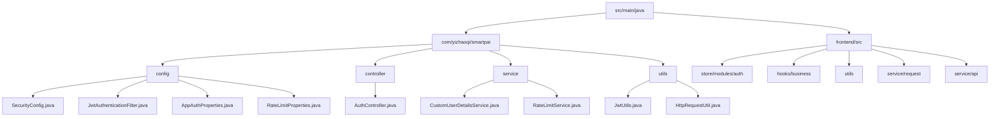
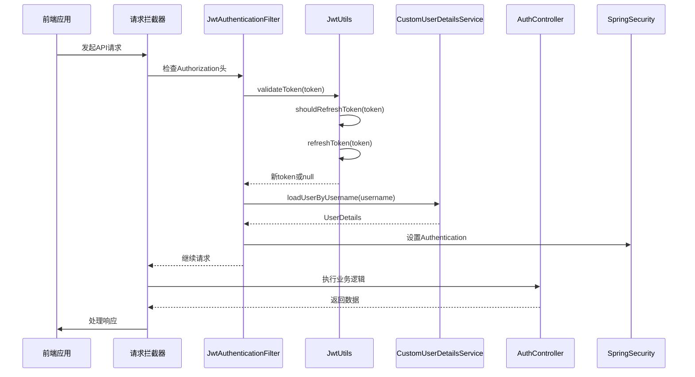
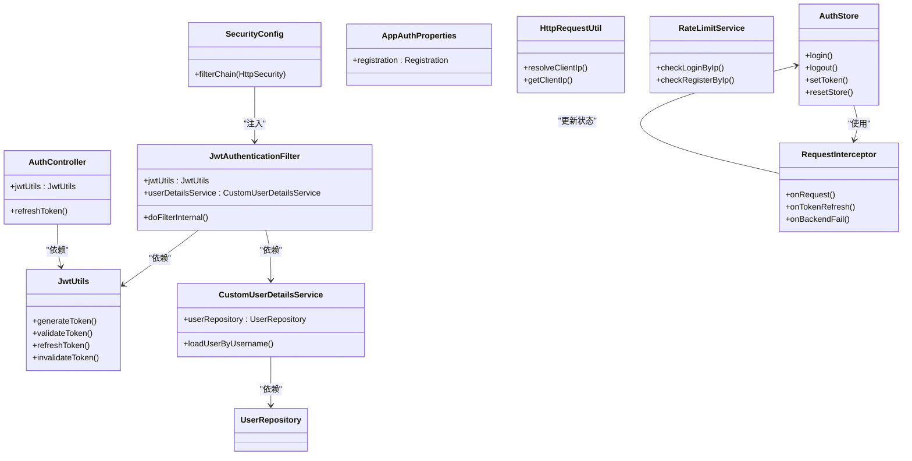

# 认证系统

<cite>
**本文档引用文件**  
- [SecurityConfig.java](file://src/main/java/com/yizhaoqi/smartpai/config/SecurityConfig.java)
- [JwtAuthenticationFilter.java](file://src/main/java/com/yizhaoqi/smartpai/config/JwtAuthenticationFilter.java)
- [JwtUtils.java](file://src/main/java/com/yizhaoqi/smartpai/utils/JwtUtils.java)
- [CustomUserDetailsService.java](file://src/main/java/com/yizhaoqi/smartpai/service/CustomUserDetailsService.java)
- [AuthController.java](file://src/main/java/com/yizhaoqi/smartpai/controller/AuthController.java)
- [AppAuthProperties.java](file://src/main/java/com/yizhaoqi/smartpai/config/AppAuthProperties.java)
- [HttpRequestUtil.java](file://src/main/java/com/yizhaoqi/smartpai/utils/HttpRequestUtil.java)
- [RateLimitService.java](file://src/main/java/com/yizhaoqi/smartpai/service/RateLimitService.java)
- [RateLimitProperties.java](file://src/main/java/com/yizhaoqi/smartpai/config/RateLimitProperties.java)
- [LogUtils.java](file://src/main/java/com/yizhaoqi/smartpai/utils/LogUtils.java)
- [application.yml](file://src/main/resources/application.yml)
- [index.ts](file://frontend/src/store/modules/auth/index.ts)
- [auth.ts](file://frontend/src/hooks/business/auth.ts)
- [storage.ts](file://frontend/src/utils/storage.ts)
- [index.ts](file://frontend/src/service/request/index.ts)
- [shared.ts](file://frontend/src/store/modules/auth/shared.ts)
- [auth.ts](file://frontend/src/service/api/auth.ts)
</cite>

## 更新摘要
**变更内容**  
- 新增统一的认证上下文提取机制，支持从JWT中提取用户ID、角色、组织标签等信息
- 前端新增认证状态管理，包括Pinia Store状态管理、Token存储和自动刷新
- 实现完整的自动令牌刷新机制，支持预刷新和过期后刷新
- 新增登出清理功能，支持单点登出和批量令牌失效
- 增强前端请求拦截器，支持无感知Token刷新和错误处理

## 目录
1. [简介](#简介)
2. [项目结构](#项目结构)
3. [核心组件](#核心组件)
4. [架构概览](#架构概览)
5. [详细组件分析](#详细组件分析)
6. [前端认证管理](#前端认证管理)
7. [自动令牌刷新机制](#自动令牌刷新机制)
8. [登出清理功能](#登出清理功能)
9. [配置管理](#配置管理)
10. [安全增强措施](#安全增强措施)
11. [性能监控](#性能监控)
12. [依赖分析](#依赖分析)
13. [性能考虑](#性能考虑)
14. [故障排除指南](#故障排除指南)
15. [结论](#结论)

## 简介
PaiSmart系统采用基于Spring Security与JWT（JSON Web Token）的无状态认证机制，实现安全、可扩展的用户身份验证。系统不仅支持传统的认证流程，还集成了现代化的安全特性，包括灵活的注册策略管理、多层代理环境下的准确IP解析、全面的速率限制保护、详细的性能监控，以及全新的前端认证状态管理和自动令牌刷新机制。该设计支持前后端分离架构，确保高并发场景下的性能与安全性。

## 项目结构
PaiSmart项目的认证相关代码主要分布在`src/main/java/com/yizhaoqi/smartpai`目录下，前端认证管理位于`frontend/src`目录，遵循典型的Spring Boot分层架构：



**图示来源**  
- [SecurityConfig.java](file://src/main/java/com/yizhaoqi/smartpai/config/SecurityConfig.java)
- [JwtAuthenticationFilter.java](file://src/main/java/com/yizhaoqi/smartpai/config/JwtAuthenticationFilter.java)
- [JwtUtils.java](file://src/main/java/com/yizhaoqi/smartpai/utils/JwtUtils.java)
- [AppAuthProperties.java](file://src/main/java/com/yizhaoqi/smartpai/config/AppAuthProperties.java)
- [HttpRequestUtil.java](file://src/main/java/com/yizhaoqi/smartpai/utils/HttpRequestUtil.java)
- [index.ts](file://frontend/src/store/modules/auth/index.ts)
- [auth.ts](file://frontend/src/hooks/business/auth.ts)
- [index.ts](file://frontend/src/service/request/index.ts)

## 核心组件
系统认证体系由十大核心组件构成：
- **SecurityConfig**：定义HTTP安全策略
- **JwtAuthenticationFilter**：JWT令牌过滤器，支持自动刷新
- **JwtUtils**：JWT工具类，支持预刷新和过期刷新
- **CustomUserDetailsService**：用户详情服务
- **AppAuthProperties**：认证配置属性
- **HttpRequestUtil**：HTTP请求工具类
- **RateLimitService**：速率限制服务
- **AuthController**：认证控制器，支持主动刷新
- **前端认证Store**：Pinia状态管理
- **请求拦截器**：Axios拦截器，支持无感知刷新

这些组件协同工作，实现从登录到权限校验的完整流程，同时提供灵活的配置管理和安全保护。

**本节来源**  
- [SecurityConfig.java:1-95](file://src/main/java/com/yizhaoqi/smartpai/config/SecurityConfig.java#L1-L95)
- [AuthController.java:1-86](file://src/main/java/com/yizhaoqi/smartpai/controller/AuthController.java#L1-L86)

## 架构概览
系统采用标准的JWT无状态认证流程，结合现代安全特性，整体架构如下：



**图示来源**  
- [JwtAuthenticationFilter.java:36-86](file://src/main/java/com/yizhaoqi/smartpai/config/JwtAuthenticationFilter.java#L36-L86)
- [JwtUtils.java:196-250](file://src/main/java/com/yizhaoqi/smartpai/utils/JwtUtils.java#L196-L250)
- [index.ts:22-33](file://frontend/src/service/request/index.ts#L22-L33)

## 详细组件分析

### SecurityConfig 配置分析
`SecurityConfig`类配置了系统的整体安全策略，包括CORS、CSRF、路径权限等。

```java
@Configuration
@EnableWebSecurity
public class SecurityConfig {
    
    @Bean
    public SecurityFilterChain filterChain(HttpSecurity http) throws Exception {
        http
            .cors().and()
            .csrf().disable()
            .sessionManagement().sessionCreationPolicy(SessionCreationPolicy.STATELESS)
            .and()
            .authorizeHttpRequests(authz -> authz
                .requestMatchers("/", "/test.html", "/static/**", "/*.js", "/*.css", "/*.ico").permitAll()
                .requestMatchers("/chat/**", "/ws/**").permitAll()
                .requestMatchers("/api/v1/users/register", "/api/v1/users/login").permitAll()
                .requestMatchers("/api/v1/test/**").permitAll()
                .requestMatchers("/api/v1/upload/**", "/api/v1/parse", "/api/v1/documents/download", 
                               "/api/v1/documents/preview", "/api/v1/documents/page-preview").hasAnyRole("USER", "ADMIN")
                .requestMatchers("/api/v1/users/conversation/**").hasAnyRole("USER", "ADMIN")
                .requestMatchers("/api/search/**").hasAnyRole("USER", "ADMIN")
                .requestMatchers("/api/v1/chat/**").hasAnyRole("USER", "ADMIN")
                .requestMatchers("/api/v1/admin/**").hasRole("ADMIN")
                .requestMatchers("/api/v1/users/primary-org").hasAnyRole("USER", "ADMIN")
                .anyRequest().authenticated())
            .addFilterBefore(jwtAuthenticationFilter, UsernamePasswordAuthenticationFilter.class)
            .addFilterAfter(orgTagAuthorizationFilter, JwtAuthenticationFilter.class);
        
        return http.build();
    }
}
```

关键配置说明：
- **CORS**：启用跨域资源共享
- **CSRF**：禁用CSRF防护（适用于无状态API）
- **Session**：采用无状态会话管理
- **路径权限**：精细化的权限控制，支持多角色访问
- **过滤器**：在用户名密码认证前插入JWT过滤器，添加组织标签授权过滤器

**本节来源**  
- [SecurityConfig.java:40-81](file://src/main/java/com/yizhaoqi/smartpai/config/SecurityConfig.java#L40-L81)

### JwtAuthenticationFilter 分析
该过滤器负责拦截请求、提取JWT令牌并完成身份认证，支持自动令牌刷新。

```mermaid
flowchart TD
A[开始] --> B{请求头包含Authorization?}
B --> |否| C[继续过滤链]
B --> |是| D[提取JWT令牌]
D --> E{令牌以Bearer开头?}
E --> |否| F[继续过滤链]
E --> |是| G[调用JwtUtils.validateToken(token)]
G --> H{令牌有效?}
H --> |是| I{shouldRefreshToken(token)?}
I --> |是| J[调用jwtUtils.refreshToken(token)]
I --> |否| K[跳过刷新]
J --> L[设置New-Token响应头]
K --> M[解析用户名]
H --> |否| N{canRefreshExpiredToken(token)?}
N --> |是| O[调用jwtUtils.refreshToken(token)]
O --> P[设置New-Token响应头]
N --> |否| Q[继续过滤链]
M --> R[调用loadUserByUsername]
R --> S[创建UsernamePasswordAuthenticationToken]
S --> T[设置SecurityContextHolder]
T --> U[继续过滤链]
P --> V[解析用户名]
V --> W[调用loadUserByUsername]
W --> X[创建UsernamePasswordAuthenticationToken]
X --> Y[设置SecurityContextHolder]
Y --> Z[继续过滤链]
```

**图示来源**  
- [JwtAuthenticationFilter.java:36-86](file://src/main/java/com/yizhaoqi/smartpai/config/JwtAuthenticationFilter.java#L36-L86)

### JwtUtils 工具类分析
`JwtUtils`提供JWT令牌的生成、验证和解析功能，支持预刷新和过期刷新机制。

```java
@Component
public class JwtUtils {
    
    private static final long EXPIRATION_TIME = 3600000; // 1小时
    private static final long REFRESH_TOKEN_EXPIRATION_TIME = 604800000; // 7天
    private static final long REFRESH_THRESHOLD = 300000; // 5分钟：预刷新阈值
    private static final long REFRESH_WINDOW = 600000; // 10分钟：过期宽限期
    
    public String generateToken(String username) {
        // 生成唯一tokenId
        String tokenId = generateTokenId();
        long expireTime = System.currentTimeMillis() + EXPIRATION_TIME;
        
        // 创建token内容，包含用户ID、角色、组织标签等信息
        Map<String, Object> claims = new HashMap<>();
        claims.put("tokenId", tokenId);
        claims.put("role", user.getRole().name());
        claims.put("userId", user.getId().toString());
        claims.put("orgTags", user.getOrgTags());
        claims.put("primaryOrg", user.getPrimaryOrg());
        
        String token = Jwts.builder()
                .setClaims(claims)
                .setSubject(username)
                .setExpiration(new Date(expireTime))
                .signWith(key, SignatureAlgorithm.HS256)
                .compact();
        
        // 缓存token信息到Redis
        tokenCacheService.cacheToken(tokenId, user.getId().toString(), username, expireTime);
        
        return token;
    }
    
    public boolean shouldRefreshToken(String token) {
        // 检查剩余时间是否少于5分钟
        Claims claims = extractClaims(token);
        long expirationTime = claims.getExpiration().getTime();
        long currentTime = System.currentTimeMillis();
        long remainingTime = expirationTime - currentTime;
        
        return remainingTime > 0 && remainingTime < REFRESH_THRESHOLD;
    }
    
    public boolean canRefreshExpiredToken(String token) {
        // 检查是否在过期后的10分钟宽限期内
        Claims claims = extractClaimsIgnoreExpiration(token);
        long expirationTime = claims.getExpiration().getTime();
        long currentTime = System.currentTimeMillis();
        long expiredTime = currentTime - expirationTime;
        
        return expiredTime > 0 && expiredTime < REFRESH_WINDOW;
    }
    
    public String refreshToken(String oldToken) {
        // 重新生成token
        Claims claims = extractClaimsIgnoreExpiration(oldToken);
        String username = claims.getSubject();
        return generateToken(username);
    }
}
```

**本节来源**  
- [JwtUtils.java:26-250](file://src/main/java/com/yizhaoqi/smartpai/utils/JwtUtils.java#L26-L250)

### CustomUserDetailsService 分析
该服务从数据库加载用户凭证信息。

```java
@Service
public class CustomUserDetailsService implements UserDetailsService {
    
    @Override
    public UserDetails loadUserByUsername(String username) throws UsernameNotFoundException {
        User user = userRepository.findByUsername(username)
            .orElseThrow(() -> new UsernameNotFoundException("用户不存在: " + username));
            
        return new org.springframework.security.core.userdetails.User(
            user.getUsername(),
            user.getPassword(),
            getAuthorities(user.getRole())
        );
    }
    
    private Collection<? extends GrantedAuthority> getAuthorities(User.Role role) {
        return Collections.singletonList(new SimpleGrantedAuthority("ROLE_" + role.name()));
    }
}
```

**本节来源**  
- [CustomUserDetailsService.java:29-49](file://src/main/java/com/yizhaoqi/smartpai/service/CustomUserDetailsService.java#L29-L49)

### AuthController 分析
`AuthController`提供主动令牌刷新接口。

```java
@RestController
@RequestMapping("/api/v1/auth")
public class AuthController {
    
    @PostMapping("/refreshToken")
    public ResponseEntity<?> refreshToken(@RequestBody RefreshTokenRequest request) {
        // 验证refreshToken是否有效
        if (!jwtUtils.validateRefreshToken(request.refreshToken())) {
            return ResponseEntity.status(401).body(Map.of("code", 401, "message", "Invalid refresh token"));
        }
        
        // 从refreshToken中提取用户名
        String username = jwtUtils.extractUsernameFromToken(request.refreshToken());
        if (username == null || username.isEmpty()) {
            return ResponseEntity.status(401).body(Map.of("code", 401, "message", "Cannot extract username from refresh token"));
        }
        
        // 生成新的token和refreshToken
        String newToken = jwtUtils.generateToken(username);
        String newRefreshToken = jwtUtils.generateRefreshToken(username);
        
        return ResponseEntity.ok(Map.of(
            "code", 200, 
            "message", "Token refreshed successfully", 
            "data", Map.of(
                "token", newToken,
                "refreshToken", newRefreshToken
            )
        ));
    }
}
```

**本节来源**  
- [AuthController.java:24-74](file://src/main/java/com/yizhaoqi/smartpai/controller/AuthController.java#L24-L74)

## 前端认证管理

### Pinia认证Store
前端使用Pinia进行状态管理，提供完整的认证状态管理功能。

```typescript
export const useAuthStore = defineStore(SetupStoreId.Auth, () => {
    const token = ref(getToken());
    const userInfo: Api.Auth.UserInfo = reactive({ ...defaultUserInfo });
    
    const isLogin = computed(() => Boolean(token.value));
    const isAdmin = computed(() => userInfo.role === 'ADMIN');
    
    // 登录功能
    async function login(userName: string, password: string, redirect = true) {
        const { data: loginToken, error } = await fetchLogin(userName, password);
        
        if (!error) {
            // 存储token和refreshToken
            localStg.set('token', loginToken.token);
            localStg.set('refreshToken', loginToken.refreshToken);
            
            // 获取用户信息
            const pass = await getUserInfo();
            if (pass) {
                token.value = loginToken.token;
            }
        }
        
        return false;
    }
    
    // 设置token（用于无缝刷新）
    function setToken(newToken: string) {
        token.value = newToken;
        localStg.set('token', newToken);
    }
    
    // 登出功能
    async function logout() {
        await fetchLogout();
        resetStore();
    }
    
    return {
        token,
        userInfo,
        isLogin,
        isAdmin,
        login,
        logout,
        setToken
    };
});
```

**本节来源**  
- [index.ts:14-209](file://frontend/src/store/modules/auth/index.ts#L14-L209)

### 请求拦截器
Axios拦截器支持无感知的Token刷新和错误处理。

```typescript
const request = createFlatRequest<App.Service.Response, RequestInstanceState>(
    {
        // ... 其他配置
    },
    {
        async onRequest(config) {
            // 自动添加Authorization头
            const Authorization = getAuthorization();
            Object.assign(config.headers, { Authorization });
            return config;
        },
        onTokenRefresh(newToken) {
            // 无感知token刷新：自动更新本地存储的token
            const authStore = useAuthStore();
            authStore.setToken(newToken);
            console.log('🔄 Token自动刷新');
        },
        async onBackendFail(response, instance) {
            const responseCode = String(response.data.code);
            
            // 处理过期token
            const expiredTokenCodes = import.meta.env.VITE_SERVICE_EXPIRED_TOKEN_CODES?.split(',') || [];
            if (expiredTokenCodes.includes(responseCode)) {
                const success = await handleExpiredRequest(request.state);
                if (success) {
                    const Authorization = getAuthorization();
                    Object.assign(response.config.headers, { Authorization });
                    return instance.request(response.config);
                }
            }
            
            // 处理需要登出的错误
            const logoutCodes = import.meta.env.VITE_SERVICE_LOGOUT_CODES?.split(',') || [];
            if (logoutCodes.includes(responseCode)) {
                authStore.resetStore();
                return null;
            }
        }
    }
);
```

**本节来源**  
- [index.ts:13-163](file://frontend/src/service/request/index.ts#L13-L163)

### 认证钩子函数
提供简化的认证状态检查功能。

```typescript
export function useAuth() {
    const authStore = useAuthStore();
    
    function hasAuth(codes: string | string[]) {
        if (!authStore.isLogin) {
            return false;
        }
        
        if (typeof codes === 'string') {
            return authStore.userInfo.role === codes;
        }
        
        return codes.includes(authStore.userInfo.role);
    }
    
    return {
        hasAuth
    };
}
```

**本节来源**  
- [auth.ts:1-22](file://frontend/src/hooks/business/auth.ts#L1-L22)

## 自动令牌刷新机制

### 预刷新机制
系统实现智能的预刷新机制，在Token剩余时间少于5分钟时自动刷新。

```mermaid
flowchart TD
A[请求到达] --> B[JwtAuthenticationFilter拦截]
B --> C[extractToken(request)]
C --> D{token存在?}
D --> |否| E[继续过滤链]
D --> |是| F[validateToken(token)]
F --> G{token有效?}
G --> |是| H{shouldRefreshToken(token)?}
H --> |否| I[解析用户名]
H --> |是| J[refreshToken(token)]
J --> K[response.setHeader("New-Token", newToken)]
K --> L[解析用户名]
G --> |否| M{canRefreshExpiredToken(token)?}
M --> |否| N[继续过滤链]
M --> |是| O[refreshToken(token)]
O --> P[response.setHeader("New-Token", newToken)]
P --> Q[解析用户名]
I --> R[设置Authentication]
L --> R
N --> S[继续过滤链]
Q --> R
R --> T[继续过滤链]
```

**图示来源**  
- [JwtAuthenticationFilter.java:42-80](file://src/main/java/com/yizhaoqi/smartpai/config/JwtAuthenticationFilter.java#L42-L80)
- [JwtUtils.java:196-229](file://src/main/java/com/yizhaoqi/smartpai/utils/JwtUtils.java#L196-L229)

### 过期后刷新机制
支持在Token过期后的10分钟宽限期内进行刷新。

```java
public boolean canRefreshExpiredToken(String token) {
    try {
        Claims claims = extractClaimsIgnoreExpiration(token);
        if (claims == null) return false;
        
        long expirationTime = claims.getExpiration().getTime();
        long currentTime = System.currentTimeMillis();
        long expiredTime = currentTime - expirationTime;
        
        return expiredTime > 0 && expiredTime < REFRESH_WINDOW;
    } catch (Exception e) {
        return false;
    }
}
```

**本节来源**  
- [JwtUtils.java:215-229](file://src/main/java/com/yizhaoqi/smartpai/utils/JwtUtils.java#L215-L229)

### 主动刷新接口
提供后端主动刷新Token的接口作为后备方案。

```java
@PostMapping("/refreshToken")
public ResponseEntity<?> refreshToken(@RequestBody RefreshTokenRequest request) {
    // 验证refreshToken
    if (!jwtUtils.validateRefreshToken(request.refreshToken())) {
        return ResponseEntity.status(401).body(Map.of("code", 401, "message", "Invalid refresh token"));
    }
    
    // 提取用户名并生成新token
    String username = jwtUtils.extractUsernameFromToken(request.refreshToken());
    String newToken = jwtUtils.generateToken(username);
    String newRefreshToken = jwtUtils.generateRefreshToken(username);
    
    return ResponseEntity.ok(Map.of(
        "code", 200, 
        "message", "Token refreshed successfully", 
        "data", Map.of("token", newToken, "refreshToken", newRefreshToken)
    ));
}
```

**本节来源**  
- [AuthController.java:24-74](file://src/main/java/com/yizhaoqi/smartpai/controller/AuthController.java#L24-L74)

## 登出清理功能

### 单点登出
支持前端发起的登出请求，清理认证状态。

```typescript
async function logout() {
    await fetchLogout();
    resetStore();
}

async function resetStore() {
    clearAuthStorage();
    token.value = '';
    Object.assign(userInfo, defaultUserInfo);
    // 清理聊天状态
    useChatStore().handleAuthReset();
    
    if (!route.meta.constant) {
        await toLogin();
    }
}
```

**本节来源**  
- [index.ts:187-193](file://frontend/src/store/modules/auth/index.ts#L187-L193)
- [index.ts:44-59](file://frontend/src/store/modules/auth/index.ts#L44-L59)

### 批量令牌失效
后端支持批量使用户的所有Token失效。

```java
public void invalidateAllUserTokens(String userId) {
    tokenCacheService.removeAllUserTokens(userId);
}

public void invalidateToken(String token) {
    String tokenId = extractTokenIdFromToken(token);
    if (tokenId != null) {
        // 加入黑名单
        tokenCacheService.blacklistToken(tokenId, expireTime);
        // 从缓存中移除
        tokenCacheService.removeToken(tokenId, userId);
    }
}
```

**本节来源**  
- [JwtUtils.java:425-432](file://src/main/java/com/yizhaoqi/smartpai/utils/JwtUtils.java#L425-L432)
- [JwtUtils.java:400-420](file://src/main/java/com/yizhaoqi/smartpai/utils/JwtUtils.java#L400-L420)

## 配置管理

### 应用配置
系统配置主要通过`application.yml`文件管理，支持环境变量覆盖。

```yaml
jwt:
  secret-key: ${JWT_SECRET_KEY:your-base64-encoded-secret-key}

app:
  auth:
    registration:
      mode: ${APP_AUTH_REGISTRATION_MODE:INVITE_ONLY}
      invite-required: ${APP_AUTH_INVITE_REQUIRED:true}

rate-limit:
  login:
    max: ${RATE_LIMIT_LOGIN_MAX:30}
    window-seconds: ${RATE_LIMIT_LOGIN_WINDOW_SECONDS:60}
```

### 前端配置
前端通过环境变量配置认证行为。

```typescript
// Token刷新相关配置
const expiredTokenCodes = import.meta.env.VITE_SERVICE_EXPIRED_TOKEN_CODES?.split(',') || [];
const logoutCodes = import.meta.env.VITE_SERVICE_LOGOUT_CODES?.split(',') || [];
const modalLogoutCodes = import.meta.env.VITE_SERVICE_MODAL_LOGOUT_CODES?.split(',') || [];

// Token存储前缀
const storagePrefix = import.meta.env.VITE_STORAGE_PREFIX || '';
```

**本节来源**  
- [application.yml:1-117](file://src/main/resources/application.yml#L1-L117)
- [index.ts:56-98](file://frontend/src/service/request/index.ts#L56-L98)

## 安全增强措施

### 注册策略管理
系统支持三种注册模式，通过`AppAuthProperties`灵活配置。

```java
private void validateRegistrationPolicy(String username, String inviteCode) {
    RegistrationMode mode = appAuthProperties.getRegistration().getMode();
    boolean inviteRequired = appAuthProperties.getRegistration().isInviteRequired() || mode == RegistrationMode.INVITE_ONLY;

    if (mode == RegistrationMode.CLOSED) {
        throw new CustomException("REGISTRATION_CLOSED", HttpStatus.FORBIDDEN);
    }

    if (inviteRequired) {
        inviteCodeService.consume(inviteCode, username);
    }
}
```

### 速率限制保护
`RateLimitService`提供多维度的请求保护。

```java
public void checkLoginByIp(String ip) {
    checkSingleWindow("login:ip:" + ip, properties.getLogin().getMax(), 
                     properties.getLogin().getWindowSeconds(), "登录请求过于频繁");
}

public void checkRegisterByIp(String ip) {
    checkSingleWindow("register:ip:" + ip, properties.getRegister().getMax(), 
                     properties.getRegister().getWindowSeconds(), "注册请求过于频繁");
}
```

### 性能监控集成
所有认证相关操作都集成性能监控。

```java
LogUtils.PerformanceMonitor monitor = LogUtils.startPerformanceMonitor("USER_LOGIN");
// ... 执行业务逻辑
monitor.end("登录成功");
```

**本节来源**  
- [UserService.java:138-150](file://src/main/java/com/yizhaoqi/smartpai/service/UserService.java#L138-L150)
- [RateLimitService.java:34-42](file://src/main/java/com/yizhaoqi/smartpai/service/RateLimitService.java#L34-L42)
- [LogUtils.java:169-194](file://src/main/java/com/yizhaoqi/smartpai/utils/LogUtils.java#L169-L194)

## 性能监控

### 性能监控器
`LogUtils.PerformanceMonitor`提供精确的性能测量。

```java
public static class PerformanceMonitor {
    private final String operation;
    private final long startTime;
    
    public PerformanceMonitor(String operation) {
        this.operation = operation;
        this.startTime = System.currentTimeMillis();
    }
    
    public void end() {
        end("");
    }
    
    public void end(String details) {
        long duration = System.currentTimeMillis() - startTime;
        logPerformance(operation, duration, details);
    }
}
```

### 日志记录策略
系统提供多层次的日志记录。

```java
public static void logUserOperation(String userId, String operation, String resource, String result) {
    try {
        MDC.put(USER_ID, userId);
        MDC.put(OPERATION, operation);
        BUSINESS_LOGGER.info("[用户操作] [用户:{}] [操作:{}] [资源:{}] [结果:{}]", 
                           userId, operation, resource, result);
    } finally {
        MDC.clear();
    }
}
```

**本节来源**  
- [LogUtils.java:42-120](file://src/main/java/com/yizhaoqi/smartpai/utils/LogUtils.java#L42-L120)

## 依赖分析
认证系统各组件间的依赖关系如下：



**图示来源**  
- [SecurityConfig.java](file://src/main/java/com/yizhaoqi/smartpai/config/SecurityConfig.java)
- [JwtAuthenticationFilter.java](file://src/main/java/com/yizhaoqi/smartpai/config/JwtAuthenticationFilter.java)
- [JwtUtils.java](file://src/main/java/com/yizhaoqi/smartpai/utils/JwtUtils.java)
- [CustomUserDetailsService.java](file://src/main/java/com/yizhaoqi/smartpai/service/CustomUserDetailsService.java)
- [AppAuthProperties.java](file://src/main/java/com/yizhaoqi/smartpai/config/AppAuthProperties.java)
- [HttpRequestUtil.java](file://src/main/java/com/yizhaoqi/smartpai/utils/HttpRequestUtil.java)
- [RateLimitService.java](file://src/main/java/com/yizhaoqi/smartpai/service/RateLimitService.java)
- [AuthController.java](file://src/main/java/com/yizhaoqi/smartpai/controller/AuthController.java)
- [index.ts](file://frontend/src/store/modules/auth/index.ts)
- [index.ts](file://frontend/src/service/request/index.ts)

## 性能考虑
1. **无状态设计**：JWT存储在客户端，减轻服务器内存压力
2. **缓存优化**：建议对`CustomUserDetailsService`的查询结果进行Redis缓存
3. **令牌有效期**：合理设置JWT过期时间（建议1小时），配合自动刷新机制
4. **密码编码**：使用BCryptPasswordEncoder确保密码安全
5. **并发处理**：无会话设计天然支持高并发
6. **IP解析优化**：使用HttpRequestUtil的快速IP解析机制
7. **速率限制**：通过Redis实现高效的请求频率控制
8. **前端状态管理**：使用Pinia进行高效的状态管理
9. **自动刷新优化**：预刷新机制减少Token过期导致的请求失败
10. **性能监控**：集成细粒度的性能监控，便于问题定位

## 故障排除指南

### 常见问题及解决方案
| 问题现象 | 可能原因 | 解决方案 |
|--------|--------|--------|
| 登录失败 | 用户名或密码错误 | 检查凭证是否正确 |
| 401未授权 | 令牌缺失或格式错误 | 确保请求头包含`Authorization: Bearer <token>` |
| 403禁止访问 | 权限不足 | 检查用户角色和路径权限配置 |
| 令牌过期 | 超时未刷新 | 检查前端自动刷新机制是否正常工作 |
| CORS错误 | 跨域配置不当 | 检查`application.yml`中的CORS配置 |
| 注册被阻止 | 注册策略配置 | 检查`app.auth.registration.mode`配置 |
| 登录频繁 | 速率限制触发 | 检查IP是否被限流，等待冷却时间 |
| IP解析错误 | 代理配置问题 | 检查代理头设置和网络拓扑 |
| 前端状态不同步 | Token未正确更新 | 检查`onTokenRefresh`回调是否执行 |
| 登出不彻底 | 令牌未失效 | 检查后端`invalidateAllUserTokens`调用 |

### 调试建议
1. 启用Spring Security调试日志
2. 使用浏览器开发者工具检查请求头和响应头
3. 检查JWT令牌的有效性（可通过[jwt.io](https://jwt.io)验证）
4. 确保`SecurityConfig`中过滤器顺序正确
5. 检查Redis连接状态（用于速率限制和Token缓存）
6. 验证代理头配置（用于准确IP解析）
7. 检查前端Pinia Store状态是否正确更新
8. 监控自动刷新机制的执行情况

**本节来源**  
- [SecurityConfig.java:40-81](file://src/main/java/com/yizhaoqi/smartpai/config/SecurityConfig.java#L40-L81)
- [application.yml](file://src/main/resources/application.yml)
- [index.ts:22-33](file://frontend/src/service/request/index.ts#L22-L33)

## 结论
PaiSmart的认证系统基于Spring Security与JWT构建，实现了安全、高效的无状态认证机制。系统通过清晰的组件划分、灵活的配置管理和全面的安全增强，确保了认证流程的可靠性与可维护性。新增的统一认证上下文提取、前端认证状态管理、自动令牌刷新和登出清理等功能，显著提升了用户体验和系统安全性。建议在生产环境中结合Redis缓存用户信息，并实现令牌刷新机制以提升用户体验。前端的Pinia状态管理和Axios拦截器提供了完整的认证状态管理解决方案，确保了前后端认证的一致性和可靠性。