# 速率限制系统

<cite>
**本文档中引用的文件**
- [RateLimitProperties.java](file://src/main/java/com/yizhaoqi/smartpai/config/RateLimitProperties.java)
- [RateLimitConfig.java](file://src/main/java/com/yizhaoqi/smartpai/model/RateLimitConfig.java)
- [RateLimitConfigService.java](file://src/main/java/com/yizhaoqi/smartpai/service/RateLimitConfigService.java)
- [RateLimitService.java](file://src/main/java/com/yizhaoqi/smartpai/service/RateLimitService.java)
- [RateLimitConfigRepository.java](file://src/main/java/com/yizhaoqi/smartpai/repository/RateLimitConfigRepository.java)
- [RateLimitExceededException.java](file://src/main/java/com/yizhaoqi/smartpai/exception/RateLimitExceededException.java)
- [UsageQuotaService.java](file://src/main/java/com/yizhaoqi/smartpai/service/UsageQuotaService.java)
- [application.yml](file://src/main/resources/application.yml)
- [ddl.sql](file://docs/databases/ddl.sql)
- [AdminController.java](file://src/main/java/com/yizhaoqi/smartpai/controller/AdminController.java)
- [index.vue](file://frontend/src/views/usage-monitor/index.vue)
</cite>

## 更新摘要
**变更内容**
- 新增运行时速率限制配置管理功能
- 新增限流策略管理接口和前端界面
- 新增用户级别和组织级别的限流控制
- 新增动态配置热更新机制
- 新增全面的限流监控和告警系统

## 目录
1. [简介](#简介)
2. [项目结构](#项目结构)
3. [核心组件](#核心组件)
4. [架构概览](#架构概览)
5. [详细组件分析](#详细组件分析)
6. [运行时配置管理](#运行时配置管理)
7. [用户和组织级别控制](#用户和组织级别控制)
8. [限流策略管理](#限流策略管理)
9. [依赖关系分析](#依赖关系分析)
10. [性能考虑](#性能考虑)
11. [故障排除指南](#故障排除指南)
12. [结论](#结论)

## 简介

速率限制系统是 PaiSmart 智能平台的核心基础设施组件，负责控制和管理各种 API 请求的频率和资源消耗。该系统采用多层防护机制，结合 Redis 分布式缓存和数据库持久化，实现了灵活且可配置的限流策略。

**更新** 系统现已支持运行时配置管理，管理员可以通过前端界面实时调整限流参数，无需重启服务即可生效。系统还集成了用户级别和组织级别的精细化控制，为不同用户群体提供差异化的限流策略。

系统主要包含三大功能模块：
- **请求频率限制**：基于滑动窗口算法的实时请求频率控制
- **资源配额管理**：基于 Token 计算的全局和用户级资源配额控制
- **运行时配置管理**：支持在线调整的动态限流策略管理

通过这种设计，系统能够有效防止滥用行为，确保服务的稳定性和公平性，同时为管理员提供动态调整配置的能力。

## 项目结构

速率限制系统在项目中的组织结构如下：

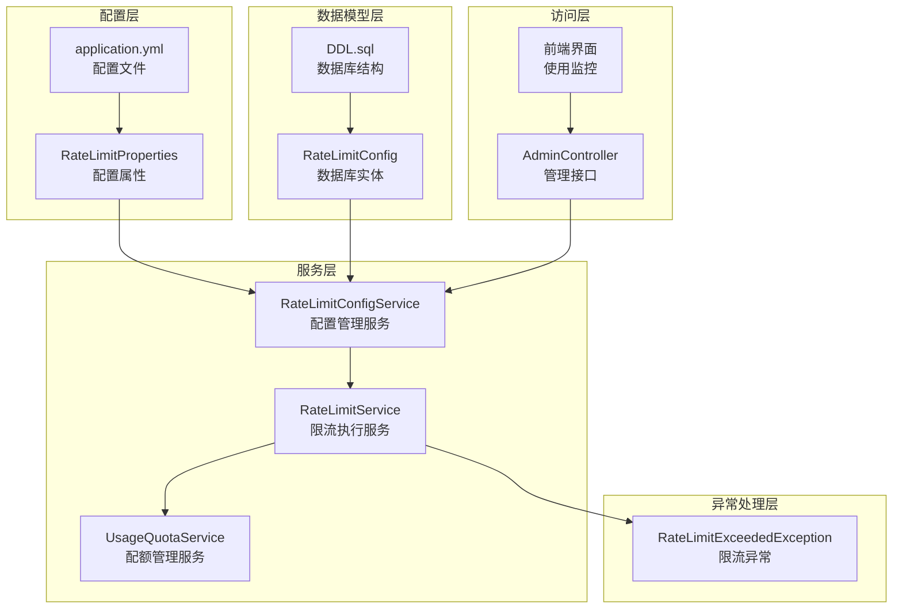

**图表来源**
- [RateLimitProperties.java:1-173](file://src/main/java/com/yizhaoqi/smartpai/config/RateLimitProperties.java#L1-L173)
- [RateLimitConfigService.java:1-280](file://src/main/java/com/yizhaoqi/smartpai/service/RateLimitConfigService.java#L1-L280)
- [RateLimitService.java:1-115](file://src/main/java/com/yizhaoqi/smartpai/service/RateLimitService.java#L1-L115)
- [UsageQuotaService.java:1-535](file://src/main/java/com/yizhaoqi/smartpai/service/UsageQuotaService.java#L1-L535)

**章节来源**
- [RateLimitProperties.java:1-173](file://src/main/java/com/yizhaoqi/smartpai/config/RateLimitProperties.java#L1-L173)
- [application.yml:96-131](file://src/main/resources/application.yml#L96-L131)

## 核心组件

### 配置属性类

系统使用 `RateLimitProperties` 类来定义默认的限流配置，包含以下几种类型的限制：

1. **单窗口限制**：如注册、登录、聊天消息等
2. **双窗口限制**：如 Embedding 查询请求
3. **令牌预算限制**：如 LLM 全局 Token、Embedding 上传 Token、Embedding 查询全网 Token

### 数据模型

`RateLimitConfig` 实体类映射到数据库表 `rate_limit_configs`，支持灵活的配置覆盖机制。

### 服务层架构

- **RateLimitConfigService**：负责配置的加载、验证、持久化和合并
- **RateLimitService**：执行具体的限流检查逻辑
- **UsageQuotaService**：管理用户 Token 配额和全局预算

**章节来源**
- [RateLimitConfigService.java:14-100](file://src/main/java/com/yizhaoqi/smartpai/service/RateLimitConfigService.java#L14-L100)
- [RateLimitService.java:10-28](file://src/main/java/com/yizhaoqi/smartpai/service/RateLimitService.java#L10-L28)

## 架构概览

速率限制系统采用分层架构设计，实现了高内聚、低耦合的模块化结构：

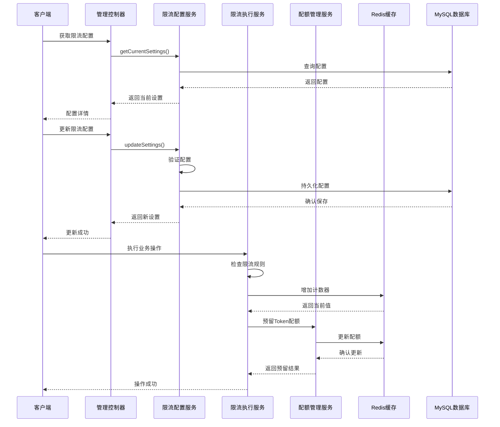

**图表来源**
- [RateLimitConfigService.java:33-67](file://src/main/java/com/yizhaoqi/smartpai/service/RateLimitConfigService.java#L33-L67)
- [RateLimitService.java:30-96](file://src/main/java/com/yizhaoqi/smartpai/service/RateLimitService.java#L30-L96)
- [UsageQuotaService.java:61-136](file://src/main/java/com/yizhaoqi/smartpai/service/UsageQuotaService.java#L61-L136)

## 详细组件分析

### RateLimitProperties 配置类

该类定义了系统默认的限流参数，采用 Spring Boot 配置属性注解进行自动绑定。

#### 配置类型详解

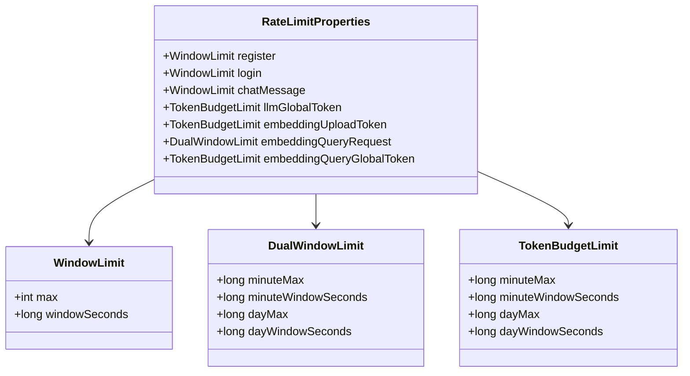

**图表来源**
- [RateLimitProperties.java:46-171](file://src/main/java/com/yizhaoqi/smartpai/config/RateLimitProperties.java#L46-L171)

#### 默认配置参数

系统提供了以下默认配置：

| 功能类别 | 配置项 | 默认值 | 说明 |
|---------|--------|--------|------|
| 注册保护 | register.max/windowSeconds | 20/600 | 20次/10分钟 |
| 登录保护 | login.max/windowSeconds | 30/60 | 30次/1分钟 |
| 聊天消息 | chat-message.max/windowSeconds | 30/60 | 30次/1分钟 |
| LLM全局Token | minuteMax/dayMax | 120000/8000000 | 分钟/日预算 |
| Embedding上传 | minuteMax/dayMax | 200000/20000000 | 分钟/日预算 |
| Embedding查询 | minuteMax/dayMax | 60/5000 | 分钟/日请求限制 |

**章节来源**
- [RateLimitProperties.java:10-16](file://src/main/java/com/yizhaoqi/smartpai/config/RateLimitProperties.java#L10-L16)
- [application.yml:96-117](file://src/main/resources/application.yml#L96-L117)

### RateLimitConfigService 配置管理服务

该服务负责限流配置的完整生命周期管理，包括加载、验证、持久化和合并。

#### 核心功能流程

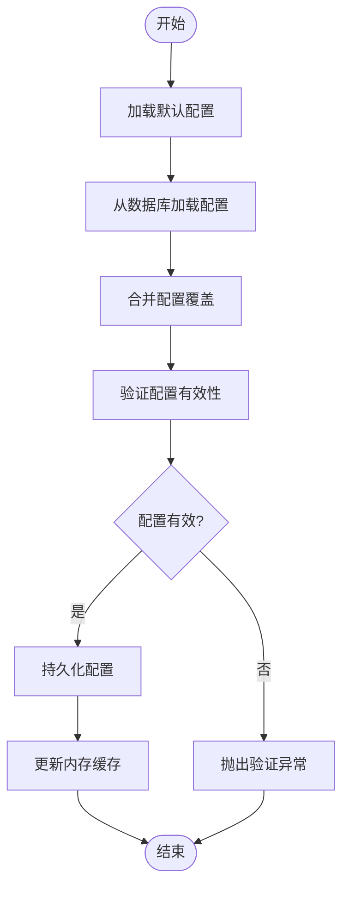

**图表来源**
- [RateLimitConfigService.java:33-171](file://src/main/java/com/yizhaoqi/smartpai/service/RateLimitConfigService.java#L33-L171)

#### 配置验证规则

服务对不同类型的配置实施严格的验证：

1. **单窗口限制验证**：确保 `max` 和 `windowSeconds` 都大于 0
2. **双窗口限制验证**：确保分钟和日限制满足 `dayMax ≥ minuteMax` 且窗口时间满足相应关系
3. **令牌预算限制验证**：确保分钟和日预算满足 `dayMax ≥ minuteMax` 且窗口时间满足相应关系

**章节来源**
- [RateLimitConfigService.java:212-251](file://src/main/java/com/yizhaoqi/smartpai/service/RateLimitConfigService.java#L212-L251)

### RateLimitService 限流执行服务

该服务实现具体的限流逻辑，使用 Redis 实现分布式计数器。

#### 单窗口限流算法

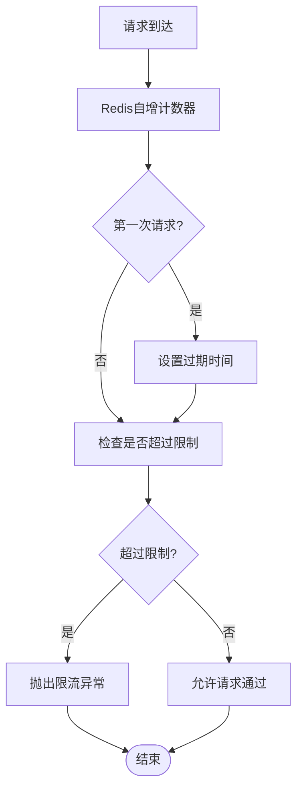

**图表来源**
- [RateLimitService.java:98-113](file://src/main/java/com/yizhaoqi/smartpai/service/RateLimitService.java#L98-L113)

#### 支持的限流场景

1. **IP级注册限制**：按 IP 地址限制注册频率
2. **IP级登录限制**：按 IP 地址限制登录尝试
3. **用户级聊天限制**：按用户 ID 限制聊天消息发送频率
4. **Embedding查询限制**：同时检查分钟和日级查询限制
5. **Token预留机制**：为 LLM 和 Embedding 操作预留 Token 配额

**章节来源**
- [RateLimitService.java:30-96](file://src/main/java/com/yizhaoqi/smartpai/service/RateLimitService.java#L30-L96)

### UsageQuotaService 配额管理服务

该服务管理复杂的 Token 配额系统，支持多种配额模式。

#### Token预留和结算流程

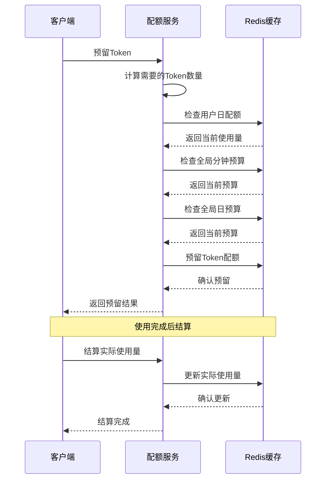

**图表来源**
- [UsageQuotaService.java:61-136](file://src/main/java/com/yizhaoqi/smartpai/service/UsageQuotaService.java#L61-L136)
- [UsageQuotaService.java:146-172](file://src/main/java/com/yizhaoqi/smartpai/service/UsageQuotaService.java#L146-L172)

#### Token计算算法

服务采用智能的 Token 计算方法，根据文本的语言特征进行精确估算：

- **ASCII字符**：按 0.30 的比例计算
- **CJK字符**（中日韩）：按 0.95 的比例计算  
- **其他字符**：按 0.55 的比例计算
- **基础开销**：每段文本额外增加 12 个 Token

**章节来源**
- [UsageQuotaService.java:271-301](file://src/main/java/com/yizhaoqi/smartpai/service/UsageQuotaService.java#L271-L301)

### 异常处理机制

系统使用专门的异常类来处理限流触发的情况：

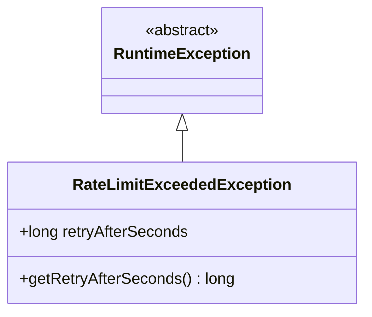

**图表来源**
- [RateLimitExceededException.java:1-15](file://src/main/java/com/yizhaoqi/smartpai/exception/RateLimitExceededException.java#L1-L15)

**章节来源**
- [RateLimitExceededException.java:3-14](file://src/main/java/com/yizhaoqi/smartpai/exception/RateLimitExceededException.java#L3-L14)

## 运行时配置管理

**新增** 系统现在支持完全的运行时配置管理，管理员可以通过 RESTful API 和前端界面实时调整限流参数。

### 管理接口

系统提供了完整的管理接口来支持运行时配置：

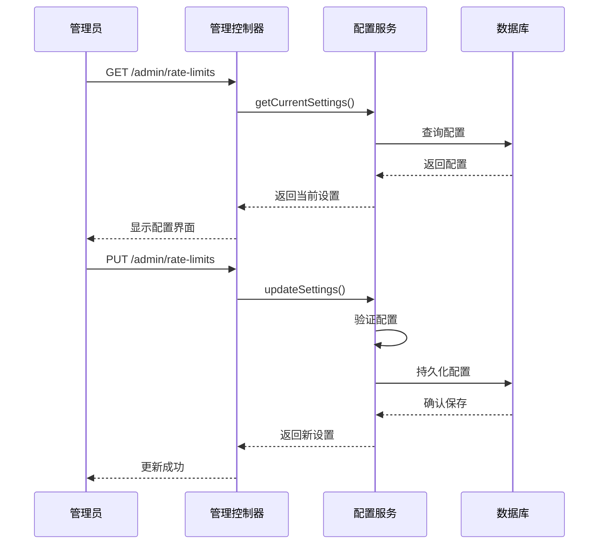

**图表来源**
- [AdminController.java:241-280](file://src/main/java/com/yizhaoqi/smartpai/controller/AdminController.java#L241-L280)

### 配置视图模型

系统使用强类型的配置视图模型来确保配置的一致性和安全性：

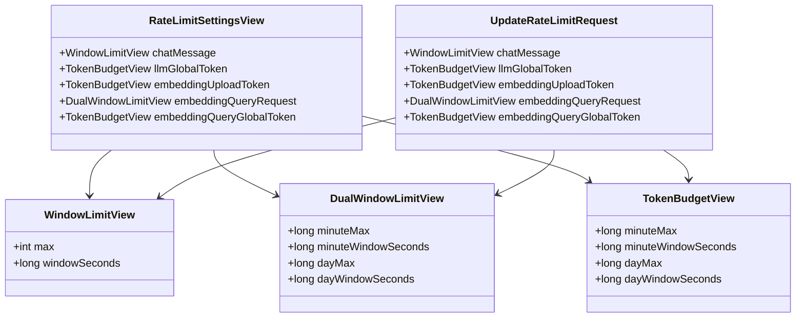

**图表来源**
- [RateLimitConfigService.java:253-279](file://src/main/java/com/yizhaoqi/smartpai/service/RateLimitConfigService.java#L253-L279)

### 前端管理界面

管理员可以通过直观的前端界面管理限流配置：

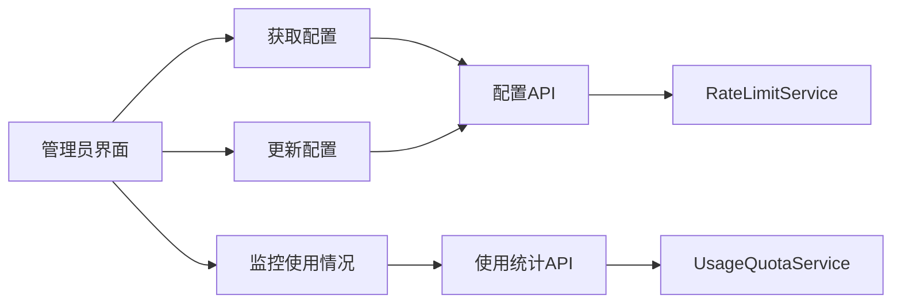

**图表来源**
- [index.vue:93-125](file://frontend/src/views/usage-monitor/index.vue#L93-L125)

**章节来源**
- [AdminController.java:241-280](file://src/main/java/com/yizhaoqi/smartpai/controller/AdminController.java#L241-L280)
- [index.vue:1-200](file://frontend/src/views/usage-monitor/index.vue#L1-L200)

## 用户和组织级别控制

**新增** 系统现在支持用户级别和组织级别的精细化限流控制，为不同用户群体提供差异化的服务体验。

### 组织标签集成

系统与组织标签体系深度集成，支持基于组织的限流策略：

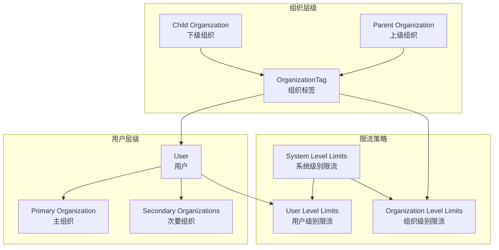

### 组织级别限流策略

系统支持基于组织标签的限流策略，包括：

1. **上传大小限制**：基于组织标签设置文件上传大小上限
2. **请求频率限制**：为不同组织设置差异化的请求频率限制
3. **资源配额分配**：按组织分配不同的 Token 配额
4. **服务等级控制**：根据组织级别提供不同的服务等级

### 用户级别个性化控制

系统支持用户级别的个性化限流控制：

1. **个人配额管理**：为VIP用户提供更高的配额
2. **使用行为分析**：基于用户历史使用行为调整限流策略
3. **动态配额调整**：根据用户活跃度动态调整配额
4. **特殊权限控制**：为重要用户提供特殊权限

## 限流策略管理

**新增** 系统提供了全面的限流策略管理功能，支持多种限流策略的组合和应用。

### 策略类型

系统支持以下限流策略：

1. **时间窗口策略**：基于固定时间窗口的请求限制
2. **令牌桶策略**：基于令牌桶算法的流量整形
3. **漏桶策略**：基于漏桶算法的恒定速率控制
4. **自适应策略**：基于系统负载的自适应限流

### 策略组合

系统支持多种策略的组合使用：

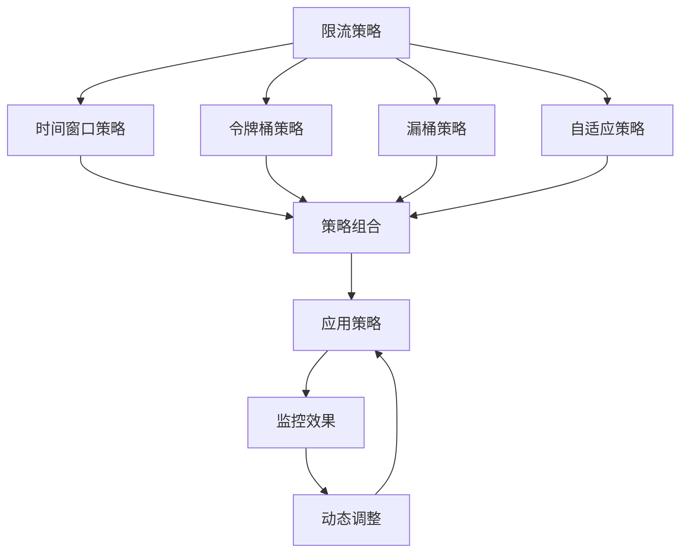

### 策略监控和告警

系统提供了完善的策略监控和告警机制：

1. **实时监控**：监控各类策略的执行效果
2. **性能指标**：收集和分析限流相关的性能指标
3. **异常告警**：当策略效果不佳时及时告警
4. **自动调整**：根据监控结果自动调整策略参数

## 依赖关系分析

速率限制系统各组件之间的依赖关系如下：

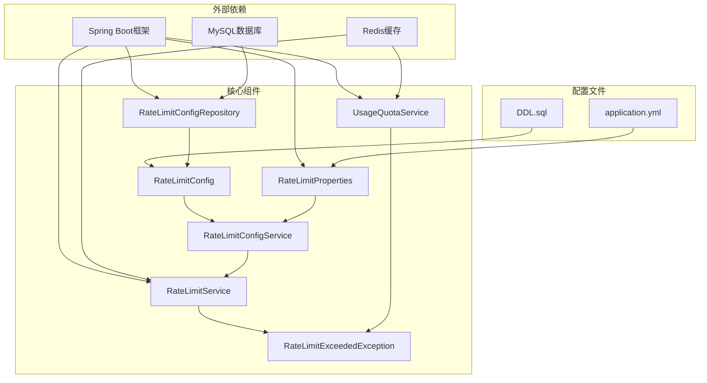

**图表来源**
- [RateLimitConfigRepository.java:1-7](file://src/main/java/com/yizhaoqi/smartpai/repository/RateLimitConfigRepository.java#L1-L7)
- [RateLimitService.java:13-28](file://src/main/java/com/yizhaoqi/smartpai/service/RateLimitService.java#L13-L28)
- [UsageQuotaService.java:32-38](file://src/main/java/com/yizhaoqi/smartpai/service/UsageQuotaService.java#L32-L38)

### 组件耦合度分析

- **低耦合设计**：各服务层职责明确，相互独立
- **依赖注入**：通过 Spring 容器管理依赖关系
- **接口隔离**：每个服务都有清晰的职责边界

**章节来源**
- [RateLimitConfigService.java:22-31](file://src/main/java/com/yizhaoqi/smartpai/service/RateLimitConfigService.java#L22-L31)
- [RateLimitService.java:18-28](file://src/main/java/com/yizhaoqi/smartpai/service/RateLimitService.java#L18-L28)

## 性能考虑

### Redis 性能优化

1. **原子性操作**：使用 Redis 的原子性自增操作确保计数准确性
2. **过期时间管理**：合理设置 TTL 避免内存泄漏
3. **批量操作**：在可能的情况下减少网络往返

### 内存使用优化

1. **配置缓存**：使用 `volatile` 关键字确保配置的可见性
2. **对象池化**：复用 TokenReservation 对象减少 GC 压力
3. **延迟初始化**：按需创建和初始化资源

### 可扩展性设计

1. **水平扩展**：基于 Redis 的分布式特性支持多实例部署
2. **配置热更新**：支持在线调整限流参数无需重启
3. **监控集成**：提供详细的使用统计和告警机制

## 故障排除指南

### 常见问题及解决方案

#### 1. 限流配置不生效

**症状**：修改配置后限流规则没有变化

**排查步骤**：
1. 检查数据库中是否存在对应的配置记录
2. 验证配置的 JSON 格式是否正确
3. 确认服务重启后配置是否正确加载

**解决方法**：
```sql
-- 检查配置表状态
SELECT * FROM rate_limit_configs WHERE config_key = 'chat-message';

-- 清理缓存重新加载
-- 重启服务或调用配置刷新接口
```

#### 2. Token 预留失败

**症状**：用户请求被拒绝，提示 Token 预留失败

**排查步骤**：
1. 检查用户的日配额是否已用完
2. 验证全局分钟预算是否超限
3. 确认 Redis 连接状态

**解决方法**：
- 等待到下一个自然日重置
- 调整用户的配额限制
- 检查 Redis 服务器状态

#### 3. 配置验证错误

**症状**：更新配置时报验证失败

**常见错误类型**：
- 日限额小于分钟限额
- 窗口时间设置不合理
- 参数值非正数

**解决方法**：
确保配置满足以下约束条件：
- `dayMax ≥ minuteMax`
- `dayWindowSeconds ≥ minuteWindowSeconds`
- 所有数值必须大于 0

### 监控和诊断

#### Redis 键空间分析

系统使用的 Redis 键命名规范：
- `register:ip:{ip}`：注册请求计数器
- `login:ip:{ip}`：登录请求计数器  
- `chat:user:{userId}`：聊天消息计数器
- `embedding:query:min:user:{userId}`：Embedding查询分钟计数器
- `embedding:query:day:user:{userId}`：Embedding查询日计数器
- `quota:llm:{date}:user:{userId}`：LLM使用量配额
- `budget:llm:global:{window}`：LLM全局预算

#### 前端监控界面

管理员可以通过前端界面查看和管理限流配置：


**图表来源**
- [index.vue:93-125](file://frontend/src/views/usage-monitor/index.vue#L93-L125)

**章节来源**
- [RateLimitConfigService.java:212-251](file://src/main/java/com/yizhaoqi/smartpai/service/RateLimitConfigService.java#L212-L251)
- [index.vue:1-200](file://frontend/src/views/usage-monitor/index.vue#L1-L200)

## 结论

PaiSmart 的速率限制系统通过精心设计的多层架构，实现了高效、灵活且可扩展的资源管理机制。系统的主要优势包括：

### 技术优势

1. **多层次防护**：从 IP 级别的简单限制到用户级的复杂配额管理
2. **智能 Token 计算**：基于语言特征的精确 Token 估算算法
3. **灵活配置管理**：支持在线调整和持久化的配置机制
4. **高性能实现**：基于 Redis 的原子性操作确保高并发下的准确性
5. **运行时配置管理**：支持完全的在线配置调整和热更新
6. **用户组织级控制**：提供精细化的用户和组织级别限流控制
7. **全面监控告警**：完善的监控系统和告警机制

### 架构特点

1. **模块化设计**：清晰的职责分离和低耦合的组件结构
2. **可扩展性**：支持水平扩展和配置热更新
3. **监控完善**：提供详细的使用统计和告警机制
4. **异常处理**：完善的异常处理和恢复机制
5. **用户友好**：直观的前端管理界面和 API 接口

### 应用价值

该系统为 PaiSmart 平台提供了坚实的基础保障，确保了服务的稳定性、公平性和可持续发展能力。通过合理的资源配置和动态调整，系统能够在保证用户体验的同时，有效控制资源消耗和运营成本。

**更新** 新增的运行时配置管理、限流策略管理和用户/组织级别控制功能，使得系统更加智能化和人性化，能够更好地适应不同场景和用户需求。

未来可以进一步优化的方向包括：引入更高级的机器学习算法进行流量预测、增强多租户隔离能力、提供更丰富的可视化监控面板、支持更复杂的限流策略组合等。