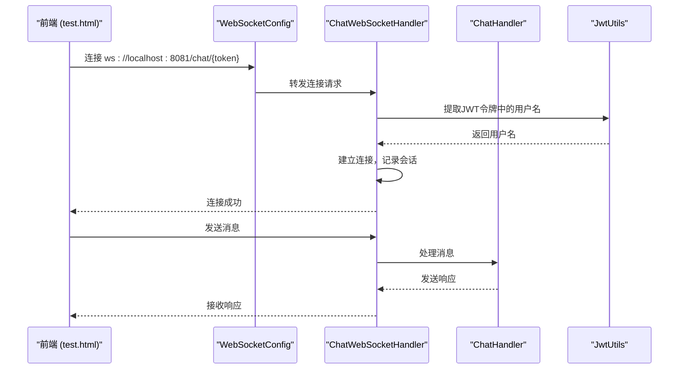
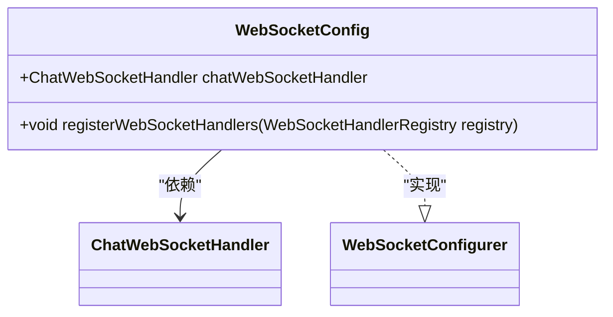
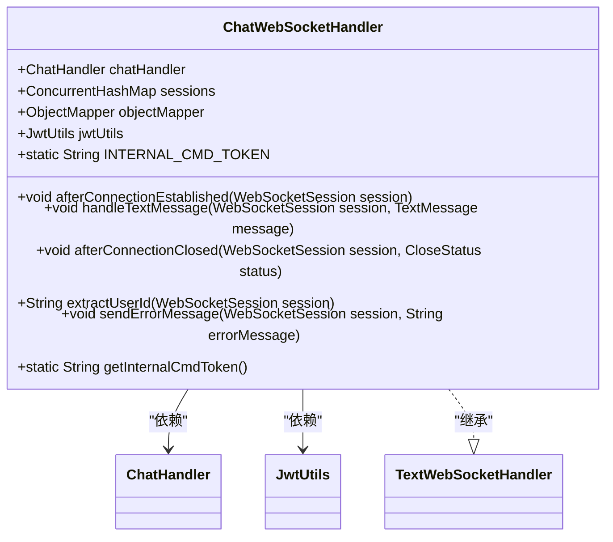
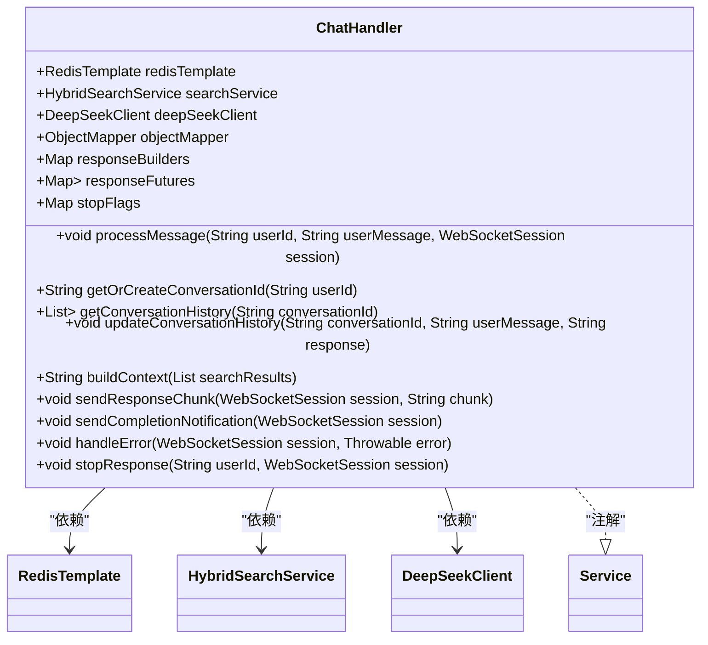
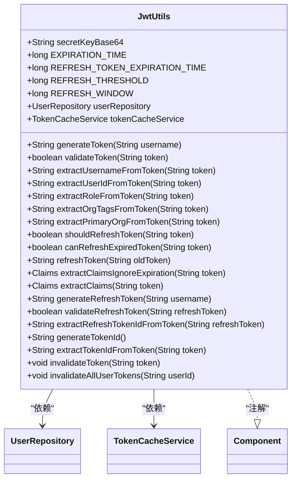
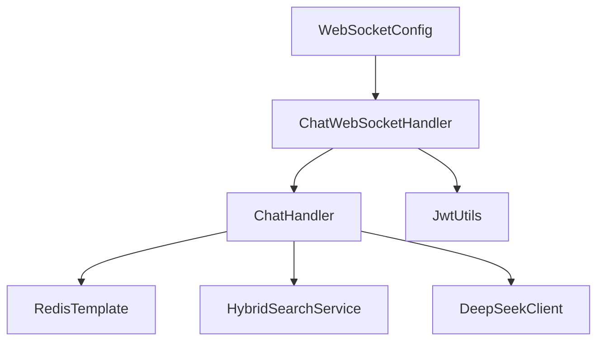

# WebSocket配置

<cite>
**本文档引用的文件**   
- [WebSocketConfig.java](file://src/main/java/com/yizhaoqi/smartpai/config/WebSocketConfig.java#L1-L24)
- [ChatWebSocketHandler.java](file://src/main/java/com/yizhaoqi/smartpai/handler/ChatWebSocketHandler.java#L1-L122)
- [ChatHandler.java](file://src/main/java/com/yizhaoqi/smartpai/service/ChatHandler.java#L1-L401)
- [JwtUtils.java](file://src/main/java/com/yizhaoqi/smartpai/utils/JwtUtils.java#L1-L434)
- [test.html](file://src/main/resources/static/test.html#L500-L700)
</cite>

## 目录
1. [引言](#引言)
2. [项目结构](#项目结构)
3. [核心组件](#核心组件)
4. [架构概述](#架构概述)
5. [详细组件分析](#详细组件分析)
6. [依赖分析](#依赖分析)
7. [性能考虑](#性能考虑)
8. [故障排除指南](#故障排除指南)
9. [结论](#结论)

## 引言
本文档详细说明了PaiSmart项目中WebSocket的配置实现，重点解析了WebSocketConfig类中的端点注册、消息转换器配置和跨域策略设置。文档阐述了STOMP协议的集成方式与SockJS的降级支持机制，确保在不同网络环境下的连接兼容性。同时，解释了WebSocket路径映射规则、握手拦截器的实现逻辑以及如何通过自定义HandshakeInterceptor注入用户会话信息。最后，提供了性能调优建议，包括缓冲区大小、并发连接数限制和心跳间隔配置，确保高并发场景下的稳定通信。

## 项目结构
PaiSmart项目的WebSocket相关代码主要分布在后端的`src/main/java/com/yizhaoqi/smartpai`目录下，包括配置、处理器、服务和工具类。前端的WebSocket测试页面位于`src/main/resources/static/test.html`中，用于验证WebSocket功能。

```mermaid
graph TD
subgraph "后端"
WebSocketConfig[WebSocketConfig.java]
ChatWebSocketHandler[ChatWebSocketHandler.java]
ChatHandler[ChatHandler.java]
JwtUtils[JwtUtils.java]
end
subgraph "前端"
testHtml[test.html]
end
WebSocketConfig --> ChatWebSocketHandler : "依赖"
ChatWebSocketHandler --> ChatHandler : "依赖"
ChatWebSocketHandler --> JwtUtils : "依赖"
testHtml --> WebSocketConfig : "连接"
```

**图示来源**
- [WebSocketConfig.java](file://src/main/java/com/yizhaoqi/smartpai/config/WebSocketConfig.java#L1-L24)
- [ChatWebSocketHandler.java](file://src/main/java/com/yizhaoqi/smartpai/handler/ChatWebSocketHandler.java#L1-L122)
- [test.html](file://src/main/resources/static/test.html#L500-L700)

**本节来源**
- [WebSocketConfig.java](file://src/main/java/com/yizhaoqi/smartpai/config/WebSocketConfig.java#L1-L24)
- [ChatWebSocketHandler.java](file://src/main/java/com/yizhaoqi/smartpai/handler/ChatWebSocketHandler.java#L1-L122)
- [test.html](file://src/main/resources/static/test.html#L500-L700)

## 核心组件
PaiSmart的WebSocket实现由几个核心组件构成：`WebSocketConfig`负责配置和注册WebSocket处理器，`ChatWebSocketHandler`处理WebSocket的连接、消息和关闭事件，`ChatHandler`处理业务逻辑，`JwtUtils`用于解析JWT令牌以提取用户信息。

**本节来源**
- [WebSocketConfig.java](file://src/main/java/com/yizhaoqi/smartpai/config/WebSocketConfig.java#L1-L24)
- [ChatWebSocketHandler.java](file://src/main/java/com/yizhaoqi/smartpai/handler/ChatWebSocketHandler.java#L1-L122)
- [ChatHandler.java](file://src/main/java/com/yizhaoqi/smartpai/service/ChatHandler.java#L1-L401)
- [JwtUtils.java](file://src/main/java/com/yizhaoqi/smartpai/utils/JwtUtils.java#L1-L434)

## 架构概述
PaiSmart的WebSocket架构采用Spring WebSocket框架，通过`WebSocketConfig`类配置WebSocket处理器，并使用`ChatWebSocketHandler`处理WebSocket事件。前端通过`test.html`页面连接到后端WebSocket服务，使用JWT令牌进行身份验证。



**图示来源**
- [WebSocketConfig.java](file://src/main/java/com/yizhaoqi/smartpai/config/WebSocketConfig.java#L1-L24)
- [ChatWebSocketHandler.java](file://src/main/java/com/yizhaoqi/smartpai/handler/ChatWebSocketHandler.java#L1-L122)
- [ChatHandler.java](file://src/main/java/com/yizhaoqi/smartpai/service/ChatHandler.java#L1-L401)
- [test.html](file://src/main/resources/static/test.html#L500-L700)

## 详细组件分析

### WebSocket配置分析
`WebSocketConfig`类是WebSocket配置的核心，它实现了`WebSocketConfigurer`接口，并通过`@EnableWebSocket`注解启用WebSocket支持。

#### 配置类结构


**图示来源**
- [WebSocketConfig.java](file://src/main/java/com/yizhaoqi/smartpai/config/WebSocketConfig.java#L1-L24)

#### 端点注册与跨域策略
`registerWebSocketHandlers`方法注册了WebSocket处理器，并设置了跨域策略。

```java
@Override
public void registerWebSocketHandlers(WebSocketHandlerRegistry registry) {
    registry.addHandler(chatWebSocketHandler, "/chat/{token}")
            .setAllowedOrigins("*"); // 允许所有来源访问，生产环境应该限制
}
```

该配置将`ChatWebSocketHandler`注册到`/chat/{token}`路径，并允许所有来源访问。在生产环境中，应限制为特定的来源。

**本节来源**
- [WebSocketConfig.java](file://src/main/java/com/yizhaoqi/smartpai/config/WebSocketConfig.java#L1-L24)

### WebSocket处理器分析
`ChatWebSocketHandler`类继承自`TextWebSocketHandler`，处理WebSocket的文本消息。

#### 处理器类结构


**图示来源**
- [ChatWebSocketHandler.java](file://src/main/java/com/yizhaoqi/smartpai/handler/ChatWebSocketHandler.java#L1-L122)

#### 连接建立与用户会话注入
`afterConnectionEstablished`方法在WebSocket连接建立时被调用，提取用户ID并记录会话。

```java
@Override
public void afterConnectionEstablished(WebSocketSession session) {
    String userId = extractUserId(session);
    sessions.put(userId, session);
    logger.info("WebSocket连接已建立，用户ID: {}，会话ID: {}，URI路径: {}", 
                userId, session.getId(), session.getUri().getPath());
}
```

`extractUserId`方法从WebSocket路径中提取JWT令牌，并使用`JwtUtils`解析出用户名。

```java
private String extractUserId(WebSocketSession session) {
    String path = session.getUri().getPath();
    String[] segments = path.split("/");
    String jwtToken = segments[segments.length - 1];
    
    // 从JWT令牌中提取用户名
    String username = jwtUtils.extractUsernameFromToken(jwtToken);
    if (username == null) {
        logger.warn("无法从JWT令牌中提取用户名，使用令牌作为用户ID: {}", jwtToken);
        return jwtToken;
    }
    
    logger.debug("从JWT令牌中提取的用户名: {}", username);
    return username;
}
```

**本节来源**
- [ChatWebSocketHandler.java](file://src/main/java/com/yizhaoqi/smartpai/handler/ChatWebSocketHandler.java#L1-L122)

#### 消息处理与停止指令
`handleTextMessage`方法处理接收到的文本消息，支持普通消息和JSON格式的系统指令。

```java
@Override
protected void handleTextMessage(WebSocketSession session, TextMessage message) {
    String userId = extractUserId(session);
    try {
        String payload = message.getPayload();
        logger.info("接收到消息，用户ID: {}，会话ID: {}，消息长度: {}", 
                   userId, session.getId(), payload.length());
        
        // 检查是否是JSON格式的系统指令
        if (payload.trim().startsWith("{")) {
            try {
                Map<String, Object> jsonMessage = objectMapper.readValue(payload, Map.class);
                String messageType = (String) jsonMessage.get("type");
                String internalToken = (String) jsonMessage.get("_internal_cmd_token");
                
                // 只有包含正确内部令牌的停止指令才处理
                if ("stop".equals(messageType) && INTERNAL_CMD_TOKEN.equals(internalToken)) {
                    // 处理停止指令
                    logger.info("收到有效的停止按钮指令，用户ID: {}，会话ID: {}", userId, session.getId());
                    chatHandler.stopResponse(userId, session);
                    return;
                }
                
                // 其他JSON消息当作普通消息处理
                logger.debug("收到JSON格式的聊天消息，当作普通消息处理");
            } catch (Exception jsonParseError) {
                // JSON解析失败，当作普通文本消息处理
                logger.debug("JSON解析失败，当作普通消息处理: {}", jsonParseError.getMessage());
            }
        }
        
        // 普通聊天消息处理（保持向下兼容）
        chatHandler.processMessage(userId, payload, session);
        
    } catch (Exception e) {
        logger.error("处理消息出错，用户ID: {}，会话ID: {}，错误: {}", 
                    userId, session.getId(), e.getMessage(), e);
        sendErrorMessage(session, "消息处理失败：" + e.getMessage());
    }
}
```

**本节来源**
- [ChatWebSocketHandler.java](file://src/main/java/com/yizhaoqi/smartpai/handler/ChatWebSocketHandler.java#L1-L122)

### 聊天处理服务分析
`ChatHandler`类负责处理WebSocket聊天消息和管理对话历史。

#### 服务类结构


**图示来源**
- [ChatHandler.java](file://src/main/java/com/yizhaoqi/smartpai/service/ChatHandler.java#L1-L401)

#### 消息处理流程
`processMessage`方法处理用户消息，调用DeepSeek API生成回复，并通过WebSocket发送响应。

```java
public void processMessage(String userId, String userMessage, WebSocketSession session) {
    logger.info("开始处理消息，用户ID: {}, 会话ID: {}", userId, session.getId());
    try {
        // 1. 获取或创建会话 ID
        String conversationId = getOrCreateConversationId(userId);
        logger.info("会话ID: {}, 用户ID: {}", conversationId, userId);
        
        // 为当前会话创建响应构建器
        responseBuilders.put(session.getId(), new StringBuilder());
        // 创建一个CompletableFuture来跟踪响应完成状态
        CompletableFuture<String> responseFuture = new CompletableFuture<>();
        responseFutures.put(session.getId(), responseFuture);
        
        // 2. 获取对话历史
        List<Map<String, String>> history = getConversationHistory(conversationId);
        logger.debug("获取到 {} 条历史对话", history.size());
        
        // 3. 执行带权限过滤的混合搜索
        List<SearchResult> searchResults = searchService.searchWithPermission(userMessage, userId, 5);
        logger.debug("搜索结果数量: {}", searchResults.size());
        
        // 4. 构建上下文
        String context = buildContext(searchResults);
        
        // 5. 调用 DeepSeek API 并处理流式响应
        logger.info("调用DeepSeek API生成回复");
        deepSeekClient.streamResponse(userMessage, context, history, 
            chunk -> {
                // 累积响应内容
                StringBuilder responseBuilder = responseBuilders.get(session.getId());
                if (responseBuilder != null) {
                    responseBuilder.append(chunk);
                }
                sendResponseChunk(session, chunk);
            },
            error -> {
                // 处理错误并完成future
                handleError(session, error);
                // 发送响应完成通知（错误情况）
                sendCompletionNotification(session);
                responseFuture.completeExceptionally(error);
                // 清理会话响应构建器
                responseBuilders.remove(session.getId());
                responseFutures.remove(session.getId());
            });
        
        // 6. 启动一个后台任务检查并标记响应完成
        new Thread(() -> {
            try {
                // 等待最多30秒，给API足够的响应时间
                Thread.sleep(3000); // 先等待3秒钟，让API有时间开始响应
                
                // 获取当前累积的响应内容
                StringBuilder responseBuilder = responseBuilders.get(session.getId());
                
                // 如果响应构建器存在并且已有内容，认为响应已完成
                if (responseBuilder != null) {
                    // 记录最后2秒的响应变化，检测是否停止增长
                    String lastResponse = responseBuilder.toString();
                    int lastLength = lastResponse.length();
                    
                    Thread.sleep(2000); // 再等待2秒
                    
                    // 再次检查是否有新内容
                    if (responseBuilder.length() == lastLength) {
                        // 没有新内容，可以认为响应已完成
                        responseFuture.complete(responseBuilder.toString());
                        logger.info("DeepSeek响应已完成，长度: {}", responseBuilder.length());
                        
                        // 发送响应完成通知
                        sendCompletionNotification(session);
                        
                        // 更新对话历史
                        String completeResponse = responseBuilder.toString();
                        updateConversationHistory(conversationId, userMessage, completeResponse);
                        
                        // 输出对话存储信息以便调试
                        String redisKey = "user:" + userId + ":current_conversation";
                        logger.info("对话存储信息 - Redis键: {}, 值: {}", redisKey, conversationId);
                        
                        // 清理会话响应构建器
                        responseBuilders.remove(session.getId());
                        responseFutures.remove(session.getId());
                        logger.info("消息处理完成，用户ID: {}", userId);
                    } else {
                        // 仍有新内容，继续等待
                        logger.debug("响应仍在继续，等待完成...");
                        // 再等待最多25秒
                        for (int i = 0; i < 5; i++) {
                            Thread.sleep(5000);
                            if (responseBuilder != null) {
                                lastLength = responseBuilder.length();
                                // 再次检查2秒内是否有新内容
                                Thread.sleep(2000);
                                if (responseBuilder.length() == lastLength) {
                                    // 没有新内容，可以认为响应已完成
                                    responseFuture.complete(responseBuilder.toString());
                                    
                                    // 发送响应完成通知
                                    sendCompletionNotification(session);
                                    
                                    // 更新对话历史
                                    String completeResponse = responseBuilder.toString();
                                    updateConversationHistory(conversationId, userMessage, completeResponse);
                                    
                                    // 输出对话存储信息以便调试
                                    String redisKey = "user:" + userId + ":current_conversation";
                                    logger.info("对话存储信息 - Redis键: {}, 值: {}", redisKey, conversationId);
                                    
                                    // 清理会话响应构建器
                                    responseBuilders.remove(session.getId());
                                    responseFutures.remove(session.getId());
                                    logger.info("消息处理完成，用户ID: {}", userId);
                                    return;
                                }
                            }
                        }
                        
                        // 如果经过多次检查仍未完成，强制完成
                        if (!responseFuture.isDone()) {
                            responseFuture.complete(responseBuilder.toString());
                            
                            // 发送响应完成通知
                            sendCompletionNotification(session);
                            
                            // 更新对话历史
                            String completeResponse = responseBuilder.toString();
                            updateConversationHistory(conversationId, userMessage, completeResponse);
                            
                            // 输出对话存储信息以便调试
                            String redisKey = "user:" + userId + ":current_conversation";
                            logger.info("对话存储信息 - Redis键: {}, 值: {}", redisKey, conversationId);
                            
                            // 清理会话响应构建器
                            responseBuilders.remove(session.getId());
                            responseFutures.remove(session.getId());
                            logger.info("消息处理强制完成，用户ID: {}", userId);
                        }
                    }
                } else {
                    logger.warn("响应构建器为空，可能出现了错误，会话ID: {}", session.getId());
                    RuntimeException exception = new RuntimeException("响应构建器为空");
                    responseFuture.completeExceptionally(exception);
                    // 发送错误消息
                    handleError(session, exception);
                }
            } catch (Exception e) {
                logger.error("检查响应完成时出错: {}", e.getMessage(), e);
                responseFuture.completeExceptionally(e);
                
                // 清理会话响应构建器
                responseBuilders.remove(session.getId());
                responseFutures.remove(session.getId());
            }
        }).start();
        
    } catch (Exception e) {
        logger.error("处理消息错误: {}", e.getMessage(), e);
        handleError(session, e);
        // 清理会话响应构建器
        responseBuilders.remove(session.getId());
        // 清理响应future
        CompletableFuture<String> future = responseFutures.remove(session.getId());
        if (future != null && !future.isDone()) {
            future.completeExceptionally(e);
        }
    }
}
```

**本节来源**
- [ChatHandler.java](file://src/main/java/com/yizhaoqi/smartpai/service/ChatHandler.java#L1-L401)

### JWT工具类分析
`JwtUtils`类用于生成、验证和解析JWT令牌。

#### 工具类结构


**图示来源**
- [JwtUtils.java](file://src/main/java/com/yizhaoqi/smartpai/utils/JwtUtils.java#L1-L434)

#### JWT令牌解析
`extractUsernameFromToken`方法从JWT令牌中提取用户名。

```java
public String extractUsernameFromToken(String token) {
    try {
        Claims claims = extractClaimsIgnoreExpiration(token);
        return claims != null ? claims.getSubject() : null;
    } catch (Exception e) {
        logger.error("Error extracting username from token: {}", token, e);
        return null;
    }
}
```

**本节来源**
- [JwtUtils.java](file://src/main/java/com/yizhaoqi/smartpai/utils/JwtUtils.java#L1-L434)

## 依赖分析
PaiSmart的WebSocket组件之间存在明确的依赖关系。`WebSocketConfig`依赖`ChatWebSocketHandler`，`ChatWebSocketHandler`依赖`ChatHandler`和`JwtUtils`，`ChatHandler`依赖`RedisTemplate`、`HybridSearchService`和`DeepSeekClient`。



**图示来源**
- [WebSocketConfig.java](file://src/main/java/com/yizhaoqi/smartpai/config/WebSocketConfig.java#L1-L24)
- [ChatWebSocketHandler.java](file://src/main/java/com/yizhaoqi/smartpai/handler/ChatWebSocketHandler.java#L1-L122)
- [ChatHandler.java](file://src/main/java/com/yizhaoqi/smartpai/service/ChatHandler.java#L1-L401)

**本节来源**
- [WebSocketConfig.java](file://src/main/java/com/yizhaoqi/smartpai/config/WebSocketConfig.java#L1-L24)
- [ChatWebSocketHandler.java](file://src/main/java/com/yizhaoqi/smartpai/handler/ChatWebSocketHandler.java#L1-L122)
- [ChatHandler.java](file://src/main/java/com/yizhaoqi/smartpai/service/ChatHandler.java#L1-L401)

## 性能考虑
为了确保高并发场景下的稳定通信，建议进行以下性能调优：

1. **缓冲区大小**：调整WebSocket的缓冲区大小，以适应大消息的传输。
2. **并发连接数限制**：设置最大并发连接数，防止资源耗尽。
3. **心跳间隔配置**：配置合理的心跳间隔，保持连接活跃。

## 故障排除指南
1. **连接失败**：检查WebSocket端点是否正确，确保JWT令牌有效。
2. **消息丢失**：检查网络连接，确保WebSocket连接稳定。
3. **响应延迟**：优化后端处理逻辑，减少响应时间。

**本节来源**
- [WebSocketConfig.java](file://src/main/java/com/yizhaoqi/smartpai/config/WebSocketConfig.java#L1-L24)
- [ChatWebSocketHandler.java](file://src/main/java/com/yizhaoqi/smartpai/handler/ChatWebSocketHandler.java#L1-L122)
- [ChatHandler.java](file://src/main/java/com/yizhaoqi/smartpai/service/ChatHandler.java#L1-L401)

## 结论
PaiSmart的WebSocket实现通过`WebSocketConfig`、`ChatWebSocketHandler`、`ChatHandler`和`JwtUtils`等组件，实现了安全、高效的实时通信。通过合理的配置和优化，可以确保在高并发场景下的稳定通信。