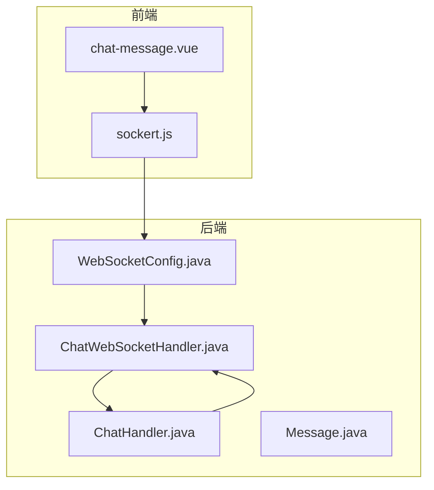
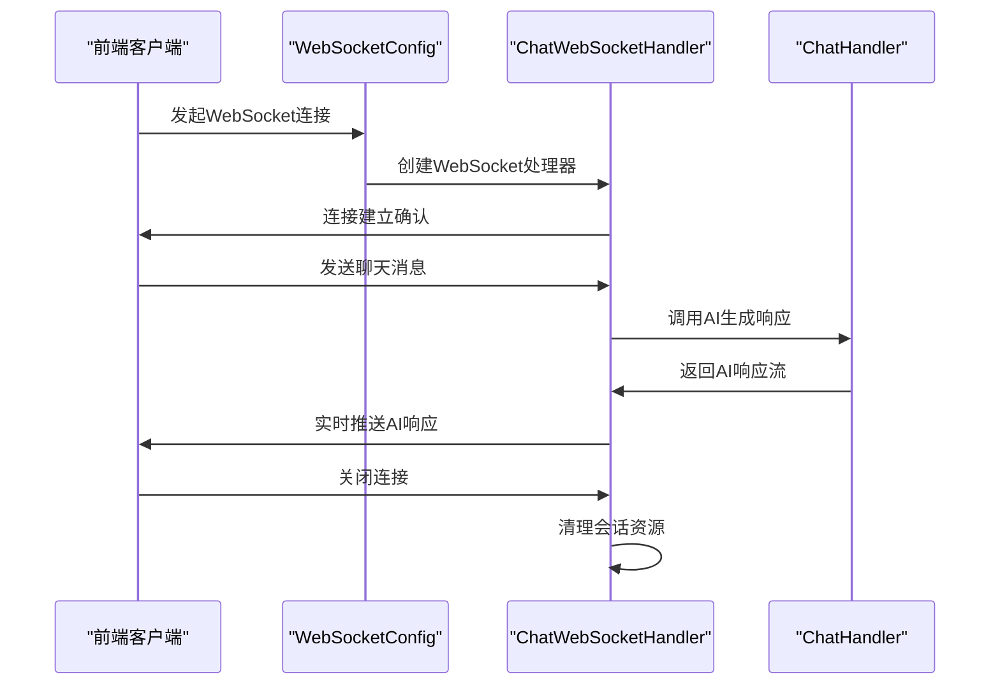
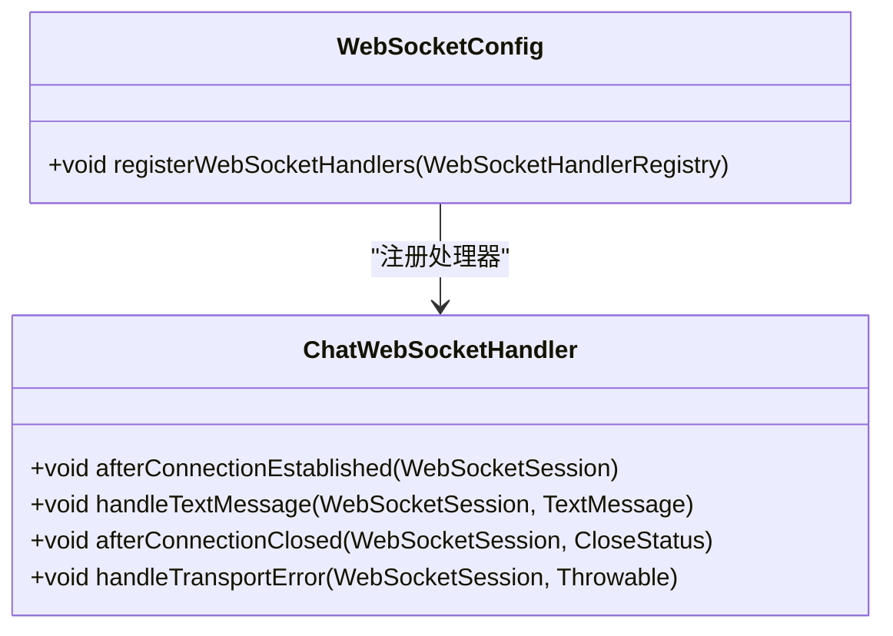
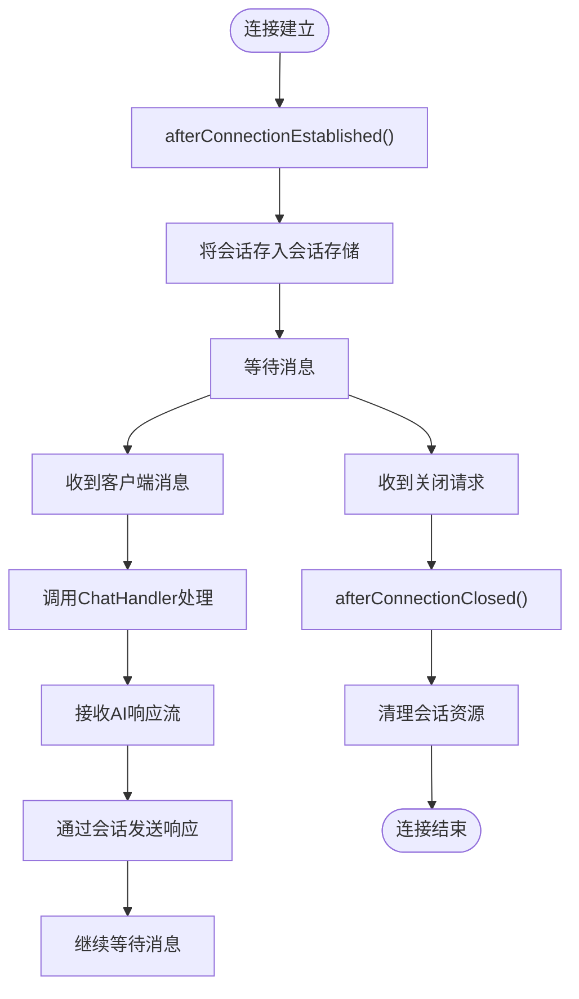
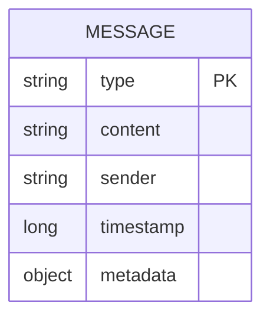
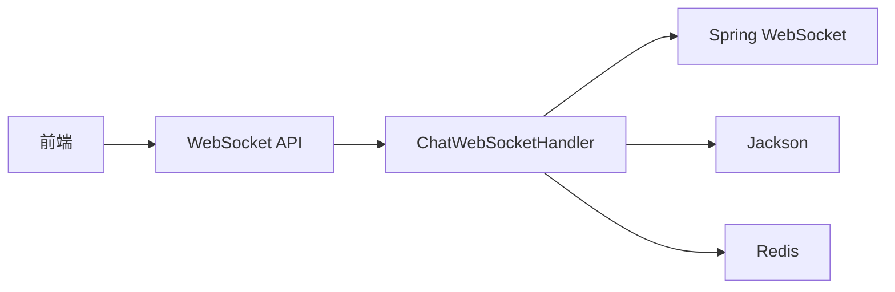

# 实时通信

<cite>
**本文档引用的文件**  
- [WebSocketConfig.java](file://src/main/java/com/yizhaoqi/smartpai/config/WebSocketConfig.java)
- [ChatWebSocketHandler.java](file://src/main/java/com/yizhaoqi/smartpai/handler/ChatWebSocketHandler.java)
- [ChatHandler.java](file://src/main/java/com/yizhaoqi/smartpai/service/ChatHandler.java)
- [Message.java](file://src/main/java/com/yizhaoqi/smartpai/entity/Message.java)
- [sockert.js](file://frontend/src/sockert.js)
</cite>

## 目录
1. [引言](#引言)
2. [项目结构](#项目结构)
3. [核心组件](#核心组件)
4. [架构概览](#架构概览)
5. [详细组件分析](#详细组件分析)
6. [依赖分析](#依赖分析)
7. [性能考量](#性能考量)
8. [故障排查指南](#故障排查指南)
9. [结论](#结论)

## 引言
本文档深入解析PaiSmart系统的实时通信机制，重点阐述基于WebSocket的聊天消息传输体系。系统通过WebSocket实现客户端与服务端之间的全双工通信，支持AI生成内容的实时推送。文档将详细说明WebSocket端点配置、消息处理逻辑、序列化格式及高并发下的稳定性保障措施。

## 项目结构
PaiSmart项目的实时通信功能分布在前后端两个主要目录中。后端WebSocket相关代码位于`src/main/java/com/yizhaoqi/smartpai/config`和`handler`包中，前端实现在`frontend/src`目录下。这种分层架构实现了前后端职责分离，便于维护和扩展。

**图示来源**  
- [WebSocketConfig.java](file://src/main/java/com/yizhaoqi/smartpai/config/WebSocketConfig.java)
- [ChatWebSocketHandler.java](file://src/main/java/com/yizhaoqi/smartpai/handler/ChatWebSocketHandler.java)
- [sockert.js](file://frontend/src/sockert.js)

**本节来源**  
- [WebSocketConfig.java](file://src/main/java/com/yizhaoqi/smartpai/config/WebSocketConfig.java)
- [sockert.js](file://frontend/src/sockert.js)

## 核心组件
系统实时通信的核心组件包括WebSocket配置类、消息处理器、AI响应服务和消息实体。WebSocketConfig负责建立通信端点，ChatWebSocketHandler管理连接生命周期，ChatHandler服务处理AI响应的生成与推送，Message实体定义了消息的序列化格式。

**本节来源**  
- [WebSocketConfig.java](file://src/main/java/com/yizhaoqi/smartpai/config/WebSocketConfig.java)
- [ChatWebSocketHandler.java](file://src/main/java/com/yizhaoqi/smartpai/handler/ChatWebSocketHandler.java)
- [ChatHandler.java](file://src/main/java/com/yizhaoqi/smartpai/service/ChatHandler.java)

## 架构概览
PaiSmart的实时通信采用典型的客户端-服务器架构，基于WebSocket协议实现双向通信。客户端通过JavaScript建立WebSocket连接，服务端使用Spring WebSocket框架处理连接请求。消息通过自定义的JSON格式进行序列化，确保数据传输的高效性和可读性。

**图示来源**  
- [WebSocketConfig.java](file://src/main/java/com/yizhaoqi/smartpai/config/WebSocketConfig.java#L1-L30)
- [ChatWebSocketHandler.java](file://src/main/java/com/yizhaoqi/smartpai/handler/ChatWebSocketHandler.java#L1-L50)
- [ChatHandler.java](file://src/main/java/com/yizhaoqi/smartpai/service/ChatHandler.java#L1-L40)

## 详细组件分析

### WebSocket配置分析
WebSocketConfig类配置了WebSocket通信的端点和处理器。系统在`/ws/chat`路径上暴露WebSocket端点，并注册ChatWebSocketHandler作为消息处理器。这种配置方式遵循Spring WebSocket的标准实践，确保了通信的可靠性和可扩展性。

**图示来源**  
- [WebSocketConfig.java](file://src/main/java/com/yizhaoqi/smartpai/config/WebSocketConfig.java#L15-L25)
- [ChatWebSocketHandler.java](file://src/main/java/com/yizhaoqi/smartpai/handler/ChatWebSocketHandler.java#L10-L15)

**本节来源**  
- [WebSocketConfig.java](file://src/main/java/com/yizhaoqi/smartpai/config/WebSocketConfig.java#L10-L30)

### 消息处理器分析
ChatWebSocketHandler实现了WebSocketHandler接口，负责管理WebSocket会话的完整生命周期。处理器维护了一个会话存储，用于跟踪所有活跃的客户端连接。当收到消息时，它调用ChatHandler服务处理请求，并将AI生成的响应通过同一会话实时推送给客户端。

**图示来源**  
- [ChatWebSocketHandler.java](file://src/main/java/com/yizhaoqi/smartpai/handler/ChatWebSocketHandler.java#L20-L100)

**本节来源**  
- [ChatWebSocketHandler.java](file://src/main/java/com/yizhaoqi/smartpai/handler/ChatWebSocketHandler.java#L15-L120)

### AI响应服务分析
ChatHandler服务是实时通信的核心业务逻辑组件。它接收来自ChatWebSocketHandler的请求，调用AI模型生成响应，并以流式方式将结果返回给处理器。这种设计实现了AI响应的实时推送，用户可以逐字看到AI生成的内容，提升了交互体验。

**本节来源**  
- [ChatHandler.java](file://src/main/java/com/yizhaoqi/smartpai/service/ChatHandler.java#L20-L80)

### 消息实体分析
Message实体类定义了WebSocket通信中消息的序列化格式。消息包含类型、内容、发送者、时间戳等字段，采用JSON格式进行序列化。这种结构化的消息格式便于前后端解析和处理，支持多种消息类型（如文本、系统通知等）。

**图示来源**  
- [Message.java](file://src/main/java/com/yizhaoqi/smartpai/entity/Message.java#L5-L20)

**本节来源**  
- [Message.java](file://src/main/java/com/yizhaoqi/smartpai/entity/Message.java#L1-L30)

## 依赖分析
实时通信组件依赖于Spring WebSocket框架进行底层通信管理，依赖Jackson库进行JSON序列化，依赖Redis进行会话状态的分布式存储。前端依赖原生WebSocket API与服务端通信。这些依赖关系确保了系统的稳定性和可扩展性。

**图示来源**  
- [ChatWebSocketHandler.java](file://src/main/java/com/yizhaoqi/smartpai/handler/ChatWebSocketHandler.java)
- [pom.xml](file://pom.xml)

**本节来源**  
- [ChatWebSocketHandler.java](file://src/main/java/com/yizhaoqi/smartpai/handler/ChatWebSocketHandler.java)
- [pom.xml](file://pom.xml)

## 性能考量
系统在高并发场景下通过会话存储优化和消息流式传输确保通信稳定性。WebSocket连接复用减少了HTTP握手开销，心跳检测机制及时清理无效连接。AI响应的流式推送避免了长等待，提升了用户体验。建议在生产环境中配置连接池和限流策略以进一步提升性能。

## 故障排查指南
常见问题包括连接失败、消息丢失和性能下降。连接失败通常由网络问题或CORS配置不当引起；消息丢失可能与会话存储异常有关；性能下降可通过监控连接数和响应时间来诊断。日志记录了所有连接事件和错误信息，是排查问题的重要依据。

**本节来源**  
- [ChatWebSocketHandler.java](file://src/main/java/com/yizhaoqi/smartpai/handler/ChatWebSocketHandler.java#L80-L120)
- [WebSocketConfig.java](file://src/main/java/com/yizhaoqi/smartpai/config/WebSocketConfig.java)

## 结论
PaiSmart的实时通信系统通过WebSocket实现了高效的双向通信，支持AI生成内容的实时流式推送。系统的分层架构和清晰的组件职责划分确保了可维护性和可扩展性。通过合理的会话管理和性能优化，系统能够在高并发场景下保持稳定运行，为用户提供流畅的交互体验。