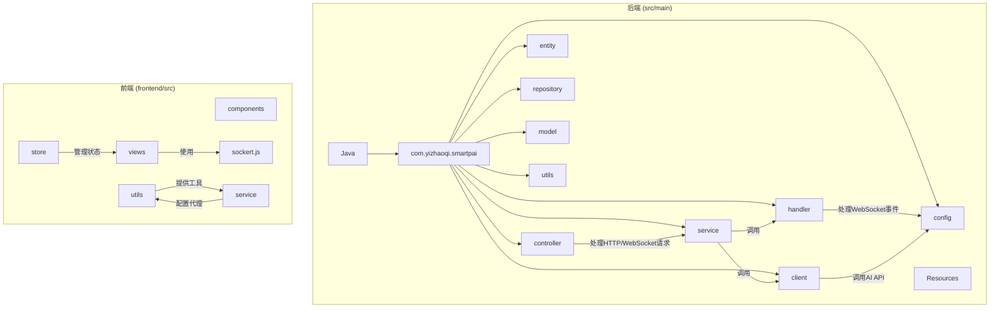
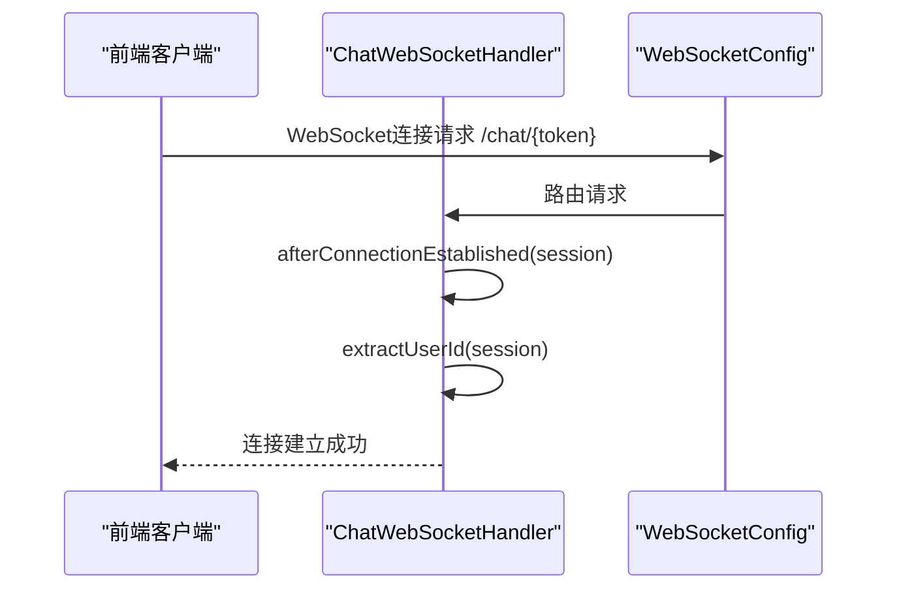
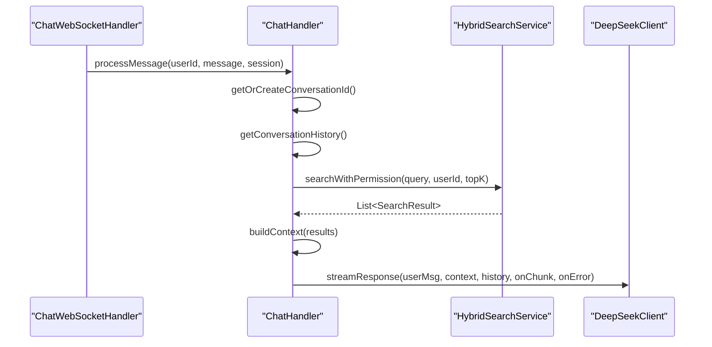
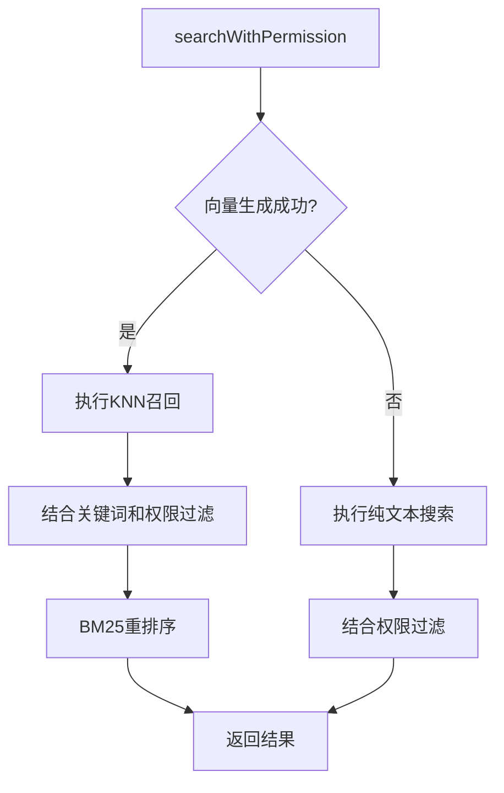
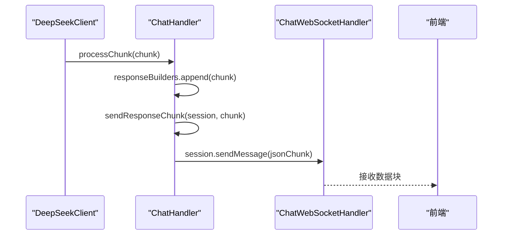
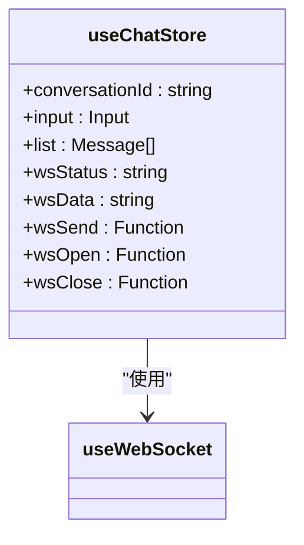
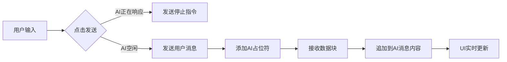
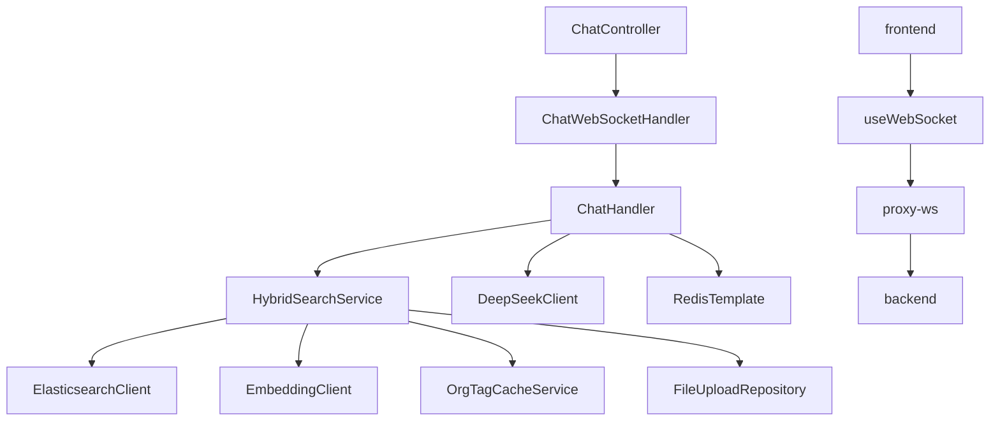

# AI响应流式推送

<cite>
**本文档引用的文件**   
- [ChatHandler.java](file://src/main/java/com/yizhaoqi/smartpai/service/ChatHandler.java)
- [ChatWebSocketHandler.java](file://src/main/java/com/yizhaoqi/smartpai/handler/ChatWebSocketHandler.java)
- [DeepSeekClient.java](file://src/main/java/com/yizhaoqi/smartpai/client/DeepSeekClient.java)
- [HybridSearchService.java](file://src/main/java/com/yizhaoqi/smartpai/service/HybridSearchService.java)
- [WebSocketConfig.java](file://src/main/java/com/yizhaoqi/smartpai/config/WebSocketConfig.java)
- [chat/index.ts](file://frontend/src/store/modules/chat/index.ts)
- [input-box.vue](file://frontend/src/views/chat/modules/input-box.vue)
- [chat-message.vue](file://frontend/src/views/chat/modules/chat-message.vue)
- [proxy.ts](file://frontend/build/config/proxy.ts)
- [service.ts](file://frontend/src/utils/service.ts)
</cite>

## 目录
1. [引言](#引言)
2. [项目结构](#项目结构)
3. [核心组件](#核心组件)
4. [架构概览](#架构概览)
5. [详细组件分析](#详细组件分析)
6. [依赖分析](#依赖分析)
7. [性能考量](#性能考量)
8. [故障排除指南](#故障排除指南)
9. [结论](#结论)

## 引言
本文档深入解析了PaiSmart项目中AI响应的流式推送机制，重点阐述了`ChatHandler`服务与`ChatWebSocketHandler`的协同工作机制。文档详细描述了从客户端查询请求的解析、RAG（检索增强生成）服务链的调用，到AI响应的流式输出和前端实时推送的完整流程。涵盖了消息分块编码、延迟控制、错误传播与连接中断恢复等关键机制，旨在为开发者提供一个全面、清晰的技术实现蓝图。

## 项目结构
PaiSmart项目采用前后端分离的架构，后端基于Spring Boot框架，前端基于Vue 3框架。项目结构清晰，模块化程度高。



**图示来源**
- [ChatHandler.java](file://src/main/java/com/yizhaoqi/smartpai/service/ChatHandler.java)
- [ChatWebSocketHandler.java](file://src/main/java/com/yizhaoqi/smartpai/handler/ChatWebSocketHandler.java)
- [frontend/src](file://frontend/src)

## 核心组件
本系统的核心在于`ChatHandler`和`ChatWebSocketHandler`两个组件的协同工作。`ChatHandler`负责业务逻辑处理，包括会话管理、混合搜索和调用AI模型；`ChatWebSocketHandler`则负责WebSocket连接的生命周期管理，并将`ChatHandler`产生的响应实时推送到前端。

**组件来源**
- [ChatHandler.java](file://src/main/java/com/yizhaoqi/smartpai/service/ChatHandler.java#L1-L401)
- [ChatWebSocketHandler.java](file://src/main/java/com/yizhaoqi/smartpai/handler/ChatWebSocketHandler.java#L1-L122)

## 架构概览
整个AI响应流式推送的架构可以分为四个主要层次：前端交互层、WebSocket通信层、业务处理层和数据服务层。

```mermaid
graph TB
subgraph "前端"
A[用户界面] --> B[Vue组件]
B --> C[useWebSocket]
C --> D[WebSocket连接]
end
subgraph "后端"
E[ChatWebSocketHandler] --> F[ChatHandler]
F --> G[HybridSearchService]
F --> H[DeepSeekClient]
G --> I[Elasticsearch]
H --> J[DeepSeek API]
end
D < --> |WebSocket| E
F < --> |Redis| K[数据存储]
G < --> |权限过滤| L[用户/组织标签]
```

**图示来源**
- [ChatWebSocketHandler.java](file://src/main/java/com/yizhaoqi/smartpai/handler/ChatWebSocketHandler.java)
- [ChatHandler.java](file://src/main/java/com/yizhaoqi/smartpai/service/ChatHandler.java)
- [HybridSearchService.java](file://src/main/java/com/yizhaoqi/smartpai/service/HybridSearchService.java)
- [DeepSeekClient.java](file://src/main/java/com/yizhaoqi/smartpai/client/DeepSeekClient.java)

## 详细组件分析

### ChatWebSocketHandler分析
`ChatWebSocketHandler`是WebSocket通信的入口点，继承自`TextWebSocketHandler`，负责处理WebSocket连接的建立、消息接收和关闭。

#### 连接建立与关闭
当客户端通过`/chat/{token}`路径发起WebSocket连接时，`WebSocketConfig`会将请求路由到`ChatWebSocketHandler`。`afterConnectionEstablished`方法被触发，系统会从URL路径中提取JWT令牌，并解析出用户ID，将其与`WebSocketSession`关联起来，便于后续的消息处理。



**图示来源**
- [ChatWebSocketHandler.java](file://src/main/java/com/yizhaoqi/smartpai/handler/ChatWebSocketHandler.java#L40-L55)
- [WebSocketConfig.java](file://src/main/java/com/yizhaoqi/smartpai/config/WebSocketConfig.java#L1-L24)

#### 消息处理流程
`handleTextMessage`方法是处理客户端消息的核心。它首先提取用户ID，然后解析消息内容。该方法支持两种消息类型：
1.  **普通文本消息**：直接传递给`ChatHandler`进行处理。
2.  **JSON格式的系统指令**：用于控制AI响应，如停止生成。

```mermaid
flowchart TD
A[收到文本消息] --> B{消息是否为JSON?}
B --> |是| C[解析JSON]
C --> D{type为"stop"且令牌正确?}
D --> |是| E[调用chatHandler.stopResponse]
D --> |否| F[作为普通消息处理]
B --> |否| F
F --> G[调用chatHandler.processMessage]
```

**图示来源**
- [ChatWebSocketHandler.java](file://src/main/java/com/yizhaoqi/smartpai/handler/ChatWebSocketHandler.java#L57-L80)

### ChatHandler分析
`ChatHandler`是业务逻辑的核心，负责处理`ChatWebSocketHandler`转发过来的消息。

#### onMessage事件处理
`processMessage`方法是整个流程的起点。它接收用户ID、用户消息和WebSocket会话对象，执行以下关键步骤：

1.  **会话管理**：通过`getOrCreateConversationId`方法，利用Redis为用户获取或创建一个唯一的会话ID，确保对话的连续性。
2.  **历史记录获取**：根据会话ID从Redis中加载历史对话，作为AI生成响应的上下文。
3.  **混合搜索**：调用`HybridSearchService.searchWithPermission`方法，结合用户的查询和权限，从知识库中检索相关信息。
4.  **上下文构建**：将检索到的结果格式化为一段文本，作为AI模型的“参考信息”。
5.  **调用AI服务**：通过`DeepSeekClient.streamResponse`方法，将用户消息、上下文和历史记录发送给DeepSeek API，并注册回调函数来处理流式返回的数据块。



**图示来源**
- [ChatHandler.java](file://src/main/java/com/yizhaoqi/smartpai/service/ChatHandler.java#L50-L150)

#### RAG服务链调用
`HybridSearchService`实现了RAG的关键环节——检索。`searchWithPermission`方法不仅执行了基于Elasticsearch的混合搜索（结合了向量相似度和关键词匹配），还通过`getUserEffectiveOrgTags`和`getUserDbId`方法实现了严格的权限过滤，确保用户只能访问其有权查看的文档。



**图示来源**
- [HybridSearchService.java](file://src/main/java/com/yizhaoqi/smartpai/service/HybridSearchService.java#L50-L150)

#### 流式响应分发机制
`ChatHandler`通过`Sinks.many().multicast()`的模式（在代码中体现为`responseBuilders`和`responseFutures`的并发映射）来管理流式响应。`DeepSeekClient`的`streamResponse`方法使用`WebClient`的`bodyToFlux`订阅流式数据。每当收到一个数据块（chunk），`onChunk`回调就会被触发，执行`sendResponseChunk`方法。

`sendResponseChunk`方法将数据块包装成JSON格式（`{"chunk": "..."}`），并通过`WebSocketSession`的`sendMessage`方法发送给前端。这种分块发送的机制实现了真正的流式输出，用户无需等待整个响应生成完毕即可看到部分内容。



**图示来源**
- [DeepSeekClient.java](file://src/main/java/com/yizhaoqi/smartpai/client/DeepSeekClient.java#L60-L100)
- [ChatHandler.java](file://src/main/java/com/yizhaoqi/smartpai/service/ChatHandler.java#L120-L140)

### 前端交互分析
前端通过Vue 3的组合式API和`@vueuse/core`库中的`useWebSocket`函数来管理WebSocket连接。

#### WebSocket连接与状态管理
在`chat/index.ts`的`useChatStore`中，`useWebSocket`被初始化，连接到`/proxy-ws/chat/${store.token}`。该函数返回`wsStatus`（连接状态）、`wsData`（接收到的数据）和`wsSend`（发送消息的方法），这些状态被集中管理，供整个聊天模块使用。



**图示来源**
- [index.ts](file://frontend/src/store/modules/chat/index.ts#L1-L34)

#### 消息渲染与用户交互
`input-box.vue`组件负责消息的发送。当用户点击发送按钮时，`handleSend`函数被调用。如果当前AI正在响应（`isSending.value`为true），则发送一个包含内部令牌的停止指令；否则，将用户消息发送出去，并在消息列表中添加一个状态为`pending`的AI响应占位符。

`chat-message.vue`组件负责渲染消息。对于AI的响应，它通过`watch(wsData, ...)`监听`wsData`的变化。当收到`{"chunk": "..."}`时，它会将内容追加到对应消息的`content`中，并实时更新UI，实现流式渲染效果。



**图示来源**
- [input-box.vue](file://frontend/src/views/chat/modules/input-box.vue#L1-L115)
- [chat-message.vue](file://frontend/src/views/chat/modules/chat-message.vue#L1-L169)

## 依赖分析
系统各组件之间的依赖关系清晰，遵循了良好的分层设计原则。



**图示来源**
- [ChatHandler.java](file://src/main/java/com/yizhaoqi/smartpai/service/ChatHandler.java)
- [ChatWebSocketHandler.java](file://src/main/java/com/yizhaoqi/smartpai/handler/ChatWebSocketHandler.java)
- [HybridSearchService.java](file://src/main/java/com/yizhaoqi/smartpai/service/HybridSearchService.java)
- [index.ts](file://frontend/src/store/modules/chat/index.ts)

## 性能考量
1.  **流式传输**：通过分块发送响应，极大地提升了用户体验，避免了长时间的等待。
2.  **并发处理**：使用`ConcurrentHashMap`和`CompletableFuture`来管理多个会话的状态，保证了高并发下的线程安全。
3.  **连接复用**：WebSocket连接是长连接，避免了频繁的HTTP连接建立和销毁开销。
4.  **缓存机制**：使用Redis缓存会话ID和对话历史，减少了数据库查询次数。
5.  **代理配置**：前端通过Vite的代理功能（`createProxyPattern`生成`/proxy-ws`）将WebSocket请求转发到后端，解决了开发环境下的跨域问题。

## 故障排除指南
1.  **WebSocket连接失败**：检查`WebSocketConfig`中的路径配置和`allowedOrigins`设置，确保前端请求的URL正确。
2.  **AI响应无输出**：检查`DeepSeekClient`的API密钥和URL配置，确认`stream`参数为`true`，并检查`processChunk`方法是否能正确解析返回的JSON。
3.  **混合搜索无结果**：确认Elasticsearch索引`knowledge_base`存在且有数据，检查`HybridSearchService`中的权限过滤逻辑是否过于严格。
4.  **前端无法接收消息**：检查`useWebSocket`的URL是否正确，确认代理配置`/proxy-ws`已正确映射到后端服务。
5.  **停止指令无效**：确认前端发送的JSON指令中`_internal_cmd_token`的值与后端`INTERNAL_CMD_TOKEN`一致。

**组件来源**
- [ChatHandler.java](file://src/main/java/com/yizhaoqi/smartpai/service/ChatHandler.java#L300-L350)
- [ChatWebSocketHandler.java](file://src/main/java/com/yizhaoqi/smartpai/handler/ChatWebSocketHandler.java#L70-L79)
- [proxy.ts](file://frontend/build/config/proxy.ts#L1-L57)

## 结论
PaiSmart项目的AI响应流式推送机制设计精巧，通过`ChatWebSocketHandler`和`ChatHandler`的紧密协作，实现了从客户端请求到AI响应的高效、稳定传输。系统利用WebSocket的全双工特性，结合RAG服务链和流式API调用，为用户提供了近乎实时的交互体验。其清晰的分层架构和完善的错误处理机制，确保了系统的健壮性和可维护性，为构建高性能的AI对话应用提供了优秀的实践范例。