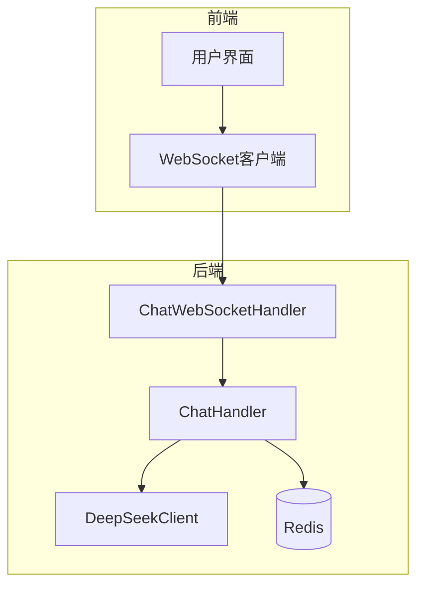
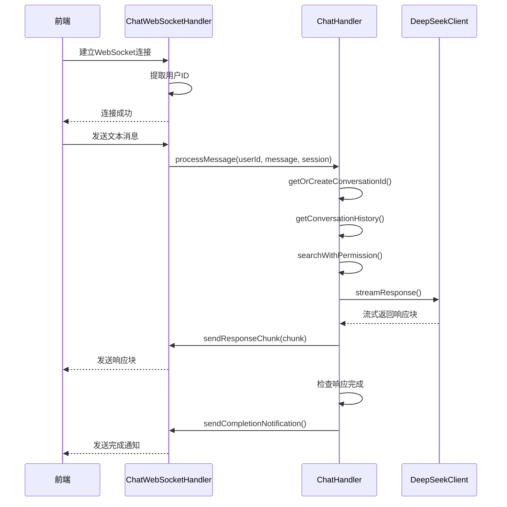
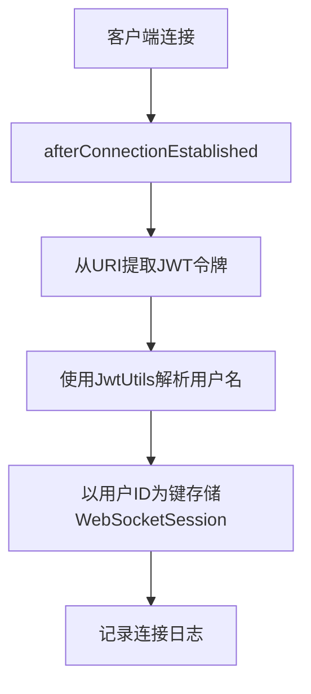
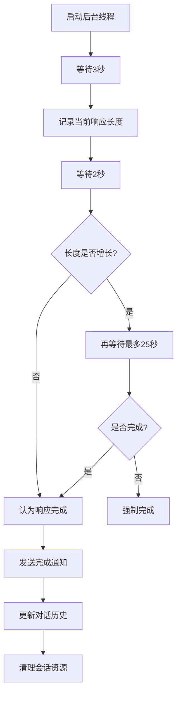
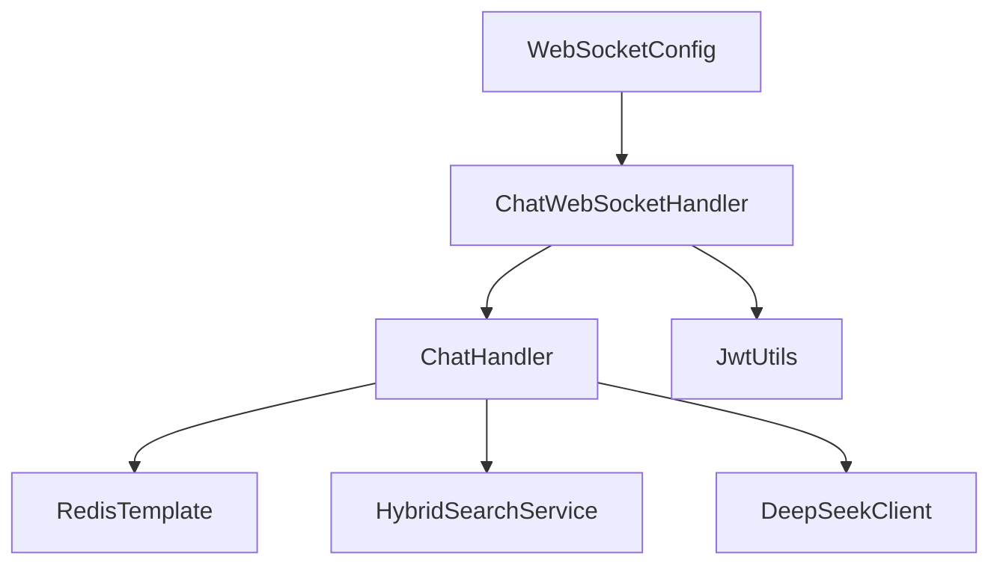

# 消息处理器

<cite>
**本文档引用的文件**  
- [ChatWebSocketHandler.java](file://src/main/java/com/yizhaoqi/smartpai/handler/ChatWebSocketHandler.java)
- [ChatHandler.java](file://src/main/java/com/yizhaoqi/smartpai/service/ChatHandler.java)
- [WebSocketConfig.java](file://src/main/java/com/yizhaoqi/smartpai/config/WebSocketConfig.java)
- [test.html](file://src/main/resources/static/test.html)
</cite>

## 目录
1. [引言](#引言)
2. [项目结构](#项目结构)
3. [核心组件](#核心组件)
4. [架构概览](#架构概览)
5. [详细组件分析](#详细组件分析)
6. [依赖分析](#依赖分析)
7. [性能考量](#性能考量)
8. [故障排除指南](#故障排除指南)
9. [结论](#结论)

## 引言
本技术文档深入分析了PaiSmart项目中WebSocket消息处理机制的完整实现，重点阐述了从客户端连接建立、消息接收、会话管理到AI响应生成与广播推送的全流程。文档详细解析了`ChatWebSocketHandler`和`ChatHandler`两个核心类的协同工作原理，揭示了系统如何通过WebSocket实现流式AI响应，并支持SSE与WebSocket双通道传输。同时，文档涵盖了异常捕获、会话清理和线程安全的会话存储设计，确保了系统在长时间运行下的稳定性与资源释放的可靠性。

## 项目结构
PaiSmart项目采用典型的前后端分离架构。后端位于`src/main/java`目录下，基于Spring Boot框架构建，主要包含`controller`、`service`、`handler`、`client`等包。前端位于`frontend`目录下，使用Vue.js框架。本分析重点关注后端`handler`和`service`包中的WebSocket相关组件。



**图示来源**
- [ChatWebSocketHandler.java](file://src/main/java/com/yizhaoqi/smartpai/handler/ChatWebSocketHandler.java)
- [ChatHandler.java](file://src/main/java/com/yizhaoqi/smartpai/service/ChatHandler.java)

## 核心组件
本系统的核心消息处理流程由`ChatWebSocketHandler`和`ChatHandler`两个类共同完成。`ChatWebSocketHandler`作为WebSocket的入口点，负责处理连接的建立、关闭和消息的接收。`ChatHandler`则作为业务逻辑的核心，负责调用AI服务、管理对话历史和处理流式响应。

**组件来源**
- [ChatWebSocketHandler.java](file://src/main/java/com/yizhaoqi/smartpai/handler/ChatWebSocketHandler.java#L1-L121)
- [ChatHandler.java](file://src/main/java/com/yizhaoqi/smartpai/service/ChatHandler.java#L1-L401)

## 架构概览
系统采用分层架构，前端通过WebSocket与后端的`ChatWebSocketHandler`建立连接。该处理器将接收到的消息委托给`ChatHandler`进行业务处理。`ChatHandler`整合了混合搜索服务和DeepSeek AI客户端，生成响应后，通过原始的WebSocket会话将流式数据实时推回前端。



**图示来源**
- [ChatWebSocketHandler.java](file://src/main/java/com/yizhaoqi/smartpai/handler/ChatWebSocketHandler.java#L1-L121)
- [ChatHandler.java](file://src/main/java/com/yizhaoqi/smartpai/service/ChatHandler.java#L1-L401)

## 详细组件分析

### ChatWebSocketHandler分析
`ChatWebSocketHandler`是`TextWebSocketHandler`的子类，负责处理WebSocket的整个生命周期事件。

#### 连接建立与关闭
当客户端连接时，`afterConnectionEstablished`方法被调用。它从WebSocket连接的URI路径中提取JWT令牌，并使用`JwtUtils`解析出用户名作为用户ID，然后将该会话存入`ConcurrentHashMap`中，以便后续查找。



**图示来源**
- [ChatWebSocketHandler.java](file://src/main/java/com/yizhaoqi/smartpai/handler/ChatWebSocketHandler.java#L20-L30)

#### 消息接收处理
`handleTextMessage`方法是消息处理的核心。它首先提取用户ID，然后尝试将消息解析为JSON。如果消息是带有特定内部令牌的JSON指令（如停止指令），则进行特殊处理；否则，将其视为普通聊天消息，并委托给`ChatHandler`进行处理。

```mermaid
flowchart TD
A[收到文本消息] --> B[提取用户ID]
B --> C{消息是JSON格式?}
C --> |是| D[解析JSON]
D --> E{是停止指令且令牌正确?}
E --> |是| F[调用chatHandler.stopResponse()]
E --> |否| G[视为普通消息]
C --> |否| G
G --> H[调用chatHandler.processMessage()]
H --> I[处理完成]
```

**图示来源**
- [ChatWebSocketHandler.java](file://src/main/java/com/yizhaoqi/smartpai/handler/ChatWebSocketHandler.java#L32-L70)

### ChatHandler分析
`ChatHandler`是业务逻辑的中心，负责协调AI响应的生成和会话管理。

#### onMessage事件处理逻辑
`processMessage`方法是整个消息处理流程的起点。其逻辑如下：
1.  **获取或创建会话ID**：通过`getOrCreateConversationId`方法，使用用户的Redis键来获取或创建一个唯一的会话ID。
2.  **初始化响应构建器**：为当前WebSocket会话创建一个`StringBuilder`来累积AI返回的流式响应。
3.  **获取对话历史**：从Redis中加载该会话的历史对话记录。
4.  **执行混合搜索**：调用`HybridSearchService`进行带权限过滤的搜索，获取相关知识库片段。
5.  **构建上下文**：将搜索结果格式化为字符串，作为上下文提供给AI模型。
6.  **调用AI服务**：调用`DeepSeekClient.streamResponse`，并传入一个回调函数来处理每个返回的响应块。

```mermaid
flowchart TD
A[processMessage] --> B[获取或创建会话ID]
B --> C[初始化responseBuilder]
C --> D[获取对话历史]
D --> E[执行混合搜索]
E --> F[构建上下文]
F --> G[调用DeepSeekClient流式API]
G --> H[回调函数处理每个chunk]
H --> I[sendResponseChunk(session, chunk)]
```

**图示来源**
- [ChatHandler.java](file://src/main/java/com/yizhaoqi/smartpai/service/ChatHandler.java#L29-L100)

#### 流式响应推送机制
`sendResponseChunk`方法负责将AI返回的每个响应块通过WebSocket会话推送给前端。它首先检查`stopFlags`以确定用户是否已请求停止响应，如果未停止，则将响应块包装成JSON格式并发送。

```java
private void sendResponseChunk(WebSocketSession session, String chunk) {
    try {
        if (Boolean.TRUE.equals(stopFlags.get(session.getId()))) {
            return; // 跳过发送
        }
        Map<String, String> chunkResponse = Map.of("chunk", chunk);
        String jsonChunk = objectMapper.writeValueAsString(chunkResponse);
        session.sendMessage(new TextMessage(jsonChunk));
    } catch (Exception e) {
        logger.error("发送响应块失败", e);
    }
}
```

**组件来源**
- [ChatHandler.java](file://src/main/java/com/yizhaoqi/smartpai/service/ChatHandler.java#L250-L265)

#### 响应完成检测
由于流式API没有明确的结束信号，`ChatHandler`启动了一个后台线程来检测响应是否完成。该线程会等待一段时间后，检查响应内容的长度是否在短时间内不再增长。如果不再增长，则认为响应已完成，此时会：
1.  发送完成通知给前端。
2.  将完整的对话历史（包括本次问答）更新到Redis中。
3.  清理该会话对应的`responseBuilders`和`responseFutures`。



**图示来源**
- [ChatHandler.java](file://src/main/java/com/yizhaoqi/smartpai/service/ChatHandler.java#L100-L200)

#### 异常捕获与会话清理
整个`processMessage`方法被包裹在try-catch块中。任何在处理过程中抛出的异常都会被捕获，通过`handleError`方法发送错误消息给前端，并确保清理`responseBuilders`和`responseFutures`中的资源，防止内存泄漏。

```java
} catch (Exception e) {
    logger.error("处理消息错误", e);
    handleError(session, e);
    responseBuilders.remove(session.getId());
    CompletableFuture<String> future = responseFutures.remove(session.getId());
    if (future != null && !future.isDone()) {
        future.completeExceptionally(e);
    }
}
```

**组件来源**
- [ChatHandler.java](file://src/main/java/com/yizhaoqi/smartpai/service/ChatHandler.java#L230-L245)

#### 线程安全的会话存储
`ChatHandler`使用`ConcurrentHashMap`来存储`responseBuilders`、`responseFutures`和`stopFlags`。这种设计确保了在多线程环境下对这些共享资源的访问是线程安全的，避免了并发修改导致的数据不一致问题。

```java
private final Map<String, StringBuilder> responseBuilders = new ConcurrentHashMap<>();
private final Map<String, CompletableFuture<String>> responseFutures = new ConcurrentHashMap<>();
private final Map<String, Boolean> stopFlags = new ConcurrentHashMap<>();
```

**组件来源**
- [ChatHandler.java](file://src/main/java/com/yizhaoqi/smartpai/service/ChatHandler.java#L15-L17)

## 依赖分析
系统各组件之间的依赖关系清晰。`ChatWebSocketHandler`依赖于`ChatHandler`和`JwtUtils`。`ChatHandler`依赖于`RedisTemplate`、`HybridSearchService`和`DeepSeekClient`。`WebSocketConfig`负责将`ChatWebSocketHandler`注册为WebSocket端点。



**图示来源**
- [WebSocketConfig.java](file://src/main/java/com/yizhaoqi/smartpai/config/WebSocketConfig.java)
- [ChatWebSocketHandler.java](file://src/main/java/com/yizhaoqi/smartpai/handler/ChatWebSocketHandler.java)
- [ChatHandler.java](file://src/main/java/com/yizhaoqi/smartpai/service/ChatHandler.java)

## 性能考量
1.  **流式传输**：通过流式API，前端可以立即开始接收和显示AI的响应，极大地提升了用户体验。
2.  **后台线程**：使用后台线程检测响应完成，避免了阻塞主线程，保证了消息处理的及时性。
3.  **Redis缓存**：使用Redis存储会话ID和对话历史，提供了快速的读写性能。
4.  **内存管理**：通过`ConcurrentHashMap`和及时的资源清理，有效管理了内存，防止了长时间运行导致的内存溢出。

## 故障排除指南
*   **WebSocket连接失败**：检查`WebSocketConfig`中注册的端点路径是否正确，以及前端连接的URL是否匹配。
*   **无法获取用户ID**：检查JWT令牌是否正确附加在连接URL上，以及`JwtUtils.extractUsernameFromToken`方法是否能正确解析。
*   **AI响应不完整或卡住**：检查`DeepSeekClient`的网络连接和API密钥。后台线程的超时时间（30秒）可能需要根据AI服务的实际响应时间进行调整。
*   **内存泄漏**：确保在连接关闭或发生异常时，`responseBuilders`等资源能被正确清理。`afterConnectionClosed`方法目前未清理`ChatHandler`中的资源，这是一个潜在的风险点。

**组件来源**
- [ChatWebSocketHandler.java](file://src/main/java/com/yizhaoqi/smartpai/handler/ChatWebSocketHandler.java#L72-L85)
- [ChatHandler.java](file://src/main/java/com/yizhaoqi/smartpai/service/ChatHandler.java#L29-L401)

## 结论
PaiSmart项目的消息处理机制设计精巧，通过`ChatWebSocketHandler`和`ChatHandler`的职责分离，实现了高内聚、低耦合的架构。系统成功地将WebSocket的实时通信能力与AI的流式响应相结合，为用户提供了流畅的交互体验。其线程安全的设计和资源清理机制保障了系统的稳定性和可靠性。未来可优化的方向包括在`afterConnectionClosed`中增加对`ChatHandler`内部资源的清理，以及实现更精确的响应完成检测机制。