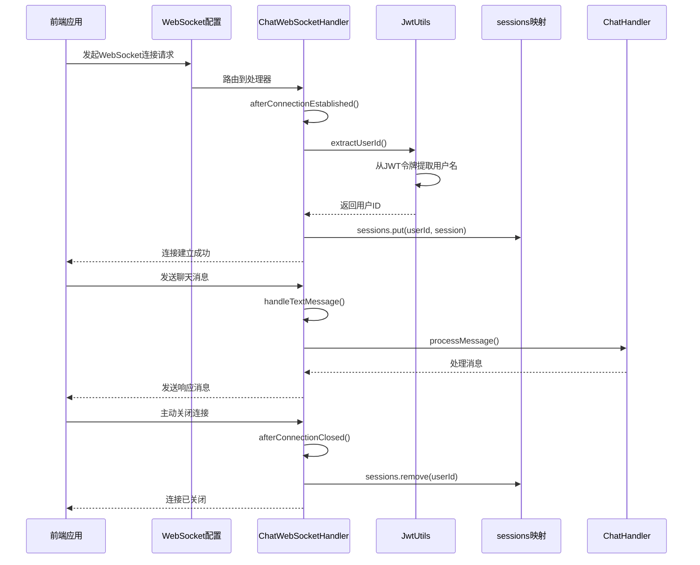
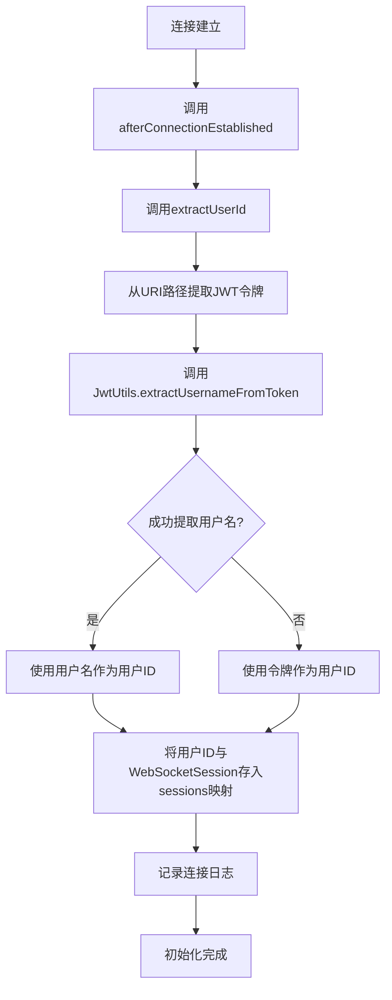
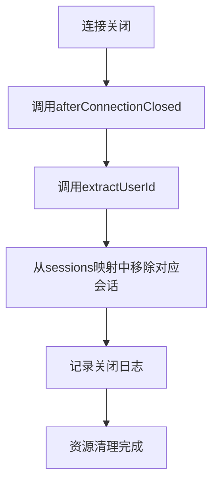
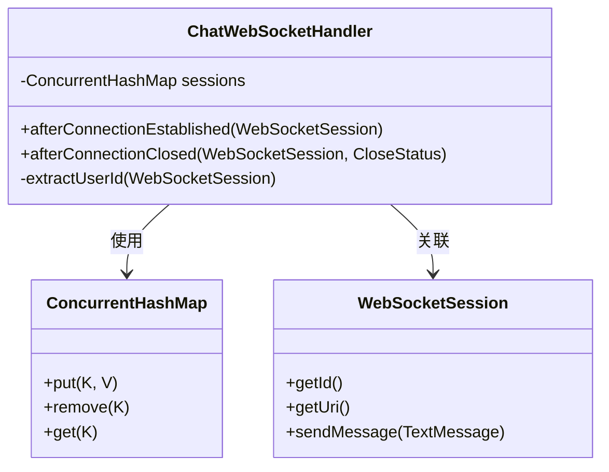
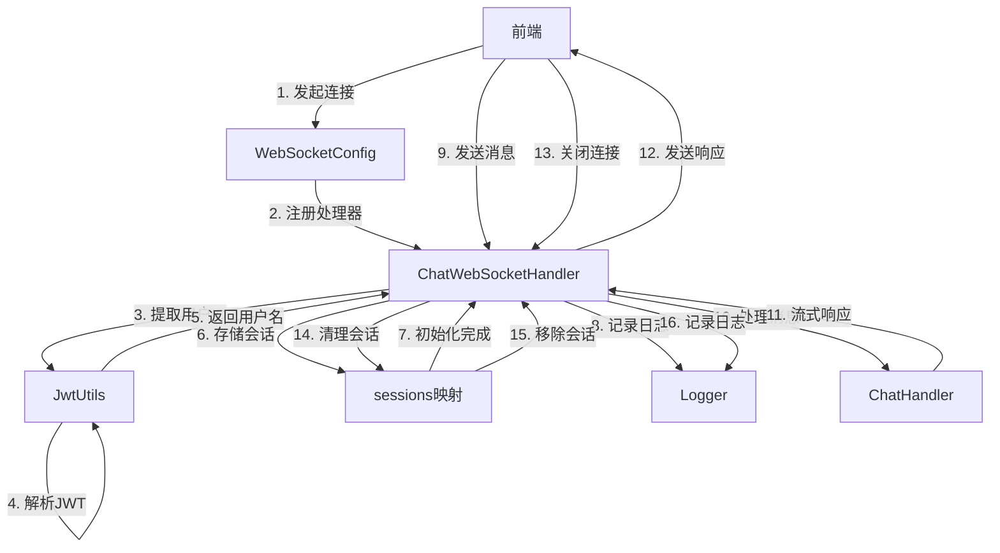

# 连接管理

<cite>
**本文档中引用的文件**   
- [ChatWebSocketHandler.java](file://src/main/java/com/yizhaoqi/smartpai/handler/ChatWebSocketHandler.java)
- [WebSocketConfig.java](file://src/main/java/com/yizhaoqi/smartpai/config/WebSocketConfig.java)
- [JwtUtils.java](file://src/main/java/com/yizhaoqi/smartpai/utils/JwtUtils.java)
- [ChatHandler.java](file://src/main/java/com/yizhaoqi/smartpai/service/ChatHandler.java)
- [ChatController.java](file://src/main/java/com/yizhaoqi/smartpai/controller/ChatController.java)
</cite>

## 目录
1. [连接管理](#连接管理)
2. [WebSocket连接生命周期](#websocket连接生命周期)
3. [会话初始化与用户身份验证](#会话初始化与用户身份验证)
4. [资源清理与异常处理](#资源清理与异常处理)
5. [线程安全的会话存储设计](#线程安全的会话存储设计)
6. [系统交互流程](#系统交互流程)

## WebSocket连接生命周期

WebSocket连接的生命周期由`ChatWebSocketHandler`类管理，该类继承自Spring的`TextWebSocketHandler`，实现了WebSocket连接的完整生命周期管理。整个生命周期包含三个核心阶段：连接建立、消息处理和连接关闭。



**图示来源**
- [ChatWebSocketHandler.java](file://src/main/java/com/yizhaoqi/smartpai/handler/ChatWebSocketHandler.java#L33-L85)
- [WebSocketConfig.java](file://src/main/java/com/yizhaoqi/smartpai/config/WebSocketConfig.java#L10-L22)

**本节来源**
- [ChatWebSocketHandler.java](file://src/main/java/com/yizhaoqi/smartpai/handler/ChatWebSocketHandler.java#L33-L85)
- [WebSocketConfig.java](file://src/main/java/com/yizhaoqi/smartpai/config/WebSocketConfig.java#L10-L22)

## 会话初始化与用户身份验证

当WebSocket连接建立时，`afterConnectionEstablished`方法被调用，这是连接生命周期的起点。该方法负责会话的初始化、用户身份验证和会话绑定。



**图示来源**
- [ChatWebSocketHandler.java](file://src/main/java/com/yizhaoqi/smartpai/handler/ChatWebSocketHandler.java#L33-L38)
- [JwtUtils.java](file://src/main/java/com/yizhaoqi/smartpai/utils/JwtUtils.java#L100-L115)

**本节来源**
- [ChatWebSocketHandler.java](file://src/main/java/com/yizhaoqi/smartpai/handler/ChatWebSocketHandler.java#L33-L38)
- [JwtUtils.java](file://src/main/java/com/yizhaoqi/smartpai/utils/JwtUtils.java#L100-L115)

### 连接建立时的会话初始化

`afterConnectionEstablished`方法是WebSocket连接建立时的入口点。该方法接收一个`WebSocketSession`对象作为参数，代表了新建立的WebSocket会话。

```java
@Override
public void afterConnectionEstablished(WebSocketSession session) {
    String userId = extractUserId(session);
    sessions.put(userId, session);
    logger.info("WebSocket连接已建立，用户ID: {}，会话ID: {}，URI路径: {}", 
                userId, session.getId(), session.getUri().getPath());
}
```

此方法首先调用`extractUserId`方法从会话中提取用户标识，然后将用户ID与对应的`WebSocketSession`对象存入`sessions`映射中。这种设计实现了用户与会话的绑定，使得后续可以通过用户ID快速定位到其对应的WebSocket会话。最后，方法记录一条详细的连接日志，包括用户ID、会话ID和连接的URI路径，便于后续的调试和监控。

### 用户身份验证与会话绑定逻辑

用户身份验证通过`extractUserId`方法实现，该方法从WebSocket连接的URI路径中提取JWT令牌，并利用`JwtUtils`工具类解析出用户名。

```java
private String extractUserId(WebSocketSession session) {
    String path = session.getUri().getPath();
    String[] segments = path.split("/");
    String jwtToken = segments[segments.length - 1];
    
    // 从JWT令牌中提取用户名
    String username = jwtUtils.extractUsernameFromToken(jwtToken);
    if (username == null) {
        logger.warn("无法从JWT令牌中提取用户名，使用令牌作为用户ID: {}", jwtToken);
        return jwtToken;
    }
    
    logger.debug("从JWT令牌中提取的用户名: {}", username);
    return username;
}
```

该方法首先获取会话的URI路径，例如`/chat/eyJhbGciOiJIUzI1NiJ9...`，然后通过分割路径获取最后一个段，即JWT令牌。接着调用`JwtUtils.extractUsernameFromToken`方法解析令牌中的用户名。如果解析成功，用户名将作为用户ID；如果解析失败，则直接使用JWT令牌作为用户ID，确保了即使在身份验证失败的情况下，系统仍能为会话分配一个唯一的标识符。

## 资源清理与异常处理

当WebSocket连接关闭时，`afterConnectionClosed`方法被调用，负责执行必要的资源清理工作。



**图示来源**
- [ChatWebSocketHandler.java](file://src/main/java/com/yizhaoqi/smartpai/handler/ChatWebSocketHandler.java#L82-L85)

**本节来源**
- [ChatWebSocketHandler.java](file://src/main/java/com/yizhaoqi/smartpai/handler/ChatWebSocketHandler.java#L82-L85)

### onClose事件中的资源清理流程

`afterConnectionClosed`方法在WebSocket连接关闭时被调用，其主要职责是清理与该连接相关的资源。

```java
@Override
public void afterConnectionClosed(WebSocketSession session, CloseStatus status) {
    String userId = extractUserId(session);
    sessions.remove(userId);
    logger.info("WebSocket连接已关闭，用户ID: {}，会话ID: {}，状态: {}", 
                userId, session.getId(), status);
}
```

该方法首先通过`extractUserId`获取与会话关联的用户ID，然后从`sessions`映射中移除该用户ID对应的会话。这一步骤至关重要，它确保了已关闭的连接不会继续占用内存资源，防止了内存泄漏。同时，方法记录了一条详细的关闭日志，包括用户ID、会话ID和关闭状态，为系统监控和故障排查提供了重要信息。

### 异常断开的处理策略

虽然`afterConnectionClosed`方法没有显式处理异常断开的情况，但Spring WebSocket框架会自动处理网络异常导致的连接中断，并最终调用此方法。这意味着无论是正常关闭还是异常断开，都会执行相同的资源清理流程，保证了系统的一致性和稳定性。

## 线程安全的会话存储设计

`ChatWebSocketHandler`类使用`ConcurrentHashMap`作为会话存储的数据结构，这是确保高并发场景下连接稳定性和数据一致性的关键设计。



**图示来源**
- [ChatWebSocketHandler.java](file://src/main/java/com/yizhaoqi/smartpai/handler/ChatWebSocketHandler.java#L27-L28)

**本节来源**
- [ChatWebSocketHandler.java](file://src/main/java/com/yizhaoqi/smartpai/handler/ChatWebSocketHandler.java#L27-L28)

### ConcurrentHashMap会话存储设计

`sessions`映射被声明为`ConcurrentHashMap<String, WebSocketSession>`，这是一个线程安全的哈希表实现。

```java
private final ConcurrentHashMap<String, WebSocketSession> sessions = new ConcurrentHashMap<>();
```

`ConcurrentHashMap`通过分段锁（Java 8之前）或CAS操作与synchronized关键字（Java 8及以后）来实现高并发下的线程安全。与使用`synchronized`关键字修饰的普通`HashMap`相比，`ConcurrentHashMap`在读操作上几乎无锁，写操作的锁粒度更细，因此在高并发场景下具有显著的性能优势。

### 高并发场景下的连接稳定性

在高并发场景下，多个用户可能同时建立或关闭WebSocket连接。`ConcurrentHashMap`的设计确保了`put`和`remove`操作的原子性，避免了数据竞争和不一致的问题。例如，当两个用户几乎同时连接时，`sessions.put(userId, session)`操作不会相互干扰，每个用户的会话都能被正确地存储。同样，当连接关闭时，`sessions.remove(userId)`也能安全地移除对应的会话，而不会影响其他正在运行的连接。

## 系统交互流程

整个WebSocket连接管理系统的交互流程涉及多个组件的协同工作，从前端发起连接到后端处理消息，形成了一个完整的闭环。



**图示来源**
- [ChatWebSocketHandler.java](file://src/main/java/com/yizhaoqi/smartpai/handler/ChatWebSocketHandler.java)
- [WebSocketConfig.java](file://src/main/java/com/yizhaoqi/smartpai/config/WebSocketConfig.java)
- [JwtUtils.java](file://src/main/java/com/yizhaoqi/smartpai/utils/JwtUtils.java)
- [ChatHandler.java](file://src/main/java/com/yizhaoqi/smartpai/service/ChatHandler.java)

**本节来源**
- [ChatWebSocketHandler.java](file://src/main/java/com/yizhaoqi/smartpai/handler/ChatWebSocketHandler.java)
- [WebSocketConfig.java](file://src/main/java/com/yizhaoqi/smartpai/config/WebSocketConfig.java)
- [JwtUtils.java](file://src/main/java/com/yizhaoqi/smartpai/utils/JwtUtils.java)
- [ChatHandler.java](file://src/main/java/com/yizhaoqi/smartpai/service/ChatHandler.java)