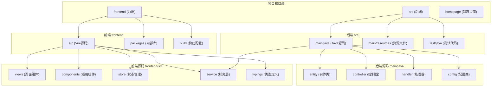
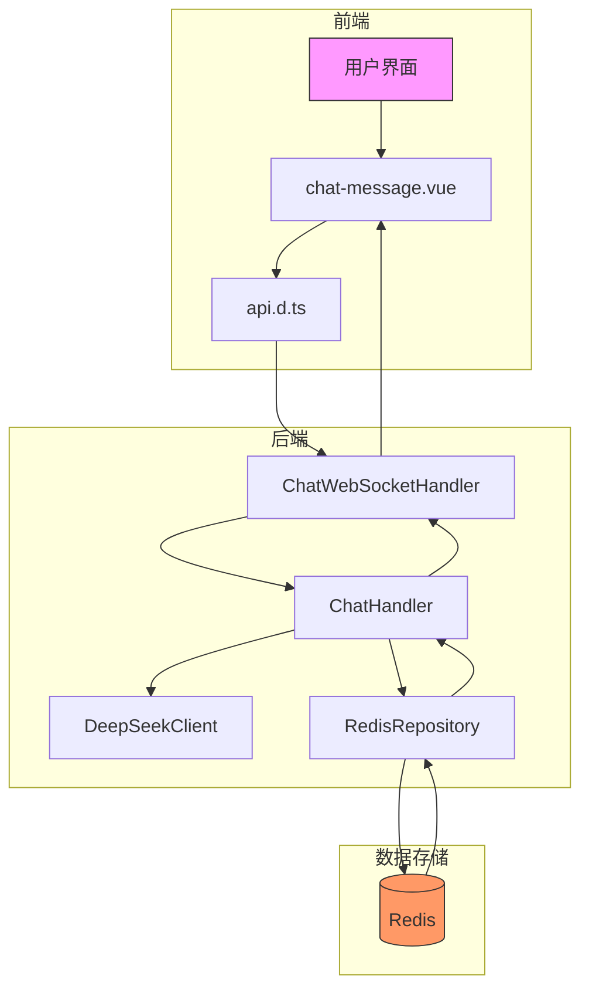
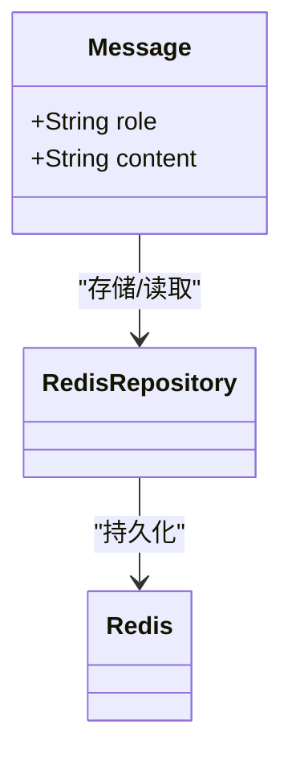
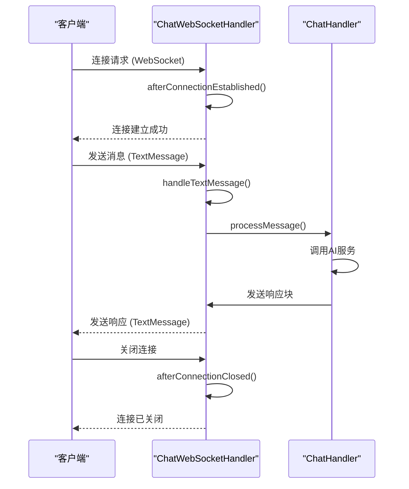
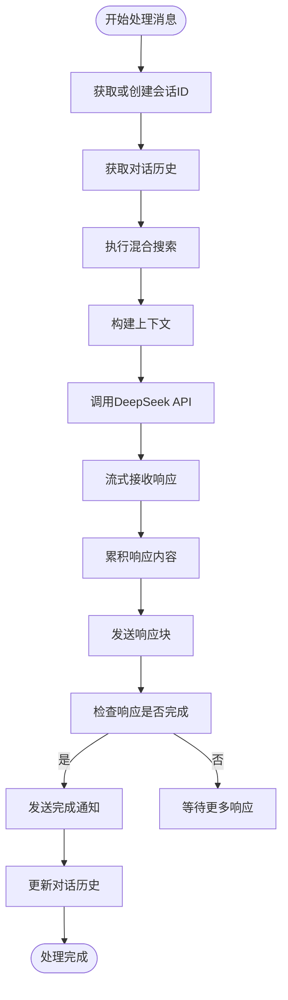
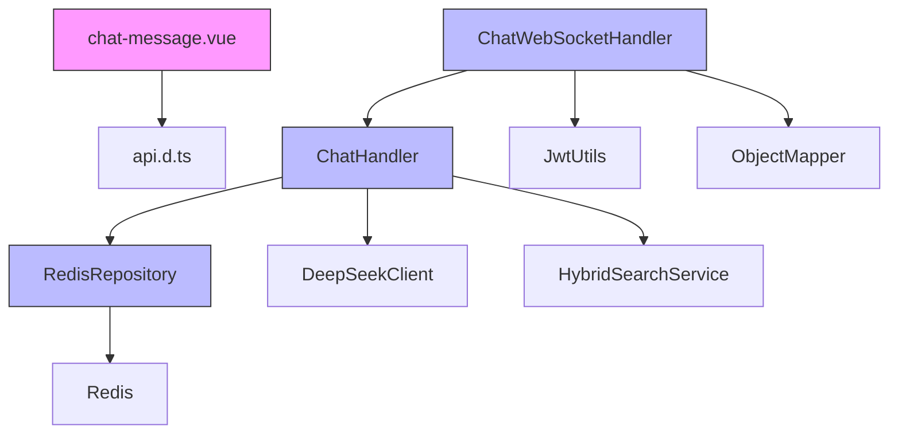

# 通信协议设计

<cite>
**本文档引用的文件**
- [Message.java](file://src/main/java/com/yizhaoqi/smartpai/entity/Message.java#L5-L10)
- [ChatWebSocketHandler.java](file://src/main/java/com/yizhaoqi/smartpai/handler/ChatWebSocketHandler.java#L40-L121)
- [ChatHandler.java](file://src/main/java/com/yizhaoqi/smartpai/service/ChatHandler.java#L100-L400)
- [RedisRepository.java](file://src/main/java/com/yizhaoqi/smartpai/repository/RedisRepository.java#L20-L40)
- [api.d.ts](file://frontend/src/typings/api.d.ts#L150-L160)
- [chat-message.vue](file://frontend/src/views/chat/modules/chat-message.vue#L1-L170)
- [WebSocketConfig.java](file://src/main/java/com/yizhaoqi/smartpai/config/WebSocketConfig.java#L10-L23)
</cite>

## 目录
1. [引言](#引言)
2. [项目结构](#项目结构)
3. [核心组件](#核心组件)
4. [架构概览](#架构概览)
5. [详细组件分析](#详细组件分析)
6. [依赖分析](#依赖分析)
7. [性能考量](#性能考量)
8. [故障排除指南](#故障排除指南)
9. [结论](#结论)

## 引言
本文档全面解析PaiSmart实时通信系统的消息协议设计。基于后端Message实体类和前端Api.Chat.Message类型定义，深入分析消息结构、序列化格式、传输机制和客户端确认流程。文档详细阐述了系统如何通过WebSocket实现双向实时通信，以及如何通过JSON格式确保前后端解析的一致性。同时，文档还介绍了消息ID生成策略、顺序保证机制和多态消息处理的设计，为理解复杂交互场景下的消息传递提供了完整的视角。

## 项目结构
PaiSmart项目采用典型的前后端分离架构，后端基于Spring Boot框架，前端基于Vue 3框架。项目根目录下包含`frontend`和`src`两个主要目录，分别存放前端和后端代码。



**图示来源**
- [项目结构](file://#L1-L100)

**本节来源**
- [项目结构](file://#L1-L100)

## 核心组件
PaiSmart通信协议的核心组件包括后端的`Message`实体类、`ChatWebSocketHandler`处理器和`ChatHandler`服务类，以及前端的`chat-message.vue`组件和`api.d.ts`类型定义。这些组件共同构成了实时消息传递的基础。

`Message`实体类定义了消息的基本结构，包含`role`和`content`两个字段，是消息在后端存储和传输的核心数据单元。`ChatWebSocketHandler`负责管理WebSocket连接的生命周期，处理客户端发送的文本消息。`ChatHandler`则封装了业务逻辑，负责调用AI服务、处理流式响应并更新对话历史。

前端的`chat-message.vue`组件负责渲染消息，通过`Api.Chat.Message`类型定义与后端保持数据结构的一致性。`api.d.ts`文件中的类型定义确保了TypeScript编译时的类型安全，减少了前后端集成时的错误。

**本节来源**
- [Message.java](file://src/main/java/com/yizhaoqi/smartpai/entity/Message.java#L5-L10)
- [ChatWebSocketHandler.java](file://src/main/java/com/yizhaoqi/smartpai/handler/ChatWebSocketHandler.java#L1-L20)
- [ChatHandler.java](file://src/main/java/com/yizhaoqi/smartpai/service/ChatHandler.java#L1-L30)
- [chat-message.vue](file://frontend/src/views/chat/modules/chat-message.vue#L1-L20)
- [api.d.ts](file://frontend/src/typings/api.d.ts#L150-L160)

## 架构概览
PaiSmart的实时通信系统采用WebSocket协议实现全双工通信，确保了消息的低延迟和高效率。系统架构分为前端、后端和消息持久化三层，通过清晰的职责划分实现了高内聚、低耦合的设计。



**图示来源**
- [ChatWebSocketHandler.java](file://src/main/java/com/yizhaoqi/smartpai/handler/ChatWebSocketHandler.java#L1-L20)
- [ChatHandler.java](file://src/main/java/com/yizhaoqi/smartpai/service/ChatHandler.java#L1-L30)
- [RedisRepository.java](file://src/main/java/com/yizhaoqi/smartpai/repository/RedisRepository.java#L1-L20)

## 详细组件分析

### 消息实体类分析
`Message`实体类是整个通信协议的基础，定义了消息的核心数据结构。该类使用Lombok注解简化了代码，仅包含`role`和`content`两个字段。



**图示来源**
- [Message.java](file://src/main/java/com/yizhaoqi/smartpai/entity/Message.java#L5-L10)
- [RedisRepository.java](file://src/main/java/com/yizhaoqi/smartpai/repository/RedisRepository.java#L20-L40)

**本节来源**
- [Message.java](file://src/main/java/com/yizhaoqi/smartpai/entity/Message.java#L5-L10)

### WebSocket处理机制分析
`ChatWebSocketHandler`是WebSocket通信的核心处理器，负责管理连接的建立、消息的接收和连接的关闭。它通过`@Component`注解被Spring容器管理，并继承`TextWebSocketHandler`以处理文本消息。



**图示来源**
- [ChatWebSocketHandler.java](file://src/main/java/com/yizhaoqi/smartpai/handler/ChatWebSocketHandler.java#L40-L121)
- [ChatHandler.java](file://src/main/java/com/yizhaoqi/smartpai/service/ChatHandler.java#L100-L200)

**本节来源**
- [ChatWebSocketHandler.java](file://src/main/java/com/yizhaoqi/smartpai/handler/ChatWebSocketHandler.java#L40-L121)

### 消息处理服务分析
`ChatHandler`服务类封装了复杂的业务逻辑，包括会话管理、AI调用和历史记录更新。它使用`ConcurrentHashMap`来存储每个会话的响应构建器和完成状态，确保了线程安全。



**图示来源**
- [ChatHandler.java](file://src/main/java/com/yizhaoqi/smartpai/service/ChatHandler.java#L100-L400)

**本节来源**
- [ChatHandler.java](file://src/main/java/com/yizhaoqi/smartpai/service/ChatHandler.java#L100-L400)

### 前端消息展示分析
前端通过`chat-message.vue`组件展示消息，该组件使用`Api.Chat.Message`类型定义来确保与后端的数据结构一致。组件支持消息复制、来源文件链接处理等交互功能。

```mermaid
classDiagram
class Api.Chat.Message {
+role : 'user' | 'assistant'
+content : string
+status? : 'pending' | 'loading' | 'finished' | 'error'
+timestamp? : string
}
class ChatMessage {
+props : { msg : Api.Chat.Message }
+handleCopy(content : string)
+processSourceLinks(text : string) : string
}
ChatMessage --> Api.Chat.Message : "使用"
```

**图示来源**
- [api.d.ts](file://frontend/src/typings/api.d.ts#L150-L160)
- [chat-message.vue](file://frontend/src/views/chat/modules/chat-message.vue#L1-L170)

**本节来源**
- [api.d.ts](file://frontend/src/typings/api.d.ts#L150-L160)
- [chat-message.vue](file://frontend/src/views/chat/modules/chat-message.vue#L1-L170)

## 依赖分析
PaiSmart通信协议的组件间依赖关系清晰，遵循了依赖倒置原则。高层模块依赖于抽象，而不是具体实现。



**图示来源**
- [ChatWebSocketHandler.java](file://src/main/java/com/yizhaoqi/smartpai/handler/ChatWebSocketHandler.java#L1-L20)
- [ChatHandler.java](file://src/main/java/com/yizhaoqi/smartpai/service/ChatHandler.java#L1-L30)
- [RedisRepository.java](file://src/main/java/com/yizhaoqi/smartpai/repository/RedisRepository.java#L1-L20)
- [chat-message.vue](file://frontend/src/views/chat/modules/chat-message.vue#L1-L20)

**本节来源**
- [ChatWebSocketHandler.java](file://src/main/java/com/yizhaoqi/smartpai/handler/ChatWebSocketHandler.java#L1-L20)
- [ChatHandler.java](file://src/main/java/com/yizhaoqi/smartpai/service/ChatHandler.java#L1-L30)
- [RedisRepository.java](file://src/main/java/com/yizhaoqi/smartpai/repository/RedisRepository.java#L1-L20)

## 性能考量
PaiSmart通信协议在设计时充分考虑了性能因素。后端使用Redis作为对话历史的缓存，确保了数据访问的高效性。`ChatHandler`中的响应处理采用异步线程，避免了阻塞主线程。

消息的流式传输机制减少了客户端的等待时间，用户可以立即看到AI生成的响应，而不是等待整个响应生成完毕。同时，系统通过限制对话历史长度（最多20条消息）来控制内存使用，防止内存泄漏。

WebSocket的长连接特性减少了HTTP短连接的握手开销，提高了通信效率。JSON序列化使用Jackson库，经过优化配置，确保了序列化和反序列化的高性能。

## 故障排除指南
当遇到通信问题时，可以按照以下步骤进行排查：

1. **检查WebSocket连接**：确认客户端是否成功建立了WebSocket连接。可以通过浏览器开发者工具的Network面板查看WebSocket连接状态。
2. **验证JWT令牌**：确保WebSocket连接URL中的JWT令牌有效。`ChatWebSocketHandler`通过`JwtUtils`解析令牌获取用户ID。
3. **检查后端日志**：查看`ChatWebSocketHandler`和`ChatHandler`的日志输出，定位错误发生的具体位置。
4. **验证Redis连接**：确认Redis服务正常运行，且`RedisRepository`能够正确读写数据。
5. **检查AI服务状态**：如果AI服务无响应，检查`DeepSeekClient`的网络连接和API密钥。

常见错误包括：
- **连接被拒绝**：检查`WebSocketConfig`中`setAllowedOrigins("*")`配置，确保前端域名被允许。
- **消息无响应**：检查`ChatHandler`中的流式响应处理逻辑，确保`sendResponseChunk`方法被正确调用。
- **历史记录丢失**：检查Redis的键过期时间配置，确保对话历史不会过早被清除。

**本节来源**
- [ChatWebSocketHandler.java](file://src/main/java/com/yizhaoqi/smartpai/handler/ChatWebSocketHandler.java#L1-L20)
- [ChatHandler.java](file://src/main/java/com/yizhaoqi/smartpai/service/ChatHandler.java#L1-L30)
- [RedisRepository.java](file://src/main/java/com/yizhaoqi/smartpai/repository/RedisRepository.java#L1-L20)

## 结论
PaiSmart的实时通信协议设计精良，通过WebSocket实现了高效的双向通信。消息协议以简单的`Message`实体为基础，通过JSON序列化确保了前后端的一致性。系统通过`ChatHandler`服务类封装了复杂的业务逻辑，实现了会话管理、AI调用和历史记录更新的完整流程。

前端通过`chat-message.vue`组件和`api.d.ts`类型定义，确保了与后端的数据结构匹配。整个系统设计考虑了性能、可维护性和可扩展性，为用户提供流畅的实时交互体验。未来可以考虑增加更多消息类型（如图片、文件）和更丰富的客户端确认机制，进一步提升用户体验。