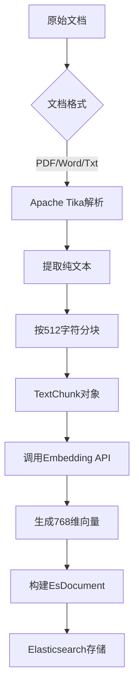
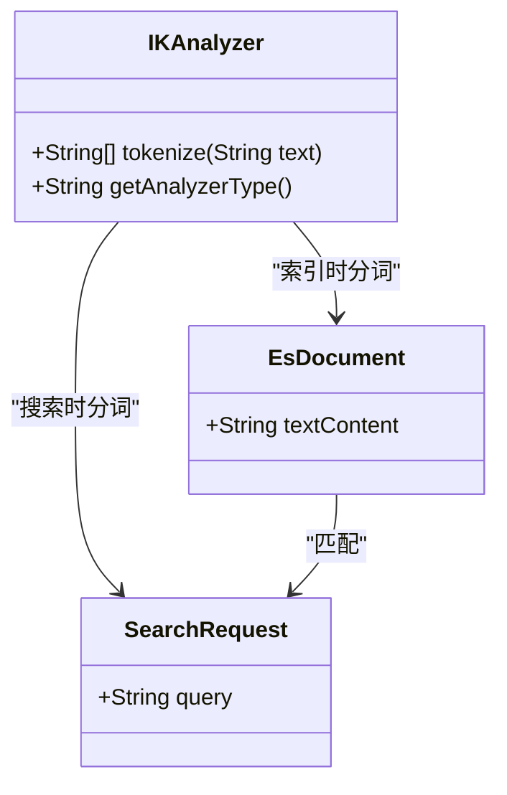
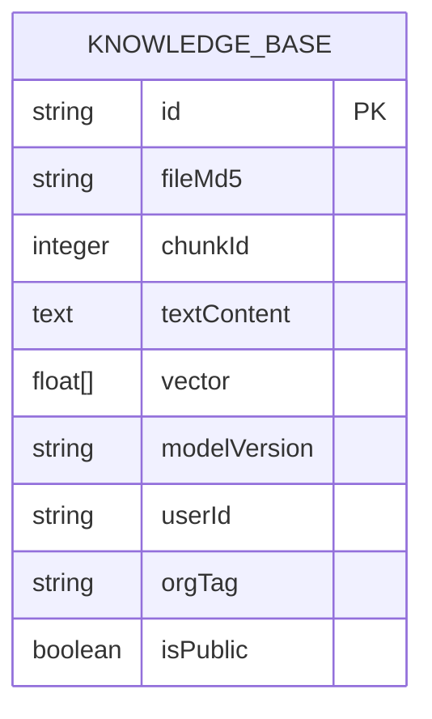

# Elasticsearch索引设计

<cite>
**本文档引用文件**   
- [knowledge_base.json](file://src/main/resources/es-mappings/knowledge_base.json)
- [EsDocument.java](file://src/main/java/com/yizhaoqi/smartpai/entity/EsDocument.java)
- [TextChunk.java](file://src/main/java/com/yizhaoqi/smartpai/entity/TextChunk.java)
- [HybridSearchService.java](file://src/main/java/com/yizhaoqi/smartpai/service/HybridSearchService.java)
- [SearchController.java](file://src/main/java/com/yizhaoqi/smartpai/controller/SearchController.java)
- [ParseService.java](file://src/main/java/com/yizhaoqi/smartpai/service/ParseService.java)
- [application.yml](file://src/main/resources/application.yml)
</cite>

## 目录
1. [引言](#引言)
2. [核心配置解析](#核心配置解析)
3. [实体映射关系](#实体映射关系)
4. [文本分块与向量检索](#文本分块与向量检索)
5. [字段类型设计](#字段类型设计)
6. [分词器与模糊搜索](#分词器与模糊搜索)
7. [索引结构图](#索引结构图)
8. [评分与重打分机制](#评分与重打分机制)
9. [高亮显示实现](#高亮显示实现)
10. [聚合分析](#聚合分析)
11. [结论](#结论)

## 引言
本文档深入解析PaiSmart知识库的Elasticsearch索引结构设计，基于`knowledge_base.json`配置文件详细说明index、type、analyzer等核心配置项。阐述EsDocument实体与ES文档的映射关系，以及TextChunk文本分块在向量检索中的作用。解释keyword、text等字段类型的选用依据，分析ngram分词器在模糊搜索中的优化效果。提供索引mapping结构图，说明评分机制、高亮显示和聚合分析的配置策略，确保全文检索的准确性和性能。

## 核心配置解析
Elasticsearch索引的核心配置位于`src/main/resources/es-mappings/knowledge_base.json`文件中，该文件定义了知识库索引的完整mapping结构。配置文件通过JSON格式精确描述了每个字段的数据类型、分析器、索引选项等属性。

```json
{
  "mappings": {
    "properties": {
      "id": {
        "type": "keyword"
      },
      "fileMd5": {
        "type": "keyword"
      },
      "chunkId": {
        "type": "integer"
      },
      "textContent": {
        "type": "text",
        "analyzer": "ik_max_word",
        "search_analyzer": "ik_smart"
      },
      "vector": {
        "type": "dense_vector",
        "dims": 768,
        "index": true,
        "similarity": "dot_product"
      },
      "modelVersion": {
        "type": "keyword"
      },
      "userId": {
        "type": "keyword"
      },
      "orgTag": {
        "type": "keyword"
      },
      "isPublic": {
        "type": "boolean"
      }
    }
  }
}
```

**配置项说明**：
- **index**: 索引名称为`knowledge_base`，用于存储知识库文档。
- **type**: 文档类型，Elasticsearch 7.x后已弃用，但mapping中仍保留properties结构。
- **analyzer**: 为`textContent`字段配置了中文分词器`ik_max_word`用于索引，`ik_smart`用于搜索，实现细粒度分词和高效检索。

**Section sources**
- [knowledge_base.json](file://src/main/resources/es-mappings/knowledge_base.json)

## 实体映射关系
EsDocument实体类与Elasticsearch文档之间存在直接的映射关系。`EsDocument.java`文件定义了Java对象与ES文档字段的对应。

```java
@Data
public class EsDocument {
    private String id;             
    private String fileMd5;        
    private Integer chunkId;       
    private String textContent;    
    private float[] vector;        
    private String modelVersion;   
    private String userId;         
    private String orgTag;         
    private boolean isPublic;      
}
```

**映射关系表**：
| ES字段 | Java字段 | 数据类型 | 说明 |
|-------|--------|--------|------|
| id | id | keyword | 文档唯一标识 |
| fileMd5 | fileMd5 | keyword | 文件指纹 |
| chunkId | chunkId | integer | 文本分块序号 |
| textContent | textContent | text | 文本内容 |
| vector | vector | dense_vector | 向量数据 |
| modelVersion | modelVersion | keyword | 模型版本 |
| userId | userId | keyword | 上传用户ID |
| orgTag | orgTag | keyword | 组织标签 |
| isPublic | isPublic | boolean | 是否公开 |

**Section sources**
- [EsDocument.java](file://src/main/java/com/yizhaoqi/smartpai/entity/EsDocument.java)

## 文本分块与向量检索
文本分块是向量检索的基础，`TextChunk.java`实体类定义了分块的基本结构。

```java
@Setter
@Getter
public class TextChunk {
    private int chunkId;       
    private String content;    
    public TextChunk(int chunkId, String content) {
        this.chunkId = chunkId;
        this.content = content;
    }
}
```

**分块流程**：
1. **分块大小**: 从`application.yml`配置中读取`file.parsing.chunk-size: 512`，每个文本块最大512个字符。
2. **内容提取**: 使用Apache Tika解析PDF、Word等格式文档，提取纯文本内容。
3. **分块处理**: 将长文本按指定大小分割成多个TextChunk对象。
4. **向量化**: 调用EmbeddingClient将每个文本块转换为768维向量。
5. **存储**: 将EsDocument对象存储到Elasticsearch中。



**Diagram sources**
- [TextChunk.java](file://src/main/java/com/yizhaoqi/smartpai/entity/TextChunk.java)
- [ParseService.java](file://src/main/java/com/yizhaoqi/smartpai/service/ParseService.java)
- [application.yml](file://src/main/resources/application.yml)

## 字段类型设计
字段类型的选择直接影响检索性能和准确性。PaiSmart根据字段特性选择了合适的类型。

**字段类型选用依据**：

```json
"properties": {
  "id": { "type": "keyword" },
  "textContent": { "type": "text" },
  "vector": { "type": "dense_vector", "dims": 768 },
  "userId": { "type": "keyword" },
  "isPublic": { "type": "boolean" }
}
```

**选用依据分析**：
- **keyword**: 用于精确匹配的字段，如`id`、`fileMd5`、`userId`。不进行分词，适合过滤和聚合。
- **text**: 用于全文检索的字段，如`textContent`。会进行分词处理，支持模糊搜索。
- **dense_vector**: 用于存储向量数据，支持KNN相似度计算。
- **integer**: 用于数值型数据，如`chunkId`。
- **boolean**: 用于逻辑判断，如`isPublic`。

**Section sources**
- [knowledge_base.json](file://src/main/resources/es-mappings/knowledge_base.json)

## 分词器与模糊搜索
分词器是实现中文全文检索的关键。PaiSmart使用IK分词器优化中文搜索体验。

**分词器配置**：
```json
"textContent": {
  "type": "text",
  "analyzer": "ik_max_word",
  "search_analyzer": "ik_smart"
}
```

**分词器作用**：
- **ik_max_word**: 索引时使用，将文本进行最细粒度的拆分，尽可能多地创建词条。
- **ik_smart**: 搜索时使用，对文本进行智能拆分，提高搜索效率。

**模糊搜索优化**：
虽然当前配置未使用ngram分词器，但IK分词器本身支持一定程度的模糊匹配。通过细粒度分词，即使用户输入不完整，也能匹配到相关词条。



**Diagram sources**
- [knowledge_base.json](file://src/main/resources/es-mappings/knowledge_base.json)

## 索引结构图
以下是Elasticsearch知识库索引的完整结构图。



**结构说明**：
- **主键**: `id`字段作为文档的唯一标识。
- **文本字段**: `textContent`存储分块后的文本内容。
- **向量字段**: `vector`存储768维向量，用于语义搜索。
- **元数据字段**: 包含文件、用户、权限等信息。

**Diagram sources**
- [knowledge_base.json](file://src/main/resources/es-mappings/knowledge_base.json)

## 评分与重打分机制
PaiSmart采用混合检索策略，结合向量相似度和关键词匹配，通过重打分机制优化排序。

**HybridSearchService中的评分配置**：
```java
s.rescore(r -> r
    .windowSize(recallK)
    .query(rq -> rq
        .queryWeight(0.2d)               
        .rescoreQueryWeight(1.0d)        
        .query(rqq -> rqq.match(m -> m
            .field("textContent")
            .query(query)
            .operator(Operator.And)
        ))
    )
);
```

**评分机制说明**：
1. **第一阶段 (KNN)**: 使用向量相似度召回topK*30个候选文档。
2. **第二阶段 (重打分)**: 在召回的候选集中，使用BM25算法对`textContent`进行关键词匹配重打分。
3. **权重分配**: KNN分数权重0.2，BM25分数权重1.0，确保关键词匹配主导最终排序。

**优势**：
- **召回率**: KNN确保语义相关的文档被召回。
- **准确性**: BM25确保关键词匹配的文档排名靠前。
- **效率**: 两阶段检索避免了全库计算向量相似度的高开销。

**Section sources**
- [HybridSearchService.java](file://src/main/java/com/yizhaoqi/smartpai/service/HybridSearchService.java)

## 高亮显示实现
搜索结果中的关键词高亮功能提升了用户体验。

**前端实现**：
```vue
<NHighlight
  v-if="highlight(item.textContent)"
  highlight-class="bg-[rgb(var(--primary-400-color))] color-white px-2 mx-1 rd-sm"
  :text="item.textContent"
  :patterns="patterns"
/>
```

**实现流程**：
1. **前端**: 使用`NHighlight`组件，将搜索关键词作为patterns传入。
2. **样式**: 匹配的关键词背景色为蓝色，文字为白色，增加可读性。
3. **条件**: 只有当文本包含查询关键词时才进行高亮。

**后端配合**：
- 返回完整的`textContent`，由前端进行高亮处理。
- 不在ES查询中使用`highlight`功能，减轻后端压力。

**Section sources**
- [search-dialog.vue](file://frontend/src/views/knowledge-base/modules/search-dialog.vue)

## 聚合分析
虽然当前代码中未直接体现聚合分析功能，但索引设计为聚合分析提供了基础。

**潜在聚合场景**：
- **按用户聚合**: 统计每个用户的文档数量。
- **按组织标签聚合**: 分析不同部门的知识分布。
- **按公开状态聚合**: 统计公开和私有文档的比例。

**聚合查询示例**：
```json
{
  "aggs": {
    "user_stats": {
      "terms": { "field": "userId" }
    },
    "org_tag_stats": {
      "terms": { "field": "orgTag" }
    },
    "public_stats": {
      "terms": { "field": "isPublic" }
    }
  }
}
```

**实现基础**：
- `keyword`类型的字段天然支持聚合分析。
- `userId`、`orgTag`、`isPublic`等字段已配置为`keyword`或`boolean`，可直接用于聚合。

## 结论
PaiSmart知识库的Elasticsearch索引设计充分考虑了全文检索、向量检索和权限控制的需求。通过合理的字段类型选择、分词器配置和混合检索策略，实现了高效准确的搜索功能。文本分块和向量化处理为语义搜索提供了基础，而重打分机制则平衡了语义相关性和关键词匹配。未来可进一步优化ngram分词器以增强模糊搜索能力，并开发聚合分析功能以提供数据洞察。