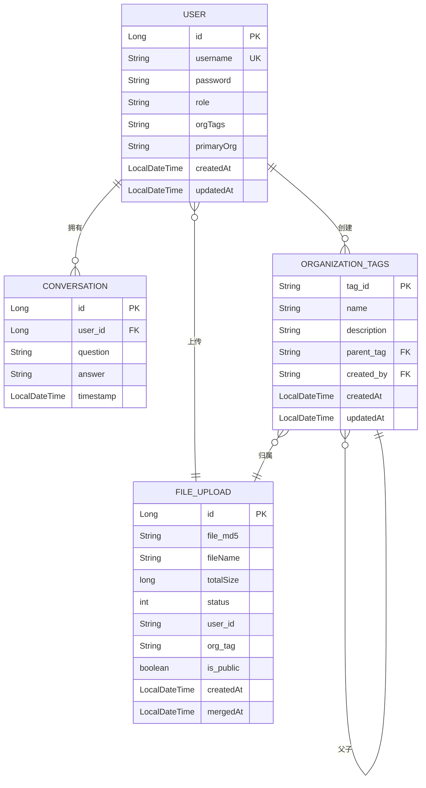

# 关系型数据库模型

<cite>
**本文档引用的文件**   
- [User.java](file://src/main/java/com/yizhaoqi/smartpai/model/User.java)
- [Conversation.java](file://src/main/java/com/yizhaoqi/smartpai/model/Conversation.java)
- [FileUpload.java](file://src/main/java/com/yizhaoqi/smartpai/model/FileUpload.java)
- [OrganizationTag.java](file://src/main/java/com/yizhaoqi/smartpai/model/OrganizationTag.java)
- [ConversationRepository.java](file://src/main/java/com/yizhaoqi/smartpai/repository/ConversationRepository.java)
- [FileUploadRepository.java](file://src/main/java/com/yizhaoqi/smartpai/repository/FileUploadRepository.java)
- [OrganizationTagRepository.java](file://src/main/java/com/yizhaoqi/smartpai/repository/OrganizationTagRepository.java)
- [UserRepository.java](file://src/main/java/com/yizhaoqi/smartpai/repository/UserRepository.java)
- [UserService.java](file://src/main/java/com/yizhaoqi/smartpai/service/UserService.java)
- [ConversationService.java](file://src/main/java/com/yizhaoqi/smartpai/service/ConversationService.java)
</cite>

## 目录
1. [引言](#引言)
2. [核心实体模型分析](#核心实体模型分析)
3. [JPA关系映射详解](#jpa关系映射详解)
4. [实体关系图(ERD)](#实体关系图erd)
5. [数据访问模式与Repository接口](#数据访问模式与repository接口)
6. [典型查询SQL生成示例](#典型查询sql生成示例)
7. [总结](#总结)

## 引言

PaiSmart系统采用基于JPA的持久化方案，构建了一套完整的领域驱动设计(DDD)数据模型。本文档详细阐述了系统中User（用户）、Conversation（会话）、FileUpload（文件上传）和OrganizationTag（组织标签）四个核心实体的设计原理、字段定义、主键策略、数据约束以及实体间的关联关系。通过分析JPA注解的应用、Repository接口的查询方法以及实际业务逻辑，全面揭示了系统数据层的设计思想和实现机制。

**文档来源**
- [User.java](file://src/main/java/com/yizhaoqi/smartpai/model/User.java)
- [Conversation.java](file://src/main/java/com/yizhaoqi/smartpai/model/Conversation.java)
- [FileUpload.java](file://src/main/java/com/yizhaoqi/smartpai/model/FileUpload.java)
- [OrganizationTag.java](file://src/main/java/com/yizhaoqi/smartpai/model/OrganizationTag.java)

## 核心实体模型分析

### User实体分析

User实体是系统的核心身份模型，代表了系统的用户账户。

**字段定义与数据约束**
```java
@Data
@Entity
@Table(name = "users", uniqueConstraints = @UniqueConstraint(columnNames = "username"))
public class User {
    @Id
    @GeneratedValue(strategy = GenerationType.IDENTITY)
    private Long id;

    @Column(nullable = false, unique = true)
    private String username;

    @Column(nullable = false)
    private String password;

    @Enumerated(EnumType.STRING)
    @Column(nullable = false)
    private Role role;

    @Column(name = "org_tags")
    private String orgTags; // 用户所属组织标签，多个用逗号分隔

    @Column(name = "primary_org")
    private String primaryOrg; // 用户主组织标签

    @CreationTimestamp
    private LocalDateTime createdAt;

    @UpdateTimestamp
    private LocalDateTime updatedAt;

    public enum Role {
        USER, ADMIN
    }
}
```

- **主键策略**: 使用`@Id`和`@GeneratedValue(strategy = GenerationType.IDENTITY)`，表明`id`字段为自增主键，由数据库自动分配。
- **数据约束**:
  - `username`: 不可为空(`nullable = false`)，且必须唯一(`unique = true`)，通过`@Table`的`uniqueConstraints`确保。
  - `password`: 不可为空。
  - `role`: 不可为空，使用`@Enumerated(EnumType.STRING)`将枚举值以字符串形式存储。
  - `orgTags`和`primaryOrg`: 存储用户所属的组织标签信息，用于权限控制。
- **时间戳**: `createdAt`和`updatedAt`字段使用`@CreationTimestamp`和`@UpdateTimestamp`注解，由Hibernate自动管理创建和更新时间。

**Section sources**
- [User.java](file://src/main/java/com/yizhaoqi/smartpai/model/User.java#L1-L44)

### Conversation实体分析

Conversation实体记录了用户与AI系统之间的对话历史。

**字段定义与数据约束**
```java
@Data
@Entity
@Table(name = "conversations", indexes = {
        @Index(name = "idx_user_id", columnList = "user_id"),
        @Index(name = "idx_timestamp", columnList = "timestamp")
})
public class Conversation {
    @Id
    @GeneratedValue(strategy = GenerationType.IDENTITY)
    private Long id;

    @ManyToOne(fetch = FetchType.LAZY)
    @JoinColumn(name = "user_id", nullable = false)
    private User user;

    @Column(nullable = false, columnDefinition = "TEXT")
    private String question;

    @Column(nullable = false, columnDefinition = "TEXT")
    private String answer;

    @CreationTimestamp
    private LocalDateTime timestamp;
}
```

- **主键策略**: `id`为自增主键。
- **数据约束**:
  - `user`: 不可为空(`nullable = false`)，通过`@JoinColumn`关联到`users`表的`id`。
  - `question`和`answer`: 不可为空，使用`columnDefinition = "TEXT"`指定数据库字段类型为TEXT，以支持长文本存储。
- **索引**: 在`user_id`和`timestamp`字段上创建了数据库索引，以优化按用户和时间范围查询的性能。

**Section sources**
- [Conversation.java](file://src/main/java/com/yizhaoqi/smartpai/model/Conversation.java#L1-L33)

### FileUpload实体分析

FileUpload实体用于管理用户上传的文件元数据。

**字段定义与数据约束**
```java
@Data
@Entity
@Table(name = "file_upload")
public class FileUpload {
    @Id
    @GeneratedValue(strategy = GenerationType.IDENTITY)
    private Long id;

    @Column(name = "file_md5", length = 32, nullable = false)
    private String fileMd5;

    private String fileName;

    private long totalSize;

    private int status;

    @Column(name = "user_id", length = 64, nullable = false)
    private String userId;

    @Column(name = "org_tag")
    private String orgTag;

    @Column(name = "is_public", nullable = false)
    private boolean isPublic = false;

    @CreationTimestamp
    private LocalDateTime createdAt;

    @UpdateTimestamp
    private LocalDateTime mergedAt;
}
```

- **主键策略**: `id`为自增主键。
- **数据约束**:
  - `fileMd5`: 不可为空，长度限制为32，用于唯一标识文件（基于MD5值）。
  - `userId`: 不可为空，长度限制为64，标识上传文件的用户。
  - `isPublic`: 不可为空，默认值为`false`，表示文件是否公开。
- **特殊字段**:
  - `status`: 0表示上传中，1表示上传完成。
  - `mergedAt`: 使用`@UpdateTimestamp`，当文件合并完成（状态变为1）时自动更新。

**Section sources**
- [FileUpload.java](file://src/main/java/com/yizhaoqi/smartpai/model/FileUpload.java#L1-L83)

### OrganizationTag实体分析

OrganizationTag实体实现了组织标签的层级结构，用于权限管理和资源分组。

**字段定义与数据约束**
```java
@Data
@Entity
@Table(name = "organization_tags")
public class OrganizationTag {
    @Id
    @Column(name = "tag_id")
    private String tagId;

    @Column(nullable = false)
    private String name;

    @Column(columnDefinition = "TEXT")
    private String description;

    @Column(name = "parent_tag", length = 255)
    private String parentTag;

    @ManyToOne
    @JoinColumn(name = "created_by", nullable = false)
    private User createdBy;

    @CreationTimestamp
    private LocalDateTime createdAt;

    @UpdateTimestamp
    private LocalDateTime updatedAt;
}
```

- **主键策略**: 使用`tagId`作为主键，而非自增ID，这允许使用业务相关的字符串作为唯一标识。
- **数据约束**:
  - `name`: 不可为空。
  - `createdBy`: 不可为空，通过`@ManyToOne`关联到创建该标签的用户。
- **层级结构**: `parentTag`字段存储父标签的`tagId`，通过递归查询可以构建完整的组织树。

**Section sources**
- [OrganizationTag.java](file://src/main/java/com/yizhaoqi/smartpai/model/OrganizationTag.java#L1-L36)

## JPA关系映射详解

### @ManyToOne与@OneToMany关系

JPA通过`@ManyToOne`和`@OneToMany`注解建立实体间的关联。

#### 用户与会话 (User <-> Conversation)

在`Conversation`实体中，`user`字段使用`@ManyToOne`注解：
```java
@ManyToOne(fetch = FetchType.LAZY)
@JoinColumn(name = "user_id", nullable = false)
private User user;
```
- **关系类型**: 多对一。多个`Conversation`记录可以关联到同一个`User`。
- **获取策略**: `FetchType.LAZY`表示延迟加载，只有在访问`conversation.getUser()`时才会从数据库查询用户信息，有助于提升性能。
- **外键**: `@JoinColumn(name = "user_id")`指定了外键字段名为`user_id`，它引用`users`表的`id`。

虽然`User`实体中没有显式声明`@OneToMany`，但根据JPA规范，这构成了一种**单向多对一**关系。如果需要双向关联，可以在`User`类中添加：
```java
@OneToMany(mappedBy = "user", cascade = CascadeType.ALL, orphanRemoval = true)
private List<Conversation> conversations = new ArrayList<>();
```
- `mappedBy = "user"`: 指明关系由`Conversation`实体的`user`字段维护。
- `cascade = CascadeType.ALL`: 级联操作，当删除用户时，其所有会话也会被删除。
- `orphanRemoval = true`: 当会话从用户的`conversations`列表中移除时，该会话记录将被自动删除。

#### 文件上传与组织标签 (FileUpload -> OrganizationTag)

`FileUpload`实体通过`orgTag`字段与`OrganizationTag`关联：
```java
@Column(name = "org_tag")
private String orgTag;
```
这是一种**非标准的关联方式**。它没有使用`@ManyToOne`，而是直接存储了`OrganizationTag`的`tagId`（字符串）。这种设计简化了查询，避免了复杂的JOIN操作，但牺牲了JPA的级联和对象导航能力。权限检查时，系统会根据`orgTag`值在缓存或数据库中查找对应的标签信息。

#### 组织标签的层级结构 (OrganizationTag -> OrganizationTag)

`OrganizationTag`实体通过`parentTag`字段实现了自引用：
```java
@Column(name = "parent_tag", length = 255)
private String parentTag;
```
同样，这是一种**非标准的自引用**。它存储了父标签的`tagId`。要构建完整的树形结构，需要在业务逻辑层（如`UserService`）中进行递归查询。

#### 组织标签与创建者 (OrganizationTag -> User)

`OrganizationTag`实体通过`createdBy`字段与`User`建立标准的`@ManyToOne`关系：
```java
@ManyToOne
@JoinColumn(name = "created_by", nullable = false)
private User createdBy;
```
这表示一个用户可以创建多个组织标签，而一个组织标签只能由一个用户创建。

**Section sources**
- [Conversation.java](file://src/main/java/com/yizhaoqi/smartpai/model/Conversation.java#L1-L33)
- [FileUpload.java](file://src/main/java/com/yizhaoqi/smartpai/model/FileUpload.java#L1-L83)
- [OrganizationTag.java](file://src/main/java/com/yizhaoqi/smartpai/model/OrganizationTag.java#L1-L36)

## 实体关系图(ERD)



**Diagram sources**
- [User.java](file://src/main/java/com/yizhaoqi/smartpai/model/User.java)
- [Conversation.java](file://src/main/java/com/yizhaoqi/smartpai/model/Conversation.java)
- [FileUpload.java](file://src/main/java/com/yizhaoqi/smartpai/model/FileUpload.java)
- [OrganizationTag.java](file://src/main/java/com/yizhaoqi/smartpai/model/OrganizationTag.java)

## 数据访问模式与Repository接口

### 分页查询与条件检索

Spring Data JPA的Repository接口通过方法名约定或`@Query`注解实现数据访问。

#### ConversationRepository分析

```java
@Repository
public interface ConversationRepository extends JpaRepository<Conversation, Long> {
    List<Conversation> findByUserIdAndTimestampBetween(Long userId, LocalDateTime startDate, LocalDateTime endDate);
    List<Conversation> findByUserId(Long userId);
    List<Conversation> findByTimestampBetween(LocalDateTime startDate, LocalDateTime endDate);
}
```
- **方法名约定**: Spring Data JPA会解析方法名，自动生成SQL。例如：
  - `findByUserId`: 生成 `SELECT * FROM conversations WHERE user_id = ?`
  - `findByUserIdAndTimestampBetween`: 生成 `SELECT * FROM conversations WHERE user_id = ? AND timestamp BETWEEN ? AND ?`
- **分页支持**: 虽然接口中未显式定义，但`JpaRepository`继承了`PagingAndSortingRepository`，因此可以传入`Pageable`参数实现分页：
  ```java
  Page<Conversation> findByUserId(Long userId, Pageable pageable);
  ```

#### FileUploadRepository分析

```java
@Repository
public interface FileUploadRepository extends JpaRepository<FileUpload, Long> {
    @Query("SELECT f FROM FileUpload f WHERE f.userId = :userId OR f.isPublic = true OR (f.orgTag IN :orgTagList AND f.isPublic = false)")
    List<FileUpload> findAccessibleFilesWithTags(@Param("userId") String userId, @Param("orgTagList") List<String> orgTagList);
    
    List<FileUpload> findByUserId(String userId);
}
```
- **自定义查询**: 使用`@Query`注解编写JPQL（Java Persistence Query Language）语句，实现复杂的权限逻辑。
  - `findAccessibleFilesWithTags`: 查询用户可访问的文件，包括：1) 用户自己的文件，2) 公开的文件，3) 用户所属组织且非公开的文件。
- **参数绑定**: 使用`@Param`注解将方法参数绑定到JPQL中的命名参数。

#### OrganizationTagRepository分析

```java
public interface OrganizationTagRepository extends JpaRepository<OrganizationTag, String> {
    Optional<OrganizationTag> findByTagId(String tagId);
    List<OrganizationTag> findByParentTag(String parentTag);
    boolean existsByTagId(String tagId);
}
```
- **主键类型**: `JpaRepository<OrganizationTag, String>`表明主键类型为`String`。
- **树形查询**: `findByParentTag`是构建组织树的关键，通过查询`parent_tag`等于某个`tagId`的所有子标签。

#### UserRepository分析

```java
public interface UserRepository extends JpaRepository<User, Long> {
    Optional<User> findByUsername(String username);
}
```
- **唯一性查询**: `findByUsername`用于用户登录认证，检查用户名是否存在。

**Section sources**
- [ConversationRepository.java](file://src/main/java/com/yizhaoqi/smartpai/repository/ConversationRepository.java)
- [FileUploadRepository.java](file://src/main/java/com/yizhaoqi/smartpai/repository/FileUploadRepository.java)
- [OrganizationTagRepository.java](file://src/main/java/com/yizhaoqi/smartpai/repository/OrganizationTagRepository.java)
- [UserRepository.java](file://src/main/java/com/yizhaoqi/smartpai/repository/UserRepository.java)

## 典型查询SQL生成示例

根据Repository接口的方法，Spring Data JPA会生成相应的SQL语句。

### 1. 查询用户的所有会话记录

**Repository方法**:
```java
List<Conversation> findByUserId(Long userId);
```

**生成的SQL**:
```sql
SELECT 
    c.id, 
    c.user_id, 
    c.question, 
    c.answer, 
    c.timestamp 
FROM 
    conversations c 
WHERE 
    c.user_id = ?
```

### 2. 查询特定时间范围内的会话

**Repository方法**:
```java
List<Conversation> findByUserIdAndTimestampBetween(Long userId, LocalDateTime startDate, LocalDateTime endDate);
```

**生成的SQL**:
```sql
SELECT 
    c.id, 
    c.user_id, 
    c.question, 
    c.answer, 
    c.timestamp 
FROM 
    conversations c 
WHERE 
    c.user_id = ? 
    AND c.timestamp BETWEEN ? AND ?
```

### 3. 查询用户可访问的文件（含权限控制）

**Repository方法**:
```java
@Query("SELECT f FROM FileUpload f WHERE f.userId = :userId OR f.isPublic = true OR (f.orgTag IN :orgTagList AND f.isPublic = false)")
List<FileUpload> findAccessibleFilesWithTags(@Param("userId") String userId, @Param("orgTagList") List<String> orgTagList);
```

**生成的SQL**:
```sql
SELECT 
    f.id, 
    f.file_md5, 
    f.file_name, 
    f.total_size, 
    f.status, 
    f.user_id, 
    f.org_tag, 
    f.is_public, 
    f.created_at, 
    f.merged_at 
FROM 
    file_upload f 
WHERE 
    f.user_id = ? 
    OR f.is_public = true 
    OR (f.org_tag IN (?, ?, ?) AND f.is_public = false)
```
（`IN (?, ?, ?)`中的问号数量取决于`orgTagList`的大小）

### 4. 查询组织标签的子标签

**Repository方法**:
```java
List<OrganizationTag> findByParentTag(String parentTag);
```

**生成的SQL**:
```sql
SELECT 
    o.tag_id, 
    o.name, 
    o.description, 
    o.parent_tag, 
    o.created_by, 
    o.created_at, 
    o.updated_at 
FROM 
    organization_tags o 
WHERE 
    o.parent_tag = ?
```

**Section sources**
- [ConversationRepository.java](file://src/main/java/com/yizhaoqi/smartpai/repository/ConversationRepository.java)
- [FileUploadRepository.java](file://src/main/java/com/yizhaoqi/smartpai/repository/FileUploadRepository.java)
- [OrganizationTagRepository.java](file://src/main/java/com/yizhaoqi/smartpai/repository/OrganizationTagRepository.java)

## 总结

PaiSmart系统的JPA数据模型设计清晰且实用。核心实体`User`、`Conversation`、`FileUpload`和`OrganizationTag`通过合理的字段定义和约束，准确地映射了业务需求。系统巧妙地结合了标准的JPA关系映射（如`@ManyToOne`）和非标准的字符串引用（如`orgTag`），在保证数据完整性的同时，兼顾了查询性能和实现的简洁性。Repository接口通过方法名约定和JPQL，提供了强大而灵活的数据访问能力，特别是`findAccessibleFilesWithTags`方法，完美地实现了基于组织标签的复杂权限控制。整体设计体现了领域驱动和实用主义的平衡。