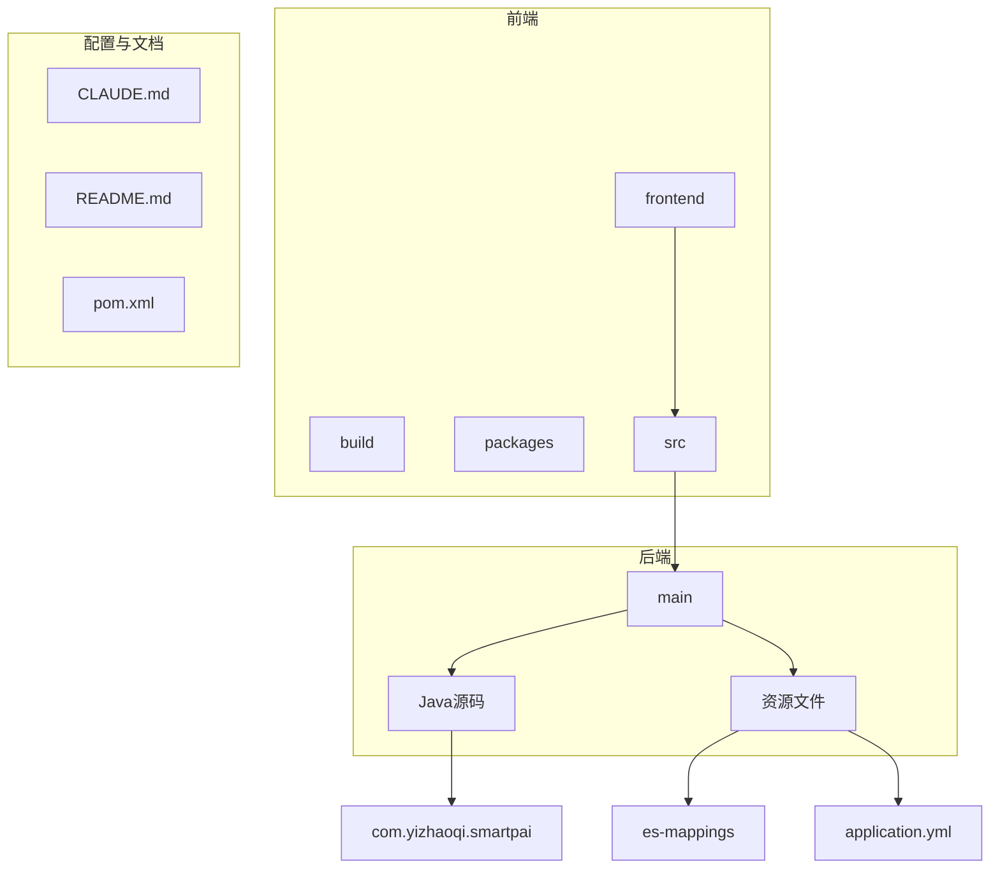
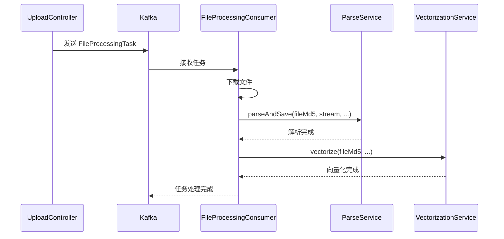
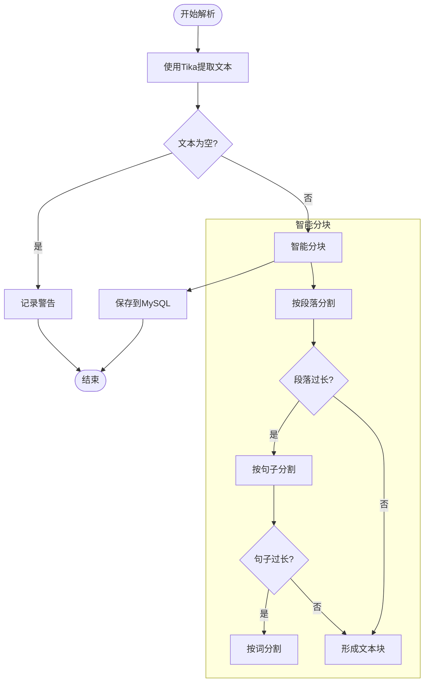
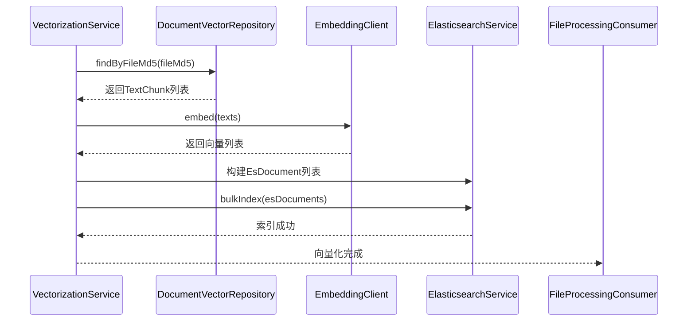
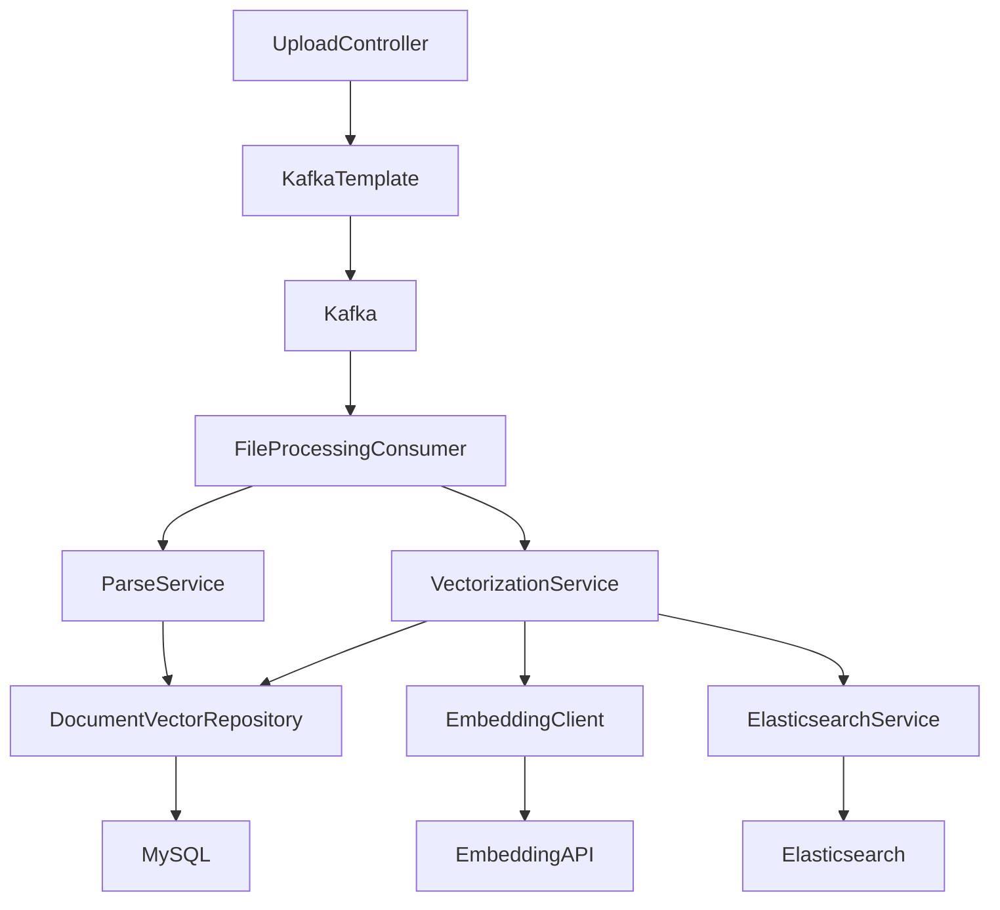

# 数据同步机制

<cite>
**本文档引用的文件**   
- [FileProcessingConsumer.java](file://src/main/java/com/yizhaoqi/smartpai/consumer/FileProcessingConsumer.java)
- [VectorizationService.java](file://src/main/java/com/yizhaoqi/smartpai/service/VectorizationService.java)
- [ParseService.java](file://src/main/java/com/yizhaoqi/smartpai/service/ParseService.java)
- [ElasticsearchService.java](file://src/main/java/com/yizhaoqi/smartpai/service/ElasticsearchService.java)
- [EmbeddingClient.java](file://src/main/java/com/yizhaoqi/smartpai/client/EmbeddingClient.java)
- [KafkaConfig.java](file://src/main/java/com/yizhaoqi/smartpai/config/KafkaConfig.java)
- [UploadController.java](file://src/main/java/com/yizhaoqi/smartpai/controller/UploadController.java)
- [application.yml](file://src/main/resources/application.yml)
- [FileProcessingTask.java](file://src/main/java/com/yizhaoqi/smartpai/model/FileProcessingTask.java)
- [EsDocument.java](file://src/main/java/com/yizhaoqi/smartpai/entity/EsDocument.java)
- [DocumentVector.java](file://src/main/java/com/yizhaoqi/smartpai/model/DocumentVector.java)
- [DocumentVectorRepository.java](file://src/main/java/com/yizhaoqi/smartpai/repository/DocumentVectorRepository.java)
- [knowledge_base.json](file://src/main/resources/es-mappings/knowledge_base.json)
</cite>

## 目录
1. [简介](#简介)
2. [项目结构](#项目结构)
3. [核心组件](#核心组件)
4. [架构概览](#架构概览)
5. [详细组件分析](#详细组件分析)
6. [依赖分析](#依赖分析)
7. [性能考量](#性能考量)
8. [故障排除指南](#故障排除指南)
9. [结论](#结论)

## 简介
本文档系统阐述了PaiSmart系统中MySQL与Elasticsearch之间的数据同步机制，详细描述了从文件上传到文本向量化的完整数据流转过程。重点分析了`FileProcessingConsumer`如何通过Kafka消息触发文档解析和向量化任务，以及`VectorizationService`如何协调Tika解析、豆包Embedding调用和ES索引入库。同时，文档深入探讨了异常情况下的重试机制和数据一致性保障策略，并提供了数据同步时序图，确保RAG系统中结构化数据与非结构化检索数据的实时同步与一致性。

## 项目结构
PaiSmart项目采用典型的前后端分离架构，后端主要由Spring Boot应用构成，负责核心业务逻辑、数据处理和API服务。项目结构清晰，分为`frontend`和`src`两个主要部分。

**图示来源**
- [项目结构](file://)

**本节来源**
- [项目结构](file://)

## 核心组件
PaiSmart系统的数据同步机制由多个核心组件协同工作，主要包括：
- **FileProcessingConsumer**: Kafka消费者，负责监听文件处理任务并触发后续流程。
- **ParseService**: 使用Apache Tika解析文档内容，并将文本分块后存入MySQL。
- **VectorizationService**: 协调向量化流程，从MySQL获取文本块，调用Embedding API生成向量，并将结果存入Elasticsearch。
- **EmbeddingClient**: 封装对豆包Embedding API的调用。
- **ElasticsearchService**: 封装对Elasticsearch的批量索引操作。
- **UploadController**: 文件上传的入口点，负责接收分片并触发合并与任务发布。

**本节来源**
- [FileProcessingConsumer.java](file://src/main/java/com/yizhaoqi/smartpai/consumer/FileProcessingConsumer.java)
- [VectorizationService.java](file://src/main/java/com/yizhaoqi/smartpai/service/VectorizationService.java)
- [ParseService.java](file://src/main/java/com/yizhaoqi/smartpai/service/ParseService.java)
- [EmbeddingClient.java](file://src/main/java/com/yizhaoqi/smartpai/client/EmbeddingClient.java)
- [ElasticsearchService.java](file://src/main/java/com/yizhaoqi/smartpai/service/ElasticsearchService.java)
- [UploadController.java](file://src/main/java/com/yizhaoqi/smartpai/controller/UploadController.java)

## 架构概览
PaiSmart的数据同步流程是一个典型的异步、事件驱动的管道。整个流程始于用户上传文件，终于文件内容被索引到Elasticsearch中，可供RAG系统检索。

**图示来源**
- [FileProcessingConsumer.java](file://src/main/java/com/yizhaoqi/smartpai/consumer/FileProcessingConsumer.java)
- [UploadController.java](file://src/main/java/com/yizhaoqi/smartpai/controller/UploadController.java)
- [ParseService.java](file://src/main/java/com/yizhaoqi/smartpai/service/ParseService.java)
- [VectorizationService.java](file://src/main/java/com/yizhaoqi/smartpai/service/VectorizationService.java)

## 详细组件分析

### FileProcessingConsumer 分析
`FileProcessingConsumer`是数据同步流程的触发器。它是一个Spring Kafka监听器，订阅`file-processing-topic1`主题。当`UploadController`在文件合并成功后发送`FileProcessingTask`消息时，该消费者会被激活。

**图示来源**
- [FileProcessingConsumer.java](file://src/main/java/com/yizhaoqi/smartpai/consumer/FileProcessingConsumer.java#L30-L128)
- [UploadController.java](file://src/main/java/com/yizhaoqi/smartpai/controller/UploadController.java#L250-L300)

**本节来源**
- [FileProcessingConsumer.java](file://src/main/java/com/yizhaoqi/smartpai/consumer/FileProcessingConsumer.java)
- [UploadController.java](file://src/main/java/com/yizhaoqi/smartpai/controller/UploadController.java)

### ParseService 分析
`ParseService`负责文档的解析和结构化存储。它使用Apache Tika作为底层解析引擎，能够处理多种文档格式（如PDF、DOCX等）。

**图示来源**
- [ParseService.java](file://src/main/java/com/yizhaoqi/smartpai/service/ParseService.java#L50-L250)

**本节来源**
- [ParseService.java](file://src/main/java/com/yizhaoqi/smartpai/service/ParseService.java)

### VectorizationService 分析
`VectorizationService`是向量化流程的核心协调者。它从MySQL中读取已解析的文本块，调用Embedding API生成向量，并将包含向量的文档批量写入Elasticsearch。

**图示来源**
- [VectorizationService.java](file://src/main/java/com/yizhaoqi/smartpai/service/VectorizationService.java#L20-L80)
- [DocumentVectorRepository.java](file://src/main/java/com/yizhaoqi/smartpai/repository/DocumentVectorRepository.java#L10-L15)
- [ElasticsearchService.java](file://src/main/java/com/yizhaoqi/smartpai/service/ElasticsearchService.java#L20-L50)

**本节来源**
- [VectorizationService.java](file://src/main/java/com/yizhaoqi/smartpai/service/VectorizationService.java)
- [DocumentVectorRepository.java](file://src/main/java/com/yizhaoqi/smartpai/repository/DocumentVectorRepository.java)
- [ElasticsearchService.java](file://src/main/java/com/yizhaoqi/smartpai/service/ElasticsearchService.java)

## 依赖分析
各组件之间的依赖关系清晰，形成了一个松耦合的系统。

**图示来源**
- [项目依赖关系](file://)

**本节来源**
- [FileProcessingConsumer.java](file://src/main/java/com/yizhaoqi/smartpai/consumer/FileProcessingConsumer.java)
- [ParseService.java](file://src/main/java/com/yizhaoqi/smartpai/service/ParseService.java)
- [VectorizationService.java](file://src/main/java/com/yizhaoqi/smartpai/service/VectorizationService.java)
- [KafkaConfig.java](file://src/main/java/com/yizhaoqi/smartpai/config/KafkaConfig.java)

## 性能考量
该数据同步机制在设计上考虑了性能和可靠性：
- **异步处理**：使用Kafka解耦文件上传和处理，避免阻塞用户请求。
- **批量操作**：`VectorizationService`和`ElasticsearchService`都采用批量处理，减少I/O开销。
- **流式解析**：`ParseService`使用`StreamingContentHandler`处理大文件，避免内存溢出。
- **重试机制**：Kafka消费者配置了`DefaultErrorHandler`，支持自动重试和死信队列，确保消息不丢失。

## 故障排除指南
当数据同步出现问题时，可按以下步骤排查：
1. **检查Kafka**：确认`file-processing-topic1`主题有消息产生，且`file-processing-group`消费者组能正常消费。
2. **检查日志**：查看`FileProcessingConsumer`的日志，确认任务是否被接收，以及`parseAndSave`和`vectorize`方法是否成功执行。
3. **检查MySQL**：查询`document_vectors`表，确认指定`fileMd5`的文本块是否已存入。
4. **检查Elasticsearch**：使用ES的`_search` API查询`knowledge_base`索引，确认文档是否已索引。
5. **检查API调用**：确认豆包Embedding API是否返回正常响应，检查API Key和网络连接。

**本节来源**
- [FileProcessingConsumer.java](file://src/main/java/com/yizhaoqi/smartpai/consumer/FileProcessingConsumer.java)
- [VectorizationService.java](file://src/main/java/com/yizhaoqi/smartpai/service/VectorizationService.java)
- [ElasticsearchService.java](file://src/main/java/com/yizhaoqi/smartpai/service/ElasticsearchService.java)
- [application.yml](file://src/main/resources/application.yml)

## 结论
PaiSmart的数据同步机制设计精巧，通过Kafka实现了上传与处理的解耦，利用Tika、豆包Embedding和Elasticsearch构建了一个完整的非结构化数据处理管道。该机制具备良好的可扩展性和容错性，为RAG系统提供了实时、一致的检索数据源。通过理解`FileProcessingConsumer`的触发逻辑、`ParseService`的解析流程和`VectorizationService`的协调作用，可以有效地维护和优化此数据同步系统。