# 数据库设计

<cite>
**本文档引用的文件**
- [User.java:9-42](file://src/main/java/com/yizhaoqi/smartpai/model/User.java#L9-L42)
- [Conversation.java:8-32](file://src/main/java/com/yizhaoqi/smartpai/model/Conversation.java#L8-L32)
- [FileUpload.java:13-80](file://src/main/java/com/yizhaoqi/smartpai/model/FileUpload.java#L13-L80)
- [InviteCode.java:10-47](file://src/main/java/com/yizhaoqi/smartpai/model/InviteCode.java#L10-L47)
- [RechargeOrder.java:22-79](file://src/main/java/com/yizhaoqi/smartpai/model/RechargeOrder.java#L22-L79)
- [RechargePackage.java:20-63](file://src/main/java/com/yizhaoqi/smartpai/model/RechargePackage.java#L20-L63)
- [ModelProviderConfig.java:24-68](file://src/main/java/com/yizhaoqi/smartpai/model/ModelProviderConfig.java#L24-L68)
- [RateLimitConfig.java:1-49](file://src/main/java/com/yizhaoqi/smartpai/model/RateLimitConfig.java#L1-L49)
- [UserTokenRecord.java:1-111](file://src/main/java/com/yizhaoqi/smartpai/model/UserTokenRecord.java#L1-L111)
- [UserDailyChatCount.java:1-66](file://src/main/java/com/yizhaoqi/smartpai/model/UserDailyChatCount.java#L1-L66)
- [DailyUsageStat.java:5-9](file://src/main/java/com/yizhaoqi/smartpai/model/DailyUsageStat.java#L5-L9)
- [knowledge_base.json:1-35](file://src/main/resources/es-mappings/knowledge_base.json#L1-L35)
- [UserRepository.java:7-10](file://src/main/java/com/yizhaoqi/smartpai/repository/UserRepository.java#L7-L10)
- [ConversationRepository.java:10-38](file://src/main/java/com/yizhaoqi/smartpai/repository/ConversationRepository.java#L10-L38)
- [FileUploadRepository.java:10-64](file://src/main/java/com/yizhaoqi/smartpai/repository/FileUploadRepository.java#L10-L64)
- [InviteCodeRepository.java:14-24](file://src/main/java/com/yizhaoqi/smartpai/repository/InviteCodeRepository.java#L14-L24)
- [RechargeOrderRepository.java:16-33](file://src/main/java/com/yizhaoqi/smartpai/repository/RechargeOrderRepository.java#L16-L33)
- [RechargePackageRepository.java:15-42](file://src/main/java/com/yizhaoqi/smartpai/repository/RechargePackageRepository.java#L15-L42)
- [RateLimitConfigRepository.java:1-8](file://src/main/java/com/yizhaoqi/smartpai/repository/RateLimitConfigRepository.java#L1-L8)
- [UserTokenRecordRepository.java:1-99](file://src/main/java/com/yizhaoqi/smartpai/repository/UserTokenRecordRepository.java#L1-L99)
- [ModelProviderConfigRepository.java:9-16](file://src/main/java/com/yizhaoqi/smartpai/repository/ModelProviderConfigRepository.java#L9-L16)
- [UserService.java:0-199](file://src/main/java/com/yizhaoqi/smartpai/service/UserService.java#L0-L199)
- [ConversationService.java:0-111](file://src/main/java/com/yizhaoqi/smartpai/service/ConversationService.java#L0-L111)
- [UploadService.java:0-199](file://src/main/java/com/yizhaoqi/smartpai/service/UploadService.java#L0-L199)
- [ElasticsearchService.java:0-86](file://src/main/java/com/yizhaoqi/smartpai/service/ElasticsearchService.java#L0-L86)
- [HybridSearchService.java:0-199](file://src/main/java/com/yizhaoqi/smartpai/service/HybridSearchService.java#L0-L199)
- [DocumentService.java:0-199](file://src/main/java/com/yizhaoqi/smartpai/service/DocumentService.java#L0-L199)
- [RechargeController.java:30-197](file://src/main/java/com/yizhaoqi/smartpai/controller/RechargeController.java#L30-L197)
- [RateLimitConfigService.java:1-280](file://src/main/java/com/yizhaoqi/smartpai/service/RateLimitConfigService.java#L1-L280)
- [UserTokenService.java:1-457](file://src/main/java/com/yizhaoqi/smartpai/service/UserTokenService.java#L1-L457)
- [InviteCodeService.java:1-214](file://src/main/java/com/yizhaoqi/smartpai/service/InviteCodeService.java#L1-L214)
- [ddl.sql:1-179](file://docs/databases/ddl.sql#L1-L179)
</cite>

## 更新摘要
**所做更改**
- 新增速率限制配置表（rate_limit_configs）的设计与实现
- 新增用户Token记录表（user_token_record）的设计与实现
- 新增用户每日对话次数表（user_daily_chat_count）的设计与实现
- 更新核心实体关系图以包含新的计费和配额管理表
- 完善数据一致性保障机制，新增Redis缓存与数据库双写策略
- 新增Token余额管理与消费追踪的完整实现

## 目录
1. [数据库架构概述](#数据库架构概述)
2. [核心实体模型设计](#核心实体模型设计)
3. [关系型数据库设计](#关系型数据库设计)
4. [Elasticsearch索引设计](#elasticsearch索引设计)
5. [数据一致性保障机制](#数据一致性保障机制)
6. [跨存储查询实现](#跨存储查询实现)

## 数据库架构概述

PaiSmart系统采用MySQL与Elasticsearch双重存储架构，实现结构化数据存储与全文检索功能的分离与协同。MySQL作为主数据库存储用户、对话、文件、邀请码、充值订单等核心业务数据，确保数据的ACID特性；Elasticsearch作为搜索引擎存储知识库文档的向量化内容，提供高效的全文检索和语义搜索能力。

该双重存储方案通过服务层的协调，实现了数据的一致性维护和查询的无缝集成。系统在文件上传、更新和删除时，同步操作MySQL和Elasticsearch，确保两个数据源的数据一致性。同时，混合搜索服务结合了Elasticsearch的向量相似度搜索和文本匹配能力，为用户提供精准的搜索结果。

**新增的计费与配额管理架构**：系统引入了完整的Token计费体系，通过Redis缓存实现高性能的Token余额管理，配合MySQL的详细记录实现完整的审计追踪。速率限制配置表支持灵活的限流策略管理，为系统的稳定运行提供保障。

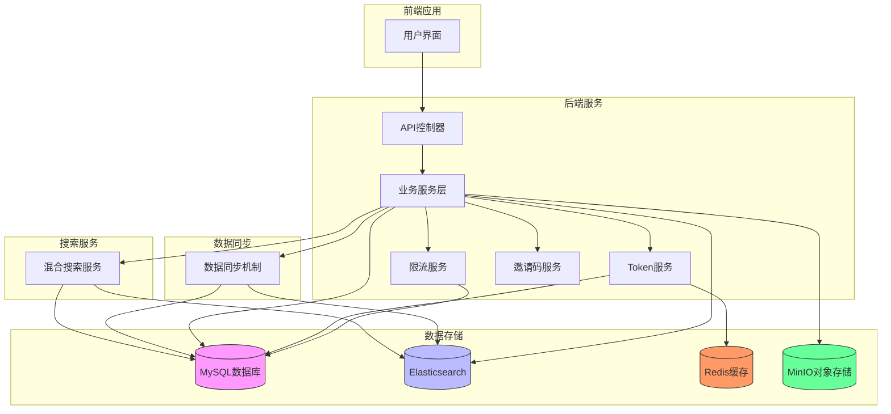

**图示来源**
- [UserService.java:0-199](file://src/main/java/com/yizhaoqi/smartpai/service/UserService.java#L0-L199)
- [ElasticsearchService.java:0-86](file://src/main/java/com/yizhaoqi/smartpai/service/ElasticsearchService.java#L0-L86)
- [HybridSearchService.java:0-199](file://src/main/java/com/yizhaoqi/smartpai/service/HybridSearchService.java#L0-L199)
- [RateLimitConfigService.java:1-280](file://src/main/java/com/yizhaoqi/smartpai/service/RateLimitConfigService.java#L1-L280)
- [UserTokenService.java:1-457](file://src/main/java/com/yizhaoqi/smartpai/service/UserTokenService.java#L1-L457)

## 核心实体模型设计

PaiSmart系统的核心实体包括User（用户）、Conversation（对话）、FileUpload（文件上传）、InviteCode（邀请码）、RechargeOrder（充值订单）、RechargePackage（充值套餐）、ModelProviderConfig（模型提供商配置）、RateLimitConfig（速率限制配置）、UserTokenRecord（用户Token记录）、UserDailyChatCount（用户每日对话次数）等，这些实体通过JPA注解与数据库表进行映射，实现了对象关系的持久化。

### 用户实体（User）

用户实体是系统权限控制的基础，存储用户的基本信息和组织标签信息。通过`@Entity`注解标识为JPA实体，`@Table`注解指定数据库表名为"users"，并设置用户名字段的唯一约束。

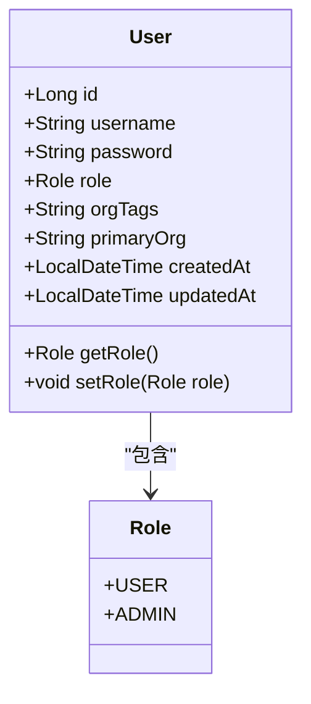

**图示来源**
- [User.java:9-42](file://src/main/java/com/yizhaoqi/smartpai/model/User.java#L9-L42)

### 对话实体（Conversation）

对话实体记录用户与系统的交互历史，通过`@ManyToOne`注解建立与用户实体的多对一关系。每个对话记录关联一个用户，形成用户对话历史的集合。

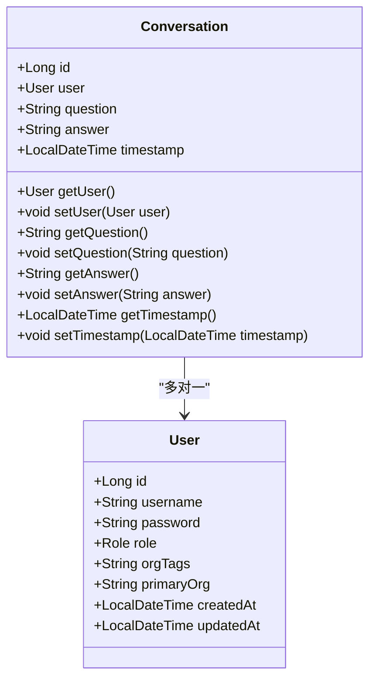

**图示来源**
- [Conversation.java:8-32](file://src/main/java/com/yizhaoqi/smartpai/model/Conversation.java#L8-L32)

### 文件上传实体（FileUpload）

文件上传实体管理用户上传的文件信息，包含文件的元数据、状态和权限控制信息。通过MD5值唯一标识文件，支持断点续传和文件去重。

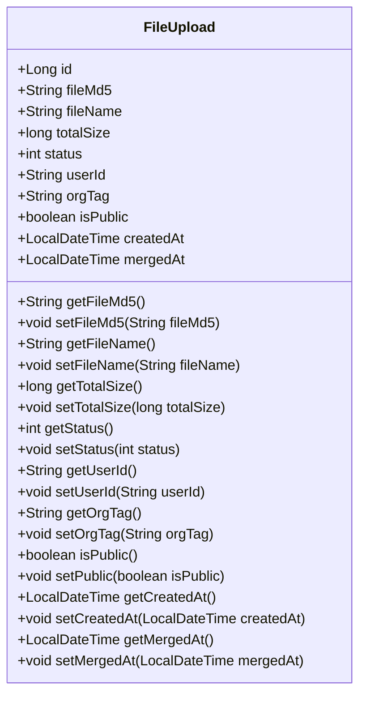

**图示来源**
- [FileUpload.java:13-80](file://src/main/java/com/yizhaoqi/smartpai/model/FileUpload.java#L13-L80)

### 邀请码实体（InviteCode）

邀请码实体管理系统的邀请码发放和使用情况，支持邀请码的生成、使用次数限制和过期时间控制。

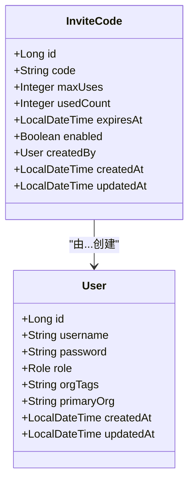

**图示来源**
- [InviteCode.java:16-47](file://src/main/java/com/yizhaoqi/smartpai/model/InviteCode.java#L16-L47)

### 充值订单实体（RechargeOrder）

充值订单实体管理用户的充值订单信息，支持订单状态跟踪和支付回调处理。

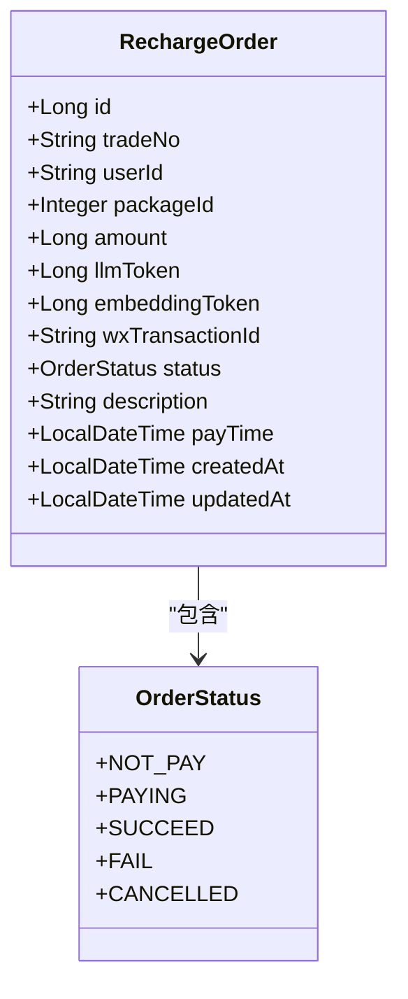

**图示来源**
- [RechargeOrder.java:24-79](file://src/main/java/com/yizhaoqi/smartpai/model/RechargeOrder.java#L24-L79)

### 充值套餐实体（RechargePackage）

充值套餐实体管理系统的预设充值套餐信息，支持套餐的启用、禁用和排序显示。

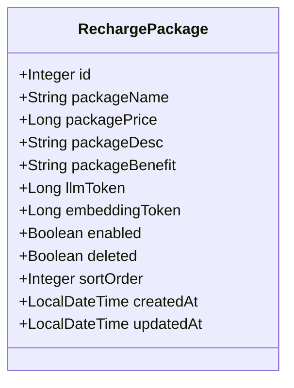

**图示来源**
- [RechargePackage.java:22-63](file://src/main/java/com/yizhaoqi/smartpai/model/RechargePackage.java#L22-L63)

### 模型提供商配置实体（ModelProviderConfig）

模型提供商配置实体管理AI模型提供商的配置信息，支持多提供商的动态配置和切换。

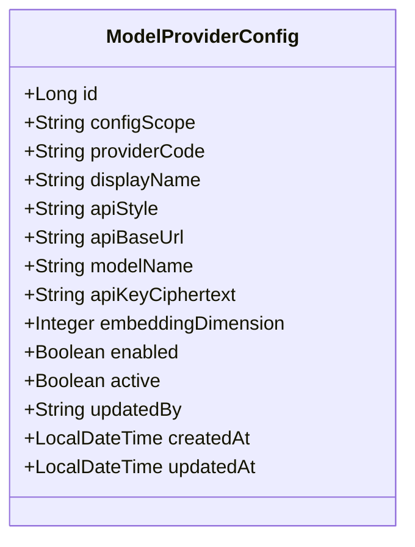

**图示来源**
- [ModelProviderConfig.java:24-68](file://src/main/java/com/yizhaoqi/smartpai/model/ModelProviderConfig.java#L24-L68)

### 速率限制配置实体（RateLimitConfig）

速率限制配置实体管理系统的限流策略配置，支持多种维度的限流规则。

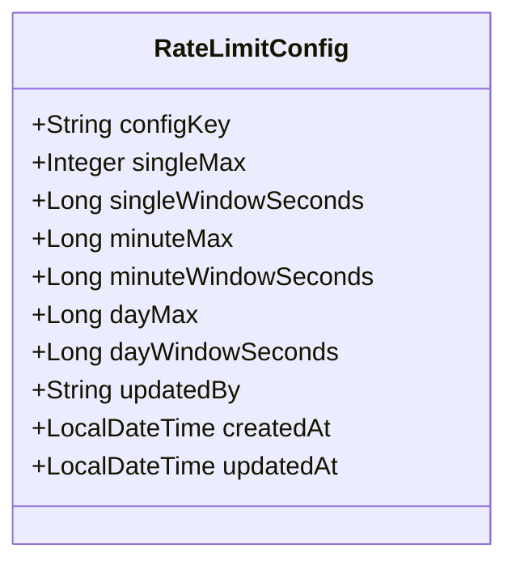

**图示来源**
- [RateLimitConfig.java:1-49](file://src/main/java/com/yizhaoqi/smartpai/model/RateLimitConfig.java#L1-L49)

### 用户Token记录实体（UserTokenRecord）

用户Token记录实体管理用户的Token使用和充值历史，支持按天统计和分类汇总。

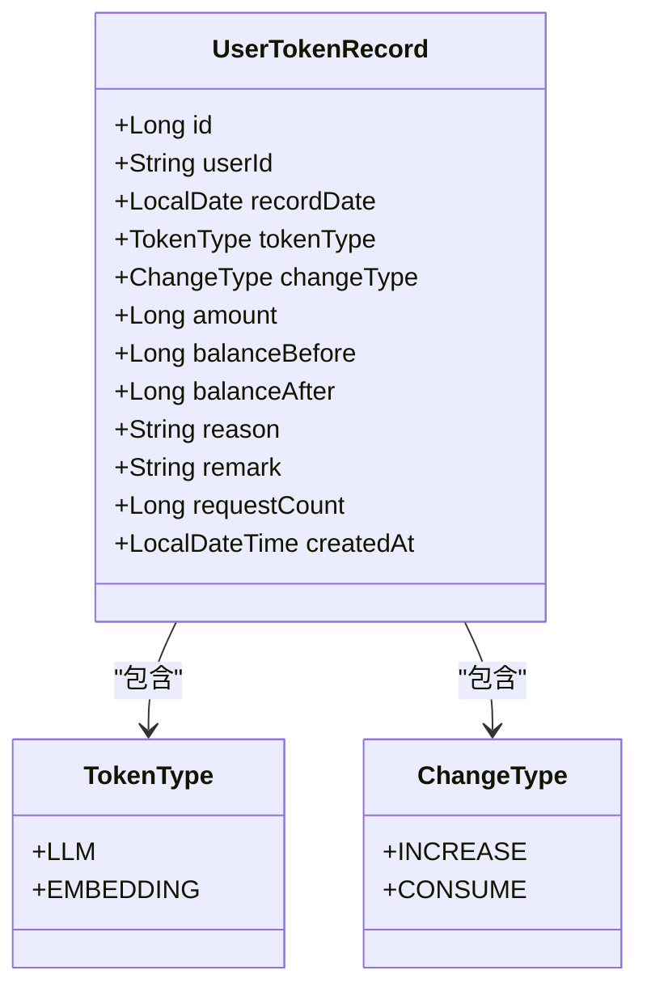

**图示来源**
- [UserTokenRecord.java:1-111](file://src/main/java/com/yizhaoqi/smartpai/model/UserTokenRecord.java#L1-L111)

### 用户每日对话次数实体（UserDailyChatCount）

用户每日对话次数实体管理用户的对话使用统计，支持按天聚合和排行榜查询。

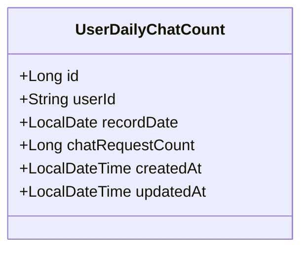

**图示来源**
- [UserDailyChatCount.java:1-66](file://src/main/java/com/yizhaoqi/smartpai/model/UserDailyChatCount.java#L1-L66)

## 关系型数据库设计

PaiSmart系统的关系型数据库设计遵循规范化原则，通过主外键关系维护数据完整性，并通过索引优化查询性能。

### 实体关系图

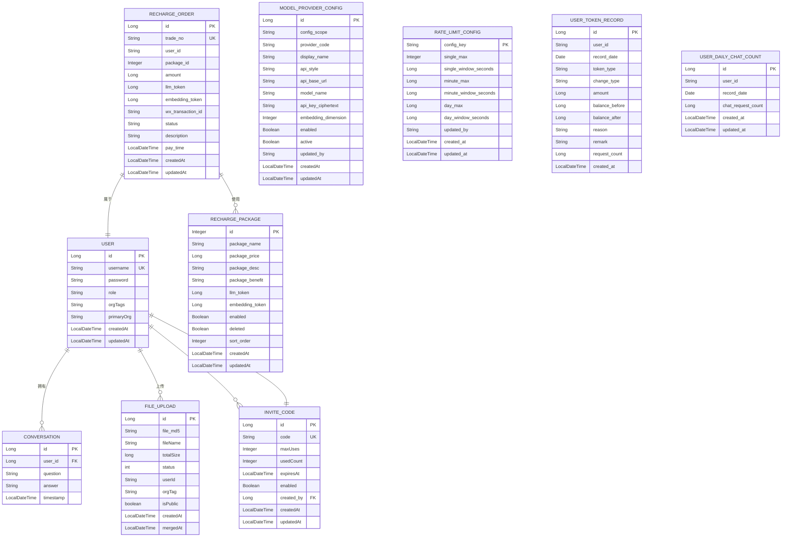

**图示来源**
- [User.java:9-42](file://src/main/java/com/yizhaoqi/smartpai/model/User.java#L9-L42)
- [Conversation.java:8-32](file://src/main/java/com/yizhaoqi/smartpai/model/Conversation.java#L8-L32)
- [FileUpload.java:13-80](file://src/main/java/com/yizhaoqi/smartpai/model/FileUpload.java#L13-L80)
- [InviteCode.java:16-47](file://src/main/java/com/yizhaoqi/smartpai/model/InviteCode.java#L16-L47)
- [RechargeOrder.java:24-79](file://src/main/java/com/yizhaoqi/smartpai/model/RechargeOrder.java#L24-L79)
- [RechargePackage.java:22-63](file://src/main/java/com/yizhaoqi/smartpai/model/RechargePackage.java#L22-L63)
- [ModelProviderConfig.java:24-68](file://src/main/java/com/yizhaoqi/smartpai/model/ModelProviderConfig.java#L24-L68)
- [RateLimitConfig.java:1-49](file://src/main/java/com/yizhaoqi/smartpai/model/RateLimitConfig.java#L1-L49)
- [UserTokenRecord.java:1-111](file://src/main/java/com/yizhaoqi/smartpai/model/UserTokenRecord.java#L1-L111)
- [UserDailyChatCount.java:1-66](file://src/main/java/com/yizhaoqi/smartpai/model/UserDailyChatCount.java#L1-L66)

### 用户表（users）

用户表存储系统用户的基本信息，是权限控制的基础。

**: 字段定义**
- **id**: 主键，自增长整型
- **username**: 用户名，非空且唯一
- **password**: 密码，非空，存储加密后的密码
- **role**: 角色，枚举类型（USER, ADMIN）
- **orgTags**: 用户所属组织标签，多个标签用逗号分隔
- **primaryOrg**: 用户主组织标签
- **createdAt**: 创建时间，自动填充
- **updatedAt**: 更新时间，自动填充

**: 约束与索引**
- 主键约束：id
- 唯一约束：username
- 索引：idx_username (username)

**实体映射**
```java
@Entity
@Table(name = "users", uniqueConstraints = @UniqueConstraint(columnNames = "username"))
public class User {
    @Id
    @GeneratedValue(strategy = GenerationType.IDENTITY)
    private Long id;

    @Column(nullable = false, unique = true)
    private String username;

    @Column(nullable = false)
    private String password;

    @Enumerated(EnumType.STRING)
    @Column(nullable = false)
    private Role role;

    @Column(name = "org_tags")
    private String orgTags;

    @Column(name = "primary_org")
    private String primaryOrg;

    @CreationTimestamp
    private LocalDateTime createdAt;

    @UpdateTimestamp
    private LocalDateTime updatedAt;
}
```

**代码来源**
- [User.java:9-42](file://src/main/java/com/yizhaoqi/smartpai/model/User.java#L9-L42)

### 对话表（conversations）

对话表存储用户与系统的交互历史，支持对话历史的查询和分析。

**: 字段定义**
- **id**: 主键，自增长整型
- **user_id**: 外键，关联用户表的id
- **question**: 用户提问内容，非空，TEXT类型
- **answer**: 系统回答内容，非空，TEXT类型
- **timestamp**: 对话时间戳，自动填充

**: 约束与索引**
- 主键约束：id
- 外键约束：user_id → users.id
- 索引：idx_user_id (user_id), idx_timestamp (timestamp)

**实体映射**
```java
@Entity
@Table(name = "conversations", indexes = {
    @Index(name = "idx_user_id", columnList = "user_id"),
    @Index(name = "idx_timestamp", columnList = "timestamp")
})
public class Conversation {
    @Id
    @GeneratedValue(strategy = GenerationType.IDENTITY)
    private Long id;

    @ManyToOne(fetch = FetchType.LAZY)
    @JoinColumn(name = "user_id", nullable = false)
    private User user;

    @Column(nullable = false, columnDefinition = "TEXT")
    private String question;

    @Column(nullable = false, columnDefinition = "TEXT")
    private String answer;

    @CreationTimestamp
    private LocalDateTime timestamp;
}
```

**代码来源**
- [Conversation.java:8-32](file://src/main/java/com/yizhaoqi/smartpai/model/Conversation.java#L8-L32)

### 文件上传表（file_upload）

文件上传表管理用户上传的文件信息，支持文件的权限控制和状态管理。

**: 字段定义**
- **id**: 主键，自增长整型
- **file_md5**: 文件MD5值，非空，长度32
- **fileName**: 文件原始名称
- **totalSize**: 文件总大小，字节为单位
- **status**: 文件上传状态（0-上传中，1-已完成，2-合并中）
- **user_id**: 上传用户ID，非空，长度64
- **org_tag**: 文件所属组织标签
- **is_public**: 文件是否公开，非空，默认false
- **estimated_embedding_tokens**: 预估embedding token数
- **estimated_chunk_count**: 预估切片数
- **actual_embedding_tokens**: 实际embedding token数
- **actual_chunk_count**: 实际切片数
- **createdAt**: 创建时间，自动填充
- **mergedAt**: 合并完成时间，自动填充

**: 约束与索引**
- 主键约束：id
- 唯一约束：file_md5, user_id
- 索引：idx_user (user_id), idx_org_tag (org_tag)

**实体映射**
```java
@Entity
@Table(name = "file_upload", uniqueConstraints = {
    @UniqueConstraint(name = "uk_md5_user", columnNames = {"file_md5", "user_id"})
}, indexes = {
    @Index(name = "idx_user", columnList = "user_id"),
    @Index(name = "idx_org_tag", columnList = "org_tag")
})
public class FileUpload {
    @Id
    @GeneratedValue(strategy = GenerationType.IDENTITY)
    private Long id;

    @Column(name = "file_md5", length = 32, nullable = false)
    private String fileMd5;

    private String fileName;

    private long totalSize;

    private int status;

    @Column(name = "user_id", length = 64, nullable = false)
    private String userId;
    
    @Column(name = "org_tag")
    private String orgTag;

    @Column(name = "is_public", nullable = false)
    private boolean isPublic = false;

    @Column(name = "estimated_embedding_tokens")
    private Long estimatedEmbeddingTokens;

    @Column(name = "estimated_chunk_count")
    private Integer estimatedChunkCount;

    @Column(name = "actual_embedding_tokens")
    private Long actualEmbeddingTokens;

    @Column(name = "actual_chunk_count")
    private Integer actualChunkCount;

    @CreationTimestamp
    private LocalDateTime createdAt;

    @UpdateTimestamp
    private LocalDateTime mergedAt;
}
```

**代码来源**
- [FileUpload.java:13-80](file://src/main/java/com/yizhaoqi/smartpai/model/FileUpload.java#L13-L80)

### 邀请码表（invite_codes）

邀请码表管理系统的邀请码发放和使用情况，支持邀请码的生成、使用次数限制和过期时间控制。

**: 字段定义**
- **id**: 主键，自增长整型
- **code**: 邀请码，非空且唯一，长度64
- **maxUses**: 最大使用次数，非空
- **usedCount**: 已使用次数，非空，默认0
- **expiresAt**: 过期时间
- **enabled**: 是否启用，非空，默认true
- **created_by**: 创建者，外键关联用户表
- **createdAt**: 创建时间，自动填充
- **updatedAt**: 更新时间，自动填充

**: 约束与索引**
- 主键约束：id
- 唯一约束：code
- 索引：idx_invite_code_code (code), idx_invite_code_enabled (enabled)

**实体映射**
```java
@Entity
@Table(name = "invite_codes", indexes = {
    @Index(name = "idx_invite_code_code", columnList = "code", unique = true),
    @Index(name = "idx_invite_code_enabled", columnList = "enabled")
})
public class InviteCode {
    @Id
    @GeneratedValue(strategy = GenerationType.IDENTITY)
    private Long id;

    @Column(nullable = false, unique = true, length = 64)
    private String code;

    @Column(name = "max_uses", nullable = false)
    private Integer maxUses;

    @Column(name = "used_count", nullable = false)
    private Integer usedCount = 0;

    @Column(name = "expires_at")
    private LocalDateTime expiresAt;

    @Column(nullable = false)
    private Boolean enabled = true;

    @ManyToOne
    @JoinColumn(name = "created_by", nullable = false)
    private User createdBy;

    @CreationTimestamp
    private LocalDateTime createdAt;

    @UpdateTimestamp
    private LocalDateTime updatedAt;
}
```

**代码来源**
- [InviteCode.java:16-47](file://src/main/java/com/yizhaoqi/smartpai/model/InviteCode.java#L16-L47)

### 充值订单表（recharge_orders）

充值订单表管理用户的充值订单信息，支持订单状态跟踪和支付回调处理。

**: 字段定义**
- **id**: 主键，自增长整型
- **trade_no**: 业务单号，非空且唯一
- **user_id**: 用户ID，非空，长度64
- **package_id**: 套餐ID，非空
- **amount**: 订单金额，单位分，非空
- **llm_token**: LLM token数量，非空
- **embedding_token**: Embedding token数量，非空
- **wx_transaction_id**: 微信交易流水号
- **status**: 订单状态，枚举类型（NOT_PAY, PAYING, SUCCEED, FAIL, CANCELLED），非空
- **description**: 订单描述
- **pay_time**: 支付成功时间
- **createdAt**: 创建时间，自动填充
- **updatedAt**: 更新时间，自动填充

**: 约束与索引**
- 主键约束：id
- 唯一约束：trade_no
- 索引：idx_trade_no (trade_no), idx_user_id (user_id), idx_status (status)

**实体映射**
```java
@Entity
@Table(name = "recharge_orders", indexes = {
    @Index(name = "idx_trade_no", columnList = "trade_no", unique = true),
    @Index(name = "idx_user_id", columnList = "user_id"),
    @Index(name = "idx_status", columnList = "status")
})
public class RechargeOrder {
    @Id
    @GeneratedValue(strategy = GenerationType.IDENTITY)
    private Long id;

    @Column(nullable = false, name = "trade_no", unique = true)
    private String tradeNo;

    @Column(name = "user_id", nullable = false, length = 64)
    private String userId;

    @Column(nullable = false, name = "package_id")
    private Integer packageId;

    @Column(nullable = false)
    private Long amount;

    @Column(nullable = false, name = "llm_token")
    private Long llmToken;

    @Column(nullable = false, name = "embedding_token")
    private Long embeddingToken;

    @Column(name = "wx_transaction_id")
    private String wxTransactionId;

    @Column(nullable = false)
    @Enumerated(EnumType.STRING)
    private OrderStatus status;

    @Column
    private String description;

    @Column(name = "pay_time")
    private LocalDateTime payTime;

    @CreationTimestamp
    private LocalDateTime createdAt;

    @UpdateTimestamp
    private LocalDateTime updatedAt;

    public enum OrderStatus {
        NOT_PAY, PAYING, SUCCEED, FAIL, CANCELLED
    }
}
```

**代码来源**
- [RechargeOrder.java:24-79](file://src/main/java/com/yizhaoqi/smartpai/model/RechargeOrder.java#L24-L79)

### 充值套餐表（recharge_packages）

充值套餐表管理系统的预设充值套餐信息，支持套餐的启用、禁用和排序显示。

**: 字段定义**
- **id**: 主键，自增整型
- **package_name**: 套餐名称，非空，长度128
- **package_price**: 套餐价格，单位分，非空
- **package_desc**: 套餐描述，TEXT类型
- **package_benefit**: 套餐权益，TEXT类型
- **llm_token**: LLM token数量，非空
- **embedding_token**: Embedding token数量，非空
- **enabled**: 是否启用，非空，默认true
- **deleted**: 是否删除，逻辑删除标志，非空，默认false
- **sort_order**: 排序顺序，数字越小越靠前，非空，默认0
- **createdAt**: 创建时间，自动填充
- **updatedAt**: 更新时间，自动填充

**: 约束与索引**
- 主键约束：id

**: 实体映射**
```java
@Entity
@Table(name = "recharge_packages")
public class RechargePackage {
    @Id
    @GeneratedValue(strategy = GenerationType.IDENTITY)
    @Column(name = "id")
    private Integer id;

    @Column(nullable = false, length = 128, name = "package_name")
    private String packageName;

    @Column(nullable = false, name = "package_price")
    private Long packagePrice;

    @Column(columnDefinition = "TEXT", name = "package_desc")
    private String packageDesc;

    @Column(columnDefinition = "TEXT", name = "package_benefit")
    private String packageBenefit;

    @Column(nullable = false, name = "llm_token")
    private Long llmToken;

    @Column(nullable = false, name = "embedding_token")
    private Long embeddingToken;

    @Column(nullable = false, name = "enabled")
    private Boolean enabled = true;

    @Column(nullable = false, name = "deleted")
    private Boolean deleted = false;

    @Column(nullable = false, name = "sort_order")
    private Integer sortOrder = 0;

    @CreationTimestamp
    private LocalDateTime createdAt;

    @UpdateTimestamp
    private LocalDateTime updatedAt;
}
```

**代码来源**
- [RechargePackage.java:22-63](file://src/main/java/com/yizhaoqi/smartpai/model/RechargePackage.java#L22-L63)

### 模型提供商配置表（model_provider_configs）

模型提供商配置表管理AI模型提供商的配置信息，支持多提供商的动态配置和切换。

**: 字段定义**
- **id**: 主键，自增长整型
- **config_scope**: 配置范围，非空，长度32
- **provider_code**: 提供商代码，非空，长度64
- **display_name**: 显示名称，非空，长度128
- **api_style**: API风格，非空，长度64
- **api_base_url**: API基础URL，非空，长度512
- **model_name**: 模型名称，非空，长度255
- **api_key_ciphertext**: API密钥密文，长度2048
- **embedding_dimension**: 嵌入维度
- **enabled**: 是否启用，非空，默认true
- **active**: 是否激活，非空，默认false
- **updated_by**: 更新者，非空，长度255
- **createdAt**: 创建时间，自动填充
- **updatedAt**: 更新时间，自动填充

**: 约束与索引**
- 主键约束：id
- 唯一约束：config_scope, provider_code
- 索引：idx_model_provider_scope (config_scope)

**: 实体映射**
```java
@Entity
@Table(
    name = "model_provider_configs",
    uniqueConstraints = {
        @UniqueConstraint(name = "uk_model_provider_scope_code", columnNames = {"config_scope", "provider_code"})
    },
    indexes = {
        @Index(name = "idx_model_provider_scope", columnList = "config_scope")
    }
)
public class ModelProviderConfig {
    @Id
    @GeneratedValue(strategy = GenerationType.IDENTITY)
    private Long id;

    @Column(name = "config_scope", nullable = false, length = 32)
    private String configScope;

    @Column(name = "provider_code", nullable = false, length = 64)
    private String providerCode;

    @Column(name = "display_name", nullable = false, length = 128)
    private String displayName;

    @Column(name = "api_style", nullable = false, length = 64)
    private String apiStyle;

    @Column(name = "api_base_url", nullable = false, length = 512)
    private String apiBaseUrl;

    @Column(name = "model_name", nullable = false, length = 255)
    private String modelName;

    @Column(name = "api_key_ciphertext", length = 2048)
    private String apiKeyCiphertext;

    @Column(name = "embedding_dimension")
    private Integer embeddingDimension;

    @Column(name = "enabled", nullable = false)
    private boolean enabled = true;

    @Column(name = "active", nullable = false)
    private boolean active = false;

    @Column(name = "updated_by", nullable = false, length = 255)
    private String updatedBy;

    @CreationTimestamp
    private LocalDateTime createdAt;

    @UpdateTimestamp
    private LocalDateTime updatedAt;
}
```

**代码来源**
- [ModelProviderConfig.java:24-68](file://src/main/java/com/yizhaoqi/smartpai/model/ModelProviderConfig.java#L24-L68)

### 速率限制配置表（rate_limit_configs）

速率限制配置表管理系统的限流策略配置，支持多种维度的限流规则。

**: 字段定义**
- **config_key**: 配置键，主键，长度64
- **single_max**: 单窗口最大次数
- **single_window_seconds**: 单窗口秒数
- **minute_max**: 分钟窗口最大值
- **minute_window_seconds**: 分钟窗口秒数
- **day_max**: 日窗口最大值
- **day_window_seconds**: 日窗口秒数
- **updated_by**: 最后更新人，长度255
- **created_at**: 创建时间
- **updated_at**: 更新时间

**: 约束与索引**
- 主键约束：config_key

**: 实体映射**
```java
@Entity
@Table(name = "rate_limit_configs")
public class RateLimitConfig {
    @Id
    @Column(name = "config_key", nullable = false, length = 64)
    private String configKey;

    @Column(name = "single_max")
    private Integer singleMax;

    @Column(name = "single_window_seconds")
    private Long singleWindowSeconds;

    @Column(name = "minute_max")
    private Long minuteMax;

    @Column(name = "minute_window_seconds")
    private Long minuteWindowSeconds;

    @Column(name = "day_max")
    private Long dayMax;

    @Column(name = "day_window_seconds")
    private Long dayWindowSeconds;

    @Column(name = "updated_by", nullable = false, length = 255)
    private String updatedBy;

    @CreationTimestamp
    private LocalDateTime createdAt;

    @UpdateTimestamp
    private LocalDateTime updatedAt;
}
```

**代码来源**
- [RateLimitConfig.java:1-49](file://src/main/java/com/yizhaoqi/smartpai/model/RateLimitConfig.java#L1-L49)

### 用户Token记录表（user_token_record）

用户Token记录表管理用户的Token使用和充值历史，支持按天统计和分类汇总。

**: 字段定义**
- **id**: 主键，自增长整型
- **user_id**: 用户ID，非空
- **record_date**: 记录日期，按天统计
- **token_type**: Token类型：LLM或EMBEDDING
- **change_type**: 变动类型：INCREASE或CONSUME
- **amount**: 变动数量
- **balance_before**: 变动前的余额
- **balance_after**: 变动后的余额
- **reason**: 变动原因描述
- **remark**: 备注信息（订单号、对话ID等）
- **request_count**: 请求次数（一次充值或对话可能包含多次API请求）
- **created_at**: 创建时间

**: 约束与索引**
- 主键约束：id
- 索引：idx_user_date (userId, recordDate)

**: 实体映射**
```java
@Entity
@Table(name = "user_token_record", indexes = {
    @Index(name = "idx_user_date", columnList = "userId, recordDate")
})
public class UserTokenRecord {
    @Id
    @GeneratedValue(strategy = GenerationType.IDENTITY)
    private Long id;

    @Column(nullable = false)
    private String userId;

    @Column(nullable = false)
    private LocalDate recordDate;

    @Column(nullable = false, length = 20)
    @Enumerated(EnumType.STRING)
    private TokenType tokenType;

    @Column(nullable = false, length = 20)
    @Enumerated(EnumType.STRING)
    private ChangeType changeType;

    @Column(nullable = false)
    private Long amount;

    private Long balanceBefore;
    private Long balanceAfter;

    @Column(length = 500)
    private String reason;

    @Column(length = 500)
    private String remark;

    @Column(nullable = false)
    private Long requestCount = 0L;

    @CreationTimestamp
    private LocalDateTime createdAt;

    public enum TokenType {
        LLM, EMBEDDING
    }

    public enum ChangeType {
        INCREASE, CONSUME
    }
}
```

**代码来源**
- [UserTokenRecord.java:1-111](file://src/main/java/com/yizhaoqi/smartpai/model/UserTokenRecord.java#L1-L111)

### 用户每日对话次数表（user_daily_chat_count）

用户每日对话次数表管理用户的对话使用统计，支持按天聚合和排行榜查询。

**: 字段定义**
- **id**: 主键，自增长整型
- **user_id**: 用户ID，非空，长度50
- **record_date**: 记录日期
- **chat_request_count**: 对话请求次数
- **created_at**: 创建时间
- **updated_at**: 更新时间

**: 约束与索引**
- 主键约束：id
- 唯一约束：userId, recordDate
- 索引：idx_record_date (recordDate)

**: 实体映射**
```java
@Entity
@Table(
    name = "user_daily_chat_count",
    indexes = {
        @Index(name = "idx_record_date", columnList = "recordDate")
    },
    uniqueConstraints = {
        @UniqueConstraint(name = "uk_user_date", columnNames = {"userId", "recordDate"})
    }
)
public class UserDailyChatCount {
    @Id
    @GeneratedValue(strategy = GenerationType.IDENTITY)
    private Long id;

    @Column(nullable = false, length = 50, name = "user_id")
    private String userId;

    @Column(nullable = false, name = "record_date")
    private LocalDate recordDate;

    @Column(nullable = false, name = "chat_request_count")
    private Long chatRequestCount = 0L;

    @CreationTimestamp
    @Column(nullable = false, name = "created_at")
    private LocalDateTime createdAt;

    @UpdateTimestamp
    @Column(nullable = false, name = "updated_at")
    private LocalDateTime updatedAt;
}
```

**代码来源**
- [UserDailyChatCount.java:1-66](file://src/main/java/com/yizhaoqi/smartpai/model/UserDailyChatCount.java#L1-L66)

## Elasticsearch索引设计

PaiSmart系统使用Elasticsearch作为知识库搜索引擎，存储文档的向量化内容，支持高效的全文检索和语义搜索。

### 知识库索引结构

知识库索引（knowledge_base）存储文档的分块内容和向量表示，支持基于内容和语义的混合搜索。

**: 字段定义**
- **fileMd5**: 文件MD5值，keyword类型，用于精确匹配
- **chunkId**: 分块ID，integer类型，标识文档的分块序号
- **textContent**: 文本内容，text类型，standard分析器，用于全文检索
- **vector**: 向量，dense_vector类型，2048维度，支持余弦相似度搜索
- **modelVersion**: 模型版本，keyword类型，标识向量化模型版本
- **userId**: 用户ID，keyword类型，用于权限过滤
- **orgTag**: 组织标签，keyword类型，用于权限过滤
- **isPublic**: 是否公开，boolean类型，用于权限过滤

**: 映射配置**
```json
{
  "mappings": {
    "properties": {
      "fileMd5": {
        "type": "keyword"
      },
      "chunkId": {
        "type": "integer"
      },
      "textContent": {
        "type": "text",
        "analyzer": "standard"
      },
      "vector": {
        "type": "dense_vector",
        "dims": 2048,
        "index": true,
        "similarity": "cosine"
      },
      "modelVersion": {
        "type": "keyword"
      },
      "userId": {
        "type": "keyword"
      },
      "orgTag": {
        "type": "keyword"
      },
      "isPublic": {
        "type": "boolean"
      }
    }
  }
}
```

**代码来源**
- [knowledge_base.json:1-35](file://src/main/resources/es-mappings/knowledge_base.json#L1-L35)

### 索引映射图

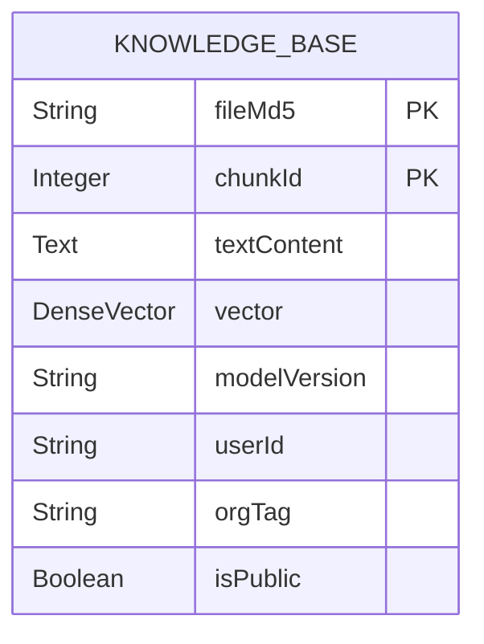

**图示来源**
- [knowledge_base.json:1-35](file://src/main/resources/es-mappings/knowledge_base.json#L1-L35)

### 搜索优化配置

Elasticsearch索引配置了多种优化设置，以提高搜索性能和准确性：

1. **向量索引**: `vector`字段配置了`index: true`和`similarity: "cosine"`，支持高效的向量相似度搜索。
2. **文本分析**: `textContent`字段使用`standard`分析器，支持标准的全文检索功能。
3. **字段类型优化**: 关键字段如`fileMd5`、`userId`、`orgTag`使用`keyword`类型，支持精确匹配和聚合操作。
4. **复合搜索**: 通过KNN搜索和BM25重打分的组合，实现文本匹配和语义相似度的混合搜索。

## 数据一致性保障机制

PaiSmart系统通过服务层的协调和事务管理，确保MySQL和Elasticsearch两个数据源之间的数据一致性。

### 数据同步流程

当文件上传、更新或删除时，系统通过以下流程确保数据一致性：

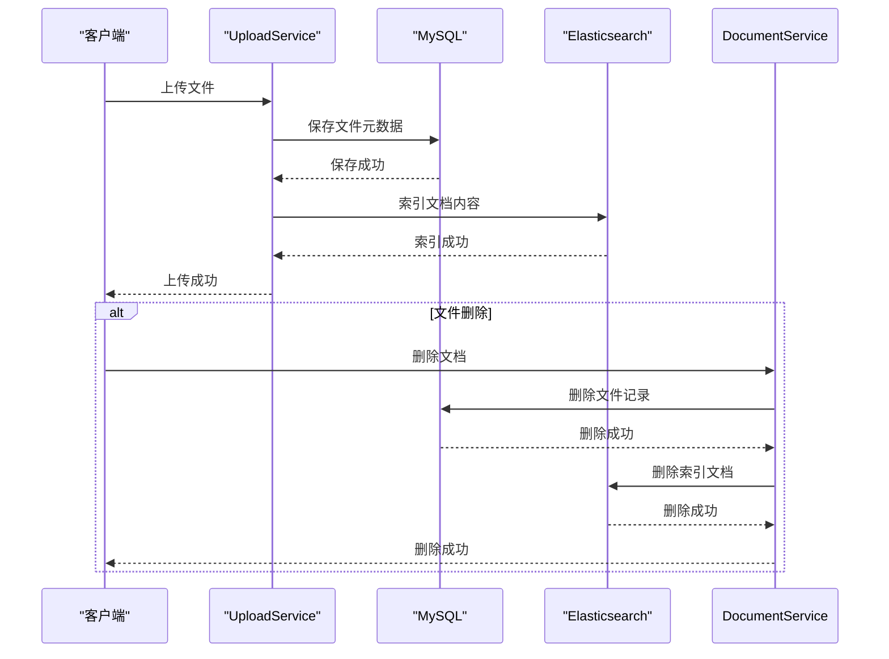

**图示来源**
- [UploadService.java:0-199](file://src/main/java/com/yizhaoqi/smartpai/service/UploadService.java#L0-L199)
- [DocumentService.java:0-199](file://src/main/java/com/yizhaoqi/smartpai/service/DocumentService.java#L0-L199)

### 事务管理

系统使用Spring的事务管理机制，确保数据库操作的原子性。在关键业务方法上使用`@Transactional`注解，确保相关操作在同一个事务中执行。

```java
@Transactional
public void registerUser(String username, String password) {
    // 检查用户名是否存在
    if (userRepository.findByUsername(username).isPresent()) {
        throw new CustomException("Username already exists", HttpStatus.BAD_REQUEST);
    }
    
    // 创建用户
    User user = new User();
    user.setUsername(username);
    user.setPassword(PasswordUtil.encode(password));
    user.setRole(User.Role.USER);
    
    // 保存用户
    userRepository.save(user);
    
    // 创建私人组织标签
    String privateTagId = PRIVATE_TAG_PREFIX + username;
    createPrivateOrgTag(privateTagId, username, user);
    
    // 分配组织标签
    user.setOrgTags(privateTagId);
    user.setPrimaryOrg(privateTagId);
    
    // 保存用户信息
    userRepository.save(user);
    
    // 缓存组织标签信息
    orgTagCacheService.cacheUserOrgTags(username, List.of(privateTagId));
    orgTagCacheService.cacheUserPrimaryOrg(username, privateTagId);
}
```

**代码来源**
- [UserService.java:0-199](file://src/main/java/com/yizhaoqi/smartpai/service/UserService.java#L0-L199)

### 错误处理与重试

系统实现了完善的错误处理机制，当Elasticsearch索引失败时，会记录错误日志并抛出异常，确保数据一致性不被破坏。

```java
public void bulkIndex(List<EsDocument> documents) {
    try {
        logger.info("开始批量索引文档到Elasticsearch，文档数量: {}", documents.size());
        
        // 创建批量操作
        List<BulkOperation> bulkOperations = documents.stream()
                .map(doc -> BulkOperation.of(op -> op.index(idx -> idx
                        .index("knowledge_base")
                        .id(doc.getId())
                        .document(doc)
                )))
                .toList();

        // 执行批量索引
        BulkRequest request = BulkRequest.of(b -> b.operations(bulkOperations));
        BulkResponse response = esClient.bulk(request);
        
        // 检查响应结果
        if (response.errors()) {
            logger.error("批量索引过程中发生错误:");
            for (BulkResponseItem item : response.items()) {
                if (item.error() != null) {
                    logger.error("文档索引失败 - ID: {}, 错误: {}", item.id(), item.error().reason());
                }
            }
            throw new RuntimeException("批量索引部分失败，请检查日志");
        } else {
            logger.info("批量索引成功完成，文档数量: {}", documents.size());
        }
    } catch (Exception e) {
        logger.error("批量索引失败，文档数量: {}", documents.size(), e);
        throw new RuntimeException("批量索引失败", e);
    }
}
```

**代码来源**
- [ElasticsearchService.java:0-86](file://src/main/java/com/yizhaoqi/smartpai/service/ElasticsearchService.java#L0-L86)

### 充值系统一致性保障

充值系统通过订单状态管理和支付回调处理确保数据一致性：

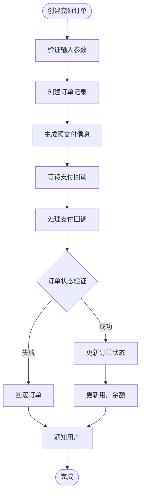

**图示来源**
- [RechargeController.java:65-105](file://src/main/java/com/yizhaoqi/smartpai/controller/RechargeController.java#L65-L105)

### Token余额管理一致性保障

**新增**：系统采用Redis缓存与MySQL双写策略确保Token余额管理的一致性。

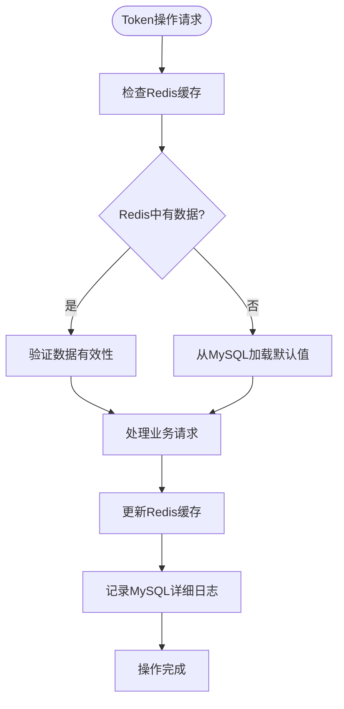

**图示来源**
- [UserTokenService.java:124-170](file://src/main/java/com/yizhaoqi/smartpai/service/UserTokenService.java#L124-L170)

#### Redis缓存策略
- **LLM Token键前缀**：`user:token:llm:{userId}`
- **Embedding Token键前缀**：`user:token:embedding:{userId}`
- **默认初始化**：新用户首次使用时自动初始化Token余额
- **原子操作**：使用Redis的原子递减操作确保并发安全

#### MySQL详细记录策略
- **按天聚合**：Token消费记录按自然日聚合，支持统计分析
- **完整审计**：每次操作都记录详细的余额变更信息
- **分类汇总**：支持按Token类型和变更类型的统计查询

#### 限流配置一致性保障

**新增**：系统提供灵活的限流配置管理，支持运行时动态调整。

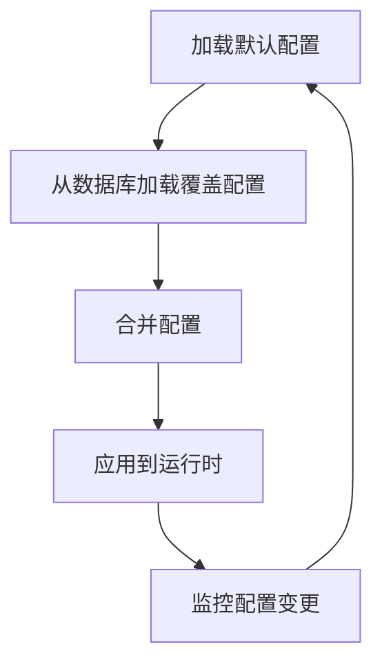

**图示来源**
- [RateLimitConfigService.java:33-36](file://src/main/java/com/yizhaoqi/smartpai/service/RateLimitConfigService.java#L33-L36)

## 跨存储查询实现

PaiSmart系统通过混合搜索服务实现跨MySQL和Elasticsearch的查询，为用户提供统一的搜索体验。

### 混合搜索架构

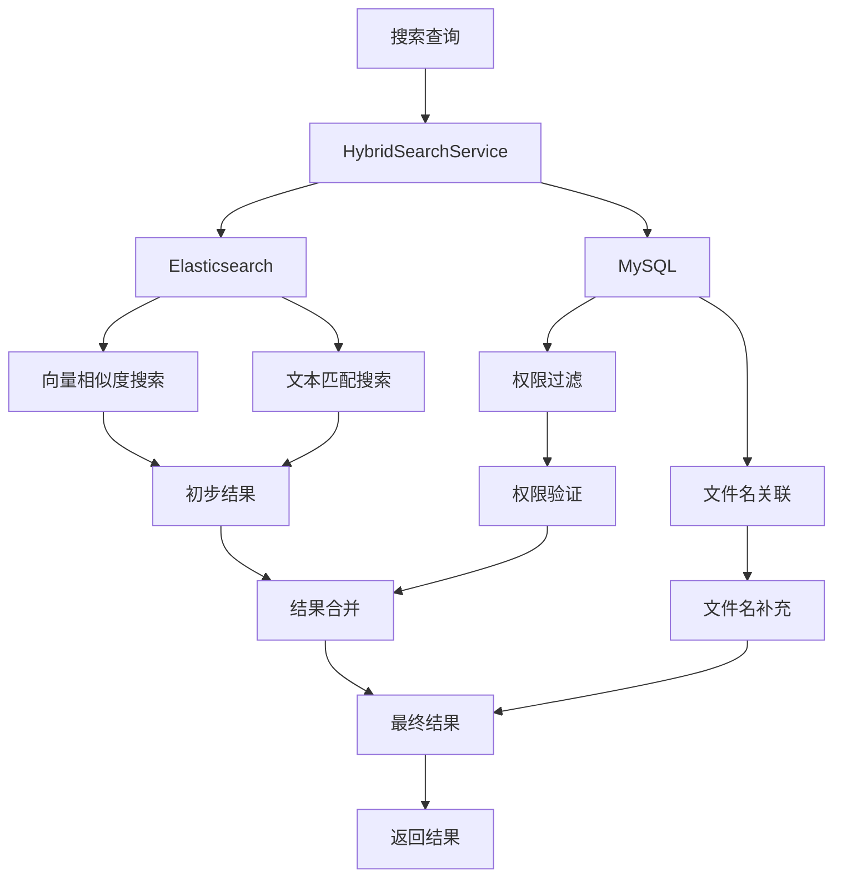

**图示来源**
- [HybridSearchService.java:0-199](file://src/main/java/com/yizhaoqi/smartpai/service/HybridSearchService.java#L0-L199)

### 搜索流程

混合搜索服务的执行流程如下：

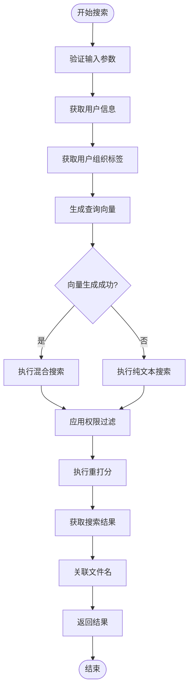

**图示来源**
- [HybridSearchService.java:0-199](file://src/main/java/com/yizhaoqi/smartpai/service/HybridSearchService.java#L0-L199)

### 权限过滤实现

系统在搜索过程中实现了严格的权限控制，确保用户只能访问其有权限的文档。

```java
public List<SearchResult> searchWithPermission(String query, String userId, int topK) {
    // 获取用户有效的组织标签
    List<String> userEffectiveTags = getUserEffectiveOrgTags(userId);
    
    // 获取用户的数据库ID
    String userDbId = getUserDbId(userId);

    // 生成查询向量
    final List<Float> queryVector = embedToVectorList(query);

    // 执行Elasticsearch搜索
    SearchResponse<EsDocument> response = esClient.search(s -> {
        s.index("knowledge_base");
        // KNN 召回
        int recallK = topK * 30;
        s.knn(kn -> kn
                .field("vector")
                .queryVector(queryVector)
                .k(recallK)
                .numCandidates(recallK)
        );
        // 必须命中关键词 + 权限过滤
        s.query(q -> q.bool(b -> b
                .must(mst -> mst.match(m -> m.field("textContent").query(query)))
                .filter(f -> f.bool(bf -> bf
                        // 条件1: 用户可访问自己的文档
                        .should(s1 -> s1.term(t -> t.field("userId").value(userDbId)))
                        // 条件2: 公开文档
                        .should(s2 -> s2.term(t -> t.field("public").value(true)))
                        // 条件3: 组织标签
                        .should(s3 -> {
                            if (userEffectiveTags.isEmpty()) {
                                return s3.matchNone(mn -> mn);
                            } else if (userEffectiveTags.size() == 1) {
                                return s3.term(t -> t.field("orgTag").value(userEffectiveTags.get(0)));
                            } else {
                                return s3.bool(inner -> {
                                    userEffectiveTags.forEach(tag -> inner.should(sh2 -> sh2.term(t -> t.field("orgTag").value(tag))));
                                    return inner;
                                });
                            }
                        })
                ))
        ));
        
        // 第二阶段 BM25 rescore
        s.rescore(r -> r
                .windowSize(recallK)
                .query(rq -> rq
                        .queryWeight(0.2d)
                        .rescoreQueryWeight(1.0d)
                        .query(rqq -> rqq.match(m -> m
                                .field("textContent")
                                .query(query)
                                .operator(Operator.And)
                        ))
                )
        );
        s.size(topK);
        return s;
    }, EsDocument.class);

    // 处理搜索结果
    List<SearchResult> results = response.hits().hits().stream()
            .map(hit -> {
                assert hit.source() != null;
                return new SearchResult(
                        hit.source().getFileMd5(),
                        hit.source().getChunkId(),
                        hit.source().getTextContent(),
                        hit.score(),
                        hit.source().getUserId(),
                        hit.source().getOrgTag(),
                        hit.source().isPublic()
                );
            })
            .toList();

    // 关联文件名
    attachFileNames(results);
    return results;
}
```

**代码来源**
- [HybridSearchService.java:0-199](file://src/main/java/com/yizhaoqi/smartpai/service/HybridSearchService.java#L0-L199)

### 使用监控统计实现

系统提供了使用监控统计功能，支持按天统计用户的使用情况：

```java
public List<DailyUsageStat> getDailyUsageStats(String userId, LocalDate startDate, LocalDate endDate) {
    // 查询用户的每日使用统计
    return dailyUsageRepository.findDailyUsageStats(userId, startDate, endDate)
            .stream()
            .map(stat -> new DailyUsageStat(
                    stat.recordDate(),
                    stat.totalAmount(),
                    stat.totalRequestCount()
            ))
            .collect(Collectors.toList());
}
```

**代码来源**
- [DailyUsageStat.java:5-9](file://src/main/java/com/yizhaoqi/smartpai/model/DailyUsageStat.java#L5-L9)

### Token余额管理实现

**新增**：系统提供完整的Token余额管理功能，支持实时查询和统计分析。

```java
public class UserTokenService {
    // Redis键前缀
    private static final String LLM_TOKEN_KEY_PREFIX = "user:token:llm:";
    private static final String EMBEDDING_TOKEN_KEY_PREFIX = "user:token:embedding:";
    
    // 获取用户LLM Token余额
    public Long getLlmTokenBalance(String userId) {
        String key = buildLlmTokenKey(userId);
        String value = stringRedisTemplate.opsForValue().get(key);
        if (StringUtils.isBlank(value)) {
            // 新用户初始化默认Token
            long initToken = usageQuotaProperties.getLlm().getInitTokens();
            stringRedisTemplate.opsForValue().set(key, String.valueOf(initToken));
            // 记录Token增加
            recordTokenIncrease(userId, UserTokenRecord.TokenType.LLM, initToken, 0L, initToken, "注册赠送", null);
            return initToken;
        }
        return Long.parseLong(value);
    }
    
    // 消耗用户Token
    @Transactional(rollbackFor = Exception.class)
    public void consumeLlmTokens(String userId, int tokens) {
        String key = buildLlmTokenKey(userId);
        Long currentBalance = getLlmTokenBalance(userId);
        
        if (currentBalance < tokens) {
            throw new CustomException("Token余额不足", HttpStatus.BAD_REQUEST);
        }
        
        stringRedisTemplate.opsForValue().increment(key, -tokens);
        
        // 记录Token消耗（按天聚合）
        recordTokenConsume(userId, UserTokenRecord.TokenType.LLM, tokens, currentBalance, currentBalance - tokens);
    }
    
    // 记录Token消耗
    private void recordTokenConsume(String userId, UserTokenRecord.TokenType tokenType, Integer amount, Long balanceBefore, Long balanceAfter) {
        LocalDate today = LocalDate.now();
        
        userTokenRecordRepository.findByUserIdAndRecordDateAndTokenTypeAndChangeType(
                userId, today, tokenType, UserTokenRecord.ChangeType.CONSUME
        ).ifPresentOrElse(
                existingRecord -> {
                    existingRecord.setAmount(existingRecord.getAmount() + amount);
                    existingRecord.setBalanceAfter(balanceAfter);
                    existingRecord.setRequestCount(existingRecord.getRequestCount() + 1);
                    userTokenRecordRepository.save(existingRecord);
                },
                () -> {
                    UserTokenRecord record = new UserTokenRecord();
                    record.setUserId(userId);
                    record.setRecordDate(today);
                    record.setTokenType(tokenType);
                    record.setChangeType(UserTokenRecord.ChangeType.CONSUME);
                    record.setAmount((long) amount);
                    record.setBalanceBefore(balanceBefore);
                    record.setBalanceAfter(balanceAfter);
                    record.setReason("对话使用");
                    record.setRequestCount(1L);
                    userTokenRecordRepository.save(record);
                }
        );
    }
}
```

**代码来源**
- [UserTokenService.java:68-170](file://src/main/java/com/yizhaoqi/smartpai/service/UserTokenService.java#L68-L170)

### 限流配置管理实现

**新增**：系统提供灵活的限流配置管理，支持多种维度的限流策略。

```java
@Service
public class RateLimitConfigService {
    
    // 预定义的配置键
    private static final String CHAT_MESSAGE = "chat-message";
    private static final String LLM_GLOBAL_TOKEN = "llm-global-token";
    private static final String EMBEDDING_UPLOAD_TOKEN = "embedding-upload-token";
    private static final String EMBEDDING_QUERY_REQUEST = "embedding-query-request";
    private static final String EMBEDDING_QUERY_GLOBAL_TOKEN = "embedding-query-global-token";
    
    // 加载持久化的配置
    @PostConstruct
    public void loadPersistedConfigs() {
        currentSettings = mergeOverrides(buildDefaultSettings(), rateLimitConfigRepository.findAll());
    }
    
    // 更新限流配置
    public synchronized RateLimitSettingsView updateSettings(UpdateRateLimitRequest request, String updatedBy) {
        // 验证配置参数
        validateWindowLimit(request.chatMessage(), "聊天消息");
        validateTokenBudgetLimit(request.llmGlobalToken(), "LLM全网Token");
        validateTokenBudgetLimit(request.embeddingUploadToken(), "Embedding上传Token");
        validateDualWindowLimit(request.embeddingQueryRequest(), "Embedding查询次数");
        validateTokenBudgetLimit(request.embeddingQueryGlobalToken(), "Embedding查询全网Token");
        
        // 持久化配置
        persistWindowLimit(CHAT_MESSAGE, request.chatMessage(), updatedBy);
        persistTokenBudgetLimit(LLM_GLOBAL_TOKEN, request.llmGlobalToken(), updatedBy);
        persistTokenBudgetLimit(EMBEDDING_UPLOAD_TOKEN, request.embeddingUploadToken(), updatedBy);
        persistDualWindowLimit(EMBEDDING_QUERY_REQUEST, request.embeddingQueryRequest(), updatedBy);
        persistTokenBudgetLimit(EMBEDDING_QUERY_GLOBAL_TOKEN, request.embeddingQueryGlobalToken(), updatedBy);
        
        // 更新内存配置
        currentSettings = new RateLimitSettingsView(
                request.chatMessage(),
                request.llmGlobalToken(),
                request.embeddingUploadToken(),
                request.embeddingQueryRequest(),
                request.embeddingQueryGlobalToken()
        );
        return currentSettings;
    }
}
```

**代码来源**
- [RateLimitConfigService.java:33-67](file://src/main/java/com/yizhaoqi/smartpai/service/RateLimitConfigService.java#L33-L67)

### 邀请码管理实现

**新增**：系统提供完整的邀请码管理功能，支持批量生成、使用和管理。

```java
@Service
public class InviteCodeService {
    
    // 批量创建邀请码
    @Transactional
    public List<InviteCode> createInviteCodes(String creatorUsername, String requestedCode, Integer maxUses, LocalDateTime expiresAt, Integer count) {
        User creator = userRepository.findByUsername(creatorUsername)
                .orElseThrow(() -> new CustomException("创建者不存在", HttpStatus.NOT_FOUND));
        
        // 验证管理员权限
        if (creator.getRole() != User.Role.ADMIN) {
            throw new CustomException("只有管理员可以创建邀请码", HttpStatus.FORBIDDEN);
        }
        
        // 生成邀请码
        List<InviteCode> inviteCodes = new ArrayList<>(normalizedCount);
        Set<String> generatedCodes = new HashSet<>();
        
        for (int i = 0; i < normalizedCount; i++) {
            InviteCode inviteCode = new InviteCode();
            String code = resolveInviteCode(requestedCode, normalizedCount, generatedCodes);
            
            inviteCode.setCode(code);
            inviteCode.setMaxUses(normalizedMaxUses);
            inviteCode.setUsedCount(0);
            inviteCode.setExpiresAt(normalizedExpiresAt);
            inviteCode.setEnabled(true);
            inviteCode.setCreatedBy(creator);
            inviteCodes.add(inviteCode);
            generatedCodes.add(code);
        }
        
        return inviteCodeRepository.saveAll(inviteCodes);
    }
    
    // 使用邀请码
    @Transactional
    public void consume(String code, String username) {
        InviteCode inviteCode = inviteCodeRepository.findByCodeForUpdate(normalizeCode(code))
                .orElseThrow(() -> new CustomException("邀请码无效", HttpStatus.FORBIDDEN));
        
        // 验证邀请码状态
        if (!Boolean.TRUE.equals(inviteCode.getEnabled())) {
            throw new CustomException("邀请码无效", HttpStatus.FORBIDDEN);
        }
        
        if (inviteCode.getExpiresAt() != null && inviteCode.getExpiresAt().isBefore(LocalDateTime.now())) {
            throw new CustomException("邀请码已过期", HttpStatus.FORBIDDEN);
        }
        
        if (inviteCode.getUsedCount() >= inviteCode.getMaxUses()) {
            throw new CustomException("邀请码已用尽", HttpStatus.FORBIDDEN);
        }
        
        // 更新使用次数
        inviteCode.setUsedCount(inviteCode.getUsedCount() + 1);
        inviteCodeRepository.save(inviteCode);
    }
}
```

**代码来源**
- [InviteCodeService.java:38-110](file://src/main/java/com/yizhaoqi/smartpai/service/InviteCodeService.java#L38-L110)