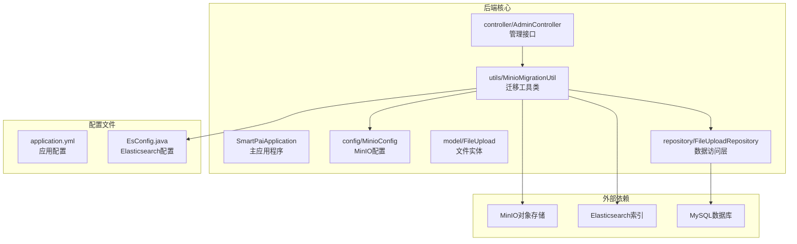
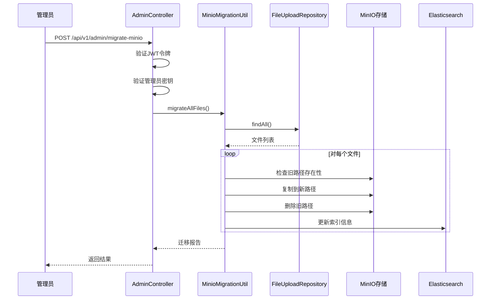
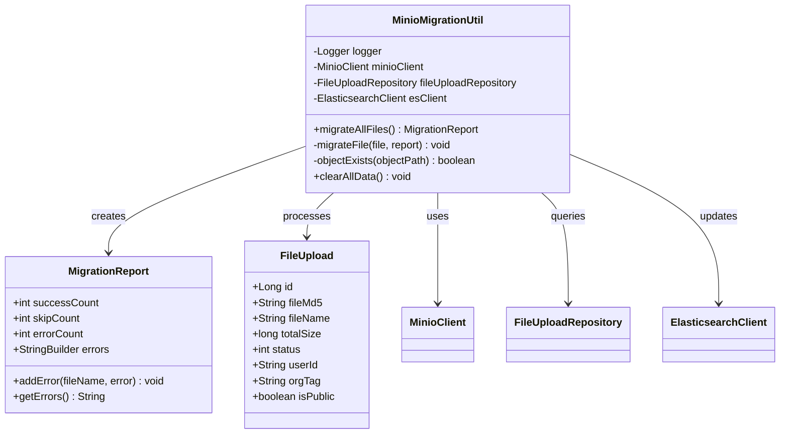
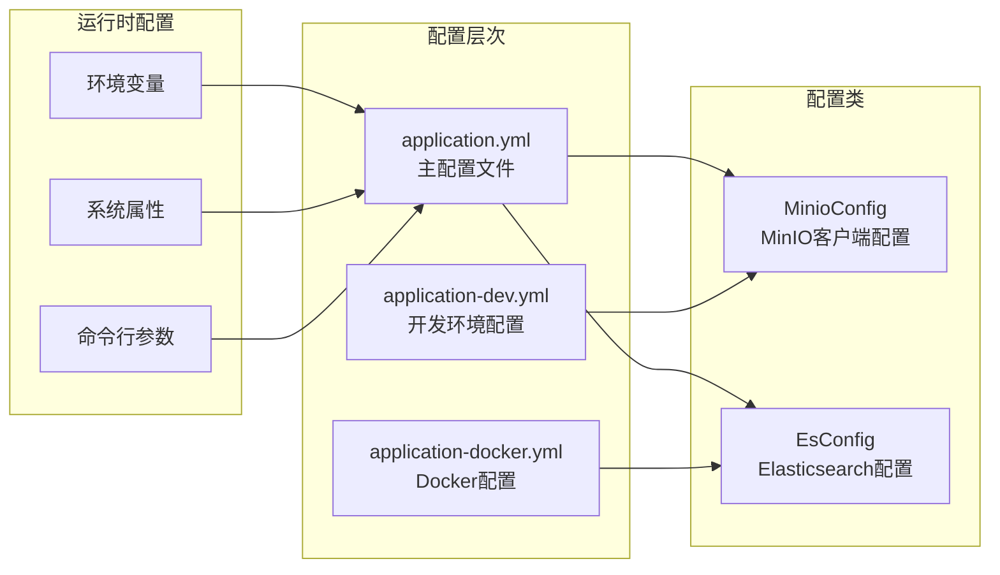
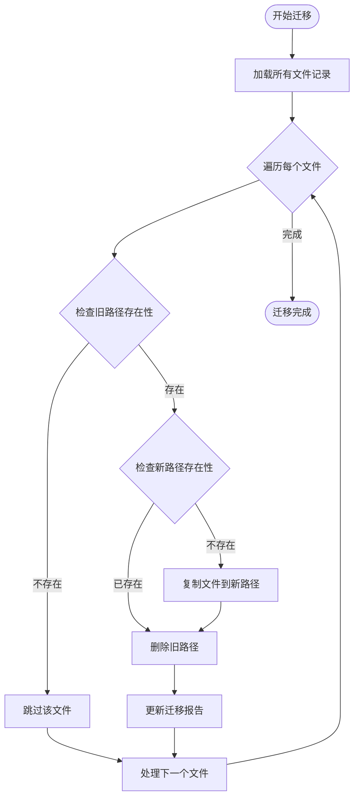
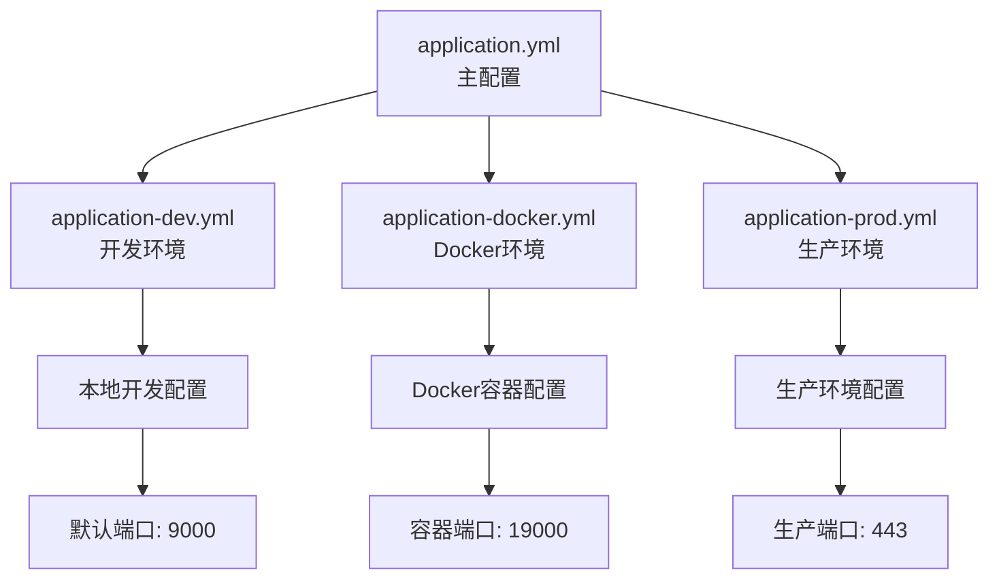

# MinIO迁移工具

<cite>
**本文档引用的文件**
- [MinioMigrationUtil.java](file://src/main/java/com/yizhaoqi/smartpai/utils/MinioMigrationUtil.java)
- [MinioConfig.java](file://src/main/java/com/yizhaoqi/smartpai/config/MinioConfig.java)
- [AdminController.java](file://src/main/java/com/yizhaoqi/smartpai/controller/AdminController.java)
- [FileUpload.java](file://src/main/java/com/yizhaoqi/smartpai/model/FileUpload.java)
- [FileUploadRepository.java](file://src/main/java/com/yizhaoqi/smartpai/repository/FileUploadRepository.java)
- [migrate-minio-files.sh](file://docs/migrate-minio-files.sh)
- [application.yml](file://src/main/resources/application.yml)
- [EsConfig.java](file://src/main/java/com/yizhaoqi/smartpai/config/EsConfig.java)
- [pom.xml](file://pom.xml)
</cite>

## 目录
1. [简介](#简介)
2. [项目结构](#项目结构)
3. [核心组件](#核心组件)
4. [架构概览](#架构概览)
5. [详细组件分析](#详细组件分析)
6. [迁移流程详解](#迁移流程详解)
7. [配置管理](#配置管理)
8. [性能考虑](#性能考虑)
9. [故障排除指南](#故障排除指南)
10. [总结](#总结)

## 简介

MinIO迁移工具是派聪明（PaiSmart）AI知识库管理系统中的一个重要组件，专门用于将存储在MinIO对象存储中的文件从基于文件名的路径结构迁移到基于MD5哈希值的新路径结构。这个工具解决了系统升级过程中的数据迁移问题，确保文件存储结构的一致性和优化。

该工具提供了两种实现方式：
- **Java实现**：通过Spring Boot框架和MinIO SDK进行程序化迁移
- **Shell脚本实现**：通过命令行工具进行批量文件重命名

## 项目结构

派聪明项目采用标准的Spring Boot多模块架构，MinIO迁移工具位于核心业务逻辑中：

**图表来源**
- [MinioMigrationUtil.java:1-245](file://src/main/java/com/yizhaoqi/smartpai/utils/MinioMigrationUtil.java#L1-L245)
- [MinioConfig.java:1-39](file://src/main/java/com/yizhaoqi/smartpai/config/MinioConfig.java#L1-L39)
- [AdminController.java:814-873](file://src/main/java/com/yizhaoqi/smartpai/controller/AdminController.java#L814-L873)

**章节来源**
- [MinioMigrationUtil.java:1-245](file://src/main/java/com/yizhaoqi/smartpai/utils/MinioMigrationUtil.java#L1-L245)
- [application.yml:66-72](file://src/main/resources/application.yml#L66-L72)

## 核心组件

### MinioMigrationUtil迁移工具类

这是整个迁移系统的核心组件，负责执行实际的文件迁移操作。该类实现了完整的迁移生命周期管理，包括文件发现、路径验证、对象复制和清理操作。

**主要特性：**
- **批量迁移**：支持一次性迁移所有文件记录
- **幂等性设计**：重复执行不会产生副作用
- **错误处理**：完善的异常捕获和错误报告机制
- **进度跟踪**：详细的迁移状态报告和日志记录

### AdminController管理接口

提供RESTful API接口，允许管理员通过HTTP请求触发迁移操作。该接口包含了完整的权限验证和安全控制机制。

**安全特性：**
- **JWT令牌验证**：确保只有授权管理员可以执行迁移
- **管理员密钥验证**：双重安全验证机制
- **操作日志记录**：完整的业务操作审计

### FileUpload文件实体

定义了文件元数据的数据结构，包括文件MD5哈希值、原始文件名、上传状态等关键信息。

**核心字段：**
- `fileMd5`：文件的MD5哈希值（新路径使用）
- `fileName`：文件的原始名称（旧路径使用）
- `status`：文件上传状态（0-上传中，1-已完成，2-合并中）

**章节来源**
- [MinioMigrationUtil.java:31-32](file://src/main/java/com/yizhaoqi/smartpai/utils/MinioMigrationUtil.java#L31-L32)
- [AdminController.java:814-873](file://src/main/java/com/yizhaoqi/smartpai/controller/AdminController.java#L814-L873)
- [FileUpload.java:14-97](file://src/main/java/com/yizhaoqi/smartpai/model/FileUpload.java#L14-L97)

## 架构概览

MinIO迁移工具采用分层架构设计，确保了良好的关注点分离和可维护性：

**图表来源**
- [AdminController.java:814-873](file://src/main/java/com/yizhaoqi/smartpai/controller/AdminController.java#L814-L873)
- [MinioMigrationUtil.java:50-77](file://src/main/java/com/yizhaoqi/smartpai/utils/MinioMigrationUtil.java#L50-L77)

## 详细组件分析

### 迁移工具类架构

**图表来源**
- [MinioMigrationUtil.java:32-244](file://src/main/java/com/yizhaoqi/smartpai/utils/MinioMigrationUtil.java#L32-L244)
- [FileUpload.java:14-97](file://src/main/java/com/yizhaoqi/smartpai/model/FileUpload.java#L14-L97)

### 配置管理架构

**图表来源**
- [application.yml:66-72](file://src/main/resources/application.yml#L66-L72)
- [MinioConfig.java:11-38](file://src/main/java/com/yizhaoqi/smartpai/config/MinioConfig.java#L11-L38)
- [EsConfig.java:24-79](file://src/main/java/com/yizhaoqi/smartpai/config/EsConfig.java#L24-L79)

**章节来源**
- [MinioConfig.java:11-38](file://src/main/java/com/yizhaoqi/smartpai/config/MinioConfig.java#L11-L38)
- [EsConfig.java:24-79](file://src/main/java/com/yizhaoqi/smartpai/config/EsConfig.java#L24-L79)

## 迁移流程详解

### 迁移算法流程

**图表来源**
- [MinioMigrationUtil.java:50-141](file://src/main/java/com/yizhaoqi/smartpai/utils/MinioMigrationUtil.java#L50-L141)

### 迁移前准备工作

在执行迁移之前，需要确保以下条件满足：

1. **数据库连接正常**：确保MySQL连接配置正确
2. **MinIO服务可用**：验证MinIO对象存储服务状态
3. **Elasticsearch索引存在**：确保知识库索引已初始化
4. **权限验证通过**：管理员JWT令牌有效

### 迁移执行策略

迁移工具采用了幂等性设计，确保重复执行不会产生副作用：

1. **路径存在性检查**：在执行任何操作前检查路径状态
2. **原子性操作**：复制成功后再删除旧文件
3. **错误恢复机制**：单个文件失败不影响整体迁移
4. **进度跟踪**：实时更新迁移状态和统计信息

**章节来源**
- [MinioMigrationUtil.java:82-141](file://src/main/java/com/yizhaoqi/smartpai/utils/MinioMigrationUtil.java#L82-L141)

## 配置管理

### MinIO配置详解

MinIO配置通过Spring Boot的配置机制实现，支持多种环境的灵活配置：

**核心配置项：**
- `minio.endpoint`：MinIO服务端点地址
- `minio.accessKey`：访问密钥
- `minio.secretKey`：秘密密钥
- `minio.bucketName`：存储桶名称（默认：uploads）
- `minio.publicUrl`：公共访问URL

### 环境配置策略

项目支持多种配置环境，每种环境都有其特定的配置文件：

**图表来源**
- [application.yml:66-72](file://src/main/resources/application.yml#L66-L72)
- [application-dev.yml:64-70](file://src/main/resources/application-dev.yml#L64-L70)
- [application-docker.yml:64-70](file://src/main/resources/application-docker.yml#L64-L70)

### 依赖管理

项目使用Maven管理依赖，MinIO迁移工具相关的依赖配置如下：

**核心依赖：**
- `io.minio:minio:8.5.12`：MinIO Java SDK
- `co.elastic.clients:elasticsearch-java:8.10.0`：Elasticsearch Java客户端
- `org.springframework.boot:spring-boot-starter-data-jpa`：JPA数据访问

**章节来源**
- [pom.xml:112-117](file://pom.xml#L112-L117)
- [pom.xml:147-152](file://pom.xml#L147-L152)

## 性能考虑

### 迁移性能优化

MinIO迁移工具在设计时充分考虑了性能因素：

1. **批量处理**：一次性加载所有文件记录，减少数据库查询次数
2. **异步操作**：MinIO操作采用异步模式，提高并发处理能力
3. **内存管理**：合理控制内存使用，避免大文件导致的内存溢出
4. **连接池管理**：复用数据库和MinIO连接，减少连接开销

### 并发处理策略

迁移工具支持多线程并发处理，但考虑到数据一致性，实际采用串行处理：

### 错误处理机制

系统实现了多层次的错误处理机制：

1. **文件级别错误**：单个文件失败不影响整体迁移
2. **网络异常处理**：MinIO连接失败时自动重试
3. **数据库异常处理**：MySQL连接异常时记录错误并继续
4. **资源清理**：异常情况下确保资源正确释放

## 故障排除指南

### 常见问题及解决方案

**问题1：MinIO连接失败**
- 检查`minio.endpoint`配置是否正确
- 验证网络连通性和防火墙设置
- 确认MinIO服务状态和认证信息

**问题2：文件迁移失败**
- 检查文件权限和存储空间
- 验证文件路径格式和编码
- 确认Elasticsearch索引状态

**问题3：数据库连接问题**
- 检查MySQL服务状态
- 验证连接参数和凭据
- 确认数据库用户权限

### 日志分析

迁移工具提供了详细的日志记录，包括：

- **调试日志**：详细的操作步骤和状态信息
- **警告日志**：潜在问题和冲突信息
- **错误日志**：异常情况和失败原因
- **性能日志**：操作耗时和资源使用情况

### 迁移验证

迁移完成后，可以通过以下方式进行验证：

1. **文件完整性检查**：验证文件MD5哈希值
2. **路径结构验证**：确认新路径结构正确
3. **索引一致性检查**：验证Elasticsearch索引更新
4. **访问权限测试**：确认文件访问权限正常

**章节来源**
- [MinioMigrationUtil.java:163-217](file://src/main/java/com/yizhaoqi/smartpai/utils/MinioMigrationUtil.java#L163-L217)

## 总结

MinIO迁移工具是派聪明AI知识库管理系统中的关键组件，它成功解决了系统升级过程中的数据迁移问题。该工具具有以下特点：

### 技术优势

1. **完整功能**：支持完整的迁移生命周期管理
2. **安全可靠**：多重权限验证和错误处理机制
3. **性能优化**：合理的并发处理和资源管理
4. **易于使用**：简洁的API接口和详细的日志记录

### 应用价值

- **数据一致性**：确保文件存储结构的一致性和完整性
- **系统升级**：支持系统的平滑升级和架构演进
- **运维便利**：提供自动化和可视化的迁移工具
- **成本效益**：减少人工干预和运维成本

### 发展前景

随着AI知识库系统的不断发展，MinIO迁移工具将继续演进，支持更多的存储后端和迁移场景，为用户提供更加完善的数据管理解决方案。

该工具的成功实施为类似的企业级应用提供了宝贵的参考经验，展示了如何在复杂的分布式系统中实现安全、可靠的文件迁移方案。