# 使用监控仪表板

<cite>
**本文档引用的文件**
- [frontend/src/views/usage-monitor/index.vue](file://frontend/src/views/usage-monitor/index.vue)
- [src/main/java/com/yizhaoqi/smartpai/service/UsageDashboardService.java](file://src/main/java/com/yizhaoqi/smartpai/service/UsageDashboardService.java)
- [src/main/java/com/yizhaoqi/smartpai/service/UsageBalanceDashboardService.java](file://src/main/java/com/yizhaoqi/smartpai/service/UsageBalanceDashboardService.java)
- [src/main/java/com/yizhaoqi/smartpai/service/UsageBalanceQuotaService.java](file://src/main/java/com/yizhaoqi/smartpai/service/UsageBalanceQuotaService.java)
- [src/main/java/com/yizhaoqi/smartpai/service/UsageQuotaService.java](file://src/main/java/com/yizhaoqi/smartpai/service/UsageQuotaService.java)
- [src/main/java/com/yizhaoqi/smartpai/service/UserTokenService.java](file://src/main/java/com/yizhaoqi/smartpai/service/UserTokenService.java)
- [src/main/java/com/yizhaoqi/smartpai/service/RateLimitConfigService.java](file://src/main/java/com/yizhaoqi/smartpai/service/RateLimitConfigService.java)
- [src/main/java/com/yizhaoqi/smartpai/model/UserTokenRecord.java](file://src/main/java/com/yizhaoqi/smartpai/model/UserTokenRecord.java)
- [src/main/java/com/yizhaoqi/smartpai/model/RateLimitConfig.java](file://src/main/java/com/yizhaoqi/smartpai/model/RateLimitConfig.java)
- [src/main/java/com/yizhaoqi/smartpai/repository/UserTokenRecordRepository.java](file://src/main/java/com/yizhaoqi/smartpai/repository/UserTokenRecordRepository.java)
- [src/main/java/com/yizhaoqi/smartpai/controller/AdminController.java](file://src/main/java/com/yizhaoqi/smartpai/controller/AdminController.java)
- [src/main/java/com/yizhaoqi/smartpai/config/UsageQuotaProperties.java](file://src/main/java/com/yizhaoqi/smartpai/config/UsageQuotaProperties.java)
- [src/main/java/com/yizhaoqi/smartpai/config/QuotaConfiguration.java](file://src/main/java/com/yizhaoqi/smartpai/config/QuotaConfiguration.java)
- [frontend/src/hooks/business/auth.ts](file://frontend/src/hooks/business/auth.ts)
- [frontend/src/store/modules/auth/index.ts](file://frontend/src/store/modules/auth/index.ts)
- [frontend/src/router/routes/builtin.ts](file://frontend/src/router/routes/builtin.ts)
</cite>

## 更新摘要
**变更内容**
- 新增 Token 余额监控功能，支持 LLM 和 Embedding Token 的全局余额管理
- 增强用户排行统计功能，提供基于 Token 消耗的实时排行榜
- 完善限流配置管理，支持多维度的限流策略配置和动态更新
- 优化告警机制，新增基于 Token 余额的智能预警系统
- 升级监控仪表板架构，支持双模式（配额模式和余额模式）切换

## 目录
1. [简介](#简介)
2. [项目结构](#项目结构)
3. [核心组件](#核心组件)
4. [架构概览](#架构概览)
5. [详细组件分析](#详细组件分析)
6. [依赖关系分析](#依赖关系分析)
7. [性能考虑](#性能考虑)
8. [故障排除指南](#故障排除指南)
9. [结论](#结论)

## 简介

使用监控仪表板是 PaiSmart 项目中的关键功能模块，用于为管理员提供系统的使用情况监控和分析。该仪表板提供了实时的用量统计、趋势分析、用户行为监控和系统状态概览等功能。

**更新** 新增了 Token 余额监控、用户排行统计、限流配置管理和告警机制等核心功能，基于监控增强的 Applied Changes。

主要功能包括：
- 用量总览和趋势分析
- 用户使用排行统计（基于 Token 消耗）
- 系统告警和预警机制（智能余额预警）
- 限流配置管理（多维度限流策略）
- Token 余额监控（全局余额管理）
- 用户活动追踪和统计

## 项目结构

监控仪表板采用前后端分离的架构设计，前端使用 Vue.js + TypeScript 技术栈，后端使用 Spring Boot + Java。

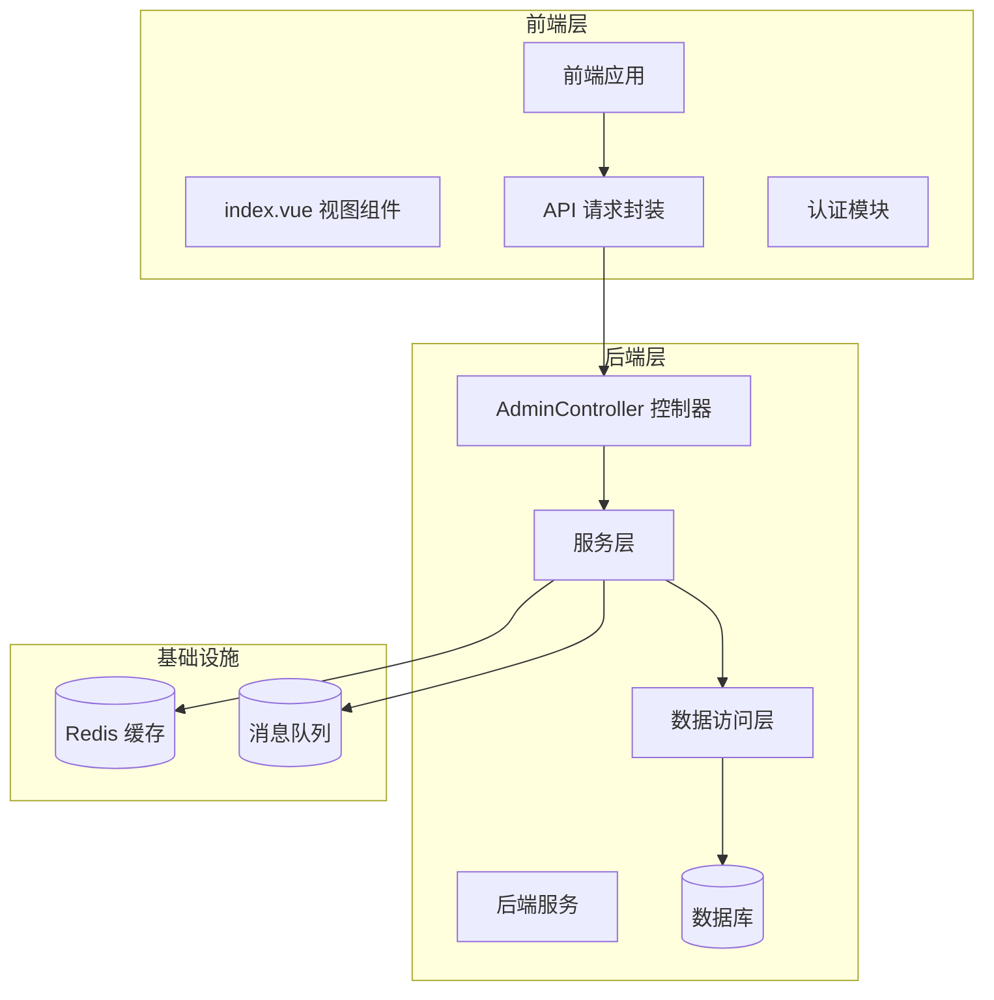

**图表来源**
- [frontend/src/views/usage-monitor/index.vue:1-556](file://frontend/src/views/usage-monitor/index.vue#L1-L556)
- [src/main/java/com/yizhaoqi/smartpai/controller/AdminController.java:221-239](file://src/main/java/com/yizhaoqi/smartpai/controller/AdminController.java#L221-L239)

**章节来源**
- [frontend/src/views/usage-monitor/index.vue:1-50](file://frontend/src/views/usage-monitor/index.vue#L1-L50)
- [src/main/java/com/yizhaoqi/smartpai/controller/AdminController.java:1-50](file://src/main/java/com/yizhaoqi/smartpai/controller/AdminController.java#L1-L50)

## 核心组件

监控仪表板由多个核心组件构成，每个组件负责特定的功能领域：

### 前端组件

1. **用量监控视图组件**
   - 提供完整的用量监控界面
   - 支持时间范围切换（7天/30天）
   - 集成 ECharts 图表展示
   - 实时显示告警信息和用户排行

2. **限流配置管理**
   - 聊天消息限流配置
   - LLM 全网 Token 预算
   - Embedding 上传/查询限流
   - 动态配置更新和验证

3. **用户排行统计**
   - LLM Token 消耗排行
   - Embedding Token 消耗排行
   - 基于 Token 消耗的实时排名

### 后端服务组件

1. **用量仪表板服务**
   - 统计用户使用情况
   - 生成用量趋势数据
   - 计算用户排行
   - 智能告警生成

2. **Token 管理服务**
   - 管理用户全局 Token 余额
   - 记录 Token 变动历史
   - 提供余额预警功能
   - 支持 Token 增加和消费

3. **限流配置服务**
   - 管理系统限流规则
   - 验证配置有效性
   - 应用新的限流策略
   - 支持多维度限流配置

4. **余额仪表板服务**
   - 基于 Token 余额的监控
   - 实时用户排行统计
   - 智能余额预警机制
   - 支持双模式切换

**章节来源**
- [frontend/src/views/usage-monitor/index.vue:1-100](file://frontend/src/views/usage-monitor/index.vue#L1-L100)
- [src/main/java/com/yizhaoqi/smartpai/service/UsageDashboardService.java:1-67](file://src/main/java/com/yizhaoqi/smartpai/service/UsageDashboardService.java#L1-L67)
- [src/main/java/com/yizhaoqi/smartpai/service/UserTokenService.java:1-66](file://src/main/java/com/yizhaoqi/smartpai/service/UserTokenService.java#L1-L66)

## 架构概览

监控仪表板采用分层架构设计，确保了良好的可维护性和扩展性。新增的 Token 余额监控和智能告警机制进一步增强了系统的监控能力。

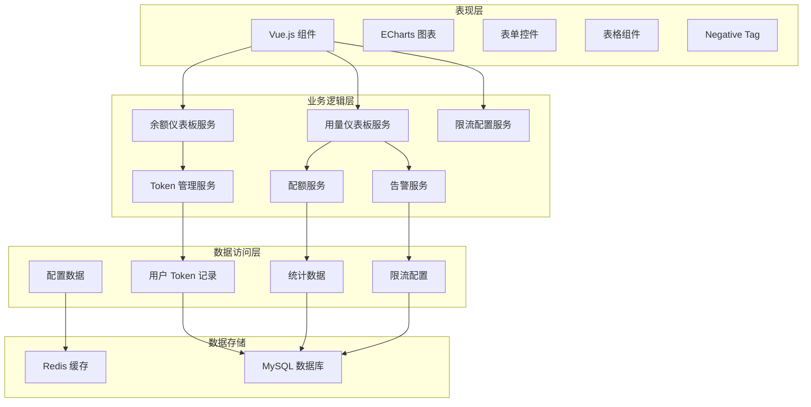

**图表来源**
- [src/main/java/com/yizhaoqi/smartpai/service/UsageDashboardService.java:11-67](file://src/main/java/com/yizhaoqi/smartpai/service/UsageDashboardService.java#L11-L67)
- [src/main/java/com/yizhaoqi/smartpai/service/UsageBalanceDashboardService.java:10-24](file://src/main/java/com/yizhaoqi/smartpai/service/UsageBalanceDashboardService.java#L10-L24)
- [src/main/java/com/yizhaoqi/smartpai/service/UserTokenService.java:37-66](file://src/main/java/com/yizhaoqi/smartpai/service/UserTokenService.java#L37-L66)
- [src/main/java/com/yizhaoqi/smartpai/service/RateLimitConfigService.java:13-31](file://src/main/java/com/yizhaoqi/smartpai/service/RateLimitConfigService.java#L13-L31)

## 详细组件分析

### 用量监控视图组件

用量监控视图组件是前端的核心组件，提供了完整的监控界面和交互功能。新增的 Token 余额监控和智能告警功能使其具备了更全面的监控能力。

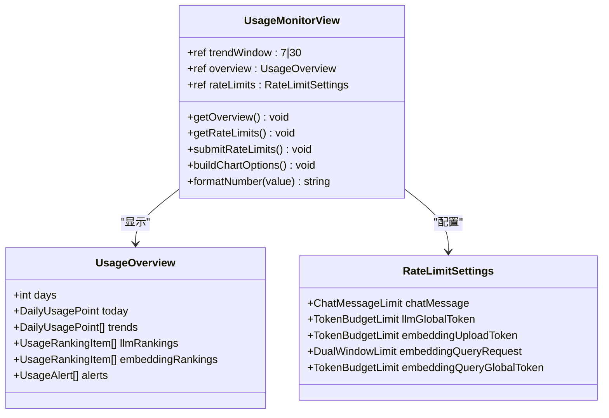

**图表来源**
- [frontend/src/views/usage-monitor/index.vue:1-255](file://frontend/src/views/usage-monitor/index.vue#L1-L255)

#### 数据流分析

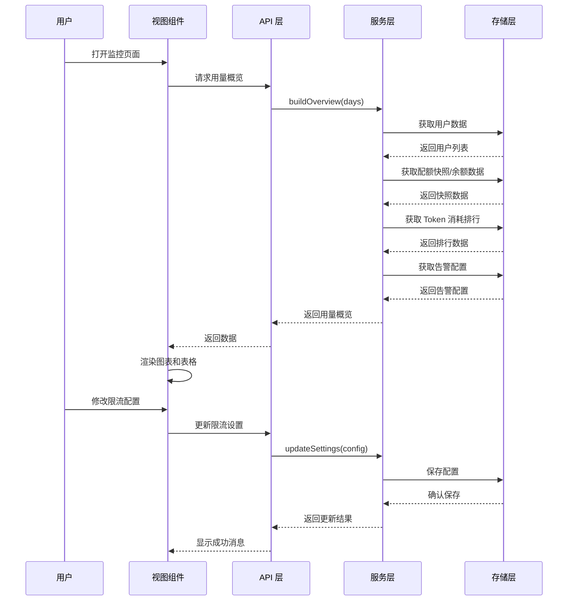

**图表来源**
- [frontend/src/views/usage-monitor/index.vue:14-125](file://frontend/src/views/usage-monitor/index.vue#L14-L125)
- [src/main/java/com/yizhaoqi/smartpai/controller/AdminController.java:221-280](file://src/main/java/com/yizhaoqi/smartpai/controller/AdminController.java#L221-L280)

**章节来源**
- [frontend/src/views/usage-monitor/index.vue:1-255](file://frontend/src/views/usage-monitor/index.vue#L1-L255)

### 用量仪表板服务

用量仪表板服务负责收集和计算各种监控指标，为前端提供数据支持。新增的余额模式支持使其能够同时处理配额模式和余额模式的监控数据。

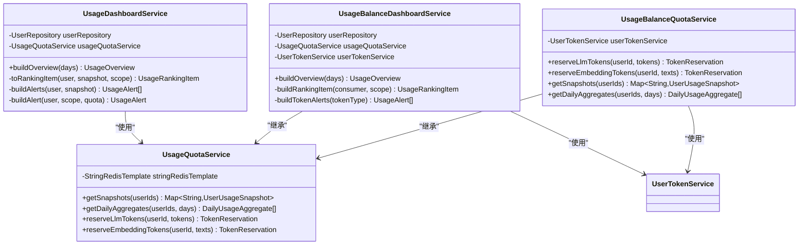

**图表来源**
- [src/main/java/com/yizhaoqi/smartpai/service/UsageDashboardService.java:11-67](file://src/main/java/com/yizhaoqi/smartpai/service/UsageDashboardService.java#L11-L67)
- [src/main/java/com/yizhaoqi/smartpai/service/UsageBalanceDashboardService.java:10-24](file://src/main/java/com/yizhaoqi/smartpai/service/UsageBalanceDashboardService.java#L10-L24)
- [src/main/java/com/yizhaoqi/smartpai/service/UsageQuotaService.java:24-38](file://src/main/java/com/yizhaoqi/smartpai/service/UsageQuotaService.java#L24-L38)
- [src/main/java/com/yizhaoqi/smartpai/service/UsageBalanceQuotaService.java:22-35](file://src/main/java/com/yizhaoqi/smartpai/service/UsageBalanceQuotaService.java#L22-L35)

#### 用量统计流程

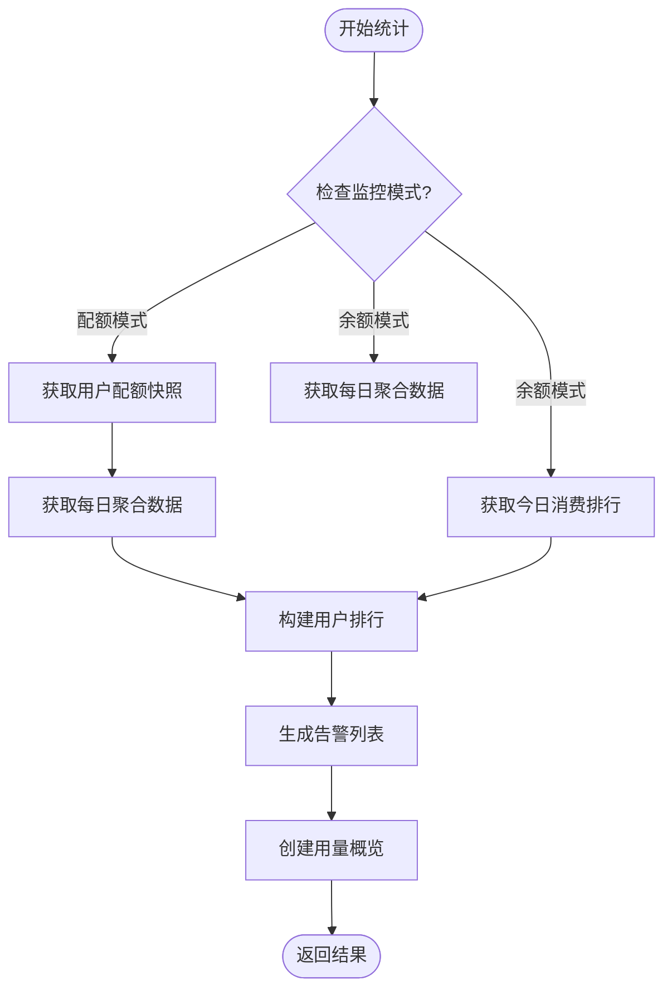

**图表来源**
- [src/main/java/com/yizhaoqi/smartpai/service/UsageDashboardService.java:21-67](file://src/main/java/com/yizhaoqi/smartpai/service/UsageDashboardService.java#L21-L67)
- [src/main/java/com/yizhaoqi/smartpai/service/UsageBalanceDashboardService.java:26-75](file://src/main/java/com/yizhaoqi/smartpai/service/UsageBalanceDashboardService.java#L26-L75)

**章节来源**
- [src/main/java/com/yizhaoqi/smartpai/service/UsageDashboardService.java:1-193](file://src/main/java/com/yizhaoqi/smartpai/service/UsageDashboardService.java#L1-L193)
- [src/main/java/com/yizhaoqi/smartpai/service/UsageBalanceDashboardService.java:1-131](file://src/main/java/com/yizhaoqi/smartpai/service/UsageBalanceDashboardService.java#L1-L131)

### Token 管理服务

Token 管理服务负责管理用户的全局 Token 余额，提供余额查询、消费和充值功能。这是新增的核心功能，支持 LLM 和 Embedding Token 的统一管理。

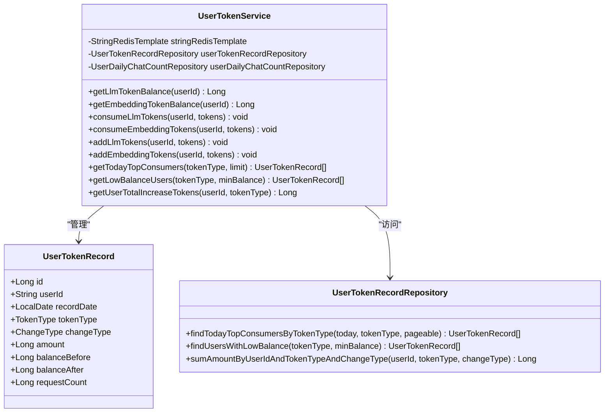

**图表来源**
- [src/main/java/com/yizhaoqi/smartpai/service/UserTokenService.java:37-66](file://src/main/java/com/yizhaoqi/smartpai/service/UserTokenService.java#L37-L66)
- [src/main/java/com/yizhaoqi/smartpai/model/UserTokenRecord.java:23-46](file://src/main/java/com/yizhaoqi/smartpai/model/UserTokenRecord.java#L23-L46)
- [src/main/java/com/yizhaoqi/smartpai/repository/UserTokenRecordRepository.java:22-98](file://src/main/java/com/yizhaoqi/smartpai/repository/UserTokenRecordRepository.java#L22-L98)

#### Token 消费流程

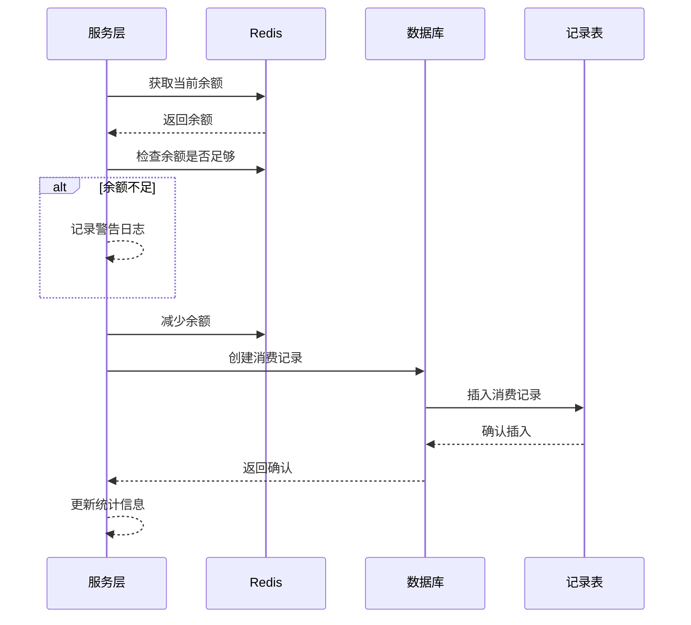

**图表来源**
- [src/main/java/com/yizhaoqi/smartpai/service/UserTokenService.java:124-169](file://src/main/java/com/yizhaoqi/smartpai/service/UserTokenService.java#L124-L169)

**章节来源**
- [src/main/java/com/yizhaoqi/smartpai/service/UserTokenService.java:1-457](file://src/main/java/com/yizhaoqi/smartpai/service/UserTokenService.java#L1-L457)
- [src/main/java/com/yizhaoqi/smartpai/model/UserTokenRecord.java:1-111](file://src/main/java/com/yizhaoqi/smartpai/model/UserTokenRecord.java#L1-L111)

### 限流配置管理

限流配置管理功能允许管理员动态调整系统的限流策略。新增的多维度配置支持使其能够精确控制不同场景下的流量限制。

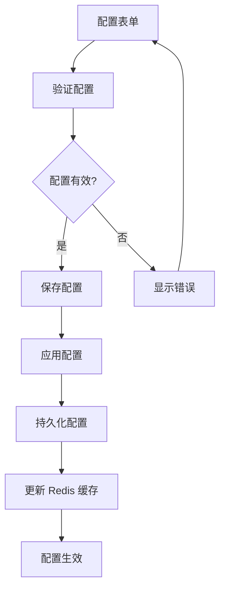

**图表来源**
- [frontend/src/views/usage-monitor/index.vue:107-125](file://frontend/src/views/usage-monitor/index.vue#L107-L125)
- [src/main/java/com/yizhaoqi/smartpai/controller/AdminController.java:259-280](file://src/main/java/com/yizhaoqi/smartpai/controller/AdminController.java#L259-L280)

**章节来源**
- [frontend/src/views/usage-monitor/index.vue:29-125](file://frontend/src/views/usage-monitor/index.vue#L29-L125)
- [src/main/java/com/yizhaoqi/smartpai/controller/AdminController.java:241-280](file://src/main/java/com/yizhaoqi/smartpai/controller/AdminController.java#L241-L280)

### 告警机制

新增的智能告警机制基于 Token 余额和使用比例提供实时预警，支持多种告警级别和通知方式。

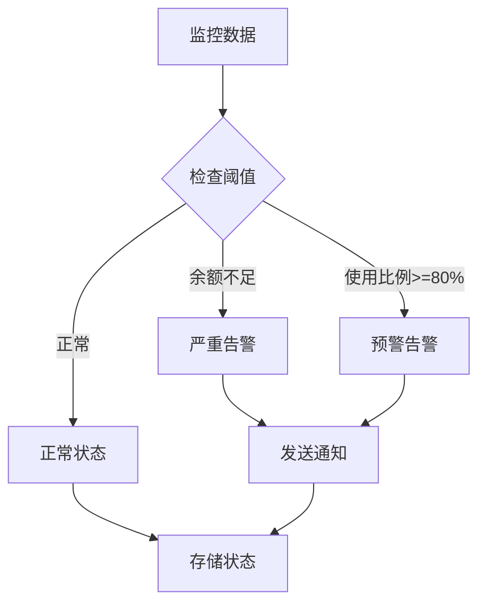

**图表来源**
- [src/main/java/com/yizhaoqi/smartpai/service/UsageDashboardService.java:100-137](file://src/main/java/com/yizhaoqi/smartpai/service/UsageDashboardService.java#L100-L137)
- [src/main/java/com/yizhaoqi/smartpai/service/UsageBalanceDashboardService.java:99-101](file://src/main/java/com/yizhaoqi/smartpai/service/UsageBalanceDashboardService.java#L99-L101)

**章节来源**
- [src/main/java/com/yizhaoqi/smartpai/service/UsageDashboardService.java:83-137](file://src/main/java/com/yizhaoqi/smartpai/service/UsageDashboardService.java#L83-L137)
- [src/main/java/com/yizhaoqi/smartpai/service/UsageBalanceDashboardService.java:99-101](file://src/main/java/com/yizhaoqi/smartpai/service/UsageBalanceDashboardService.java#L99-L101)

## 依赖关系分析

监控仪表板的依赖关系相对清晰，遵循了分层架构的设计原则。新增的 Token 余额监控和智能告警功能进一步丰富了系统的依赖关系。

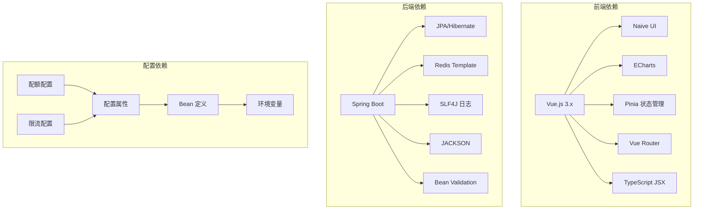

**图表来源**
- [src/main/java/com/yizhaoqi/smartpai/config/QuotaConfiguration.java:41-59](file://src/main/java/com/yizhaoqi/smartpai/config/QuotaConfiguration.java#L41-L59)
- [src/main/java/com/yizhaoqi/smartpai/config/UsageQuotaProperties.java:1-37](file://src/main/java/com/yizhaoqi/smartpai/config/UsageQuotaProperties.java#L1-L37)

**章节来源**
- [src/main/java/com/yizhaoqi/smartpai/config/QuotaConfiguration.java:1-59](file://src/main/java/com/yizhaoqi/smartpai/config/QuotaConfiguration.java#L1-L59)
- [src/main/java/com/yizhaoqi/smartpai/config/UsageQuotaProperties.java:1-37](file://src/main/java/com/yizhaoqi/smartpai/config/UsageQuotaProperties.java#L1-L37)

## 性能考虑

监控仪表板在设计时充分考虑了性能优化，特别是在处理大量用户数据时的性能表现。新增的 Token 余额监控功能进一步优化了数据处理效率。

### Redis 缓存策略

系统使用 Redis 作为主要的缓存层，存储用户配额、Token 余额和统计信息：

- **配额数据缓存**：用户每日使用的 Token 数量和请求次数
- **Token 余额缓存**：用户的 LLM 和 Embedding Token 余额
- **统计数据缓存**：近期的用量趋势和排行数据
- **限流配置缓存**：动态更新的限流配置信息

### 数据聚合优化

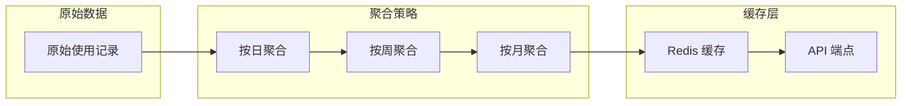

### 内存管理

系统实现了智能的内存管理策略，避免在用户数量较多时出现内存溢出问题：

- **分批处理**：对大量用户的配额快照进行分批获取
- **延迟加载**：仅在需要时才加载完整的用户数据
- **缓存淘汰**：基于 TTL 的自动缓存清理机制
- **数据库查询优化**：使用 JPQL 子查询优化 Token 预警查询

**章节来源**
- [src/main/java/com/yizhaoqi/smartpai/service/UserTokenService.java:451-455](file://src/main/java/com/yizhaoqi/smartpai/service/UserTokenService.java#L451-L455)

## 故障排除指南

### 常见问题及解决方案

#### 1. 用量数据不更新

**症状**：监控仪表板显示的用量数据长时间不变

**可能原因**：
- Redis 服务不可用
- 用户 Token 记录未正确写入数据库
- 缓存过期时间设置不当
- Token 余额模式配置错误

**解决步骤**：
1. 检查 Redis 服务状态
2. 验证数据库连接
3. 查看相关日志文件
4. 重启缓存服务
5. 检查监控模式配置

#### 2. Token 余额显示异常

**症状**：用户 Token 余额与预期不符

**可能原因**：
- Redis 中的余额数据损坏
- 数据库中的消费记录重复计算
- 缓存与数据库不同步
- Token 增加/消费记录异常

**解决步骤**：
1. 清理相关 Redis 键
2. 重新同步数据库和缓存
3. 检查消费记录的去重逻辑
4. 验证 Token 增加和消费的事务一致性

#### 3. 告警功能异常

**症状**：告警信息不准确或不显示

**可能原因**：
- 告警阈值配置错误
- Token 预警查询异常
- 告警级别判断逻辑错误
- 数据库连接问题

**解决步骤**：
1. 检查告警阈值配置
2. 验证 Token 预警查询逻辑
3. 查看告警级别判断条件
4. 检查数据库连接状态

#### 4. 限流配置不生效

**症状**：修改的限流配置不生效

**可能原因**：
- 配置验证失败
- Redis 缓存未更新
- 配置持久化失败
- 应用程序重启未加载新配置

**解决步骤**：
1. 检查配置验证逻辑
2. 清理 Redis 缓存并重新加载
3. 验证配置持久化到数据库
4. 重启应用程序以加载新配置

**章节来源**
- [src/main/java/com/yizhaoqi/smartpai/service/UsageQuotaService.java:28-31](file://src/main/java/com/yizhaoqi/smartpai/service/UsageQuotaService.java#L28-L31)
- [src/main/java/com/yizhaoqi/smartpai/service/UserTokenService.java:124-169](file://src/main/java/com/yizhaoqi/smartpai/service/UserTokenService.java#L124-L169)

## 结论

使用监控仪表板是 PaiSmart 项目中一个功能完整、架构清晰的监控系统。经过监控增强更新后，系统具备了更全面的监控能力和更智能的告警机制。

### 主要优势

1. **全面的监控覆盖**：涵盖用量统计、用户行为、系统状态、Token 余额等多个维度
2. **灵活的配置管理**：支持动态调整限流策略和监控参数
3. **高性能的数据处理**：通过 Redis 缓存和数据聚合优化，确保良好的用户体验
4. **智能告警机制**：基于使用率和余额的双重预警系统
5. **双模式支持**：既支持传统的每日配额模式，也支持现代化的全局 Token 余额模式
6. **实时数据更新**：通过 Redis 实现近实时的数据更新和展示

### 技术亮点

- **智能 Token 管理**：统一管理 LLM 和 Embedding Token 余额
- **实时用户排行**：基于 Token 消耗的实时排行榜
- **多维度限流控制**：支持聊天消息、LLM、Embedding 等多场景限流
- **智能余额预警**：基于余额和使用比例的智能预警系统
- **友好的用户界面**：基于 Vue.js 和 ECharts 的现代化前端界面

### 发展建议

1. **增强移动端适配**：优化移动端的监控界面体验
2. **扩展监控维度**：增加更多业务指标的监控能力
3. **提升数据准确性**：进一步优化数据聚合算法
4. **加强安全防护**：完善监控数据的访问控制和审计功能
5. **优化告警策略**：根据实际使用情况调整告警阈值和通知方式

监控仪表板为 PaiSmart 项目提供了强大的运营支撑能力，是系统稳定运行的重要保障。新增的 Token 余额监控和智能告警功能进一步提升了系统的监控能力和用户体验。