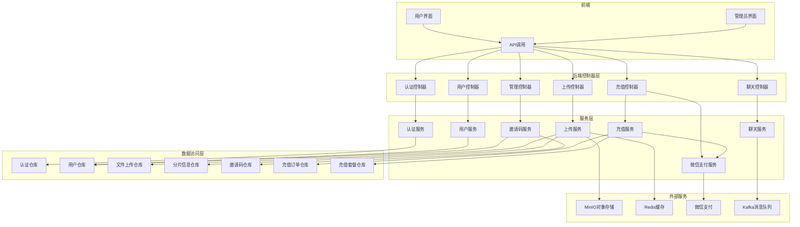
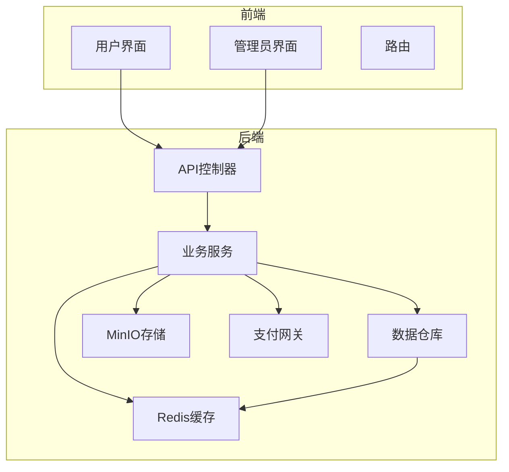
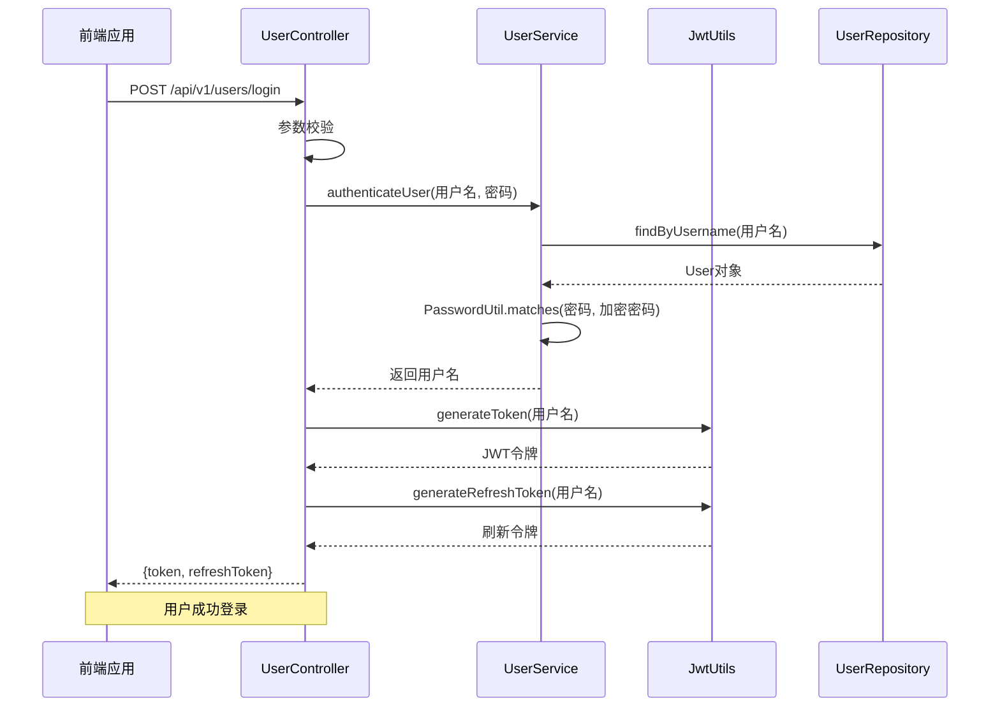
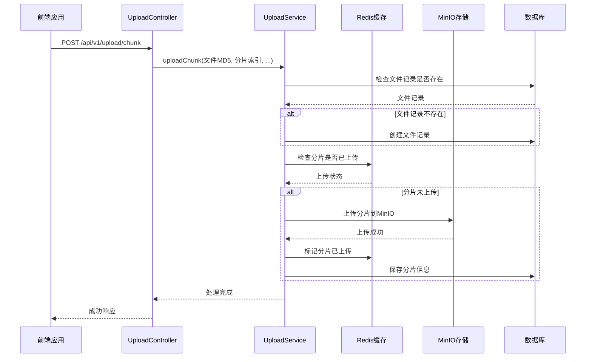
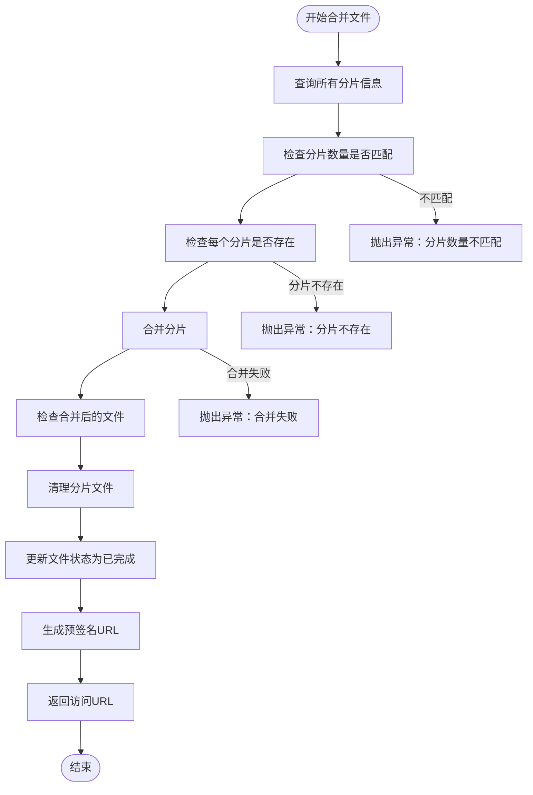
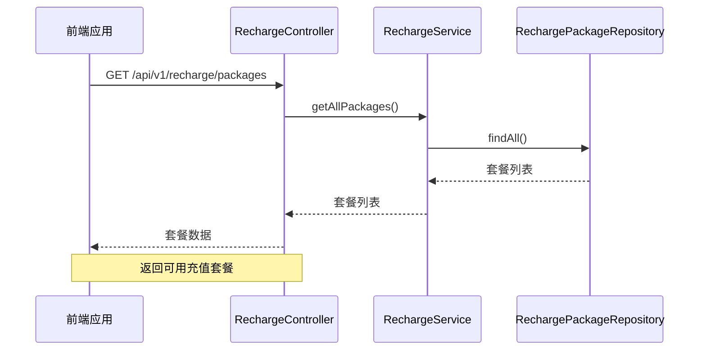
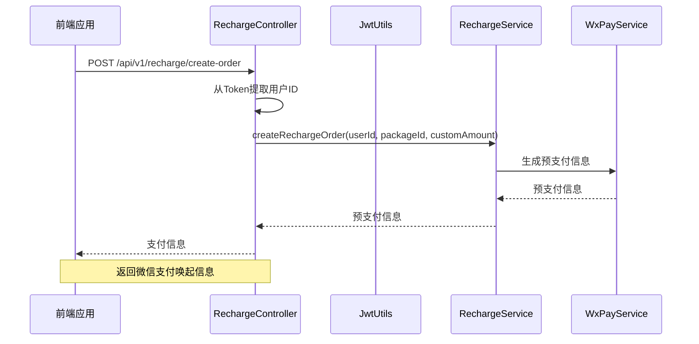
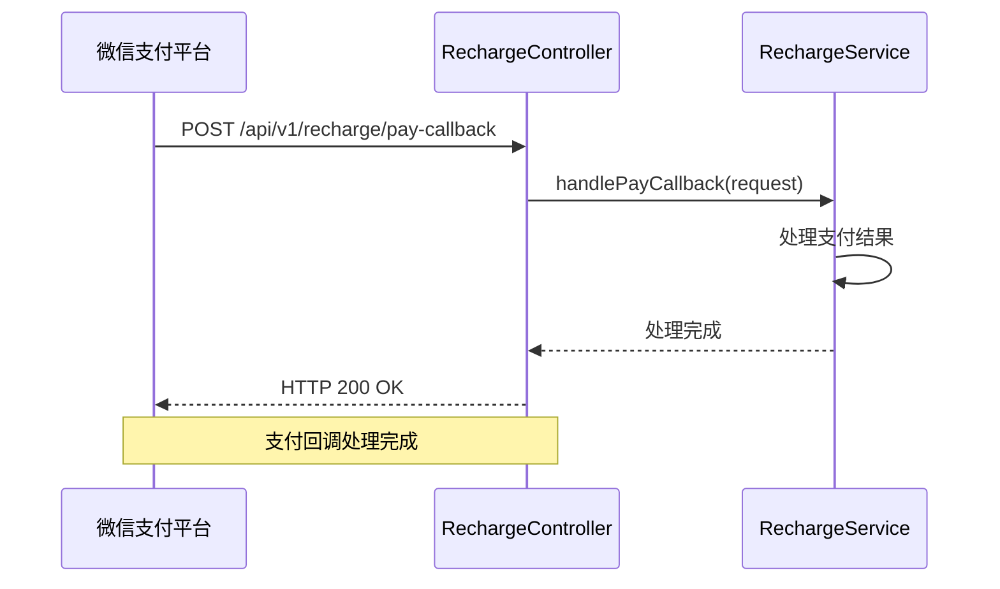
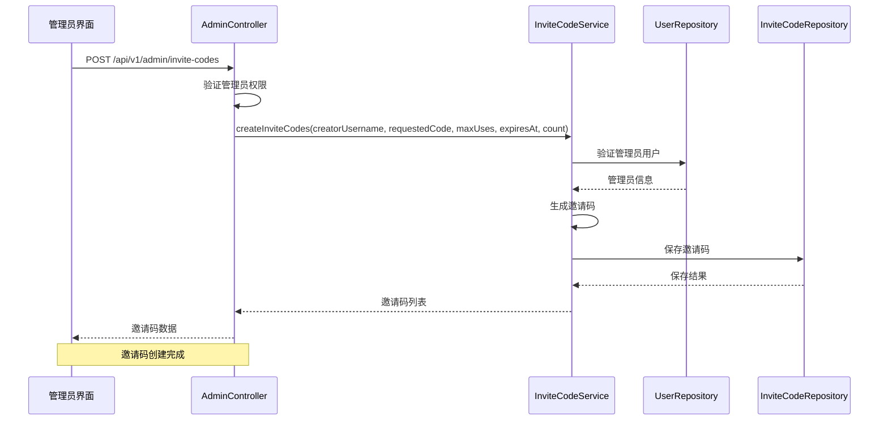
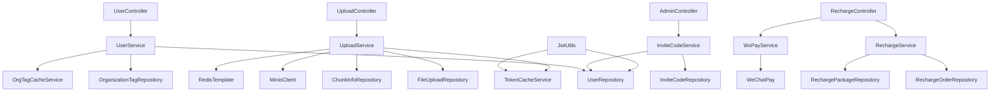

# 控制器层

<cite>
**本文档中引用的文件**   
- [AuthController.java](file://src/main/java/com/yizhaoqi/smartpai/controller/AuthController.java)
- [UserController.java](file://src/main/java/com/yizhaoqi/smartpai/controller/UserController.java)
- [UploadController.java](file://src/main/java/com/yizhaoqi/smartpai/controller/UploadController.java)
- [RechargeController.java](file://src/main/java/com/yizhaoqi/smartpai/controller/RechargeController.java)
- [AdminController.java](file://src/main/java/com/yizhaoqi/smartpai/controller/AdminController.java)
- [JwtUtils.java](file://src/main/java/com/yizhaoqi/smartpai/utils/JwtUtils.java)
- [UserService.java](file://src/main/java/com/yizhaoqi/smartpai/service/UserService.java)
- [UploadService.java](file://src/main/java/com/yizhaoqi/smartpai/service/UploadService.java)
- [RechargeService.java](file://src/main/java/com/yizhaoqi/smartpai/service/RechargeService.java)
- [InviteCodeService.java](file://src/main/java/com/yizhaoqi/smartpai/service/InviteCodeService.java)
- [WxPayService.java](file://src/main/java/com/yizhaoqi/smartpai/service/WxPayService.java)
- [FileUploadRepository.java](file://src/main/java/com/yizhaoqi/smartpai/repository/FileUploadRepository.java)
- [ChunkInfoRepository.java](file://src/main/java/com/yizhaoqi/smartpai/repository/ChunkInfoRepository.java)
- [InviteCodeRepository.java](file://src/main/java/com/yizhaoqi/smartpai/repository/InviteCodeRepository.java)
- [RechargeOrder.java](file://src/main/java/com/yizhaoqi/smartpai/model/RechargeOrder.java)
- [RechargePackage.java](file://src/main/java/com/yizhaoqi/smartpai/model/RechargePackage.java)
- [InviteCode.java](file://src/main/java/com/yizhaoqi/smartpai/model/InviteCode.java)
- [MinioClient.java](file://src/main/java/io/minio/MinioClient.java)
- [RedisTemplate.java](file://src/main/java/org/springframework/data/redis/core/RedisTemplate.java)
</cite>

## 更新摘要
**所做更改**   
- 新增充值控制器（RechargeController）功能分析
- 新增邀请码控制器（AdminController中邀请码管理）功能分析
- 扩展控制器层架构图，包含新增的充值和邀请码功能
- 更新API端点设计规范，涵盖充值套餐、订单管理和邀请码管理
- 增强异常处理策略和安全注解使用说明

## 目录
1. [引言](#引言)
2. [项目结构](#项目结构)
3. [核心组件](#核心组件)
4. [架构概述](#架构概述)
5. [详细组件分析](#详细组件分析)
6. [充值控制器分析](#充值控制器分析)
7. [邀请码控制器分析](#邀请码控制器分析)
8. [依赖分析](#依赖分析)
9. [性能考虑](#性能考虑)
10. [故障排除指南](#故障排除指南)
11. [结论](#结论)

## 引言
本文档详细解析了PaiSmart后端控制器层的设计与实现，重点阐述了每个Controller类的职责划分和API端点设计。通过分析`AuthController.java`中的登录接口、`UploadController.java`中的文件上传接口，以及新增的`RechargeController.java`中的充值功能和`AdminController.java`中的邀请码管理功能，说明了RESTful API的设计规范、请求映射、参数绑定和响应处理机制。文档化了各控制器的异常处理策略、安全注解（如`@PreAuthorize`）的使用以及与前端的交互模式。提供了典型请求流程的代码示例，如用户认证请求从接收、校验到调用服务层的完整处理链路。解释了控制器层的输入验证、数据转换和日志记录实践，为开发者提供了API设计的最佳实践指导。

## 项目结构
PaiSmart项目的后端控制器层位于`src/main/java/com/yizhaoqi/smartpai/controller`目录下，遵循典型的Spring Boot分层架构。控制器层作为系统的入口点，负责接收HTTP请求、调用服务层处理业务逻辑，并返回响应结果。主要控制器包括`AuthController`、`UserController`、`UploadController`、`RechargeController`和`AdminController`等，分别处理认证、用户管理、文件上传、充值管理和邀请码管理等核心功能。



**图示来源**
- [UserController.java](file://src/main/java/com/yizhaoqi/smartpai/controller/UserController.java)
- [UploadController.java](file://src/main/java/com/yizhaoqi/smartpai/controller/UploadController.java)
- [RechargeController.java](file://src/main/java/com/yizhaoqi/smartpai/controller/RechargeController.java)
- [AdminController.java](file://src/main/java/com/yizhaoqi/smartpai/controller/AdminController.java)
- [UserService.java](file://src/main/java/com/yizhaoqi/smartpai/service/UserService.java)
- [UploadService.java](file://src/main/java/com/yizhaoqi/smartpai/service/UploadService.java)
- [RechargeService.java](file://src/main/java/com/yizhaoqi/smartpai/service/RechargeService.java)
- [InviteCodeService.java](file://src/main/java/com/yizhaoqi/smartpai/service/InviteCodeService.java)

## 核心组件
控制器层的核心组件包括`UserController`、`UploadController`、`RechargeController`和`AdminController`，它们分别负责用户认证、文件上传、充值管理和邀请码管理等核心功能。`UserController`处理用户注册、登录、获取用户信息等操作，`UploadController`实现了基于分片的文件上传机制，`RechargeController`提供充值套餐查询、订单创建和支付回调处理，`AdminController`负责管理员级别的邀请码管理功能。

**组件来源**
- [UserController.java:1-333](file://src/main/java/com/yizhaoqi/smartpai/controller/UserController.java#L1-L333)
- [UploadController.java:1-200](file://src/main/java/com/yizhaoqi/smartpai/controller/UploadController.java#L1-L200)
- [RechargeController.java:1-198](file://src/main/java/com/yizhaoqi/smartpai/controller/RechargeController.java#L1-L198)
- [AdminController.java:390-480](file://src/main/java/com/yizhaoqi/smartpai/controller/AdminController.java#L390-L480)

## 架构概述
PaiSmart后端控制器层采用典型的MVC架构，控制器层作为系统的入口点，接收前端的HTTP请求，进行参数校验和权限验证后，调用服务层处理业务逻辑。服务层封装了核心业务逻辑，与数据访问层交互，完成数据的持久化和查询。整个架构通过依赖注入实现组件间的松耦合，提高了代码的可维护性和可测试性。新增的充值和邀请码功能进一步丰富了系统的业务能力。



**图示来源**
- [UserController.java](file://src/main/java/com/yizhaoqi/smartpai/controller/UserController.java)
- [UploadController.java](file://src/main/java/com/yizhaoqi/smartpai/controller/UploadController.java)
- [RechargeController.java](file://src/main/java/com/yizhaoqi/smartpai/controller/RechargeController.java)
- [AdminController.java](file://src/main/java/com/yizhaoqi/smartpai/controller/AdminController.java)
- [UserService.java](file://src/main/java/com/yizhaoqi/smartpai/service/UserService.java)
- [UploadService.java](file://src/main/java/com/yizhaoqi/smartpai/service/UploadService.java)
- [RechargeService.java](file://src/main/java/com/yizhaoqi/smartpai/service/RechargeService.java)
- [InviteCodeService.java](file://src/main/java/com/yizhaoqi/smartpai/service/InviteCodeService.java)

## 详细组件分析
### 用户控制器分析
`UserController`是系统的核心控制器之一，负责处理用户相关的所有API请求。它通过`@RestController`注解声明为REST控制器，`@RequestMapping("/api/v1/users")`定义了基础路径。控制器中的每个方法都使用`@PostMapping`或`@GetMapping`等注解映射到具体的HTTP端点。

#### 登录接口实现
登录接口`/login`是用户认证的核心，其处理流程如下：



**图示来源**
- [UserController.java:61-97](file://src/main/java/com/yizhaoqi/smartpai/controller/UserController.java#L61-L97)
- [UserService.java:200-220](file://src/main/java/com/yizhaoqi/smartpai/service/UserService.java#L200-L220)
- [JwtUtils.java:100-150](file://src/main/java/com/yizhaoqi/smartpai/utils/JwtUtils.java#L100-L150)

**组件来源**
- [UserController.java:61-97](file://src/main/java/com/yizhaoqi/smartpai/controller/UserController.java#L61-L97)
- [UserService.java:200-220](file://src/main/java/com/yizhaoqi/smartpai/service/UserService.java#L200-L220)

#### 认证流程详解
用户认证流程从`UserController`的`login`方法开始，该方法接收`UserRequest`对象作为请求体。首先进行参数校验，确保用户名和密码不为空。然后调用`UserService`的`authenticateUser`方法进行认证。

`UserService`通过`UserRepository`从数据库查找用户，使用`PasswordUtil`工具类比较输入密码与存储的加密密码。认证成功后，`UserController`调用`JwtUtils`生成JWT访问令牌和刷新令牌，并将结果返回给前端。

```java
@PostMapping("/login")
public ResponseEntity<?> login(@RequestBody UserRequest request) {
    // 参数校验
    if (request.username() == null || request.username().isEmpty() ||
            request.password() == null || request.password().isEmpty()) {
        return ResponseEntity.badRequest().body(Map.of("code", 400, "message", "用户名和密码不能为空"));
    }
    
    // 调用服务层进行认证
    String username = userService.authenticateUser(request.username(), request.password());
    if (username == null) {
        return ResponseEntity.status(401).body(Map.of("code", 401, "message", "无效的凭据"));
    }
    
    // 生成JWT令牌
    String token = jwtUtils.generateToken(username);
    String refreshToken = jwtUtils.generateRefreshToken(username);
    
    // 返回响应
    return ResponseEntity.ok(Map.of("code", 200, "message", "登录成功", "data", Map.of(
        "token", token,
        "refreshToken", refreshToken
    )));
}
```

### 文件上传控制器分析
`UploadController`实现了基于分片的大文件上传机制，支持断点续传和高效的大文件处理。控制器通过`@Autowired`注入`UploadService`，将具体的业务逻辑委托给服务层处理。

#### 分片上传流程
文件上传采用分片上传策略，前端将大文件分割成多个小分片，逐个上传。`UploadController`的`uploadChunk`方法处理分片上传请求：



**图示来源**
- [UploadController.java:50-100](file://src/main/java/com/yizhaoqi/smartpai/controller/UploadController.java#L50-L100)
- [UploadService.java:50-200](file://src/main/java/com/yizhaoqi/smartpai/service/UploadService.java#L50-L200)

**组件来源**
- [UploadController.java:50-100](file://src/main/java/com/yizhaoqi/smartpai/controller/UploadController.java#L50-L100)
- [UploadService.java:50-200](file://src/main/java/com/yizhaoqi/smartpai/service/UploadService.java#L50-L200)

#### 文件合并流程
当所有分片上传完成后，前端调用`mergeFile`接口触发文件合并。`UploadService`的`mergeChunks`方法负责合并逻辑：



**图示来源**
- [UploadService.java:600-668](file://src/main/java/com/yizhaoqi/smartpai/service/UploadService.java#L600-L668)

**组件来源**
- [UploadService.java:600-668](file://src/main/java/com/yizhaoqi/smartpai/service/UploadService.java#L600-L668)

## 充值控制器分析
`RechargeController`是新增的充值功能控制器，负责处理用户的充值相关请求。该控制器提供了充值套餐查询、订单创建、支付回调处理和订单查询等功能。

### 充值套餐管理
充值控制器的第一个核心功能是提供充值套餐列表查询。通过`/api/v1/recharge/packages`端点，用户可以获取所有可用的充值套餐信息。



**图示来源**
- [RechargeController.java:42-56](file://src/main/java/com/yizhaoqi/smartpai/controller/RechargeController.java#L42-L56)
- [RechargeService.java](file://src/main/java/com/yizhaoqi/smartpai/service/RechargeService.java)
- [RechargePackage.java](file://src/main/java/com/yizhaoqi/smartpai/model/RechargePackage.java)

### 订单创建流程
充值订单创建是充值功能的核心流程，涉及用户身份验证、套餐选择和支付信息生成。该流程通过`/api/v1/recharge/create-order`端点实现。



**图示来源**
- [RechargeController.java:65-95](file://src/main/java/com/yizhaoqi/smartpai/controller/RechargeController.java#L65-L95)
- [RechargeService.java](file://src/main/java/com/yizhaoqi/smartpai/service/RechargeService.java)
- [WxPayService.java](file://src/main/java/com/yizhaoqi/smartpai/service/WxPayService.java)

### 支付回调处理
充值控制器还处理来自微信支付的回调通知，确保订单状态的准确更新。该功能通过`/api/v1/recharge/pay-callback`端点实现。



**图示来源**
- [RechargeController.java:100-111](file://src/main/java/com/yizhaoqi/smartpai/controller/RechargeController.java#L100-L111)
- [RechargeService.java](file://src/main/java/com/yizhaoqi/smartpai/service/RechargeService.java)

### 订单查询功能
用户可以通过订单查询功能查看自己的充值历史和当前状态。该功能支持按状态过滤和分页查询。

**组件来源**
- [RechargeController.java:116-185](file://src/main/java/com/yizhaoqi/smartpai/controller/RechargeController.java#L116-L185)
- [RechargeService.java](file://src/main/java/com/yizhaoqi/smartpai/service/RechargeService.java)
- [RechargeOrder.java](file://src/main/java/com/yizhaoqi/smartpai/model/RechargeOrder.java)

## 邀请码控制器分析
`AdminController`中的邀请码管理功能提供了完整的邀请码生命周期管理，包括创建、查询、禁用、删除和更新操作。该功能主要面向管理员用户，用于控制系统的邀请码发放和管理。

### 邀请码创建流程
管理员可以通过邀请码创建功能批量生成邀请码，支持自定义邀请码和随机生成两种方式。



**图示来源**
- [AdminController.java:380-394](file://src/main/java/com/yizhaoqi/smartpai/controller/AdminController.java#L380-L394)
- [InviteCodeService.java:44-85](file://src/main/java/com/yizhaoqi/smartpai/service/InviteCodeService.java#L44-L85)
- [InviteCodeRepository.java:14-23](file://src/main/java/com/yizhaoqi/smartpai/repository/InviteCodeRepository.java#L14-L23)

### 邀请码查询和管理
管理员可以通过分页查询功能查看所有邀请码的状态，支持按启用状态过滤。同时提供禁用、删除和更新操作。

**组件来源**
- [AdminController.java:399-469](file://src/main/java/com/yizhaoqi/smartpai/controller/AdminController.java#L399-L469)
- [InviteCodeService.java:160-171](file://src/main/java/com/yizhaoqi/smartpai/service/InviteCodeService.java#L160-L171)
- [InviteCodeRepository.java](file://src/main/java/com/yizhaoqi/smartpai/repository/InviteCodeRepository.java#L22)

### 邀请码消费机制
系统还提供了邀请码消费功能，允许用户在注册时使用有效的邀请码。该功能通过`InviteCodeService.consume()`方法实现，包含完整的邀请码验证逻辑。

**组件来源**
- [InviteCodeService.java:88-110](file://src/main/java/com/yizhaoqi/smartpai/service/InviteCodeService.java#L88-L110)
- [InviteCode.java:16-46](file://src/main/java/com/yizhaoqi/smartpai/model/InviteCode.java#L16-L46)

## 依赖分析
控制器层的依赖关系清晰，遵循单一职责原则和依赖倒置原则。控制器仅依赖服务接口，不直接依赖数据访问层或其他底层实现，这使得代码更易于测试和维护。新增的充值和邀请码功能进一步扩展了系统的业务能力。



**图示来源**
- [UserController.java](file://src/main/java/com/yizhaoqi/smartpai/controller/UserController.java)
- [UploadController.java](file://src/main/java/com/yizhaoqi/smartpai/controller/UploadController.java)
- [RechargeController.java](file://src/main/java/com/yizhaoqi/smartpai/controller/RechargeController.java)
- [AdminController.java](file://src/main/java/com/yizhaoqi/smartpai/controller/AdminController.java)
- [UserService.java](file://src/main/java/com/yizhaoqi/smartpai/service/UserService.java)
- [UploadService.java](file://src/main/java/com/yizhaoqi/smartpai/service/UploadService.java)
- [RechargeService.java](file://src/main/java/com/yizhaoqi/smartpai/service/RechargeService.java)
- [InviteCodeService.java](file://src/main/java/com/yizhaoqi/smartpai/service/InviteCodeService.java)

**组件来源**
- [UserController.java](file://src/main/java/com/yizhaoqi/smartpai/controller/UserController.java)
- [UploadController.java](file://src/main/java/com/yizhaoqi/smartpai/controller/UploadController.java)
- [RechargeController.java](file://src/main/java/com/yizhaoqi/smartpai/controller/RechargeController.java)
- [AdminController.java](file://src/main/java/com/yizhaoqi/smartpai/controller/AdminController.java)

## 性能考虑
控制器层的设计充分考虑了性能因素。在文件上传场景中，使用Redis位图（bitmap）来高效存储分片上传状态，相比传统的数据库查询，大大提高了状态查询的性能。同时，通过MinIO的`composeObject` API直接在服务端合并分片，避免了将分片下载到应用服务器再合并的高开销操作。

对于用户认证，系统实现了JWT令牌的完整生命周期管理，包括访问令牌的生成、刷新令牌的使用、令牌的失效和黑名单管理。通过Redis缓存令牌状态，实现了高效的令牌验证和撤销机制。

新增的充值功能采用了异步处理策略，支付回调通过独立的服务处理，避免阻塞主线程。邀请码管理功能使用了悲观锁机制，确保并发环境下的数据一致性。

## 故障排除指南
### 常见问题及解决方案
1. **登录失败：无效凭据**
   - 检查用户名和密码是否正确
   - 确认用户账户是否存在且未被禁用
   - 检查密码加密算法是否一致

2. **文件上传分片失败**
   - 检查MinIO服务是否正常运行
   - 验证文件MD5计算是否正确
   - 确认Redis连接是否正常

3. **文件合并失败**
   - 检查所有分片是否都已成功上传
   - 验证分片索引是否连续
   - 确认MinIO存储空间是否充足

4. **令牌刷新失败**
   - 检查刷新令牌是否在有效期内
   - 确认刷新令牌是否已被使用或撤销
   - 验证Redis缓存是否正常

5. **充值订单创建失败**
   - 检查用户权限和Token有效性
   - 验证套餐ID和金额参数
   - 确认微信支付配置正确

6. **邀请码管理异常**
   - 检查管理员权限验证
   - 验证邀请码格式和有效期
   - 确认数据库事务处理

**组件来源**
- [JwtUtils.java](file://src/main/java/com/yizhaoqi/smartpai/utils/JwtUtils.java)
- [UploadService.java](file://src/main/java/com/yizhaoqi/smartpai/service/UploadService.java)
- [RechargeService.java](file://src/main/java/com/yizhaoqi/smartpai/service/RechargeService.java)
- [InviteCodeService.java](file://src/main/java/com/yizhaoqi/smartpai/service/InviteCodeService.java)

## 结论
PaiSmart后端控制器层设计合理，实现了清晰的职责划分和高效的API处理。通过RESTful API设计规范，提供了稳定可靠的接口服务。控制器层与服务层的松耦合设计，使得系统易于维护和扩展。文件上传的分片机制、用户认证的JWT实现、充值功能的完整支付流程和邀请码管理的完整生命周期，展示了现代Web应用的最佳实践。整体架构充分考虑了性能、安全性和可维护性，为系统的稳定运行提供了坚实基础。

新增的充值控制器和邀请码控制器进一步增强了系统的业务能力，为用户提供了完整的充值体验和管理员友好的邀请码管理功能。这些功能的实现体现了良好的软件工程实践，包括完善的异常处理、参数验证、权限控制和日志记录机制。