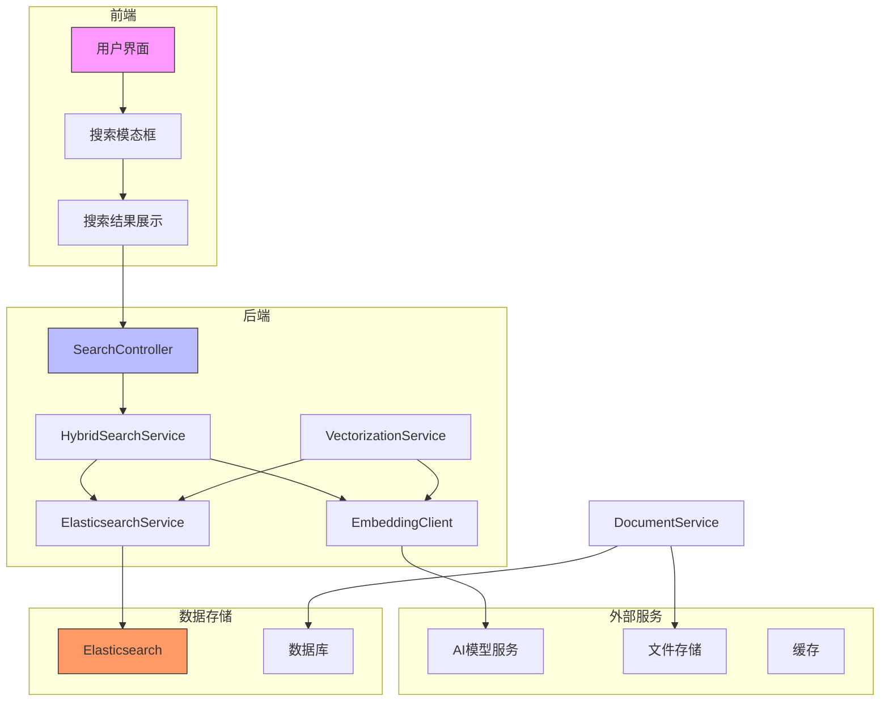
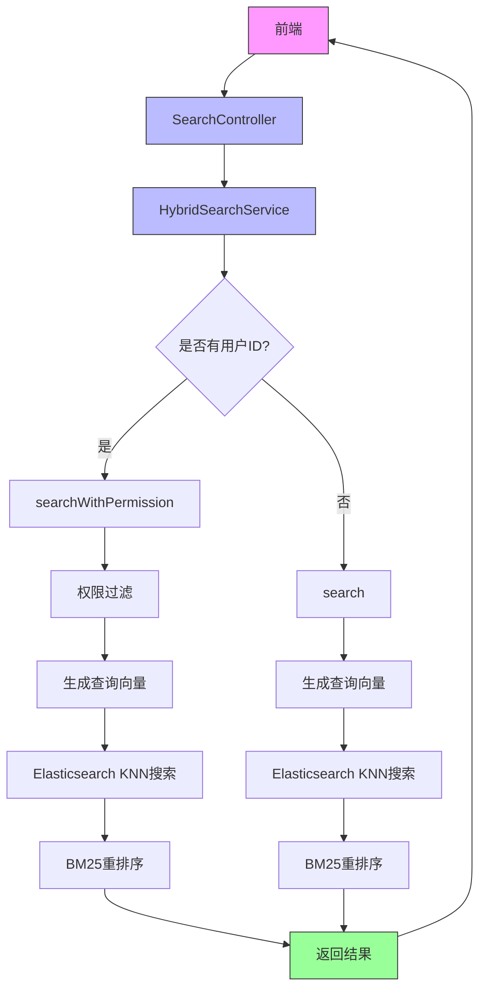
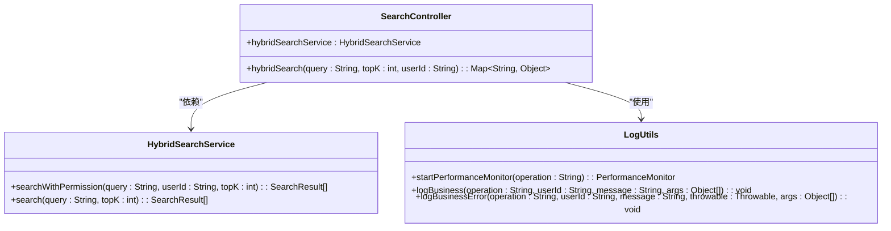
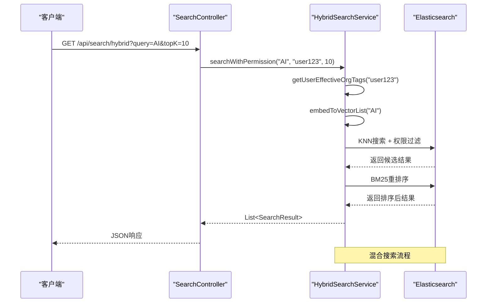
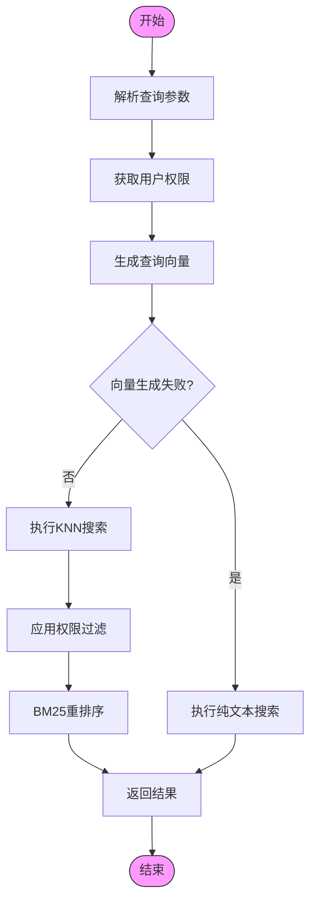
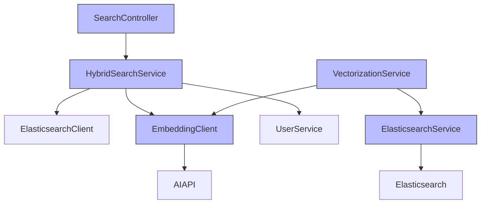

# 搜索服务控制器

<cite>
**本文档引用的文件**   
- [SearchController.java](file://src/main/java/com/yizhaoqi/smartpai/controller/SearchController.java)
- [HybridSearchService.java](file://src/main/java/com/yizhaoqi/smartpai/service/HybridSearchService.java)
- [SearchResult.java](file://src/main/java/com/yizhaoqi/smartpai/entity/SearchResult.java)
- [EsDocument.java](file://src/main/java/com/yizhaoqi/smartpai/entity/EsDocument.java)
- [knowledge_base.json](file://src/main/resources/es-mappings/knowledge_base.json)
- [LogUtils.java](file://src/main/java/com/yizhaoqi/smartpai/utils/LogUtils.java)
- [ElasticsearchService.java](file://src/main/java/com/yizhaoqi/smartpai/service/ElasticsearchService.java)
- [VectorizationService.java](file://src/main/java/com/yizhaoqi/smartpai/service/VectorizationService.java)
- [EmbeddingClient.java](file://src/main/java/com/yizhaoqi/smartpai/client/EmbeddingClient.java)
- [DocumentService.java](file://src/main/java/com/yizhaoqi/smartpai/service/DocumentService.java)
- [ParseController.java](file://src/main/java/com/yizhaoqi/smartpai/controller/ParseController.java)
</cite>

## 目录
1. [简介](#简介)
2. [项目结构](#项目结构)
3. [核心组件](#核心组件)
4. [架构概览](#架构概览)
5. [详细组件分析](#详细组件分析)
6. [依赖分析](#依赖分析)
7. [性能考量](#性能考量)
8. [故障排除指南](#故障排除指南)
9. [结论](#结论)

## 简介
本文档深入解析了知识库搜索API的实现细节，重点分析了`SearchController.java`中的混合搜索功能。该系统实现了关键词与向量的混合搜索机制，结合了Elasticsearch的全文检索能力和向量数据库的语义相似度匹配能力。文档详细说明了搜索请求的处理流程、查询参数解析、结果聚合逻辑以及与Elasticsearch的交互方式。系统支持权限过滤，确保用户只能访问其有权限的文档（个人文档、公开文档或所属组织的文档）。搜索结果通过KNN（K-最近邻）算法进行向量相似度召回，并结合BM25算法进行相关性重排序，最终返回高质量的搜索结果。

## 项目结构
项目采用典型的分层架构，前端使用Vue.js框架，后端基于Spring Boot构建。后端代码主要分为controller、service、entity、repository等包，遵循MVC设计模式。搜索功能的核心实现位于`com.yizhaoqi.smartpai.controller`包下的`SearchController`类，该类通过`HybridSearchService`服务类与Elasticsearch进行交互。文档向量化处理由`VectorizationService`负责，通过调用外部AI模型生成文本向量并存储到Elasticsearch中。整个系统通过RESTful API提供服务，前端通过HTTP请求与后端进行通信。

**图示来源**
- [SearchController.java](file://src/main/java/com/yizhaoqi/smartpai/controller/SearchController.java)
- [HybridSearchService.java](file://src/main/java/com/yizhaoqi/smartpai/service/HybridSearchService.java)
- [ElasticsearchService.java](file://src/main/java/com/yizhaoqi/smartpai/service/ElasticsearchService.java)
- [VectorizationService.java](file://src/main/java/com/yizhaoqi/smartpai/service/VectorizationService.java)
- [EmbeddingClient.java](file://src/main/java/com/yizhaoqi/smartpai/client/EmbeddingClient.java)

**本节来源**
- [SearchController.java](file://src/main/java/com/yizhaoqi/smartpai/controller/SearchController.java)
- [HybridSearchService.java](file://src/main/java/com/yizhaoqi/smartpai/service/HybridSearchService.java)

## 核心组件
核心组件包括`SearchController`、`HybridSearchService`和`ElasticsearchService`。`SearchController`作为API入口，接收前端的搜索请求，解析查询参数，并调用`HybridSearchService`执行实际的搜索逻辑。`HybridSearchService`是混合搜索的核心，它结合了文本匹配和向量相似度两种搜索方式，通过Elasticsearch的KNN功能实现向量搜索，并结合BM25算法进行结果重排序。`ElasticsearchService`封装了与Elasticsearch的交互，提供了批量索引和删除文档的接口。`EmbeddingClient`负责调用外部AI模型服务，将文本转换为向量表示。

**本节来源**
- [SearchController.java](file://src/main/java/com/yizhaoqi/smartpai/controller/SearchController.java#L1-L90)
- [HybridSearchService.java](file://src/main/java/com/yizhaoqi/smartpai/service/HybridSearchService.java#L1-L472)
- [ElasticsearchService.java](file://src/main/java/com/yizhaoqi/smartpai/service/ElasticsearchService.java#L1-L86)

## 架构概览
系统架构采用微服务设计，各组件职责分明。前端通过REST API与后端通信，后端控制器接收请求后，由服务层处理业务逻辑。搜索功能的核心是混合搜索架构，它同时利用了Elasticsearch的全文检索能力和向量搜索能力。当用户发起搜索请求时，系统首先生成查询文本的向量表示，然后在Elasticsearch中执行KNN搜索召回相似文档，同时使用关键词匹配过滤结果。最后通过BM25算法对结果进行重排序，确保返回最相关的结果。整个过程支持权限控制，确保数据安全。

**图示来源**
- [SearchController.java](file://src/main/java/com/yizhaoqi/smartpai/controller/SearchController.java)
- [HybridSearchService.java](file://src/main/java/com/yizhaoqi/smartpai/service/HybridSearchService.java)

## 详细组件分析
### SearchController分析
`SearchController`是搜索API的入口点，提供了`/api/search/hybrid`端点处理混合搜索请求。该控制器使用`@RestController`注解标记，表明它是一个RESTful控制器。它通过`@Autowired`注入`HybridSearchService`服务，将实际的搜索逻辑委托给该服务。控制器方法`hybridSearch`处理GET请求，接收`query`（查询字符串）和`topK`（返回结果数量）参数。方法内部使用`LogUtils`进行性能监控和业务日志记录，确保操作可追溯。

**图示来源**
- [SearchController.java](file://src/main/java/com/yizhaoqi/smartpai/controller/SearchController.java#L1-L90)
- [HybridSearchService.java](file://src/main/java/com/yizhaoqi/smartpai/service/HybridSearchService.java#L1-L472)
- [LogUtils.java](file://src/main/java/com/yizhaoqi/smartpai/utils/LogUtils.java#L1-L193)

**本节来源**
- [SearchController.java](file://src/main/java/com/yizhaoqi/smartpai/controller/SearchController.java#L1-L90)

### HybridSearchService分析
`HybridSearchService`是混合搜索的核心实现，它结合了文本匹配和向量相似度两种搜索方式。服务提供了两个主要方法：`searchWithPermission`和`search`。前者支持权限过滤，确保用户只能访问其有权限的文档；后者为原始搜索方法，保留向后兼容性。服务通过`ElasticsearchClient`与Elasticsearch交互，使用KNN算法进行向量相似度搜索，并结合BM25算法进行结果重排序。

**图示来源**
- [HybridSearchService.java](file://src/main/java/com/yizhaoqi/smartpai/service/HybridSearchService.java#L1-L472)
- [SearchController.java](file://src/main/java/com/yizhaoqi/smartpai/controller/SearchController.java#L1-L90)

**本节来源**
- [HybridSearchService.java](file://src/main/java/com/yizhaoqi/smartpai/service/HybridSearchService.java#L1-L472)

### 搜索流程分析
搜索流程从接收用户查询开始，系统首先解析查询参数，包括查询文本、返回结果数量等。然后根据用户身份获取其有效的组织标签，用于权限过滤。接着调用`EmbeddingClient`生成查询文本的向量表示。在Elasticsearch中执行KNN搜索，召回与查询向量相似的文档，同时使用关键词匹配确保结果的相关性。通过BM25算法对结果进行重排序，最终返回topK个最相关的结果。

**图示来源**
- [HybridSearchService.java](file://src/main/java/com/yizhaoqi/smartpai/service/HybridSearchService.java#L1-L472)

**本节来源**
- [HybridSearchService.java](file://src/main/java/com/yizhaoqi/smartpai/service/HybridSearchService.java#L1-L472)

## 依赖分析
系统各组件之间存在明确的依赖关系。`SearchController`依赖`HybridSearchService`，`HybridSearchService`依赖`ElasticsearchClient`、`EmbeddingClient`和`UserService`等。`VectorizationService`依赖`EmbeddingClient`和`ElasticsearchService`，负责将文档向量化并存储到Elasticsearch中。`EmbeddingClient`依赖外部AI模型服务，通过WebClient调用API生成文本向量。整个系统的依赖关系清晰，各组件职责分明，便于维护和扩展。

**图示来源**
- [SearchController.java](file://src/main/java/com/yizhaoqi/smartpai/controller/SearchController.java)
- [HybridSearchService.java](file://src/main/java/com/yizhaoqi/smartpai/service/HybridSearchService.java)
- [VectorizationService.java](file://src/main/java/com/yizhaoqi/smartpai/service/VectorizationService.java)
- [EmbeddingClient.java](file://src/main/java/com/yizhaoqi/smartpai/client/EmbeddingClient.java)
- [ElasticsearchService.java](file://src/main/java/com/yizhaoqi/smartpai/service/ElasticsearchService.java)

**本节来源**
- [HybridSearchService.java](file://src/main/java/com/yizhaoqi/smartpai/service/HybridSearchService.java#L1-L472)
- [VectorizationService.java](file://src/main/java/com/yizhaoqi/smartpai/service/VectorizationService.java#L1-L101)
- [EmbeddingClient.java](file://src/main/java/com/yizhaoqi/smartpai/client/EmbeddingClient.java#L1-L103)

## 性能考量
系统在性能方面进行了多项优化。首先，使用KNN算法进行向量搜索时，设置了较大的召回窗口（recallK = topK * 30），确保足够的候选结果。然后通过BM25算法进行重排序，提高结果的相关性。日志系统使用`LogUtils`进行性能监控，记录每个操作的耗时，便于性能分析和优化。向量生成采用批量处理方式，减少API调用次数。Elasticsearch的批量索引操作提高了数据写入效率。系统还实现了异常处理和后备机制，当向量搜索失败时自动降级为纯文本搜索，确保服务的可用性。

**本节来源**
- [HybridSearchService.java](file://src/main/java/com/yizhaoqi/smartpai/service/HybridSearchService.java#L1-L472)
- [LogUtils.java](file://src/main/java/com/yizhaoqi/smartpai/utils/LogUtils.java#L1-L193)
- [ElasticsearchService.java](file://src/main/java/com/yizhaoqi/smartpai/service/ElasticsearchService.java#L1-L86)

## 故障排除指南
当搜索功能出现问题时，可以按照以下步骤进行排查：首先检查日志系统，查看`com.yizhaoqi.smartpai.business`和`com.yizhaoqi.smartpai.performance`日志记录器的输出，定位问题发生的位置。如果向量搜索失败，检查`EmbeddingClient`的配置和外部AI模型服务的可用性。如果Elasticsearch查询失败，检查索引状态和查询DSL的正确性。对于权限相关问题，验证用户的有效组织标签是否正确获取。系统提供了详细的错误日志，包括异常堆栈信息，有助于快速定位和解决问题。

**本节来源**
- [LogUtils.java](file://src/main/java/com/yizhaoqi/smartpai/utils/LogUtils.java#L1-L193)
- [HybridSearchService.java](file://src/main/java/com/yizhaoqi/smartpai/service/HybridSearchService.java#L1-L472)
- [SearchController.java](file://src/main/java/com/yizhaoqi/smartpai/controller/SearchController.java#L1-L90)

## 结论
本文档详细分析了知识库搜索API的实现，涵盖了从请求处理到结果返回的完整流程。系统通过混合搜索机制，结合了关键词匹配和向量相似度两种搜索方式，提供了高质量的搜索结果。权限过滤机制确保了数据安全，日志系统提供了完善的监控和追踪能力。系统的模块化设计和清晰的依赖关系使其易于维护和扩展。通过性能优化和异常处理机制，系统具有良好的稳定性和可用性。未来可以考虑引入更多AI能力，如查询理解、结果摘要生成等，进一步提升用户体验。