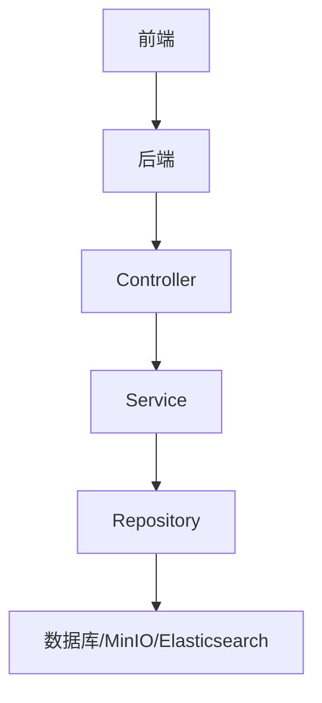
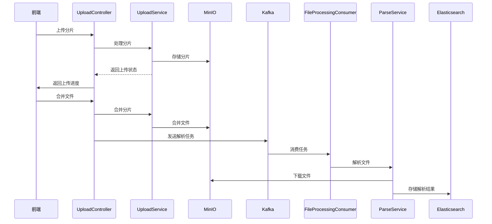
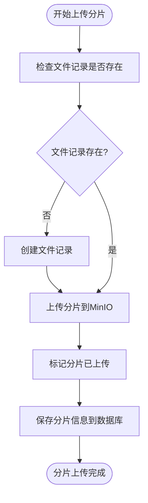
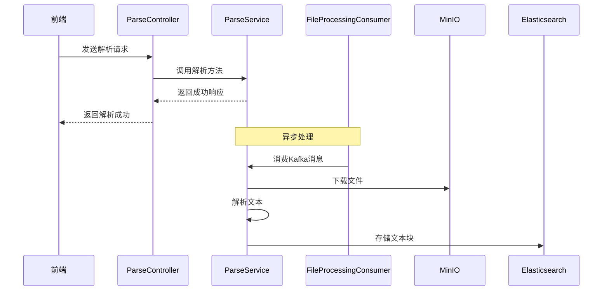
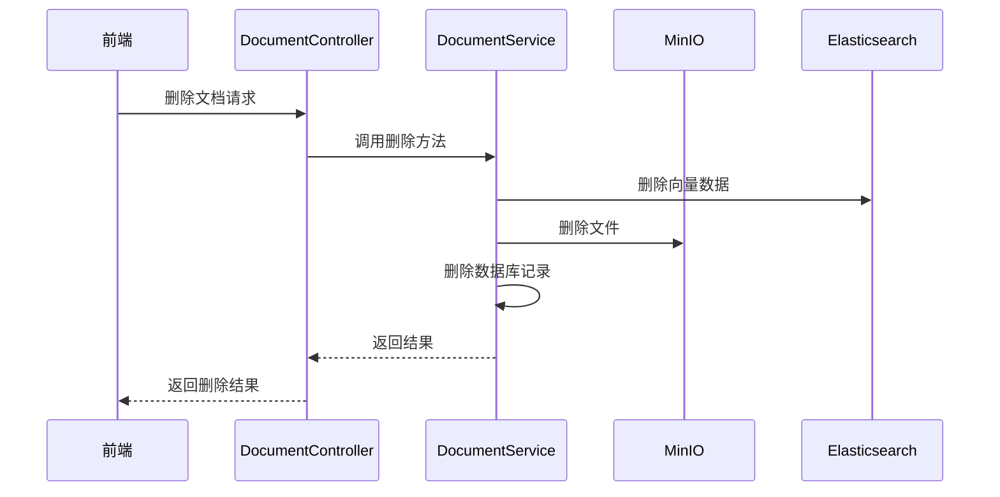
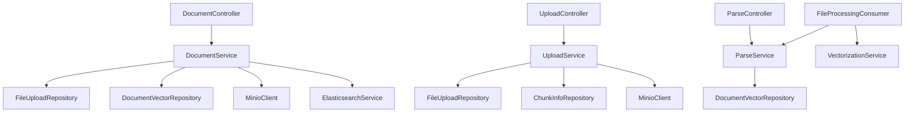

# 文档管理控制器

<cite>
**本文档引用的文件**   
- [DocumentController.java](file://src/main/java/com/yizhaoqi/smartpai/controller/DocumentController.java)
- [UploadController.java](file://src/main/java/com/yizhaoqi/smartpai/controller/UploadController.java)
- [ParseController.java](file://src/main/java/com/yizhaoqi/smartpai/controller/ParseController.java)
- [DocumentService.java](file://src/main/java/com/yizhaoqi/smartpai/service/DocumentService.java)
- [UploadService.java](file://src/main/java/com/yizhaoqi/smartpai/service/UploadService.java)
- [ParseService.java](file://src/main/java/com/yizhaoqi/smartpai/service/ParseService.java)
- [FileProcessingConsumer.java](file://src/main/java/com/yizhaoqi/smartpai/consumer/FileProcessingConsumer.java)
- [FileUpload.java](file://src/main/java/com/yizhaoqi/smartpai/model/FileUpload.java)
- [ChunkInfo.java](file://src/main/java/com/yizhaoqi/smartpai/model/ChunkInfo.java)
- [DocumentVector.java](file://src/main/java/com/yizhaoqi/smartpai/model/DocumentVector.java)
- [FileProcessingTask.java](file://src/main/java/com/yizhaoqi/smartpai/model/FileProcessingTask.java)
- [MinioConfig.java](file://src/main/java/com/yizhaoqi/smartpai/config/MinioConfig.java)
- [KafkaConfig.java](file://src/main/java/com/yizhaoqi/smartpai/config/KafkaConfig.java)
- [application.yml](file://src/main/resources/application.yml)
- [knowledge_base.json](file://src/main/resources/es-mappings/knowledge_base.json)
</cite>

## 目录
1. [简介](#简介)
2. [项目结构](#项目结构)
3. [核心组件](#核心组件)
4. [架构概述](#架构概述)
5. [详细组件分析](#详细组件分析)
6. [依赖分析](#依赖分析)
7. [性能考虑](#性能考虑)
8. [故障排除指南](#故障排除指南)
9. [结论](#结论)

## 简介
本文档系统化地分析了 `DocumentController`、`UploadController` 和 `ParseController` 中关于文档全生命周期管理的 API 设计。涵盖了文档上传、解析、状态查询、删除等操作，详细说明了文件流处理、`MultipartFile` 参数绑定及异步任务触发机制。文档还描述了与 MinIO 文件存储系统的集成方式，包括预签名 URL 生成、分片上传支持等特性，以及文档解析请求如何通过 Kafka 消息队列异步处理并反馈处理进度给前端。此外，文档化了文档元数据的存储结构、索引状态同步及错误处理流程，并提供了大文件上传的最佳实践。

## 项目结构
项目采用典型的分层架构，前端位于 `frontend` 目录，后端位于 `src/main/java` 目录。后端代码遵循 MVC 模式，`controller` 包含 API 控制器，`service` 包含业务逻辑，`model` 包含数据实体，`repository` 包含数据访问接口。配置文件位于 `src/main/resources` 目录。

**图源**
- [DocumentController.java](file://src/main/java/com/yizhaoqi/smartpai/controller/DocumentController.java)
- [UploadController.java](file://src/main/java/com/yizhaoqi/smartpai/controller/UploadController.java)
- [ParseController.java](file://src/main/java/com/yizhaoqi/smartpai/controller/ParseController.java)

## 核心组件
核心组件包括 `DocumentController`、`UploadController` 和 `ParseController`，分别负责文档管理、文件上传和文档解析。这些控制器通过调用相应的服务类来处理业务逻辑，并与 MinIO、Kafka 和 Elasticsearch 等外部系统集成。

**章节来源**
- [DocumentController.java](file://src/main/java/com/yizhaoqi/smartpai/controller/DocumentController.java)
- [UploadController.java](file://src/main/java/com/yizhaoqi/smartpai/controller/UploadController.java)
- [ParseController.java](file://src/main/java/com/yizhaoqi/smartpai/controller/ParseController.java)

## 架构概述
系统采用微服务架构，通过 RESTful API 提供服务。文件上传通过 `UploadController` 处理，支持分片上传和断点续传。上传完成后，通过 Kafka 消息队列异步触发文档解析任务。解析后的文本块存储在 Elasticsearch 中，支持全文搜索和向量化检索。

**图源**
- [UploadController.java](file://src/main/java/com/yizhaoqi/smartpai/controller/UploadController.java)
- [UploadService.java](file://src/main/java/com/yizhaoqi/smartpai/service/UploadService.java)
- [FileProcessingConsumer.java](file://src/main/java/com/yizhaoqi/smartpai/consumer/FileProcessingConsumer.java)
- [ParseService.java](file://src/main/java/com/yizhaoqi/smartpai/service/ParseService.java)

## 详细组件分析

### 文档上传分析
`UploadController` 提供了分片上传接口，支持大文件上传和断点续传。上传过程中，分片信息存储在 Redis 和数据库中，确保上传状态的持久化。

#### 分片上传流程

**图源**
- [UploadController.java](file://src/main/java/com/yizhaoqi/smartpai/controller/UploadController.java)
- [UploadService.java](file://src/main/java/com/yizhaoqi/smartpai/service/UploadService.java)

**章节来源**
- [UploadController.java](file://src/main/java/com/yizhaoqi/smartpai/controller/UploadController.java)
- [UploadService.java](file://src/main/java/com/yizhaoqi/smartpai/service/UploadService.java)

### 文档解析分析
`ParseController` 接收文件并触发解析流程。解析任务通过 Kafka 异步处理，确保系统响应性。

#### 解析流程

**图源**
- [ParseController.java](file://src/main/java/com/yizhaoqi/smartpai/controller/ParseController.java)
- [ParseService.java](file://src/main/java/com/yizhaoqi/smartpai/service/ParseService.java)
- [FileProcessingConsumer.java](file://src/main/java/com/yizhaoqi/smartpai/consumer/FileProcessingConsumer.java)

**章节来源**
- [ParseController.java](file://src/main/java/com/yizhaoqi/smartpai/controller/ParseController.java)
- [ParseService.java](file://src/main/java/com/yizhaoqi/smartpai/service/ParseService.java)

### 文档管理分析
`DocumentController` 提供了文档的增删改查接口，支持权限控制和文件预览。

#### 文档删除流程

**图源**
- [DocumentController.java](file://src/main/java/com/yizhaoqi/smartpai/controller/DocumentController.java)
- [DocumentService.java](file://src/main/java/com/yizhaoqi/smartpai/service/DocumentService.java)

**章节来源**
- [DocumentController.java](file://src/main/java/com/yizhaoqi/smartpai/controller/DocumentController.java)
- [DocumentService.java](file://src/main/java/com/yizhaoqi/smartpai/service/DocumentService.java)

## 依赖分析
系统依赖于多个外部服务，包括 MinIO 用于文件存储，Kafka 用于消息队列，Elasticsearch 用于全文搜索。这些依赖通过 Spring Boot 的自动配置和依赖注入机制集成。

**图源**
- [DocumentController.java](file://src/main/java/com/yizhaoqi/smartpai/controller/DocumentController.java)
- [UploadController.java](file://src/main/java/com/yizhaoqi/smartpai/controller/UploadController.java)
- [ParseController.java](file://src/main/java/com/yizhaoqi/smartpai/controller/ParseController.java)
- [DocumentService.java](file://src/main/java/com/yizhaoqi/smartpai/service/DocumentService.java)
- [UploadService.java](file://src/main/java/com/yizhaoqi/smartpai/service/UploadService.java)
- [ParseService.java](file://src/main/java/com/yizhaoqi/smartpai/service/ParseService.java)

**章节来源**
- [DocumentController.java](file://src/main/java/com/yizhaoqi/smartpai/controller/DocumentController.java)
- [UploadController.java](file://src/main/java/com/yizhaoqi/smartpai/controller/UploadController.java)
- [ParseController.java](file://src/main/java/com/yizhaoqi/smartpai/controller/ParseController.java)

## 性能考虑
系统在处理大文件时，采用分片上传和流式处理，避免内存溢出。解析过程中，通过内存使用率监控和垃圾回收，确保系统稳定性。Kafka 消息队列的使用，使得耗时的解析任务异步执行，提高系统响应性。

## 故障排除指南
- **文件上传失败**：检查 MinIO 服务是否正常运行，网络连接是否稳定。
- **解析任务未执行**：检查 Kafka 服务是否正常，消费者组是否正确配置。
- **文件无法预览**：检查 Elasticsearch 索引是否正确创建，文档是否已成功解析。

**章节来源**
- [DocumentController.java](file://src/main/java/com/yizhaoqi/smartpai/controller/DocumentController.java)
- [UploadController.java](file://src/main/java/com/yizhaoqi/smartpai/controller/UploadController.java)
- [ParseController.java](file://src/main/java/com/yizhaoqi/smartpai/controller/ParseController.java)

## 结论
本文档详细分析了文档管理系统的 API 设计和实现，涵盖了从文件上传到解析的完整生命周期。系统通过分层架构和异步处理，确保了高可用性和可扩展性。未来可进一步优化分片合并策略，提高大文件处理效率。