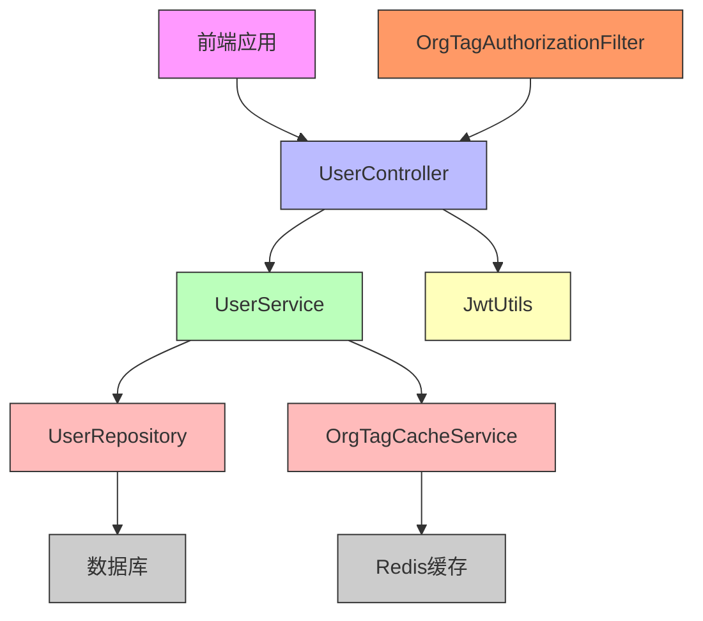
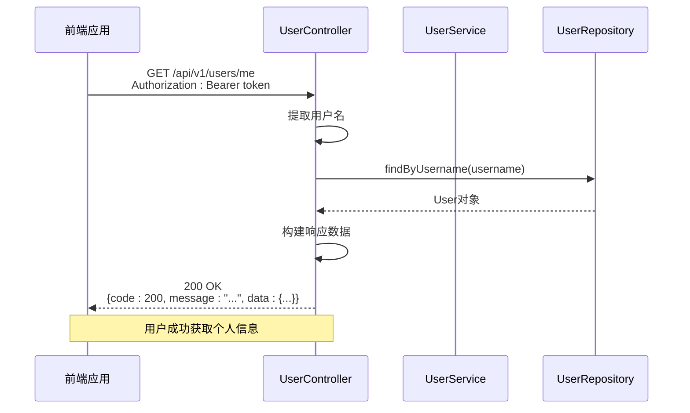
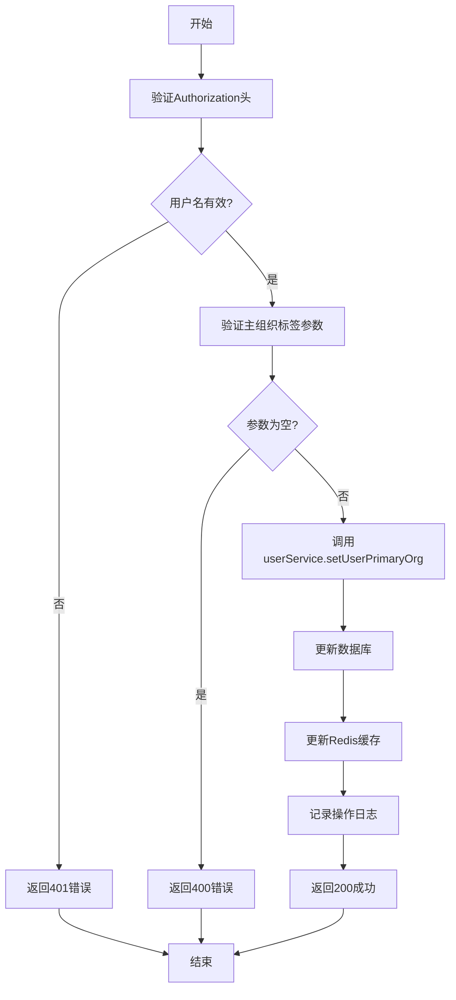
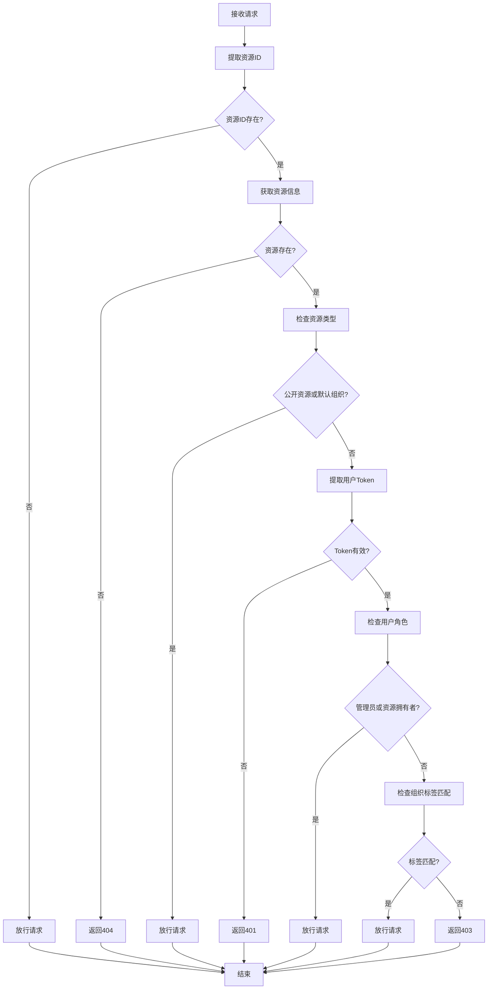

# 用户管理控制器

<cite>
**本文档引用的文件**   
- [UserController.java](file://src/main/java/com/yizhaoqi/smartpai/controller/UserController.java)
- [User.java](file://src/main/java/com/yizhaoqi/smartpai/model/User.java)
- [UserService.java](file://src/main/java/com/yizhaoqi/smartpai/service/UserService.java)
- [OrgTagAuthorizationFilter.java](file://src/main/java/com/yizhaoqi/smartpai/config/OrgTagAuthorizationFilter.java)
- [personal-center/index.vue](file://frontend/src/views/personal-center/index.vue)
- [org-tag-setting-dialog.vue](file://frontend/src/views/user/modules/org-tag-setting-dialog.vue)
</cite>

## 目录
1. [简介](#简介)
2. [项目结构](#项目结构)
3. [核心组件](#核心组件)
4. [架构概述](#架构概述)
5. [详细组件分析](#详细组件分析)
6. [依赖分析](#依赖分析)
7. [性能考虑](#性能考虑)
8. [故障排除指南](#故障排除指南)
9. [结论](#结论)

## 简介
本文档深入分析了用户管理控制器（UserController）的设计与实现，涵盖用户信息查询、组织标签设置、用户状态管理等功能。文档阐述了各接口的RESTful设计原则、路径参数使用及分页支持机制，说明了与OrgTagAuthorizationFilter的集成方式，确保多租户环境下的数据隔离与权限控制。同时，文档化了用户数据的输入验证规则、字段约束及响应格式标准化实践，并结合实际调用场景，展示了用户信息更新请求的处理流程。最后，提供了常见问题排查指南，如权限不足、数据不一致等场景的解决方案。

## 项目结构
用户管理功能分布在前后端多个模块中，后端主要位于`src/main/java/com/yizhaoqi/smartpai/controller`和`src/main/java/com/yizhaoqi/smartpai/service`目录下，前端位于`frontend/src/views`目录下。

```mermaid
graph TD
subgraph "前端"
A[personal-center/index.vue]
B[org-tag-setting-dialog.vue]
end
subgraph "后端"
C[UserController.java]
D[UserService.java]
E[User.java]
F[OrgTagAuthorizationFilter.java]
end
A --> C : "调用API"
B --> C : "调用API"
C --> D : "业务逻辑"
D --> E : "数据模型"
C --> F : "权限过滤"
```

**图示来源**
- [UserController.java](file://src/main/java/com/yizhaoqi/smartpai/controller/UserController.java)
- [UserService.java](file://src/main/java/com/yizhaoqi/smartpai/service/UserService.java)
- [User.java](file://src/main/java/com/yizhaoqi/smartpai/model/User.java)
- [OrgTagAuthorizationFilter.java](file://src/main/java/com/yizhaoqi/smartpai/config/OrgTagAuthorizationFilter.java)
- [personal-center/index.vue](file://frontend/src/views/personal-center/index.vue)
- [org-tag-setting-dialog.vue](file://frontend/src/views/user/modules/org-tag-setting-dialog.vue)

## 核心组件
用户管理控制器（UserController）是系统用户管理功能的核心，提供了用户注册、登录、信息查询、组织标签设置等RESTful API接口。该控制器通过依赖注入方式使用UserService、JwtUtils和UserRepository等服务，实现了完整的用户生命周期管理功能。

**组件来源**
- [UserController.java](file://src/main/java/com/yizhaoqi/smartpai/controller/UserController.java#L19-L325)

## 架构概述
用户管理系统的架构采用典型的分层设计模式，包括控制器层、服务层、数据访问层和安全过滤层。控制器层负责接收HTTP请求并返回响应，服务层封装业务逻辑，数据访问层处理数据库操作，安全过滤层确保多租户环境下的数据隔离与权限控制。



**图示来源**
- [UserController.java](file://src/main/java/com/yizhaoqi/smartpai/controller/UserController.java)
- [UserService.java](file://src/main/java/com/yizhaoqi/smartpai/service/UserService.java)
- [UserRepository.java](file://src/main/java/com/yizhaoqi/smartpai/repository/UserRepository.java)
- [OrgTagCacheService.java](file://src/main/java/com/yizhaoqi/smartpai/service/OrgTagCacheService.java)
- [JwtUtils.java](file://src/main/java/com/yizhaoqi/smartpai/utils/JwtUtils.java)
- [OrgTagAuthorizationFilter.java](file://src/main/java/com/yizhaoqi/smartpai/config/OrgTagAuthorizationFilter.java)

## 详细组件分析
### 用户信息查询接口分析
用户信息查询接口（/me）实现了获取当前用户信息的功能，遵循RESTful设计原则，使用GET方法和Authorization头进行身份验证。

#### 接口调用流程


**图示来源**
- [UserController.java](file://src/main/java/com/yizhaoqi/smartpai/controller/UserController.java#L100-L145)

**组件来源**
- [UserController.java](file://src/main/java/com/yizhaoqi/smartpai/controller/UserController.java#L100-L145)
- [User.java](file://src/main/java/com/yizhaoqi/smartpai/model/User.java#L9-L42)

### 组织标签设置接口分析
组织标签设置接口（/primary-org）实现了用户设置主组织标签的功能，确保了多租户环境下的数据隔离。

#### 接口实现逻辑


**图示来源**
- [UserController.java](file://src/main/java/com/yizhaoqi/smartpai/controller/UserController.java#L170-L205)
- [UserService.java](file://src/main/java/com/yizhaoqi/smartpai/service/UserService.java#L403-L428)

**组件来源**
- [UserController.java](file://src/main/java/com/yizhaoqi/smartpai/controller/UserController.java#L170-L205)
- [UserService.java](file://src/main/java/com/yizhaoqi/smartpai/service/UserService.java#L403-L428)

### 多租户权限控制分析
OrgTagAuthorizationFilter实现了多租户环境下的数据隔离与权限控制，确保用户只能访问自己有权限的资源。

#### 权限控制流程


**图示来源**
- [OrgTagAuthorizationFilter.java](file://src/main/java/com/yizhaoqi/smartpai/config/OrgTagAuthorizationFilter.java#L37-L337)

**组件来源**
- [OrgTagAuthorizationFilter.java](file://src/main/java/com/yizhaoqi/smartpai/config/OrgTagAuthorizationFilter.java#L37-L337)

## 依赖分析
用户管理功能涉及多个组件之间的依赖关系，形成了完整的调用链。

```mermaid
graph TD
UserController --> UserService
UserController --> JwtUtils
UserController --> UserRepository
UserService --> UserRepository
UserService --> OrganizationTagRepository
UserService --> OrgTagCacheService
OrgTagAuthorizationFilter --> JwtUtils
OrgTagAuthorizationFilter --> FileUploadRepository
class UserController,UserService,JwtUtils,UserRepository,OrganizationTagRepository,OrgTagCacheService,FileUploadRepository:::class
classDef class fill:#f9f,stroke:#333;
```

**图示来源**
- [UserController.java](file://src/main/java/com/yizhaoqi/smartpai/controller/UserController.java)
- [UserService.java](file://src/main/java/com/yizhaoqi/smartpai/service/UserService.java)
- [OrgTagAuthorizationFilter.java](file://src/main/java/com/yizhaoqi/smartpai/config/OrgTagAuthorizationFilter.java)

## 性能考虑
用户管理功能在性能方面进行了多项优化：
1. 使用Redis缓存用户组织标签信息，减少数据库查询次数
2. 在UserService中实现缓存机制，提高频繁访问数据的获取速度
3. 使用分页查询避免一次性加载大量数据
4. 在OrgTagAuthorizationFilter中优化资源ID提取逻辑，减少正则表达式匹配开销

## 故障排除指南
### 权限不足问题
当用户遇到权限不足（403错误）时，可能的原因包括：
- 用户的组织标签与资源的组织标签不匹配
- 用户尝试访问私人组织标签资源但不是资源拥有者
- JWT Token中的组织标签信息过期

**解决方案**：
1. 检查用户当前的组织标签设置
2. 确认用户是否被正确分配了相关组织标签
3. 重新登录以刷新Token信息

### 数据不一致问题
当出现用户信息与数据库记录不一致时，可能的原因包括：
- Redis缓存未及时更新
- 数据库事务处理失败
- 并发更新导致的数据覆盖

**解决方案**：
1. 检查缓存更新逻辑是否正确执行
2. 查看日志中的数据库操作记录
3. 实现适当的锁机制防止并发问题

**组件来源**
- [UserService.java](file://src/main/java/com/yizhaoqi/smartpai/service/UserService.java#L403-L428)
- [OrgTagCacheService.java](file://src/main/java/com/yizhaoqi/smartpai/service/OrgTagCacheService.java)

## 结论
用户管理控制器实现了完整的用户生命周期管理功能，通过RESTful API设计提供了用户注册、登录、信息查询和组织标签设置等核心功能。系统通过OrgTagAuthorizationFilter实现了多租户环境下的数据隔离与权限控制，确保了系统的安全性。同时，通过Redis缓存机制优化了性能，提高了系统的响应速度。整体设计合理，代码结构清晰，具有良好的可维护性和扩展性。