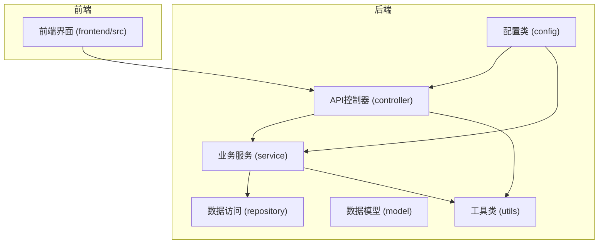
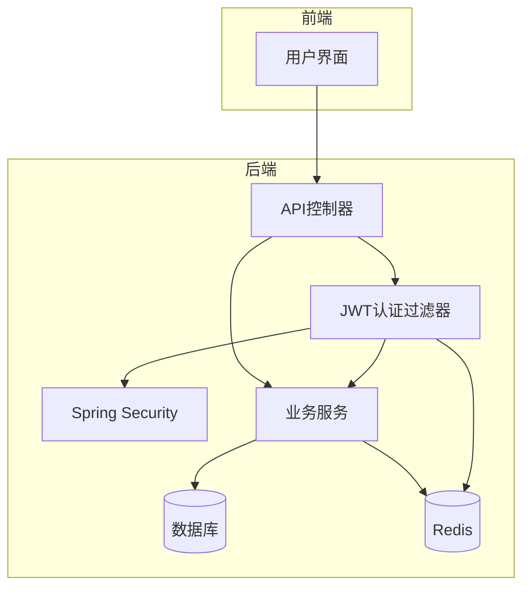
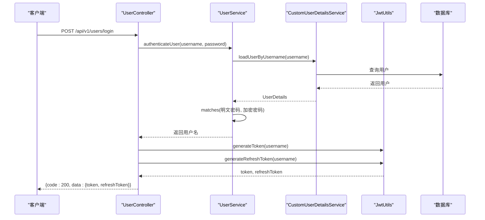
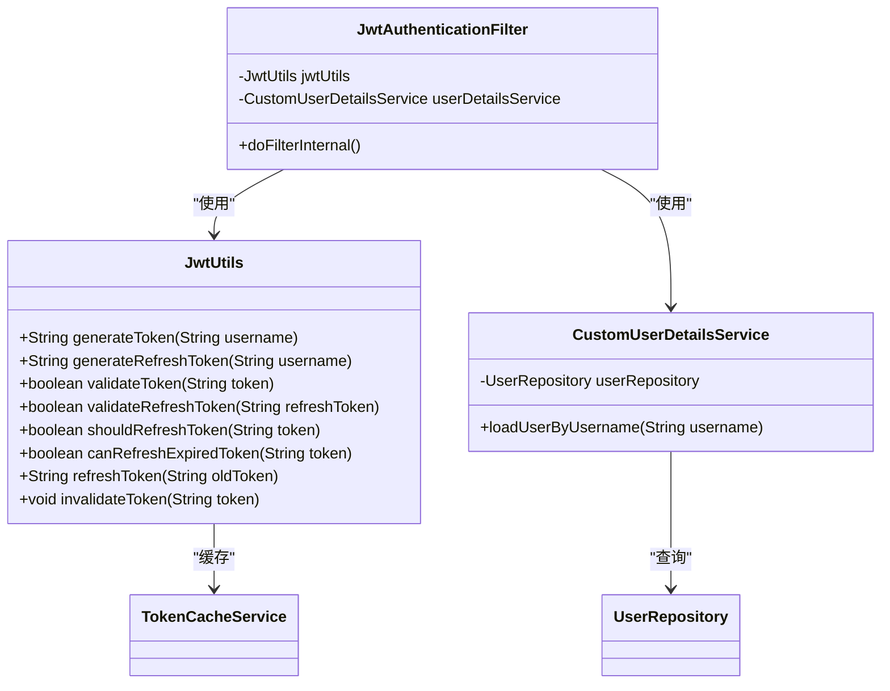
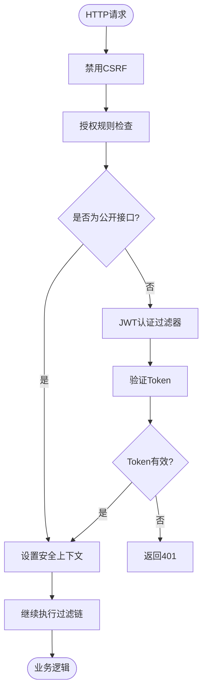
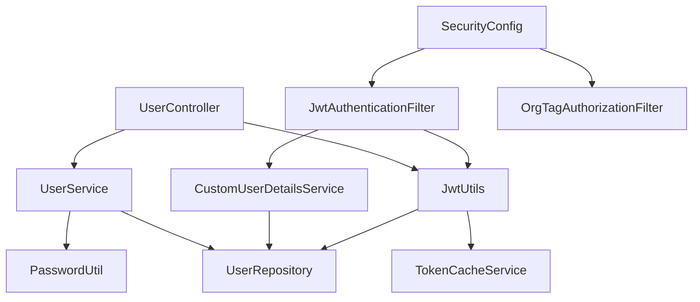

# 用户认证控制器

<cite>
**本文档中引用的文件**   
- [AuthController.java](file://src/main/java/com/yizhaoqi/smartpai/controller/AuthController.java)
- [UserController.java](file://src/main/java/com/yizhaoqi/smartpai/controller/UserController.java)
- [JwtUtils.java](file://src/main/java/com/yizhaoqi/smartpai/utils/JwtUtils.java)
- [JwtAuthenticationFilter.java](file://src/main/java/com/yizhaoqi/smartpai/config/JwtAuthenticationFilter.java)
- [SecurityConfig.java](file://src/main/java/com/yizhaoqi/smartpai/config/SecurityConfig.java)
- [CustomUserDetailsService.java](file://src/main/java/com/yizhaoqi/smartpai/service/CustomUserDetailsService.java)
- [PasswordUtil.java](file://src/main/java/com/yizhaoqi/smartpai/utils/PasswordUtil.java)
- [LogUtils.java](file://src/main/java/com/yizhaoqi/smartpai/utils/LogUtils.java)
</cite>

## 目录
1. [简介](#简介)
2. [项目结构](#项目结构)
3. [核心组件](#核心组件)
4. [架构概览](#架构概览)
5. [详细组件分析](#详细组件分析)
6. [依赖分析](#依赖分析)
7. [性能考量](#性能考量)
8. [故障排除指南](#故障排除指南)
9. [结论](#结论)

## 简介
本文档详细解析了PaiSmart项目中用户认证系统的设计与实现。系统基于Spring Security框架，采用JWT（JSON Web Token）进行无状态认证，实现了登录、注册、登出、Token刷新等核心功能。文档深入分析了认证流程、权限控制、安全机制和异常处理策略，为开发者提供了全面的技术参考和最佳实践建议。

## 项目结构
用户认证功能分布在后端Java服务和前端代码中。后端认证逻辑主要位于`src/main/java/com/yizhaoqi/smartpai/controller`包下的`AuthController.java`和`UserController.java`文件中。核心的认证服务、JWT工具类和安全配置分别位于`service`、`utils`和`config`包中。前端代码在`frontend/src`目录下，通过API调用与后端交互。

**图示来源**
- [AuthController.java](file://src/main/java/com/yizhaoqi/smartpai/controller/AuthController.java)
- [UserController.java](file://src/main/java/com/yizhaoqi/smartpai/controller/UserController.java)
- [JwtUtils.java](file://src/main/java/com/yizhaoqi/smartpai/utils/JwtUtils.java)

## 核心组件
用户认证系统的核心组件包括：
- **AuthController.java**: 提供刷新Token等认证相关接口。
- **UserController.java**: 实现用户注册、登录、登出及用户信息管理的核心API。
- **JwtUtils.java**: 负责JWT令牌的生成、校验、刷新和缓存管理。
- **JwtAuthenticationFilter.java**: Spring Security过滤器，负责在每次请求时解析和验证JWT。
- **SecurityConfig.java**: 配置Spring Security的安全规则和过滤器链。
- **CustomUserDetailsService.java**: 实现Spring Security的`UserDetailsService`接口，从数据库加载用户信息。
- **PasswordUtil.java**: 使用BCrypt算法对用户密码进行加密和验证。

**组件来源**
- [AuthController.java](file://src/main/java/com/yizhaoqi/smartpai/controller/AuthController.java#L1-L85)
- [UserController.java](file://src/main/java/com/yizhaoqi/smartpai/controller/UserController.java#L1-L332)
- [JwtUtils.java](file://src/main/java/com/yizhaoqi/smartpai/utils/JwtUtils.java#L1-L433)

## 架构概览
系统采用分层架构，前端通过HTTP请求与后端API交互。后端使用Spring Security进行安全控制，通过JWT实现无状态认证。用户凭证（用户名/密码）在登录时进行验证，成功后生成包含用户信息的JWT和Refresh Token。后续请求通过`JwtAuthenticationFilter`在请求头中提取并验证JWT，将用户信息注入Spring Security上下文，实现权限控制。

**图示来源**
- [SecurityConfig.java](file://src/main/java/com/yizhaoqi/smartpai/config/SecurityConfig.java#L1-L89)
- [JwtAuthenticationFilter.java](file://src/main/java/com/yizhaoqi/smartpai/config/JwtAuthenticationFilter.java#L1-L98)

## 详细组件分析

### 用户认证API分析
`UserController.java`是用户认证的核心，提供了注册、登录、登出等关键接口。

#### 注册接口
- **HTTP方法**: `POST`
- **请求路径**: `/api/v1/users/register`
- **参数绑定**: 使用`@RequestBody`绑定`UserRequest`记录类，接收`username`和`password`。
- **处理流程**:
  1. 验证请求参数是否为空。
  2. 调用`UserService.registerUser()`进行注册。
  3. 使用`PasswordUtil.encode()`对密码进行BCrypt加密后存入数据库。
- **响应结构**: 成功返回`200`状态码和成功消息；失败返回`400`（参数错误）或`500`（服务器错误）。

#### 登录接口
- **HTTP方法**: `POST`
- **请求路径**: `/api/v1/users/login`
- **参数绑定**: 使用`@RequestBody`绑定`UserRequest`，接收`username`和`password`。
- **处理流程**:
  1. 验证请求参数。
  2. 调用`UserService.authenticateUser()`进行认证。
  3. 在`CustomUserDetailsService.loadUserByUsername()`中从数据库加载用户信息。
  4. 使用`PasswordUtil.matches()`验证密码。
  5. 认证成功后，调用`JwtUtils.generateToken()`和`generateRefreshToken()`生成令牌。
- **响应结构**: 成功返回`200`和包含`token`、`refreshToken`的`data`对象；失败返回`401`（凭证无效）。

**图示来源**
- [UserController.java](file://src/main/java/com/yizhaoqi/smartpai/controller/UserController.java#L100-L140)
- [CustomUserDetailsService.java](file://src/main/java/com/yizhaoqi/smartpai/service/CustomUserDetailsService.java#L1-L48)
- [PasswordUtil.java](file://src/main/java/com/yizhaoqi/smartpai/utils/PasswordUtil.java#L1-L28)

### JWT令牌机制分析
`JwtUtils.java`是JWT功能的核心，实现了令牌的全生命周期管理。

#### 令牌生成与校验
- **生成**: `generateToken()`方法创建JWT，包含`tokenId`、`role`、`userId`等声明，并将`tokenId`和过期时间缓存到Redis。
- **校验**: `validateToken()`方法首先检查`tokenId`是否在Redis缓存中有效（双重验证），然后验证JWT签名和过期时间。
- **刷新机制**: 系统实现了智能刷新：
  - **主动刷新**: 当Token剩余有效期小于5分钟时，自动刷新。
  - **宽限期刷新**: Token过期后10分钟内仍可刷新。
  - 新Token通过响应头`New-Token`返回给前端。

#### Refresh Token
- **生成**: `generateRefreshToken()`创建长期有效的刷新令牌（7天），并缓存其`refreshTokenId`。
- **校验**: `validateRefreshToken()`同样使用Redis缓存进行双重验证，并检查令牌类型。

**图示来源**
- [JwtUtils.java](file://src/main/java/com/yizhaoqi/smartpai/utils/JwtUtils.java#L1-L433)
- [JwtAuthenticationFilter.java](file://src/main/java/com/yizhaoqi/smartpai/config/JwtAuthenticationFilter.java#L1-L98)

### Spring Security集成分析
`SecurityConfig.java`配置了整个应用的安全策略。

#### 安全规则
- **公开接口**: `/api/v1/users/register`、`/api/v1/users/login`等注册登录接口允许匿名访问。
- **角色权限**: 使用`hasRole('ADMIN')`和`hasAnyRole('USER', 'ADMIN')`进行细粒度权限控制。
- **会话管理**: 配置为`STATELESS`，不创建HTTP会话，完全依赖JWT。

#### 过滤器链
- **JWT认证过滤器**: 在`UsernamePasswordAuthenticationFilter`之前执行，负责解析和验证JWT。
- **组织标签授权过滤器**: 在JWT过滤器之后执行，进行更细粒度的业务授权。

**图示来源**
- [SecurityConfig.java](file://src/main/java/com/yizhaoqi/smartpai/config/SecurityConfig.java#L1-L89)

## 依赖分析
认证系统各组件间存在紧密的依赖关系。`UserController`依赖`JwtUtils`和`UserService`；`JwtUtils`依赖`UserRepository`和`TokenCacheService`来获取用户信息和管理令牌缓存；`JwtAuthenticationFilter`依赖`JwtUtils`和`CustomUserDetailsService`。这种设计遵循了依赖倒置原则，通过接口和依赖注入实现了解耦。

**图示来源**
- [UserController.java](file://src/main/java/com/yizhaoqi/smartpai/controller/UserController.java)
- [JwtUtils.java](file://src/main/java/com/yizhaoqi/smartpai/utils/JwtUtils.java)
- [SecurityConfig.java](file://src/main/java/com/yizhaoqi/smartpai/config/SecurityConfig.java)

## 性能考量
系统在性能方面进行了多项优化：
- **Redis缓存**: 将Token状态缓存在Redis中，避免了每次请求都解析JWT签名，显著提升了验证速度。
- **性能监控**: 使用`LogUtils.PerformanceMonitor`对关键操作（如登录、注册）进行耗时监控。
- **异步处理**: 虽然当前代码未体现，但日志记录等操作建议异步化以减少对主流程的影响。

## 故障排除指南
常见问题及解决方案：
- **登录失败 (401)**: 检查用户名或密码是否正确，确认`PasswordUtil.matches()`方法正确工作。
- **Token无效**: 检查JWT密钥`jwt.secret-key`是否正确，确认Redis服务正常运行。
- **权限不足 (403)**: 检查`SecurityConfig`中的权限规则是否配置正确。
- **性能瓶颈**: 监控`validateToken`方法的耗时，确保Redis缓存命中率高。

**组件来源**
- [LogUtils.java](file://src/main/java/com/yizhaoqi/smartpai/utils/LogUtils.java#L1-L193)
- [JwtUtils.java](file://src/main/java/com/yizhaoqi/smartpai/utils/JwtUtils.java#L1-L433)

## 结论
PaiSmart项目的用户认证系统设计合理，功能完整。它基于Spring Security和JWT构建了一个安全、高效的无状态认证体系。系统通过BCrypt加密保障密码安全，利用Redis缓存提升性能，并实现了智能的Token刷新机制。代码结构清晰，职责分离明确，为后续功能扩展和维护提供了良好的基础。建议未来可以增加更多安全措施，如登录失败次数限制、IP白名单等，以进一步提升系统安全性。