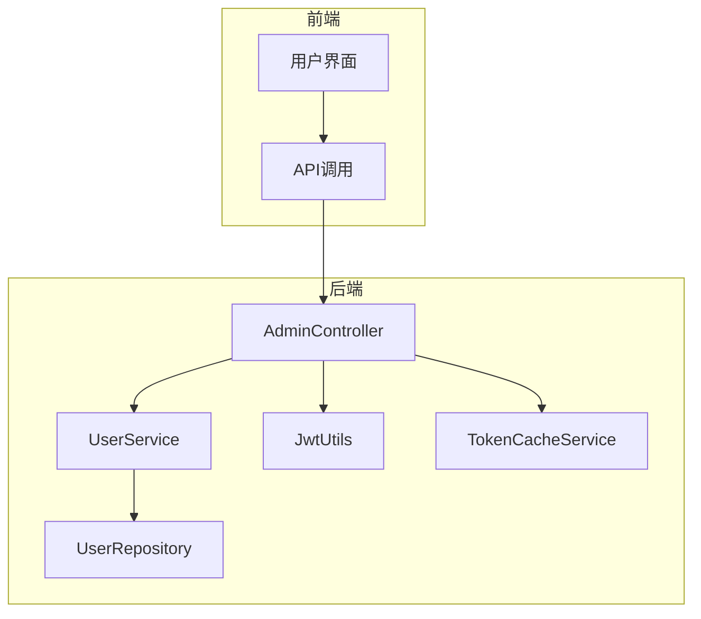
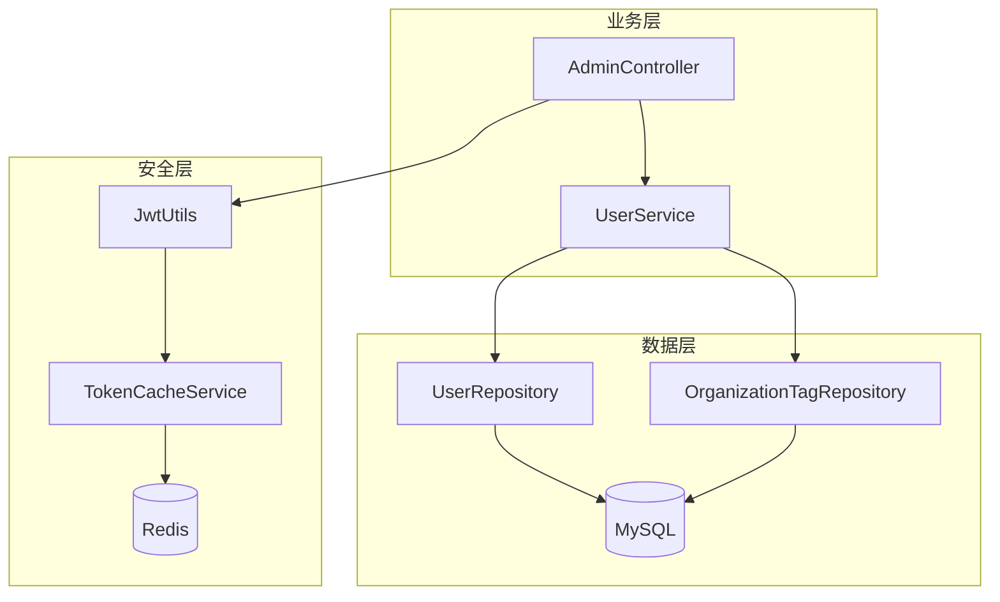
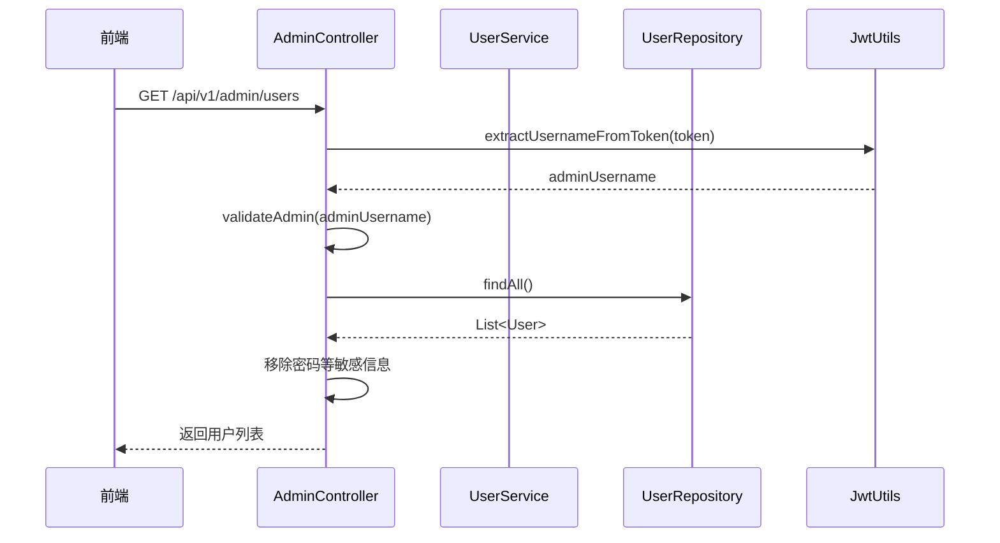
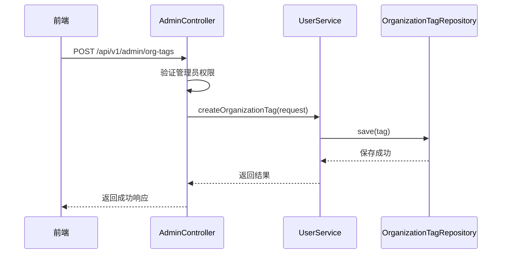
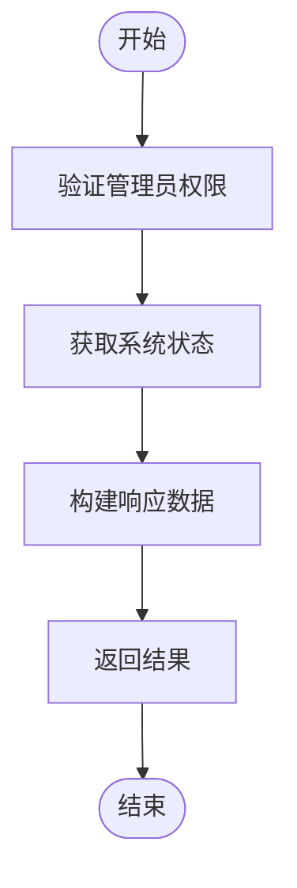
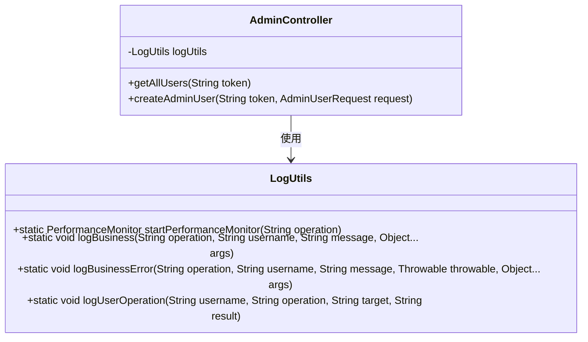
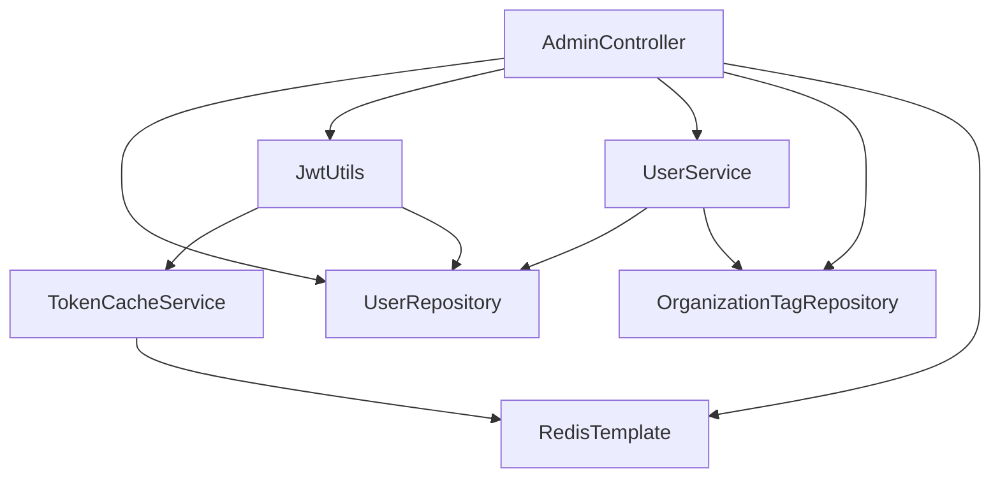

# 系统管理控制器

<cite>
**本文档中引用的文件**  
- [AdminController.java](file://src/main/java/com/yizhaoqi/smartpai/controller/AdminController.java)
- [JwtUtils.java](file://src/main/java/com/yizhaoqi/smartpai/utils/JwtUtils.java)
- [TokenCacheService.java](file://src/main/java/com/yizhaoqi/smartpai/service/TokenCacheService.java)
- [SecurityConfig.java](file://src/main/java/com/yizhaoqi/smartpai/config/SecurityConfig.java)
- [UserService.java](file://src/main/java/com/yizhaoqi/smartpai/service/UserService.java)
</cite>

## 目录
1. [简介](#简介)
2. [项目结构](#项目结构)
3. [核心组件](#核心组件)
4. [架构概述](#架构概述)
5. [详细组件分析](#详细组件分析)
6. [依赖分析](#依赖分析)
7. [性能考量](#性能考量)
8. [故障排除指南](#故障排除指南)
9. [结论](#结论)

## 简介
本技术文档全面解析了`AdminController.java`中系统管理功能的API设计，涵盖用户管理、组织标签管理、系统监控、配置调整等后台操作接口。文档详细说明了管理员权限的认证机制，包括JWT令牌的生成、验证与刷新流程，以及基于角色的访问控制策略。同时，文档化了系统状态查询接口的实现方式，包括服务健康检查、资源使用情况统计等指标的采集与暴露。此外，还解释了配置更新接口如何实现热更新，以及管理员操作审计日志的记录规范。最后，结合安全最佳实践，说明了敏感接口的访问控制、输入验证和防CSRF攻击措施。

## 项目结构
`AdminController.java`位于`src/main/java/com/yizhaoqi/smartpai/controller/`目录下，是系统管理功能的核心控制器。该控制器通过`@RestController`和`@RequestMapping("/api/v1/admin")`注解定义了所有管理员API的基路径。项目整体采用分层架构，`controller`层负责处理HTTP请求，`service`层实现业务逻辑，`repository`层负责数据访问，`utils`层提供通用工具类。

**图示来源**  
- [AdminController.java](file://src/main/java/com/yizhaoqi/smartpai/controller/AdminController.java)
- [UserService.java](file://src/main/java/com/yizhaoqi/smartpai/service/UserService.java)
- [JwtUtils.java](file://src/main/java/com/yizhaoqi/smartpai/utils/JwtUtils.java)

## 核心组件
`AdminController.java`中的核心组件包括用户管理、组织标签管理、系统状态查询和对话历史查询等API接口。这些接口通过`@GetMapping`、`@PostMapping`、`@PutMapping`和`@DeleteMapping`等注解定义了不同的HTTP方法。每个接口都通过`@RequestHeader("Authorization")`获取JWT令牌，并调用`validateAdmin`方法验证管理员权限。此外，接口还使用`LogUtils`进行性能监控和业务日志记录。

**组件来源**  
- [AdminController.java](file://src/main/java/com/yizhaoqi/smartpai/controller/AdminController.java#L48-L76)

## 架构概述
系统管理功能的架构基于Spring Boot框架，采用MVC模式。`AdminController`作为控制器层，接收前端请求并调用`UserService`进行业务处理。`UserService`依赖`UserRepository`和`OrganizationTagRepository`进行数据持久化操作。安全认证通过`JwtUtils`和`TokenCacheService`实现，其中`JwtUtils`负责JWT令牌的生成和验证，`TokenCacheService`基于Redis缓存令牌状态，实现令牌的主动失效和黑名单管理。

**图示来源**  
- [AdminController.java](file://src/main/java/com/yizhaoqi/smartpai/controller/AdminController.java)
- [JwtUtils.java](file://src/main/java/com/yizhaoqi/smartpai/utils/JwtUtils.java)
- [TokenCacheService.java](file://src/main/java/com/yizhaoqi/smartpai/service/TokenCacheService.java)

## 详细组件分析

### 用户管理接口分析
`AdminController`提供了多个用户管理接口，包括获取所有用户列表、创建管理员用户、获取用户列表等。这些接口通过`@GetMapping("/users")`和`@PostMapping("/users/create-admin")`等注解定义。接口首先通过`jwtUtils.extractUsernameFromToken`从Authorization头中提取用户名，然后调用`validateAdmin`方法验证用户是否为管理员。

**图示来源**  
- [AdminController.java](file://src/main/java/com/yizhaoqi/smartpai/controller/AdminController.java#L48-L76)
- [JwtUtils.java](file://src/main/java/com/yizhaoqi/smartpai/utils/JwtUtils.java#L100-L120)

### 组织标签管理接口分析
组织标签管理接口包括创建、更新、删除和查询组织标签。这些接口通过`@PostMapping("/org-tags")`、`@PutMapping("/org-tags/{tagId}")`等注解定义。接口调用`UserService`中的相应方法进行业务处理，并通过`LogUtils`记录操作日志。

**图示来源**  
- [AdminController.java](file://src/main/java/com/yizhaoqi/smartpai/controller/AdminController.java#L220-L240)
- [UserService.java](file://src/main/java/com/yizhaoqi/smartpai/service/UserService.java#L100-L120)

### 系统状态查询接口分析
系统状态查询接口通过`@GetMapping("/system/status")`定义，返回CPU使用率、内存使用率、磁盘使用率、活跃用户数、文档总数和对话总数等系统指标。目前该接口返回的是模拟数据，未来可集成实际的系统监控服务。

**图示来源**  
- [AdminController.java](file://src/main/java/com/yizhaoqi/smartpai/controller/AdminController.java#L129-L156)

### 审计日志记录规范
管理员操作审计日志通过`LogUtils`类实现。每次管理员操作都会调用`LogUtils.logUserOperation`方法记录操作类型、执行结果、时间戳等信息。例如，在获取用户列表成功后，会记录`ADMIN_GET_ALL_USERS`操作，状态为`SUCCESS`。

**图示来源**  
- [AdminController.java](file://src/main/java/com/yizhaoqi/smartpai/controller/AdminController.java#L65-L70)
- [LogUtils.java](file://src/main/java/com/yizhaoqi/smartpai/utils/LogUtils.java)

## 依赖分析
`AdminController`依赖多个组件，包括`UserRepository`、`JwtUtils`、`UserService`、`OrganizationTagRepository`和`RedisTemplate`。这些依赖通过`@Autowired`注解注入。`JwtUtils`又依赖`TokenCacheService`和`UserRepository`，形成复杂的依赖关系。

**图示来源**  
- [AdminController.java](file://src/main/java/com/yizhaoqi/smartpai/controller/AdminController.java#L20-L30)
- [JwtUtils.java](file://src/main/java/com/yizhaoqi/smartpai/utils/JwtUtils.java#L20-L30)
- [TokenCacheService.java](file://src/main/java/com/yizhaoqi/smartpai/service/TokenCacheService.java#L20-L30)

## 性能考量
系统在性能方面采用了多种优化措施。首先，通过`LogUtils.PerformanceMonitor`对关键操作进行性能监控，记录操作的开始和结束时间。其次，使用Redis缓存JWT令牌状态，避免每次请求都解析JWT签名，提高验证效率。此外，`TokenCacheService`还实现了用户token集合的管理，便于批量登出操作。

## 故障排除指南
当管理员接口出现问题时，可按照以下步骤进行排查：
1. 检查Authorization头是否正确传递JWT令牌。
2. 查看日志中是否有`ADMIN_GET_ALL_USERS`、`ADMIN_CREATE_ADMIN_USER`等操作的错误记录。
3. 检查Redis服务是否正常运行，`jwt:valid:*`、`jwt:refresh:*`等key是否存在。
4. 验证数据库连接是否正常，`users`表中是否存在管理员用户。

**组件来源**  
- [AdminController.java](file://src/main/java/com/yizhaoqi/smartpai/controller/AdminController.java#L50-L75)
- [JwtUtils.java](file://src/main/java/com/yizhaoqi/smartpai/utils/JwtUtils.java#L150-L180)

## 结论
`AdminController.java`实现了完整的系统管理功能，包括用户管理、组织标签管理、系统状态查询等。通过JWT令牌和Redis缓存实现了安全高效的认证机制。管理员权限通过`validateAdmin`方法验证，确保只有管理员才能访问敏感接口。审计日志通过`LogUtils`记录，便于追踪管理员操作。未来可进一步集成实际的系统监控服务，提供更准确的系统状态数据。