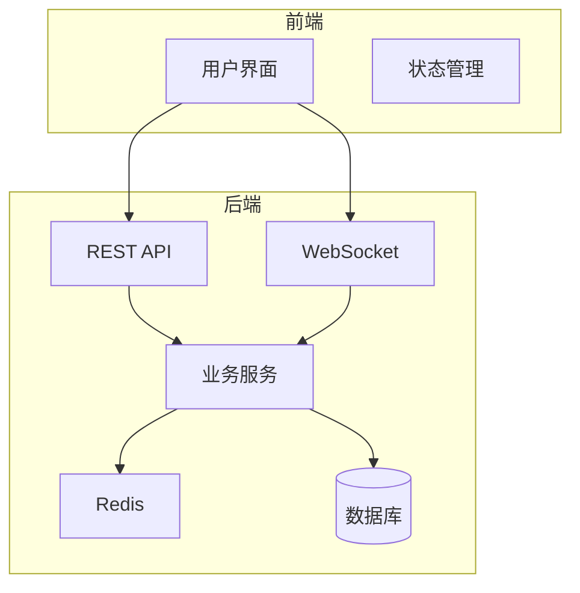
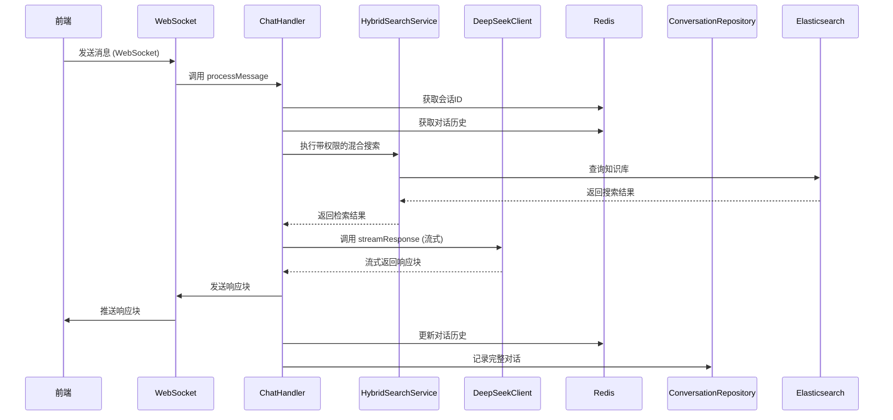
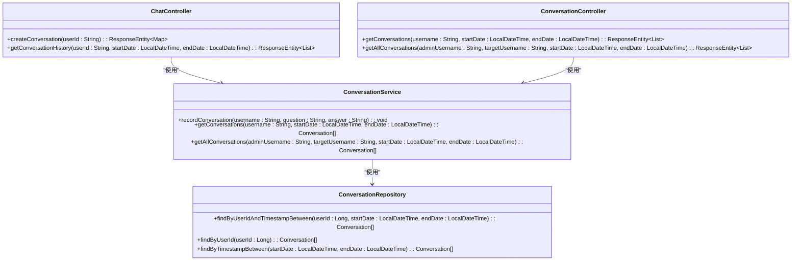
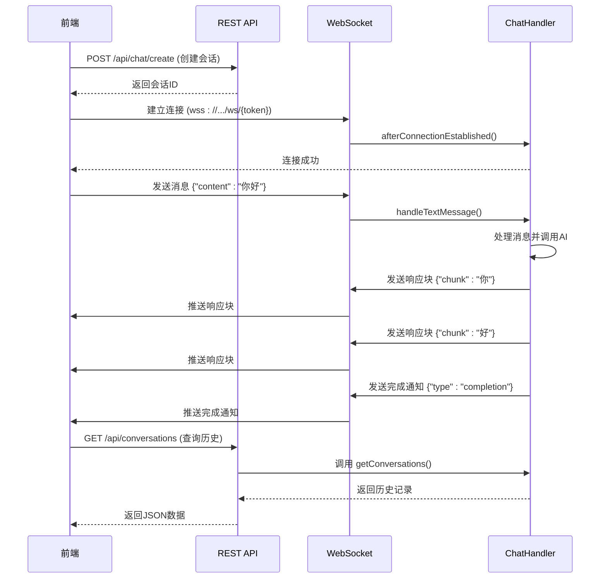
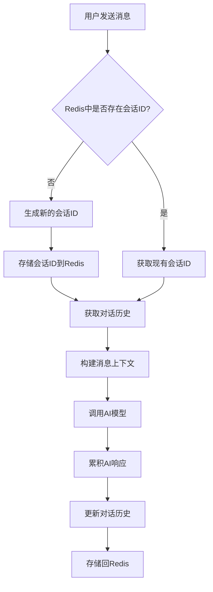
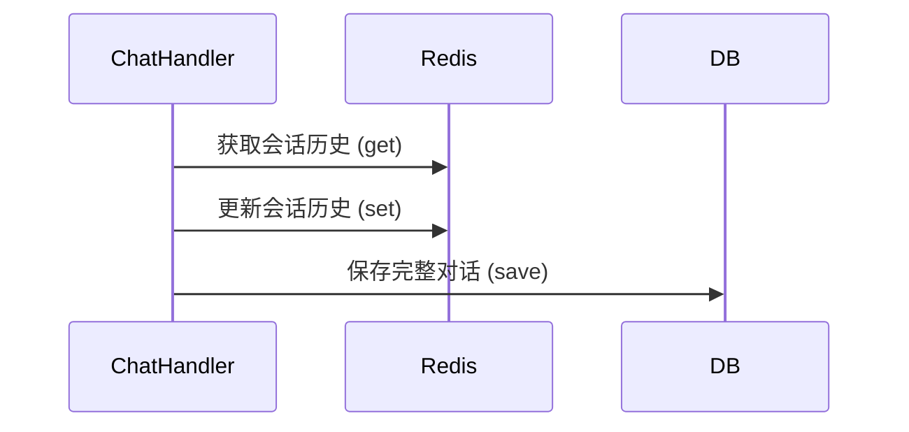
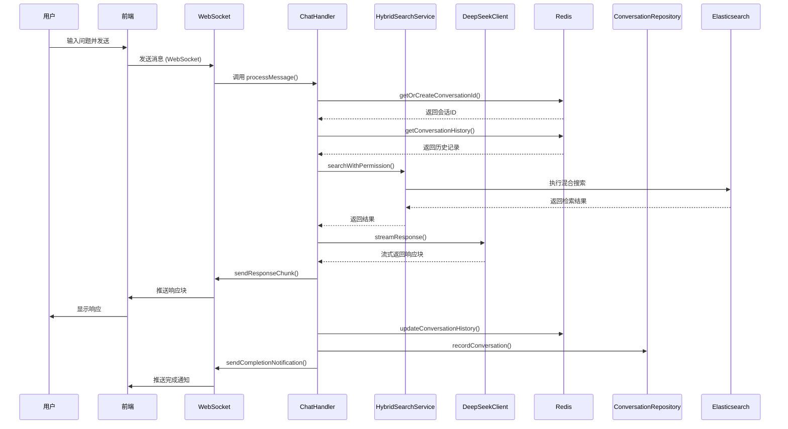
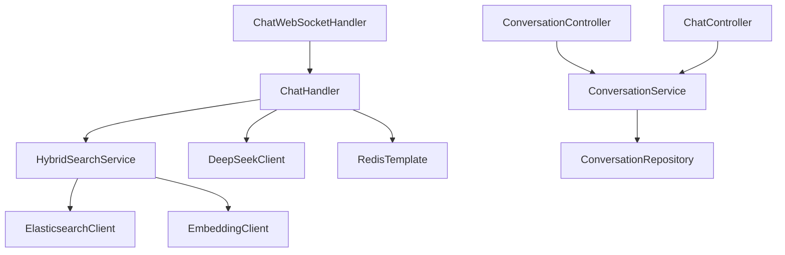

# 聊天与会话控制器

<cite>
**本文档中引用的文件**   
- [ChatController.java](file://src/main/java/com/yizhaoqi/smartpai/controller/ChatController.java)
- [ConversationController.java](file://src/main/java/com/yizhaoqi/smartpai/controller/ConversationController.java)
- [ChatHandler.java](file://src/main/java/com/yizhaoqi/smartpai/service/ChatHandler.java)
- [ChatWebSocketHandler.java](file://src/main/java/com/yizhaoqi/smartpai/handler/ChatWebSocketHandler.java)
- [DeepSeekClient.java](file://src/main/java/com/yizhaoqi/smartpai/client/DeepSeekClient.java)
- [HybridSearchService.java](file://src/main/java/com/yizhaoqi/smartpai/service/HybridSearchService.java)
- [ConversationService.java](file://src/main/java/com/yizhaoqi/smartpai/service/ConversationService.java)
- [ConversationRepository.java](file://src/main/java/com/yizhaoqi/smartpai/repository/ConversationRepository.java)
- [WebSocketConfig.java](file://src/main/java/com/yizhaoqi/smartpai/config/WebSocketConfig.java)
</cite>

## 目录
1. [简介](#简介)
2. [项目结构](#项目结构)
3. [核心组件](#核心组件)
4. [架构概述](#架构概述)
5. [详细组件分析](#详细组件分析)
6. [依赖分析](#依赖分析)
7. [性能考量](#性能考量)
8. [故障排除指南](#故障排除指南)
9. [结论](#结论)

## 简介
本技术文档详细阐述了PaiSmart项目中聊天与会话功能的实现机制。系统采用WebSocket与REST API协同工作的架构，为用户提供实时、流畅的AI对话体验。文档深入分析了从用户提问到AI响应的完整链路，涵盖会话创建、消息发送、历史记录查询等核心API设计，以及WebSocket与REST API的协同工作机制。重点解析了会话上下文管理、AI模型交互、消息持久化策略等关键技术，为开发者提供全面的系统理解。

## 项目结构
项目采用典型的前后端分离架构，后端基于Spring Boot框架构建，前端使用Vue.js开发。后端代码位于`src/main/java`目录下，按功能模块组织，包括控制器、服务、数据访问层等。前端代码位于`frontend/src`目录下，包含组件、视图、状态管理等。聊天功能的核心逻辑分布在`controller`、`service`和`handler`包中，通过WebSocket实现与前端的实时通信。



**图源**
- [ChatController.java](file://src/main/java/com/yizhaoqi/smartpai/controller/ChatController.java)
- [ChatWebSocketHandler.java](file://src/main/java/com/yizhaoqi/smartpai/handler/ChatWebSocketHandler.java)

**节源**
- [ChatController.java](file://src/main/java/com/yizhaoqi/smartpai/controller/ChatController.java)
- [ChatWebSocketHandler.java](file://src/main/java/com/yizhaoqi/smartpai/handler/ChatWebSocketHandler.java)

## 核心组件
聊天功能的核心组件包括`ChatController`、`ConversationController`、`ChatHandler`、`ChatWebSocketHandler`以及`DeepSeekClient`。`ChatController`和`ConversationController`负责处理REST API请求，提供会话创建和历史记录查询等接口。`ChatWebSocketHandler`是WebSocket的处理器，管理连接的生命周期和消息分发。`ChatHandler`是业务逻辑的核心，协调搜索、AI交互和会话状态管理。`DeepSeekClient`封装了与AI模型的交互，实现流式响应处理。

**节源**
- [ChatController.java](file://src/main/java/com/yizhaoqi/smartpai/controller/ChatController.java)
- [ChatHandler.java](file://src/main/java/com/yizhaoqi/smartpai/service/ChatHandler.java)
- [DeepSeekClient.java](file://src/main/java/com/yizhaoqi/smartpai/client/DeepSeekClient.java)

## 架构概述
系统采用分层架构，前端通过WebSocket与后端建立长连接，用于实时接收AI的流式响应。同时，前端通过REST API与后端进行同步通信，用于会话管理和历史记录查询。后端服务通过`ChatHandler`协调`HybridSearchService`和`DeepSeekClient`，先进行知识库检索，再将检索结果和对话历史作为上下文发送给AI模型。会话状态存储在Redis中，确保状态的实时性和一致性，而完整的对话历史则持久化到数据库中。



**图源**
- [ChatHandler.java](file://src/main/java/com/yizhaoqi/smartpai/service/ChatHandler.java)
- [HybridSearchService.java](file://src/main/java/com/yizhaoqi/smartpai/service/HybridSearchService.java)
- [DeepSeekClient.java](file://src/main/java/com/yizhaoqi/smartpai/client/DeepSeekClient.java)

## 详细组件分析

### ChatController与ConversationController API设计
`ChatController`和`ConversationController`提供了RESTful API，用于会话管理和历史记录查询。`ChatController`主要负责会话的创建和基本操作，而`ConversationController`专注于对话历史的持久化和查询。

#### REST API接口


**图源**
- [ChatController.java](file://src/main/java/com/yizhaoqi/smartpai/controller/ChatController.java)
- [ConversationController.java](file://src/main/java/com/yizhaoqi/smartpai/controller/ConversationController.java)
- [ConversationService.java](file://src/main/java/com/yizhaoqi/smartpai/service/ConversationService.java)
- [ConversationRepository.java](file://src/main/java/com/yizhaoqi/smartpai/repository/ConversationRepository.java)

**节源**
- [ChatController.java](file://src/main/java/com/yizhaoqi/smartpai/controller/ChatController.java)
- [ConversationController.java](file://src/main/java/com/yizhaoqi/smartpai/controller/ConversationController.java)

### WebSocket与REST API协同工作机制
系统通过WebSocket和REST API两种协议协同工作，以满足不同场景的需求。WebSocket用于实时、双向的流式通信，确保AI响应能够逐字逐句地推送给前端，提供最佳的用户体验。REST API则用于处理会话创建、历史记录查询等需要明确请求-响应周期的操作。

#### 协同工作流程


**图源**
- [ChatWebSocketHandler.java](file://src/main/java/com/yizhaoqi/smartpai/handler/ChatWebSocketHandler.java)
- [ChatHandler.java](file://src/main/java/com/yizhaoqi/smartpai/service/ChatHandler.java)
- [ConversationController.java](file://src/main/java/com/yizhaoqi/smartpai/controller/ConversationController.java)

**节源**
- [ChatWebSocketHandler.java](file://src/main/java/com/yizhaoqi/smartpai/handler/ChatWebSocketHandler.java)
- [ChatHandler.java](file://src/main/java/com/yizhaoqi/smartpai/service/ChatHandler.java)

### 消息体数据结构与序列化规范
系统定义了清晰的消息体数据结构，确保前后端通信的一致性。WebSocket消息采用JSON格式，包含`chunk`字段用于流式响应，`type`字段用于区分系统通知（如完成、停止）。REST API的请求和响应也采用标准的JSON格式。

#### 消息体结构
```json
// WebSocket 流式响应
{
  "chunk": "AI响应的一部分"
}

// WebSocket 完成通知
{
  "type": "completion",
  "status": "finished",
  "message": "响应已完成"
}

// WebSocket 停止确认
{
  "type": "stop",
  "message": "响应已停止"
}

// REST API 响应
{
  "code": 200,
  "message": "success",
  "data": [...]
}
```

**节源**
- [ChatWebSocketHandler.java](file://src/main/java/com/yizhaoqi/smartpai/handler/ChatWebSocketHandler.java)
- [ChatHandler.java](file://src/main/java/com/yizhaoqi/smartpai/service/ChatHandler.java)

### 会话上下文管理机制
会话上下文管理是实现连贯对话的关键。系统使用Redis作为会话状态的存储，为每个用户维护一个当前会话ID和对话历史。当用户发送新消息时，系统会根据用户ID从Redis中获取当前会话ID，然后加载该会话的完整对话历史，并将其作为上下文传递给AI模型。

#### 会话上下文管理流程


**图源**
- [ChatHandler.java](file://src/main/java/com/yizhaoqi/smartpai/service/ChatHandler.java)

**节源**
- [ChatHandler.java](file://src/main/java/com/yizhaoqi/smartpai/service/ChatHandler.java)

### 消息持久化策略
系统采用分层持久化策略。对话的实时状态（如当前响应流）存储在内存中，由`ChatHandler`的`responseBuilders`映射管理。完整的对话历史首先存储在Redis中，以支持快速的上下文加载。当一次完整的对话（用户提问和AI完整回答）完成后，系统会将这条记录持久化到关系型数据库中，用于长期存储和历史查询。

#### 持久化流程


**图源**
- [ChatHandler.java](file://src/main/java/com/yizhaoqi/smartpai/service/ChatHandler.java)
- [ConversationService.java](file://src/main/java/com/yizhaoqi/smartpai/service/ConversationService.java)

**节源**
- [ChatHandler.java](file://src/main/java/com/yizhaoqi/smartpai/service/ChatHandler.java)
- [ConversationService.java](file://src/main/java/com/yizhaoqi/smartpai/service/ConversationService.java)

### 完整交互流程
以下是一个用户提问从接收到响应的完整链路：



**图源**
- [ChatHandler.java](file://src/main/java/com/yizhaoqi/smartpai/service/ChatHandler.java)
- [HybridSearchService.java](file://src/main/java/com/yizhaoqi/smartpai/service/HybridSearchService.java)
- [DeepSeekClient.java](file://src/main/java/com/yizhaoqi/smartpai/client/DeepSeekClient.java)

**节源**
- [ChatHandler.java](file://src/main/java/com/yizhaoqi/smartpai/service/ChatHandler.java)

## 依赖分析
系统各组件之间存在清晰的依赖关系。`ChatWebSocketHandler`依赖`ChatHandler`来处理业务逻辑。`ChatHandler`是核心协调者，依赖`HybridSearchService`进行知识检索，依赖`DeepSeekClient`进行AI交互，并通过`RedisTemplate`与Redis交互。`ConversationService`负责数据库持久化，依赖`ConversationRepository`。这种分层依赖确保了代码的高内聚和低耦合。



**图源**
- [ChatWebSocketHandler.java](file://src/main/java/com/yizhaoqi/smartpai/handler/ChatWebSocketHandler.java)
- [ChatHandler.java](file://src/main/java/com/yizhaoqi/smartpai/service/ChatHandler.java)
- [ConversationService.java](file://src/main/java/com/yizhaoqi/smartpai/service/ConversationService.java)
- [HybridSearchService.java](file://src/main/java/com/yizhaoqi/smartpai/service/HybridSearchService.java)

**节源**
- [ChatWebSocketHandler.java](file://src/main/java/com/yizhaoqi/smartpai/handler/ChatWebSocketHandler.java)
- [ChatHandler.java](file://src/main/java/com/yizhaoqi/smartpai/service/ChatHandler.java)

## 性能考量
在高并发场景下，系统的性能和稳定性至关重要。`ChatHandler`中的`responseBuilders`和`responseFutures`使用`ConcurrentHashMap`，确保了线程安全。WebSocket连接的管理通过`ConcurrentHashMap`实现，能够高效地处理大量并发连接。对于消息队列积压，系统通过后台线程异步处理响应完成检测，避免阻塞主线程。错误重试机制主要体现在`HybridSearchService`中，当向量搜索失败时，会自动降级为纯文本搜索作为后备方案。

**节源**
- [ChatHandler.java](file://src/main/java/com/yizhaoqi/smartpai/service/ChatHandler.java)
- [HybridSearchService.java](file://src/main/java/com/yizhaoqi/smartpai/service/HybridSearchService.java)

## 故障排除指南
- **WebSocket连接失败**：检查`WebSocketConfig`配置和前端连接URL，确保JWT令牌正确。
- **AI响应无输出**：检查`DeepSeekClient`的API密钥和URL配置，确认网络可达。
- **历史记录不显示**：检查`ConversationService`的查询逻辑和数据库连接。
- **搜索无结果**：确认Elasticsearch服务正常运行，知识库索引已正确创建。
- **响应延迟高**：检查AI模型服务的性能，考虑优化检索逻辑或增加超时设置。

**节源**
- [ChatWebSocketHandler.java](file://src/main/java/com/yizhaoqi/smartpai/handler/ChatWebSocketHandler.java)
- [DeepSeekClient.java](file://src/main/java/com/yizhaoqi/smartpai/client/DeepSeekClient.java)
- [ConversationService.java](file://src/main/java/com/yizhaoqi/smartpai/service/ConversationService.java)
- [HybridSearchService.java](file://src/main/java/com/yizhaoqi/smartpai/service/HybridSearchService.java)

## 结论
PaiSmart项目的聊天与会话功能通过精心设计的架构实现了高效、实时的AI交互体验。系统巧妙地结合了WebSocket的实时性和REST API的简洁性，利用Redis管理会话状态，确保了对话的连贯性。通过`ChatHandler`作为核心协调者，将知识检索、AI交互和状态管理无缝集成。消息持久化策略兼顾了性能和数据完整性。整体设计具有良好的可扩展性和健壮性，为用户提供了一个稳定可靠的智能对话平台。