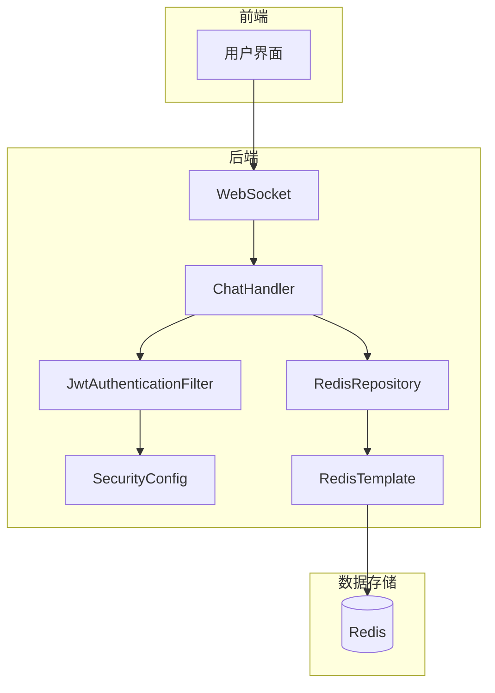
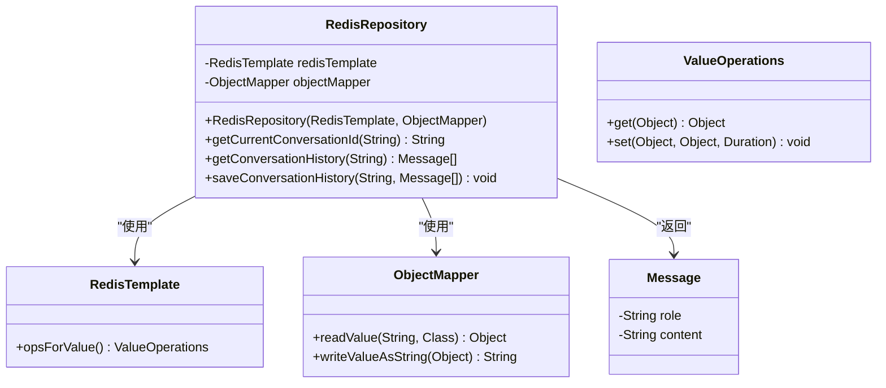
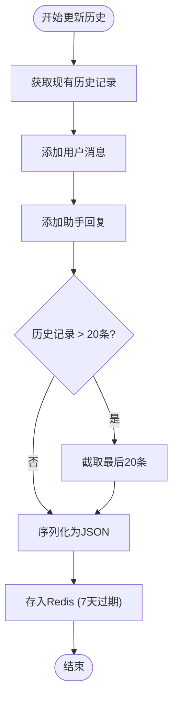
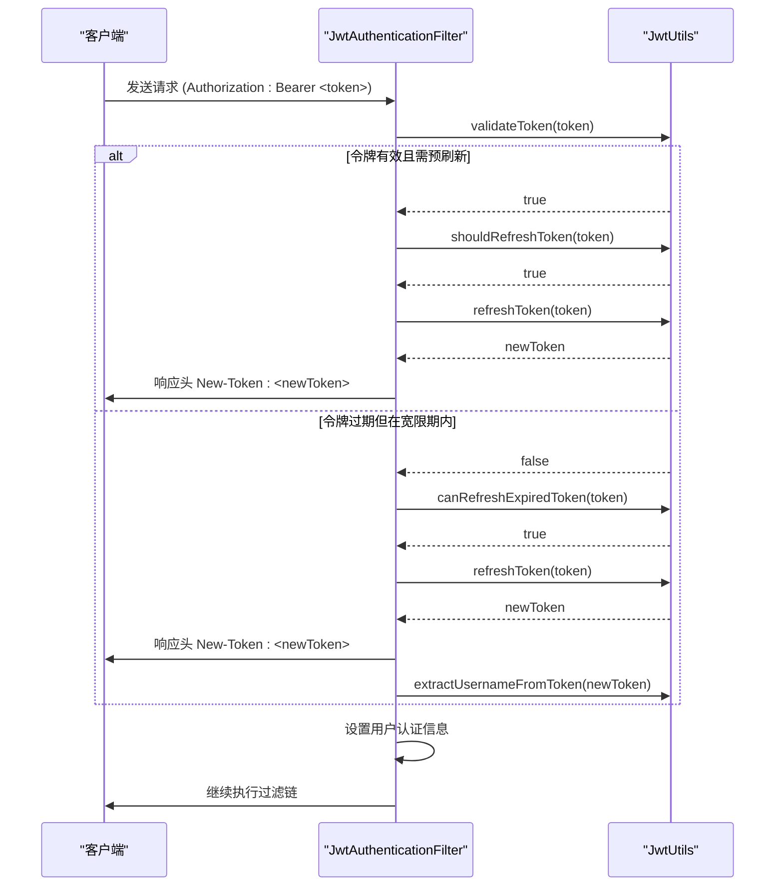
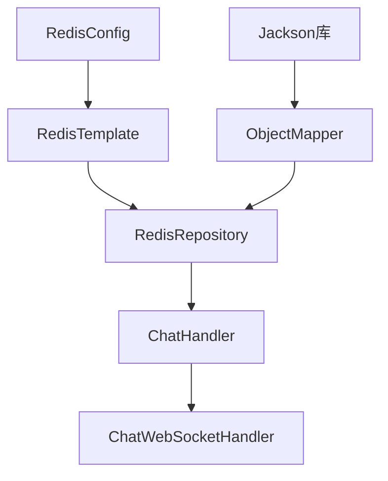

# Redis数据仓库

<cite>
**本文档引用的文件**   
- [RedisRepository.java](file://src/main/java/com/yizhaoqi/smartpai/repository/RedisRepository.java)
- [ChatHandler.java](file://src/main/java/com/yizhaoqi/smartpai/service/ChatHandler.java)
- [Message.java](file://src/main/java/com/yizhaoqi/smartpai/entity/Message.java)
- [JwtAuthenticationFilter.java](file://src/main/java/com/yizhaoqi/smartpai/config/JwtAuthenticationFilter.java)
- [SecurityConfig.java](file://src/main/java/com/yizhaoqi/smartpai/config/SecurityConfig.java)
- [RedisConfig.java](file://src/main/java/com/yizhaoqi/smartpai/config/RedisConfig.java)
</cite>

## 目录
1. [引言](#引言)
2. [项目结构](#项目结构)
3. [核心组件](#核心组件)
4. [架构概览](#架构概览)
5. [详细组件分析](#详细组件分析)
6. [依赖分析](#依赖分析)
7. [性能考量](#性能考量)
8. [故障排除指南](#故障排除指南)
9. [结论](#结论)

## 引言
本文档详细解析了`RedisRepository`类的实现机制，重点阐述了基于`RedisTemplate`的缓存数据访问模式。文档涵盖了会话缓存、令牌管理和热点数据存储的具体实现，提供了缓存读写、过期策略配置和批量操作的代码示例。同时，分析了缓存穿透、雪崩和击穿的防护措施，结合实际应用场景（如JWT令牌验证）说明了缓存一致性保障方案，并阐述了连接池配置、序列化策略和性能监控的最佳实践。

## 项目结构
本项目采用典型的分层架构，前端使用Vue.js框架，后端基于Spring Boot构建。后端代码主要位于`src/main/java`目录下，按照`controller`、`service`、`repository`、`config`等包进行组织。`RedisRepository`类位于`com.yizhaoqi.smartpai.repository`包中，是数据访问层的核心组件之一，负责与Redis缓存进行交互。

**Section sources**
- [RedisRepository.java](file://src/main/java/com/yizhaoqi/smartpai/repository/RedisRepository.java)

## 核心组件
`RedisRepository`类是本项目中负责与Redis进行交互的核心数据访问组件。它封装了对会话缓存和对话历史的读写操作，通过`RedisTemplate`提供类型安全的API。该类的主要功能包括获取和创建用户会话ID、获取和更新对话历史记录。其设计遵循了单一职责原则，专注于缓存数据的存取，与业务逻辑分离。

**Section sources**
- [RedisRepository.java](file://src/main/java/com/yizhaoqi/smartpai/repository/RedisRepository.java#L12-L39)

## 架构概览
本系统的架构围绕Spring Boot和Redis构建，形成了一个高效、可扩展的后端服务。前端通过WebSocket与后端的`ChatHandler`进行实时通信。`ChatHandler`作为业务处理的核心，依赖`RedisRepository`来管理会话状态和对话历史，确保了对话的连续性。安全方面，`JwtAuthenticationFilter`在请求到达控制器之前进行JWT令牌的验证和自动刷新，保证了系统的安全性。



**Diagram sources**
- [ChatHandler.java](file://src/main/java/com/yizhaoqi/smartpai/service/ChatHandler.java)
- [RedisRepository.java](file://src/main/java/com/yizhaoqi/smartpai/repository/RedisRepository.java)
- [JwtAuthenticationFilter.java](file://src/main/java/com/yizhaoqi/smartpai/config/JwtAuthenticationFilter.java)

## 详细组件分析

### RedisRepository分析
`RedisRepository`类是基于`RedisTemplate`实现的缓存数据访问层，它提供了对会话缓存和对话历史的原子性操作。

#### 类图


**Diagram sources**
- [RedisRepository.java](file://src/main/java/com/yizhaoqi/smartpai/repository/RedisRepository.java#L12-L39)
- [Message.java](file://src/main/java/com/yizhaoqi/smartpai/entity/Message.java#L1-L11)

#### 会话缓存实现
`RedisRepository`通过`getOrCreateConversationId`方法实现会话缓存。该方法首先尝试从Redis中获取用户的当前会话ID，如果不存在则生成一个新的UUID并存储，同时设置7天的过期时间。这种设计确保了用户在会话期间能够保持对话的连续性，即使服务重启也不会丢失会话状态。

```java
private String getOrCreateConversationId(String userId) {
    String key = "user:" + userId + ":current_conversation";
    String conversationId = redisTemplate.opsForValue().get(key);
    
    if (conversationId == null) {
        conversationId = UUID.randomUUID().toString();
        redisTemplate.opsForValue().set(key, conversationId, Duration.ofDays(7));
    }
    return conversationId;
}
```

**Section sources**
- [ChatHandler.java](file://src/main/java/com/yizhaoqi/smartpai/service/ChatHandler.java#L29-L399)

#### 对话历史存储
对话历史的存储采用了JSON序列化的方式。`updateConversationHistory`方法将对话记录（包含角色、内容和时间戳）存储在一个`List<Map<String, String>>`中，并使用`ObjectMapper`将其序列化为JSON字符串后存入Redis。为了防止历史记录无限增长，系统限制了每条会话最多保存20条消息。



**Diagram sources**
- [ChatHandler.java](file://src/main/java/com/yizhaoqi/smartpai/service/ChatHandler.java#L29-L399)

### JWT令牌验证流程
JWT令牌的验证和刷新由`JwtAuthenticationFilter`在请求处理链的早期阶段完成。该过滤器从`Authorization`请求头中提取令牌，通过`JwtUtils`工具类进行验证。系统实现了无感知的自动刷新机制：当令牌即将过期或已过期但在宽限期内时，会自动生成一个新的令牌并通过`New-Token`响应头返回给前端。

#### 序列图


**Diagram sources**
- [JwtAuthenticationFilter.java](file://src/main/java/com/yizhaoqi/smartpai/config/JwtAuthenticationFilter.java#L22-L97)
- [SecurityConfig.java](file://src/main/java/com/yizhaoqi/smartpai/config/SecurityConfig.java#L17-L87)

## 依赖分析
`RedisRepository`的正常运行依赖于`RedisTemplate`和`ObjectMapper`两个核心组件。`RedisTemplate`由`RedisConfig`类配置，负责管理与Redis服务器的连接。`ObjectMapper`是Jackson库的核心类，用于Java对象与JSON之间的序列化和反序列化。`ChatHandler`服务类直接依赖`RedisRepository`来管理会话状态，形成了清晰的依赖链。



**Diagram sources**
- [RedisRepository.java](file://src/main/java/com/yizhaoqi/smartpai/repository/RedisRepository.java)
- [ChatHandler.java](file://src/main/java/com/yizhaoqi/smartpai/service/ChatHandler.java)

## 性能考量
为了保障缓存的高性能和高可用性，系统在多个层面进行了优化。

### 连接池配置
`RedisConfig`类通过配置`LettuceConnectionFactory`来管理Redis连接池。合理的连接池配置（如最大连接数、超时时间）可以有效复用连接，避免频繁创建和销毁连接带来的性能开销，从而提升系统的吞吐量。

### 序列化策略
系统使用`Jackson2JsonRedisSerializer`作为默认的序列化器。JSON格式具有良好的可读性和跨语言兼容性，但相比二进制序列化（如`JdkSerializationRedisSerializer`）会占用更多的存储空间和带宽。在性能要求极高的场景下，可以考虑使用更高效的序列化方案。

### 缓存防护
虽然当前代码未直接体现，但最佳实践中应包含对缓存穿透、雪崩和击穿的防护。例如，对于查询数据库后不存在的数据，可以缓存一个空值（并设置较短的过期时间）来防止缓存穿透；通过为不同的缓存项设置随机的过期时间来避免缓存雪崩。

**Section sources**
- [RedisConfig.java](file://src/main/java/com/yizhaoqi/smartpai/config/RedisConfig.java)

## 故障排除指南
当遇到与Redis相关的功能异常时，可以按照以下步骤进行排查：

1.  **检查Redis服务状态**：确认Redis服务器正在运行，并且网络连接正常。
2.  **查看日志信息**：检查应用日志，特别是`ChatHandler`和`RedisRepository`相关的日志，寻找`NullPointerException`或`JsonProcessingException`等错误。
3.  **验证缓存键**：使用Redis命令行工具（如`redis-cli`）检查相关的缓存键（如`user:userId:current_conversation`）是否存在，以及其值是否符合预期。
4.  **检查序列化问题**：如果出现JSON解析错误，检查`Message`类的结构是否与缓存中的JSON数据匹配。
5.  **监控连接池**：如果出现连接超时，检查`RedisConfig`中的连接池配置是否合理。

**Section sources**
- [ChatHandler.java](file://src/main/java/com/yizhaoqi/smartpai/service/ChatHandler.java)
- [RedisRepository.java](file://src/main/java/com/yizhaoqi/smartpai/repository/RedisRepository.java)

## 结论
`RedisRepository`类的设计简洁高效，成功地将复杂的缓存操作封装起来，为上层业务提供了稳定可靠的数据访问接口。通过与`ChatHandler`和`JwtAuthenticationFilter`等组件的协同工作，系统实现了流畅的会话管理和安全的用户认证。未来可以进一步优化序列化策略，并引入更完善的缓存监控和防护机制，以应对更大规模的并发访问。