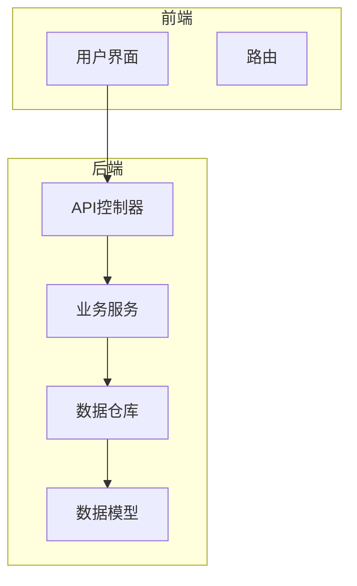
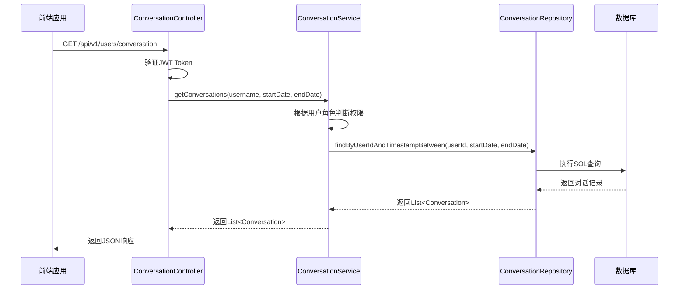
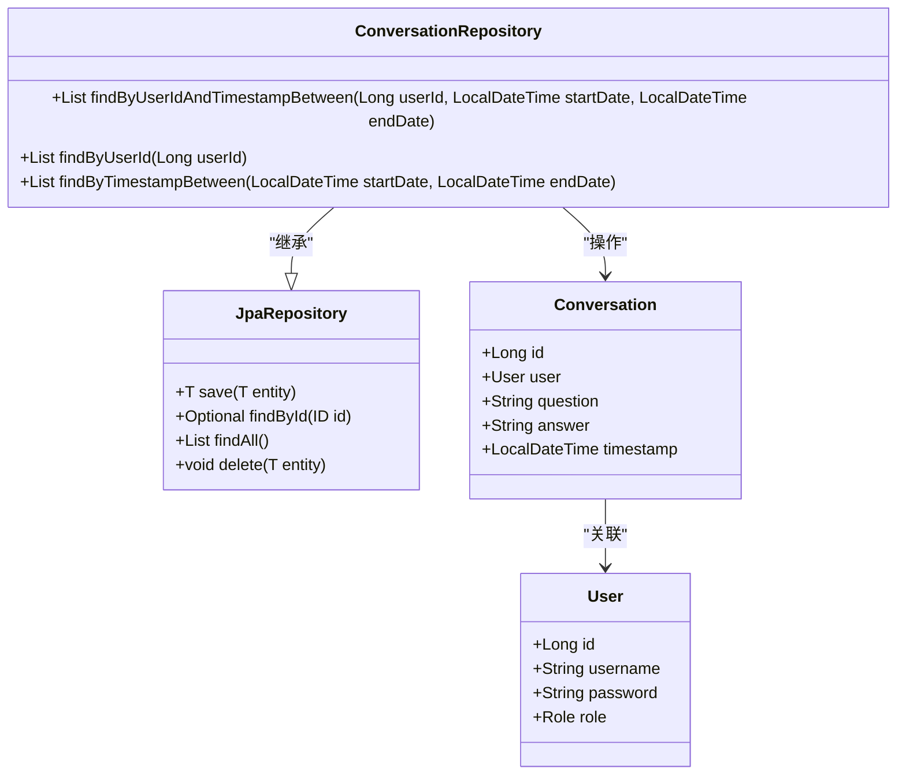
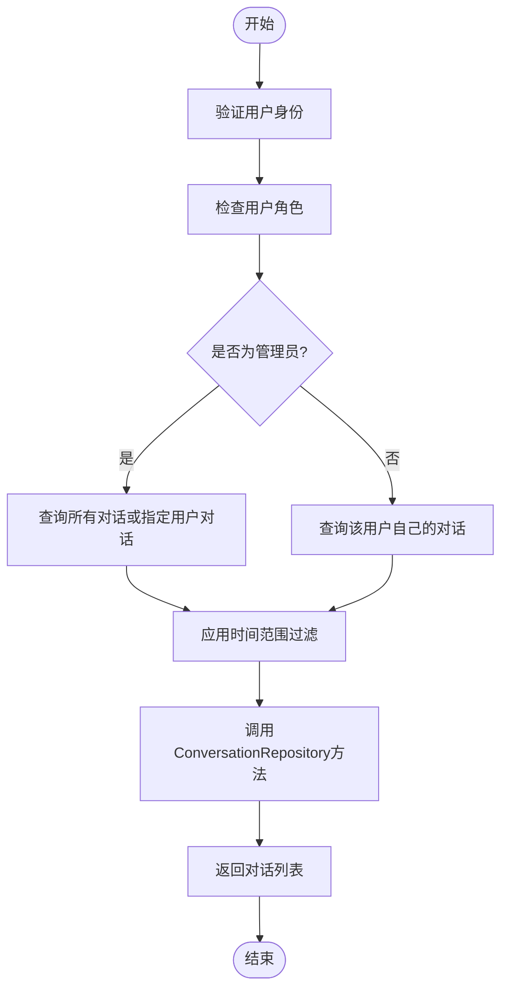
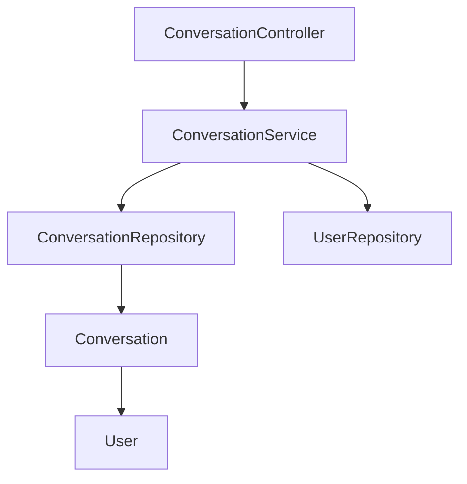

# 会话数据仓库

<cite>
**本文档引用的文件**   
- [ConversationRepository.java](file://src/main/java/com/yizhaoqi/smartpai/repository/ConversationRepository.java)
- [ConversationService.java](file://src/main/java/com/yizhaoqi/smartpai/service/ConversationService.java)
- [Conversation.java](file://src/main/java/com/yizhaoqi/smartpai/model/Conversation.java)
- [User.java](file://src/main/java/com/yizhaoqi/smartpai/model/User.java)
- [ConversationController.java](file://src/main/java/com/yizhaoqi/smartpai/controller/ConversationController.java)
</cite>

## 目录
1. [引言](#引言)
2. [项目结构](#项目结构)
3. [核心组件](#核心组件)
4. [架构概览](#架构概览)
5. [详细组件分析](#详细组件分析)
6. [依赖分析](#依赖分析)
7. [性能考量](#性能考量)
8. [故障排除指南](#故障排除指南)
9. [结论](#结论)

## 引言
本文档旨在深入解析`ConversationRepository`接口的设计与实现，重点阐述基于Spring Data JPA的会话数据访问机制。通过分析其在用户会话列表查询中的应用，详细说明命名规范、自动生成的SQL逻辑、分页支持、排序规则及软删除处理策略。同时，结合实际业务场景，提供会话创建、更新和逻辑删除的代码示例，并探讨事务管理、异常处理和性能优化的最佳实践，为开发者提供高效操作会话数据的指导。

## 项目结构
项目采用典型的分层架构，主要分为前端（frontend）和后端（src/main/java）两大部分。后端代码遵循MVC模式，清晰地划分为`controller`、`service`、`repository`和`model`等模块。`ConversationRepository`位于`repository`层，是数据访问的核心接口。



**图示来源**
- [ConversationController.java](file://src/main/java/com/yizhaoqi/smartpai/controller/ConversationController.java)
- [ConversationService.java](file://src/main/java/com/yizhaoqi/smartpai/service/ConversationService.java)
- [ConversationRepository.java](file://src/main/java/com/yizhaoqi/smartpai/repository/ConversationRepository.java)
- [Conversation.java](file://src/main/java/com/yizhaoqi/smartpai/model/Conversation.java)

## 核心组件
`ConversationRepository`是本系统中负责会话数据持久化的核心组件。它继承自Spring Data JPA的`JpaRepository`，通过方法命名约定自动生成SQL查询，极大地简化了数据库操作。其主要职责是提供对`Conversation`实体的CRUD（创建、读取、更新、删除）操作。

**组件来源**
- [ConversationRepository.java](file://src/main/java/com/yizhaoqi/smartpai/repository/ConversationRepository.java)
- [Conversation.java](file://src/main/java/com/yizhaoqi/smartpai/model/Conversation.java)

## 架构概览
系统采用前后端分离的架构。前端通过HTTP API与后端交互。后端的`ConversationController`接收API请求，调用`ConversationService`进行业务逻辑处理，`ConversationService`再通过`ConversationRepository`访问数据库。数据模型`Conversation`和`User`通过JPA注解映射到数据库表。



**图示来源**
- [ConversationController.java](file://src/main/java/com/yizhaoqi/smartpai/controller/ConversationController.java#L43-L107)
- [ConversationService.java](file://src/main/java/com/yizhaoqi/smartpai/service/ConversationService.java#L50-L70)
- [ConversationRepository.java](file://src/main/java/com/yizhaoqi/smartpai/repository/ConversationRepository.java#L15-L18)

## 详细组件分析
### ConversationRepository 接口分析
`ConversationRepository`接口定义了三个核心查询方法，均遵循Spring Data JPA的方法命名规范。



**图示来源**
- [ConversationRepository.java](file://src/main/java/com/yizhaoqi/smartpai/repository/ConversationRepository.java#L9-L38)
- [Conversation.java](file://src/main/java/com/yizhaoqi/smartpai/model/Conversation.java#L1-L32)
- [User.java](file://src/main/java/com/yizhaoqi/smartpai/model/User.java#L1-L43)

#### 方法命名规范与SQL生成
Spring Data JPA根据方法名自动解析查询条件。例如：
- `findByUserIdAndTimestampBetween`：方法名中的`findBy`表示查询，`UserId`和`TimestampBetween`是条件。`And`连接两个条件。`Between`表示时间范围查询。自动生成的SQL类似于：
  ```sql
  SELECT * FROM conversations c WHERE c.user_id = ?1 AND c.timestamp BETWEEN ?2 AND ?3
  ```
- `findByUserId`：生成的SQL为 `SELECT * FROM conversations c WHERE c.user_id = ?1`。
- `findByTimestampBetween`：生成的SQL为 `SELECT * FROM conversations c WHERE c.timestamp BETWEEN ?1 AND ?2`。

#### 会话创建、更新与逻辑删除
虽然`ConversationRepository`本身没有显式定义`save`和`delete`方法，但它继承了`JpaRepository`的这些方法。

**会话创建示例**：
```java
// 在ConversationService中
public void recordConversation(String username, String question, String answer) {
    User user = userRepository.findByUsername(username).orElseThrow(...);
    Conversation conversation = new Conversation();
    conversation.setUser(user);
    conversation.setQuestion(question);
    conversation.setAnswer(answer);
    // 调用继承自JpaRepository的save方法
    conversationRepository.save(conversation);
}
```

**逻辑删除策略**：
经过代码分析，当前实现中**并未采用软删除**。`Conversation`实体中没有`isDeleted`或`deletedAt`等字段。当需要删除会话时，会直接调用`JpaRepository`的`delete()`方法进行物理删除。这是一种直接的删除方式，不保留历史记录。

**组件来源**
- [ConversationService.java](file://src/main/java/com/yizhaoqi/smartpai/service/ConversationService.java#L30-L40)
- [ConversationRepository.java](file://src/main/java/com/yizhaoqi/smartpai/repository/ConversationRepository.java)
- [Conversation.java](file://src/main/java/com/yizhaoqi/smartpai/model/Conversation.java)

### ConversationService 业务逻辑分析
`ConversationService`封装了与会话相关的业务逻辑，是`ConversationRepository`的直接调用者。



**图示来源**
- [ConversationService.java](file://src/main/java/com/yizhaoqi/smartpai/service/ConversationService.java#L50-L111)

#### 分页支持与排序规则
- **分页支持**：当前`ConversationRepository`接口未直接暴露分页功能。`findAll()`方法返回所有记录，这在数据量大时可能导致性能问题。最佳实践是使用`Pageable`参数，例如定义方法`Page<Conversation> findByUserId(Long userId, Pageable pageable)`，并利用`JpaRepository`的`findAll(Pageable pageable)`方法。
- **排序规则**：`Conversation`实体使用`@CreationTimestamp`注解标记`timestamp`字段，该字段在实体创建时自动填充为当前时间。虽然`ConversationRepository`没有显式定义按时间排序的方法，但`timestamp`字段上的数据库索引（`idx_timestamp`）确保了按时间范围查询的高效性。在业务层，返回的列表可以按`timestamp`进行排序。

**组件来源**
- [ConversationService.java](file://src/main/java/com/yizhaoqi/smartpai/service/ConversationService.java)
- [Conversation.java](file://src/main/java/com/yizhaoqi/smartpai/model/Conversation.java#L28)

## 依赖分析
`ConversationRepository`的依赖关系清晰，体现了分层架构的设计原则。



**图示来源**
- [ConversationController.java](file://src/main/java/com/yizhaoqi/smartpai/controller/ConversationController.java)
- [ConversationService.java](file://src/main/java/com/yizhaoqi/smartpai/service/ConversationService.java)
- [ConversationRepository.java](file://src/main/java/com/yizhaoqi/smartpai/repository/ConversationRepository.java)

## 性能考量
- **索引使用**：`Conversation`实体在`user_id`和`timestamp`字段上定义了数据库索引（`idx_user_id`, `idx_timestamp`），这对于`findByUserId`和`findByTimestampBetween`等查询至关重要，能显著提升查询速度。
- **性能优化建议**：
  1.  **引入分页**：避免在`getAllConversations`等方法中使用`findAll()`，应改用分页查询。
  2.  **考虑软删除**：如果业务需要保留删除记录，应添加`isDeleted`字段和`deletedAt`字段，并在查询时过滤已删除的记录。
  3.  **缓存策略**：对于频繁查询但不常变更的数据，可以考虑使用Redis等缓存机制。

## 故障排除指南
- **问题**：`getConversations` API 返回空列表。
  - **排查步骤**：
    1.  检查JWT Token是否有效且未过期。
    2.  确认数据库中是否存在该用户的会话记录。
    3.  检查`startDate`和`endDate`参数格式是否正确（ISO 8601格式）。
    4.  查看日志中是否有`User not found`或`获取对话历史失败`等错误信息。
- **问题**：`recordConversation` 调用失败。
  - **排查步骤**：
    1.  确认用户名是否存在。
    2.  检查`question`和`answer`字段是否为空。
    3.  查看数据库连接是否正常。

**组件来源**
- [ConversationController.java](file://src/main/java/com/yizhaoqi/smartpai/controller/ConversationController.java)
- [ConversationService.java](file://src/main/java/com/yizhaoqi/smartpai/service/ConversationService.java)

## 结论
`ConversationRepository`是一个基于Spring Data JPA的简洁高效的数据访问接口。它通过方法命名约定实现了灵活的查询功能，并利用JPA的继承机制获得了完整的CRUD能力。当前实现侧重于直接的物理删除和基于时间范围的查询。为了提升系统健壮性和性能，建议未来引入分页查询和软删除机制。开发者在使用时应充分理解其方法命名规范和继承关系，以编写出高效、可维护的代码。