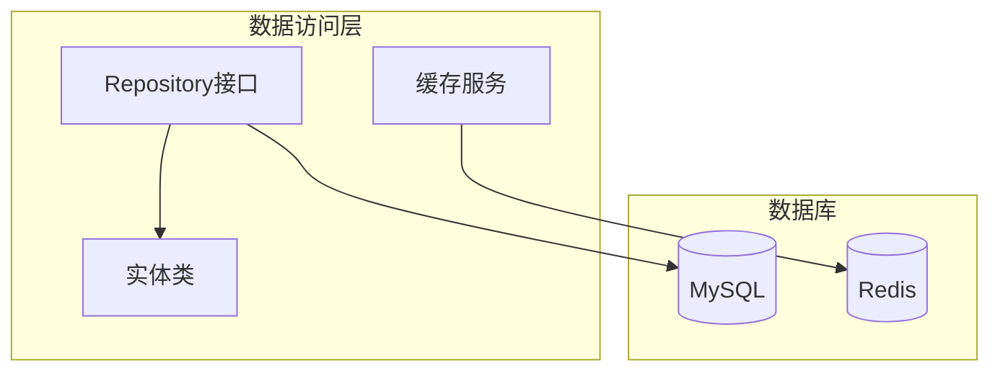
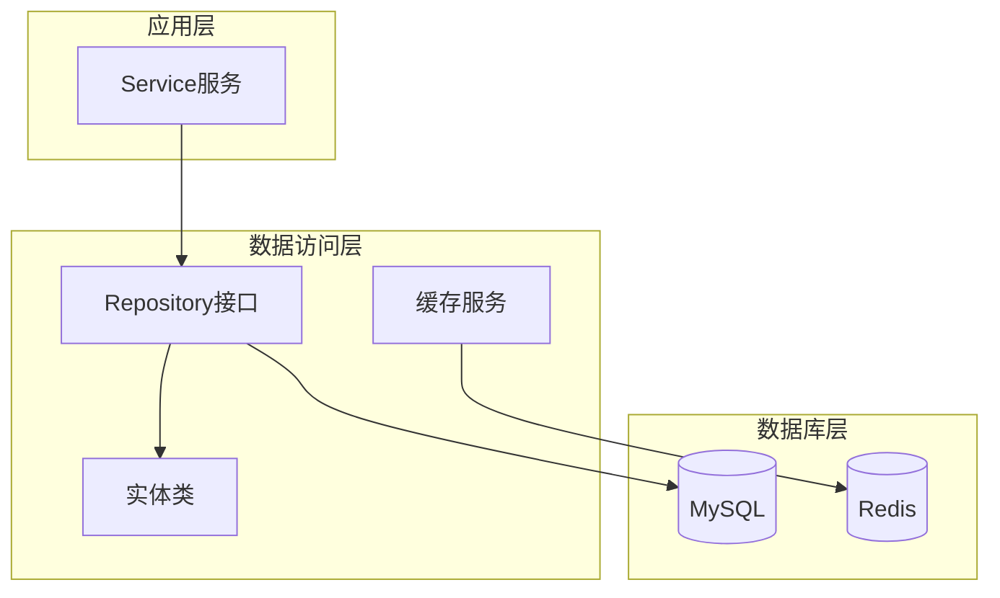
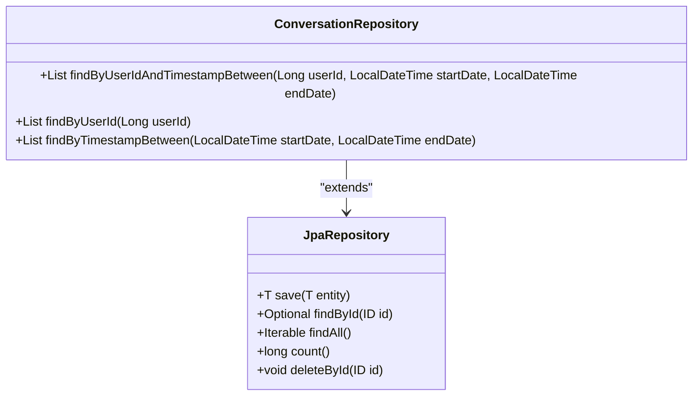
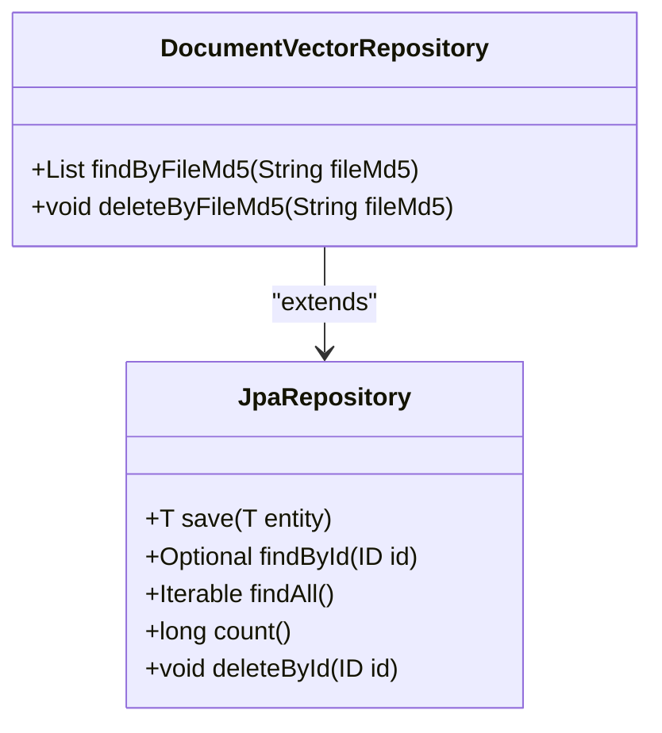
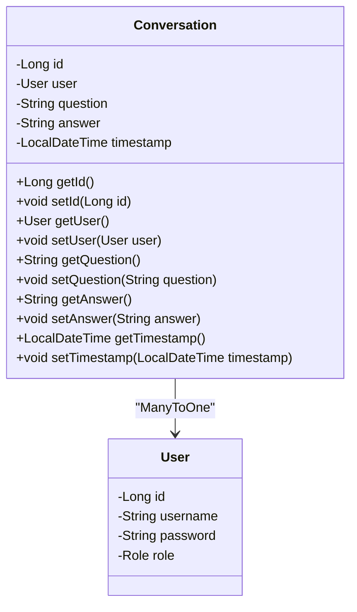
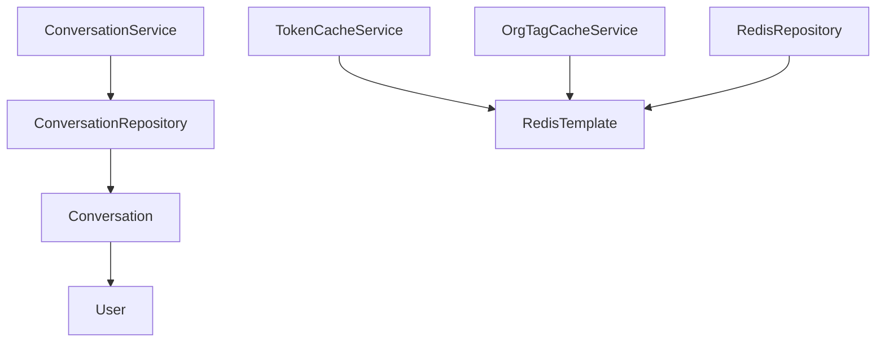
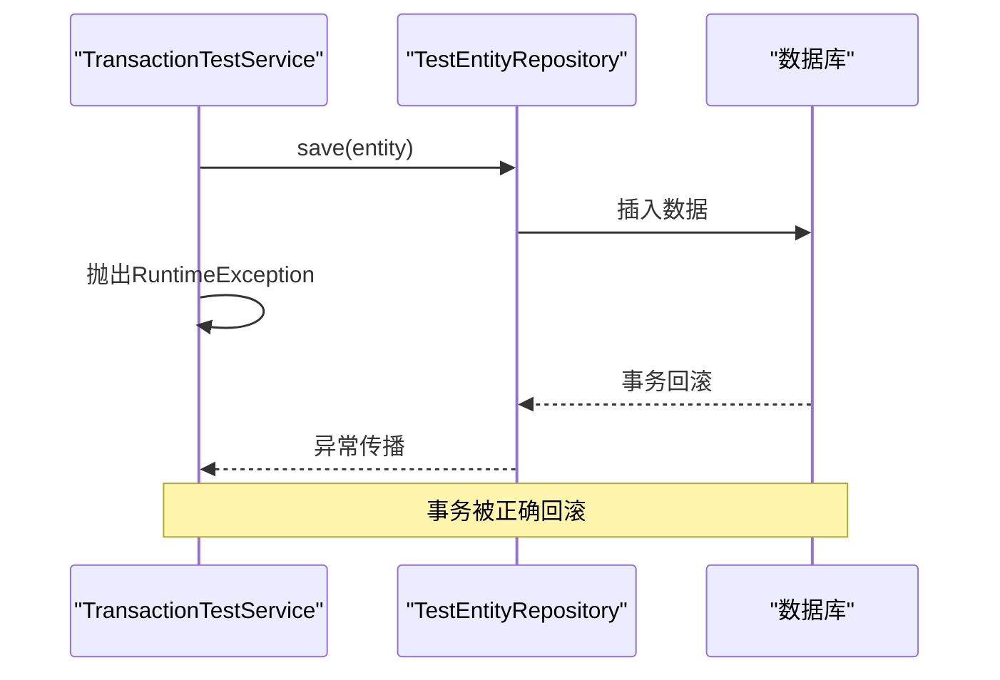
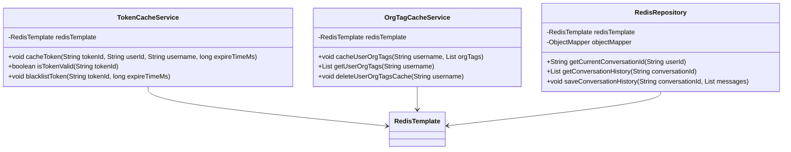
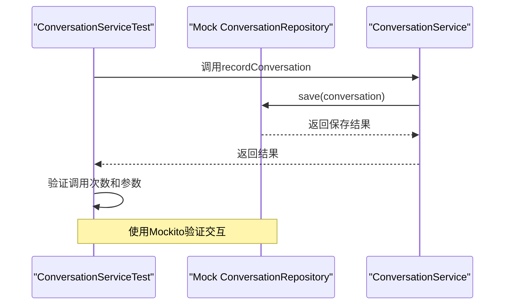

# 数据访问层

<cite>
**本文档引用的文件**   
- [ConversationRepository.java](file://src/main/java/com/yizhaoqi/smartpai/repository/ConversationRepository.java)
- [DocumentVectorRepository.java](file://src/main/java/com/yizhaoqi/smartpai/repository/DocumentVectorRepository.java)
- [Conversation.java](file://src/main/java/com/yizhaoqi/smartpai/model/Conversation.java)
- [DocumentVector.java](file://src/main/java/com/yizhaoqi/smartpai/model/DocumentVector.java)
- [application.yml](file://src/main/resources/application.yml)
- [TransactionTestService.java](file://src/main/java/com/yizhaoqi/smartpai/test/TransactionTestService.java)
- [TokenCacheService.java](file://src/main/java/com/yizhaoqi/smartpai/service/TokenCacheService.java)
- [OrgTagCacheService.java](file://src/main/java/com/yizhaoqi/smartpai/service/OrgTagCacheService.java)
- [RedisRepository.java](file://src/main/java/com/yizhaoqi/smartpai/repository/RedisRepository.java)
- [ConversationServiceTest.java](file://src/test/java/com/yizhaoqi/smartpai/service/ConversationServiceTest.java)
- [UserServiceTest.java](file://src/test/java/com/yizhaoqi/smartpai/service/UserServiceTest.java)
</cite>

## 目录
1. [引言](#引言)
2. [项目结构](#项目结构)
3. [核心组件](#核心组件)
4. [架构概述](#架构概述)
5. [详细组件分析](#详细组件分析)
6. [依赖分析](#依赖分析)
7. [性能考虑](#性能考虑)
8. [故障排除指南](#故障排除指南)
9. [结论](#结论)

## 引言
本文档全面解析PaiSmart后端数据访问层的实现机制，重点阐述基于Spring Data JPA的Repository接口设计与数据库交互模式。通过分析ConversationRepository和DocumentVectorRepository等核心组件，说明JPA Repository的命名规范、@Query注解使用以及分页处理。详细描述实体关系映射、数据库事务传播行为、连接池配置以及性能优化策略（如懒加载、批量操作）。提供典型数据访问场景的代码示例，如会话列表查询的分页实现和向量数据的批量插入。解释数据访问层的缓存策略、异常转换机制和测试方法，为开发者提供高效、安全的数据操作指导。

## 项目结构
PaiSmart项目的后端数据访问层主要位于`src/main/java/com/yizhaoqi/smartpai/repository`目录下，采用标准的Spring Boot分层架构。数据访问层由多个Repository接口组成，每个接口对应一个数据库实体，通过Spring Data JPA实现与MySQL数据库的交互。同时，系统还集成了Redis作为缓存层，用于提高数据访问性能。



**图源**
- [ConversationRepository.java](file://src/main/java/com/yizhaoqi/smartpai/repository/ConversationRepository.java)
- [DocumentVectorRepository.java](file://src/main/java/com/yizhaoqi/smartpai/repository/DocumentVectorRepository.java)

## 核心组件
数据访问层的核心组件包括ConversationRepository、DocumentVectorRepository等JPA Repository接口，以及Conversation、DocumentVector等实体类。这些组件共同构成了系统的数据持久化基础。

**组件源**
- [ConversationRepository.java](file://src/main/java/com/yizhaoqi/smartpai/repository/ConversationRepository.java#L1-L38)
- [DocumentVectorRepository.java](file://src/main/java/com/yizhaoqi/smartpai/repository/DocumentVectorRepository.java#L1-L23)

## 架构概述
PaiSmart数据访问层采用分层架构设计，包括Repository接口层、实体映射层、缓存服务层和数据库层。Repository接口继承自JpaRepository，提供基本的CRUD操作和自定义查询方法。实体类使用JPA注解进行关系映射，定义了数据库表结构和字段属性。缓存服务基于Redis实现，用于存储频繁访问的数据，减少数据库查询压力。



**图源**
- [ConversationRepository.java](file://src/main/java/com/yizhaoqi/smartpai/repository/ConversationRepository.java)
- [TokenCacheService.java](file://src/main/java/com/yizhaoqi/smartpai/service/TokenCacheService.java)

## 详细组件分析
### ConversationRepository分析
ConversationRepository是数据访问层的核心组件之一，负责会话数据的持久化操作。它继承自JpaRepository<Conversation, Long>，自动获得基本的CRUD功能。通过遵循Spring Data JPA的命名规范，定义了多个查询方法。



**图源**
- [ConversationRepository.java](file://src/main/java/com/yizhaoqi/smartpai/repository/ConversationRepository.java#L1-L38)

**组件源**
- [ConversationRepository.java](file://src/main/java/com/yizhaoqi/smartpai/repository/ConversationRepository.java#L1-L38)

### DocumentVectorRepository分析
DocumentVectorRepository包含自定义查询方法，用于处理向量数据的批量操作。通过@Query注解定义原生SQL查询，实现特定的数据库操作。



**图源**
- [DocumentVectorRepository.java](file://src/main/java/com/yizhaoqi/smartpai/repository/DocumentVectorRepository.java#L1-L23)

**组件源**
- [DocumentVectorRepository.java](file://src/main/java/com/yizhaoqi/smartpai/repository/DocumentVectorRepository.java#L1-L23)

### 实体关系映射分析
Conversation实体类定义了会话数据的结构和关系映射，使用JPA注解进行数据库表和字段的映射配置。



**图源**
- [Conversation.java](file://src/main/java/com/yizhaoqi/smartpai/model/Conversation.java#L1-L32)

**组件源**
- [Conversation.java](file://src/main/java/com/yizhaoqi/smartpai/model/Conversation.java#L1-L32)

## 依赖分析
数据访问层的组件之间存在明确的依赖关系。Repository接口依赖于实体类进行数据映射，服务层依赖于Repository接口进行数据操作，缓存服务依赖于RedisTemplate进行缓存管理。



**图源**
- [ConversationService.java](file://src/main/java/com/yizhaoqi/smartpai/service/ConversationService.java)
- [TokenCacheService.java](file://src/main/java/com/yizhaoqi/smartpai/service/TokenCacheService.java)
- [RedisRepository.java](file://src/main/java/com/yizhaoqi/smartpai/repository/RedisRepository.java)

**组件源**
- [ConversationService.java](file://src/main/java/com/yizhaoqi/smartpai/service/ConversationService.java)
- [TokenCacheService.java](file://src/main/java/com/yizhaoqi/smartpai/service/TokenCacheService.java)

## 性能考虑
### 数据库连接池配置
通过application.yml文件配置数据库连接池参数，优化数据库连接管理。

```yaml
spring:
  datasource:
    url: jdbc:mysql://localhost:3306/PaiSmart?useSSL=false&serverTimezone=UTC&allowPublicKeyRetrieval=true
    username: root
    password: 123456
    driver-class-name: com.mysql.cj.jdbc.Driver
  jpa:
    hibernate:
      ddl-auto: update
    show-sql: true
    properties:
      hibernate:
        dialect: org.hibernate.dialect.MySQL8Dialect
```

**组件源**
- [application.yml](file://src/main/resources/application.yml#L1-L15)

### 事务传播行为
通过@Transactional注解管理数据库事务，确保数据一致性。TransactionTestService演示了事务传播行为的测试。



**图源**
- [TransactionTestService.java](file://src/main/java/com/yizhaoqi/smartpai/test/TransactionTestService.java#L1-L34)

**组件源**
- [TransactionTestService.java](file://src/main/java/com/yizhaoqi/smartpai/test/TransactionTestService.java#L1-L34)

### 缓存策略
系统实现了多层缓存策略，包括Token缓存和组织标签缓存，有效减少数据库查询压力。



**图源**
- [TokenCacheService.java](file://src/main/java/com/yizhaoqi/smartpai/service/TokenCacheService.java)
- [OrgTagCacheService.java](file://src/main/java/com/yizhaoqi/smartpai/service/OrgTagCacheService.java)
- [RedisRepository.java](file://src/main/java/com/yizhaoqi/smartpai/repository/RedisRepository.java)

**组件源**
- [TokenCacheService.java](file://src/main/java/com/yizhaoqi/smartpai/service/TokenCacheService.java)
- [OrgTagCacheService.java](file://src/main/java/com/yizhaoqi/smartpai/service/OrgTagCacheService.java)
- [RedisRepository.java](file://src/main/java/com/yizhaoqi/smartpai/repository/RedisRepository.java)

## 故障排除指南
### 异常处理机制
系统通过自定义异常类CustomException实现统一的异常处理，确保错误信息的一致性和可读性。

```java
public class CustomException extends RuntimeException {
    private HttpStatus status;
    
    public CustomException(String message, HttpStatus status) {
        super(message);
        this.status = status;
    }
    
    // getter和setter方法
}
```

**组件源**
- [CustomException.java](file://src/main/java/com/yizhaoqi/smartpai/exception/CustomException.java)

### 测试方法
通过单元测试验证数据访问层的功能正确性，使用Mockito框架模拟Repository依赖。



**图源**
- [ConversationServiceTest.java](file://src/test/java/com/yizhaoqi/smartpai/service/ConversationServiceTest.java#L1-L61)

**组件源**
- [ConversationServiceTest.java](file://src/test/java/com/yizhaoqi/smartpai/service/ConversationServiceTest.java#L1-L61)

## 结论
PaiSmart后端数据访问层采用Spring Data JPA作为核心持久化框架，结合Redis缓存技术，构建了一个高效、可靠的数据访问体系。通过规范的Repository接口设计、合理的实体关系映射、完善的事务管理和多层次的缓存策略，确保了系统的高性能和数据一致性。开发者在进行数据操作时，应遵循JPA的命名规范，合理使用@Query注解，注意事务边界，充分利用缓存机制，以实现最优的性能表现。