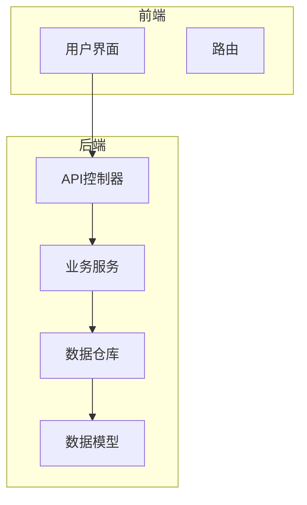
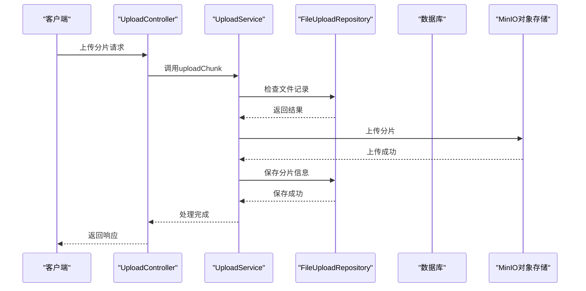
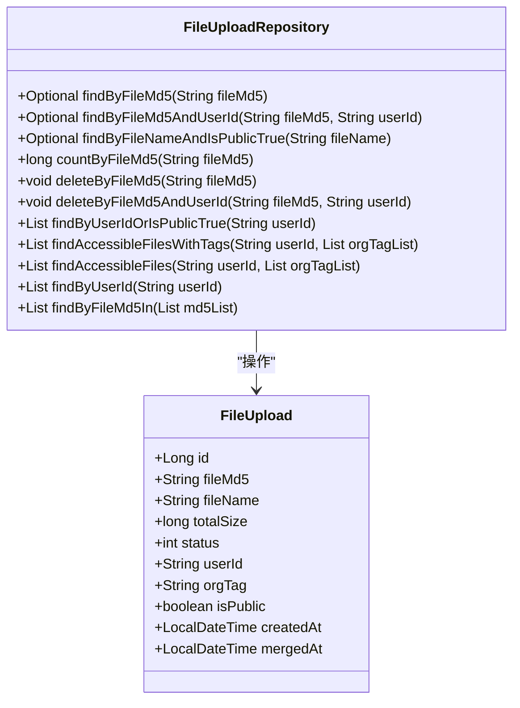
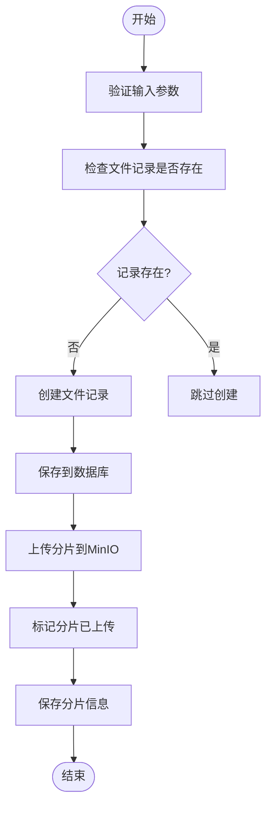
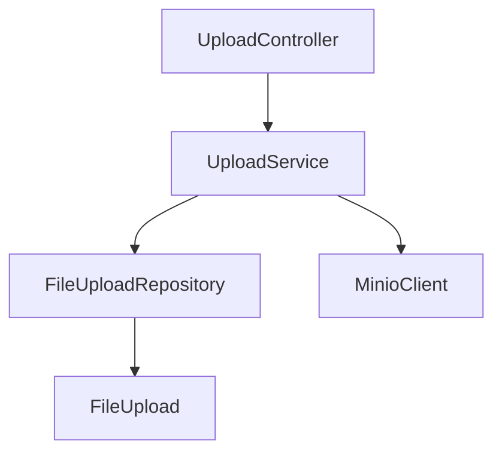

# 文件上传数据仓库

<cite>
**本文档引用的文件**   
- [FileUploadRepository.java](file://src/main/java/com/yizhaoqi/smartpai/repository/FileUploadRepository.java)
- [FileUpload.java](file://src/main/java/com/yizhaoqi/smartpai/model/FileUpload.java)
- [UploadService.java](file://src/main/java/com/yizhaoqi/smartpai/service/UploadService.java)
- [MinioConfig.java](file://src/main/java/com/yizhaoqi/smartpai/config/MinioConfig.java)
- [UploadController.java](file://src/main/java/com/yizhaoqi/smartpai/controller/UploadController.java)
</cite>

## 目录
1. [简介](#简介)
2. [项目结构](#项目结构)
3. [核心组件](#核心组件)
4. [架构概述](#架构概述)
5. [详细组件分析](#详细组件分析)
6. [依赖分析](#依赖分析)
7. [性能考虑](#性能考虑)
8. [故障排除指南](#故障排除指南)
9. [结论](#结论)

## 简介
本文档全面解析了`FileUploadRepository`接口的设计与实现，重点阐述了文件元数据的持久化管理机制。文档详细说明了文件上传记录的存储结构、状态跟踪和生命周期管理，并提供了文件信息查询、状态更新和删除标记的代码示例。结合MinIO对象存储的集成，分析了元数据与实际文件的关联方式、一致性保障和清理策略。同时，文档阐述了分页查询、索引优化和安全性控制的最佳实践。

## 项目结构
项目采用典型的分层架构，前端使用Vue.js框架，后端基于Spring Boot构建。文件上传功能主要集中在后端的`src/main/java/com/yizhaoqi/smartpai`目录下，涉及`controller`、`service`、`repository`和`model`四个核心包。`FileUploadRepository`作为数据访问层，负责与数据库交互，管理文件上传的元数据。

**图示来源**
- [FileUploadRepository.java](file://src/main/java/com/yizhaoqi/smartpai/repository/FileUploadRepository.java)
- [FileUpload.java](file://src/main/java/com/yizhaoqi/smartpai/model/FileUpload.java)

**本节来源**
- [FileUploadRepository.java](file://src/main/java/com/yizhaoqi/smartpai/repository/FileUploadRepository.java)
- [FileUpload.java](file://src/main/java/com/yizhaoqi/smartpai/model/FileUpload.java)

## 核心组件
`FileUploadRepository`是文件上传功能的核心数据访问组件，它继承自Spring Data JPA的`JpaRepository`，提供了对`FileUpload`实体的CRUD操作。该接口定义了多种查询方法，支持基于文件MD5、用户ID、文件名和组织标签的复杂查询，确保了文件元数据的高效管理和访问。

**本节来源**
- [FileUploadRepository.java](file://src/main/java/com/yizhaoqi/smartpai/repository/FileUploadRepository.java)

## 架构概述
系统采用微服务架构，文件上传功能通过`UploadController`暴露REST API，由`UploadService`处理业务逻辑，最终通过`FileUploadRepository`与数据库交互。文件的实际内容存储在MinIO对象存储中，而元数据则存储在关系型数据库中。这种分离设计提高了系统的可扩展性和可靠性。

**图示来源**
- [UploadController.java](file://src/main/java/com/yizhaoqi/smartpai/controller/UploadController.java)
- [UploadService.java](file://src/main/java/com/yizhaoqi/smartpai/service/UploadService.java)
- [FileUploadRepository.java](file://src/main/java/com/yizhaoqi/smartpai/repository/FileUploadRepository.java)

## 详细组件分析
### FileUploadRepository 分析
`FileUploadRepository`接口定义了多种方法，用于管理文件上传的元数据。这些方法包括基于文件MD5的查询、基于用户ID的查询、以及复杂的权限查询。通过这些方法，系统能够高效地管理文件的生命周期，确保数据的一致性和完整性。

#### 接口方法

**图示来源**
- [FileUploadRepository.java](file://src/main/java/com/yizhaoqi/smartpai/repository/FileUploadRepository.java)
- [FileUpload.java](file://src/main/java/com/yizhaoqi/smartpai/model/FileUpload.java)

**本节来源**
- [FileUploadRepository.java](file://src/main/java/com/yizhaoqi/smartpai/repository/FileUploadRepository.java)
- [FileUpload.java](file://src/main/java/com/yizhaoqi/smartpai/model/FileUpload.java)

### UploadService 分析
`UploadService`是文件上传业务逻辑的核心服务，它负责处理文件分片的上传、合并和状态管理。服务通过`FileUploadRepository`与数据库交互，确保文件元数据的正确性。同时，服务还与MinIO对象存储交互，管理文件的实际内容。

#### 服务流程

**图示来源**
- [UploadService.java](file://src/main/java/com/yizhaoqi/smartpai/service/UploadService.java)

**本节来源**
- [UploadService.java](file://src/main/java/com/yizhaoqi/smartpai/service/UploadService.java)

## 依赖分析
`FileUploadRepository`依赖于`FileUpload`实体类，通过JPA注解映射数据库表。`UploadService`依赖于`FileUploadRepository`进行数据访问，同时依赖于`MinioClient`与MinIO对象存储交互。`UploadController`依赖于`UploadService`处理业务逻辑，并通过REST API暴露功能。

**图示来源**
- [UploadController.java](file://src/main/java/com/yizhaoqi/smartpai/controller/UploadController.java)
- [UploadService.java](file://src/main/java/com/yizhaoqi/smartpai/service/UploadService.java)
- [FileUploadRepository.java](file://src/main/java/com/yizhaoqi/smartpai/repository/FileUploadRepository.java)
- [FileUpload.java](file://src/main/java/com/yizhaoqi/smartpai/model/FileUpload.java)

**本节来源**
- [UploadController.java](file://src/main/java/com/yizhaoqi/smartpai/controller/UploadController.java)
- [UploadService.java](file://src/main/java/com/yizhaoqi/smartpai/service/UploadService.java)
- [FileUploadRepository.java](file://src/main/java/com/yizhaoqi/smartpai/repository/FileUploadRepository.java)
- [FileUpload.java](file://src/main/java/com/yizhaoqi/smartpai/model/FileUpload.java)

## 性能考虑
为了提高性能，系统采用了多种优化策略。首先，使用Redis缓存已上传分片的状态，避免频繁的数据库查询。其次，通过分片上传和合并机制，支持大文件的高效上传。最后，数据库查询通过索引优化，确保了查询的高效性。

## 故障排除指南
在文件上传过程中，可能会遇到各种问题。常见的问题包括文件上传失败、分片丢失、权限不足等。建议检查日志文件，确认错误信息，并根据错误类型进行相应的处理。例如，文件上传失败可能是由于网络问题或存储空间不足，分片丢失可能是由于Redis缓存失效，权限不足可能是由于用户权限配置错误。

**本节来源**
- [UploadService.java](file://src/main/java/com/yizhaoqi/smartpai/service/UploadService.java)
- [UploadController.java](file://src/main/java/com/yizhaoqi/smartpai/controller/UploadController.java)

## 结论
`FileUploadRepository`接口的设计与实现充分考虑了文件元数据的持久化管理需求，通过丰富的查询方法和高效的存储机制，确保了文件上传功能的稳定性和可靠性。结合MinIO对象存储的集成，系统实现了元数据与实际文件的分离管理，提高了系统的可扩展性和维护性。未来可以进一步优化查询性能，增加更多的安全控制措施，以满足更复杂的应用场景。