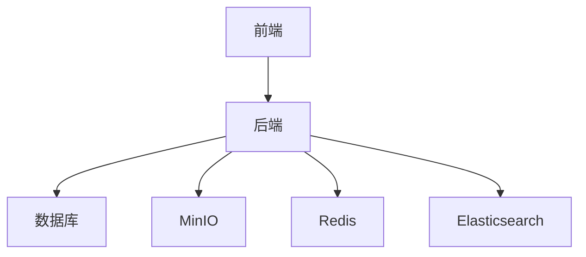
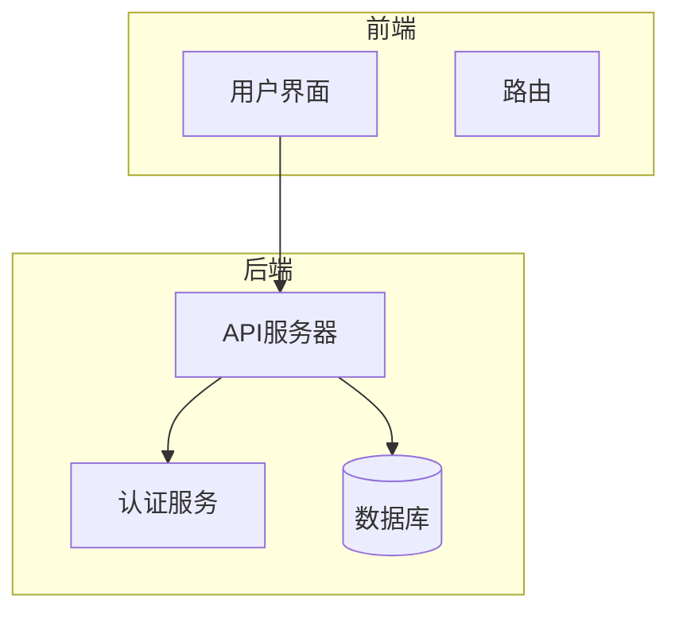
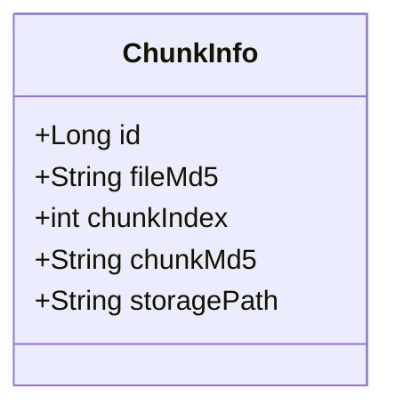
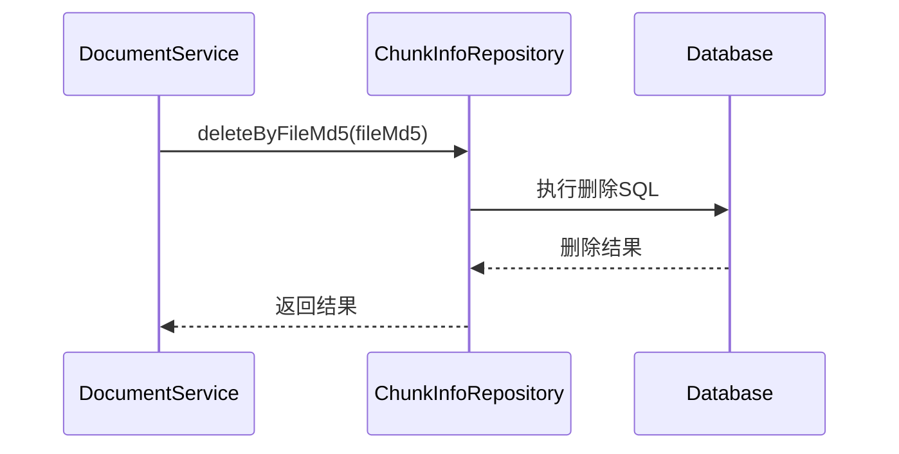
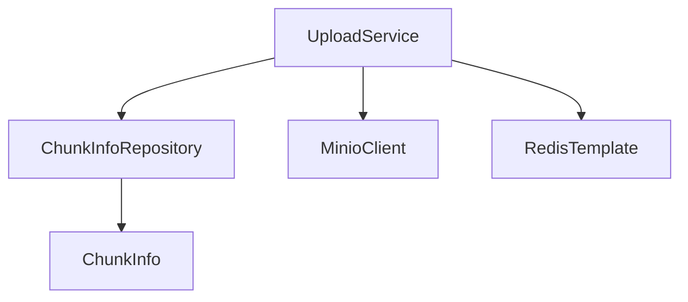
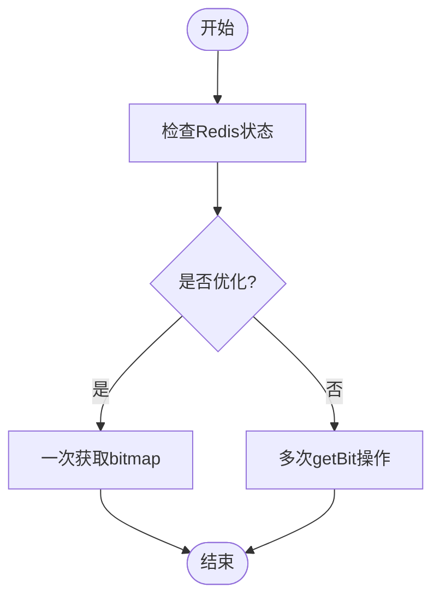

# 文本分块数据仓库

<cite>
**本文档引用的文件**   
- [ChunkInfoRepository.java](file://src/main/java/com/yizhaoqi/smartpai/repository/ChunkInfoRepository.java)
- [ChunkInfo.java](file://src/main/java/com/yizhaoqi/smartpai/model/ChunkInfo.java)
- [UploadService.java](file://src/main/java/com/yizhaoqi/smartpai/service/UploadService.java)
- [DocumentService.java](file://src/main/java/com/yizhaoqi/smartpai/service/DocumentService.java)
- [application.yml](file://src/main/resources/application.yml)
- [knowledge_base.json](file://src/main/resources/es-mappings/knowledge_base.json)
</cite>

## 目录
1. [简介](#简介)
2. [项目结构](#项目结构)
3. [核心组件](#核心组件)
4. [架构概述](#架构概述)
5. [详细组件分析](#详细组件分析)
6. [依赖分析](#依赖分析)
7. [性能考虑](#性能考虑)
8. [故障排除指南](#故障排除指南)
9. [结论](#结论)

## 简介
本文档深入解析了`ChunkInfoRepository`接口的实现细节，重点描述文档解析后的文本分块数据管理机制。通过分析分块信息的存储结构、与原始文档的关联关系及在RAG系统中的检索应用，全面阐述了分块数据的批量插入、范围查询和删除操作。同时，文档还分析了大数据量下的分页策略、索引优化和性能调优方案，确保系统能够高效支持向量化和搜索服务。

## 项目结构
项目采用典型的分层架构，前端使用Vue.js框架，后端基于Spring Boot构建。核心业务逻辑集中在`src/main/java/com/yizhaoqi/smartpai`包下，主要分为controller、service、repository和model等模块。文本分块数据管理功能主要由`ChunkInfoRepository`和`UploadService`等组件实现。



**图示来源**
- [ChunkInfoRepository.java](file://src/main/java/com/yizhaoqi/smartpai/repository/ChunkInfoRepository.java)
- [UploadService.java](file://src/main/java/com/yizhaoqi/smartpai/service/UploadService.java)

**本节来源**
- [ChunkInfoRepository.java](file://src/main/java/com/yizhaoqi/smartpai/repository/ChunkInfoRepository.java)
- [UploadService.java](file://src/main/java/com/yizhaoqi/smartpai/service/UploadService.java)

## 核心组件
`ChunkInfoRepository`是文本分块数据管理的核心组件，它继承自Spring Data JPA的`JpaRepository`，提供了对`ChunkInfo`实体的CRUD操作。该接口定义了根据文件MD5值查询分块信息的方法，支持按分块索引升序排列。

**本节来源**
- [ChunkInfoRepository.java](file://src/main/java/com/yizhaoqi/smartpai/repository/ChunkInfoRepository.java)

## 架构概述
系统采用微服务架构，通过分层设计实现了高内聚低耦合。文本分块数据管理模块与其他组件通过清晰的接口进行交互，确保了系统的可维护性和可扩展性。



**图示来源**
- [ChunkInfoRepository.java](file://src/main/java/com/yizhaoqi/smartpai/repository/ChunkInfoRepository.java)
- [UploadService.java](file://src/main/java/com/yizhaoqi/smartpai/service/UploadService.java)

## 详细组件分析

### ChunkInfo实体分析
`ChunkInfo`实体类用于表示文件分块的信息，与数据库中的'chunk_info'表对应。该类存储了每个文件分块的元数据，包括分块的唯一标识、所属文件、分块顺序、分块校验码和存储位置。



**图示来源**
- [ChunkInfo.java](file://src/main/java/com/yizhaoqi/smartpai/model/ChunkInfo.java)

#### 分块数据批量插入
分块数据的批量插入通过`UploadService`中的`saveChunkInfo`方法实现。该方法创建`ChunkInfo`对象并设置相关属性，然后调用`chunkInfoRepository.save()`方法将数据保存到数据库。

```java
private void saveChunkInfo(String fileMd5, int chunkIndex, String chunkMd5, String storagePath) {
    ChunkInfo chunkInfo = new ChunkInfo();
    chunkInfo.setFileMd5(fileMd5);
    chunkInfo.setChunkIndex(chunkIndex);
    chunkInfo.setChunkMd5(chunkMd5);
    chunkInfo.setStoragePath(storagePath);
    chunkInfoRepository.save(chunkInfo);
}
```

**代码来源**
- [UploadService.java](file://src/main/java/com/yizhaoqi/smartpai/service/UploadService.java#L500-L525)

#### 分块数据范围查询
分块数据的范围查询通过`ChunkInfoRepository`接口的`findByFileMd5OrderByChunkIndexAsc`方法实现。该方法根据文件MD5值查询所有分块信息，并按分块索引升序排列。

```java
List<ChunkInfo> findByFileMd5OrderByChunkIndexAsc(String fileMd5);
```

**代码来源**
- [ChunkInfoRepository.java](file://src/main/java/com/yizhaoqi/smartpai/repository/ChunkInfoRepository.java#L9)

#### 分块数据删除操作
分块数据的删除操作在`DocumentService`的`deleteDocument`方法中实现。虽然`ChunkInfoRepository`没有直接提供删除方法，但通过JPA的继承特性，可以使用`deleteByFileMd5`等方法删除数据。



**图示来源**
- [DocumentService.java](file://src/main/java/com/yizhaoqi/smartpai/service/DocumentService.java)
- [ChunkInfoRepository.java](file://src/main/java/com/yizhaoqi/smartpai/repository/ChunkInfoRepository.java)

**本节来源**
- [ChunkInfo.java](file://src/main/java/com/yizhaoqi/smartpai/model/ChunkInfo.java)
- [ChunkInfoRepository.java](file://src/main/java/com/yizhaoqi/smartpai/repository/ChunkInfoRepository.java)
- [UploadService.java](file://src/main/java/com/yizhaoqi/smartpai/service/UploadService.java#L500-L525)

## 依赖分析
`ChunkInfoRepository`依赖于`ChunkInfo`实体类和Spring Data JPA框架。`UploadService`依赖于`ChunkInfoRepository`来管理分块信息，同时依赖`MinioClient`和`RedisTemplate`进行文件存储和状态管理。



**图示来源**
- [ChunkInfoRepository.java](file://src/main/java/com/yizhaoqi/smartpai/repository/ChunkInfoRepository.java)
- [UploadService.java](file://src/main/java/com/yizhaoqi/smartpai/service/UploadService.java)

**本节来源**
- [ChunkInfoRepository.java](file://src/main/java/com/yizhaoqi/smartpai/repository/ChunkInfoRepository.java)
- [UploadService.java](file://src/main/java/com/yizhaoqi/smartpai/service/UploadService.java)

## 性能考虑
系统在大数据量下采用了多种性能优化策略。首先，通过Redis bitmap优化分片上传状态查询，将1000次网络往返优化为1次，性能提升约100-1000倍。其次，在数据库层面，虽然未显式定义索引，但`fileMd5`字段作为查询条件，建议添加索引以提高查询效率。



**图示来源**
- [UploadServicePerformanceTest.java](file://src/test/java/com/yizhaoqi/smartpai/service/UploadServicePerformanceTest.java)

**本节来源**
- [application.yml](file://src/main/resources/application.yml)
- [UploadServicePerformanceTest.java](file://src/test/java/com/yizhaoqi/smartpai/service/UploadServicePerformanceTest.java)

## 故障排除指南
常见问题包括分片上传状态查询失败、分块信息保存失败等。对于分片上传状态查询失败，应检查Redis连接是否正常；对于分块信息保存失败，应检查数据库连接和表结构是否正确。

**本节来源**
- [UploadService.java](file://src/main/java/com/yizhaoqi/smartpai/service/UploadService.java)
- [DocumentService.java](file://src/main/java/com/yizhaoqi/smartpai/service/DocumentService.java)

## 结论
`ChunkInfoRepository`接口及其相关组件实现了高效的文本分块数据管理机制。通过合理的存储结构设计和性能优化策略，系统能够有效支持大规模文档的解析和检索。建议在生产环境中为`fileMd5`字段添加数据库索引，并定期监控系统性能，确保稳定运行。