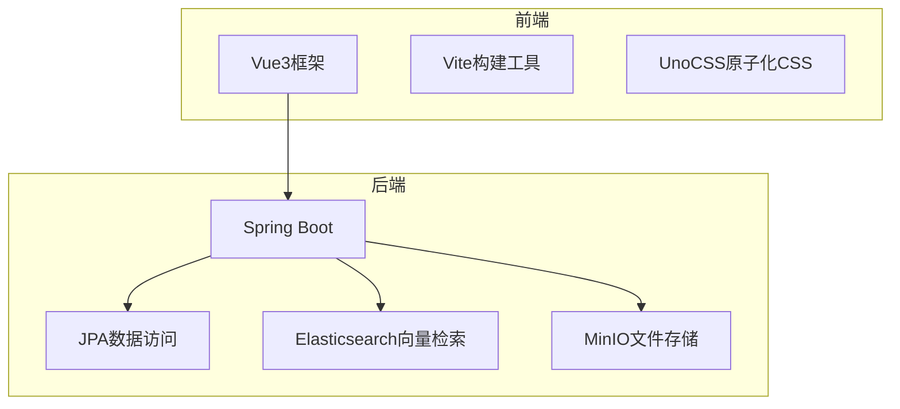
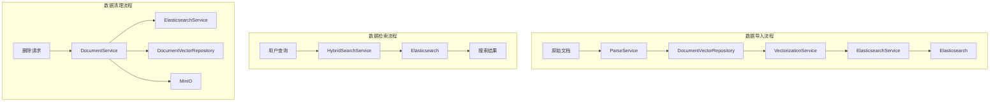
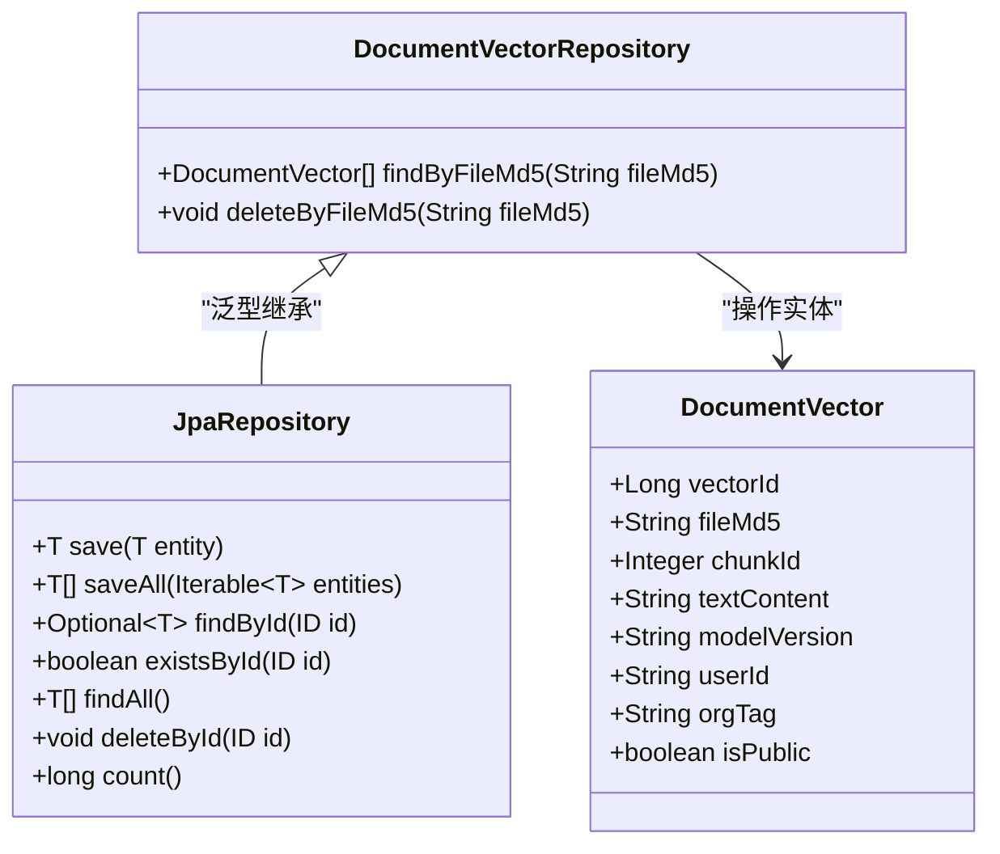
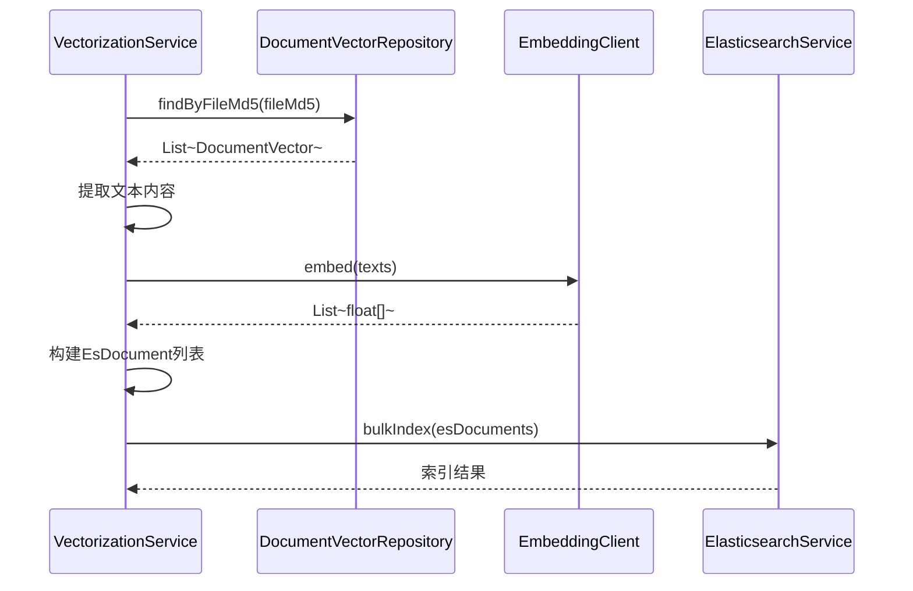
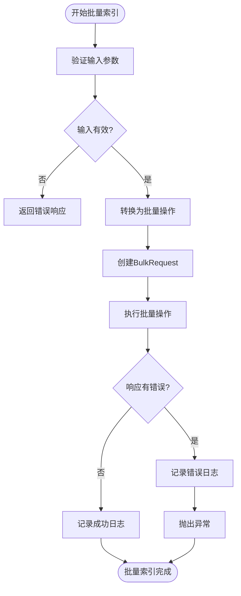
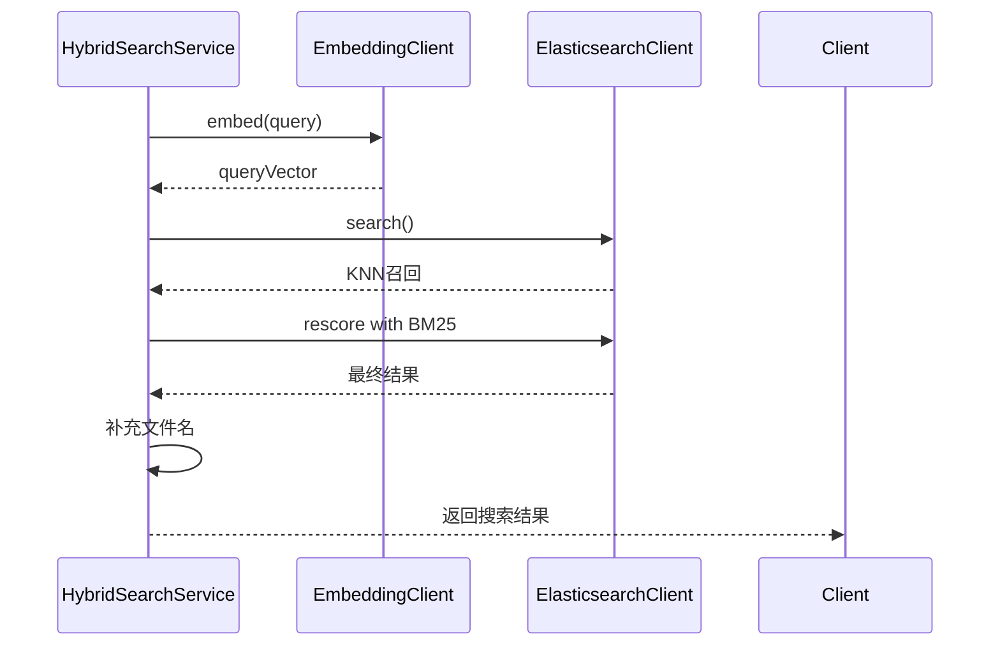
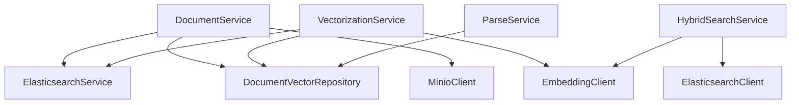

# 文档向量数据仓库

<cite>
**本文档引用的文件**   
- [DocumentVectorRepository.java](file://src/main/java/com/yizhaoqi/smartpai/repository/DocumentVectorRepository.java)
- [VectorizationService.java](file://src/main/java/com/yizhaoqi/smartpai/service/VectorizationService.java)
- [ElasticsearchService.java](file://src/main/java/com/yizhaoqi/smartpai/service/ElasticsearchService.java)
- [EsDocument.java](file://src/main/java/com/yizhaoqi/smartpai/entity/EsDocument.java)
- [EsConfig.java](file://src/main/java/com/yizhaoqi/smartpai/config/EsConfig.java)
- [EsIndexInitializer.java](file://src/main/java/com/yizhaoqi/smartpai/config/EsIndexInitializer.java)
- [knowledge_base.json](file://src/main/resources/es-mappings/knowledge_base.json)
- [ParseService.java](file://src/main/java/com/yizhaoqi/smartpai/service/ParseService.java)
- [DocumentService.java](file://src/main/java/com/yizhaoqi/smartpai/service/DocumentService.java)
- [HybridSearchService.java](file://src/main/java/com/yizhaoqi/smartpai/service/HybridSearchService.java)
- [application.yml](file://src/main/resources/application.yml)
</cite>

## 目录
1. [简介](#简介)
2. [项目结构](#项目结构)
3. [核心组件](#核心组件)
4. [架构概览](#架构概览)
5. [详细组件分析](#详细组件分析)
6. [依赖关系分析](#依赖关系分析)
7. [性能考量](#性能考量)
8. [故障排除指南](#故障排除指南)
9. [结论](#结论)

## 简介
本文档全面解析了基于Elasticsearch的文档向量数据仓库的实现机制。系统采用RAG（检索增强生成）架构，通过将文档分块、向量化并存储到Elasticsearch中，实现了高效的混合搜索功能。文档向量首先存储在关系型数据库中，再批量导入Elasticsearch进行向量检索。系统实现了完整的向量数据生命周期管理，包括导入、更新、清理和权限控制，确保了高并发下的数据访问稳定性。

## 项目结构
项目采用典型的分层架构，前端使用Vue3框架，后端采用Spring Boot微服务架构。文档向量数据仓库的核心功能位于`src/main/java/com/yizhaoqi/smartpai`包下，主要包括`repository`、`service`、`entity`和`config`等模块。



**图示来源**
- [pom.xml](file://pom.xml#L141-L169)
- [vite.config.ts](file://frontend/vite.config.ts)

## 核心组件

文档向量数据仓库的核心组件包括`DocumentVectorRepository`、`VectorizationService`、`ElasticsearchService`和`HybridSearchService`。`DocumentVectorRepository`负责向量元数据的持久化存储，`VectorizationService`协调向量化流程，`ElasticsearchService`提供向量检索能力，`HybridSearchService`实现混合搜索策略。

**组件来源**
- [DocumentVectorRepository.java](file://src/main/java/com/yizhaoqi/smartpai/repository/DocumentVectorRepository.java#L10-L22)
- [VectorizationService.java](file://src/main/java/com/yizhaoqi/smartpai/service/VectorizationService.java#L25-L56)

## 架构概览

系统采用分层架构，实现了数据存储与检索的分离。原始文档首先被解析并分块，分块后的文本内容及其元数据存储在关系型数据库中。随后，系统调用外部嵌入模型生成向量，并将向量数据与元数据一起批量导入Elasticsearch。搜索时，系统结合文本匹配和向量相似度进行混合检索，确保结果的相关性和准确性。



**图示来源**
- [ParseService.java](file://src/main/java/com/yizhaoqi/smartpai/service/ParseService.java#L50-L199)
- [VectorizationService.java](file://src/main/java/com/yizhaoqi/smartpai/service/VectorizationService.java#L55-L101)
- [DocumentService.java](file://src/main/java/com/yizhaoqi/smartpai/service/DocumentService.java#L52-L86)

## 详细组件分析

### DocumentVectorRepository 分析
`DocumentVectorRepository`是Spring Data JPA的接口，负责文档向量元数据的持久化操作。它继承自`JpaRepository`，自动获得了CRUD操作能力。接口中定义了两个自定义方法：`findByFileMd5`用于根据文件MD5查询所有分块，`deleteByFileMd5`用于删除指定文件的所有向量记录。



**图示来源**
- [DocumentVectorRepository.java](file://src/main/java/com/yizhaoqi/smartpai/repository/DocumentVectorRepository.java#L10-L22)
- [DocumentVector.java](file://src/main/java/com/yizhaoqi/smartpai/model/DocumentVector.java#L0-L48)

### VectorizationService 分析
`VectorizationService`是向量化流程的核心协调者。它首先从`DocumentVectorRepository`获取指定文件的文本分块，然后调用`EmbeddingClient`生成向量，最后通过`ElasticsearchService`将向量数据批量导入Elasticsearch。



**图示来源**
- [VectorizationService.java](file://src/main/java/com/yizhaoqi/smartpai/service/VectorizationService.java#L55-L101)
- [ElasticsearchService.java](file://src/main/java/com/yizhaoqi/smartpai/service/ElasticsearchService.java#L22-L43)

### ElasticsearchService 分析
`ElasticsearchService`封装了对Elasticsearch的操作，提供了`bulkIndex`和`deleteByFileMd5`两个核心方法。`bulkIndex`方法使用Elasticsearch的Bulk API进行批量索引，显著提高了索引效率。方法实现了完善的错误处理机制，当批量操作部分失败时会记录详细错误日志。



**图示来源**
- [ElasticsearchService.java](file://src/main/java/com/yizhaoqi/smartpai/service/ElasticsearchService.java#L22-L85)
- [EsDocument.java](file://src/main/java/com/yizhaoqi/smartpai/entity/EsDocument.java#L0-L47)

### HybridSearchService 分析
`HybridSearchService`实现了RAG系统中的混合搜索功能。它结合了KNN向量搜索和BM25文本搜索的优势，通过两阶段检索策略提高了搜索结果的准确性和相关性。服务还实现了细粒度的权限控制，确保用户只能访问其有权限的文档。



**图示来源**
- [HybridSearchService.java](file://src/main/java/com/yizhaoqi/smartpai/service/HybridSearchService.java#L30-L471)
- [EsDocument.java](file://src/main/java/com/yizhaoqi/smartpai/entity/EsDocument.java#L0-L47)

## 依赖关系分析

系统各组件之间存在清晰的依赖关系。`VectorizationService`依赖于`DocumentVectorRepository`、`ElasticsearchService`和`EmbeddingClient`。`HybridSearchService`依赖于`ElasticsearchClient`和`EmbeddingClient`。`DocumentService`作为协调者，依赖于多个服务来完成文档的全生命周期管理。



**图示来源**
- [DocumentService.java](file://src/main/java/com/yizhaoqi/smartpai/service/DocumentService.java#L25-L35)
- [VectorizationService.java](file://src/main/java/com/yizhaoqi/smartpai/service/VectorizationService.java#L25-L35)

## 性能考量

系统在多个层面进行了性能优化。首先，使用Elasticsearch的Bulk API进行批量索引，减少了网络往返次数，显著提高了索引效率。其次，采用两阶段检索策略，先用KNN快速召回候选集，再用BM25精确重排序，平衡了检索速度和结果质量。此外，系统实现了内存使用监控，在内存使用率过高时触发垃圾回收，防止内存溢出。

### 批量插入性能优化
`ElasticsearchService`的`bulkIndex`方法是批量插入性能优化的核心。通过将多个索引操作合并为一个批量请求，大大减少了网络开销和服务器处理开销。该方法还实现了错误检测和日志记录，当部分文档索引失败时，可以精确定位到失败的文档。

```java
public void bulkIndex(List<EsDocument> documents) {
    try {
        logger.info("开始批量索引文档到Elasticsearch，文档数量: {}", documents.size());
        
        List<BulkOperation> bulkOperations = documents.stream()
                .map(doc -> BulkOperation.of(op -> op.index(idx -> idx
                        .index("knowledge_base")
                        .id(doc.getId())
                        .document(doc)
                )))
                .toList();

        BulkRequest request = BulkRequest.of(b -> b.operations(bulkOperations));
        BulkResponse response = esClient.bulk(request);
        
        if (response.errors()) {
            logger.error("批量索引过程中发生错误:");
            for (BulkResponseItem item : response.items()) {
                if (item.error() != null) {
                    logger.error("文档索引失败 - ID: {}, 错误: {}", item.id(), item.error().reason());
                }
            }
            throw new RuntimeException("批量索引部分失败，请检查日志");
        } else {
            logger.info("批量索引成功完成，文档数量: {}", documents.size());
        }
    } catch (Exception e) {
        logger.error("批量索引失败，文档数量: {}", documents.size(), e);
        throw new RuntimeException("批量索引失败", e);
    }
}
```

**代码来源**
- [ElasticsearchService.java](file://src/main/java/com/yizhaoqi/smartpai/service/ElasticsearchService.java#L22-L85)

### 混合搜索性能优化
`HybridSearchService`的`searchWithPermission`方法实现了混合搜索的性能优化。通过设置`recallK = topK * 30`，在第一阶段召回足够多的候选文档，然后在第二阶段使用BM25进行精确重排序。这种两阶段策略既保证了召回率，又提高了排序质量。

```java
s.knn(kn -> kn
    .field("vector")
    .queryVector(queryVector)
    .k(recallK)
    .numCandidates(recallK)
);
s.rescore(r -> r
    .windowSize(recallK)
    .query(rq -> rq
        .queryWeight(0.2d)
        .rescoreQueryWeight(1.0d)
        .query(rqq -> rqq.match(m -> m
            .field("textContent")
            .query(query)
            .operator(Operator.And)
        ))
    )
);
```

**代码来源**
- [HybridSearchService.java](file://src/main/java/com/yizhaoqi/smartpai/service/HybridSearchService.java#L30-L471)

## 故障排除指南

### Elasticsearch连接问题
当出现Elasticsearch连接问题时，首先检查`application.yml`中的配置是否正确。系统在`EsConfig`中配置了基本认证和SSL设置，确保用户名、密码和证书配置正确。如果使用HTTPS，需要确认是否需要忽略证书验证。

```yaml
elasticsearch:
  host: localhost
  port: 9200
  scheme: https
  username: elastic
  password: changeme
```

**配置来源**
- [application.yml](file://src/main/resources/application.yml)
- [EsConfig.java](file://src/main/java/com/yizhaoqi/smartpai/config/EsConfig.java#L22-L38)

### 索引初始化失败
`EsIndexInitializer`在应用启动时自动初始化Elasticsearch索引。如果初始化失败，特别是出现连接关闭异常，系统会等待5秒后自动重试。如果重试仍然失败，需要检查Elasticsearch服务是否正常运行，以及网络连接是否畅通。

```java
if (exception instanceof ConnectionClosedException || 
    (exception.getCause() != null && 
     exception.getCause() instanceof ConnectionClosedException)) {
    logger.error("Elasticsearch连接已关闭，等待5秒后重试...");
    try {
        Thread.sleep(5000);
        initializeIndex();
    } catch (Exception retryException) {
        logger.error("重试初始化索引失败: {}", retryException.getMessage());
        throw new RuntimeException("初始化索引失败", retryException);
    }
}
```

**代码来源**
- [EsIndexInitializer.java](file://src/main/java/com/yizhaoqi/smartpai/config/EsIndexInitializer.java#L18-L81)

### 向量化失败
向量化失败通常由外部嵌入模型服务不可用或网络问题引起。`VectorizationService`中实现了异常处理机制，当向量化失败时会记录错误日志并抛出运行时异常。建议检查`EmbeddingClient`的配置和网络连接。

```java
} catch (Exception e) {
    logger.error("向量化失败，fileMd5: {}", fileMd5, e);
    throw new RuntimeException("向量化失败", e);
}
```

**代码来源**
- [VectorizationService.java](file://src/main/java/com/yizhaoqi/smartpai/service/VectorizationService.java#L95-L101)

## 结论
本文档全面解析了文档向量数据仓库的实现细节。系统通过将文档分块、向量化并存储到Elasticsearch中，实现了高效的混合搜索功能。`DocumentVectorRepository`负责向量元数据的持久化，`VectorizationService`协调向量化流程，`ElasticsearchService`提供高性能的批量索引和检索能力。系统实现了完整的向量数据生命周期管理，包括导入、更新、清理和权限控制，确保了高并发下的数据访问稳定性。通过两阶段检索策略和批量操作优化，系统在保证搜索质量的同时，也实现了优异的性能表现。