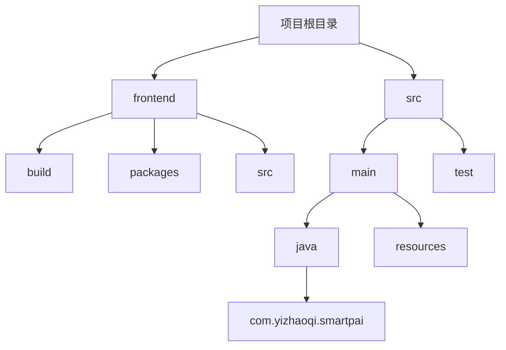
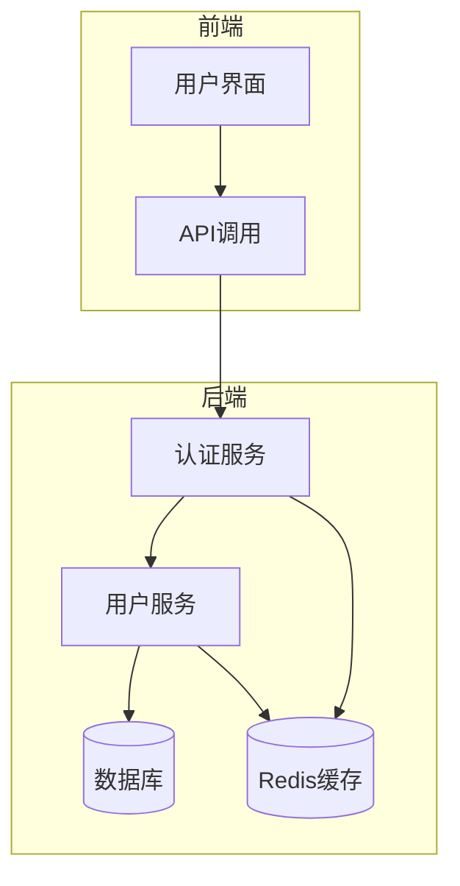
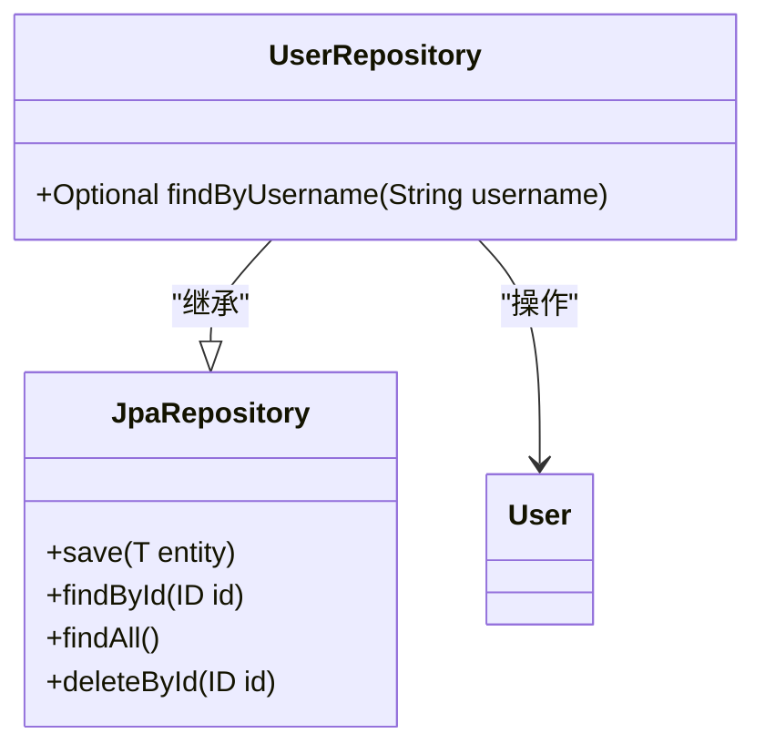
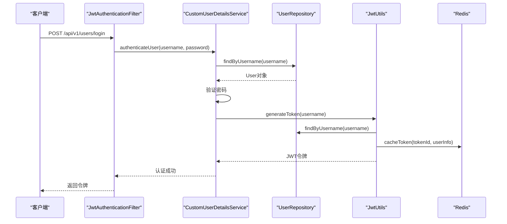
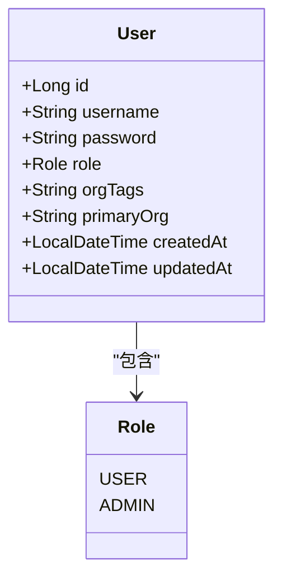
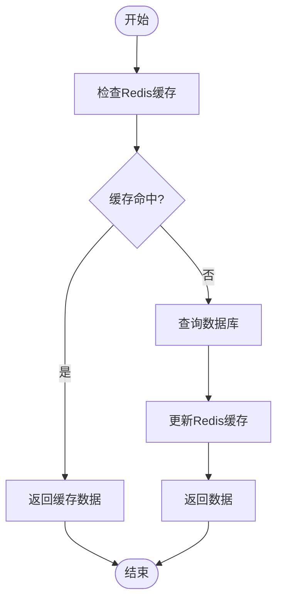
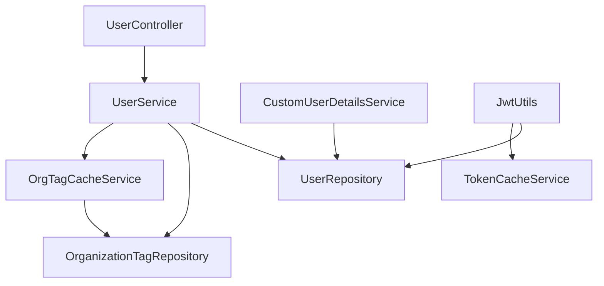

# 用户数据仓库

<cite>
**本文档引用的文件**   
- [UserRepository.java](file://src/main/java/com/yizhaoqi/smartpai/repository/UserRepository.java)
- [CustomUserDetailsService.java](file://src/main/java/com/yizhaoqi/smartpai/service/CustomUserDetailsService.java)
- [SecurityConfig.java](file://src/main/java/com/yizhaoqi/smartpai/config/SecurityConfig.java)
- [JwtAuthenticationFilter.java](file://src/main/java/com/yizhaoqi/smartpai/config/JwtAuthenticationFilter.java)
- [JwtUtils.java](file://src/main/java/com/yizhaoqi/smartpai/utils/JwtUtils.java)
- [UserService.java](file://src/main/java/com/yizhaoqi/smartpai/service/UserService.java)
- [User.java](file://src/main/java/com/yizhaoqi/smartpai/model/User.java)
- [TokenCacheService.java](file://src/main/java/com/yizhaoqi/smartpai/service/TokenCacheService.java)
- [OrgTagCacheService.java](file://src/main/java/com/yizhaoqi/smartpai/service/OrgTagCacheService.java)
- [OrganizationTag.java](file://src/main/java/com/yizhaoqi/smartpai/model/OrganizationTag.java)
- [UserController.java](file://src/main/java/com/yizhaoqi/smartpai/controller/UserController.java)
- [PasswordUtil.java](file://src/main/java/com/yizhaoqi/smartpai/utils/PasswordUtil.java)
- [LogUtils.java](file://src/main/java/com/yizhaoqi/smartpai/utils/LogUtils.java)
- [OrgTagInitializer.java](file://src/main/java/com/yizhaoqi/smartpai/config/OrgTagInitializer.java)
- [AdminUserInitializer.java](file://src/main/java/com/yizhaoqi/smartpai/config/AdminUserInitializer.java)
- [RedisConfig.java](file://src/main/java/com/yizhaoqi/smartpai/config/RedisConfig.java)
- [application.yml](file://src/main/resources/application.yml)
</cite>

## 目录
1. [引言](#引言)
2. [项目结构](#项目结构)
3. [核心组件](#核心组件)
4. [架构概述](#架构概述)
5. [详细组件分析](#详细组件分析)
6. [依赖分析](#依赖分析)
7. [性能考虑](#性能考虑)
8. [故障排除指南](#故障排除指南)
9. [结论](#结论)

## 引言
本文档深入分析了用户数据仓库的设计原理与实现方式，重点阐述了用户信息的持久化机制。详细说明了`findByUsername`方法在认证流程中的关键作用，解释了其与Spring Security的集成方式。分析了用户数据的查询效率、索引优化和缓存策略，提供了用户注册、登录验证和权限查询的代码示例。结合多租户支持需求，说明了数据隔离、安全加密和审计日志的最佳实践，确保用户数据的安全性与合规性。

## 项目结构
项目采用典型的分层架构，前端使用Vue3框架，后端采用Spring Boot构建。主要目录结构包括：
- `frontend`：前端代码，使用Vue3 + Vite构建
- `src/main/java`：后端Java源码，包含controller、service、repository等包
- `src/main/resources`：配置文件和静态资源



**图示来源**
- [项目结构](file://项目结构)

## 核心组件

用户数据仓库的核心组件包括UserRepository、CustomUserDetailsService、JwtUtils等，它们共同实现了用户信息的持久化、认证和授权功能。

**组件来源**
- [UserRepository.java](file://src/main/java/com/yizhaoqi/smartpai/repository/UserRepository.java)
- [CustomUserDetailsService.java](file://src/main/java/com/yizhaoqi/smartpai/service/CustomUserDetailsService.java)
- [JwtUtils.java](file://src/main/java/com/yizhaoqi/smartpai/utils/JwtUtils.java)

## 架构概述

系统采用前后端分离架构，使用JWT进行无状态认证，通过Redis实现令牌缓存和黑名单管理。



**图示来源**
- [SecurityConfig.java](file://src/main/java/com/yizhaoqi/smartpai/config/SecurityConfig.java)
- [JwtAuthenticationFilter.java](file://src/main/java/com/yizhaoqi/smartpai/config/JwtAuthenticationFilter.java)

## 详细组件分析

### UserRepository分析

UserRepository接口继承自JpaRepository，提供了基本的CRUD操作，并定义了findByUsername方法用于用户认证。



**图示来源**
- [UserRepository.java](file://src/main/java/com/yizhaoqi/smartpai/repository/UserRepository.java)
- [User.java](file://src/main/java/com/yizhaoqi/smartpai/model/User.java)

**组件来源**
- [UserRepository.java](file://src/main/java/com/yizhaoqi/smartpai/repository/UserRepository.java)

### 认证流程分析

用户认证流程涉及多个组件的协作，从HTTP请求到最终的JWT令牌生成。



**图示来源**
- [UserController.java](file://src/main/java/com/yizhaoqi/smartpai/controller/UserController.java)
- [UserService.java](file://src/main/java/com/yizhaoqi/smartpai/service/UserService.java)
- [JwtUtils.java](file://src/main/java/com/yizhaoqi/smartpai/utils/JwtUtils.java)

**组件来源**
- [UserController.java](file://src/main/java/com/yizhaoqi/smartpai/controller/UserController.java)
- [UserService.java](file://src/main/java/com/yizhaoqi/smartpai/service/UserService.java)

### 用户数据结构分析

User实体类定义了用户的核心数据结构，包括基本信息、角色、组织标签等。



**图示来源**
- [User.java](file://src/main/java/com/yizhaoqi/smartpai/model/User.java)

**组件来源**
- [User.java](file://src/main/java/com/yizhaoqi/smartpai/model/User.java)

### 缓存策略分析

系统采用Redis缓存策略，对JWT令牌和用户组织标签信息进行缓存，提高查询效率。



**图示来源**
- [TokenCacheService.java](file://src/main/java/com/yizhaoqi/smartpai/service/TokenCacheService.java)
- [OrgTagCacheService.java](file://src/main/java/com/yizhaoqi/smartpai/service/OrgTagCacheService.java)

**组件来源**
- [TokenCacheService.java](file://src/main/java/com/yizhaoqi/smartpai/service/TokenCacheService.java)
- [OrgTagCacheService.java](file://src/main/java/com/yizhaoqi/smartpai/service/OrgTagCacheService.java)

## 依赖分析

系统各组件之间的依赖关系清晰，遵循了依赖倒置原则。



**图示来源**
- [UserService.java](file://src/main/java/com/yizhaoqi/smartpai/service/UserService.java)
- [CustomUserDetailsService.java](file://src/main/java/com/yizhaoqi/smartpai/service/CustomUserDetailsService.java)
- [JwtUtils.java](file://src/main/java/com/yizhaoqi/smartpai/utils/JwtUtils.java)

**组件来源**
- [UserService.java](file://src/main/java/com/yizhaoqi/smartpai/service/UserService.java)
- [CustomUserDetailsService.java](file://src/main/java/com/yizhaoqi/smartpai/service/CustomUserDetailsService.java)

## 性能考虑

系统在性能方面做了多项优化：
1. 使用Redis缓存频繁访问的数据，减少数据库查询
2. 对JWT令牌进行缓存和黑名单管理，提高验证效率
3. 采用连接池管理数据库连接
4. 对大文件上传采用分片处理

配置文件中设置了合理的超时和缓存策略：
```yaml
spring:
  redis:
    host: localhost
    port: 6379
  datasource:
    url: jdbc:mysql://localhost:3306/PaiSmart?useSSL=false&serverTimezone=UTC&allowPublicKeyRetrieval=true
```

**组件来源**
- [application.yml](file://src/main/resources/application.yml)
- [RedisConfig.java](file://src/main/java/com/yizhaoqi/smartpai/config/RedisConfig.java)

## 故障排除指南

### 常见问题及解决方案

1. **用户无法登录**
   - 检查用户名和密码是否正确
   - 确认用户账户是否存在
   - 检查数据库连接是否正常

2. **JWT令牌验证失败**
   - 检查密钥配置是否正确
   - 确认令牌是否过期
   - 检查Redis服务是否正常运行

3. **缓存不生效**
   - 确认Redis配置是否正确
   - 检查网络连接是否正常
   - 验证缓存键名是否正确

**组件来源**
- [JwtAuthenticationFilter.java](file://src/main/java/com/yizhaoqi/smartpai/config/JwtAuthenticationFilter.java)
- [TokenCacheService.java](file://src/main/java/com/yizhaoqi/smartpai/service/TokenCacheService.java)

## 结论

用户数据仓库设计合理，实现了完整的用户管理功能。通过JpaRepository实现数据持久化，结合Spring Security和JWT实现安全认证，使用Redis提高系统性能。多租户支持通过组织标签实现数据隔离，密码使用BCrypt加密确保安全，操作日志记录完整，符合安全合规要求。系统架构清晰，组件职责明确，易于维护和扩展。