# 组织标签数据仓库

<cite>
**本文档引用的文件**
- [OrganizationTagRepository.java](file://src/main/java/com/yizhaoqi/smartpai/repository/OrganizationTagRepository.java)
- [OrganizationTag.java](file://src/main/java/com/yizhaoqi/smartpai/model/OrganizationTag.java)
- [UserService.java](file://src/main/java/com/yizhaoqi/smartpai/service/UserService.java)
- [OrgTagCacheService.java](file://src/main/java/com/yizhaoqi/smartpai/service/OrgTagCacheService.java)
- [AdminController.java](file://src/main/java/com/yizhaoqi/smartpai/controller/AdminController.java)
- [DocumentService.java](file://src/main/java/com/yizhaoqi/smartpai/service/DocumentService.java)
- [FileUploadRepository.java](file://src/main/java/com/yizhaoqi/smartpai/repository/FileUploadRepository.java)
- [org-tag-cascader.vue](file://frontend/src/components/custom/org-tag-cascader.vue)
- [org-tag-operate-dialog.vue](file://frontend/src/views/org-tag/modules/org-tag-operate-dialog.vue)
- [TransactionTestService.java](file://src/main/java/com/yizhaoqi/smartpai/test/TransactionTestService.java)
</cite>

## 目录
1. [引言](#引言)
2. [项目结构](#项目结构)
3. [核心组件](#核心组件)
4. [架构概览](#架构概览)
5. [详细组件分析](#详细组件分析)
6. [依赖分析](#依赖分析)
7. [性能考量](#性能考量)
8. [故障排除指南](#故障排除指南)
9. [结论](#结论)

## 引言
本文档详细解析了组织标签数据仓库的实现逻辑，重点描述了企业级多租户支持下的组织标签管理机制。系统通过标签的增删改查操作实现了灵活的权限控制，支持标签层级结构的维护和关联查询。文档深入分析了数据一致性保障、事务传播行为和并发访问控制策略，确保在高并发场景下的数据完整性。同时，结合实际业务需求，阐述了缓存更新策略和性能优化方案。

## 项目结构
项目采用前后端分离的架构设计，前端位于`frontend`目录，后端位于`src/main/java`目录。后端采用Spring Boot框架，实现了组织标签的完整生命周期管理。

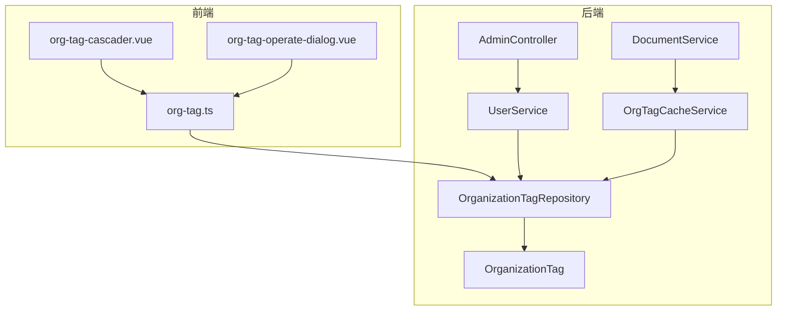

**图示来源**
- [org-tag-cascader.vue](file://frontend/src/components/custom/org-tag-cascader.vue)
- [OrganizationTagRepository.java](file://src/main/java/com/yizhaoqi/smartpai/repository/OrganizationTagRepository.java)

**本节来源**
- [project_structure](file://project_structure)

## 核心组件
组织标签系统的核心组件包括数据模型、数据仓库、服务层和控制器。`OrganizationTag`实体类定义了标签的基本属性，`OrganizationTagRepository`提供了数据访问接口，`UserService`实现了业务逻辑，`AdminController`暴露了REST API。

**本节来源**
- [OrganizationTag.java](file://src/main/java/com/yizhaoqi/smartpai/model/OrganizationTag.java)
- [OrganizationTagRepository.java](file://src/main/java/com/yizhaoqi/smartpai/repository/OrganizationTagRepository.java)
- [UserService.java](file://src/main/java/com/yizhaoqi/smartpai/service/UserService.java)
- [AdminController.java](file://src/main/java/com/yizhaoqi/smartpai/controller/AdminController.java)

## 架构概览
系统采用分层架构，从前端组件到后端服务形成了完整的调用链路。前端组件通过API与后端交互，后端服务通过Repository访问数据库，并利用缓存提高性能。

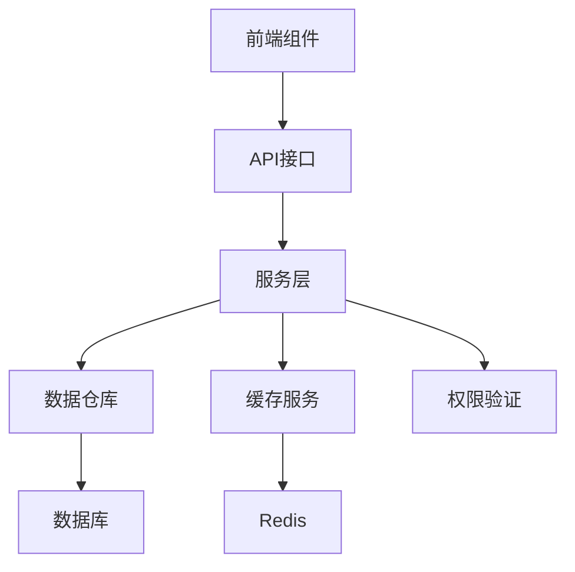

**图示来源**
- [org-tag-cascader.vue](file://frontend/src/components/custom/org-tag-cascader.vue)
- [AdminController.java](file://src/main/java/com/yizhaoqi/smartpai/controller/AdminController.java)
- [UserService.java](file://src/main/java/com/yizhaoqi/smartpai/service/UserService.java)
- [OrgTagCacheService.java](file://src/main/java/com/yizhaoqi/smartpai/service/OrgTagCacheService.java)

## 详细组件分析

### 组织标签数据模型分析
`OrganizationTag`实体类定义了组织标签的核心数据结构，支持树形层级关系。

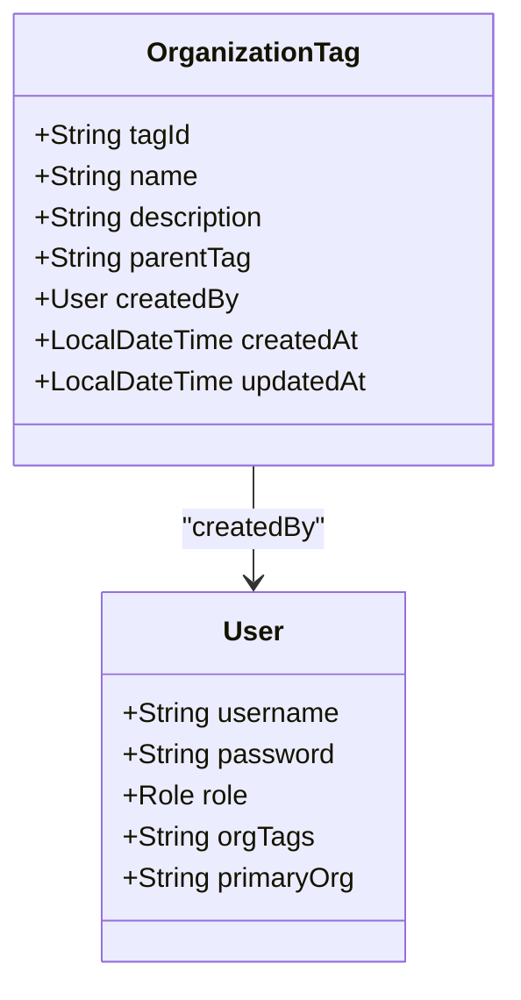

**图示来源**
- [OrganizationTag.java](file://src/main/java/com/yizhaoqi/smartpai/model/OrganizationTag.java)
- [User.java](file://src/main/java/com/yizhaoqi/smartpai/model/User.java)

**本节来源**
- [OrganizationTag.java](file://src/main/java/com/yizhaoqi/smartpai/model/OrganizationTag.java)

### 组织标签仓库接口分析
`OrganizationTagRepository`接口继承自`JpaRepository`，提供了基本的CRUD操作和自定义查询方法。

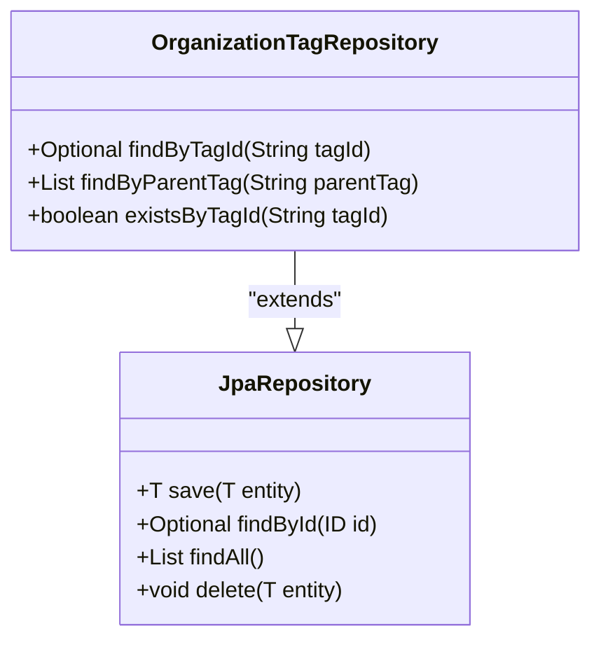

**图示来源**
- [OrganizationTagRepository.java](file://src/main/java/com/yizhaoqi/smartpai/repository/OrganizationTagRepository.java)

**本节来源**
- [OrganizationTagRepository.java](file://src/main/java/com/yizhaoqi/smartpai/repository/OrganizationTagRepository.java)

### 组织标签服务层分析
`UserService`中的组织标签管理方法实现了复杂的业务逻辑，包括层级结构维护和权限验证。

#### 标签层级结构维护
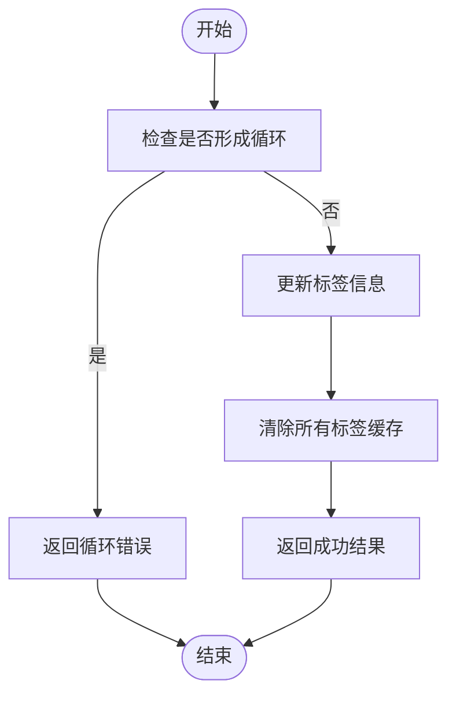

**图示来源**
- [UserService.java](file://src/main/java/com/yizhaoqi/smartpai/service/UserService.java#L508-L543)

**本节来源**
- [UserService.java](file://src/main/java/com/yizhaoqi/smartpai/service/UserService.java#L475-L674)

#### 标签树形结构构建
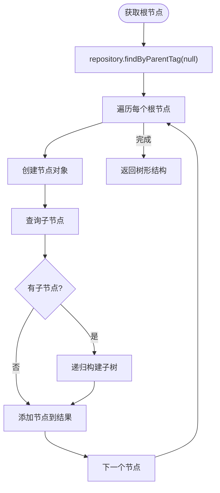

**图示来源**
- [UserService.java](file://src/main/java/com/yizhaoqi/smartpai/service/UserService.java#L475-L510)

### 组织标签缓存服务分析
`OrgTagCacheService`实现了多级缓存策略，提高权限验证效率。

#### 用户有效标签获取流程
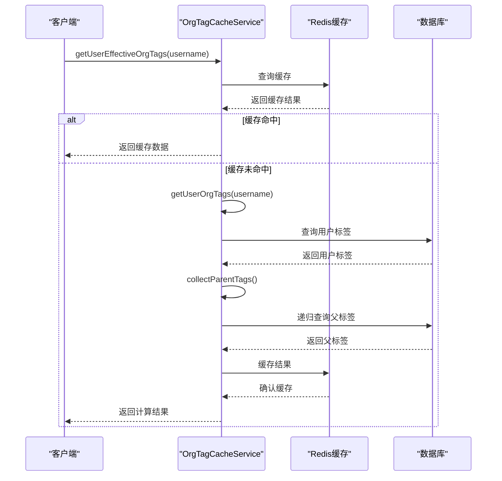

**图示来源**
- [OrgTagCacheService.java](file://src/main/java/com/yizhaoqi/smartpai/service/OrgTagCacheService.java#L125-L231)

**本节来源**
- [OrgTagCacheService.java](file://src/main/java/com/yizhaoqi/smartpai/service/OrgTagCacheService.java#L125-L231)

### 组织标签事务管理分析
系统通过Spring事务管理确保数据一致性，特别是在标签层级结构变更时。

#### 事务传播行为分析
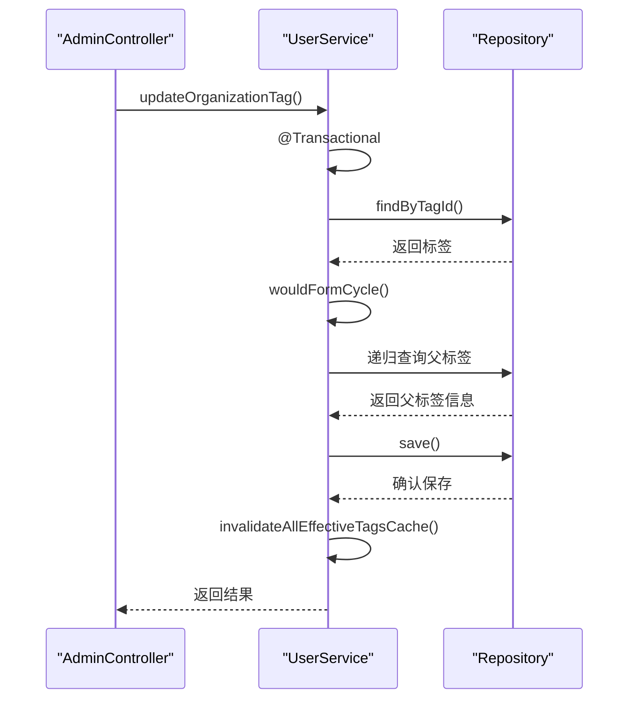

**图示来源**
- [UserService.java](file://src/main/java/com/yizhaoqi/smartpai/service/UserService.java#L508-L543)
- [TransactionTestService.java](file://src/main/java/com/yizhaoqi/smartpai/test/TransactionTestService.java)

**本节来源**
- [UserService.java](file://src/main/java/com/yizhaoqi/smartpai/service/UserService.java#L508-L543)
- [TransactionTestService.java](file://src/main/java/com/yizhaoqi/smartpai/test/TransactionTestService.java)

### 组织标签权限控制分析
标签系统与文档管理深度集成，实现基于标签的细粒度权限控制。

#### 文档权限查询流程
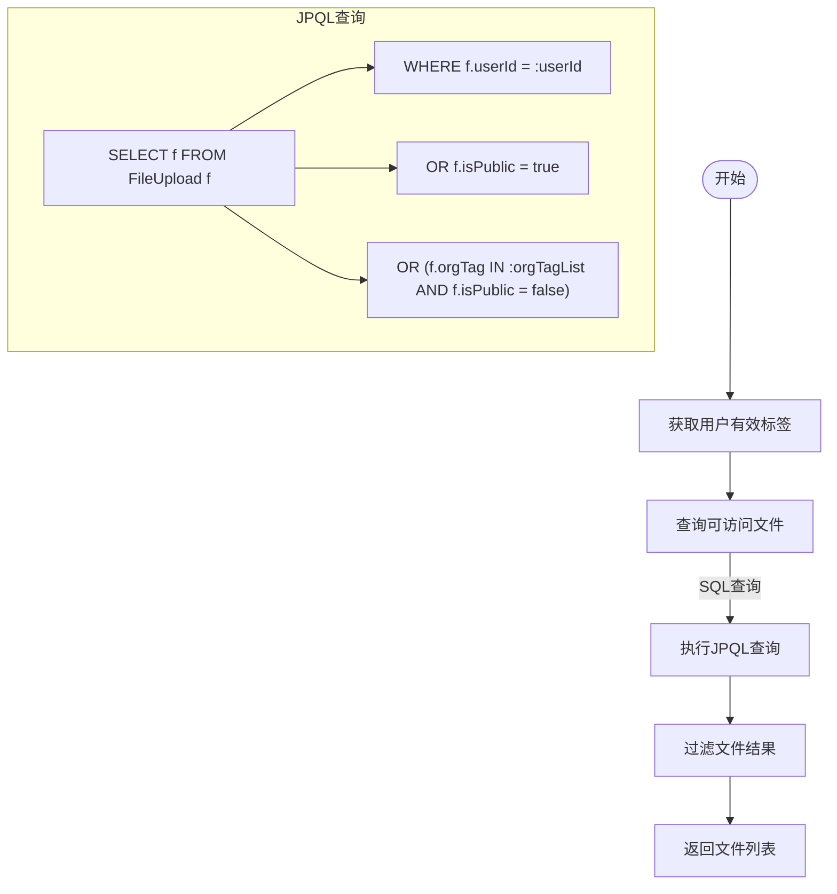

**图示来源**
- [DocumentService.java](file://src/main/java/com/yizhaoqi/smartpai/service/DocumentService.java#L0-L199)
- [FileUploadRepository.java](file://src/main/java/com/yizhaoqi/smartpai/repository/FileUploadRepository.java#L0-L64)

**本节来源**
- [DocumentService.java](file://src/main/java/com/yizhaoqi/smartpai/service/DocumentService.java#L0-L199)
- [FileUploadRepository.java](file://src/main/java/com/yizhaoqi/smartpai/repository/FileUploadRepository.java#L0-L64)

### 前端组件分析
前端组件实现了组织标签的可视化展示和交互功能。

#### 组织标签级联选择器
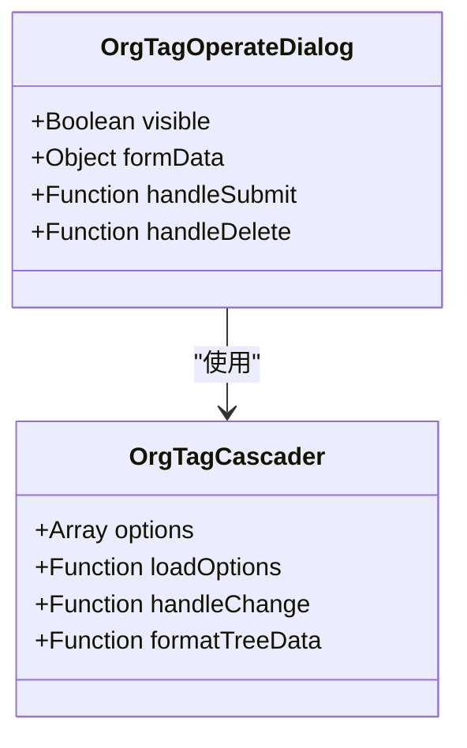

**图示来源**
- [org-tag-cascader.vue](file://frontend/src/components/custom/org-tag-cascader.vue)
- [org-tag-operate-dialog.vue](file://frontend/src/views/org-tag/modules/org-tag-operate-dialog.vue)

**本节来源**
- [org-tag-cascader.vue](file://frontend/src/components/custom/org-tag-cascader.vue)
- [org-tag-operate-dialog.vue](file://frontend/src/views/org-tag/modules/org-tag-operate-dialog.vue)

## 依赖分析
系统各组件之间存在明确的依赖关系，形成了清晰的调用链路。

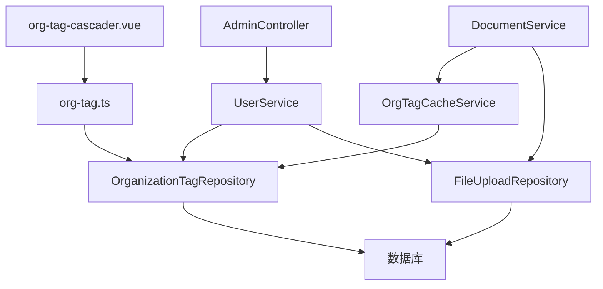

**图示来源**
- [project_structure](file://project_structure)
- [dependency_analysis](file://dependency_analysis)

**本节来源**
- [project_structure](file://project_structure)

## 性能考量
系统通过多种策略优化性能，特别是在高并发场景下。

### 缓存策略
- **多级缓存**：使用Redis缓存用户组织标签和有效标签集合
- **缓存失效**：在标签结构变更时清除所有相关缓存
- **TTL设置**：缓存有效期为24小时，平衡性能和数据新鲜度

### 数据库优化
- **索引优化**：在`tag_id`和`parent_tag`字段上建立索引
- **批量操作**：支持批量查询和更新操作
- **连接池**：使用HikariCP连接池管理数据库连接

**本节来源**
- [OrgTagCacheService.java](file://src/main/java/com/yizhaoqi/smartpai/service/OrgTagCacheService.java)
- [OrganizationTagRepository.java](file://src/main/java/com/yizhaoqi/smartpai/repository/OrganizationTagRepository.java)

## 故障排除指南
### 常见问题及解决方案
1. **标签循环引用问题**
   - **现象**：无法设置父标签
   - **原因**：形成了标签层级循环
   - **解决方案**：检查`wouldFormCycle`方法的逻辑

2. **缓存不一致问题**
   - **现象**：权限验证结果与预期不符
   - **原因**：缓存未及时更新
   - **解决方案**：检查`invalidateAllEffectiveTagsCache`调用

3. **事务回滚问题**
   - **现象**：操作部分成功
   - **原因**：事务传播行为不当
   - **解决方案**：检查`@Transactional`注解的使用

**本节来源**
- [UserService.java](file://src/main/java/com/yizhaoqi/smartpai/service/UserService.java)
- [OrgTagCacheService.java](file://src/main/java/com/yizhaoqi/smartpai/service/OrgTagCacheService.java)

## 结论
组织标签数据仓库实现了完整的企业级多租户支持，通过树形层级结构和缓存机制提供了高效的权限管理。系统在数据一致性、事务管理和并发控制方面表现出色，能够满足高并发场景下的业务需求。前端组件与后端API的紧密配合，为用户提供了直观易用的界面体验。