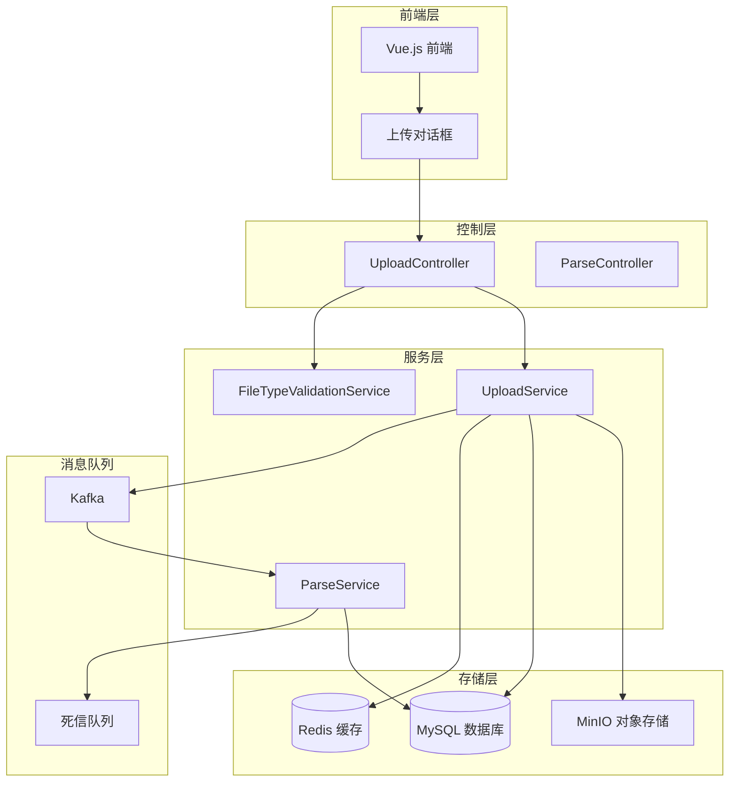
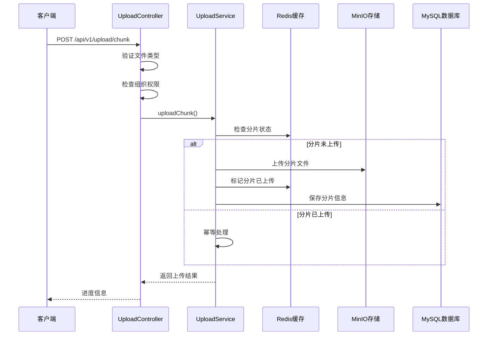
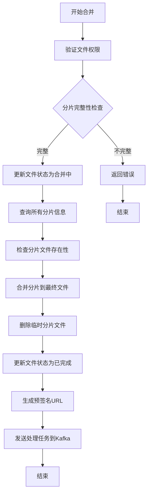
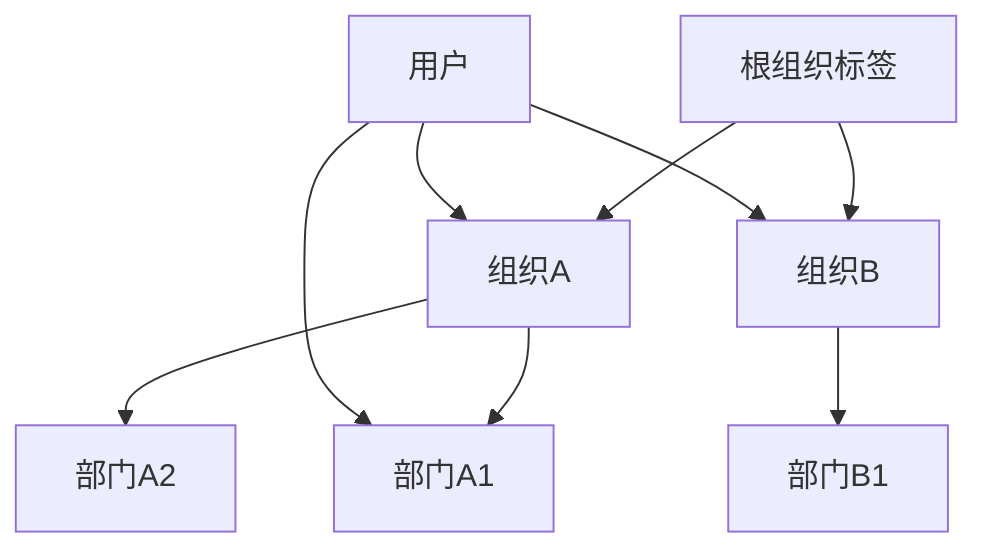
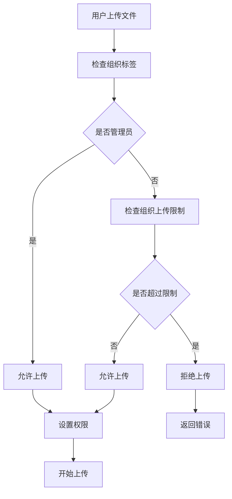
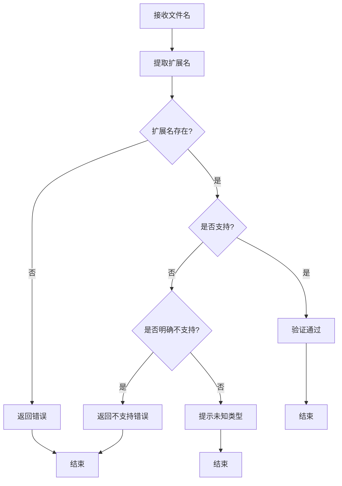
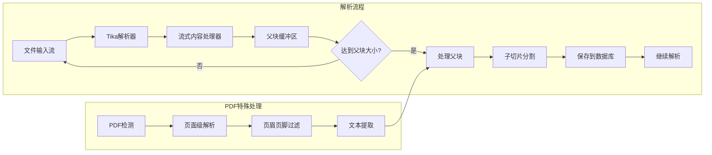
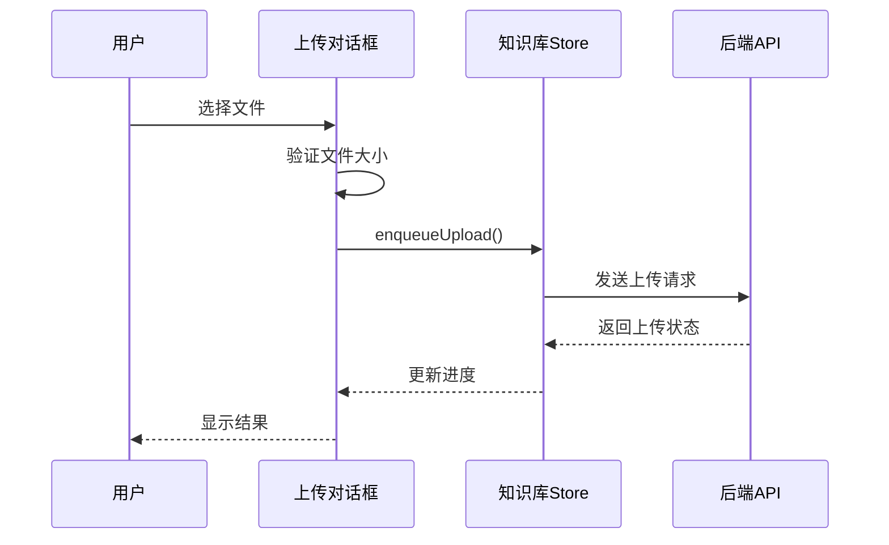

# 文件上传系统

<cite>
**本文档引用的文件**
- [UploadController.java](file://src/main/java/com/yizhaoqi/smartpai/controller/UploadController.java)
- [UploadService.java](file://src/main/java/com/yizhaoqi/smartpai/service/UploadService.java)
- [FileUpload.java](file://src/main/java/com/yizhaoqi/smartpai/model/FileUpload.java)
- [ChunkInfo.java](file://src/main/java/com/yizhaoqi/smartpai/model/ChunkInfo.java)
- [FileUploadRepository.java](file://src/main/java/com/yizhaoqi/smartpai/repository/FileUploadRepository.java)
- [ChunkInfoRepository.java](file://src/main/java/com/yizhaoqi/smartpai/repository/ChunkInfoRepository.java)
- [FileTypeValidationService.java](file://src/main/java/com/yizhaoqi/smartpai/service/FileTypeValidationService.java)
- [ParseService.java](file://src/main/java/com/yizhaoqi/smartpai/service/ParseService.java)
- [MinioConfig.java](file://src/main/java/com/yizhaoqi/smartpai/config/MinioConfig.java)
- [application.yml](file://src/main/resources/application.yml)
- [ddl.sql](file://docs/databases/ddl.sql)
- [upload-dialog.vue](file://frontend/src/views/knowledge-base/modules/upload-dialog.vue)
- [UploadServiceTest.java](file://src/test/java/com/yizhaoqi/smartpai/service/UploadServiceTest.java)
</cite>

## 目录
1. [项目概述](#项目概述)
2. [系统架构](#系统架构)
3. [核心组件](#核心组件)
4. [文件上传流程](#文件上传流程)
5. [分片存储机制](#分片存储机制)
6. [权限控制与组织标签](#权限控制与组织标签)
7. [文件类型验证](#文件类型验证)
8. [解析与向量化](#解析与向量化)
9. [前端集成](#前端集成)
10. [性能优化](#性能优化)
11. [故障排查](#故障排查)
12. [总结](#总结)

## 项目概述

文件上传系统是 PaiSmart 知识库平台的核心功能模块，提供高效、可靠的文件上传、存储和处理能力。该系统支持多种文件格式的分片上传，具备完善的权限控制、组织标签管理和文件解析功能。

### 主要特性
- **分片上传**：支持大文件分片上传，断点续传
- **多格式支持**：PDF、Word、Excel、PowerPoint、文本等多种文档格式
- **权限控制**：基于用户、组织标签的细粒度权限管理
- **实时监控**：上传进度跟踪和状态查询
- **异步处理**：文件解析、向量化处理
- **安全可靠**：MD5 校验、Redis 缓存、Kafka 事务保证

## 系统架构

**图表来源**
- [UploadController.java:28-620](file://src/main/java/com/yizhaoqi/smartpai/controller/UploadController.java#L28-L620)
- [UploadService.java:33-723](file://src/main/java/com/yizhaoqi/smartpai/service/UploadService.java#L33-L723)
- [MinioConfig.java:11-39](file://src/main/java/com/yizhaoqi/smartpai/config/MinioConfig.java#L11-L39)

## 核心组件

### 控制器层

#### UploadController
负责处理文件上传相关的 HTTP 请求，提供以下接口：
- 分片上传接口 `/api/v1/upload/chunk`
- 上传状态查询 `/api/v1/upload/status`
- 文件合并接口 `/api/v1/upload/merge`
- 支持的文件类型查询 `/api/v1/upload/supported-types`

**图表来源**
- [UploadController.java:74-438](file://src/main/java/com/yizhaoqi/smartpai/controller/UploadController.java#L74-L438)

### 服务层

#### UploadService
核心业务逻辑实现，包含：
- 分片上传处理
- 文件合并逻辑
- Redis 缓存管理
- MinIO 对象存储操作
- 文件状态管理

#### FileTypeValidationService
文件类型验证服务，支持：
- 20+ 种文档格式验证
- 自动识别文件类型
- 支持的扩展名列表

#### ParseService
文件解析与向量化服务：
- 流式解析大文件
- PDF 特殊处理
- 智能文本分割
- 向量化存储

**图表来源**
- [UploadService.java:33-723](file://src/main/java/com/yizhaoqi/smartpai/service/UploadService.java#L33-L723)
- [FileTypeValidationService.java:15-294](file://src/main/java/com/yizhaoqi/smartpai/service/FileTypeValidationService.java#L15-L294)
- [ParseService.java:30-649](file://src/main/java/com/yizhaoqi/smartpai/service/ParseService.java#L30-L649)

### 数据模型层

#### FileUpload 实体
文件上传记录的核心实体，包含：
- 文件 MD5 标识
- 文件元数据
- 上传状态管理
- 权限控制字段

#### ChunkInfo 实体
分片信息实体，存储：
- 分片索引
- 分片 MD5
- 存储路径
- 关联文件

**图表来源**
- [FileUpload.java:14-98](file://src/main/java/com/yizhaoqi/smartpai/model/FileUpload.java#L14-L98)
- [ChunkInfo.java:11-54](file://src/main/java/com/yizhaoqi/smartpai/model/ChunkInfo.java#L11-L54)

## 文件上传流程

### 分片上传流程

**图表来源**
- [UploadController.java:74-195](file://src/main/java/com/yizhaoqi/smartpai/controller/UploadController.java#L74-L195)
- [UploadService.java:70-221](file://src/main/java/com/yizhaoqi/smartpai/service/UploadService.java#L70-L221)

### 文件合并流程

**图表来源**
- [UploadController.java:262-438](file://src/main/java/com/yizhaoqi/smartpai/controller/UploadController.java#L262-L438)
- [UploadService.java:528-653](file://src/main/java/com/yizhaoqi/smartpai/service/UploadService.java#L528-L653)

**章节来源**
- [UploadController.java:74-438](file://src/main/java/com/yizhaoqi/smartpai/controller/UploadController.java#L74-L438)
- [UploadService.java:70-653](file://src/main/java/com/yizhaoqi/smartpai/service/UploadService.java#L70-L653)

## 分片存储机制

### Redis 缓存策略

系统使用 Redis BitMap 存储分片上传状态，具有以下优势：
- **内存效率高**：BitMap 单位存储，节省内存空间
- **查询速度快**：O(1) 时间复杂度检查分片状态
- **批量操作**：支持一次性获取所有分片状态

### MinIO 对象存储

分片文件存储结构：
- **分片目录**：`chunks/{file_md5}/{chunk_index}`
- **合并文件**：`merged/{file_md5}`
- **Bucket 名称**：`uploads`

### 数据库持久化

#### file_upload 表
存储文件元数据和状态信息：
- 文件 MD5、名称、大小
- 上传状态（0-上传中，1-已完成，2-合并中）
- 用户 ID、组织标签、公开权限

#### chunk_info 表
存储分片详细信息：
- 分片索引、MD5 值
- 存储路径
- 唯一约束防止重复

**章节来源**
- [UploadService.java:398-489](file://src/main/java/com/yizhaoqi/smartpai/service/UploadService.java#L398-L489)
- [ddl.sql:26-53](file://docs/databases/ddl.sql#L26-L53)

## 权限控制与组织标签

### 组织标签体系

系统采用层级组织标签管理文件权限：

### 权限验证流程

**图表来源**
- [UploadController.java:133-153](file://src/main/java/com/yizhaoqi/smartpai/controller/UploadController.java#L133-L153)

### 文件访问控制

- **公开文件**：所有用户可访问
- **私有文件**：仅组织成员可访问
- **层级继承**：子组织继承父组织权限

**章节来源**
- [UploadController.java:116-153](file://src/main/java/com/yizhaoqi/smartpai/controller/UploadController.java#L116-L153)
- [FileUploadRepository.java:52-63](file://src/main/java/com/yizhaoqi/smartpai/repository/FileUploadRepository.java#L52-L63)

## 文件类型验证

### 支持的文件类型

系统支持以下文档格式的解析和向量化：

#### 文档格式
- PDF 文档
- Microsoft Office：Word、Excel、PowerPoint
- OpenDocument：ODT、ODS、ODP
- 文本文件：TXT、RTF、MD
- 网页文件：HTML、XML、JSON、CSV
- 电子书：EPUB
- Apple 应用：Pages、Numbers、Keynote

#### 不支持的文件类型
- 图片文件：JPG、PNG、GIF、BMP、SVG
- 音频文件：MP3、WAV、FLAC
- 视频文件：MP4、AVI、MOV
- 压缩包：ZIP、RAR、7Z
- 可执行文件：EXE、MSI

### 验证流程

**图表来源**
- [FileTypeValidationService.java:91-128](file://src/main/java/com/yizhaoqi/smartpai/service/FileTypeValidationService.java#L91-L128)

**章节来源**
- [FileTypeValidationService.java:23-83](file://src/main/java/com/yizhaoqi/smartpai/service/FileTypeValidationService.java#L23-L83)

## 解析与向量化

### 流式解析架构

系统采用流式解析处理大文件，避免内存溢出：

**图表来源**
- [ParseService.java:72-102](file://src/main/java/com/yizhaoqi/smartpai/service/ParseService.java#L72-L102)

### 文本分割策略

#### 父子文档策略
- **父块**：8KB 缓冲区，达到阈值触发处理
- **子切片**：512 字符切片，保持语义完整性
- **智能分割**：按段落、句子、词语边界分割

#### 中文处理优化
- 使用 HanLP 分词引擎
- 语义边界识别
- 词级别分割

### 向量化存储

解析后的文本按切片存储到 `document_vectors` 表：
- `chunk_id`：切片序号
- `text_content`：文本内容
- `page_number`：PDF 页码
- `anchor_text`：定位锚点

**章节来源**
- [ParseService.java:500-644](file://src/main/java/com/yizhaoqi/smartpai/service/ParseService.java#L500-L644)
- [ddl.sql:55-66](file://docs/databases/ddl.sql#L55-L66)

## 前端集成

### Vue.js 上传组件

前端使用 Vue.js 实现文件上传对话框：

#### 主要功能
- **文件选择**：支持拖拽上传
- **组织标签选择**：管理员可选择任意组织
- **权限提示**：显示上传大小限制
- **进度显示**：实时显示上传进度

#### 上传流程

**图表来源**
- [upload-dialog.vue:52-60](file://frontend/src/views/knowledge-base/modules/upload-dialog.vue#L52-L60)

**章节来源**
- [upload-dialog.vue:1-163](file://frontend/src/views/knowledge-base/modules/upload-dialog.vue#L1-L163)

## 性能优化

### 内存管理

系统采用多层内存保护机制：
- **内存阈值检查**：使用率超过 80% 触发 GC
- **流式处理**：避免一次性加载大文件到内存
- **缓冲区大小**：8KB 缓冲区平衡性能和内存使用

### 并发控制

- **Redis BitMap**：O(1) 时间复杂度检查分片状态
- **数据库索引**：针对常用查询建立索引
- **Kafka 异步处理**：避免阻塞主线程

### 缓存策略

- **分片状态缓存**：Redis BitMap 存储
- **文件元数据缓存**：数据库查询缓存
- **配置信息缓存**：应用启动时加载

## 故障排查

### 常见问题及解决方案

#### 上传失败
- **检查网络连接**：确保 MinIO 服务可达
- **验证权限**：确认用户有上传权限
- **检查磁盘空间**：确保存储空间充足

#### 分片上传异常
- **Redis 连接**：检查 Redis 服务状态
- **数据库连接**：验证 MySQL 连接配置
- **文件大小**：确认文件大小在限制范围内

#### 解析失败
- **文件格式**：确认文件格式受支持
- **内存不足**：增加 JVM 堆内存
- **磁盘空间**：检查解析临时文件空间

### 日志分析

系统提供详细的日志记录：
- **业务日志**：记录关键业务操作
- **性能监控**：记录接口响应时间
- **错误日志**：记录异常详细信息

**章节来源**
- [UploadServiceTest.java:54-94](file://src/test/java/com/yizhaoqi/smartpai/service/UploadServiceTest.java#L54-L94)

## 总结

文件上传系统是一个功能完整、架构清晰的分布式文件处理平台。系统通过分片上传、权限控制、智能解析和向量化处理，为知识库平台提供了强大的文件处理能力。

### 核心优势
- **高可靠性**：分片上传支持断点续传
- **高性能**：流式处理避免内存溢出
- **强安全**：多层权限控制和数据校验
- **易扩展**：模块化设计便于功能扩展

### 技术亮点
- **Redis BitMap**：高效的分片状态管理
- **流式解析**：支持超大文件处理
- **Kafka 事务**：保证处理流程的可靠性
- **智能分割**：保持文本语义完整性

该系统为 PaiSmart 平台的知识库功能奠定了坚实的技术基础，能够满足各种规模的企业文件处理需求。