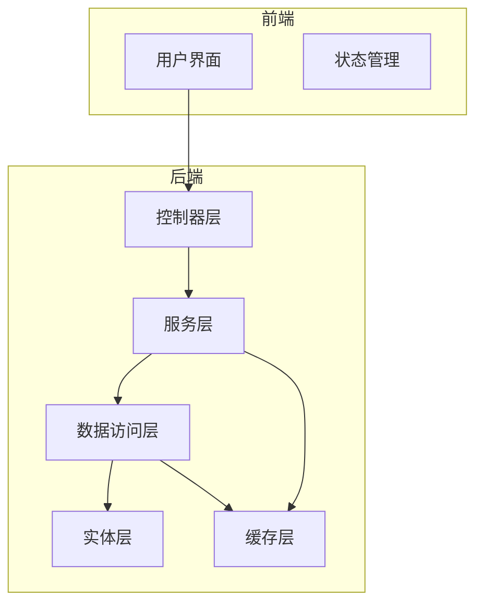
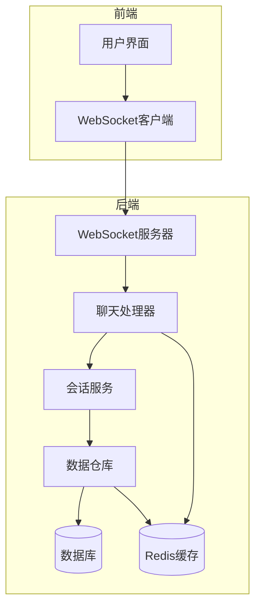
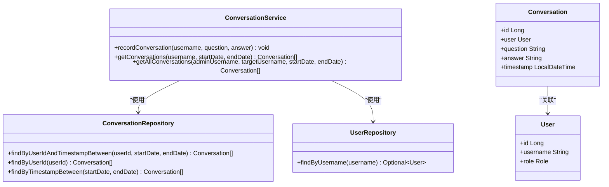
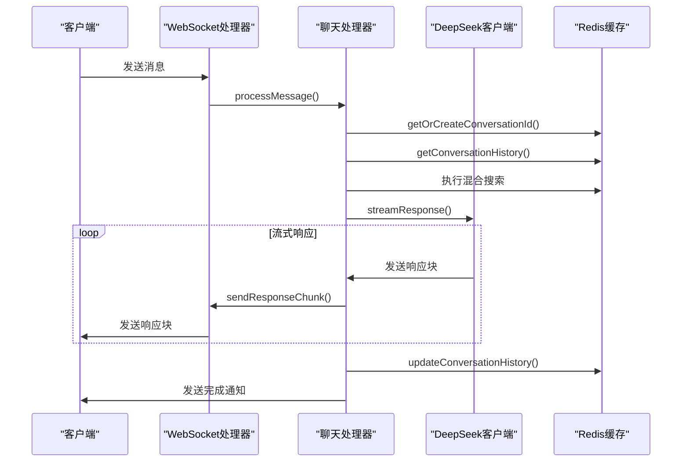
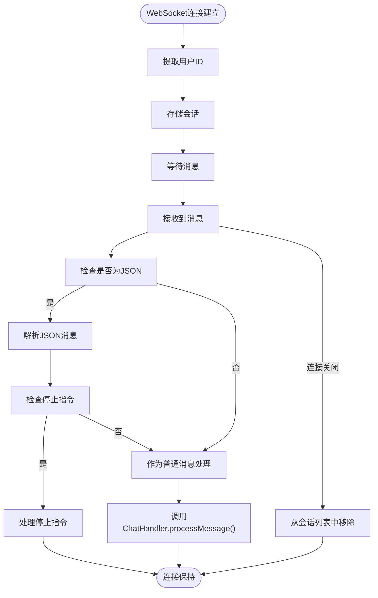
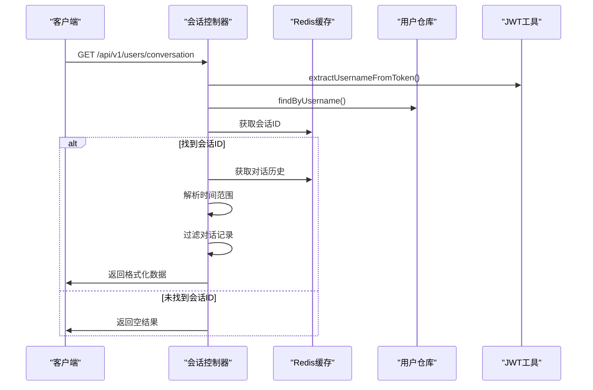
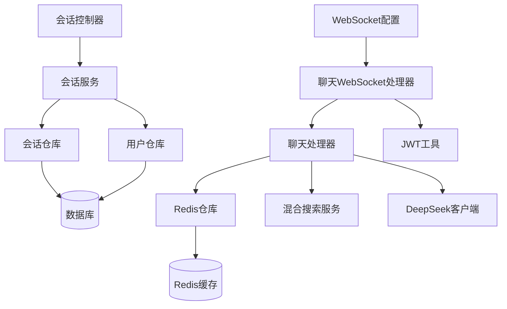
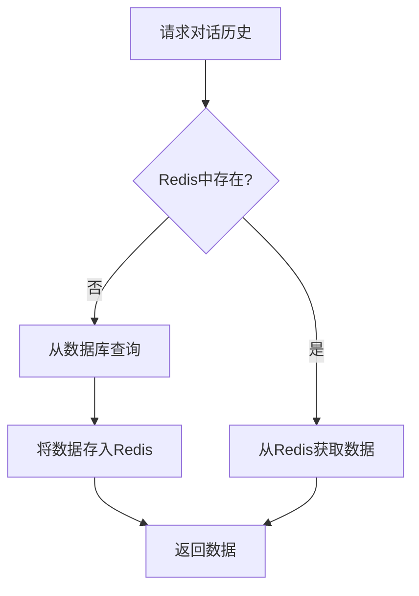
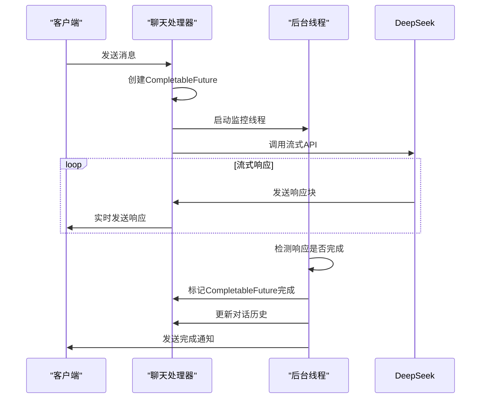

# 会话管理服务

<cite>
**本文档引用的文件**   
- [会话服务](file://src/main/java/com/yizhaoqi/smartpai/service/ConversationService.java)
- [会话实体](file://src/main/java/com/yizhaoqi/smartpai/model/Conversation.java)
- [会话仓库](file://src/main/java/com/yizhaoqi/smartpai/repository/ConversationRepository.java)
- [聊天处理器](file://src/main/java/com/yizhaoqi/smartpai/service/ChatHandler.java)
- [聊天WebSocket处理器](file://src/main/java/com/yizhaoqi/smartpai/handler/ChatWebSocketHandler.java)
- [会话控制器](file://src/main/java/com/yizhaoqi/smartpai/controller/ConversationController.java)
- [WebSocket配置](file://src/main/java/com/yizhaoqi/smartpai/config/WebSocketConfig.java)
- [Redis仓库](file://src/main/java/com/yizhaoqi/smartpai/repository/RedisRepository.java)
- [Token缓存服务](file://src/main/java/com/yizhaoqi/smartpai/service/TokenCacheService.java)
</cite>

## 目录
1. [引言](#引言)
2. [项目结构](#项目结构)
3. [核心组件](#核心组件)
4. [架构概述](#架构概述)
5. [详细组件分析](#详细组件分析)
6. [依赖分析](#依赖分析)
7. [性能考虑](#性能考虑)
8. [故障排除指南](#故障排除指南)
9. [结论](#结论)

## 引言
本文档全面介绍了会话管理服务的架构设计与实现细节，重点分析了ConversationService如何维护用户对话上下文，支持多轮对话状态管理。结合ChatHandler处理AI响应生成逻辑，说明WebSocket实时通信机制（通过ChatWebSocketHandler）的建立与消息传递过程。描述了会话持久化策略、历史记录查询接口及性能优化手段，如分页加载与缓存机制。提供了会话创建、消息发送、上下文截断等关键操作的代码示例，并讨论了并发控制与数据一致性保障措施。

## 项目结构
会话管理服务是PaiSmart项目的核心组件之一，主要位于后端src/main/java/com/yizhaoqi/smartpai目录下。该服务由多个层次构成，包括控制器层、服务层、数据访问层和实体层，形成了清晰的分层架构。

**图示来源**
- [会话控制器](file://src/main/java/com/yizhaoqi/smartpai/controller/ConversationController.java)
- [会话服务](file://src/main/java/com/yizhaoqi/smartpai/service/ConversationService.java)
- [会话仓库](file://src/main/java/com/yizhaoqi/smartpai/repository/ConversationRepository.java)
- [会话实体](file://src/main/java/com/yizhaoqi/smartpai/model/Conversation.java)

## 核心组件
会话管理服务的核心组件包括ConversationService、ChatHandler、ChatWebSocketHandler和ConversationController。这些组件协同工作，实现了完整的会话管理功能。

ConversationService负责持久化存储用户的对话历史到数据库，提供查询接口。ChatHandler处理AI响应生成逻辑，管理对话上下文。ChatWebSocketHandler建立WebSocket连接，实现实时通信。ConversationController提供REST API接口，供前端调用。

**组件来源**
- [会话服务](file://src/main/java/com/yizhaoqi/smartpai/service/ConversationService.java)
- [聊天处理器](file://src/main/java/com/yizhaoqi/smartpai/service/ChatHandler.java)
- [聊天WebSocket处理器](file://src/main/java/com/yizhaoqi/smartpai/handler/ChatWebSocketHandler.java)
- [会话控制器](file://src/main/java/com/yizhaoqi/smartpai/controller/ConversationController.java)

## 架构概述
会话管理服务采用分层架构设计，各层职责分明，便于维护和扩展。整体架构包括前端界面、WebSocket通信层、业务逻辑层、数据访问层和持久化层。

**图示来源**
- [聊天WebSocket处理器](file://src/main/java/com/yizhaoqi/smartpai/handler/ChatWebSocketHandler.java)
- [聊天处理器](file://src/main/java/com/yizhaoqi/smartpai/service/ChatHandler.java)
- [会话服务](file://src/main/java/com/yizhaoqi/smartpai/service/ConversationService.java)
- [会话仓库](file://src/main/java/com/yizhaoqi/smartpai/repository/ConversationRepository.java)

## 详细组件分析

### 会话服务分析
ConversationService是会话管理的核心服务类，负责处理会话的持久化存储和查询。它通过依赖注入获取ConversationRepository和UserRepository实例，实现了会话记录的创建和查询功能。

**图示来源**
- [会话服务](file://src/main/java/com/yizhaoqi/smartpai/service/ConversationService.java#L0-L111)
- [会话仓库](file://src/main/java/com/yizhaoqi/smartpai/repository/ConversationRepository.java#L0-L38)

**组件来源**
- [会话服务](file://src/main/java/com/yizhaoqi/smartpai/service/ConversationService.java)
- [会话仓库](file://src/main/java/com/yizhaoqi/smartpai/repository/ConversationRepository.java)

### 聊天处理器分析
ChatHandler是处理AI响应生成的核心组件，负责管理对话上下文、调用AI服务并处理流式响应。它使用Redis缓存来存储会话状态，实现了高效的上下文管理。

**图示来源**
- [聊天处理器](file://src/main/java/com/yizhaoqi/smartpai/service/ChatHandler.java#L0-L400)
- [聊天WebSocket处理器](file://src/main/java/com/yizhaoqi/smartpai/handler/ChatWebSocketHandler.java#L0-L121)

**组件来源**
- [聊天处理器](file://src/main/java/com/yizhaoqi/smartpai/service/ChatHandler.java)
- [聊天WebSocket处理器](file://src/main/java/com/yizhaoqi/smartpai/handler/ChatWebSocketHandler.java)

### WebSocket处理器分析
ChatWebSocketHandler负责建立和管理WebSocket连接，处理实时消息通信。它继承自TextWebSocketHandler，实现了连接建立、消息处理和连接关闭的完整生命周期管理。

**图示来源**
- [聊天WebSocket处理器](file://src/main/java/com/yizhaoqi/smartpai/handler/ChatWebSocketHandler.java#L0-L121)
- [WebSocket配置](file://src/main/java/com/yizhaoqi/smartpai/config/WebSocketConfig.java#L0-L22)

**组件来源**
- [聊天WebSocket处理器](file://src/main/java/com/yizhaoqi/smartpai/handler/ChatWebSocketHandler.java)
- [WebSocket配置](file://src/main/java/com/yizhaoqi/smartpai/config/WebSocketConfig.java)

### 会话控制器分析
ConversationController提供REST API接口，用于查询用户的对话历史。它从Redis缓存中获取会话数据，支持按时间范围过滤，实现了高效的会话历史查询功能。

**图示来源**
- [会话控制器](file://src/main/java/com/yizhaoqi/smartpai/controller/ConversationController.java#L0-L199)
- [会话服务](file://src/main/java/com/yizhaoqi/smartpai/service/ConversationService.java#L0-L111)

**组件来源**
- [会话控制器](file://src/main/java/com/yizhaoqi/smartpai/controller/ConversationController.java)
- [会话服务](file://src/main/java/com/yizhaoqi/smartpai/service/ConversationService.java)

## 依赖分析
会话管理服务的组件之间存在明确的依赖关系。通过分析这些依赖，可以更好地理解系统的架构和数据流。

**图示来源**
- [会话控制器](file://src/main/java/com/yizhaoqi/smartpai/controller/ConversationController.java)
- [会话服务](file://src/main/java/com/yizhaoqi/smartpai/service/ConversationService.java)
- [会话仓库](file://src/main/java/com/yizhaoqi/smartpai/repository/ConversationRepository.java)
- [聊天处理器](file://src/main/java/com/yizhaoqi/smartpai/service/ChatHandler.java)
- [聊天WebSocket处理器](file://src/main/java/com/yizhaoqi/smartpai/handler/ChatWebSocketHandler.java)
- [WebSocket配置](file://src/main/java/com/yizhaoqi/smartpai/config/WebSocketConfig.java)

**组件来源**
- [会话控制器](file://src/main/java/com/yizhaoqi/smartpai/controller/ConversationController.java)
- [会话服务](file://src/main/java/com/yizhaoqi/smartpai/service/ConversationService.java)
- [会话仓库](file://src/main/java/com/yizhaoqi/smartpai/repository/ConversationRepository.java)

## 性能考虑
会话管理服务采用了多种性能优化策略，包括缓存机制、连接池和异步处理，以确保系统的高效运行。

### 缓存机制
系统使用Redis作为缓存层，存储会话状态和对话历史。通过将频繁访问的数据存储在内存中，显著减少了数据库查询次数，提高了响应速度。

**图示来源**
- [聊天处理器](file://src/main/java/com/yizhaoqi/smartpai/service/ChatHandler.java#L0-L400)
- [会话控制器](file://src/main/java/com/yizhaoqi/smartpai/controller/ConversationController.java#L0-L199)

### 异步处理
聊天处理器采用异步处理模式，通过CompletableFuture和后台线程监控响应完成状态，避免了阻塞主线程，提高了系统的并发处理能力。

**图示来源**
- [聊天处理器](file://src/main/java/com/yizhaoqi/smartpai/service/ChatHandler.java#L0-L400)

## 故障排除指南
### WebSocket连接问题
当WebSocket连接无法建立时，应检查以下几点：
1. 确认WebSocket端点配置正确
2. 检查JWT令牌是否有效
3. 验证客户端是否正确提取了用户ID

### 对话历史丢失
如果用户无法获取对话历史，可能的原因包括：
1. Redis缓存中没有对应的会话ID
2. 用户ID格式不匹配
3. 时间范围过滤条件设置不当

### AI响应延迟
当AI响应出现延迟时，可以检查：
1. DeepSeek API的网络连接状况
2. Redis缓存的读写性能
3. 后台监控线程的执行情况

**组件来源**
- [聊天WebSocket处理器](file://src/main/java/com/yizhaoqi/smartpai/handler/ChatWebSocketHandler.java)
- [会话控制器](file://src/main/java/com/yizhaoqi/smartpai/controller/ConversationController.java)
- [聊天处理器](file://src/main/java/com/yizhaoqi/smartpai/service/ChatHandler.java)

## 结论
会话管理服务通过精心设计的架构和高效的实现，提供了稳定可靠的会话管理功能。系统采用分层架构，各组件职责分明，便于维护和扩展。通过Redis缓存和异步处理机制，确保了高性能和良好的用户体验。WebSocket实时通信机制使得AI响应能够即时传递给用户，实现了流畅的交互体验。整体设计充分考虑了可扩展性、性能和可靠性，为PaiSmart项目提供了坚实的会话管理基础。