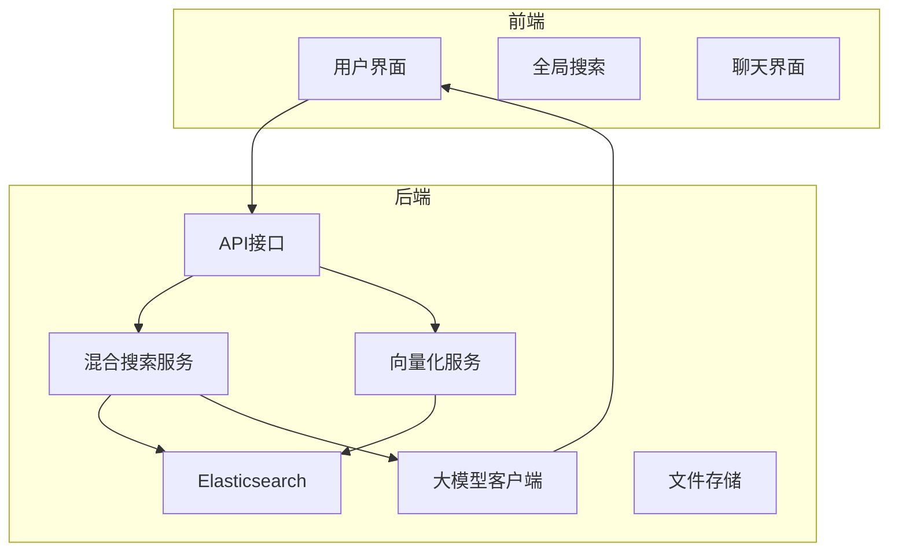
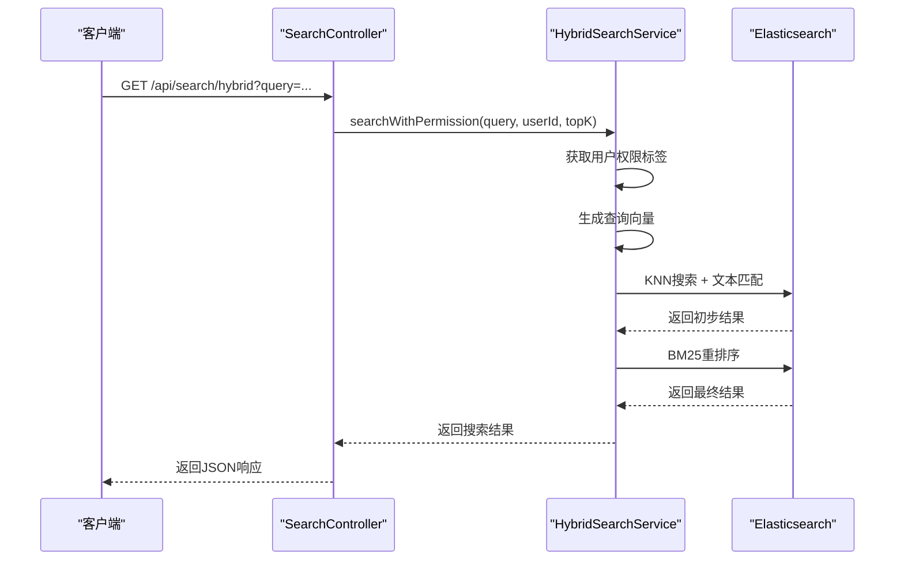
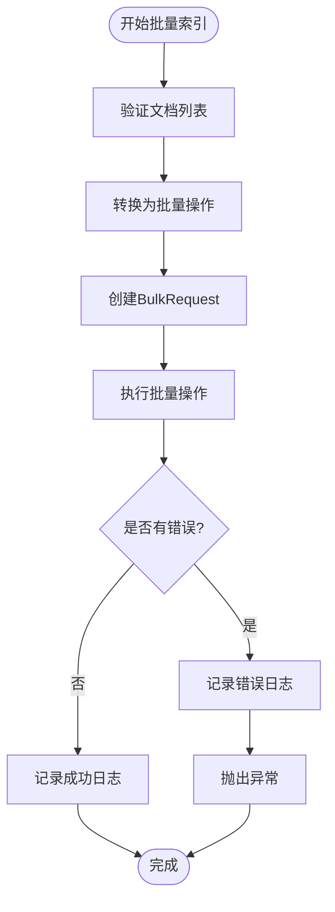
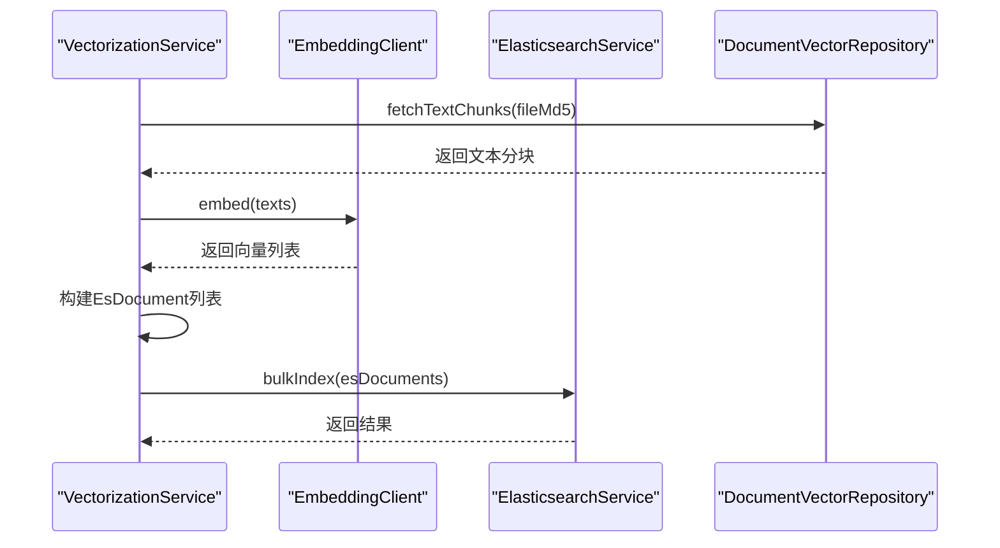
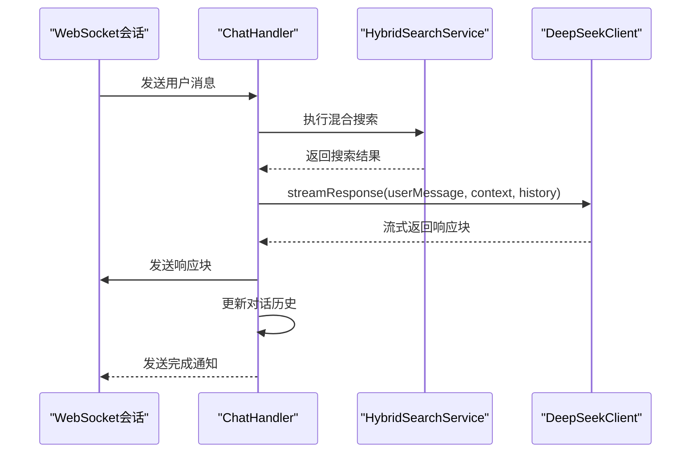

# 搜索与向量化服务

<cite>
**本文档引用的文件**   
- [HybridSearchService.java](file://src/main/java/com/yizhaoqi/smartpai/service/HybridSearchService.java)
- [ElasticsearchService.java](file://src/main/java/com/yizhaoqi/smartpai/service/ElasticsearchService.java)
- [VectorizationService.java](file://src/main/java/com/yizhaoqi/smartpai/service/VectorizationService.java)
- [DeepSeekClient.java](file://src/main/java/com/yizhaoqi/smartpai/client/DeepSeekClient.java)
- [EmbeddingClient.java](file://src/main/java/com/yizhaoqi/smartpai/client/EmbeddingClient.java)
- [EsDocument.java](file://src/main/java/com/yizhaoqi/smartpai/entity/EsDocument.java)
- [SearchResult.java](file://src/main/java/com/yizhaoqi/smartpai/entity/SearchResult.java)
- [SearchController.java](file://src/main/java/com/yizhaoqi/smartpai/controller/SearchController.java)
- [ChatHandler.java](file://src/main/java/com/yizhaoqi/smartpai/service/ChatHandler.java)
- [AiProperties.java](file://src/main/java/com/yizhaoqi/smartpai/config/AiProperties.java)
- [EsConfig.java](file://src/main/java/com/yizhaoqi/smartpai/config/EsConfig.java)
- [EsIndexInitializer.java](file://src/main/java/com/yizhaoqi/smartpai/config/EsIndexInitializer.java)
- [knowledge_base.json](file://src/main/resources/es-mappings/knowledge_base.json)
- [DocumentService.java](file://src/main/java/com/yizhaoqi/smartpai/service/DocumentService.java)
- [TextChunk.java](file://src/main/java/com/yizhaoqi/smartpai/entity/TextChunk.java)
</cite>

## 目录
1. [项目结构](#项目结构)
2. [混合搜索服务](#混合搜索服务)
3. [Elasticsearch服务](#elasticsearch服务)
4. [向量化服务](#向量化服务)
5. [大模型集成](#大模型集成)
6. [关键技术决策](#关键技术决策)
7. [性能调优与故障排查](#性能调优与故障排查)

## 项目结构
本项目采用典型的前后端分离架构，后端服务主要集中在`src/main/java`目录下，实现了混合搜索、向量化和大模型集成等核心功能。前端位于`frontend`目录，通过API与后端交互。



**图示来源**
- [SearchController.java](file://src/main/java/com/yizhaoqi/smartpai/controller/SearchController.java)
- [HybridSearchService.java](file://src/main/java/com/yizhaoqi/smartpai/service/HybridSearchService.java)

## 混合搜索服务
`HybridSearchService`是系统的核心组件，实现了关键词检索与语义向量搜索的深度融合，通过结合两种搜索方式的优势，显著提升了查询精度。

### 混合搜索实现原理
该服务通过Elasticsearch的KNN（K-Nearest Neighbors）功能实现向量相似度搜索，同时结合传统的BM25文本匹配算法，形成混合搜索策略。搜索过程分为两个阶段：首先使用KNN召回候选文档，然后通过BM25算法对结果进行重排序。



**图示来源**
- [HybridSearchService.java](file://src/main/java/com/yizhaoqi/smartpai/service/HybridSearchService.java#L30-L471)
- [SearchController.java](file://src/main/java/com/yizhaoqi/smartpai/controller/SearchController.java#L30-L90)

### 权限过滤机制
系统实现了细粒度的权限控制，确保用户只能访问其有权限的文档。权限判断基于三个条件：用户自己的文档、公开文档以及用户所属组织的文档。

```java
// 权限过滤逻辑
s.query(q -> q.bool(b -> b
    .must(mst -> mst.match(m -> m.field("textContent").query(query)))
    .filter(f -> f.bool(bf -> bf
        // 条件1: 用户可访问自己的文档
        .should(s1 -> s1.term(t -> t.field("userId").value(userDbId)))
        // 条件2: 公开文档
        .should(s2 -> s2.term(t -> t.field("public").value(true)))
        // 条件3: 组织标签
        .should(s3 -> {
            if (userEffectiveTags.isEmpty()) {
                return s3.matchNone(mn -> mn);
            } else if (userEffectiveTags.size() == 1) {
                return s3.term(t -> t.field("orgTag").value(userEffectiveTags.get(0)));
            } else {
                return s3.bool(inner -> {
                    userEffectiveTags.forEach(tag -> inner.should(sh2 -> sh2.term(t -> t.field("orgTag").value(tag))));
                    return inner;
                });
            }
        })
    ))
));
```

**代码来源**
- [HybridSearchService.java](file://src/main/java/com/yizhaoqi/smartpai/service/HybridSearchService.java#L68-L100)

## Elasticsearch服务
`ElasticsearchService`负责管理Elasticsearch索引的创建、更新和删除操作，为整个搜索系统提供数据存储和检索支持。

### 索引管理
服务提供了批量索引和按文件删除的功能，通过Elasticsearch的Bulk API实现高效的批量操作。



**图示来源**
- [ElasticsearchService.java](file://src/main/java/com/yizhaoqi/smartpai/service/ElasticsearchService.java#L17-L85)

### 索引初始化
系统在启动时自动初始化Elasticsearch索引，确保索引结构的正确性。索引配置定义在`knowledge_base.json`文件中。

```java
// 索引初始化逻辑
private void initializeIndex() throws Exception {
    BooleanResponse existsResponse = esClient.indices().exists(ExistsRequest.of(e -> e.index("knowledge_base")));
    if (!existsResponse.value()) {
        createIndex();
    } else {
        logger.info("索引 'knowledge_base' 已存在");
    }
}
```

**代码来源**
- [EsIndexInitializer.java](file://src/main/java/com/yizhaoqi/smartpai/config/EsIndexInitializer.java#L40-L50)

## 向量化服务
`VectorizationService`负责将文本内容转换为向量表示，并存储到Elasticsearch中，为语义搜索提供基础支持。

### 向量化流程
服务通过调用外部Embedding API生成文本向量，然后将向量与原始文本一起存储到Elasticsearch中。



**图示来源**
- [VectorizationService.java](file://src/main/java/com/yizhaoqi/smartpai/service/VectorizationService.java#L17-L101)

### 文本分块策略
系统采用简单的按文件分块策略，每个文件被分割为多个文本块，每个块包含连续的文本内容。分块信息存储在数据库中，便于后续处理。

```java
// 文本分块数据结构
@Setter
@Getter
public class TextChunk {
    private int chunkId;       // 分块序号
    private String content;    // 分块内容
}
```

**代码来源**
- [TextChunk.java](file://src/main/java/com/yizhaoqi/smartpai/entity/TextChunk.java#L6-L19)

## 大模型集成
系统通过`DeepSeekClient`集成大模型，将搜索结果作为上下文提供给大模型，生成更智能的响应。

### 交互流程
聊天处理服务`ChatHandler`协调整个交互过程，从接收用户消息到生成最终响应。



**图示来源**
- [ChatHandler.java](file://src/main/java/com/yizhaoqi/smartpai/service/ChatHandler.java#L0-L400)

### 上下文构建
系统将搜索结果格式化为特定格式的上下文，提供给大模型参考。

```java
private String buildContext(List<SearchResult> searchResults) {
    if (searchResults == null || searchResults.isEmpty()) {
        return "";
    }

    final int MAX_SNIPPET_LEN = 300;
    StringBuilder context = new StringBuilder();
    for (int i = 0; i < searchResults.size(); i++) {
        SearchResult result = searchResults.get(i);
        String snippet = result.getTextContent();
        if (snippet.length() > MAX_SNIPPET_LEN) {
            snippet = snippet.substring(0, MAX_SNIPPET_LEN) + "…";
        }
        String fileLabel = result.getFileName() != null ? result.getFileName() : "unknown";
        context.append(String.format("[%d] (%s) %s\n", i + 1, fileLabel, snippet));
    }
    return context.toString();
}
```

**代码来源**
- [ChatHandler.java](file://src/main/java/com/yizhaoqi/smartpai/service/ChatHandler.java#L150-L170)

## 关键技术决策
系统在多个关键技术点上做出了重要决策，这些决策直接影响了系统的性能和功能。

### 向量维度与相似度算法
系统采用2048维的向量表示，使用余弦相似度作为向量相似度计算方法。

```json
{
  "mappings": {
    "properties": {
      "vector": {
        "type": "dense_vector",
        "dims": 2048,
        "index": true,
        "similarity": "cosine"
      }
    }
  }
}
```

**配置来源**
- [knowledge_base.json](file://src/main/resources/es-mappings/knowledge_base.json#L10-L14)

### AI生成参数
系统通过`AiProperties`类配置大模型的生成参数，确保输出的稳定性和质量。

```java
@Data
public static class Generation {
    /** 采样温度 */
    private Double temperature = 0.3;
    /** 最大输出 tokens */
    private Integer maxTokens = 2000;
    /** nucleus top-p */
    private Double topP = 0.9;
}
```

**配置来源**
- [AiProperties.java](file://src/main/java/com/yizhaoqi/smartpai/config/AiProperties.java#L25-L33)

## 性能调优与故障排查
### 性能调优建议
1. **批量操作**：使用Elasticsearch的Bulk API进行批量索引，减少网络开销
2. **连接池**：配置合理的Elasticsearch客户端连接池大小
3. **缓存**：对频繁访问的搜索结果进行缓存
4. **分页优化**：避免深度分页，使用search_after替代from/size

### 故障排查指南
1. **搜索无结果**：检查Elasticsearch索引是否存在，确认文档已正确索引
2. **向量生成失败**：检查Embedding API服务是否正常运行
3. **权限问题**：验证用户组织标签是否正确配置
4. **性能问题**：监控Elasticsearch集群状态，检查慢查询日志

**本节来源**
- [HybridSearchService.java](file://src/main/java/com/yizhaoqi/smartpai/service/HybridSearchService.java)
- [ElasticsearchService.java](file://src/main/java/com/yizhaoqi/smartpai/service/ElasticsearchService.java)
- [VectorizationService.java](file://src/main/java/com/yizhaoqi/smartpai/service/VectorizationService.java)