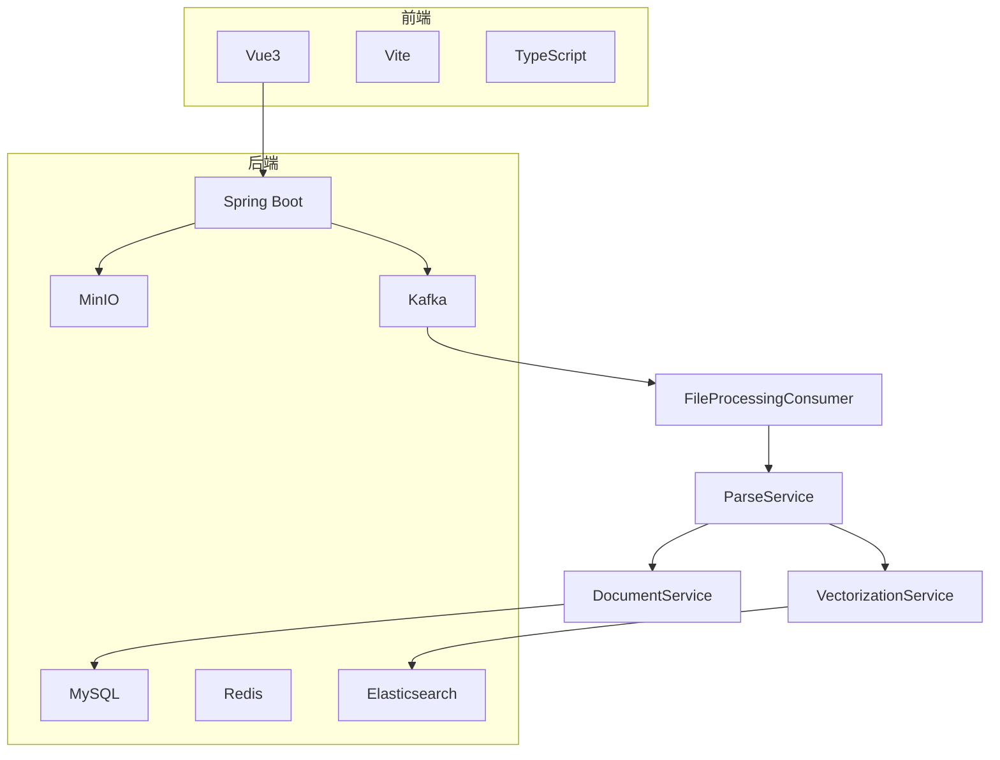
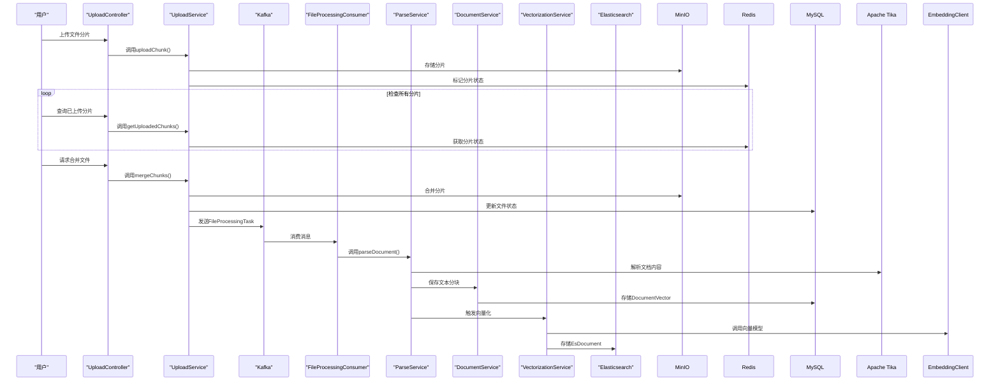
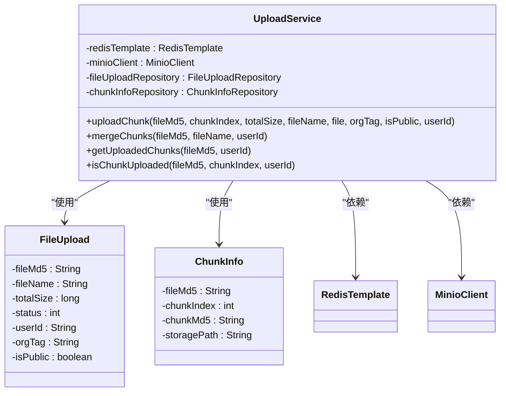
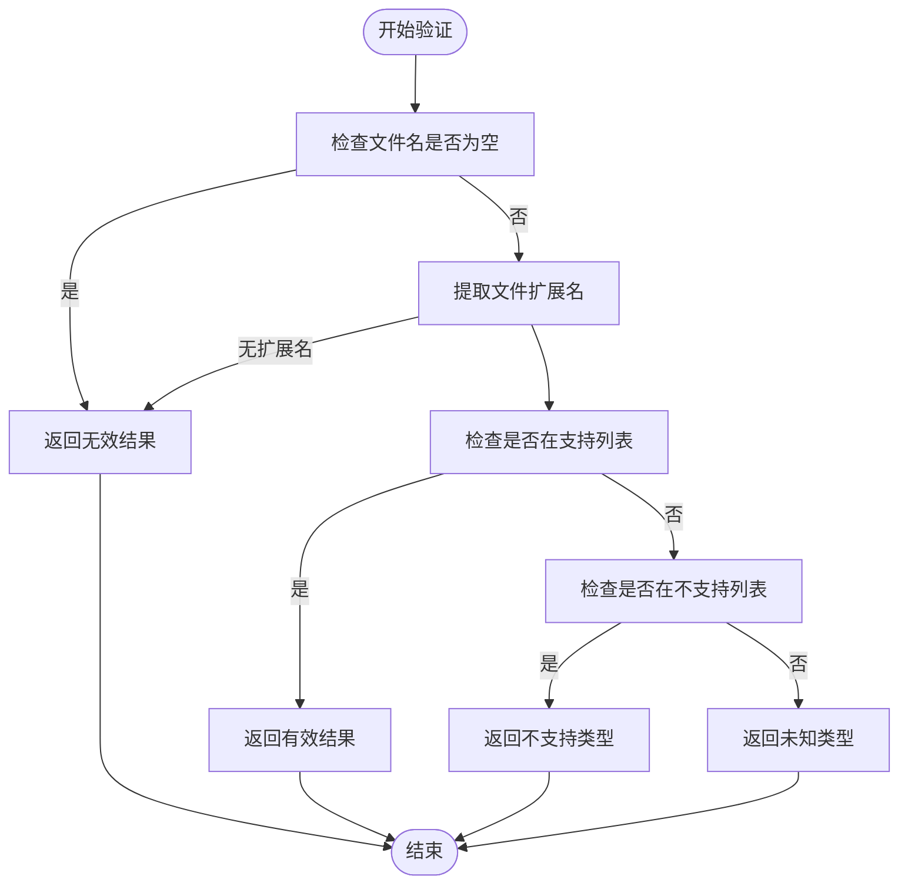
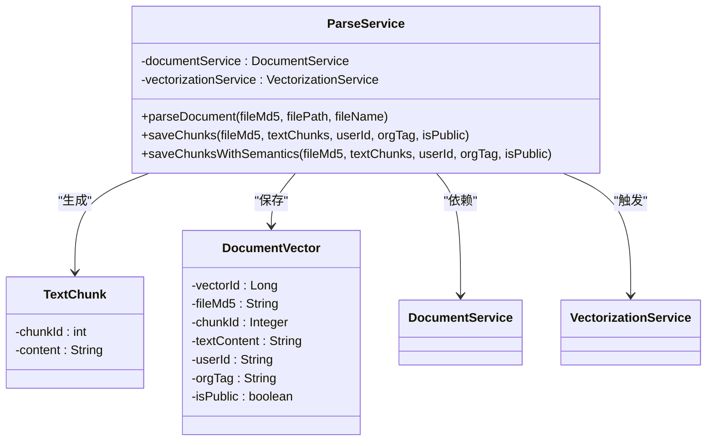
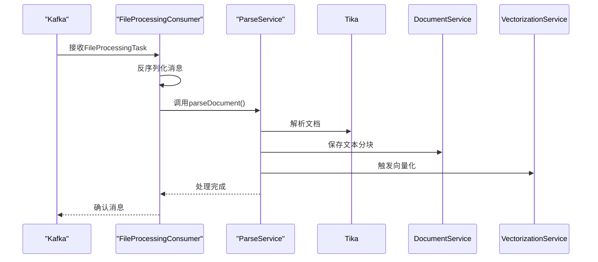
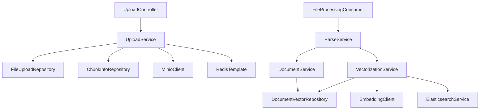

# 文档处理服务

<cite>
**本文档引用的文件**  
- [FileProcessingTask.java](file://src/main/java/com/yizhaoqi/smartpai/model/FileProcessingTask.java)
- [DocumentVector.java](file://src/main/java/com/yizhaoqi/smartpai/model/DocumentVector.java)
- [TextChunk.java](file://src/main/java/com/yizhaoqi/smartpai/entity/TextChunk.java)
- [EsDocument.java](file://src/main/java/com/yizhaoqi/smartpai/entity/EsDocument.java)
- [DocumentVectorRepository.java](file://src/main/java/com/yizhaoqi/smartpai/repository/DocumentVectorRepository.java)
- [FileUploadRepository.java](file://src/main/java/com/yizhaoqi/smartpai/repository/FileUploadRepository.java)
- [FileUpload.java](file://src/main/java/com/yizhaoqi/smartpai/model/FileUpload.java)
- [FileTypeValidationService.java](file://src/main/java/com/yizhaoqi/smartpai/service/FileTypeValidationService.java)
- [UploadService.java](file://src/main/java/com/yizhaoqi/smartpai/service/UploadService.java)
- [FileProcessingConsumer.java](file://src/main/java/com/yizhaoqi/smartpai/consumer/FileProcessingConsumer.java)
- [ParseService.java](file://src/main/java/com/yizhaoqi/smartpai/service/ParseService.java)
- [DocumentService.java](file://src/main/java/com/yizhaoqi/smartpai/service/DocumentService.java)
- [VectorizationService.java](file://src/main/java/com/yizhaoqi/smartpai/service/VectorizationService.java)
</cite>

## 目录
1. [简介](#简介)
2. [项目结构](#项目结构)
3. [核心组件](#核心组件)
4. [架构概览](#架构概览)
5. [详细组件分析](#详细组件分析)
6. [依赖分析](#依赖分析)
7. [性能考量](#性能考量)
8. [故障排查指南](#故障排查指南)
9. [结论](#结论)

## 简介
本文档深入解析文档上传、解析与处理的完整流程。系统从`UploadService`接收文件开始，通过Kafka消息队列触发异步处理，调用`ParseService`使用Apache Tika解析文档内容。详细说明了`FileTypeValidationService`对文件类型的校验规则、`DocumentService`对元数据的管理，以及向量化前的文本预处理逻辑。结合实际代码展示了PDF、Word等格式的解析策略，并阐述了错误重试、进度追踪和资源清理机制。

## 项目结构
项目采用前后端分离架构，前端基于Vue3和Vite构建，后端为Spring Boot微服务。文档处理核心逻辑位于`src/main/java/com/yizhaoqi/smartpai`包下，主要包含`controller`、`service`、`model`、`entity`、`repository`和`consumer`等模块。

**图示来源**
- [FileProcessingConsumer.java](file://src/main/java/com/yizhaoqi/smartpai/consumer/FileProcessingConsumer.java)
- [ParseService.java](file://src/main/java/com/yizhaoqi/smartpai/service/ParseService.java)
- [DocumentService.java](file://src/main/java/com/yizhaoqi/smartpai/service/DocumentService.java)
- [VectorizationService.java](file://src/main/java/com/yizhaoqi/smartpai/service/VectorizationService.java)

**本节来源**
- [project_structure](file://project_structure)

## 核心组件
系统核心组件包括`UploadService`负责文件上传与分片管理，`FileTypeValidationService`进行文件类型校验，`ParseService`执行文档解析，`DocumentService`管理文档元数据，`VectorizationService`负责文本向量化，以及`FileProcessingConsumer`作为Kafka消费者处理异步任务。

**本节来源**
- [UploadService.java](file://src/main/java/com/yizhaoqi/smartpai/service/UploadService.java)
- [FileTypeValidationService.java](file://src/main/java/com/yizhaoqi/smartpai/service/FileTypeValidationService.java)
- [ParseService.java](file://src/main/java/com/yizhaoqi/smartpai/service/ParseService.java)
- [DocumentService.java](file://src/main/java/com/yizhaoqi/smartpai/service/DocumentService.java)
- [VectorizationService.java](file://src/main/java/com/yizhaoqi/smartpai/service/VectorizationService.java)
- [FileProcessingConsumer.java](file://src/main/java/com/yizhaoqi/smartpai/consumer/FileProcessingConsumer.java)

## 架构概览
系统采用异步消息驱动架构，确保高吞吐量和系统解耦。用户上传文件后，`UploadController`接收请求并调用`UploadService`处理分片。当所有分片合并完成后，系统向Kafka发送`FileProcessingTask`消息。`FileProcessingConsumer`监听该主题，触发文档解析、文本分块、向量化和索引构建等一系列处理流程。

**图示来源**
- [UploadService.java](file://src/main/java/com/yizhaoqi/smartpai/service/UploadService.java#L300-L600)
- [FileProcessingConsumer.java](file://src/main/java/com/yizhaoqi/smartpai/consumer/FileProcessingConsumer.java)
- [ParseService.java](file://src/main/java/com/yizhaoqi/smartpai/service/ParseService.java)
- [DocumentService.java](file://src/main/java/com/yizhaoqi/smartpai/service/DocumentService.java)
- [VectorizationService.java](file://src/main/java/com/yizhaoqi/smartpai/service/VectorizationService.java)

## 详细组件分析

### 文件上传与分片管理
`UploadService`实现了基于MD5校验的断点续传功能。文件被分割为5MB的分片，每个分片上传后存储在MinIO中，并在Redis中使用位图（bitmap）记录上传状态。这确保了即使上传中断，用户也能从断点继续上传，而不会重复上传已成功的分片。

**图示来源**
- [UploadService.java](file://src/main/java/com/yizhaoqi/smartpai/service/UploadService.java)
- [FileUpload.java](file://src/main/java/com/yizhaoqi/smartpai/model/FileUpload.java)
- [ChunkInfo.java](file://src/main/java/com/yizhaoqi/smartpai/model/ChunkInfo.java)

**本节来源**
- [UploadService.java](file://src/main/java/com/yizhaoqi/smartpai/service/UploadService.java#L100-L300)
- [FileUpload.java](file://src/main/java/com/yizhaoqi/smartpai/model/FileUpload.java)

### 文件类型校验
`FileTypeValidationService`定义了严格的文件类型白名单和黑名单，确保只有可解析的文档格式才能被处理。系统支持PDF、Word、Excel、PowerPoint、文本文件等超过30种文档格式，同时明确拒绝图片、音频、视频、压缩包等无法有效提取文本内容的文件类型。

**图示来源**
- [FileTypeValidationService.java](file://src/main/java/com/yizhaoqi/smartpai/service/FileTypeValidationService.java#L50-L150)

**本节来源**
- [FileTypeValidationService.java](file://src/main/java/com/yizhaoqi/smartpai/service/FileTypeValidationService.java)

### 文档解析与文本预处理
`ParseService`利用Apache Tika库解析各种文档格式，提取纯文本内容。解析后的文本会经过预处理，包括分块（chunking）和清洗，然后由`DocumentService`保存到数据库。系统支持两种分块策略：基于固定长度的简单分块和基于语义的智能分块。

**图示来源**
- [ParseService.java](file://src/main/java/com/yizhaoqi/smartpai/service/ParseService.java)
- [TextChunk.java](file://src/main/java/com/yizhaoqi/smartpai/entity/TextChunk.java)
- [DocumentVector.java](file://src/main/java/com/yizhaoqi/smartpai/model/DocumentVector.java)

**本节来源**
- [ParseService.java](file://src/main/java/com/yizhaoqi/smartpai/service/ParseService.java)
- [TextChunk.java](file://src/main/java/com/yizhaoqi/smartpai/entity/TextChunk.java)
- [DocumentVector.java](file://src/main/java/com/yizhaoqi/smartpai/model/DocumentVector.java)

### 异步处理与消息队列
`FileProcessingConsumer`作为Kafka消费者，监听文件处理任务。当接收到`FileProcessingTask`消息时，它会调用`ParseService`启动解析流程。这种异步设计将文件上传与耗时的解析处理解耦，提高了系统的响应速度和可伸缩性。

**图示来源**
- [FileProcessingTask.java](file://src/main/java/com/yizhaoqi/smartpai/model/FileProcessingTask.java)
- [FileProcessingConsumer.java](file://src/main/java/com/yizhaoqi/smartpai/consumer/FileProcessingConsumer.java)
- [ParseService.java](file://src/main/java/com/yizhaoqi/smartpai/service/ParseService.java)

**本节来源**
- [FileProcessingTask.java](file://src/main/java/com/yizhaoqi/smartpai/model/FileProcessingTask.java)
- [FileProcessingConsumer.java](file://src/main/java/com/yizhaoqi/smartpai/consumer/FileProcessingConsumer.java)

## 依赖分析
系统各组件之间通过清晰的接口进行交互，依赖关系明确。`UploadService`依赖于`FileUploadRepository`和`ChunkInfoRepository`进行数据持久化，`ParseService`依赖于`DocumentService`和`VectorizationService`完成后续处理。所有服务组件通过Spring的依赖注入机制进行管理。

**图示来源**
- [UploadService.java](file://src/main/java/com/yizhaoqi/smartpai/service/UploadService.java)
- [FileProcessingConsumer.java](file://src/main/java/com/yizhaoqi/smartpai/consumer/FileProcessingConsumer.java)
- [ParseService.java](file://src/main/java/com/yizhaoqi/smartpai/service/ParseService.java)
- [DocumentService.java](file://src/main/java/com/yizhaoqi/smartpai/service/DocumentService.java)
- [VectorizationService.java](file://src/main/java/com/yizhaoqi/smartpai/service/VectorizationService.java)

**本节来源**
- [UploadService.java](file://src/main/java/com/yizhaoqi/smartpai/service/UploadService.java)
- [FileProcessingConsumer.java](file://src/main/java/com/yizhaoqi/smartpai/consumer/FileProcessingConsumer.java)
- [ParseService.java](file://src/main/java/com/yizhaoqi/smartpai/service/ParseService.java)
- [DocumentService.java](file://src/main/java/com/yizhaoqi/smartpai/service/DocumentService.java)
- [VectorizationService.java](file://src/main/java/com/yizhaoqi/smartpai/service/VectorizationService.java)

## 性能考量
系统在设计上充分考虑了性能优化。使用Redis位图高效追踪分片上传状态，避免了频繁的数据库查询。MinIO的分片上传和合并功能利用了对象存储的高性能特性。异步处理架构确保了前端上传操作的快速响应。文本分块和向量化等耗时操作在后台线程中执行，不影响用户体验。

## 故障排查指南
常见问题及解决方案：
- **分片上传失败**：检查MinIO服务状态和网络连接，确认Redis服务正常运行。
- **文件合并失败**：验证所有分片是否都已成功上传，检查MinIO中分片文件是否存在。
- **文档解析失败**：确认文件格式是否在支持列表中，检查Apache Tika解析器是否正常工作。
- **向量化失败**：检查Embedding模型服务是否可用，确认网络策略允许访问。
- **Kafka消息积压**：增加`FileProcessingConsumer`实例数量，或检查消费者处理逻辑是否存在性能瓶颈。

**本节来源**
- [UploadService.java](file://src/main/java/com/yizhaoqi/smartpai/service/UploadService.java)
- [FileProcessingConsumer.java](file://src/main/java/com/yizhaoqi/smartpai/consumer/FileProcessingConsumer.java)
- [ParseService.java](file://src/main/java/com/yizhaoqi/smartpai/service/ParseService.java)

## 结论
本文档详细解析了文档处理服务的完整流程，从文件上传、类型校验、异步处理到文本解析和向量化。系统采用现代化的微服务架构，结合MinIO、Kafka、Redis等中间件，实现了高可用、高性能的文档处理能力。通过清晰的组件划分和异步消息机制，系统能够高效处理大量文档，为上层应用提供可靠的文档智能服务。