# 服务层

<cite>
**本文档中引用的文件**   
- [ConversationService.java](file://src/main/java/com/yizhaoqi/smartpai/service/ConversationService.java)
- [UploadService.java](file://src/main/java/com/yizhaoqi/smartpai/service/UploadService.java)
- [ParseService.java](file://src/main/java/com/yizhaoqi/smartpai/service/ParseService.java)
- [VectorizationService.java](file://src/main/java/com/yizhaoqi/smartpai/service/VectorizationService.java)
- [ElasticsearchService.java](file://src/main/java/com/yizhaoqi/smartpai/service/ElasticsearchService.java)
- [FileProcessingConsumer.java](file://src/main/java/com/yizhaoqi/smartpai/consumer/FileProcessingConsumer.java)
- [EmbeddingClient.java](file://src/main/java/com/yizhaoqi/smartpai/client/EmbeddingClient.java)
- [WebClientConfig.java](file://src/main/java/com/yizhaoqi/smartpai/config/WebClientConfig.java)
- [DocumentService.java](file://src/main/java/com/yizhaoqi/smartpai/service/DocumentService.java)
- [FileUploadRepository.java](file://src/main/java/com/yizhaoqi/smartpai/repository/FileUploadRepository.java)
- [FileUpload.java](file://src/main/java/com/yizhaoqi/smartpai/model/FileUpload.java)
- [ChunkInfo.java](file://src/main/java/com/yizhaoqi/smartpai/model/ChunkInfo.java)
- [DocumentVector.java](file://src/main/java/com/yizhaoqi/smartpai/model/DocumentVector.java)
- [EsDocument.java](file://src/main/java/com/yizhaoqi/smartpai/entity/EsDocument.java)
- [FileProcessingTask.java](file://src/main/java/com/yizhaoqi/smartpai/model/FileProcessingTask.java)
- [RechargeService.java](file://src/main/java/com/yizhaoqi/smartpai/service/RechargeService.java)
- [TokenCacheService.java](file://src/main/java/com/yizhaoqi/smartpai/service/TokenCacheService.java)
- [ModelProviderConfigService.java](file://src/main/java/com/yizhaoqi/smartpai/service/ModelProviderConfigService.java)
- [UsageQuotaService.java](file://src/main/java/com/yizhaoqi/smartpai/service/UsageQuotaService.java)
- [InviteCodeService.java](file://src/main/java/com/yizhaoqi/smartpai/service/InviteCodeService.java)
- [RateLimitService.java](file://src/main/java/com/yizhaoqi/smartpai/service/RateLimitService.java)
- [RateLimitConfigService.java](file://src/main/java/com/yizhaoqi/smartpai/service/RateLimitConfigService.java)
- [UsageDashboardService.java](file://src/main/java/com/yizhaoqi/smartpai/service/UsageDashboardService.java)
- [UsageBalanceQuotaService.java](file://src/main/java/com/yizhaoqi/smartpai/service/UsageBalanceQuotaService.java)
- [UserTokenService.java](file://src/main/java/com/yizhaoqi/smartpai/service/UserTokenService.java)
- [RechargeOrderRepository.java](file://src/main/java/com/yizhaoqi/smartpai/repository/RechargeOrderRepository.java)
- [InviteCodeRepository.java](file://src/main/java/com/yizhaoqi/smartpai/repository/InviteCodeRepository.java)
- [RateLimitConfigRepository.java](file://src/main/java/com/yizhaoqi/smartpai/repository/RateLimitConfigRepository.java)
- [UserTokenRecordRepository.java](file://src/main/java/com/yizhaoqi/smartpai/repository/UserTokenRecordRepository.java)
- [UserDailyChatCountRepository.java](file://src/main/java/com/yizhaoqi/smartpai/repository/UserDailyChatCountRepository.java)
</cite>

## 更新摘要
**变更内容**   
- 新增充值服务模块，支持微信支付和套餐充值
- 新增令牌缓存服务，基于Redis实现JWT状态管理
- 新增模型提供商配置服务，支持多供应商动态配置
- 新增使用配额服务，实现用户Token余额管理和计费
- 新增邀请码服务，支持管理员创建和管理邀请码
- 新增速率限制服务，实现多维度的流量控制
- 新增使用仪表盘服务，提供系统使用情况可视化
- 更新现有服务依赖关系，增强服务间协作机制

## 目录
1. [引言](#引言)
2. [项目结构](#项目结构)
3. [核心组件](#核心组件)
4. [架构概述](#架构概述)
5. [详细组件分析](#详细组件分析)
6. [新增服务模块](#新增服务模块)
7. [依赖分析](#依赖分析)
8. [性能考量](#性能考量)
9. [故障排除指南](#故障排除指南)
10. [结论](#结论)

## 引言
本文档深入剖析了PaiSmart后端服务层的业务逻辑实现，重点阐述了各Service类的职责划分与协作机制。通过分析`ConversationService.java`中的会话管理逻辑和`UploadService.java`中的文件处理流程，详细说明了服务层的事务管理、异常处理和日志记录策略。文档还详细描述了服务层的依赖注入方式、缓存使用（Redis）、异步处理以及与外部系统（如MinIO、Elasticsearch）的集成。通过提供典型业务流程的代码示例，如文档上传后触发的解析、分块、向量化和索引建立的完整执行路径，为开发者提供了业务逻辑开发的规范指导。

**更新** 新增了充值服务、令牌服务、模型提供商配置服务、使用监控服务、邀请码服务、速率限制服务等核心业务服务的增强和新增功能，完善了系统的商业化运营能力。

## 项目结构
PaiSmart项目采用前后端分离的架构，后端服务层位于`src/main/java/com/yizhaoqi/smartpai/service`目录下，包含多个核心服务类，如`ConversationService`、`UploadService`、`ParseService`等。这些服务类通过依赖注入与数据访问层（Repository）和外部客户端（Client）进行交互，实现了业务逻辑的封装和复用。

```mermaid
graph TD
subgraph "前端"
UI[用户界面]
API[API调用]
end
subgraph "后端服务层"
ConversationService[ConversationService]
UploadService[UploadService]
ParseService[ParseService]
VectorizationService[VectorizationService]
DocumentService[DocumentService]
RechargeService[RechargeService]
TokenCacheService[TokenCacheService]
ModelProviderConfigService[ModelProviderConfigService]
UsageQuotaService[UsageQuotaService]
InviteCodeService[InviteCodeService]
RateLimitService[RateLimitService]
UsageDashboardService[UsageDashboardService]
end
subgraph "数据访问层"
ConversationRepository[ConversationRepository]
FileUploadRepository[FileUploadRepository]
DocumentVectorRepository[DocumentVectorRepository]
RechargeOrderRepository[RechargeOrderRepository]
InviteCodeRepository[InviteCodeRepository]
RateLimitConfigRepository[RateLimitConfigRepository]
UserTokenRecordRepository[UserTokenRecordRepository]
UserDailyChatCountRepository[UserDailyChatCountRepository]
end
subgraph "外部系统"
MinIO[MinIO对象存储]
Elasticsearch[Elasticsearch]
AIModel[AI模型服务]
WeChatPay[微信支付]
Redis[Redis缓存]
</subgraph>
UI --> API --> ConversationService
API --> UploadService
UploadService --> FileUploadRepository
UploadService --> MinIO
ParseService --> DocumentVectorRepository
VectorizationService --> Elasticsearch
VectorizationService --> AIModel
DocumentService --> FileUploadRepository
DocumentService --> MinIO
DocumentService --> Elasticsearch
RechargeService --> WeChatPay
RechargeService --> RechargeOrderRepository
TokenCacheService --> Redis
ModelProviderConfigService --> Redis
UsageQuotaService --> Redis
InviteCodeService --> InviteCodeRepository
RateLimitService --> Redis
UsageDashboardService --> UsageQuotaService
```

**图源**
- [ConversationService.java](file://src/main/java/com/yizhaoqi/smartpai/service/ConversationService.java)
- [UploadService.java](file://src/main/java/com/yizhaoqi/smartpai/service/UploadService.java)
- [ParseService.java](file://src/main/java/com/yizhaoqi/smartpai/service/ParseService.java)
- [VectorizationService.java](file://src/main/java/com/yizhaoqi/smartpai/service/VectorizationService.java)
- [DocumentService.java](file://src/main/java/com/yizhaoqi/smartpai/service/DocumentService.java)
- [RechargeService.java](file://src/main/java/com/yizhaoqi/smartpai/service/RechargeService.java)
- [TokenCacheService.java](file://src/main/java/com/yizhaoqi/smartpai/service/TokenCacheService.java)
- [ModelProviderConfigService.java](file://src/main/java/com/yizhaoqi/smartpai/service/ModelProviderConfigService.java)
- [UsageQuotaService.java](file://src/main/java/com/yizhaoqi/smartpai/service/UsageQuotaService.java)
- [InviteCodeService.java](file://src/main/java/com/yizhaoqi/smartpai/service/InviteCodeService.java)
- [RateLimitService.java](file://src/main/java/com/yizhaoqi/smartpai/service/RateLimitService.java)
- [UsageDashboardService.java](file://src/main/java/com/yizhaoqi/smartpai/service/UsageDashboardService.java)

## 核心组件
服务层的核心组件包括`ConversationService`用于管理用户对话历史，`UploadService`负责文件的分片上传和合并，`ParseService`实现文档内容的解析和分块，`VectorizationService`调用AI模型生成向量，以及`DocumentService`提供文档的删除和访问控制等管理功能。

**更新** 新增了多个核心业务服务：
- **RechargeService**：处理用户充值和套餐购买，集成微信支付回调
- **TokenCacheService**：基于Redis的JWT令牌状态管理
- **ModelProviderConfigService**：多AI模型提供商的动态配置管理
- **UsageQuotaService**：用户Token使用配额和余额管理
- **InviteCodeService**：邀请码的创建、验证和管理
- **RateLimitService**：多维度的流量控制和速率限制
- **UsageDashboardService**：系统使用情况的可视化展示

**节源**
- [ConversationService.java](file://src/main/java/com/yizhaoqi/smartpai/service/ConversationService.java)
- [UploadService.java](file://src/main/java/com/yizhaoqi/smartpai/service/UploadService.java)
- [ParseService.java](file://src/main/java/com/yizhaoqi/smartpai/service/ParseService.java)
- [VectorizationService.java](file://src/main/java/com/yizhaoqi/smartpai/service/VectorizationService.java)
- [DocumentService.java](file://src/main/java/com/yizhaoqi/smartpai/service/DocumentService.java)
- [RechargeService.java](file://src/main/java/com/yizhaoqi/smartpai/service/RechargeService.java)
- [TokenCacheService.java](file://src/main/java/com/yizhaoqi/smartpai/service/TokenCacheService.java)
- [ModelProviderConfigService.java](file://src/main/java/com/yizhaoqi/smartpai/service/ModelProviderConfigService.java)
- [UsageQuotaService.java](file://src/main/java/com/yizhaoqi/smartpai/service/UsageQuotaService.java)
- [InviteCodeService.java](file://src/main/java/com/yizhaoqi/smartpai/service/InviteCodeService.java)
- [RateLimitService.java](file://src/main/java/com/yizhaoqi/smartpai/service/RateLimitService.java)
- [UsageDashboardService.java](file://src/main/java/com/yizhaoqi/smartpai/service/UsageDashboardService.java)

## 架构概述
PaiSmart后端服务层采用分层架构，服务层位于控制器层和数据访问层之间，负责处理核心业务逻辑。服务层通过Spring的依赖注入机制与Repository和Client进行解耦，提高了代码的可测试性和可维护性。对于耗时的文件处理任务，系统采用Kafka消息队列进行异步处理，通过`FileProcessingConsumer`消费消息，依次调用`ParseService`和`VectorizationService`完成文档解析和向量化。

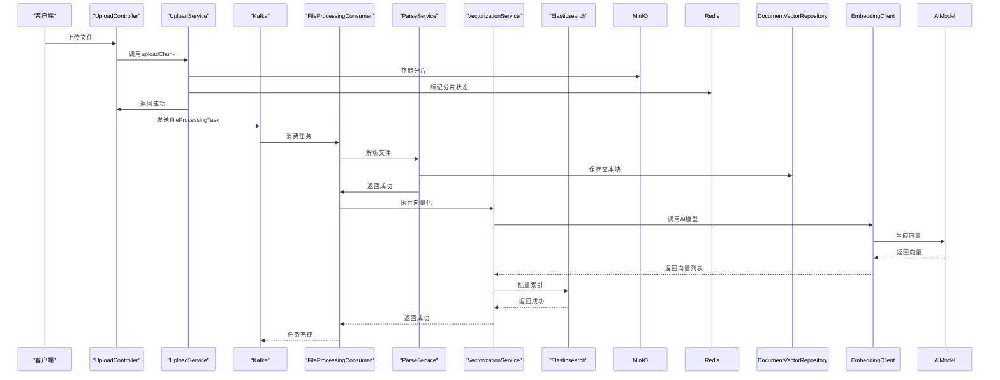

**图源**
- [UploadService.java](file://src/main/java/com/yizhaoqi/smartpai/service/UploadService.java)
- [FileProcessingConsumer.java](file://src/main/java/com/yizhaoqi/smartpai/consumer/FileProcessingConsumer.java)
- [ParseService.java](file://src/main/java/com/yizhaoqi/smartpai/service/ParseService.java)
- [VectorizationService.java](file://src/main/java/com/yizhaoqi/smartpai/service/VectorizationService.java)
- [ElasticsearchService.java](file://src/main/java/com/yizhaoqi/smartpai/service/ElasticsearchService.java)
- [EmbeddingClient.java](file://src/main/java/com/yizhaoqi/smartpai/client/EmbeddingClient.java)

## 详细组件分析

### ConversationService分析
`ConversationService`负责管理用户的对话历史记录。它提供了`recordConversation`方法来记录用户的提问和系统的回答，以及`getConversations`和`getAllConversations`方法来查询对话历史。该服务通过`UserRepository`验证用户身份，并根据用户角色（普通用户或管理员）和查询参数来决定返回哪些对话记录。

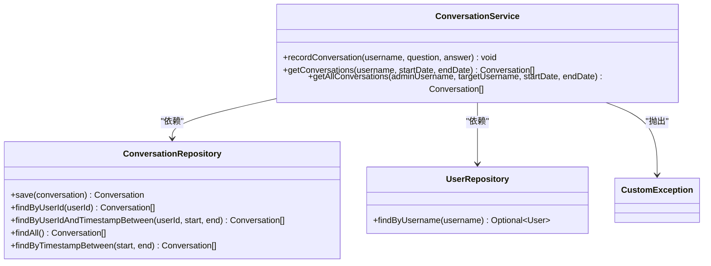

**图源**
- [ConversationService.java](file://src/main/java/com/yizhaoqi/smartpai/service/ConversationService.java)
- [ConversationRepository.java](file://src/main/java/com/yizhaoqi/smartpai/repository/ConversationRepository.java)
- [UserRepository.java](file://src/main/java/com/yizhaoqi/smartpai/repository/UserRepository.java)
- [CustomException.java](file://src/main/java/com/yizhaoqi/smartpai/exception/CustomException.java)

**节源**
- [ConversationService.java](file://src/main/java/com/yizhaoqi/smartpai/service/ConversationService.java)

### UploadService分析
`UploadService`实现了大文件的分片上传和合并功能。它使用Redis的位图（bitmap）来高效地记录每个分片的上传状态，避免了对数据库的频繁查询。当所有分片上传完成后，`mergeChunks`方法会调用MinIO的`composeObject` API将分片合并为一个完整的文件，并生成预签名URL供客户端下载。

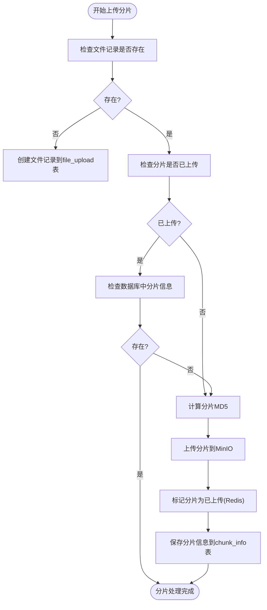

**图源**
- [UploadService.java](file://src/main/java/com/yizhaoqi/smartpai/service/UploadService.java)

**节源**
- [UploadService.java](file://src/main/java/com/yizhaoqi/smartpai/service/UploadService.java)

### 文档处理流程分析
文档上传后的完整处理路径由`FileProcessingConsumer`驱动。当文件合并完成后，系统会发送一个`FileProcessingTask`到Kafka，`FileProcessingConsumer`消费该任务，依次调用`ParseService`解析文件内容并分块，然后调用`VectorizationService`生成向量并索引到Elasticsearch。

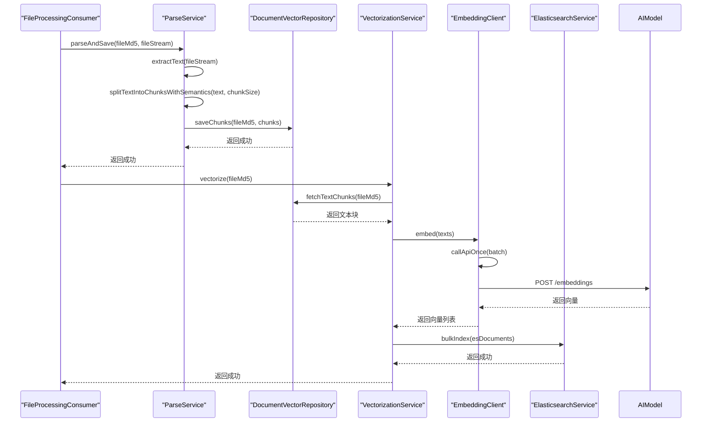

**图源**
- [FileProcessingConsumer.java](file://src/main/java/com/yizhaoqi/smartpai/consumer/FileProcessingConsumer.java)
- [ParseService.java](file://src/main/java/com/yizhaoqi/smartpai/service/ParseService.java)
- [DocumentVectorRepository.java](file://src/main/java/com/yizhaoqi/smartpai/repository/DocumentVectorRepository.java)
- [VectorizationService.java](file://src/main/java/com/yizhaoqi/smartpai/service/VectorizationService.java)
- [EmbeddingClient.java](file://src/main/java/com/yizhaoqi/smartpai/client/EmbeddingClient.java)
- [ElasticsearchService.java](file://src/main/java/com/yizhaoqi/smartpai/service/ElasticsearchService.java)

**节源**
- [FileProcessingConsumer.java](file://src/main/java/com/yizhaoqi/smartpai/consumer/FileProcessingConsumer.java)
- [ParseService.java](file://src/main/java/com/yizhaoqi/smartpai/service/ParseService.java)
- [VectorizationService.java](file://src/main/java/com/yizhaoqi/smartpai/service/VectorizationService.java)

## 新增服务模块

### 充值服务模块
**RechargeService** 提供完整的用户充值和套餐购买功能，集成了微信支付的全流程处理。

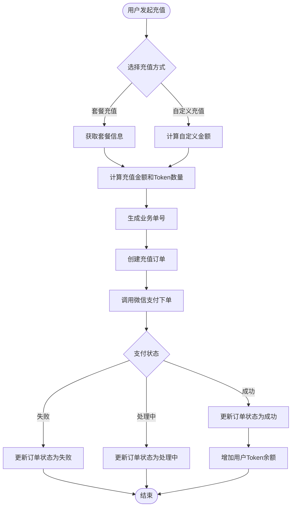

**图源**
- [RechargeService.java](file://src/main/java/com/yizhaoqi/smartpai/service/RechargeService.java)
- [RechargeOrderRepository.java](file://src/main/java/com/yizhaoqi/smartpai/repository/RechargeOrderRepository.java)

**节源**
- [RechargeService.java](file://src/main/java/com/yizhaoqi/smartpai/service/RechargeService.java)
- [RechargeOrderRepository.java](file://src/main/java/com/yizhaoqi/smartpai/repository/RechargeOrderRepository.java)

### 令牌缓存服务
**TokenCacheService** 基于Redis实现JWT令牌的状态管理，提供令牌的有效性验证、黑名单管理和批量登出功能。

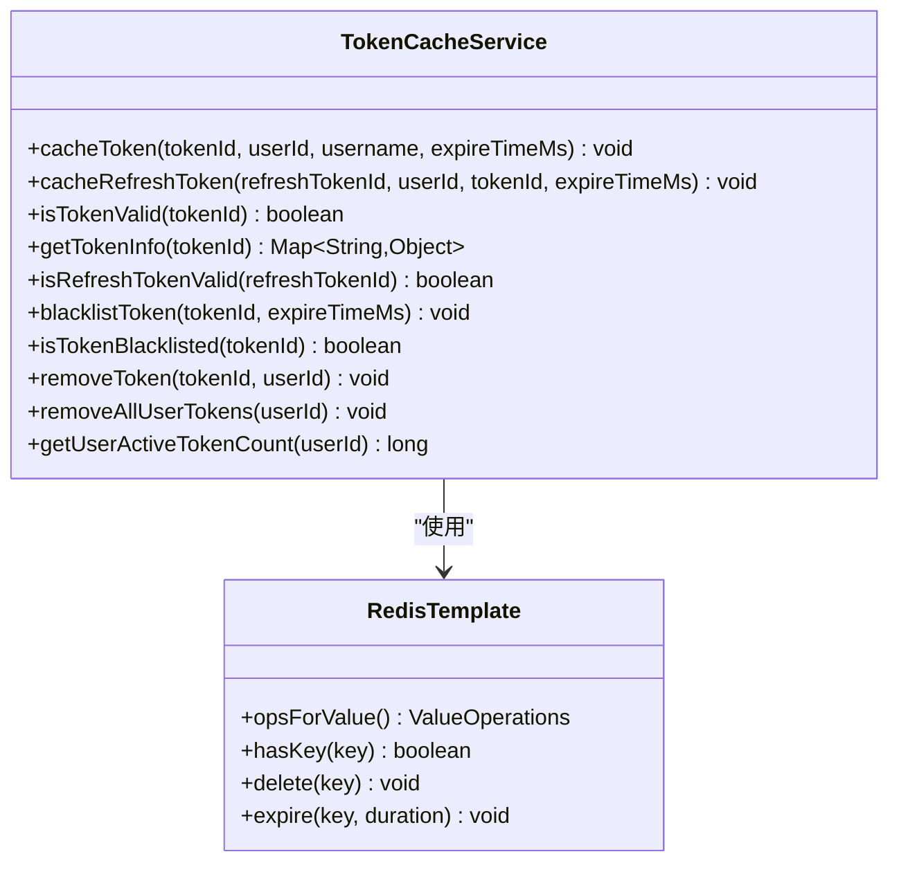

**图源**
- [TokenCacheService.java](file://src/main/java/com/yizhaoqi/smartpai/service/TokenCacheService.java)

**节源**
- [TokenCacheService.java](file://src/main/java/com/yizhaoqi/smartpai/service/TokenCacheService.java)

### 模型提供商配置服务
**ModelProviderConfigService** 支持多种AI模型提供商的动态配置，包括DeepSeek、Qwen、ZhipuAI等，提供连接测试和配置热更新功能。

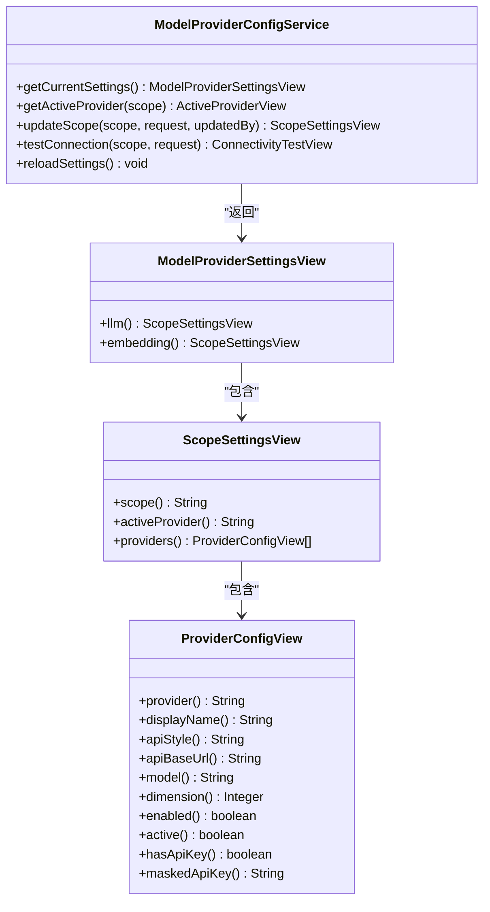

**图源**
- [ModelProviderConfigService.java](file://src/main/java/com/yizhaoqi/smartpai/service/ModelProviderConfigService.java)

**节源**
- [ModelProviderConfigService.java](file://src/main/java/com/yizhaoqi/smartpai/service/ModelProviderConfigService.java)

### 使用配额服务
**UsageQuotaService** 和 **UsageBalanceQuotaService** 实现了双模式的用户Token使用管理，支持Redis计数模式和余额模式。

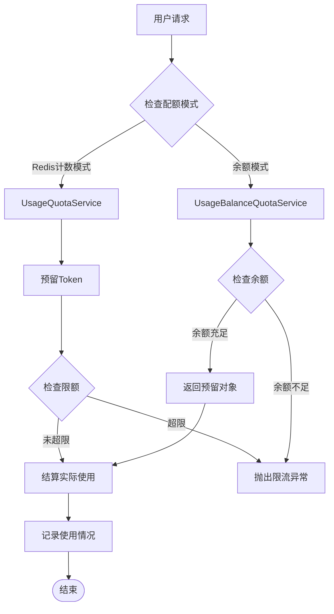

**图源**
- [UsageQuotaService.java](file://src/main/java/com/yizhaoqi/smartpai/service/UsageQuotaService.java)
- [UsageBalanceQuotaService.java](file://src/main/java/com/yizhaoqi/smartpai/service/UsageBalanceQuotaService.java)
- [UserTokenService.java](file://src/main/java/com/yizhaoqi/smartpai/service/UserTokenService.java)

**节源**
- [UsageQuotaService.java](file://src/main/java/com/yizhaoqi/smartpai/service/UsageQuotaService.java)
- [UsageBalanceQuotaService.java](file://src/main/java/com/yizhaoqi/smartpai/service/UsageBalanceQuotaService.java)
- [UserTokenService.java](file://src/main/java/com/yizhaoqi/smartpai/service/UserTokenService.java)

### 邀请码服务
**InviteCodeService** 提供邀请码的创建、验证和管理功能，支持批量生成和管理员权限控制。

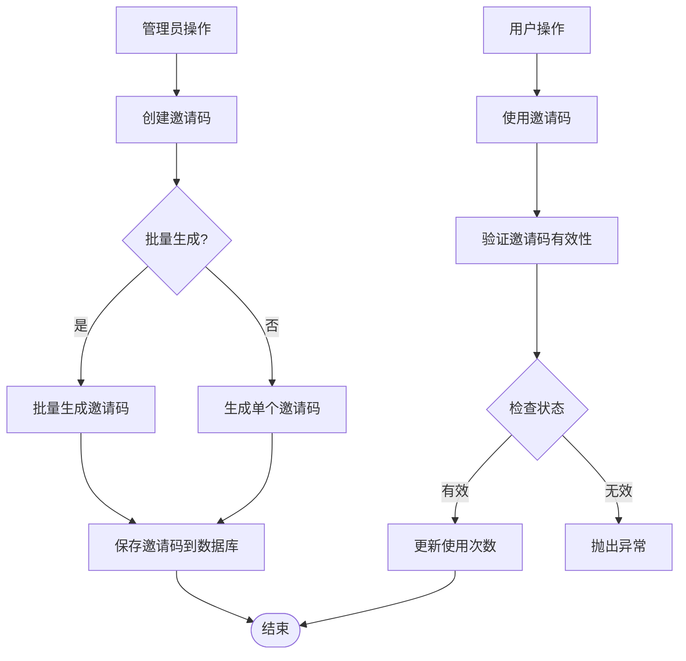

**图源**
- [InviteCodeService.java](file://src/main/java/com/yizhaoqi/smartpai/service/InviteCodeService.java)
- [InviteCodeRepository.java](file://src/main/java/com/yizhaoqi/smartpai/repository/InviteCodeRepository.java)

**节源**
- [InviteCodeService.java](file://src/main/java/com/yizhaoqi/smartpai/service/InviteCodeService.java)
- [InviteCodeRepository.java](file://src/main/java/com/yizhaoqi/smartpai/repository/InviteCodeRepository.java)

### 速率限制服务
**RateLimitService** 和 **RateLimitConfigService** 实现了多维度的流量控制，包括IP级限制、用户级限制和Token预算限制。

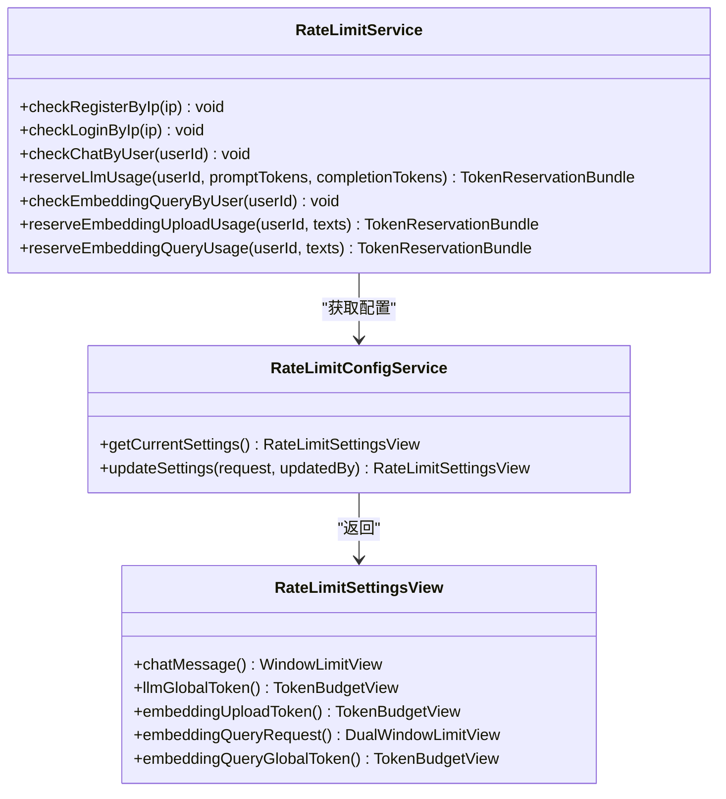

**图源**
- [RateLimitService.java](file://src/main/java/com/yizhaoqi/smartpai/service/RateLimitService.java)
- [RateLimitConfigService.java](file://src/main/java/com/yizhaoqi/smartpai/service/RateLimitConfigService.java)

**节源**
- [RateLimitService.java](file://src/main/java/com/yizhaoqi/smartpai/service/RateLimitService.java)
- [RateLimitConfigService.java](file://src/main/java/com/yizhaoqi/smartpai/service/RateLimitConfigService.java)

### 使用仪表盘服务
**UsageDashboardService** 提供系统使用情况的可视化展示，包括使用趋势、排行榜和预警信息。

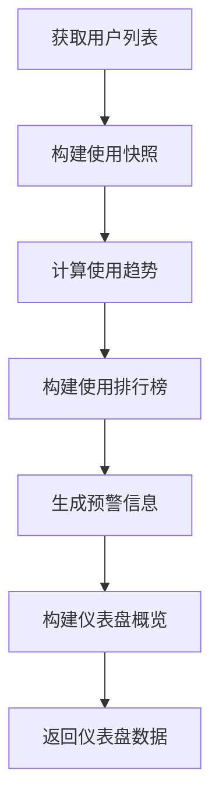

**图源**
- [UsageDashboardService.java](file://src/main/java/com/yizhaoqi/smartpai/service/UsageDashboardService.java)
- [UsageQuotaService.java](file://src/main/java/com/yizhaoqi/smartpai/service/UsageQuotaService.java)

**节源**
- [UsageDashboardService.java](file://src/main/java/com/yizhaoqi/smartpai/service/UsageDashboardService.java)

## 依赖分析
服务层的组件之间通过Spring的依赖注入紧密协作。`UploadService`依赖于`MinioClient`、`RedisTemplate`和`FileUploadRepository`；`ParseService`依赖于`DocumentVectorRepository`；`VectorizationService`依赖于`EmbeddingClient`和`ElasticsearchService`。`FileProcessingConsumer`作为协调者，注入了`ParseService`和`VectorizationService`，实现了业务流程的编排。

**更新** 新增服务间的依赖关系：
- **RechargeService** 依赖于 `WxPayService`、`RechargePackageRepository`、`RechargeOrderRepository`、`UserTokenService`
- **TokenCacheService** 依赖于 `RedisTemplate<String,Object>`
- **ModelProviderConfigService** 依赖于 `ModelProviderConfigRepository`、`SecretCryptoService`
- **UsageQuotaService** 和 **UsageBalanceQuotaService** 依赖于 `StringRedisTemplate`、`UsageQuotaProperties`
- **InviteCodeService** 依赖于 `InviteCodeRepository`、`UserRepository`
- **RateLimitService** 依赖于 `RateLimitConfigService`、`UsageQuotaService`
- **UsageDashboardService** 依赖于 `UserRepository`、`UsageQuotaService`

```mermaid
graph TD
UploadService --> MinioClient
UploadService --> RedisTemplate
UploadService --> FileUploadRepository
UploadService --> ChunkInfoRepository
ParseService --> DocumentVectorRepository
VectorizationService --> EmbeddingClient
VectorizationService --> ElasticsearchService
VectorizationService --> DocumentVectorRepository
FileProcessingConsumer --> ParseService
FileProcessingConsumer --> VectorizationService
DocumentService --> FileUploadRepository
DocumentService --> DocumentVectorRepository
DocumentService --> MinioClient
DocumentService --> ElasticsearchService
DocumentService --> OrgTagCacheService
DocumentService --> UserRepository
RechargeService --> WxPayService
RechargeService --> RechargePackageRepository
RechargeService --> RechargeOrderRepository
RechargeService --> UserTokenService
TokenCacheService --> RedisTemplate
ModelProviderConfigService --> ModelProviderConfigRepository
ModelProviderConfigService --> SecretCryptoService
UsageQuotaService --> StringRedisTemplate
UsageQuotaService --> UsageQuotaProperties
UsageBalanceQuotaService --> UserTokenService
InviteCodeService --> InviteCodeRepository
InviteCodeService --> UserRepository
RateLimitService --> RateLimitConfigService
RateLimitService --> UsageQuotaService
UsageDashboardService --> UserRepository
UsageDashboardService --> UsageQuotaService
```

**图源**
- [UploadService.java](file://src/main/java/com/yizhaoqi/smartpai/service/UploadService.java)
- [ParseService.java](file://src/main/java/com/yizhaoqi/smartpai/service/ParseService.java)
- [VectorizationService.java](file://src/main/java/com/yizhaoqi/smartpai/service/VectorizationService.java)
- [FileProcessingConsumer.java](file://src/main/java/com/yizhaoqi/smartpai/consumer/FileProcessingConsumer.java)
- [DocumentService.java](file://src/main/java/com/yizhaoqi/smartpai/service/DocumentService.java)
- [RechargeService.java](file://src/main/java/com/yizhaoqi/smartpai/service/RechargeService.java)
- [TokenCacheService.java](file://src/main/java/com/yizhaoqi/smartpai/service/TokenCacheService.java)
- [ModelProviderConfigService.java](file://src/main/java/com/yizhaoqi/smartpai/service/ModelProviderConfigService.java)
- [UsageQuotaService.java](file://src/main/java/com/yizhaoqi/smartpai/service/UsageQuotaService.java)
- [UsageBalanceQuotaService.java](file://src/main/java/com/yizhaoqi/smartpai/service/UsageBalanceQuotaService.java)
- [InviteCodeService.java](file://src/main/java/com/yizhaoqi/smartpai/service/InviteCodeService.java)
- [RateLimitService.java](file://src/main/java/com/yizhaoqi/smartpai/service/RateLimitService.java)
- [UsageDashboardService.java](file://src/main/java/com/yizhaoqi/smartpai/service/UsageDashboardService.java)

**节源**
- [UploadService.java](file://src/main/java/com/yizhaoqi/smartpai/service/UploadService.java)
- [ParseService.java](file://src/main/java/com/yizhaoqi/smartpai/service/ParseService.java)
- [VectorizationService.java](file://src/main/java/com/yizhaoqi/smartpai/service/VectorizationService.java)
- [FileProcessingConsumer.java](file://src/main/java/com/yizhaoqi/smartpai/consumer/FileProcessingConsumer.java)
- [DocumentService.java](file://src/main/java/com/yizhaoqi/smartpai/service/DocumentService.java)
- [RechargeService.java](file://src/main/java/com/yizhaoqi/smartpai/service/RechargeService.java)
- [TokenCacheService.java](file://src/main/java/com/yizhaoqi/smartpai/service/TokenCacheService.java)
- [ModelProviderConfigService.java](file://src/main/java/com/yizhaoqi/smartpai/service/ModelProviderConfigService.java)
- [UsageQuotaService.java](file://src/main/java/com/yizhaoqi/smartpai/service/UsageQuotaService.java)
- [UsageBalanceQuotaService.java](file://src/main/java/com/yizhaoqi/smartpai/service/UsageBalanceQuotaService.java)
- [InviteCodeService.java](file://src/main/java/com/yizhaoqi/smartpai/service/InviteCodeService.java)
- [RateLimitService.java](file://src/main/java/com/yizhaoqi/smartpai/service/RateLimitService.java)
- [UsageDashboardService.java](file://src/main/java/com/yizhaoqi/smartpai/service/UsageDashboardService.java)

## 性能考量
服务层在性能方面进行了多项优化。`UploadService`使用Redis位图来高效管理分片状态，避免了数据库的频繁读写。`ParseService`在解析大文件时，通过`StreamingContentHandler`和`checkMemoryThreshold`方法来监控内存使用，防止内存溢出。`VectorizationService`通过批量调用AI模型API来提高向量化效率。`ElasticsearchService`使用批量索引（bulk index）来提升数据写入性能。

**更新** 新增性能优化措施：
- **Redis集群优化**：TokenCacheService使用Redis集群的原子操作，减少网络往返
- **配置热更新**：ModelProviderConfigService支持配置的热加载，避免重启影响
- **批量操作**：UsageBalanceQuotaService使用批量Redis操作，减少网络开销
- **缓存策略**：RateLimitService结合Redis TTL和过期策略，避免内存泄漏
- **异步处理**：充值回调通过消息队列异步处理，提高响应速度

## 故障排除指南
- **文件上传失败**：检查MinIO服务是否正常运行，确认`minioClient`配置正确。
- **分片状态不一致**：检查Redis服务是否正常，确认`redisTemplate`配置正确。
- **文档解析失败**：检查文件格式是否支持，确认`ParseService`的依赖库（如Apache Tika）已正确引入。
- **向量化失败**：检查AI模型服务是否正常，确认`EmbeddingClient`的API密钥和URL配置正确。
- **Elasticsearch索引失败**：检查Elasticsearch服务是否正常，确认`esClient`配置正确。
- **充值失败**：检查微信支付配置，确认回调地址和密钥设置正确。
- **令牌验证失败**：检查Redis连接，确认TokenCacheService的键空间配置。
- **模型配置错误**：检查API密钥和URL，使用ModelProviderConfigService的连接测试功能。
- **配额限制异常**：检查Redis配置，确认UsageQuotaService的键空间和TTL设置。
- **邀请码无效**：检查数据库连接，确认InviteCodeRepository的查询条件。

**节源**
- [UploadService.java](file://src/main/java/com/yizhaoqi/smartpai/service/UploadService.java)
- [ParseService.java](file://src/main/java/com/yizhaoqi/smartpai/service/ParseService.java)
- [VectorizationService.java](file://src/main/java/com/yizhaoqi/smartpai/service/VectorizationService.java)
- [ElasticsearchService.java](file://src/main/java/com/yizhaoqi/smartpai/service/ElasticsearchService.java)
- [EmbeddingClient.java](file://src/main/java/com/yizhaoqi/smartpai/client/EmbeddingClient.java)
- [RechargeService.java](file://src/main/java/com/yizhaoqi/smartpai/service/RechargeService.java)
- [TokenCacheService.java](file://src/main/java/com/yizhaoqi/smartpai/service/TokenCacheService.java)
- [ModelProviderConfigService.java](file://src/main/java/com/yizhaoqi/smartpai/service/ModelProviderConfigService.java)
- [UsageQuotaService.java](file://src/main/java/com/yizhaoqi/smartpai/service/UsageQuotaService.java)
- [InviteCodeService.java](file://src/main/java/com/yizhaoqi/smartpai/service/InviteCodeService.java)
- [RateLimitService.java](file://src/main/java/com/yizhaoqi/smartpai/service/RateLimitService.java)

## 结论
PaiSmart后端服务层通过清晰的职责划分和高效的组件协作，实现了复杂的业务逻辑。服务层通过依赖注入、缓存、异步处理和批量操作等技术手段，确保了系统的高性能和高可用性。

**更新** 新增的服务模块进一步增强了系统的商业化能力和用户体验：
- **充值服务**：完善的支付流程和订单管理，支持多种充值方式
- **令牌管理**：基于Redis的令牌状态管理，支持批量登出和黑名单机制
- **模型配置**：灵活的多供应商配置，支持动态切换和连接测试
- **使用监控**：双模式的配额管理，支持余额模式和计数模式
- **邀请系统**：完整的邀请码生命周期管理
- **流量控制**：多维度的限流策略，保障系统稳定性
- **数据可视化**：全面的使用情况仪表盘

开发者在进行业务逻辑开发时，应遵循类似的模式，将业务逻辑封装在Service类中，通过Repository访问数据，通过Client调用外部服务，并利用消息队列处理耗时任务，以保证系统的可维护性和可扩展性。新增的服务模块为系统的商业化运营提供了坚实的技术基础，建议在实际部署中重点关注Redis配置、支付安全和模型配置的正确性。