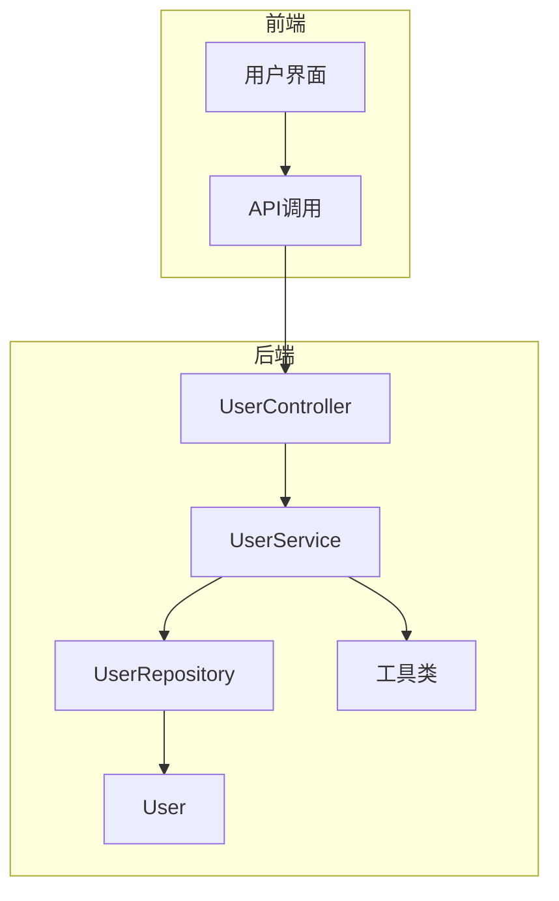
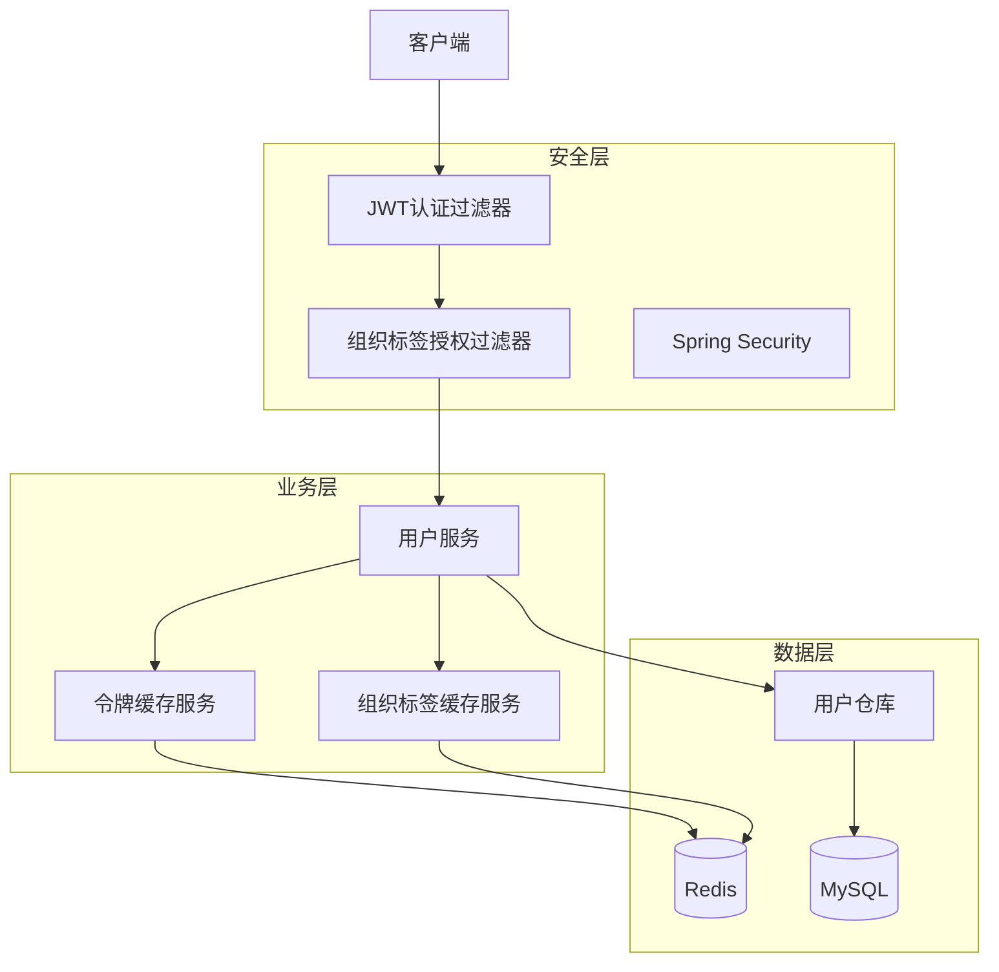
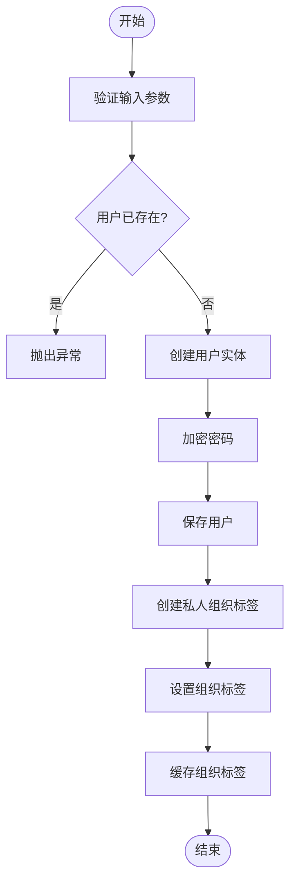
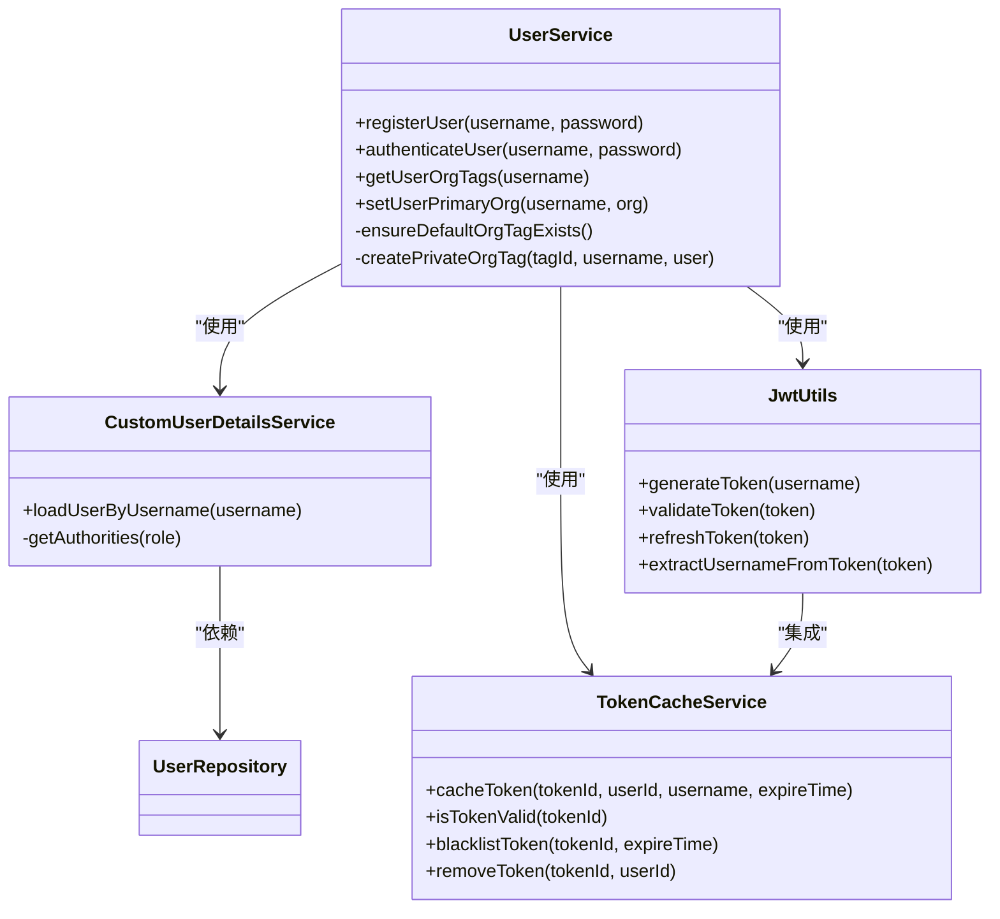
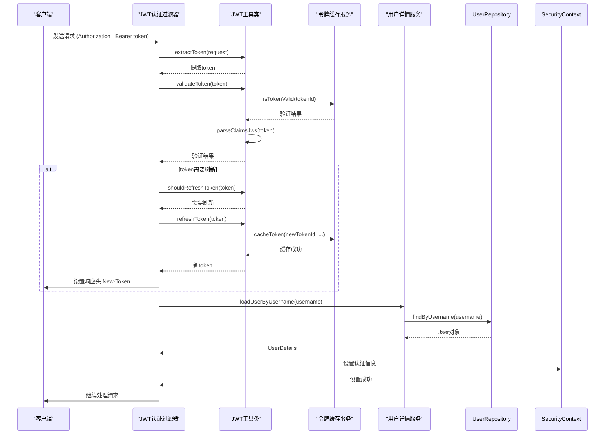
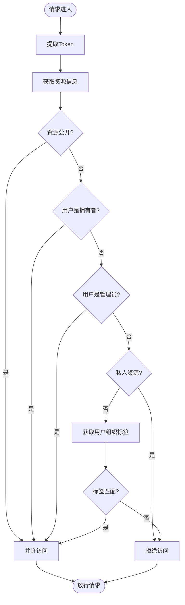
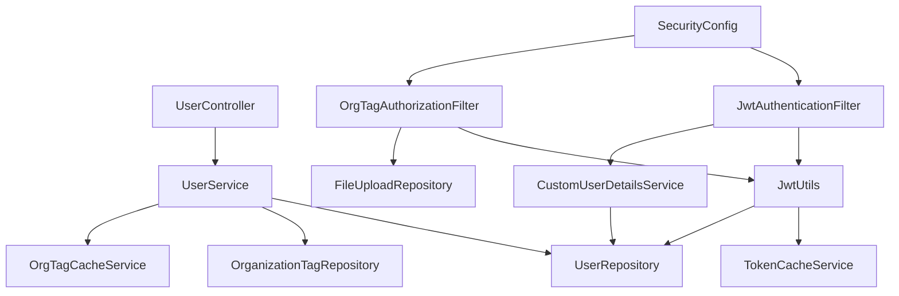

# 用户管理服务

<cite>
**本文档引用的文件**   
- [UserController.java](file://src/main/java/com/yizhaoqi/smartpai/controller/UserController.java)
- [UserService.java](file://src/main/java/com/yizhaoqi/smartpai/service/UserService.java)
- [CustomUserDetailsService.java](file://src/main/java/com/yizhaoqi/smartpai/service/CustomUserDetailsService.java)
- [JwtUtils.java](file://src/main/java/com/yizhaoqi/smartpai/utils/JwtUtils.java)
- [JwtAuthenticationFilter.java](file://src/main/java/com/yizhaoqi/smartpai/config/JwtAuthenticationFilter.java)
- [OrgTagAuthorizationFilter.java](file://src/main/java/com/yizhaoqi/smartpai/config/OrgTagAuthorizationFilter.java)
- [SecurityConfig.java](file://src/main/java/com/yizhaoqi/smartpai/config/SecurityConfig.java)
- [TokenCacheService.java](file://src/main/java/com/yizhaoqi/smartpai/service/TokenCacheService.java)
- [OrgTagCacheService.java](file://src/main/java/com/yizhaoqi/smartpai/service/OrgTagCacheService.java)
- [User.java](file://src/main/java/com/yizhaoqi/smartpai/model/User.java)
- [OrganizationTag.java](file://src/main/java/com/yizhaoqi/smartpai/model/OrganizationTag.java)
- [PasswordUtil.java](file://src/main/java/com/yizhaoqi/smartpai/utils/PasswordUtil.java)
</cite>

## 目录
1. [项目结构](#项目结构)
2. [核心组件](#核心组件)
3. [架构概览](#架构概览)
4. [详细组件分析](#详细组件分析)
5. [依赖分析](#依赖分析)
6. [性能考虑](#性能考虑)
7. [故障排除指南](#故障排除指南)

## 项目结构
用户管理服务采用典型的分层架构，包含控制器、服务、实体和工具类。前端通过REST API与后端交互，后端使用Spring Boot框架实现。

**图示来源**
- [UserController.java](file://src/main/java/com/yizhaoqi/smartpai/controller/UserController.java)
- [UserService.java](file://src/main/java/com/yizhaoqi/smartpai/service/UserService.java)

**本节来源**
- [UserController.java](file://src/main/java/com/yizhaoqi/smartpai/controller/UserController.java)
- [UserService.java](file://src/main/java/com/yizhaoqi/smartpai/service/UserService.java)

## 核心组件
用户管理服务的核心功能包括用户注册、登录、权限校验等。系统通过JWT实现无状态认证，并结合Redis缓存提升性能。

**本节来源**
- [UserService.java](file://src/main/java/com/yizhaoqi/smartpai/service/UserService.java)
- [JwtUtils.java](file://src/main/java/com/yizhaoqi/smartpai/utils/JwtUtils.java)

## 架构概览
系统采用Spring Security进行安全控制，通过自定义过滤器实现JWT认证和组织标签授权。整体架构如下：

**图示来源**
- [SecurityConfig.java](file://src/main/java/com/yizhaoqi/smartpai/config/SecurityConfig.java)
- [JwtAuthenticationFilter.java](file://src/main/java/com/yizhaoqi/smartpai/config/JwtAuthenticationFilter.java)
- [OrgTagAuthorizationFilter.java](file://src/main/java/com/yizhaoqi/smartpai/config/OrgTagAuthorizationFilter.java)

## 详细组件分析

### 用户服务分析
UserService实现了用户注册、登录和权限管理的核心业务逻辑。

#### 用户注册流程

**图示来源**
- [UserService.java](file://src/main/java/com/yizhaoqi/smartpai/service/UserService.java#L50-L100)

#### 用户认证类图

**图示来源**
- [UserService.java](file://src/main/java/com/yizhaoqi/smartpai/service/UserService.java)
- [CustomUserDetailsService.java](file://src/main/java/com/yizhaoqi/smartpai/service/CustomUserDetailsService.java)
- [JwtUtils.java](file://src/main/java/com/yizhaoqi/smartpai/utils/JwtUtils.java)
- [TokenCacheService.java](file://src/main/java/com/yizhaoqi/smartpai/service/TokenCacheService.java)

**本节来源**
- [UserService.java](file://src/main/java/com/yizhaoqi/smartpai/service/UserService.java#L50-L200)
- [CustomUserDetailsService.java](file://src/main/java/com/yizhaoqi/smartpai/service/CustomUserDetailsService.java#L20-L50)

### JWT认证流程分析
基于JWT的认证流程确保了系统的安全性。

#### JWT认证序列图

**图示来源**
- [JwtAuthenticationFilter.java](file://src/main/java/com/yizhaoqi/smartpai/config/JwtAuthenticationFilter.java#L40-L90)
- [JwtUtils.java](file://src/main/java/com/yizhaoqi/smartpai/utils/JwtUtils.java#L100-L200)
- [TokenCacheService.java](file://src/main/java/com/yizhaoqi/smartpai/service/TokenCacheService.java#L50-L100)

### 组织标签授权分析
系统通过组织标签实现细粒度的权限控制。

#### 组织标签授权流程

**图示来源**
- [OrgTagAuthorizationFilter.java](file://src/main/java/com/yizhaoqi/smartpai/config/OrgTagAuthorizationFilter.java#L50-L150)

## 依赖分析
系统各组件之间的依赖关系清晰，遵循了良好的设计原则。

**图示来源**
- [SecurityConfig.java](file://src/main/java/com/yizhaoqi/smartpai/config/SecurityConfig.java)
- [JwtAuthenticationFilter.java](file://src/main/java/com/yizhaoqi/smartpai/config/JwtAuthenticationFilter.java)
- [OrgTagAuthorizationFilter.java](file://src/main/java/com/yizhaoqi/smartpai/config/OrgTagAuthorizationFilter.java)

**本节来源**
- [SecurityConfig.java](file://src/main/java/com/yizhaoqi/smartpai/config/SecurityConfig.java#L50-L90)

## 性能考虑
系统通过多种机制优化性能：

1. **Redis缓存**：使用Redis缓存JWT令牌状态和组织标签信息，减少数据库查询
2. **自动刷新**：实现token预刷新机制，避免用户感知到token过期
3. **批量操作**：提供批量登出功能，提高会话管理效率
4. **连接池**：数据库和Redis连接使用连接池管理

**本节来源**
- [TokenCacheService.java](file://src/main/java/com/yizhaoqi/smartpai/service/TokenCacheService.java)
- [OrgTagCacheService.java](file://src/main/java/com/yizhaoqi/smartpai/service/OrgTagCacheService.java)

## 故障排除指南
常见问题及解决方案：

**本节来源**
- [UserService.java](file://src/main/java/com/yizhaoqi/smartpai/service/UserService.java#L700-L800)
- [JwtUtils.java](file://src/main/java/com/yizhaoqi/smartpai/utils/JwtUtils.java#L400-L430)
- [TokenCacheService.java](file://src/main/java/com/yizhaoqi/smartpai/service/TokenCacheService.java#L200-L250)