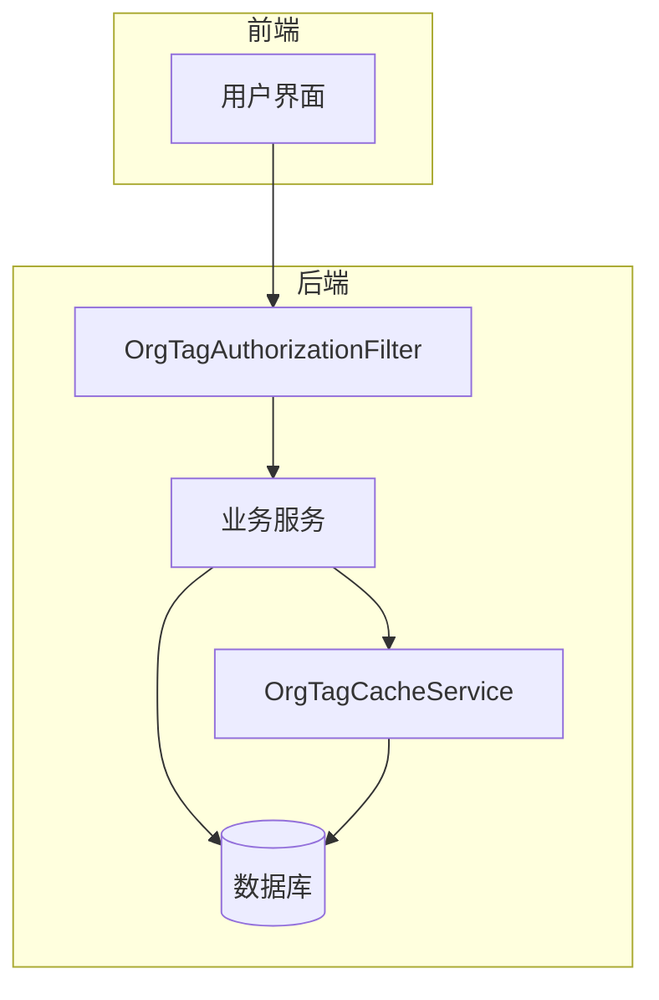
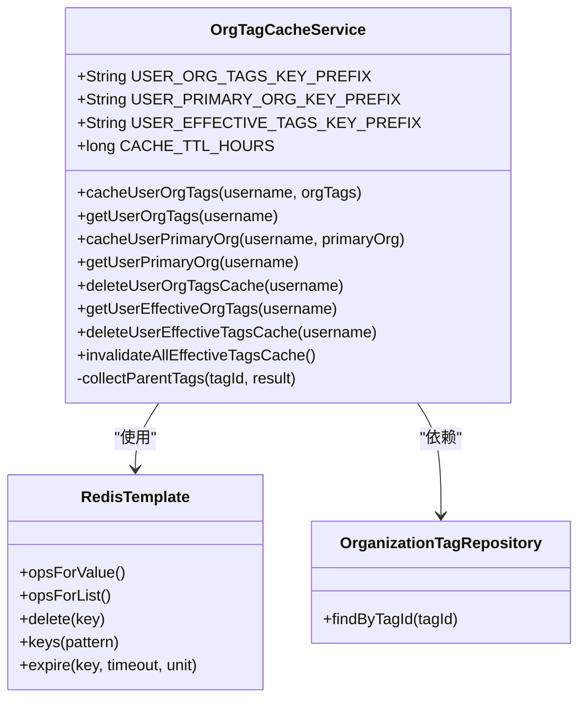
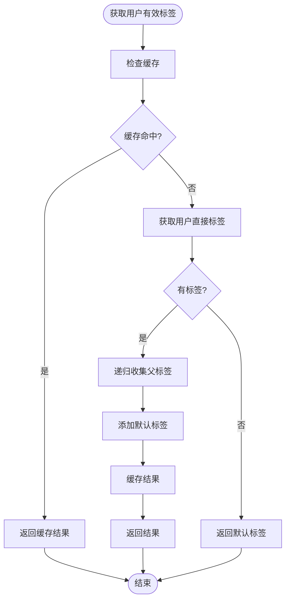
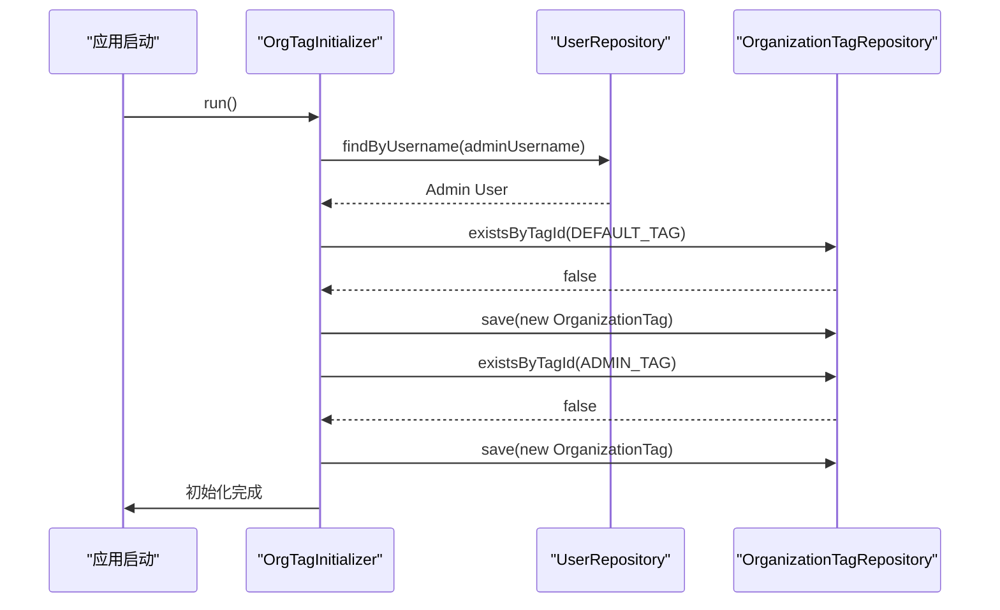
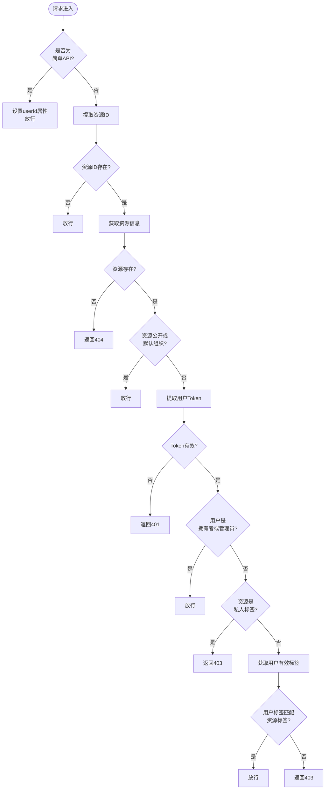
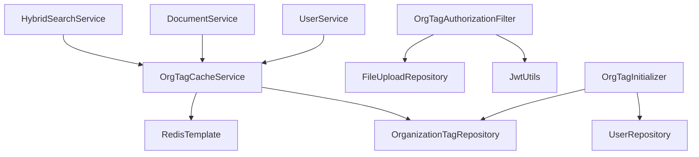
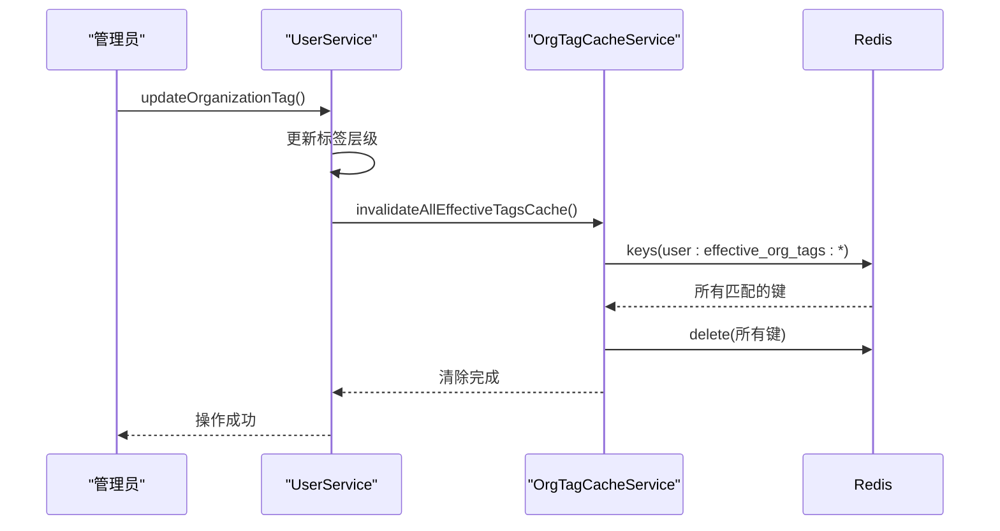

# 缓存与标签服务

<cite>
**本文档中引用的文件**   
- [OrgTagCacheService.java](file://src/main/java/com/yizhaoqi/smartpai/service/OrgTagCacheService.java)
- [OrgTagInitializer.java](file://src/main/java/com/yizhaoqi/smartpai/config/OrgTagInitializer.java)
- [OrgTagAuthorizationFilter.java](file://src/main/java/com/yizhaoqi/smartpai/config/OrgTagAuthorizationFilter.java)
- [OrganizationTag.java](file://src/main/java/com/yizhaoqi/smartpai/model/OrganizationTag.java)
- [OrganizationTagRepository.java](file://src/main/java/com/yizhaoqi/smartpai/repository/OrganizationTagRepository.java)
- [UserService.java](file://src/main/java/com/yizhaoqi/smartpai/service/UserService.java)
- [DocumentService.java](file://src/main/java/com/yizhaoqi/smartpai/service/DocumentService.java)
- [HybridSearchService.java](file://src/main/java/com/yizhaoqi/smartpai/service/HybridSearchService.java)
- [User.java](file://src/main/java/com/yizhaoqi/smartpai/model/User.java)
- [RedisConfig.java](file://src/main/java/com/yizhaoqi/smartpai/config/RedisConfig.java)
</cite>

## 目录
1. [引言](#引言)
2. [核心组件分析](#核心组件分析)
3. [架构概览](#架构概览)
4. [详细组件分析](#详细组件分析)
5. [依赖关系分析](#依赖关系分析)
6. [性能与缓存策略](#性能与缓存策略)
7. [实际业务场景应用](#实际业务场景应用)
8. [结论](#结论)

## 引言
本文档深入探讨了企业级多租户场景下的组织标签（OrgTag）管理机制。系统通过`OrgTagCacheService`利用Redis缓存显著提升了权限校验的效率。文档将详细说明标签的初始化流程（`OrgTagInitializer`）、请求过滤器（`OrgTagAuthorizationFilter`）的拦截逻辑，以及标签与用户、文档的关联关系管理。同时，将提供缓存失效策略、数据一致性保障和高并发访问下的性能优化方案，并结合实际业务场景说明标签权限控制的实现细节。

## 核心组件分析
本系统的核心围绕组织标签的管理与权限控制展开，主要由`OrgTagCacheService`、`OrgTagInitializer`和`OrgTagAuthorizationFilter`三大组件构成。`OrgTagCacheService`作为缓存服务，负责将用户的组织标签信息存储在Redis中，避免了频繁的数据库查询。`OrgTagInitializer`在应用启动时自动创建必要的默认标签，确保系统初始化的完整性。`OrgTagAuthorizationFilter`则作为全局过滤器，在请求处理前进行细粒度的权限校验，是实现数据访问安全的关键。

**本文档中引用的文件**   
- [OrgTagCacheService.java](file://src/main/java/com/yizhaoqi/smartpai/service/OrgTagCacheService.java)
- [OrgTagInitializer.java](file://src/main/java/com/yizhaoqi/smartpai/config/OrgTagInitializer.java)
- [OrgTagAuthorizationFilter.java](file://src/main/java/com/yizhaoqi/smartpai/config/OrgTagAuthorizationFilter.java)

## 架构概览
系统采用分层架构，前端通过API与后端交互。后端的核心是组织标签权限体系，它贯穿于用户管理、文档服务和搜索服务等多个模块。当用户发起请求时，`OrgTagAuthorizationFilter`会首先拦截，根据JWT令牌中的信息和资源的组织标签进行授权判断。`OrgTagCacheService`为授权过程提供高速缓存支持，而`UserService`和`DocumentService`等业务服务则负责具体的业务逻辑处理和数据持久化。



**图示来源**
- [OrgTagAuthorizationFilter.java](file://src/main/java/com/yizhaoqi/smartpai/config/OrgTagAuthorizationFilter.java)
- [OrgTagCacheService.java](file://src/main/java/com/yizhaoqi/smartpai/service/OrgTagCacheService.java)
- [UserService.java](file://src/main/java/com/yizhaoqi/smartpai/service/UserService.java)

## 详细组件分析

### OrgTagCacheService 分析
`OrgTagCacheService`是整个权限体系的性能基石。它使用RedisTemplate将用户的组织标签、主组织标签和有效标签集合缓存起来，极大地减少了数据库的访问压力。

#### 类结构与数据流


**图示来源**
- [OrgTagCacheService.java](file://src/main/java/com/yizhaoqi/smartpai/service/OrgTagCacheService.java)
- [RedisConfig.java](file://src/main/java/com/yizhaoqi/smartpai/config/RedisConfig.java)
- [OrganizationTagRepository.java](file://src/main/java/com/yizhaoqi/smartpai/repository/OrganizationTagRepository.java)

#### 核心方法：getUserEffectiveOrgTags
该方法是权限校验的核心。它不仅返回用户直接拥有的标签，还通过`collectParentTags`递归查询其所有父标签，形成一个完整的“有效标签”集合。这使得用户可以访问其所属组织及其所有子组织的资源。



**图示来源**
- [OrgTagCacheService.java](file://src/main/java/com/yizhaoqi/smartpai/service/OrgTagCacheService.java#L135-L200)

### OrgTagInitializer 分析
`OrgTagInitializer`是一个命令行运行器（`CommandLineRunner`），在应用启动时自动执行，确保系统拥有必要的基础标签。

#### 初始化流程


**图示来源**
- [OrgTagInitializer.java](file://src/main/java/com/yizhaoqi/smartpai/config/OrgTagInitializer.java)

### OrgTagAuthorizationFilter 分析
该过滤器是安全防线的最前线，实现了复杂的多级访问控制逻辑。

#### 权限校验流程


**图示来源**
- [OrgTagAuthorizationFilter.java](file://src/main/java/com/yizhaoqi/smartpai/config/OrgTagAuthorizationFilter.java#L50-L190)

## 依赖关系分析
各组件之间形成了清晰的依赖链。`UserService`在用户注册和分配标签时，会调用`OrgTagCacheService`来更新缓存。`DocumentService`和`HybridSearchService`在执行业务逻辑时，会调用`OrgTagCacheService`的`getUserEffectiveOrgTags`方法来获取用户的权限集合。`OrgTagAuthorizationFilter`则直接依赖`JwtUtils`和`FileUploadRepository`来完成授权。



**图示来源**
- [UserService.java](file://src/main/java/com/yizhaoqi/smartpai/service/UserService.java)
- [DocumentService.java](file://src/main/java/com/yizhaoqi/smartpai/service/DocumentService.java)
- [HybridSearchService.java](file://src/main/java/com/yizhaoqi/smartpai/service/HybridSearchService.java)
- [OrgTagCacheService.java](file://src/main/java/com/yizhaoqi/smartpai/service/OrgTagCacheService.java)

## 性能与缓存策略

### 缓存键设计
`OrgTagCacheService`采用了清晰的命名空间来组织Redis中的键：
- **用户组织标签**: `user:org_tags:{username}`
- **用户主组织**: `user:primary_org:{username}`
- **用户有效标签**: `user:effective_org_tags:{username}`

这种设计避免了键名冲突，并且便于通过`keys`命令进行模式匹配和批量操作。

### 缓存失效策略
系统采用了两种缓存失效策略：
1.  **TTL过期**: 所有缓存项都设置了24小时的过期时间（`CACHE_TTL_HOURS`），确保数据不会永久陈旧。
2.  **主动失效**: 当组织标签的层级结构发生变化时（如创建、更新、删除标签），会调用`invalidateAllEffectiveTagsCache`方法，清除所有以`user:effective_org_tags:`为前缀的缓存。这保证了权限数据的强一致性。



**图示来源**
- [UserService.java](file://src/main/java/com/yizhaoqi/smartpai/service/UserService.java#L573)
- [OrgTagCacheService.java](file://src/main/java/com/yizhaoqi/smartpai/service/OrgTagCacheService.java#L220)

## 实际业务场景应用

### 文档访问控制
在`DocumentService`中，当用户请求获取可访问的文件列表时，服务会调用`orgTagCacheService.getUserEffectiveOrgTags()`来获取用户的完整权限集合，然后使用该集合去数据库查询用户有权访问的文件。

**代码示例**
```java
// DocumentService.java
List<String> userEffectiveTags = orgTagCacheService.getUserEffectiveOrgTags(user.getUsername());
List<FileUpload> files = fileUploadRepository.findAccessibleFilesWithTags(userId, userEffectiveTags);
```

**本文档中引用的文件**   
- [DocumentService.java](file://src/main/java/com/yizhaoqi/smartpai/service/DocumentService.java#L131)

### 混合搜索权限过滤
在`HybridSearchService`中，搜索功能同样集成了权限控制。在执行Elasticsearch查询时，会将`userEffectiveTags`作为过滤条件之一，确保用户只能搜索到自己有权访问的文档。

**代码示例**
```java
// HybridSearchService.java
.should(s3 -> {
    if (userEffectiveTags.isEmpty()) {
        return s3.matchNone(mn -> mn);
    } else if (userEffectiveTags.size() == 1) {
        return s3.term(t -> t.field("orgTag").value(userEffectiveTags.get(0)));
    } else {
        return s3.bool(innerBool -> {
            userEffectiveTags.forEach(tag -> innerBool.should(sh -> sh.term(t -> t.field("orgTag").value(tag))));
        });
    }
})
```

**本文档中引用的文件**   
- [HybridSearchService.java](file://src/main/java/com/yizhaoqi/smartpai/service/HybridSearchService.java#L165)

## 结论
该系统通过`OrgTagCacheService`、`OrgTagInitializer`和`OrgTagAuthorizationFilter`的协同工作，构建了一个高效、安全的多租户权限管理体系。利用Redis缓存有效标签，系统在高并发场景下依然能保持快速的权限校验速度。通过合理的缓存失效策略，保证了数据的一致性。整个设计充分考虑了企业级应用的复杂性，为文档管理、搜索等核心功能提供了坚实的权限基础。