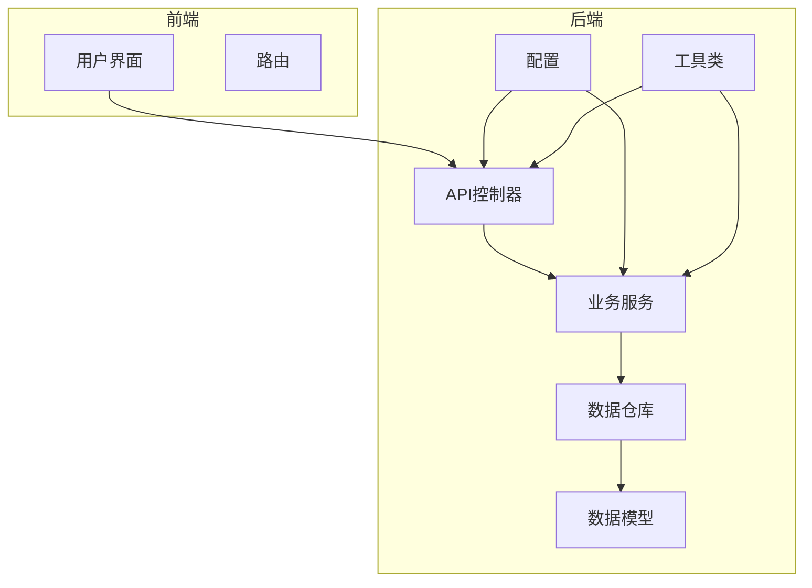
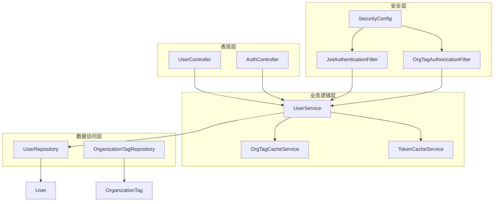
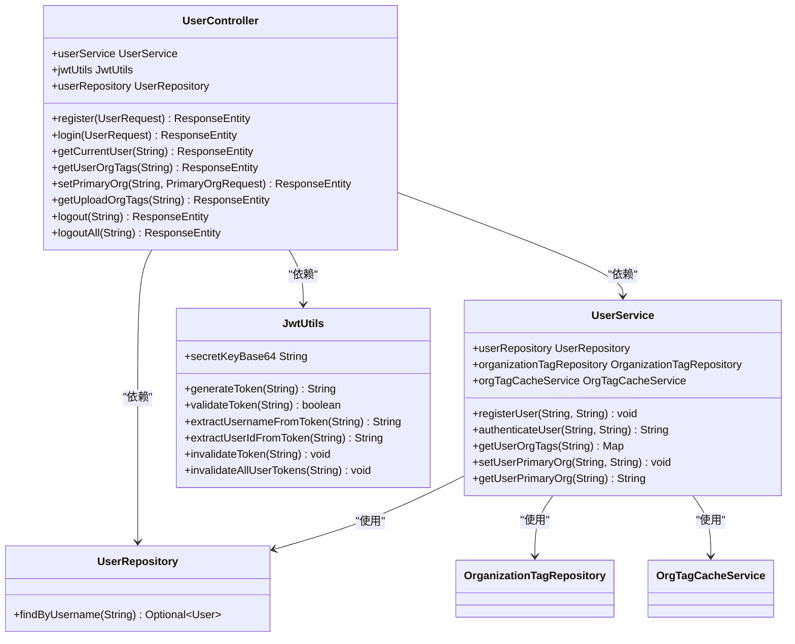
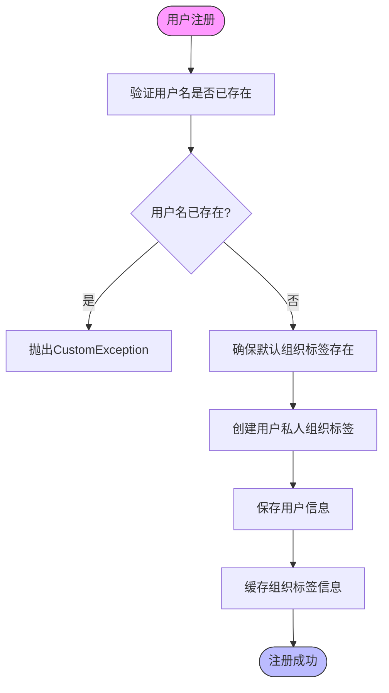
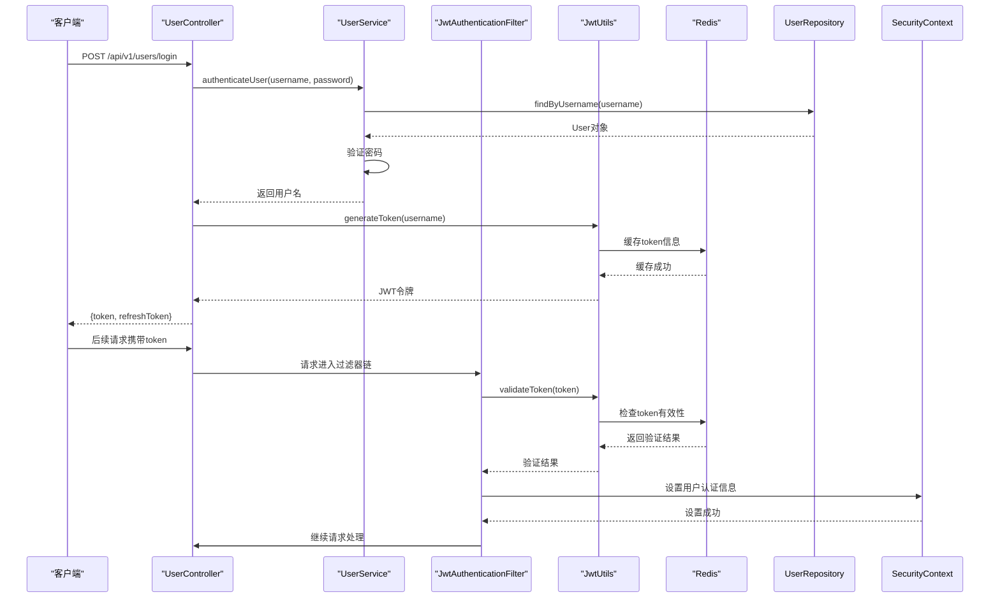
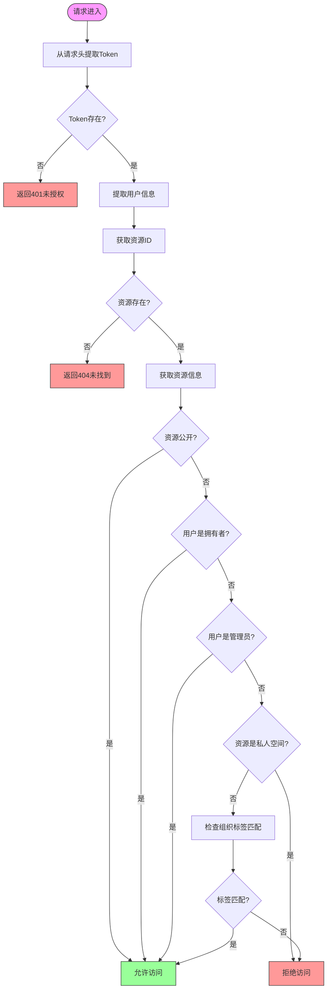
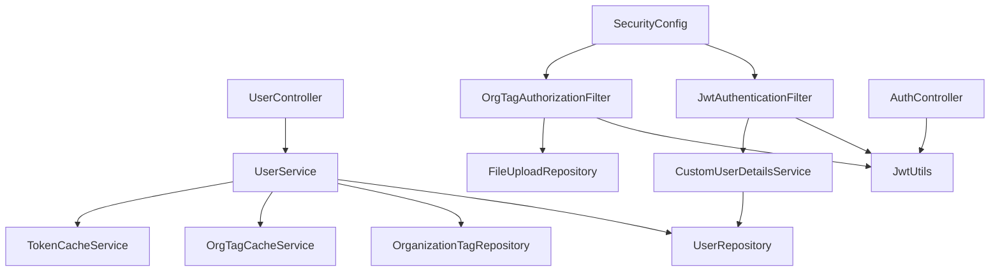

# 核心模块

<cite>
**本文档中引用的文件**   
- [UserController.java](file://src/main/java/com/yizhaoqi/smartpai/controller/UserController.java)
- [UserService.java](file://src/main/java/com/yizhaoqi/smartpai/service/UserService.java)
- [UserRepository.java](file://src/main/java/com/yizhaoqi/smartpai/repository/UserRepository.java)
- [User.java](file://src/main/java/com/yizhaoqi/smartpai/model/User.java)
- [JwtUtils.java](file://src/main/java/com/yizhaoqi/smartpai/utils/JwtUtils.java)
- [OrgTagCacheService.java](file://src/main/java/com/yizhaoqi/smartpai/service/OrgTagCacheService.java)
- [TokenCacheService.java](file://src/main/java/com/yizhaoqi/smartpai/service/TokenCacheService.java)
- [SecurityConfig.java](file://src/main/java/com/yizhaoqi/smartpai/config/SecurityConfig.java)
- [JwtAuthenticationFilter.java](file://src/main/java/com/yizhaoqi/smartpai/config/JwtAuthenticationFilter.java)
- [OrgTagAuthorizationFilter.java](file://src/main/java/com/yizhaoqi/smartpai/config/OrgTagAuthorizationFilter.java)
- [CustomUserDetailsService.java](file://src/main/java/com/yizhaoqi/smartpai/service/CustomUserDetailsService.java)
- [OrganizationTag.java](file://src/main/java/com/yizhaoqi/smartpai/model/OrganizationTag.java)
- [OrganizationTagRepository.java](file://src/main/java/com/yizhaoqi/smartpai/repository/OrganizationTagRepository.java)
- [AuthController.java](file://src/main/java/com/yizhaoqi/smartpai/controller/AuthController.java)
- [FileUpload.java](file://src/main/java/com/yizhaoqi/smartpai/model/FileUpload.java)
</cite>

## 目录
1. [简介](#简介)
2. [项目结构](#项目结构)
3. [核心组件](#核心组件)
4. [架构概述](#架构概述)
5. [详细组件分析](#详细组件分析)
6. [依赖分析](#依赖分析)
7. [性能考虑](#性能考虑)
8. [故障排除指南](#故障排除指南)
9. [结论](#结论)

## 简介
本文档深入解析PaiSmart后端的核心模块设计，重点阐述controller、service、repository三层架构的职责划分与协作机制。通过分析AuthController.java和UserService.java等实际代码，说明请求处理流程、业务逻辑封装和数据访问实现。详细描述各模块的依赖注入方式、事务管理策略以及异常处理机制。提供典型调用链路的代码示例，如用户认证流程从控制器到服务再到仓库的完整执行路径。解释模块间的松耦合设计原则和可测试性考量，为开发者提供清晰的代码组织规范和扩展指导。

## 项目结构
PaiSmart项目采用典型的分层架构设计，前端和后端分离。后端代码位于src/main/java目录下，遵循Spring Boot的标准项目结构。核心模块主要集中在controller、service、repository和model包中，形成了清晰的MVC架构。配置文件位于config包中，工具类位于utils包中。这种结构化的组织方式使得代码职责分明，便于维护和扩展。

**图示来源**
- [UserController.java](file://src/main/java/com/yizhaoqi/smartpai/controller/UserController.java)
- [UserService.java](file://src/main/java/com/yizhaoqi/smartpai/service/UserService.java)
- [UserRepository.java](file://src/main/java/com/yizhaoqi/smartpai/repository/UserRepository.java)

## 核心组件

PaiSmart后端的核心组件包括用户控制器(UserController)、用户服务(UserService)、用户仓库(UserRepository)和用户实体(User)。这些组件共同实现了用户管理的核心功能，包括用户注册、登录、信息获取和组织标签管理。通过Spring框架的依赖注入机制，这些组件之间形成了松耦合的协作关系，每个组件专注于自己的职责领域。

**组件来源**
- [UserController.java](file://src/main/java/com/yizhaoqi/smartpai/controller/UserController.java#L1-L332)
- [UserService.java](file://src/main/java/com/yizhaoqi/smartpai/service/UserService.java#L1-L807)
- [UserRepository.java](file://src/main/java/com/yizhaoqi/smartpai/repository/UserRepository.java#L1-L11)
- [User.java](file://src/main/java/com/yizhaoqi/smartpai/model/User.java#L1-L44)

## 架构概述

PaiSmart后端采用典型的三层架构设计：表现层(Controller)、业务逻辑层(Service)和数据访问层(Repository)。这种分层架构实现了关注点分离，提高了代码的可维护性和可测试性。Spring Security框架用于实现安全控制，包括JWT认证和基于组织标签的授权。Redis被用作缓存层，提高系统性能。整个架构设计注重安全性、性能和可扩展性。

**图示来源**
- [UserController.java](file://src/main/java/com/yizhaoqi/smartpai/controller/UserController.java)
- [UserService.java](file://src/main/java/com/yizhaoqi/smartpai/service/UserService.java)
- [UserRepository.java](file://src/main/java/com/yizhaoqi/smartpai/repository/UserRepository.java)
- [SecurityConfig.java](file://src/main/java/com/yizhaoqi/smartpai/config/SecurityConfig.java)
- [JwtAuthenticationFilter.java](file://src/main/java/com/yizhaoqi/smartpai/config/JwtAuthenticationFilter.java)
- [OrgTagAuthorizationFilter.java](file://src/main/java/com/yizhaoqi/smartpai/config/OrgTagAuthorizationFilter.java)

## 详细组件分析

### 用户控制器分析
UserController是用户管理功能的入口，负责处理HTTP请求并返回响应。它通过@RestController注解标记为REST控制器，使用@RequestMapping指定基础路径为"/api/v1/users"。控制器中的每个方法对应一个具体的用户操作，如注册、登录、获取用户信息等。通过@Autowired注解，控制器依赖于UserService和JwtUtils等服务组件。

**图示来源**
- [UserController.java](file://src/main/java/com/yizhaoqi/smartpai/controller/UserController.java#L1-L332)
- [UserService.java](file://src/main/java/com/yizhaoqi/smartpai/service/UserService.java#L1-L807)
- [UserRepository.java](file://src/main/java/com/yizhaoqi/smartpai/repository/UserRepository.java#L1-L11)
- [JwtUtils.java](file://src/main/java/com/yizhaoqi/smartpai/utils/JwtUtils.java#L1-L434)

**组件来源**
- [UserController.java](file://src/main/java/com/yizhaoqi/smartpai/controller/UserController.java#L1-L332)

### 用户服务分析
UserService是用户管理的核心业务逻辑层，负责处理用户注册、认证和组织标签管理等业务逻辑。通过@Service注解标记为Spring服务组件，使用@Transactional注解确保数据操作的原子性。服务层封装了复杂的业务规则，如用户注册时自动创建私人组织标签，组织标签的层级管理和权限控制等。

**图示来源**
- [UserService.java](file://src/main/java/com/yizhaoqi/smartpai/service/UserService.java#L1-L807)

**组件来源**
- [UserService.java](file://src/main/java/com/yizhaoqi/smartpai/service/UserService.java#L1-L807)

### 用户认证流程分析
用户认证流程是系统安全的核心，从客户端发起登录请求开始，经过JWT认证过滤器验证，最终完成用户身份认证。整个流程涉及多个组件的协作，包括控制器、服务、过滤器和工具类。该流程实现了无状态的认证机制，提高了系统的可扩展性。

**图示来源**
- [UserController.java](file://src/main/java/com/yizhaoqi/smartpai/controller/UserController.java#L1-L332)
- [UserService.java](file://src/main/java/com/yizhaoqi/smartpai/service/UserService.java#L1-L807)
- [JwtAuthenticationFilter.java](file://src/main/java/com/yizhaoqi/smartpai/config/JwtAuthenticationFilter.java#L1-L99)
- [JwtUtils.java](file://src/main/java/com/yizhaoqi/smartpai/utils/JwtUtils.java#L1-L434)
- [TokenCacheService.java](file://src/main/java/com/yizhaoqi/smartpai/service/TokenCacheService.java#L1-L253)

**组件来源**
- [UserController.java](file://src/main/java/com/yizhaoqi/smartpai/controller/UserController.java#L1-L332)
- [UserService.java](file://src/main/java/com/yizhaoqi/smartpai/service/UserService.java#L1-L807)
- [JwtAuthenticationFilter.java](file://src/main/java/com/yizhaoqi/smartpai/config/JwtAuthenticationFilter.java#L1-L99)

### 组织标签授权分析
组织标签授权机制是PaiSmart系统的核心安全特性，通过OrgTagAuthorizationFilter实现基于组织标签的数据访问控制。该机制支持多级访问控制，包括用户私人空间、组织资源和公开资源。过滤器在请求处理链中执行，根据资源的组织标签和用户的权限决定是否允许访问。

**图示来源**
- [OrgTagAuthorizationFilter.java](file://src/main/java/com/yizhaoqi/smartpai/config/OrgTagAuthorizationFilter.java#L1-L338)
- [JwtUtils.java](file://src/main/java/com/yizhaoqi/smartpai/utils/JwtUtils.java#L1-L434)
- [FileUploadRepository.java](file://src/main/java/com/yizhaoqi/smartpai/repository/FileUploadRepository.java)

**组件来源**
- [OrgTagAuthorizationFilter.java](file://src/main/java/com/yizhaoqi/smartpai/config/OrgTagAuthorizationFilter.java#L1-L338)

## 依赖分析

PaiSmart后端模块之间的依赖关系清晰明确，遵循依赖倒置原则。高层模块依赖于抽象而非具体实现，通过Spring的依赖注入机制实现松耦合。核心依赖关系包括：控制器依赖于服务，服务依赖于仓库，安全组件依赖于工具类。这种依赖结构使得代码易于测试和维护。

**图示来源**
- [UserController.java](file://src/main/java/com/yizhaoqi/smartpai/controller/UserController.java)
- [UserService.java](file://src/main/java/com/yizhaoqi/smartpai/service/UserService.java)
- [UserRepository.java](file://src/main/java/com/yizhaoqi/smartpai/repository/UserRepository.java)
- [CustomUserDetailsService.java](file://src/main/java/com/yizhaoqi/smartpai/service/CustomUserDetailsService.java)
- [JwtAuthenticationFilter.java](file://src/main/java/com/yizhaoqi/smartpai/config/JwtAuthenticationFilter.java)
- [OrgTagAuthorizationFilter.java](file://src/main/java/com/yizhaoqi/smartpai/config/OrgTagAuthorizationFilter.java)
- [SecurityConfig.java](file://src/main/java/com/yizhaoqi/smartpai/config/SecurityConfig.java)
- [AuthController.java](file://src/main/java/com/yizhaoqi/smartpai/controller/AuthController.java)

**组件来源**
- [UserController.java](file://src/main/java/com/yizhaoqi/smartpai/controller/UserController.java#L1-L332)
- [UserService.java](file://src/main/java/com/yizhaoqi/smartpai/service/UserService.java#L1-L807)
- [UserRepository.java](file://src/main/java/com/yizhaoqi/smartpai/repository/UserRepository.java#L1-L11)

## 性能考虑

PaiSmart后端在性能方面采取了多项优化措施。首先，使用Redis作为缓存层，缓存用户组织标签信息和JWT token状态，减少数据库查询次数。其次，采用分页查询处理大量用户数据，避免内存溢出。再者，使用连接池管理数据库连接，提高数据库访问效率。最后，通过异步处理和批量操作优化高并发场景下的性能表现。

## 故障排除指南

当遇到用户认证失败问题时，应首先检查请求头中的Authorization字段格式是否正确，确保以"Bearer "开头。其次，验证JWT token是否已过期或被注销。可以通过调用刷新token接口获取新token。如果问题仍然存在，检查Redis缓存中的token状态，确认token是否被正确缓存。对于组织标签访问被拒绝的问题，需要验证用户的组织标签是否与资源的组织标签匹配，以及用户是否具有相应的角色权限。

**组件来源**
- [JwtUtils.java](file://src/main/java/com/yizhaoqi/smartpai/utils/JwtUtils.java#L1-L434)
- [TokenCacheService.java](file://src/main/java/com/yizhaoqi/smartpai/service/TokenCacheService.java#L1-L253)
- [OrgTagAuthorizationFilter.java](file://src/main/java/com/yizhaoqi/smartpai/config/OrgTagAuthorizationFilter.java#L1-L338)

## 结论

PaiSmart后端的核心模块设计体现了良好的软件工程实践。通过清晰的三层架构划分，实现了关注点分离，提高了代码的可维护性和可测试性。依赖注入机制使得组件之间松耦合，便于单元测试和功能扩展。安全机制设计完善，基于JWT的无状态认证和基于组织标签的细粒度授权确保了系统的安全性。缓存策略有效提升了系统性能。整体设计遵循了高内聚低耦合的原则，为系统的持续发展奠定了坚实的基础。