# 模型提供商管理

<cite>
**本文档引用的文件**
- [ModelProviderConfig.java](file://src/main/java/com/yizhaoqi/smartpai/model/ModelProviderConfig.java)
- [ModelProviderConfigService.java](file://src/main/java/com/yizhaoqi/smartpai/service/ModelProviderConfigService.java)
- [ModelProviderConfigRepository.java](file://src/main/java/com/yizhaoqi/smartpai/repository/ModelProviderConfigRepository.java)
- [AdminController.java](file://src/main/java/com/yizhaoqi/smartpai/controller/AdminController.java)
- [SecretCryptoService.java](file://src/main/java/com/yizhaoqi/smartpai/utils/SecretCryptoService.java)
- [index.vue](file://frontend/src/views/model-provider/index.vue)
- [api.d.ts](file://frontend/src/typings/api.d.ts)
- [ddl.sql](file://docs/databases/ddl.sql)
- [ModelProviderConfigServiceTest.java](file://src/test/java/com/yizhaoqi/smartpai/service/ModelProviderConfigServiceTest.java)
- [application.yml](file://src/main/resources/application.yml)
</cite>

## 更新摘要
**变更内容**
- 新增完整的模型提供商配置系统，支持DeepSeek、Qwen、ZhipuAI等多提供商管理
- 实现API密钥加密存储和安全管理
- 添加提供商切换和嵌入维度配置功能
- 完善前端管理界面和连接测试机制
- 增强错误处理和安全验证机制
- 新增动态提供商切换保护机制，防止Embedding提供商危险切换

## 目录
1. [简介](#简介)
2. [项目结构](#项目结构)
3. [核心组件](#核心组件)
4. [架构概览](#架构概览)
5. [详细组件分析](#详细组件分析)
6. [依赖关系分析](#依赖关系分析)
7. [性能考虑](#性能考虑)
8. [故障排除指南](#故障排除指南)
9. [结论](#结论)

## 简介

模型提供商管理是 PaiSmart 智能对话平台的核心功能模块，负责管理系统中 LLM（大语言模型）和 Embedding 模型的配置与路由。该模块提供了灵活的多提供商支持，允许管理员动态配置和切换不同的 AI 模型提供商，包括 DeepSeek、Qwen、ZhipuAI 等。

该系统采用分层架构设计，通过数据库持久化配置、内存缓存优化性能，并提供完整的 API 接口供前端管理界面使用。所有敏感信息如 API Key 采用 AES-GCM 加密存储，确保安全性。

**更新** 新增了完整的模型提供商配置系统，支持多提供商管理、API密钥加密、提供商切换和嵌入维度配置等功能。系统特别增强了安全性，防止Embedding提供商的危险切换操作，确保向量检索的一致性和完整性。

## 项目结构

模型提供商管理功能分布在以下层次：

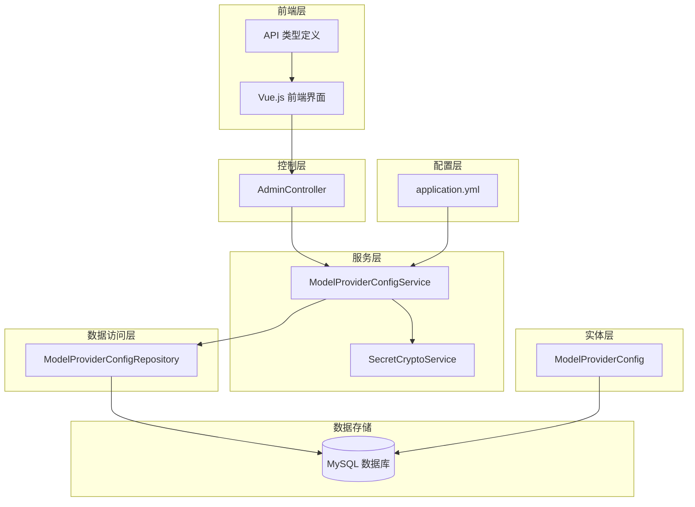

**图表来源**
- [AdminController.java:282-344](file://src/main/java/com/yizhaoqi/smartpai/controller/AdminController.java#L282-L344)
- [ModelProviderConfigService.java:24-60](file://src/main/java/com/yizhaoqi/smartpai/service/ModelProviderConfigService.java#L24-L60)
- [ModelProviderConfigRepository.java:9-16](file://src/main/java/com/yizhaoqi/smartpai/repository/ModelProviderConfigRepository.java#L9-L16)

**章节来源**
- [index.vue:1-294](file://frontend/src/views/model-provider/index.vue#L1-L294)
- [api.d.ts:249-278](file://frontend/src/typings/api.d.ts#L249-L278)

## 核心组件

### 数据模型层

模型提供商配置采用 JPA 实体映射，支持 LLM 和 Embedding 两种作用域：

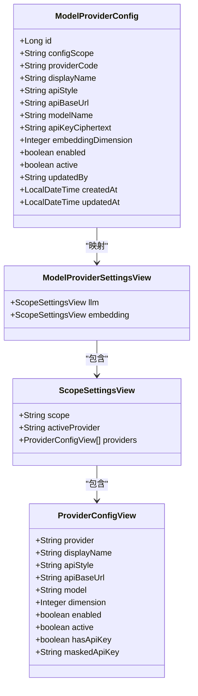

**图表来源**
- [ModelProviderConfig.java:25-69](file://src/main/java/com/yizhaoqi/smartpai/model/ModelProviderConfig.java#L25-L69)
- [ModelProviderConfigService.java:413-480](file://src/main/java/com/yizhaoqi/smartpai/service/ModelProviderConfigService.java#L413-L480)

### 服务层组件

服务层提供核心业务逻辑，包括配置管理、连接测试和安全加密：

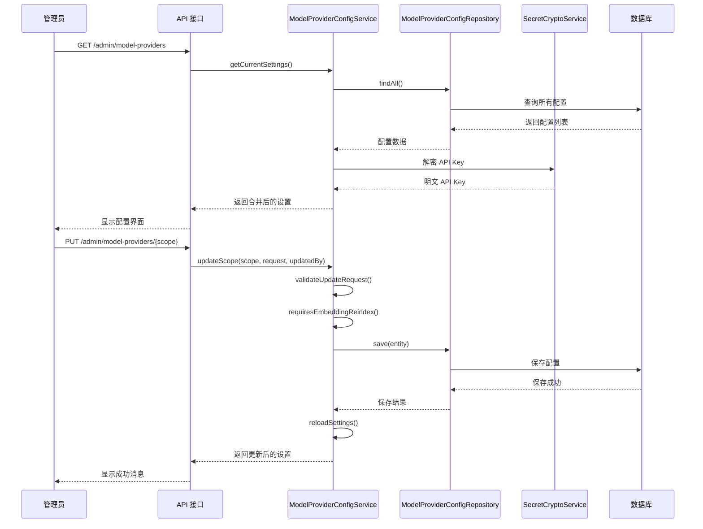

**图表来源**
- [AdminController.java:282-322](file://src/main/java/com/yizhaoqi/smartpai/controller/AdminController.java#L282-L322)
- [ModelProviderConfigService.java:71-138](file://src/main/java/com/yizhaoqi/smartpai/service/ModelProviderConfigService.java#L71-L138)

**章节来源**
- [ModelProviderConfigService.java:24-482](file://src/main/java/com/yizhaoqi/smartpai/service/ModelProviderConfigService.java#L24-L482)

## 架构概览

模型提供商管理采用经典的三层架构模式，结合缓存策略和安全机制：

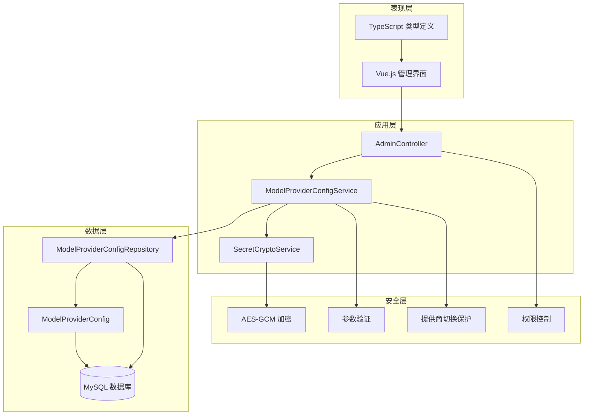

**图表来源**
- [SecretCryptoService.java:14-91](file://src/main/java/com/yizhaoqi/smartpai/utils/SecretCryptoService.java#L14-L91)
- [ModelProviderConfigRepository.java:9-16](file://src/main/java/com/yizhaoqi/smartpai/repository/ModelProviderConfigRepository.java#L9-L16)

## 详细组件分析

### 数据库设计

系统使用 MySQL 存储模型提供商配置，采用复合唯一索引确保配置的唯一性：

```mermaid
erDiagram
MODEL_PROVIDER_CONFIGS {
bigint id PK
varchar config_scope
varchar provider_code
varchar display_name
varchar api_style
varchar api_base_url
varchar model_name
varchar api_key_ciphertext
int embedding_dimension
boolean enabled
boolean active
varchar updated_by
timestamp created_at
timestamp updated_at
}
MODEL_PROVIDER_CONFIGS {
uk_model_provider_scope_code UK
idx_model_provider_scope IX
}
```

**图表来源**
- [ddl.sql:81-98](file://docs/databases/ddl.sql#L81-L98)

### 前端管理界面

Vue.js 前端提供了直观的管理界面，支持实时配置和连接测试：

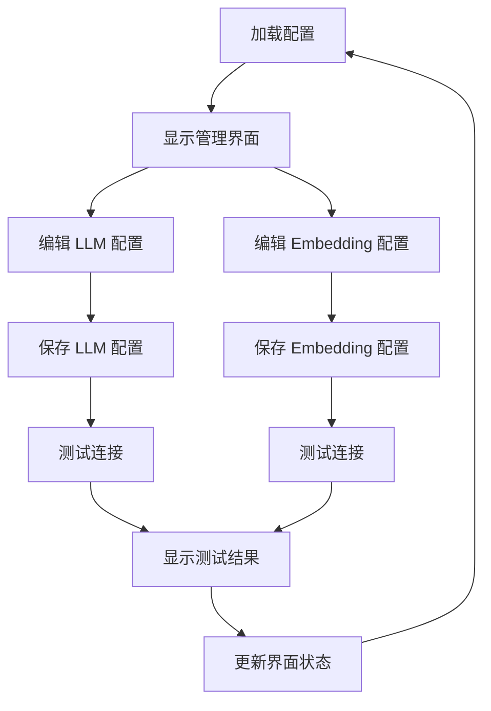

**图表来源**
- [index.vue:43-112](file://frontend/src/views/model-provider/index.vue#L43-L112)

**章节来源**
- [index.vue:1-294](file://frontend/src/views/model-provider/index.vue#L1-L294)

### 安全加密机制

系统采用 AES-GCM 模式对敏感信息进行加密存储：

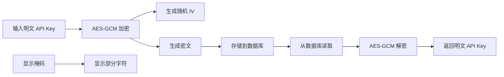

**图表来源**
- [SecretCryptoService.java:41-79](file://src/main/java/com/yizhaoqi/smartpai/utils/SecretCryptoService.java#L41-L79)

**章节来源**
- [SecretCryptoService.java:14-91](file://src/main/java/com/yizhaoqi/smartpai/utils/SecretCryptoService.java#L14-L91)

### API 接口设计

系统提供 RESTful API 接口供前端调用：

| 方法 | 路径 | 功能 | 请求体 | 响应 |
|------|------|------|--------|------|
| GET | /api/v1/admin/model-providers | 获取所有模型配置 | - | ModelProviderSettingsView |
| PUT | /api/v1/admin/model-providers/{scope} | 更新指定作用域配置 | UpdateScopeRequest | ScopeSettingsView |
| POST | /api/v1/admin/model-providers/{scope}/test | 测试模型连接 | ProviderConnectionTestRequest | ConnectivityTestView |

**章节来源**
- [AdminController.java:282-344](file://src/main/java/com/yizhaoqi/smartpai/controller/AdminController.java#L282-L344)

### 默认提供商配置

系统内置默认提供商配置，支持多种主流AI服务：

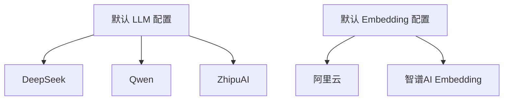

**图表来源**
- [ModelProviderConfigService.java:194-213](file://src/main/java/com/yizhaoqi/smartpai/service/ModelProviderConfigService.java#L194-L213)

**章节来源**
- [ModelProviderConfigService.java:194-213](file://src/main/java/com/yizhaoqi/smartpai/service/ModelProviderConfigService.java#L194-L213)

### 嵌入维度配置

Embedding 模型支持动态维度配置，确保向量检索的准确性：

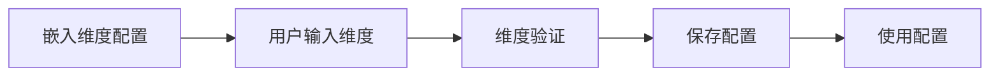

**图表来源**
- [ModelProviderConfigService.java:116-118](file://src/main/java/com/yizhaoqi/smartpai/service/ModelProviderConfigService.java#L116-L118)

**章节来源**
- [ModelProviderConfigService.java:116-118](file://src/main/java/com/yizhaoqi/smartpai/service/ModelProviderConfigService.java#L116-L118)

### 动态提供商切换保护机制

系统实现了智能的提供商切换保护机制，特别是针对Embedding提供商的危险切换：

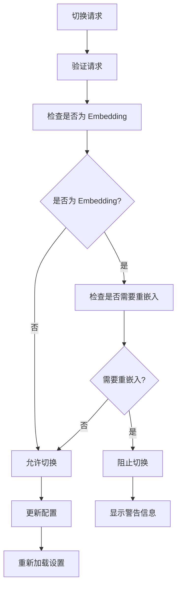

**图表来源**
- [ModelProviderConfigService.java:89-94](file://src/main/java/com/yizhaoqi/smartpai/service/ModelProviderConfigService.java#L89-L94)

**章节来源**
- [ModelProviderConfigService.java:89-94](file://src/main/java/com/yizhaoqi/smartpai/service/ModelProviderConfigService.java#L89-L94)

### 连接测试功能

系统提供了强大的连接测试功能，支持LLM和Embedding两种类型的连接验证：

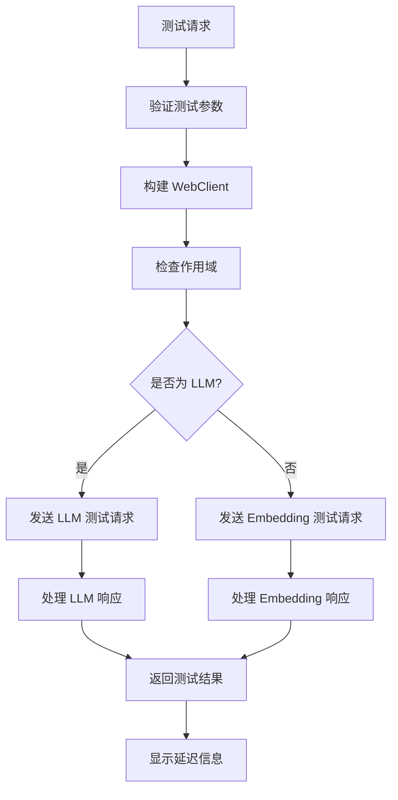

**图表来源**
- [ModelProviderConfigService.java:140-188](file://src/main/java/com/yizhaoqi/smartpai/service/ModelProviderConfigService.java#L140-L188)

**章节来源**
- [ModelProviderConfigService.java:140-188](file://src/main/java/com/yizhaoqi/smartpai/service/ModelProviderConfigService.java#L140-L188)

## 依赖关系分析

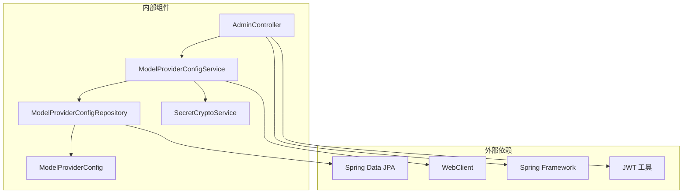

**图表来源**
- [ModelProviderConfigService.java:56-59](file://src/main/java/com/yizhaoqi/smartpai/service/ModelProviderConfigService.java#L56-L59)
- [AdminController.java:37-68](file://src/main/java/com/yizhaoqi/smartpai/controller/AdminController.java#L37-L68)

**章节来源**
- [ModelProviderConfigService.java:1-482](file://src/main/java/com/yizhaoqi/smartpai/service/ModelProviderConfigService.java#L1-L482)

## 性能考虑

### 缓存策略

系统采用双重缓存机制：
- **内存缓存**：`currentSettings` 缓存当前配置，避免频繁数据库查询
- **懒加载**：配置仅在首次访问时加载，减少启动时间

### 连接池优化

WebClient 使用连接池管理 HTTP 连接，支持超时控制和并发限制。

### 数据库优化

- 复合索引 `uk_model_provider_scope_code` 确保查询性能
- 分页查询支持大规模配置管理
- 唯一约束防止重复配置

### 安全性能

- **加密性能**：AES-GCM 加密在保证安全的同时优化了性能
- **密钥轮换**：支持动态密钥管理和轮换
- **访问控制**：基于JWT的细粒度权限控制
- **提供商切换保护**：防止危险的Embedding提供商切换操作

## 故障排除指南

### 常见问题及解决方案

| 问题类型 | 症状 | 可能原因 | 解决方案 |
|----------|------|----------|----------|
| 配置加载失败 | 页面显示空配置 | 数据库连接异常 | 检查数据库配置和连接 |
| API Key 加密失败 | 保存配置时报错 | 密钥格式不正确 | 确认 model-provider.security.secret-key 配置 |
| 连接测试超时 | 测试连接无响应 | 网络或防火墙问题 | 检查网络连通性和代理设置 |
| 权限不足 | 访问 API 返回 403 | JWT 令牌无效 | 重新登录获取有效令牌 |
| 提供商切换冲突 | 切换 Embedding 提供商失败 | 需要重嵌入任务 | 等待重嵌入任务完成后再切换 |
| 维度配置错误 | 嵌入维度设置无效 | 维度值小于等于0 | 设置大于0的有效维度值 |
| 提供商切换被阻止 | 更新配置时报 CONFLICT 错误 | 尝试危险的Embedding切换 | 修改配置但不改变 active provider |

### 调试建议

1. **启用详细日志**：检查 `LogUtils` 输出的业务日志
2. **验证配置**：确认 `application.yml` 中的数据库和安全配置
3. **测试连接**：使用 `/admin/model-providers/{scope}/test` 接口验证连接
4. **检查索引**：确保数据库索引正常工作
5. **监控加密**：验证密钥配置和加密算法正确性
6. **验证提供商切换**：使用 `requiresEmbeddingReindex` 方法检查切换安全性

**章节来源**
- [ModelProviderConfigServiceTest.java:1-133](file://src/test/java/com/yizhaoqi/smartpai/service/ModelProviderConfigServiceTest.java#L1-L133)

## 结论

模型提供商管理模块为 PaiSmart 平台提供了强大而灵活的 AI 模型配置能力。通过分层架构设计、安全加密机制和友好的管理界面，系统能够满足不同场景下的模型管理需求。

**更新** 新增的模型提供商配置系统具有以下主要优势：

- **多提供商支持**：支持 DeepSeek、Qwen、ZhipuAI、阿里云等主流 AI 服务
- **安全可靠**：AES-GCM 加密存储敏感信息，JWT 权限控制，API Key 掩码显示
- **易于管理**：直观的前端界面，支持实时配置、连接测试和提供商切换
- **灵活配置**：支持嵌入维度动态配置，满足不同向量检索需求
- **智能保护**：新增提供商切换保护机制，防止危险的Embedding切换操作
- **性能优化**：缓存策略、数据库优化和连接池管理确保高并发场景下的稳定性
- **安全验证**：完善的参数验证和错误处理机制，防止恶意配置和配置冲突

该模块为平台的智能化升级奠定了坚实基础，未来可以进一步扩展支持更多模型提供商和高级配置选项，如负载均衡、故障转移和性能监控等功能。特别是新增的提供商切换保护机制，确保了系统的稳定性和数据的完整性，这是该模块的重要安全保障。