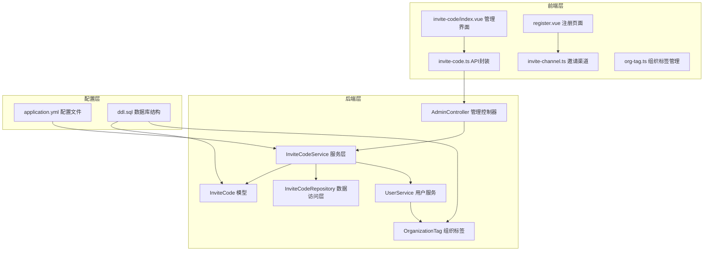
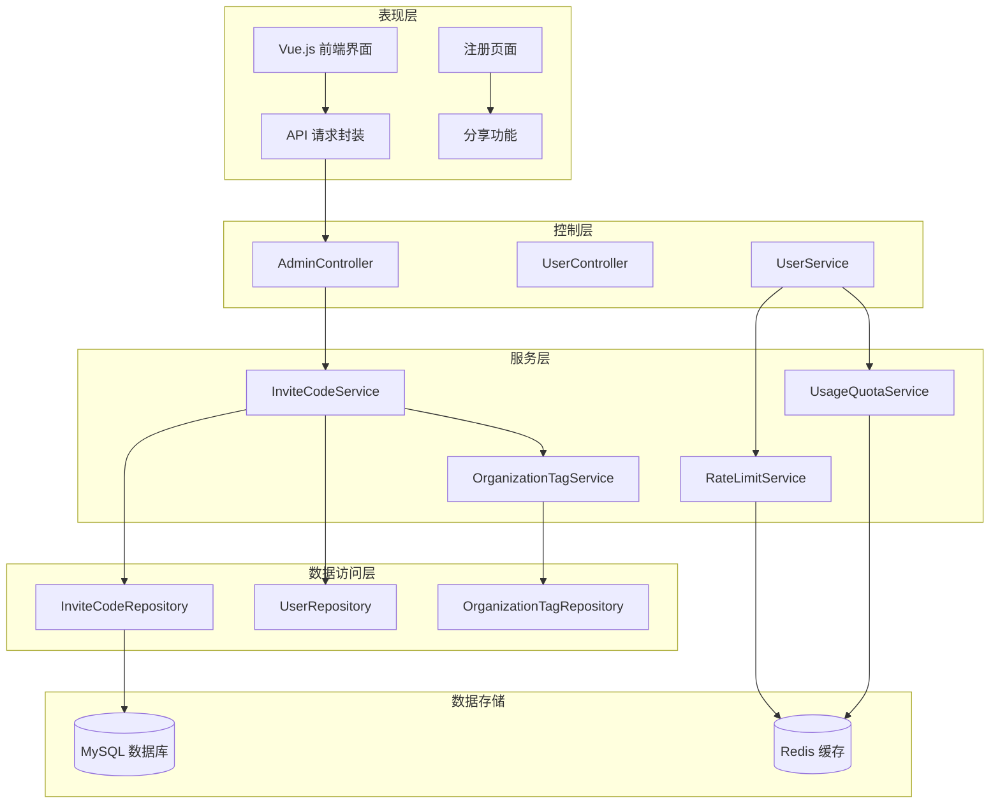
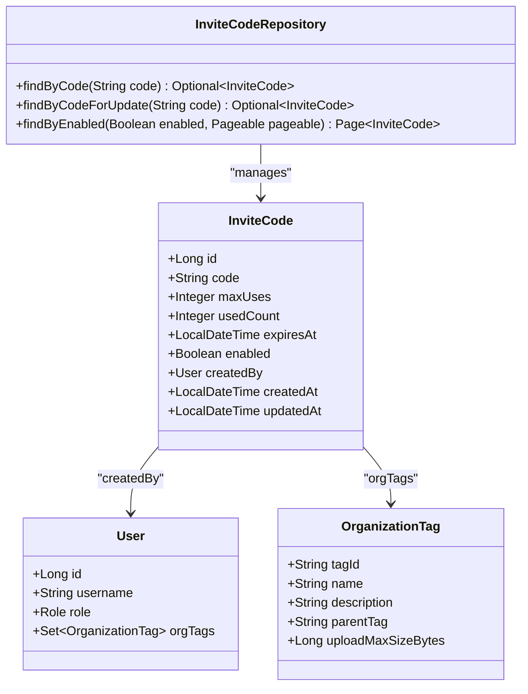
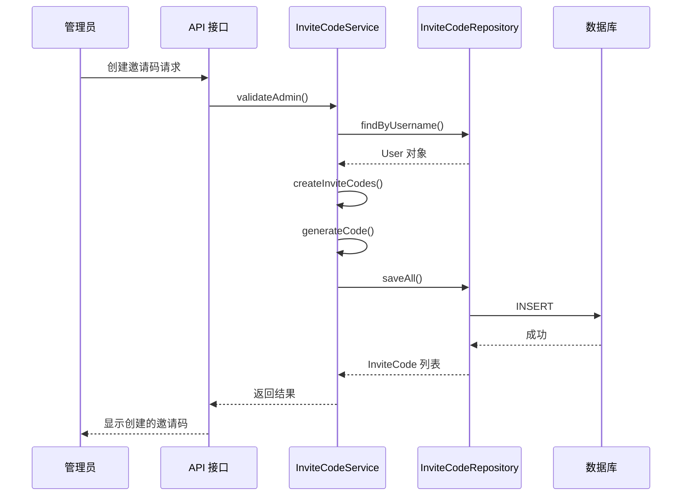
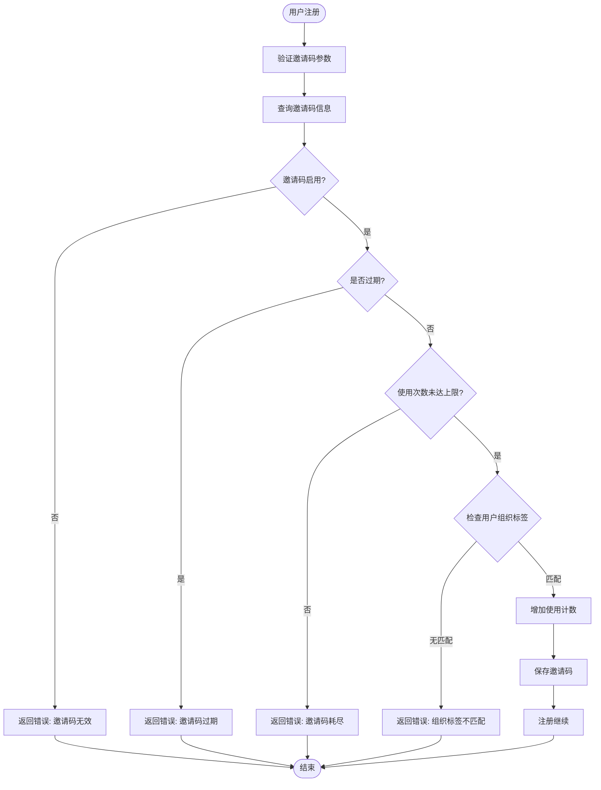
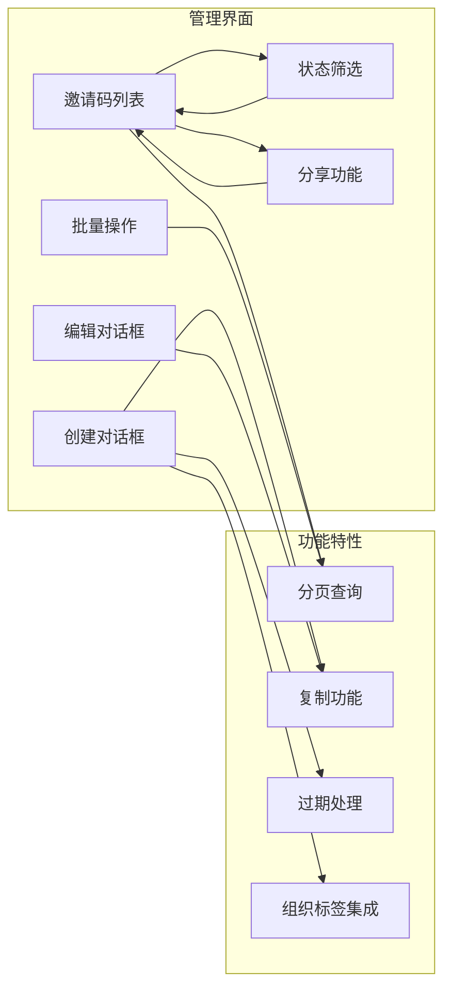
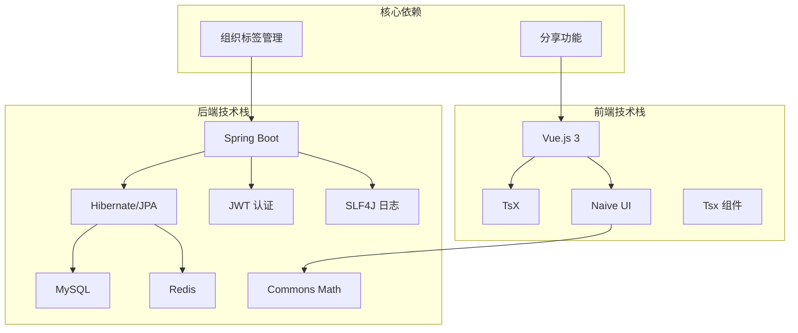

# 邀请码系统

<cite>
**本文档引用的文件**
- [InviteCode.java](file://src/main/java/com/yizhaoqi/smartpai/model/InviteCode.java)
- [InviteCodeService.java](file://src/main/java/com/yizhaoqi/smartpai/service/InviteCodeService.java)
- [InviteCodeRepository.java](file://src/main/java/com/yizhaoqi/smartpai/repository/InviteCodeRepository.java)
- [AdminController.java](file://src/main/java/com/yizhaoqi/smartpai/controller/AdminController.java)
- [UserService.java](file://src/main/java/com/yizhaoqi/smartpai/service/UserService.java)
- [index.vue](file://frontend/src/views/invite-code/index.vue)
- [invite-code.ts](file://frontend/src/service/api/invite-code.ts)
- [invite-channel.ts](file://frontend/src/constants/invite-channel.ts)
- [register.vue](file://frontend/src/views/_builtin/login/modules/register.vue)
- [InviteCodeServiceTest.java](file://src/test/java/com/yizhaoqi/smartpai/service/InviteCodeServiceTest.java)
- [ddl.sql](file://docs/databases/ddl.sql)
</cite>

## 更新摘要
**变更内容**
- 新增完整的CRUD操作接口和管理界面
- 增强过期处理机制，支持有效期设置
- 新增分享功能，包括复制链接和邀请话术
- 集成组织标签功能，支持用户权限管理
- 完善前端管理界面，支持批量操作和状态筛选
- 优化UI交互体验，支持响应式设计和批量删除

## 目录
1. [简介](#简介)
2. [项目结构](#项目结构)
3. [核心组件](#核心组件)
4. [架构概览](#架构概览)
5. [详细组件分析](#详细组件分析)
6. [新增功能特性](#新增功能特性)
7. [依赖关系分析](#依赖关系分析)
8. [性能考虑](#性能考虑)
9. [故障排除指南](#故障排除指南)
10. [结论](#结论)

## 简介

邀请码系统是 PaiSmart 平台的核心功能模块之一，用于控制用户注册流程和管理邀请码的生命周期。该系统采用前后端分离架构，后端基于 Spring Boot，前端基于 Vue.js，实现了完整的邀请码创建、管理和消费功能。

**更新** 系统现已支持完整的CRUD操作、过期处理、分享功能、组织标签集成等增强功能，为平台提供了更加完善的用户准入控制能力。

系统的主要目标包括：
- 控制平台的开放程度，通过邀请码限制注册
- 提供灵活的邀请码管理功能，支持批量创建和管理
- 确保邀请码使用的安全性和一致性
- 为用户提供便捷的邀请码分享和获取方式
- 集成组织标签功能，支持精细化权限管理

## 项目结构

邀请码系统在项目中的组织结构如下：

**图表来源**
- [InviteCode.java:1-47](file://src/main/java/com/yizhaoqi/smartpai/model/InviteCode.java#L1-L47)
- [InviteCodeService.java:1-214](file://src/main/java/com/yizhaoqi/smartpai/service/InviteCodeService.java#L1-L214)
- [AdminController.java:370-470](file://src/main/java/com/yizhaoqi/smartpai/controller/AdminController.java#L370-L470)
- [index.vue:1-481](file://frontend/src/views/invite-code/index.vue#L1-L481)

**章节来源**
- [InviteCode.java:1-47](file://src/main/java/com/yizhaoqi/smartpai/model/InviteCode.java#L1-L47)
- [InviteCodeService.java:1-214](file://src/main/java/com/yizhaoqi/smartpai/service/InviteCodeService.java#L1-L214)
- [AdminController.java:370-470](file://src/main/java/com/yizhaoqi/smartpai/controller/AdminController.java#L370-L470)
- [index.vue:1-481](file://frontend/src/views/invite-code/index.vue#L1-L481)

## 核心组件

### 数据模型层

邀请码系统的核心数据模型由 `InviteCode` 实体类定义，包含以下关键属性：

- **唯一标识符**: 使用数据库自增主键
- **邀请码值**: 唯一的字符串标识符，长度限制为64字符
- **使用限制**: 最大使用次数和当前使用计数
- **有效期**: 过期时间戳，支持永不过期配置
- **状态控制**: 启用/禁用状态标志
- **创建信息**: 关联创建用户和时间戳

**更新** 新增了组织标签集成，支持邀请码与用户权限的关联管理。

### 服务层

`InviteCodeService` 提供完整的邀请码管理功能：

- **创建功能**: 支持单个和批量创建邀请码
- **消费验证**: 注册时验证邀请码的有效性
- **状态管理**: 启用、禁用和删除邀请码
- **更新操作**: 修改邀请码配置信息
- **查询功能**: 分页查询和状态筛选
- **过期处理**: 自动检查和处理过期邀请码

**更新** 增强了CRUD操作支持，包括完整的更新和删除功能。

### 数据访问层

`InviteCodeRepository` 扩展了 Spring Data JPA，提供：
- 基于邀请码值的查询
- 支持悲观锁的并发安全查询
- 分页查询功能
- 状态筛选查询

**更新** 新增了组织标签相关的查询方法，支持权限管理。

**章节来源**
- [InviteCode.java:10-46](file://src/main/java/com/yizhaoqi/smartpai/model/InviteCode.java#L10-L46)
- [InviteCodeService.java:24-36](file://src/main/java/com/yizhaoqi/smartpai/service/InviteCodeService.java#L24-L36)
- [InviteCodeRepository.java:14-23](file://src/main/java/com/yizhaoqi/smartpai/repository/InviteCodeRepository.java#L14-L23)

## 架构概览

邀请码系统采用经典的三层架构模式，实现了清晰的职责分离：

**图表来源**
- [AdminController.java:370-470](file://src/main/java/com/yizhaoqi/smartpai/controller/AdminController.java#L370-L470)
- [UserService.java:42-78](file://src/main/java/com/yizhaoqi/smartpai/service/UserService.java#L42-L78)
- [InviteCodeService.java:24-36](file://src/main/java/com/yizhaoqi/smartpai/service/InviteCodeService.java#L24-L36)

## 详细组件分析

### 邀请码模型设计

**图表来源**
- [InviteCode.java:16-46](file://src/main/java/com/yizhaoqi/smartpai/model/InviteCode.java#L16-L46)
- [InviteCodeRepository.java:14-23](file://src/main/java/com/yizhaoqi/smartpai/repository/InviteCodeRepository.java#L14-L23)

#### 数据完整性约束

系统通过多种机制确保数据完整性：
- **唯一性约束**: 邀请码值在数据库层面保证唯一
- **索引优化**: 为常用查询字段建立索引
- **状态控制**: 通过布尔标志控制邀请码状态
- **时间戳管理**: 自动跟踪创建和更新时间
- **组织标签关联**: 支持用户权限的精细化管理

### 邀请码创建流程

**图表来源**
- [InviteCodeService.java:38-85](file://src/main/java/com/yizhaoqi/smartpai/service/InviteCodeService.java#L38-L85)
- [InviteCodeService.java:181-196](file://src/main/java/com/yizhaoqi/smartpai/service/InviteCodeService.java#L181-L196)

#### 批量创建机制

系统支持批量创建邀请码，具有以下特性：
- **批量大小限制**: 单次最多创建100个邀请码
- **自定义编码**: 支持指定邀请码格式（仅限单个创建）
- **去重保障**: 自动检测并避免重复的邀请码
- **并发安全**: 使用数据库锁确保创建过程的一致性
- **有效期设置**: 支持设置邀请码有效期

**更新** 新增了有效期设置功能，支持过期自动失效机制。

### 邀请码消费流程

**图表来源**
- [InviteCodeService.java:87-110](file://src/main/java/com/yizhaoqi/smartpai/service/InviteCodeService.java#L87-L110)

#### 并发安全设计

系统采用悲观锁机制确保邀请码消费的线程安全：
- **锁机制**: 使用 `@Lock(LockModeType.PESSIMISTIC_WRITE)` 确保原子性
- **事务管理**: 所有操作都在事务边界内执行
- **状态检查**: 在同一事务中完成所有状态验证和更新
- **组织标签验证**: 新增组织标签匹配验证，确保权限控制

**更新** 增强了并发安全设计，新增组织标签验证机制。

### 前端管理界面

**图表来源**
- [index.vue:106-236](file://frontend/src/views/invite-code/index.vue#L106-L236)
- [index.vue:250-268](file://frontend/src/views/invite-code/index.vue#L250-L268)

#### 用户体验设计

前端界面提供了丰富的交互功能：
- **实时状态显示**: 显示邀请码的使用状态和剩余次数
- **一键复制**: 支持复制邀请码、分享链接和邀请话术
- **批量管理**: 支持批量删除和状态切换
- **响应式设计**: 适配不同屏幕尺寸的设备
- **分享功能**: 自动生成分享链接和邀请话术
- **状态筛选**: 支持按启用/禁用状态筛选

**更新** 新增了分享功能和状态筛选功能，提升了用户体验。

**章节来源**
- [InviteCodeService.java:38-214](file://src/main/java/com/yizhaoqi/smartpai/service/InviteCodeService.java#L38-L214)
- [index.vue:1-481](file://frontend/src/views/invite-code/index.vue#L1-481)

## 新增功能特性

### CRUD操作管理

系统现已支持完整的CRUD操作：

#### 创建功能
- **单个创建**: 支持自定义邀请码和随机生成
- **批量创建**: 支持1-100个邀请码批量生成
- **有效期设置**: 支持设置邀请码过期时间
- **使用次数限制**: 支持设置最大使用次数

#### 读取功能
- **分页查询**: 支持分页浏览邀请码列表
- **状态筛选**: 支持按启用/禁用状态筛选
- **详情查看**: 显示邀请码的详细使用情况

#### 更新功能
- **编辑邀请码**: 支持修改邀请码值和使用限制
- **状态切换**: 支持启用/禁用邀请码
- **过期时间调整**: 支持修改邀请码有效期

#### 删除功能
- **单个删除**: 支持删除指定邀请码
- **批量删除**: 支持批量删除多个邀请码
- **删除保护**: 已使用的邀请码不允许删除

**章节来源**
- [AdminController.java:370-470](file://src/main/java/com/yizhaoqi/smartpai/controller/AdminController.java#L370-L470)
- [invite-code.ts:1-48](file://frontend/src/service/api/invite-code.ts#L1-L48)

### 过期处理机制

系统实现了完善的过期处理机制：

#### 自动过期检查
- **实时验证**: 注册时自动检查邀请码是否过期
- **状态标记**: 过期邀请码自动标记为不可用
- **错误提示**: 清晰的过期错误信息反馈

#### 有效期设置
- **时间设置**: 支持设置邀请码的有效期
- **永久有效**: 支持设置为永久有效的邀请码
- **到期提醒**: 在管理界面显示到期时间

#### 过期清理
- **定期清理**: 系统自动清理过期的邀请码
- **状态同步**: 过期邀请码自动从可用列表中移除

**章节来源**
- [InviteCodeService.java:87-110](file://src/main/java/com/yizhaoqi/smartpai/service/InviteCodeService.java#L87-L110)
- [InviteCodeServiceTest.java:57-73](file://src/test/java/com/yizhaoqi/smartpai/service/InviteCodeServiceTest.java#L57-L73)

### 分享功能集成

系统集成了完整的分享功能：

#### 分享链接生成
- **动态链接**: 自动生成带邀请码参数的注册链接
- **URL编码**: 自动处理特殊字符的URL编码
- **参数传递**: 通过URL参数传递邀请码信息

#### 邀请话术模板
- **标准化模板**: 提供标准的邀请话术模板
- **自动填充**: 自动填充邀请码和链接信息
- **多渠道支持**: 支持微信、QQ等多种分享渠道

#### 复制功能
- **一键复制**: 支持复制邀请码、链接和话术
- **批量操作**: 支持批量复制多个邀请码信息
- **粘贴提示**: 提供复制成功的用户反馈

**章节来源**
- [index.vue:120-155](file://frontend/src/views/invite-code/index.vue#L120-L155)
- [invite-channel.ts:16-25](file://frontend/src/constants/invite-channel.ts#L16-L25)

### 组织标签集成

系统与组织标签功能深度集成：

#### 权限关联
- **标签匹配**: 邀请码与特定组织标签关联
- **权限控制**: 仅允许匹配标签的用户使用
- **动态验证**: 注册时动态验证用户标签权限

#### 用户管理
- **标签分配**: 支持为用户分配组织标签
- **权限继承**: 组织标签权限的继承机制
- **访问控制**: 基于标签的资源访问控制

#### 管理界面
- **标签筛选**: 支持按组织标签筛选邀请码
- **权限显示**: 显示邀请码关联的组织标签
- **批量操作**: 支持按标签进行批量管理

**章节来源**
- [UserService.java:42-78](file://src/main/java/com/yizhaoqi/smartpai/service/UserService.java#L42-L78)
- [ddl.sql:12-23](file://docs/databases/ddl.sql#L12-L23)

## 依赖关系分析

### 技术栈依赖

**图表来源**
- [application.yml:4-229](file://src/main/resources/application.yml#L4-L229)

### 外部集成点

系统集成了多个外部服务：
- **认证服务**: JWT 令牌管理
- **缓存服务**: Redis 用于会话和配置缓存
- **数据库服务**: MySQL 存储业务数据
- **消息队列**: Kafka 用于异步处理
- **微信服务**: 邀请渠道集成
- **分享服务**: 邀请码分享功能

**章节来源**
- [application.yml:74-229](file://src/main/resources/application.yml#L74-L229)

## 性能考虑

### 数据库优化

系统采用了多项数据库优化策略：

1. **索引设计**: 为 `code` 和 `enabled` 字段建立复合索引
2. **查询优化**: 使用原生 SQL 查询减少 ORM 开销
3. **连接池**: 配置合理的连接池参数
4. **事务管理**: 最小化事务持有时间
5. **组织标签索引**: 为组织标签相关查询建立索引

### 缓存策略

- **用户信息缓存**: 缓存用户组织标签和权限信息
- **配置缓存**: 缓存系统配置和邀请码状态
- **会话缓存**: 使用 Redis 管理会话和令牌
- **分享缓存**: 缓存常用的分享链接和话术模板

### 并发控制

- **悲观锁**: 使用数据库锁确保邀请码消费的原子性
- **重试机制**: 实现幂等性设计防止重复消费
- **超时控制**: 设置合理的数据库操作超时时间
- **组织标签缓存**: 缓存组织标签树结构提升查询性能

### 分享功能优化

- **链接生成缓存**: 缓存生成的分享链接
- **话术模板缓存**: 缓存常用的邀请话术模板
- **复制操作优化**: 优化复制操作的性能表现

## 故障排除指南

### 常见问题及解决方案

#### 邀请码创建失败

**问题症状**: 创建邀请码时返回错误

**可能原因**:
1. 批量创建数量超过限制 (100个)
2. 自定义邀请码已存在
3. 创建者权限不足
4. 邀请码格式不正确

**解决步骤**:
1. 检查批量创建数量是否超过限制
2. 验证自定义邀请码的唯一性
3. 确认管理员权限
4. 验证邀请码格式符合要求

#### 邀请码消费异常

**问题症状**: 用户注册时报邀请码无效

**可能原因**:
1. 邀请码已被禁用
2. 邀请码已过期
3. 邀请码使用次数已达上限
4. 邀请码不存在
5. 用户组织标签不匹配

**解决步骤**:
1. 检查邀请码状态和有效期
2. 验证邀请码的使用计数
3. 确认邀请码的物理存在性
4. 验证用户是否具备相应组织标签权限

#### 前端界面问题

**问题症状**: 邀请码管理界面显示异常

**可能原因**:
1. API 接口调用失败
2. 权限不足
3. 网络连接问题
4. 分享功能异常

**解决步骤**:
1. 检查浏览器开发者工具中的网络请求
2. 验证用户权限
3. 确认服务端状态
4. 测试分享链接的生成和复制功能

#### 分享功能问题

**问题症状**: 邀请码分享功能异常

**可能原因**:
1. 分享链接生成失败
2. 复制功能异常
3. 邀请话术模板缺失
4. URL编码问题

**解决步骤**:
1. 检查分享链接的生成逻辑
2. 验证复制功能的JavaScript代码
3. 确认邀请话术模板的配置
4. 测试特殊字符的URL编码处理

**章节来源**
- [InviteCodeService.java:48-59](file://src/main/java/com/yizhaoqi/smartpai/service/InviteCodeService.java#L48-L59)
- [InviteCodeService.java:96-106](file://src/main/java/com/yizhaoqi/smartpai/service/InviteCodeService.java#L96-L106)

## 结论

邀请码系统通过精心设计的架构和完善的业务逻辑，为 PaiSmart 平台提供了强大的用户准入控制能力。经过本次更新，系统在原有基础上新增了多项重要功能：

### 技术优势

1. **架构清晰**: 采用分层架构，职责分离明确
2. **并发安全**: 通过数据库锁和事务管理确保数据一致性
3. **用户体验**: 前端界面友好，功能丰富，支持分享和批量操作
4. **扩展性强**: 模块化设计便于功能扩展，支持组织标签集成
5. **功能完整**: 支持完整的CRUD操作，包括过期处理和权限控制

### 业务价值

1. **精准控制**: 通过邀请码实现用户注册的精确控制
2. **运营效率**: 支持批量创建和管理，提高运营效率
3. **数据分析**: 提供详细的使用统计和分析功能
4. **安全保障**: 多层验证机制确保系统安全
5. **分享推广**: 集成分享功能，支持社交传播

### 新增功能价值

1. **CRUD完整**: 支持邀请码的完整生命周期管理
2. **过期处理**: 自动化的过期邀请码处理机制
3. **分享功能**: 提升邀请码的传播效率和用户体验
4. **组织标签**: 实现精细化的权限管理和用户控制
5. **批量操作**: 支持高效的批量管理操作

### 改进建议

1. **监控增强**: 添加更详细的性能监控和告警机制
2. **日志优化**: 完善审计日志，便于问题追踪
3. **测试覆盖**: 增加单元测试和集成测试覆盖率
4. **文档完善**: 补充开发和运维文档
5. **性能优化**: 进一步优化分享功能和组织标签查询性能

该系统为类似的企业级应用提供了优秀的参考实现，其设计理念和最佳实践值得其他项目借鉴和学习。新增的功能特性进一步增强了系统的实用性和用户体验，为平台的用户增长和运营管理提供了强有力的技术支撑。