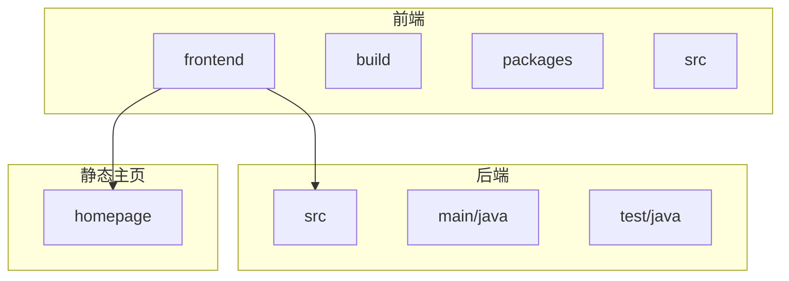

# 开发环境搭建

<cite>
**本文档引用的文件**  
- [SmartPaiApplication.java](file://src/main/java/com/yizhaoqi/smartpai/SmartPaiApplication.java)
- [SmartPaiApplicationTests.java](file://src/test/java/com/yizhaoqi/smartpai/SmartPaiApplicationTests.java)
- [proxy.ts](file://frontend/build/config/proxy.ts)
- [vite.config.ts](file://frontend/vite.config.ts)
- [eslint.config.js](file://frontend/eslint.config.js)
- [devtools.ts](file://frontend/build/plugins/devtools.ts)
- [pom.xml](file://pom.xml)
- [package.json](file://frontend/package.json)
- [git-commit.ts](file://frontend/packages/scripts/src/commands/git-commit.ts)
</cite>

## 目录
1. [简介](#简介)
2. [项目结构](#项目结构)
3. [开发环境配置](#开发环境配置)
4. [pnpm工作区与依赖管理](#pnpm工作区与依赖管理)
5. [代码格式化与提交规范](#代码格式化与提交规范)
6. [前后端联调配置](#前后端联调配置)
7. [测试指南](#测试指南)
8. [调试技巧](#调试技巧)
9. [总结](#总结)

## 简介
本文档旨在为开发人员提供全面的开发环境搭建指南，涵盖IDE配置、依赖管理、代码规范、联调技巧、测试方法和调试策略。通过本指南，新成员可以快速熟悉项目结构并投入开发工作。

## 项目结构
项目采用前后端分离架构，包含前端（frontend）、后端（src）和静态主页（homepage）三个主要部分。前端使用Vue 3 + Vite构建，后端基于Spring Boot框架。



**图示来源**
- [pom.xml](file://pom.xml#L1-L203)
- [package.json](file://frontend/package.json#L1-L122)

## 开发环境配置

### 推荐IDE与插件
推荐使用IntelliJ IDEA或VS Code进行开发。

#### IntelliJ IDEA配置
- 安装Spring Boot插件以支持后端开发
- 安装Vue.js插件以支持前端开发
- 配置Maven自动导入

#### VS Code配置
- 安装Volar插件以支持Vue 3语法高亮和智能提示
- 安装Prettier - Code formatter插件
- 安装ESLint插件
- 安装Spring Boot Tools插件用于后端开发

### 基础环境要求
- Node.js >= 18.20.0
- pnpm >= 8.7.0
- Java 17
- Maven 3.6+

**节来源**
- [package.json](file://frontend/package.json#L15-L18)
- [pom.xml](file://pom.xml#L24-L25)

## pnpm工作区与依赖管理

### pnpm工作区配置
项目前端使用pnpm工作区管理多个内部包。工作区配置位于`frontend/pnpm-workspace.yaml`：

```yaml
packages:
  - "packages/*"
```

该配置表明所有位于`frontend/packages/`目录下的子包都将被纳入工作区管理。

### 依赖管理策略
项目采用workspace协议管理内部包依赖，如`@sa/axios`、`@sa/color`等均通过`workspace:*`方式引用，确保开发时能够实时同步修改。

```json
"dependencies": {
  "@sa/axios": "workspace:*",
  "@sa/color": "workspace:*",
  "@sa/hooks": "workspace:*"
}
```

这种策略允许在开发过程中直接修改内部包并立即生效，无需发布版本。

**节来源**
- [pnpm-workspace.yaml](file://frontend/pnpm-workspace.yaml#L1-L3)
- [package.json](file://frontend/package.json#L40-L45)

## 代码格式化与提交规范

### ESLint配置
ESLint配置文件`frontend/eslint.config.js`基于`@soybeanjs/eslint-config`扩展：

```javascript
import { defineConfig } from '@soybeanjs/eslint-config';

export default defineConfig(
  { vue: true, unocss: true },
  {
    rules: {
      'vue/multi-word-component-names': [
        'warn',
        {
          ignores: ['index', 'App', 'Register', '[id]', '[url]']
        }
      ],
      'vue/component-name-in-template-casing': [
        'warn',
        'PascalCase',
        {
          registeredComponentsOnly: false,
          ignores: ['/^icon-/']
        }
      ],
      'unocss/order-attributify': 'off',
      'no-warning-comments': 'off',
      'vue/no-v-html': 'off'
    }
  }
);
```

### Prettier集成
项目已集成Prettier作为代码格式化工具，通过`prettier`包（版本3.5.3）实现统一的代码风格。

### 提交钩子配置
项目通过`simple-git-hooks`配置了Git提交钩子，在`package.json`中定义：

```json
"simple-git-hooks": {
  "commit-msg": "pnpm sa git-commit-verify",
  "pre-commit": "cd frontend && pnpm typecheck && pnpm lint && git diff --exit-code"
}
```

#### 提交规范
使用`pnpm commit`命令生成符合Conventional Commits标准的提交信息：
- **类型**：feat, fix, docs, style, refactor, perf, test, build, ci, chore, revert
- **作用域**：projects, packages, components, hooks, utils等

若提交信息不符合规范，将收到错误提示并阻止提交。

**节来源**
- [eslint.config.js](file://frontend/eslint.config.js#L1-L27)
- [package.json](file://frontend/package.json#L118-L121)
- [git-commit.ts](file://frontend/packages/scripts/src/commands/git-commit.ts#L1-L83)

## 前后端联调配置

### 代理设置
前后端联调通过Vite的代理功能实现，配置位于`frontend/build/config/proxy.ts`：

```typescript
export function createViteProxy(env: Env.ImportMeta, enable: boolean) {
  const isEnableHttpProxy = enable && env.VITE_HTTP_PROXY === 'Y';
  
  if (!isEnableHttpProxy) return undefined;

  const { baseURL, proxyPattern, other } = createServiceConfig(env);
  const proxy: Record<string, ProxyOptions> = createProxyItem({ baseURL, proxyPattern }, isEnableProxyLog);

  return proxy;
}
```

### 跨域处理
代理配置中`changeOrigin: true`确保请求头中的origin正确转发，`ws: /^wss?:\/\//.test(item.baseURL)`支持WebSocket代理。

### 环境变量控制
通过环境变量控制代理行为：
- `VITE_HTTP_PROXY=Y` 启用HTTP代理
- `VITE_PROXY_LOG=Y` 启用代理日志输出

开发服务器配置在`vite.config.ts`中：

```typescript
server: {
  host: '0.0.0.0',
  port: 9527,
  open: true,
  proxy: createViteProxy(viteEnv, enableProxy),
  allowedHosts: ['u45964x883.zicp.vip']
}
```

**节来源**
- [proxy.ts](file://frontend/build/config/proxy.ts#L1-L57)
- [vite.config.ts](file://frontend/vite.config.ts#L30-L40)

## 测试指南

### 单元测试与集成测试
后端测试基于JUnit 5和Spring Boot Test框架，主测试类为`SmartPaiApplicationTests.java`：

```java
@SpringBootTest
class SmartPaiApplicationTests {

    @Test
    void contextLoads() {
    }
}
```

`@SpringBootTest`注解加载完整的Spring应用上下文，用于集成测试。

### 测试运行方法
#### 后端测试
使用Maven命令运行测试：
```bash
mvn test
```

或在IDE中直接运行测试类。

#### 前端测试
前端项目暂未配置专门的测试框架，但可通过以下命令进行类型检查和代码规范检查：
```bash
pnpm typecheck
pnpm lint
```

### 测试覆盖范围
项目包含以下测试类：
- `ConversationServiceTest.java` - 会话服务测试
- `UploadServicePerformanceTest.java` - 上传服务性能测试
- `UserServiceTest.java` - 用户服务测试
- `JwtUtilsRefreshTest.java` - JWT工具类测试

**节来源**
- [SmartPaiApplicationTests.java](file://src/test/java/com/yizhaoqi/smartpai/SmartPaiApplicationTests.java#L1-L14)
- [pom.xml](file://pom.xml#L78-L80)

## 调试技巧

### 后端断点调试
1. 在IntelliJ IDEA中配置Spring Boot启动项
2. 在代码中设置断点
3. 以Debug模式运行`SmartPaiApplication`类
4. 发送请求触发断点

支持热重载，代码修改后可快速重新编译并继续调试。

### 前端Vue DevTools
项目已集成Vue DevTools，配置位于`frontend/build/plugins/devtools.ts`：

```typescript
import VueDevtools from 'vite-plugin-vue-devtools';

export function setupDevtoolsPlugin(viteEnv: Env.ImportMeta) {
  const { VITE_DEVTOOLS_LAUNCH_EDITOR } = viteEnv;

  return VueDevtools({
    launchEditor: VITE_DEVTOOLS_LAUNCH_EDITOR
  });
}
```

通过`VITE_DEVTOOLS_LAUNCH_EDITOR`环境变量可配置编辑器联动功能。

### 调试环境变量
在`.env`文件中可配置调试相关变量：
- `VITE_DEVTOOLS_LAUNCH_EDITOR` - 启用编辑器跳转
- `VITE_PROXY_LOG=Y` - 显示代理请求日志
- `VITE_SOURCE_MAP=Y` - 生成source map便于调试

**节来源**
- [devtools.ts](file://frontend/build/plugins/devtools.ts#L1-L8)
- [SmartPaiApplication.java](file://src/main/java/com/yizhaoqi/smartpai/SmartPaiApplication.java#L1-L14)

## 总结
本文档详细介绍了PaiSmart项目的开发环境搭建流程，涵盖了从IDE配置到调试技巧的各个方面。通过遵循本指南，开发人员可以快速建立高效的开发环境，确保代码质量和团队协作效率。建议新成员按照文档顺序逐步配置，遇到问题可参考相关源码文件获取更详细的信息。