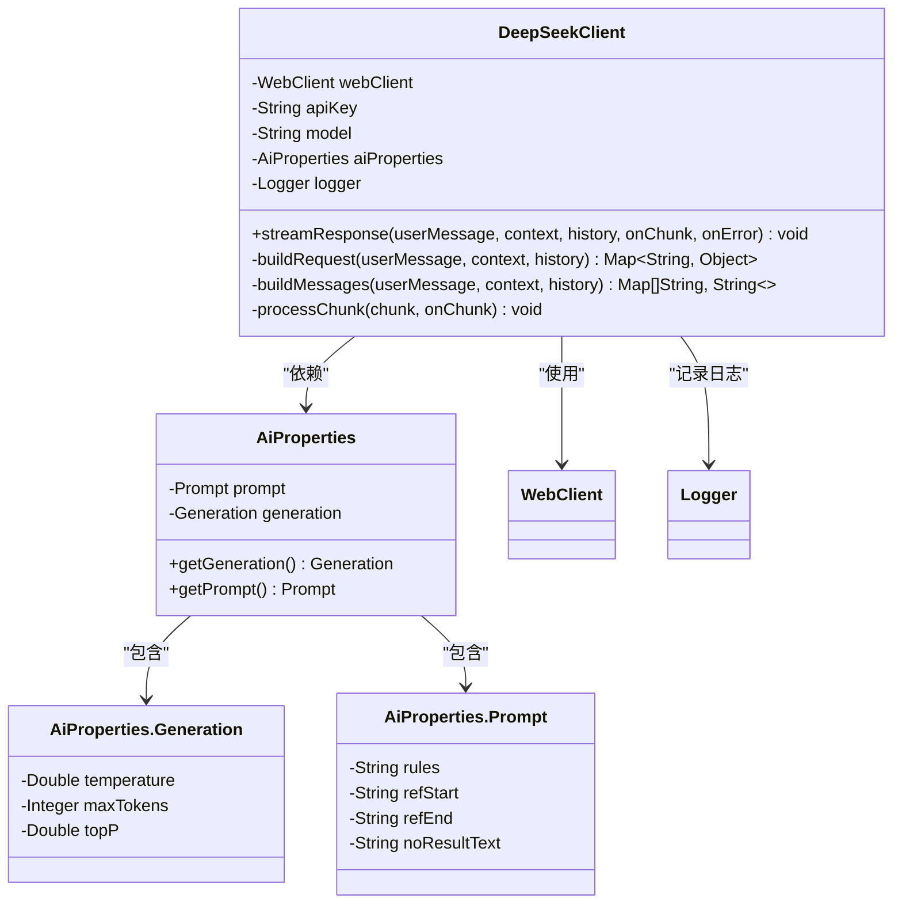
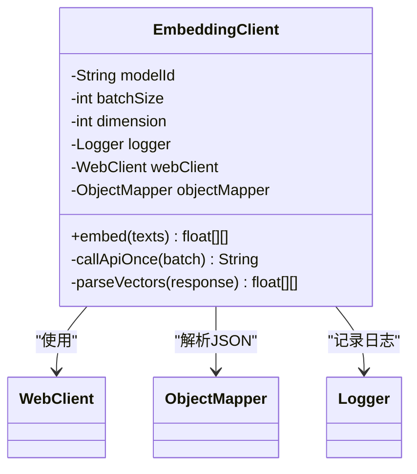
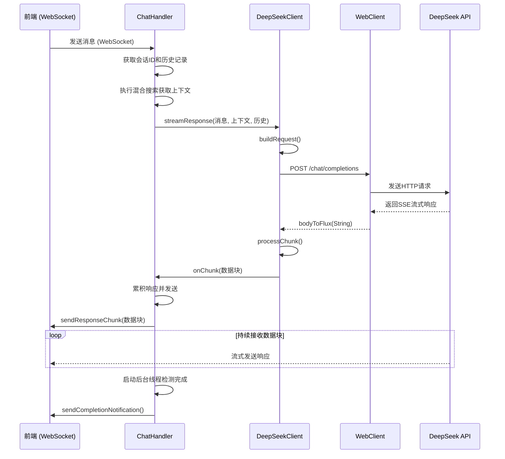
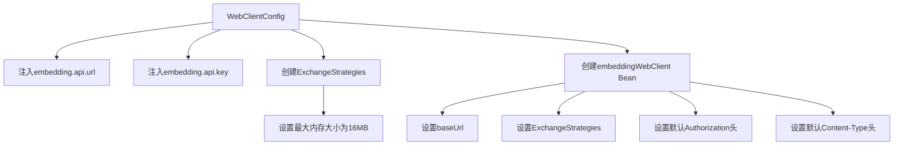

# AI服务集成故障排除

<cite>
**本文档引用的文件**   
- [DeepSeekClient.java](file://src/main/java/com/yizhaoqi/smartpai/client/DeepSeekClient.java#L1-L162)
- [EmbeddingClient.java](file://src/main/java/com/yizhaoqi/smartpai/client/EmbeddingClient.java#L1-L104)
- [WebClientConfig.java](file://src/main/java/com/yizhaoqi/smartpai/config/WebClientConfig.java#L1-L35)
- [AiProperties.java](file://src/main/java/com/yizhaoqi/smartpai/config/AiProperties.java#L1-L39)
- [ChatHandler.java](file://src/main/java/com/yizhaoqi/smartpai/service/ChatHandler.java#L1-L401)
</cite>

## 目录
1. [简介](#简介)
2. [核心组件分析](#核心组件分析)
3. [AI服务调用流程](#ai服务调用流程)
4. [故障排查指南](#故障排查指南)
5. [配置参数详解](#配置参数详解)
6. [Mock测试方案](#mock测试方案)

## 简介
本文档旨在为PaiSmart项目中的AI服务集成提供全面的故障排查指南。项目集成了DeepSeek大语言模型和向量化服务，通过WebSocket实现实时对话功能。当出现API响应超时、Embedding向量化失败、HTTP 429限流、鉴权token无效等问题时，本文档将指导开发者如何系统性地定位和解决问题。文档将深入分析客户端实现、配置参数、调用流程，并提供有效的Mock测试方案，帮助隔离外部依赖，快速判断问题根源。

## 核心组件分析

### DeepSeek客户端分析
`DeepSeekClient`是与DeepSeek大模型API交互的核心组件，负责构建请求、发送流式响应并处理返回数据。

**关键特性：**
- **依赖注入**：通过Spring的`@Value`注解注入API URL、密钥和模型名称。
- **条件鉴权**：仅在API密钥不为空时添加`Authorization`头，避免无效请求。
- **流式响应**：使用`WebClient`的`bodyToFlux`方法处理SSE（Server-Sent Events）流式响应。
- **动态参数**：从`AiProperties`配置类中读取`temperature`、`top_p`、`max_tokens`等生成参数。



**图示来源**
- [DeepSeekClient.java](file://src/main/java/com/yizhaoqi/smartpai/client/DeepSeekClient.java#L1-L162)
- [AiProperties.java](file://src/main/java/com/yizhaoqi/smartpai/config/AiProperties.java#L1-L39)

**本节来源**
- [DeepSeekClient.java](file://src/main/java/com/yizhaoqi/smartpai/client/DeepSeekClient.java#L1-L162)
- [AiProperties.java](file://src/main/java/com/yizhaoqi/smartpai/config/AiProperties.java#L1-L39)

### Embedding客户端分析
`EmbeddingClient`负责调用向量化API，将文本转换为高维向量，用于知识库的语义搜索。

**关键特性：**
- **批处理**：支持批量处理文本，通过`batchSize`配置项控制每次请求的文本数量。
- **重试机制**：在`callApiOnce`方法中使用`retryWhen`实现最多3次的固定延迟重试，专门针对`WebClientResponseException`。
- **超时控制**：使用`block(Duration.ofSeconds(30))`设置30秒的响应超时。
- **灵活配置**：支持配置向量维度`dimension`和模型ID`modelId`。



**图示来源**
- [EmbeddingClient.java](file://src/main/java/com/yizhaoqi/smartpai/client/EmbeddingClient.java#L1-L104)

**本节来源**
- [EmbeddingClient.java](file://src/main/java/com/yizhaoqi/smartpai/client/EmbeddingClient.java#L1-L104)

## AI服务调用流程

### 整体调用序列
当用户通过前端发送消息时，后端服务的调用流程如下：



**图示来源**
- [ChatHandler.java](file://src/main/java/com/yizhaoqi/smartpai/service/ChatHandler.java#L1-L401)
- [DeepSeekClient.java](file://src/main/java/com/yizhaoqi/smartpai/client/DeepSeekClient.java#L1-L162)

**本节来源**
- [ChatHandler.java](file://src/main/java/com/yizhaoqi/smartpai/service/ChatHandler.java#L1-L401)

## 故障排查指南

### 1. DeepSeek API响应超时
**现象**：前端长时间无响应，或收到“AI服务暂时不可用”的错误提示。

**排查步骤：**
1.  **检查`WebClient`配置**：确认`WebClient`的超时设置。当前代码中，`DeepSeekClient`直接使用`WebClient`默认的超时策略，而`EmbeddingClient`在`block`时设置了30秒超时。建议为`DeepSeekClient`也添加显式的超时控制。
2.  **验证API端点**：检查`application.yml`中`deepseek.api.url`的配置是否正确，确保网络可达。
3.  **检查请求负载**：过长的上下文或历史记录可能导致API处理时间过长。检查`buildContext`方法生成的上下文长度。
4.  **查看日志**：在`DeepSeekClient`和`ChatHandler`的日志中搜索`调用DeepSeek API生成回复`和`处理数据块时出错`等关键字，确认错误类型。

### 2. Embedding向量化失败
**现象**：知识库文档上传后无法进行语义搜索，或搜索功能异常。

**排查步骤：**
1.  **检查批处理大小**：确认`embedding.api.batch-size`配置项的值是否合理。如果单次请求文本过多，可能超出API限制。
2.  **验证API密钥和URL**：检查`WebClientConfig`中`@Value("${embedding.api.url}")`和`@Value("${embedding.api.key}")`的值是否正确。
3.  **分析重试机制**：`EmbeddingClient`已内置3次重试，但如果连续失败，说明问题可能出在配置或网络层面。检查日志中`调用向量化 API 失败`的错误信息。
4.  **检查响应解析**：`parseVectors`方法假设API响应中存在`data`数组和`embedding`字段。如果第三方API变更了响应格式，会导致解析失败。确保响应格式与代码预期一致。

### 3. HTTP 429限流
**现象**：向量化或聊天功能间歇性失败，日志中可能出现`429 Too Many Requests`错误。

**现状分析**：
- **代码层**：`EmbeddingClient`的`retryWhen`机制可以处理瞬时的429错误，通过1秒的延迟重试3次。
- **配置层**：目前没有在`WebClient`级别配置全局的、更复杂的限流重试策略（如指数退避）。
- **缺失**：代码库中未发现专门处理429状态码的自定义逻辑或全局异常处理器。

**解决方案：**
1.  **增强重试策略**：修改`EmbeddingClient`的`retryWhen`，使用`Retry.backoff`实现指数退避，例如：
    ```java
    .retryWhen(Retry.backoff(3, Duration.ofSeconds(1))
               .filter(e -> e instanceof WebClientResponseException && ((WebClientResponseException)e).getStatusCode() == HttpStatus.TOO_MANY_REQUESTS)
               .onRetryExhaustedThrow((spec, outcome) -> outcome.failure()));
    ```
2.  **添加监控**：在`EmbeddingClient`中记录429错误的频率，以便调整批处理大小或请求频率。

### 4. 鉴权token无效
**现象**：API调用返回401 Unauthorized错误。

**排查步骤：**
1.  **验证密钥配置**：这是最常见的原因。检查`application.yml`文件中`deepseek.api.key`和`embedding.api.key`的值是否正确，注意不要包含多余的空格或引号。
2.  **检查密钥传递**：`DeepSeekClient`的构造函数中，`if (apiKey != null && !apiKey.trim().isEmpty())`确保了只有在密钥有效时才添加`Authorization`头。如果密钥为空，请求将不带鉴权头，必然失败。请确认`@Value`注解能正确注入密钥。
3.  **确认密钥状态**：登录DeepSeek和向量化服务的管理平台，确认API密钥是否已启用且未过期。

## 配置参数详解

### WebClient配置
`WebClientConfig`类为向量化服务配置了一个共享的`WebClient` Bean。



**关键配置项：**
- **`maxInMemorySize(16 * 1024 * 1024)`**：限制了在内存中缓存的响应体大小为16MB，防止大响应导致内存溢出。
- **`defaultHeader(AUTHORIZATION, "Bearer " + apiKey)`**：为所有请求自动添加鉴权头。
- **`defaultHeader(CONTENT_TYPE, APPLICATION_JSON_VALUE)`**：确保请求内容类型为JSON。

**本节来源**
- [WebClientConfig.java](file://src/main/java/com/yizhaoqi/smartpai/config/WebClientConfig.java#L1-L35)

## Mock测试方案

### 目的
为了隔离外部AI服务的依赖，快速验证本地业务逻辑（如上下文构建、历史记录管理、响应处理）是否正确，应实施Mock测试。

### 实施方案
1.  **Mock `DeepSeekClient`**：
    - 在`ChatHandler`的单元测试中，使用Mockito等框架创建`DeepSeekClient`的Mock对象。
    - 当调用`streamResponse`方法时，不真正发起HTTP请求，而是模拟一个流式响应过程。
    - 示例代码：
        ```java
        @Test
        public void testProcessMessage() {
            // 给定
            String userMessage = "你好";
            String mockResponse = "Hello, 我是AI助手。";
            // Mock DeepSeekClient的行为
            doAnswer(invocation -> {
                Consumer<String> onChunk = invocation.getArgument(3);
                // 模拟流式发送
                onChunk.accept("Hello, ");
                onChunk.accept("我是AI助手。");
                return null;
            }).when(deepSeekClient).streamResponse(any(), any(), any(), any(), any());
            
            // 当
            chatHandler.processMessage("user123", userMessage, mockSession);
            
            // 验证
            verify(mockSession, times(2)).sendMessage(any(TextMessage.class)); // 应发送两个数据块
            verify(redisTemplate).opsForValue().set(anyString(), anyString(), any(Duration.class)); // 应更新对话历史
        }
        ```
2.  **优势**：
    - **快速**：无需等待外部API响应。
    - **可控**：可以模拟各种场景，如超时、错误、部分响应等。
    - **可靠**：不受外部服务状态影响，测试结果稳定。

**本节来源**
- [ChatHandler.java](file://src/main/java/com/yizhaoqi/smartpai/service/ChatHandler.java#L1-L401)
- [DeepSeekClient.java](file://src/main/java/com/yizhaoqi/smartpai/client/DeepSeekClient.java#L1-L162)