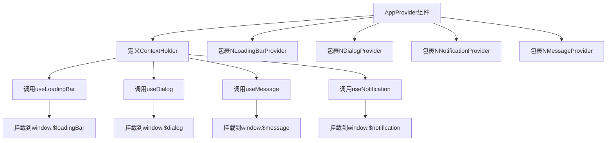
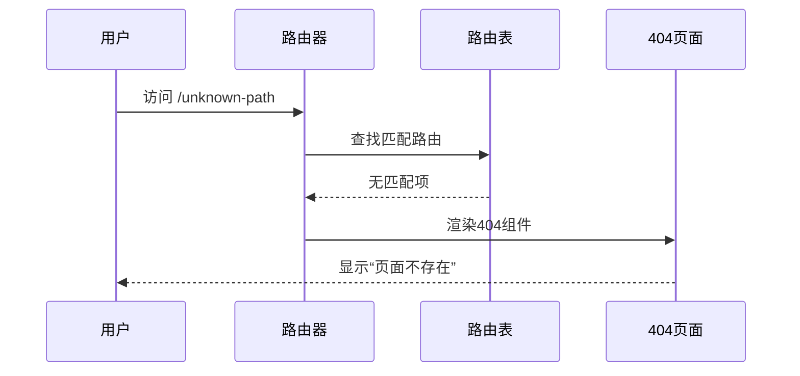
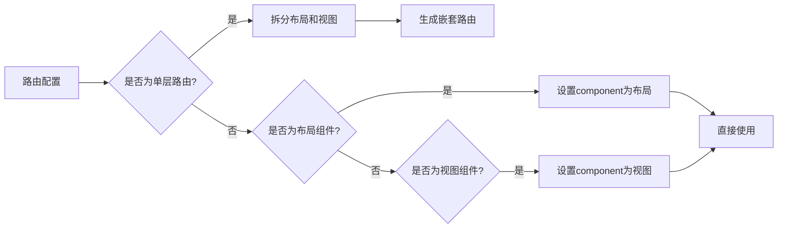

# UI渲染问题

<cite>
**本文档引用文件**  
- [app-provider.vue](file://frontend/src/components/common/app-provider.vue)
- [404/index.vue](file://frontend/src/views/_builtin/404/index.vue)
- [common.ts](file://frontend/src/utils/common.ts)
- [dark-mode-container.vue](file://frontend/src/components/common/dark-mode-container.vue)
- [svg-icon.vue](file://frontend/src/components/custom/svg-icon.vue)
- [global.css](file://frontend/src/styles/css/global.css)
- [base-layout/index.vue](file://frontend/src/layouts/base-layout/index.vue)
- [transform.ts](file://frontend/src/router/elegant/transform.ts)
- [shared.ts](file://frontend/src/store/modules/theme/shared.ts)
</cite>

## 目录
1. [问题概述](#问题概述)
2. [全局上下文注入机制分析](#全局上下文注入机制分析)
3. [404页面处理与路由匹配调试](#404页面处理与路由匹配调试)
4. [组件传参验证与类型判断](#组件传参验证与类型判断)
5. [布局组件与路由懒加载兼容性](#布局组件与路由懒加载兼容性)
6. [视觉层问题排查](#视觉层问题排查)
7. [总结与建议](#总结与建议)

## 问题概述

本项目在UI渲染过程中存在动态组件渲染空白、路由跳转白屏、菜单显示异常等问题。这些问题涉及全局上下文注入、路由配置、组件通信、样式作用域等多个层面。通过分析关键文件，本文将系统性地解析问题成因并提供解决方案。

**Section sources**
- [app-provider.vue](file://frontend/src/components/common/app-provider.vue)
- [404/index.vue](file://frontend/src/views/_builtin/404/index.vue)

## 全局上下文注入机制分析

`app-provider.vue` 是应用的全局上下文提供者组件，负责注入Naive UI的全局服务实例（如加载条、对话框、消息通知等），确保在整个应用中可以通过全局变量访问这些服务。



**Diagram sources**
- [app-provider.vue](file://frontend/src/components/common/app-provider.vue#L1-L38)

### 实现机制

1. **组件注册**：使用 `defineComponent` 创建一个名为 `ContextHolder` 的内部组件。
2. **服务注入**：在 `setup` 函数中调用 `useLoadingBar`、`useDialog`、`useMessage`、`useNotification`，并将返回的实例挂载到 `window` 对象上。
3. **提供者包装**：通过 `<NLoadingBarProvider>`、`<NDialogProvider>` 等组件提供上下文环境，确保子组件可以访问这些服务。

### 潜在问题

- **挂载时机**：如果 `ContextHolder` 渲染过晚，可能导致早期组件无法访问全局服务。
- **重复挂载**：若 `register()` 被多次调用，可能造成服务实例重复绑定。

**Section sources**
- [app-provider.vue](file://frontend/src/components/common/app-provider.vue#L1-L38)

## 404页面处理与路由匹配调试

404页面由 `views/_builtin/404/index.vue` 实现，其逻辑非常简洁，仅渲染一个名为 `ExceptionBase` 的基础异常组件，并传入类型 `"404"`。

```vue
<template>
  <ExceptionBase type="404" />
</template>
```

该组件依赖于路由系统的匹配机制。当用户访问不存在的路由时，前端路由会匹配到通配符路由（如 `/:pathMatch(.*)*`），从而渲染此404页面。



**Diagram sources**
- [404/index.vue](file://frontend/src/views/_builtin/404/index.vue#L1-L7)

### 调试方法

1. **检查路由配置**：确认 `router/routes/index.ts` 中是否定义了通配符路由。
2. **验证组件加载**：确保 `ExceptionBase` 组件正确导入且无渲染错误。
3. **查看控制台日志**：检查是否有路由转换错误或组件加载失败的提示。

**Section sources**
- [404/index.vue](file://frontend/src/views/_builtin/404/index.vue#L1-L7)

## 组件传参验证与类型判断

项目中使用 `utils/common.ts` 提供的工具函数进行类型判断和数据转换，特别是 `transformRecordToOption` 函数用于将记录对象转换为选项数组，常用于下拉框等组件的数据源。

```ts
export function transformRecordToOption<T extends Record<string, string>>(record: T) {
  return Object.entries(record).map(([value, label]) => ({
    value,
    label
  })) as CommonType.Option<keyof T, T[keyof T]>[];
}
```

### 使用示例

```ts
const yesOrNoRecord: Record<CommonType.YesOrNo, App.I18n.I18nKey> = {
  Y: 'common.yesOrNo.yes',
  N: 'common.yesOrNo.no'
};

export const yesOrNoOptions = transformRecordToOption(yesOrNoRecord);
// 结果: [{ value: 'Y', label: 'common.yesOrNo.yes' }, { value: 'N', label: 'common.yesOrNo.no' }]
```

### 验证组件传参

- **类型安全**：泛型约束 `T extends Record<string, string>` 确保输入为字符串键值对。
- **结构一致性**：输出为标准的 `{ value, label }` 结构，便于UI组件统一处理。
- **国际化支持**：结合 `translateOptions` 函数可实现标签翻译。

**Section sources**
- [common.ts](file://frontend/src/utils/common.ts#L0-L25)
- [common.ts](file://frontend/src/constants/common.ts#L0-L17)

## 布局组件与路由懒加载兼容性

### 布局组件结构

`base-layout/index.vue` 使用 `defineAsyncComponent` 异步加载 `GlobalMenu` 组件，以实现按需加载，提升首屏性能。

```ts
const GlobalMenu = defineAsyncComponent(() => import('../modules/global-menu/index.vue'));
```

### 路由转换逻辑

`router/elegant/transform.ts` 负责将优雅路由配置转换为Vue Router的 `RouteRecordRaw` 格式。关键逻辑包括：

- **布局识别**：通过前缀 `layout.` 识别布局组件。
- **视图识别**：通过前缀 `view.` 识别页面组件。
- **单层路由处理**：对于单层路由，将其拆分为布局和视图两部分嵌套。



**Diagram sources**
- [transform.ts](file://frontend/src/router/elegant/transform.ts#L39-L145)
- [base-layout/index.vue](file://frontend/src/layouts/base-layout/index.vue#L1-L148)

### 兼容性问题排查

1. **异步组件加载失败**：检查网络请求是否成功加载 `global-menu.vue`。
2. **路由配置错误**：确保 `component` 字段格式正确（如 `layout.base-layout`）。
3. **组件未注册**：确认 `layouts` 和 `views` 对象中已正确导入组件。

**Section sources**
- [base-layout/index.vue](file://frontend/src/layouts/base-layout/index.vue#L1-L148)
- [transform.ts](file://frontend/src/router/elegant/transform.ts#L39-L145)

## 视觉层问题排查

### CSS作用域冲突

项目使用 `global.css` 作为全局样式入口，通过 `@import` 引入 `reset.css`、`nprogress.css` 和 `transition.css`。

- `reset.css`：基于Tailwind CSS的重置样式，统一浏览器默认样式。
- `transition.css`：定义了多种过渡动画类（如 `fade`、`fade-slide`）。
- `global.css`：设置根元素高度为100%，防止布局溢出。

```css
html,
body,
#app {
  height: 100%;
}
```

**Section sources**
- [global.css](file://frontend/src/styles/css/global.css#L1-L13)
- [reset.css](file://frontend/src/styles/css/reset.css#L1-L378)
- [transition.css](file://frontend/src/styles/css/transition.css#L1-L82)

### SVG图标渲染异常

`svg-icon.vue` 组件支持两种图标来源：Iconify图标和本地SVG图标。

```ts
const renderLocalIcon = computed(() => props.localIcon || !props.icon);
```

- **优先级**：若同时传入 `icon` 和 `localIcon`，优先渲染本地图标。
- **Symbol引用**：本地图标通过 `<use xlink:href="#prefix-iconName" />` 引用。

**问题排查**：
1. 检查 `vite.config.ts` 中的 `unocss` 插件是否正确配置本地图标前缀。
2. 确认 `src/assets/svg-icon` 目录下存在对应SVG文件。
3. 验证构建后是否生成了正确的Symbol图标集。

**Section sources**
- [svg-icon.vue](file://frontend/src/components/custom/svg-icon.vue#L1-L53)
- [unocss.ts](file://frontend/build/plugins/unocss.ts#L1-L31)

### 暗黑模式切换失效

暗黑模式通过 `store/modules/theme/shared.ts` 中的 `toggleCssDarkMode` 函数控制：

```ts
export function toggleCssDarkMode(darkMode = false) {
  const { add, remove } = toggleHtmlClass(DARK_CLASS);
  if (darkMode) {
    add();
  } else {
    remove();
  }
}
```

`DARK_CLASS` 默认为 `dark`，通过为 `html` 元素添加/移除该类来切换主题。

`dark-mode-container.vue` 组件通过 `inverted` 属性控制背景和文字颜色反转：

```vue
<div class="bg-container text-base-text" :class="{ 'bg-inverted text-#1f1f1f': inverted }">
  <slot></slot>
</div>
```

**问题排查**：
1. 检查 `useThemeStore` 是否正确响应主题变化。
2. 验证 `toggleHtmlClass` 是否成功操作DOM。
3. 确认CSS变量是否在 `:root` 和 `.dark` 中正确定义。

**Section sources**
- [shared.ts](file://frontend/src/store/modules/theme/shared.ts#L146-L203)
- [dark-mode-container.vue](file://frontend/src/components/common/dark-mode-container.vue#L1-L17)

## 总结与建议

1. **全局服务注入**：确保 `AppProvider` 在应用根组件中尽早渲染，避免服务未初始化。
2. **路由配置验证**：使用静态类型检查确保路由配置的正确性，避免运行时错误。
3. **组件传参规范**：统一使用 `transformRecordToOption` 等工具函数处理选项数据，保证类型安全。
4. **样式隔离**：谨慎使用全局样式，推荐使用CSS模块或作用域CSS减少冲突。
5. **异步加载监控**：为异步组件添加错误边界，捕获加载失败异常。
6. **主题切换测试**：在不同系统偏好设置下测试暗黑模式自动切换功能。

通过以上分析与建议，可系统性解决当前UI渲染中的各类问题，提升应用稳定性和用户体验。