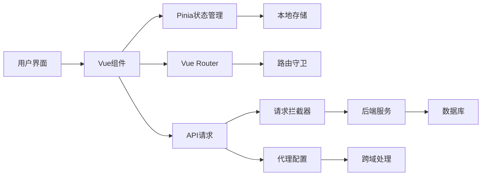
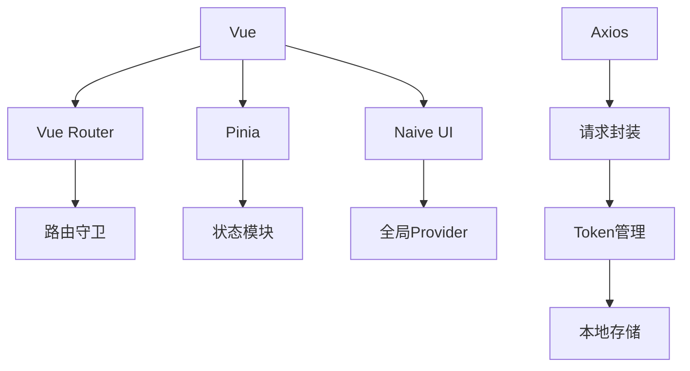

# 前端应用故障排除

<cite>
**本文档引用文件**  
- [frontend/src/utils/common.ts](file://frontend/src/utils/common.ts)
- [frontend/vite.config.ts](file://frontend/vite.config.ts)
- [frontend/build/config/proxy.ts](file://frontend/build/config/proxy.ts)
- [frontend/src/store/modules/app/index.ts](file://frontend/src/store/modules/app/index.ts)
- [frontend/src/components/common/app-provider.vue](file://frontend/src/components/common/app-provider.vue)
- [frontend/src/service/request/index.ts](file://frontend/src/service/request/index.ts)
- [frontend/src/service/request/shared.ts](file://frontend/src/service/request/shared.ts)
- [frontend/src/router/index.ts](file://frontend/src/router/index.ts)
- [frontend/src/router/guard/route.ts](file://frontend/src/router/guard/route.ts)
</cite>

## 目录
1. [简介](#简介)
2. [项目结构](#项目结构)
3. [核心组件](#核心组件)
4. [架构概览](#架构概览)
5. [详细组件分析](#详细组件分析)
6. [依赖分析](#依赖分析)
7. [性能考虑](#性能考虑)
8. [故障排除指南](#故障排除指南)
9. [结论](#结论)

## 简介
本文档旨在为前端开发者提供一份全面的故障排除手册，涵盖构建失败、资源加载异常、路由跳转错误、API请求失败、状态管理紊乱及动态组件渲染空白等常见问题。通过深入分析项目代码结构与实现机制，结合浏览器开发者工具的使用技巧，帮助开发者快速定位并解决实际开发中的各类问题。

## 项目结构
本项目采用模块化设计，前端部分位于`frontend`目录下，主要包含构建配置、组件库、业务逻辑、状态管理、路由系统和工具函数等模块。整体结构清晰，职责分明，便于维护和扩展。

```mermaid
graph TB
subgraph "前端模块"
Build[build]
Packages[packages]
Src[src]
end
Src --> Components[components]
Src --> Constants[constants]
Src --> Enum[enum]
Src --> Hooks[hooks]
Src --> Layouts[layouts]
Src --> Locales[locales]
Src --> Plugins[plugins]
Src --> Router[router]
Src --> Service[service]
Src --> Store[store]
Src --> Styles[styles]
Src --> Theme[theme]
Src --> Typings[typings]
Src --> Utils[utils]
Src --> Views[views]
Build --> Config[config]
Build --> Plugins[plugins]
Packages --> Alova[alova]
Packages --> Axios[axios]
Packages --> Color[color]
Packages --> Hooks[hooks]
Packages --> Materials[materials]
Packages --> Ofetch[ofetch]
Packages --> Scripts[scripts]
Packages --> UnoPreset[uno-preset]
Packages --> Utils[utils]
```



**Diagram sources**
- [frontend/src](file://frontend/src)
- [frontend/build](file://frontend/build)
- [frontend/packages](file://frontend/packages)

## 核心组件
项目核心组件包括状态管理（Pinia）、路由系统（Vue Router）、请求服务（Axios封装）、UI组件库（Naive UI）以及自定义工具函数。这些组件协同工作，构成了应用的基础架构。

**Section sources**
- [frontend/src/store](file://frontend/src/store)
- [frontend/src/router](file://frontend/src/router)
- [frontend/src/service](file://frontend/src/service)
- [frontend/src/utils](file://frontend/src/utils)

## 架构概览
系统采用前后端分离架构，前端基于Vue 3 + Vite构建，使用Pinia进行状态管理，Vue Router实现路由控制，并通过Axios封装处理API请求。整体架构如下图所示：



**Diagram sources**
- [frontend/src/store](file://frontend/src/store)
- [frontend/src/router](file://frontend/src/router)
- [frontend/src/service/request](file://frontend/src/service/request)
- [frontend/build/config/proxy.ts](file://frontend/build/config/proxy.ts)

## 详细组件分析

### 构建失败排查
Vite构建报错通常与配置、依赖或环境变量有关。关键配置文件为`vite.config.ts`，其中定义了别名、CSS预处理器、插件、服务器和构建选项。

```ts
// vite.config.ts 关键配置
export default defineConfig(configEnv => {
  const viteEnv = loadEnv(configEnv.mode, process.cwd()) as unknown as Env.ImportMeta;
  return {
    base: viteEnv.VITE_BASE_URL,
    resolve: {
      alias: {
        '@': fileURLToPath(new URL('./src', import.meta.url))
      }
    },
    server: {
      host: '0.0.0.0',
      port: 9527,
      proxy: createViteProxy(viteEnv, enableProxy)
    },
    build: {
      sourcemap: viteEnv.VITE_SOURCE_MAP === 'Y'
    }
  };
});
```

常见构建问题包括：
- 环境变量未正确加载：确保`.env`文件存在且格式正确
- 代理配置错误：检查`VITE_HTTP_PROXY`是否启用
- 路径别名解析失败：确认`@`指向`src`目录

**Section sources**
- [frontend/vite.config.ts](file://frontend/vite.config.ts)

### 跨域请求被拒处理
跨域问题通过Vite的代理功能解决，配置位于`build/config/proxy.ts`。当开发环境启用代理时，所有匹配`proxyPattern`的请求将被转发至`baseURL`。

```ts
// proxy.ts 代理配置逻辑
export function createViteProxy(env: Env.ImportMeta, enable: boolean) {
  const isEnableHttpProxy = enable && env.VITE_HTTP_PROXY === 'Y';
  if (!isEnableHttpProxy) return undefined;

  const { baseURL, proxyPattern } = createServiceConfig(env);
  const proxy: Record<string, ProxyOptions> = {
    [proxyPattern]: {
      target: baseURL,
      changeOrigin: true,
      rewrite: path => path.replace(new RegExp(`^${proxyPattern}`), '')
    }
  };
  return proxy;
}
```

若请求仍被拒绝，请检查：
- `VITE_HTTP_PROXY=Y` 是否在`.env.development`中设置
- 浏览器开发者工具中网络请求是否显示为本地代理地址
- 后端服务是否允许来自代理服务器的请求

**Section sources**
- [frontend/build/config/proxy.ts](file://frontend/build/config/proxy.ts)

### Pinia状态不一致调试
状态管理使用Pinia，核心模块位于`src/store/modules`。以`app`模块为例，其通过`defineStore`创建，并在初始化时监听响应式数据变化。

```ts
// app/index.ts 状态管理示例
export const useAppStore = defineStore(SetupStoreId.App, () => {
  const locale = ref<App.I18n.LangType>(localStg.get('lang') || 'zh-CN');
  const siderCollapse = useBoolean();

  watch(locale, () => {
    updateDocumentTitleByLocale();
    routeStore.updateGlobalMenusByLocale();
    tabStore.updateTabsByLocale();
  });

  return {
    locale,
    siderCollapse,
    toggleSiderCollapse
  };
});
```

状态不一致常见原因：
- 多个store实例未正确共享
- 异步操作未正确处理
- 浏览器刷新后状态丢失（未持久化）

建议使用浏览器开发者工具的Pinia插件进行状态跟踪。

**Section sources**
- [frontend/src/store/modules/app/index.ts](file://frontend/src/store/modules/app/index.ts)

### 动态组件渲染空白问题解决
动态组件渲染依赖于Vue的`<component :is="...">`机制。`app-provider.vue`中通过`defineComponent`注册全局上下文组件。

```vue
<!-- app-provider.vue 动态组件注册 -->
<script setup lang="ts">
const ContextHolder = defineComponent({
  setup() {
    window.$loadingBar = useLoadingBar();
    window.$dialog = useDialog();
    return () => createTextVNode();
  }
});
</script>
<template>
  <NLoadingBarProvider>
    <NDialogProvider>
      <NNotificationProvider>
        <NMessageProvider>
          <ContextHolder />
          <slot></slot>
        </NMessageProvider>
      </NNotificationProvider>
    </NDialogProvider>
  </NLoadingBarProvider>
</template>
```

渲染空白可能原因：
- 组件未正确注册或导入
- `:is`绑定的组件名不存在
- 异步组件加载失败
- 条件渲染逻辑错误

建议使用Vue Devtools检查组件树结构。

**Section sources**
- [frontend/src/components/common/app-provider.vue](file://frontend/src/components/common/app-provider.vue)

### API请求失败分析
API请求封装在`src/service/request/index.ts`中，基于`@sa/axios`进行二次封装，包含请求拦截、响应处理、错误捕获和token刷新机制。

```ts
// request/index.ts 请求封装核心逻辑
function getFlatRequest(options: Partial<RequestOption<App.Service.Response>> = {}) {
  return createFlatRequest({
    baseURL,
    onRequest(config) {
      const Authorization = getAuthorization();
      Object.assign(config.headers, { Authorization });
      return config;
    },
    onBackendFail(response) {
      const responseCode = String(response.data.code);
      const logoutCodes = import.meta.env.VITE_SERVICE_LOGOUT_CODES?.split(',') || [];
      if (logoutCodes.includes(responseCode)) {
        authStore.resetStore();
        return null;
      }
      // ...其他错误处理
    },
    onError(error) {
      if (error.response?.status === 403) {
        authStore.resetStore();
      }
      showErrorMsg(request.state, message);
    }
  });
}
```

请求失败排查步骤：
1. 检查网络面板中请求状态码
2. 查看控制台是否有拦截错误
3. 验证token是否过期并触发刷新
4. 确认后端返回的`code`是否在预设的登出码列表中

**Section sources**
- [frontend/src/service/request/index.ts](file://frontend/src/service/request/index.ts)
- [frontend/src/service/request/shared.ts](file://frontend/src/service/request/shared.ts)

### 路由跳转错误诊断
路由系统基于Vue Router，通过`router/index.ts`创建实例，并在`guard/route.ts`中设置全局前置守卫。

```ts
// guard/route.ts 路由守卫逻辑
export function createRouteGuard(router: Router) {
  router.beforeEach(async (to, from, next) => {
    const isLogin = Boolean(localStg.get('token'));
    const needLogin = !to.meta.constant;
    const hasAuth = authStore.isStaticSuper || !routeRoles.length || hasRole;

    if (to.name === 'login' && isLogin) {
      next({ name: 'root' });
    } else if (!needLogin) {
      handleRouteSwitch(to, from, next);
    } else if (!isLogin) {
      next({ name: 'login', query: { redirect: to.fullPath } });
    } else if (!hasAuth) {
      next({ name: '403' });
    } else {
      handleRouteSwitch(to, from, next);
    }
  });
}
```

跳转错误常见情况：
- 未登录用户访问受保护路由 → 自动跳转登录页
- 已登录用户访问登录页 → 自动跳转首页
- 无权限访问特定路由 → 跳转403页面
- 动态路由未初始化 → 捕获到404后重新加载

**Section sources**
- [frontend/src/router/index.ts](file://frontend/src/router/index.ts)
- [frontend/src/router/guard/route.ts](file://frontend/src/router/guard/route.ts)

## 依赖分析
项目依赖关系清晰，核心依赖包括：
- Vue 3：框架核心
- Vite：构建工具
- Pinia：状态管理
- Vue Router：路由系统
- Naive UI：UI组件库
- Axios：HTTP客户端



**Diagram sources**
- [frontend/package.json](file://frontend/package.json)

## 性能考虑
- 启用`sourceMap`仅在开发环境，生产构建关闭以提升性能
- 使用`nprogress`显示页面加载进度，提升用户体验
- 图片和静态资源建议压缩，减少加载时间
- 组件按需加载，避免首屏加载过大

## 故障排除指南
### 使用浏览器开发者工具
1. **网络面板**：检查请求状态、响应数据、请求头
2. **控制台**：查看JavaScript错误、警告信息
3. **应用面板**：查看本地存储、会话存储内容
4. **Vue面板**：跟踪组件状态、事件、props
5. **时间线**：分析页面加载性能瓶颈

### 利用工具函数断点调试
`frontend/src/utils/common.ts`提供多个实用函数：

```ts
// common.ts 工具函数示例
export function transformRecordToOption(record) { /* 转换选项 */ }
export function fileSize(size) { /* 文件大小格式化 */ }
export function calculateMD5(file) { /* 计算文件MD5 */ }
export function formatDate(date) { /* 日期格式化 */ }
export function getFileExt(fileName) { /* 获取文件扩展名 */ }
```

可在关键逻辑处插入`console.log`或断点，结合上述函数进行数据验证。

**Section sources**
- [frontend/src/utils/common.ts](file://frontend/src/utils/common.ts)

## 结论
本文档系统性地分析了前端应用中常见的各类问题及其解决方案。通过理解项目架构、掌握核心组件工作原理，并熟练使用开发者工具，开发者能够高效地定位和解决实际开发中的技术难题。建议在日常开发中养成良好的调试习惯，及时记录和总结问题处理经验，持续提升开发效率与代码质量。