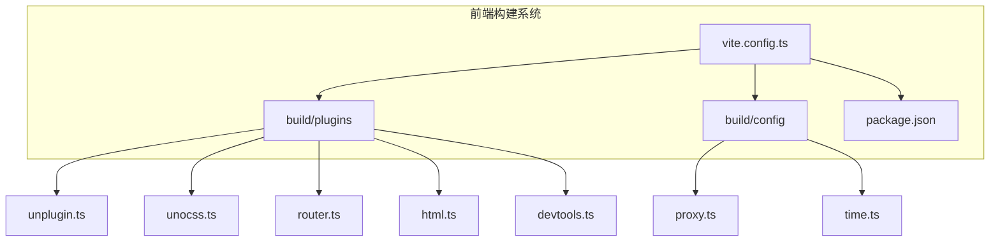
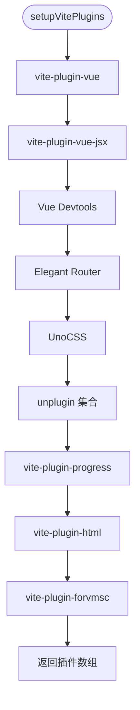
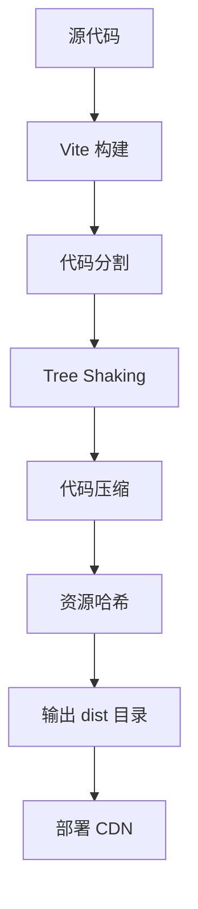

# 构建与部署问题

<cite>
**本文档引用的文件**  
- [vite.config.ts](file://frontend/vite.config.ts)
- [plugins/index.ts](file://frontend/build/plugins/index.ts)
- [plugins/unplugin.ts](file://frontend/build/plugins/unplugin.ts)
- [plugins/unocss.ts](file://frontend/build/plugins/unocss.ts)
- [plugins/router.ts](file://frontend/build/plugins/router.ts)
- [plugins/html.ts](file://frontend/build/plugins/html.ts)
- [plugins/devtools.ts](file://frontend/build/plugins/devtools.ts)
- [config/proxy.ts](file://frontend/build/config/proxy.ts)
- [config/time.ts](file://frontend/build/config/time.ts)
- [src/utils/service.ts](file://frontend/src/utils/service.ts)
- [package.json](file://frontend/package.json)
</cite>

## 目录
1. [项目结构分析](#项目结构分析)
2. [Vite 构建配置详解](#vite-构建配置详解)
3. [自定义插件系统分析](#自定义插件系统分析)
4. [构建流程调试与诊断](#构建流程调试与诊断)
5. [常见构建问题与解决方案](#常见构建问题与解决方案)
6. [生产环境优化策略](#生产环境优化策略)
7. [构建脚本与诊断命令](#构建脚本与诊断命令)

## 项目结构分析

本项目采用前后端分离架构，前端位于 `frontend` 目录，后端位于 `src/main/java` 目录。前端项目基于 Vite + Vue 3 技术栈，使用 TypeScript 和 SCSS，采用模块化组织方式。

前端核心结构如下：
- `frontend/src`: 源码目录，包含组件、路由、状态管理、工具等
- `frontend/build`: 构建配置与插件目录
- `frontend/build/plugins`: 自定义 Vite 插件集合
- `frontend/build/config`: 构建相关配置（代理、时间等）
- `frontend/vite.config.ts`: Vite 主配置文件



**图示来源**
- [vite.config.ts](file://frontend/vite.config.ts)
- [plugins/index.ts](file://frontend/build/plugins/index.ts)
- [config/proxy.ts](file://frontend/build/config/proxy.ts)
- [config/time.ts](file://frontend/build/config/time.ts)

**本节来源**
- [vite.config.ts](file://frontend/vite.config.ts)
- [build/plugins](file://frontend/build/plugins)
- [build/config](file://frontend/build/config)

## Vite 构建配置详解

`vite.config.ts` 是 Vite 的核心配置文件，定义了项目的基础路径、别名、CSS 预处理器、插件、服务器和构建选项。

### 基础配置

```typescript
export default defineConfig(configEnv => {
  const viteEnv = loadEnv(configEnv.mode, process.cwd()) as unknown as Env.ImportMeta;
  const buildTime = getBuildTime();
  const enableProxy = configEnv.command === 'serve' && !configEnv.isPreview;

  return {
    base: viteEnv.VITE_BASE_URL,
    resolve: {
      alias: {
        '~': fileURLToPath(new URL('./', import.meta.url)),
        '@': fileURLToPath(new URL('./src', import.meta.url))
      }
    },
    css: {
      preprocessorOptions: {
        scss: {
          api: 'modern-compiler',
          additionalData: `@use "@/styles/scss/global.scss" as *;`
        }
      }
    },
    plugins: setupVitePlugins(viteEnv, buildTime),
    define: {
      BUILD_TIME: JSON.stringify(buildTime)
    },
    server: {
      host: '0.0.0.0',
      port: 9527,
      open: true,
      proxy: createViteProxy(viteEnv, enableProxy),
      allowedHosts: ['u45964x883.zicp.vip']
    },
    preview: {
      port: 9725
    },
    build: {
      reportCompressedSize: false,
      sourcemap: viteEnv.VITE_SOURCE_MAP === 'Y',
      commonjsOptions: {
        ignoreTryCatch: false
      }
    }
  };
});
```

#### 关键配置项说明

- **base**: 静态资源基础路径，从环境变量 `VITE_BASE_URL` 读取
- **resolve.alias**: 路径别名，`@` 指向 `src` 目录
- **css.preprocessorOptions**: SCSS 预处理，自动导入全局样式
- **define**: 注入构建时间 `BUILD_TIME` 到全局变量
- **server.proxy**: 开发服务器代理配置，支持多后端服务
- **build.sourcemap**: 是否生成 sourcemap，由 `VITE_SOURCE_MAP` 控制

### 环境变量加载

通过 `loadEnv(configEnv.mode, process.cwd())` 加载对应模式的环境变量文件（`.env.*`），并转换为 `Env.ImportMeta` 类型。

### 构建时间注入

使用 `getBuildTime()` 函数获取当前时间（上海时区），并注入到代码中，可用于版本追踪。

**本节来源**
- [vite.config.ts](file://frontend/vite.config.ts#L0-L52)
- [build/config/time.ts](file://frontend/build/config/time.ts)

## 自定义插件系统分析

项目通过 `setupVitePlugins` 函数集中注册所有 Vite 插件，实现模块化管理。

### 插件注册流程



**图示来源**
- [plugins/index.ts](file://frontend/build/plugins/index.ts)

**本节来源**
- [plugins/index.ts](file://frontend/build/plugins/index.ts)

### 核心插件功能解析

#### unplugin 插件集合

`unplugin.ts` 集成了多个自动化插件：

```typescript
export function setupUnplugin(viteEnv: Env.ImportMeta) {
  const { VITE_ICON_PREFIX, VITE_ICON_LOCAL_PREFIX } = viteEnv;
  const localIconPath = path.join(process.cwd(), 'src/assets/svg-icon');
  const collectionName = VITE_ICON_LOCAL_PREFIX.replace(`${VITE_ICON_PREFIX}-`, '');

  return [
    Icons({ /* 图标组件 */ }),
    AutoImport({ /* 自动导入 */ }),
    Components({ /* 组件自动注册 */ }),
    createSvgIconsPlugin({ /* SVG 雪碧图 */ })
  ];
}
```

- **unplugin-icons**: 将图标库转换为 Vue 组件，支持本地 SVG 图标
- **unplugin-auto-import**: 自动导入常用 API（Vue、Pinia、Naive UI 等）
- **unplugin-vue-components**: 自动注册组件，支持 Naive UI 和图标解析器
- **vite-plugin-svg-icons**: 生成 SVG 雪碧图，提升图标加载性能

#### UnoCSS 配置

`unocss.ts` 配置了 UnoCSS 的图标预设：

```typescript
export function setupUnocss(viteEnv: Env.ImportMeta) {
  return unocss({
    presets: [
      presetIcons({
        prefix: `${VITE_ICON_PREFIX}-`,
        collections: {
          [collectionName]: FileSystemIconLoader(localIconPath, svg =>
            svg.replace(/^<svg\s/, '<svg width="1em" height="1em" ')
          )
        }
      })
    ]
  });
}
```

与 `unplugin-icons` 协同工作，实现统一的图标系统。

#### 路由插件

`router.ts` 使用 `@elegant-router/vue/vite` 实现优雅路由：

```typescript
export function setupElegantRouter() {
  return ElegantVueRouter({
    layouts: {
      base: 'src/layouts/base-layout/index.vue',
      blank: 'src/layouts/blank-layout/index.vue'
    },
    routePathTransformer: (routeName, routePath) => { /* 动态路由转换 */ },
    onRouteMetaGen: (routeName) => { /* 自动生成路由元信息 */ }
  });
}
```

- 自动识别布局组件
- 支持动态路由参数（如 `/login/:module`）
- 自动生成国际化键 `i18nKey`

#### HTML 插件

`html.ts` 在构建时向 HTML 注入构建时间：

```typescript
transformIndexHtml(html) {
  return html.replace('<head>', `<head>\n    <meta name="buildTime" content="${buildTime}">`);
}
```

便于追踪构建版本。

#### 开发工具插件

`devtools.ts` 配置 Vue Devtools：

```typescript
export function setupDevtoolsPlugin(viteEnv: Env.ImportMeta) {
  return VueDevtools({
    launchEditor: VITE_DEVTOOLS_LAUNCH_EDITOR
  });
}
```

支持配置编辑器联动。

**本节来源**
- [plugins/unplugin.ts](file://frontend/build/plugins/unplugin.ts)
- [plugins/unocss.ts](file://frontend/build/plugins/unocss.ts)
- [plugins/router.ts](file://frontend/build/plugins/router.ts)
- [plugins/html.ts](file://frontend/build/plugins/html.ts)
- [plugins/devtools.ts](file://frontend/build/plugins/devtools.ts)

## 构建流程调试与诊断

### 代理配置分析

`proxy.ts` 实现了灵活的 HTTP 代理：

```typescript
export function createViteProxy(env: Env.ImportMeta, enable: boolean) {
  const isEnableHttpProxy = enable && env.VITE_HTTP_PROXY === 'Y';
  if (!isEnableHttpProxy) return undefined;

  const { baseURL, proxyPattern, other } = createServiceConfig(env);
  const proxy = createProxyItem({ baseURL, proxyPattern }, isEnableProxyLog);

  other.forEach(item => {
    Object.assign(proxy, createProxyItem(item, isEnableProxyLog));
  });

  return proxy;
}
```

- 通过 `VITE_HTTP_PROXY` 控制是否启用代理
- 支持多个后端服务（`other` 配置）
- 可开启代理日志（`VITE_PROXY_LOG`）

### 服务配置解析

`service.ts` 负责解析服务配置：

```typescript
export function createServiceConfig(env: Env.ImportMeta) {
  let other = {} as Record<App.Service.OtherBaseURLKey, string>;
  try {
    other = json5.parse(VITE_OTHER_SERVICE_BASE_URL);
  } catch {
    console.error('VITE_OTHER_SERVICE_BASE_URL is not a valid json5 string');
  }

  return {
    baseURL: VITE_SERVICE_BASE_URL,
    proxyPattern: '/proxy-default',
    other: otherConfig
  };
}
```

- 使用 JSON5 解析复杂配置
- 支持多服务代理
- 提供 `getServiceBaseURL` 函数获取实际服务地址

### 调试构建流程

1. **检查环境变量**: 确保 `.env.*` 文件存在且变量正确
2. **启用代理日志**: 设置 `VITE_PROXY_LOG=Y` 查看代理请求
3. **验证插件顺序**: 插件执行顺序可能影响结果
4. **检查类型定义**: 确保 `Env.ImportMeta` 类型正确

**本节来源**
- [build/config/proxy.ts](file://frontend/build/config/proxy.ts)
- [src/utils/service.ts](file://frontend/src/utils/service.ts)
- [build/config/time.ts](file://frontend/build/config/time.ts)

## 常见构建问题与解决方案

### 依赖冲突

**现象**: `node_modules` 中存在多个版本的同一依赖。

**解决方案**:
1. 使用 `pnpm` 的 `overrides` 功能统一版本
2. 检查 `package.json` 中的依赖版本
3. 运行 `pnpm dedupe` 去重

### 环境变量未定义

**现象**: `loadEnv` 无法读取变量，导致构建失败。

**解决方案**:
1. 确认 `.env` 文件存在且命名正确（`.env`, `.env.test`, `.env.prod`）
2. 检查变量名拼写
3. 确保 `VITE_` 前缀（Vite 只加载以 `VITE_` 开头的变量）

### 插件加载异常

**现象**: 插件报错或未生效。

**解决方案**:
1. 检查插件安装状态：`pnpm list <plugin-name>`
2. 验证插件配置参数
3. 检查插件兼容性（Vite 6 兼容性）

### 增量编译缓存问题

**现象**: 修改代码后未重新编译。

**解决方案**:
1. 清理 Vite 缓存：`rm -rf node_modules/.vite`
2. 重启开发服务器
3. 检查 `vite.config.ts` 中的 `server.watch` 配置

### 静态资源路径错误

**现象**: 图片、字体等资源 404。

**解决方案**:
1. 确认资源位于 `public` 目录或 `src/assets`
2. 检查 `base` 配置是否正确
3. 使用 `@` 别名引用：`import img from '@/assets/image.png'`

**本节来源**
- [vite.config.ts](file://frontend/vite.config.ts)
- [plugins/index.ts](file://frontend/build/plugins/index.ts)

## 生产环境优化策略

### 打包体积优化

1. **禁用 sourcemap**: `VITE_SOURCE_MAP=N`
2. **代码压缩**: Vite 默认使用 Rollup 压缩
3. **Tree Shaking**: 确保使用 ES 模块语法
4. **依赖分析**: 使用 `rollup-plugin-visualizer`

### 静态资源优化

1. **图片压缩**: 使用 WebP 格式
2. **字体子集化**: 减少字体文件大小
3. **CDN 加速**: 将静态资源部署到 CDN

### 缓存策略

1. **长效缓存**: 为静态资源添加哈希
2. **Service Worker**: 实现离线缓存
3. **HTTP 缓存头**: 配置 `Cache-Control`



**图示来源**
- [vite.config.ts](file://frontend/vite.config.ts)
- [build/plugins](file://frontend/build/plugins)

**本节来源**
- [vite.config.ts](file://frontend/vite.config.ts#L50-L52)
- [plugins/unplugin.ts](file://frontend/build/plugins/unplugin.ts)

## 构建脚本与诊断命令

`package.json` 中定义了完整的构建脚本：

```json
"scripts": {
  "dev": "vite --mode test",
  "dev:prod": "vite --mode prod",
  "build": "vite build --mode prod",
  "build:test": "vite build --mode test",
  "preview": "vite preview",
  "typecheck": "vue-tsc --noEmit --skipLibCheck",
  "lint": "eslint . --fix",
  "commit": "sa git-commit -l=zh-cn"
}
```

### 诊断命令

| 命令 | 用途 |
|------|------|
| `pnpm typecheck` | 类型检查，发现 TypeScript 错误 |
| `pnpm lint` | 代码规范检查与自动修复 |
| `pnpm dev` | 启动开发服务器（测试环境） |
| `pnpm dev:prod` | 启动开发服务器（生产环境） |
| `pnpm build` | 生产环境构建 |
| `pnpm build:test` | 测试环境构建 |
| `pnpm preview` | 预览构建结果 |

### 调试步骤

1. **类型检查**: `pnpm typecheck`
2. **代码规范**: `pnpm lint`
3. **开发模式**: `pnpm dev` 查看实时构建
4. **构建诊断**: `pnpm build --debug` 启用调试模式
5. **预览验证**: `pnpm preview` 验证构建结果

**本节来源**
- [package.json](file://frontend/package.json#L30-L50)