# 状态管理问题

<cite>
**本文档引用的文件**
- [app/index.ts](file://frontend/src/store/modules/app/index.ts)
- [route/index.ts](file://frontend/src/store/modules/route/index.ts)
- [tab/index.ts](file://frontend/src/store/modules/tab/index.ts)
- [theme/index.ts](file://frontend/src/store/modules/theme/index.ts)
- [index.ts](file://frontend/src/store/index.ts)
- [plugins/index.ts](file://frontend/src/store/plugins/index.ts)
- [enum/index.ts](file://frontend/src/enum/index.ts)
- [router.ts](file://frontend/src/router/index.ts)
- [common/router.ts](file://frontend/src/hooks/common/router.ts)
- [storage.ts](file://frontend/src/utils/storage.ts)
- [devtools.ts](file://frontend/build/plugins/devtools.ts)
</cite>

## 目录
1. [项目结构分析](#项目结构分析)
2. [核心模块状态管理机制](#核心模块状态管理机制)
3. [状态同步与模块间通信](#状态同步与模块间通信)
4. [状态丢失与响应性问题分析](#状态丢失与响应性问题分析)
5. [持久化与本地存储机制](#持久化与本地存储机制)
6. [Vue Devtools 调试指南](#vue-devtools-调试指南)
7. [状态更新触发机制](#状态更新触发机制)
8. [解决方案与最佳实践](#解决方案与最佳实践)

## 项目结构分析

项目采用模块化状态管理设计，Pinia store 位于 `frontend/src/store` 目录下，通过模块化方式组织不同功能域的状态。

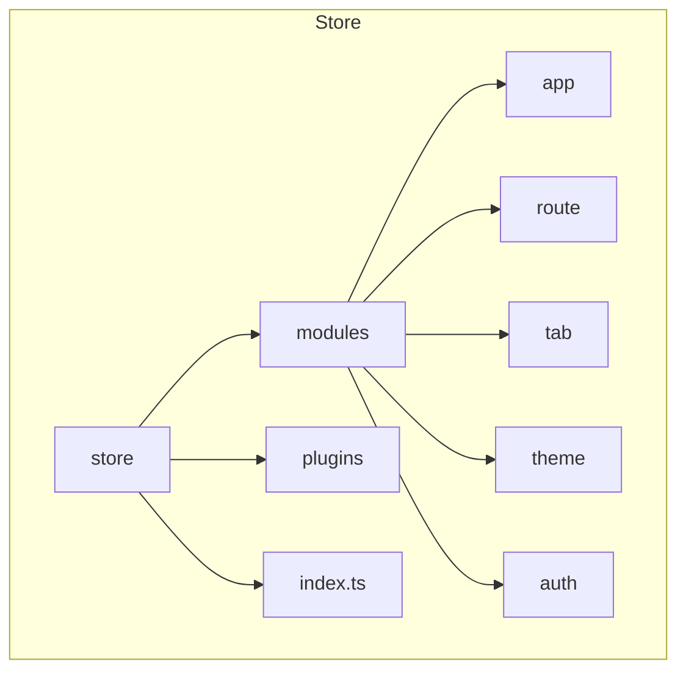

**图示来源**
- [app/index.ts](file://frontend/src/store/modules/app/index.ts)
- [route/index.ts](file://frontend/src/store/modules/route/index.ts)
- [tab/index.ts](file://frontend/src/store/modules/tab/index.ts)

## 核心模块状态管理机制

### 应用状态模块 (app)

应用状态模块管理全局UI状态，包括布局、语言、主题抽屉等。

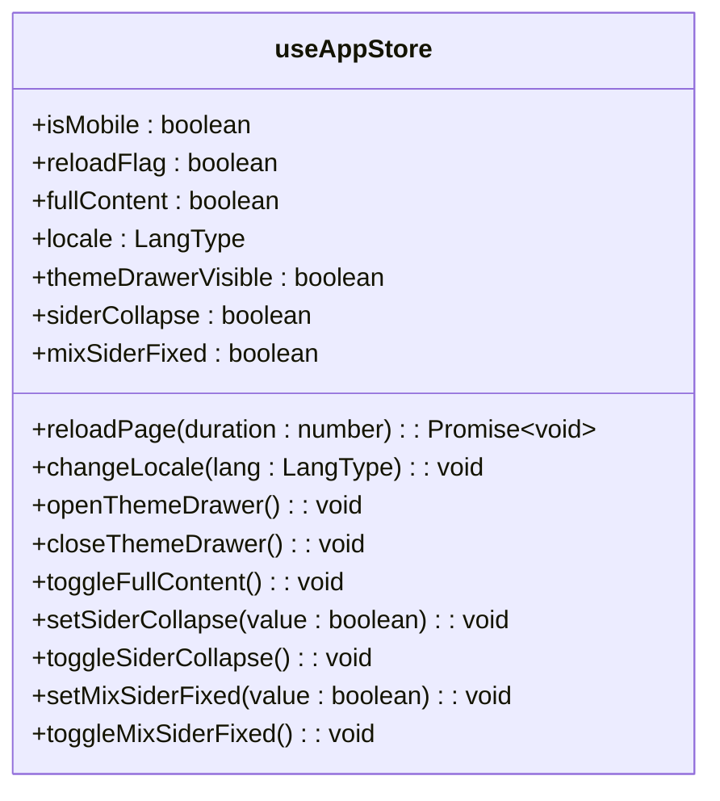

**图示来源**
- [app/index.ts](file://frontend/src/store/modules/app/index.ts#L25-L169)

### 路由状态模块 (route)

路由状态模块负责管理路由配置、菜单、缓存等。

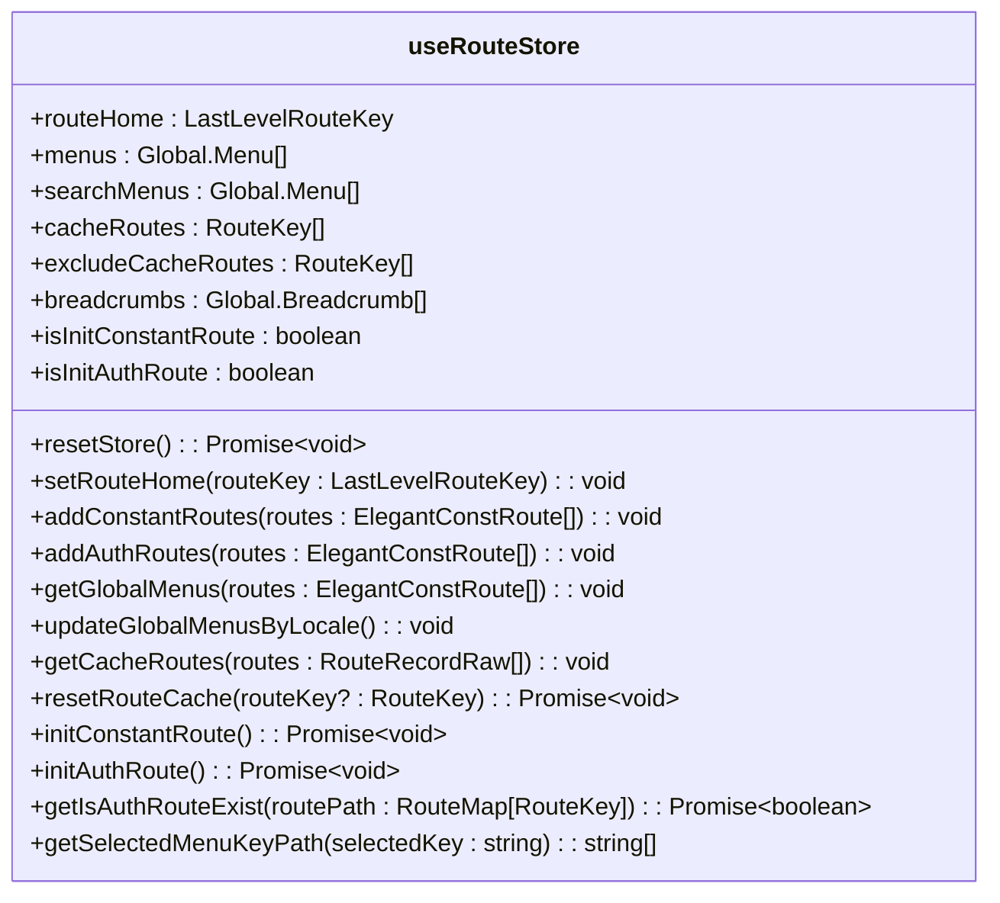

**图示来源**
- [route/index.ts](file://frontend/src/store/modules/route/index.ts#L25-L348)

### 标签页状态模块 (tab)

标签页状态模块管理多标签页的状态和行为。

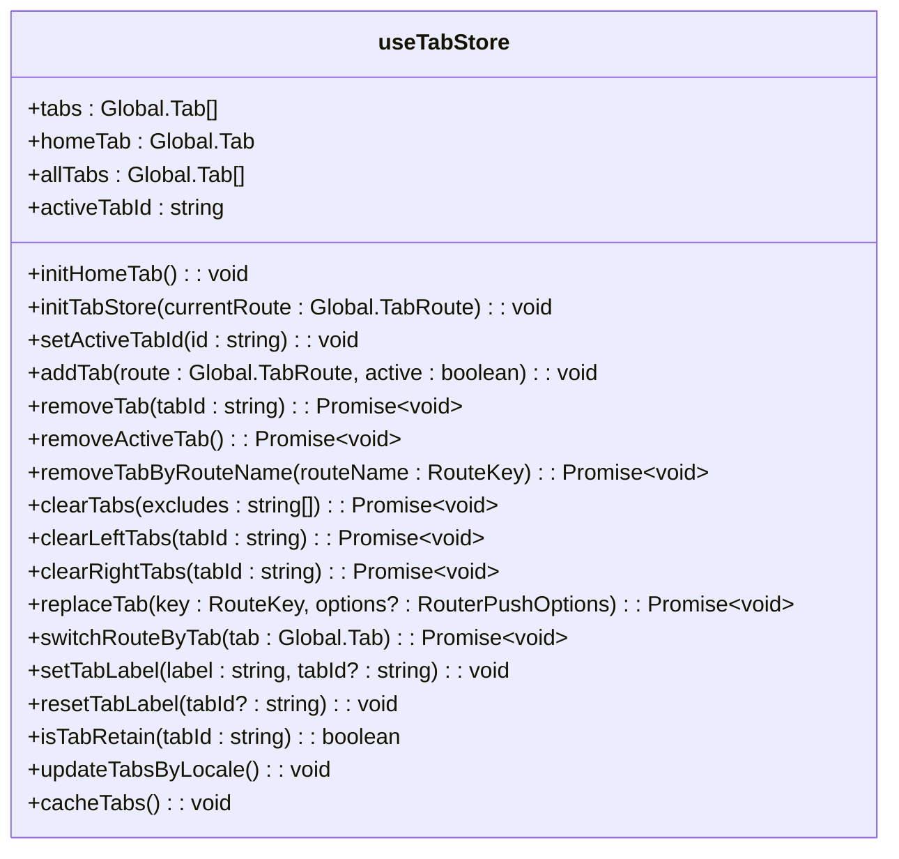

**图示来源**
- [tab/index.ts](file://frontend/src/store/modules/tab/index.ts#L25-L307)

### 主题状态模块 (theme)

主题状态模块管理应用的主题配置和样式。

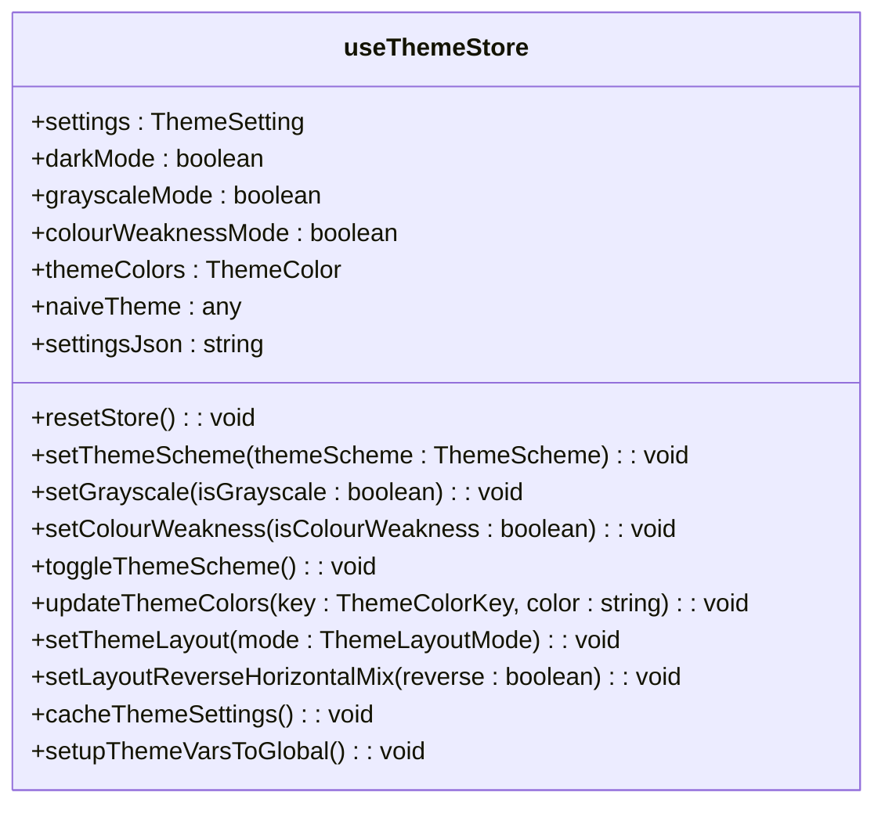

**图示来源**
- [theme/index.ts](file://frontend/src/store/modules/theme/index.ts#L25-L221)

## 状态同步与模块间通信

### 模块间依赖关系

各模块通过相互引用实现状态同步和通信。

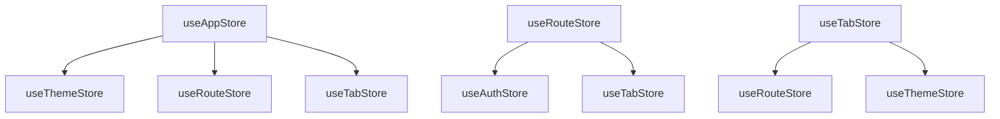

**图示来源**
- [app/index.ts](file://frontend/src/store/modules/app/index.ts#L15-L18)
- [route/index.ts](file://frontend/src/store/modules/route/index.ts#L20-L21)
- [tab/index.ts](file://frontend/src/store/modules/tab/index.ts#L25-L26)

### 状态同步机制

#### 语言切换同步流程

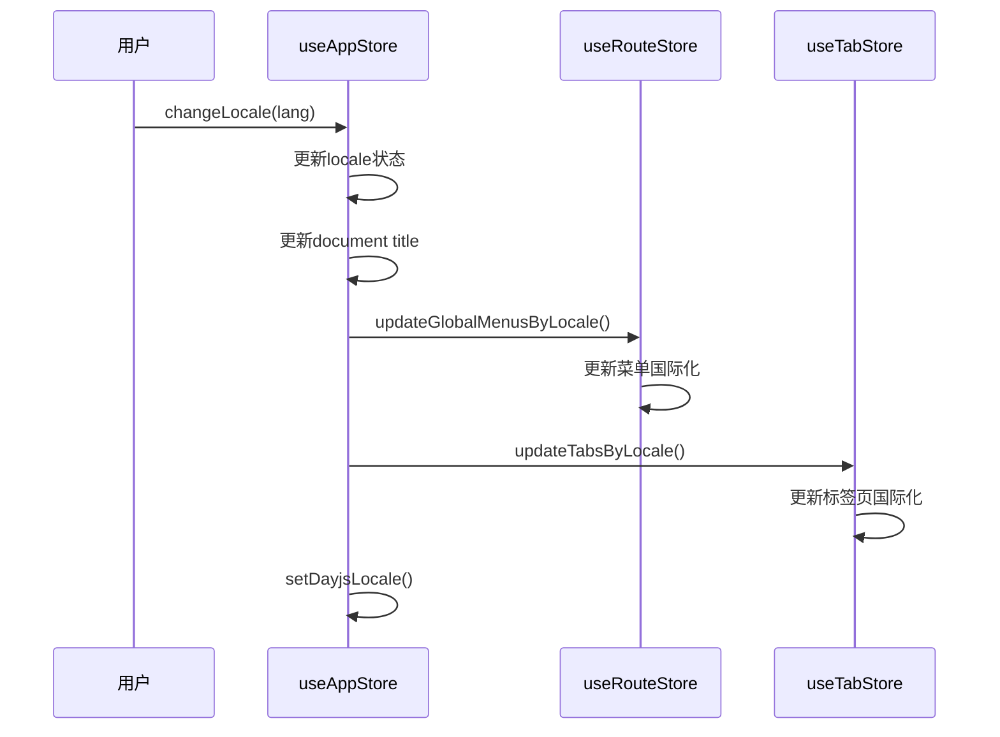

**图示来源**
- [app/index.ts](file://frontend/src/store/modules/app/index.ts#L120-L138)
- [route/index.ts](file://frontend/src/store/modules/route/index.ts#L180-L182)
- [tab/index.ts](file://frontend/src/store/modules/tab/index.ts#L285-L289)

#### 响应式布局同步流程

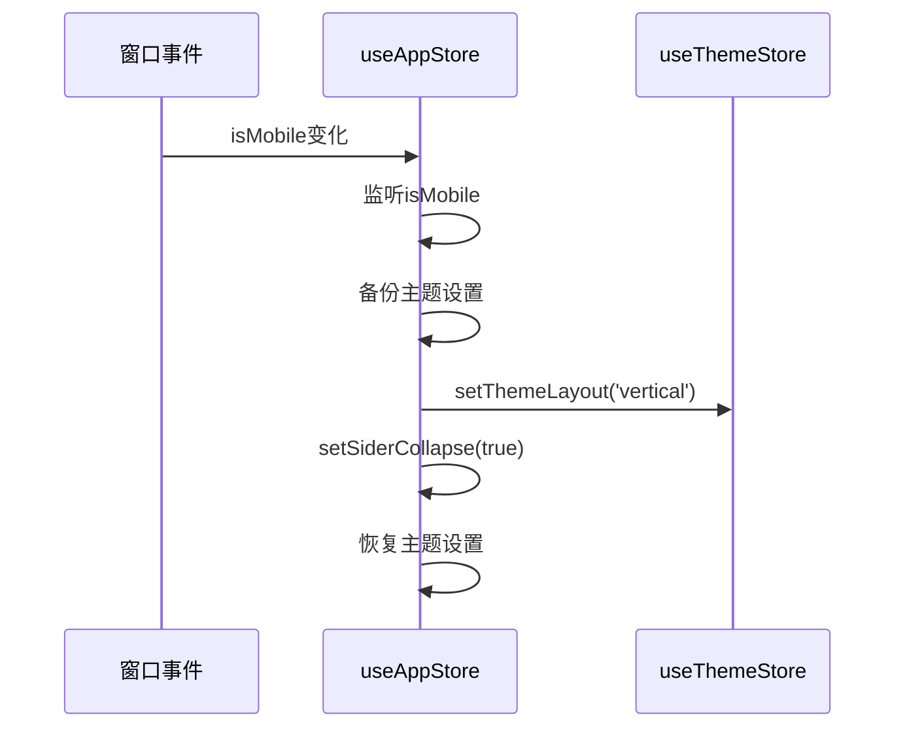

**图示来源**
- [app/index.ts](file://frontend/src/store/modules/app/index.ts#L85-L115)

## 状态丢失与响应性问题分析

### 状态丢失原因

1. **页面刷新导致状态丢失**：非持久化状态在页面刷新后重置
2. **组件销毁重建**：动态组件或路由切换导致组件实例销毁
3. **作用域问题**：effectScope管理不当导致响应式失效

### 响应性中断原因

1. **直接修改对象属性**：未通过store的setter方法修改状态
2. **异步操作未正确处理**：Promise链式调用中断响应性
3. **作用域未正确清理**：effectScope未正确停止导致内存泄漏

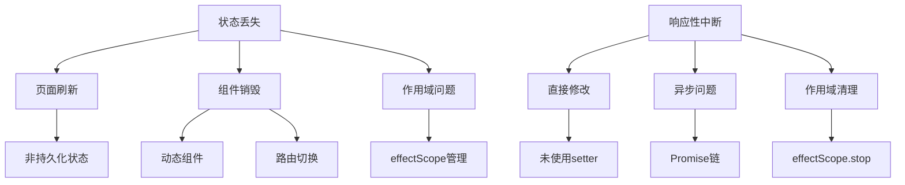

**图示来源**
- [app/index.ts](file://frontend/src/store/modules/app/index.ts#L60-L62)
- [theme/index.ts](file://frontend/src/store/modules/theme/index.ts#L180-L185)
- [tab/index.ts](file://frontend/src/store/modules/tab/index.ts#L270-L275)

## 持久化与本地存储机制

### 存储实现

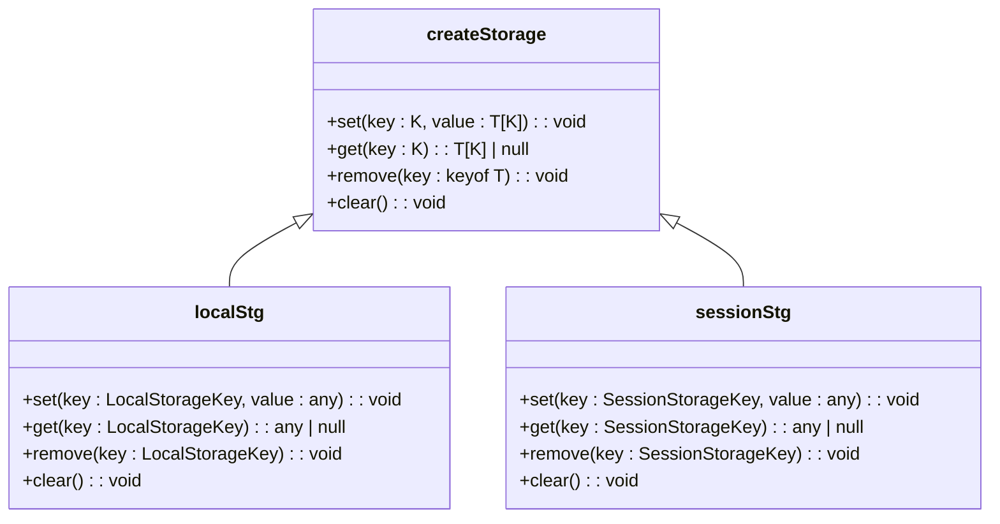

**图示来源**
- [storage.ts](file://frontend/packages/utils/src/storage.ts#L0-L75)
- [storage.ts](file://frontend/src/utils/storage.ts#L0-L8)

### 持久化策略

| 模块 | 存储键 | 存储时机 | 存储内容 |
|------|------|--------|--------|
| app | mixSiderFixed | 页面卸载前 | 混合侧边栏固定状态 |
| tab | globalTabs | 页面卸载前 | 标签页状态 |
| theme | themeSettings | 生产环境页面卸载前 | 主题设置 |
| theme | darkMode | 暗模式变化时 | 暗模式状态 |
| theme | themeColor | 主题颜色变化时 | 主题颜色 |

**图示来源**
- [app/index.ts](file://frontend/src/store/modules/app/index.ts#L160-L165)
- [tab/index.ts](file://frontend/src/store/modules/tab/index.ts#L270-L275)
- [theme/index.ts](file://frontend/src/store/modules/theme/index.ts#L180-L185)

## Vue Devtools 调试指南

### Devtools 配置

```typescript
import VueDevtools from 'vite-plugin-vue-devtools';

export function setupDevtoolsPlugin(viteEnv: Env.ImportMeta) {
  const { VITE_DEVTOOLS_LAUNCH_EDITOR } = viteEnv;

  return VueDevtools({
    launchEditor: VITE_DEVTOOLS_LAUNCH_EDITOR
  });
}
```

**图示来源**
- [devtools.ts](file://frontend/build/plugins/devtools.ts#L0-L9)

### 调试步骤

1. **安装Vue Devtools浏览器扩展**
2. **启动开发服务器**
3. **打开浏览器开发者工具**
4. **切换到Vue面板**
5. **查看Pinia store状态**

### 状态快照比对

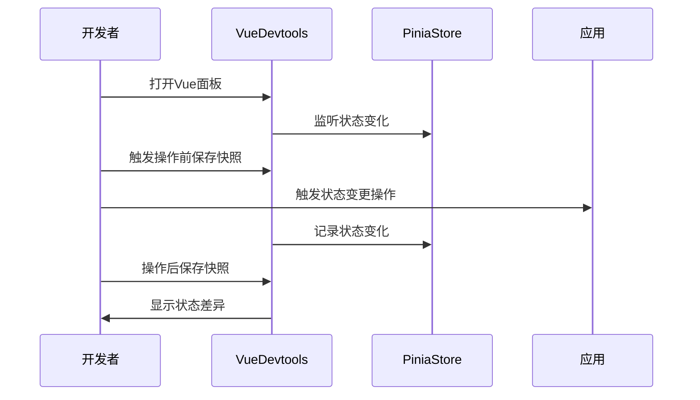

**图示来源**
- [devtools.ts](file://frontend/build/plugins/devtools.ts#L0-L9)

## 状态更新触发机制

### 组合式API使用

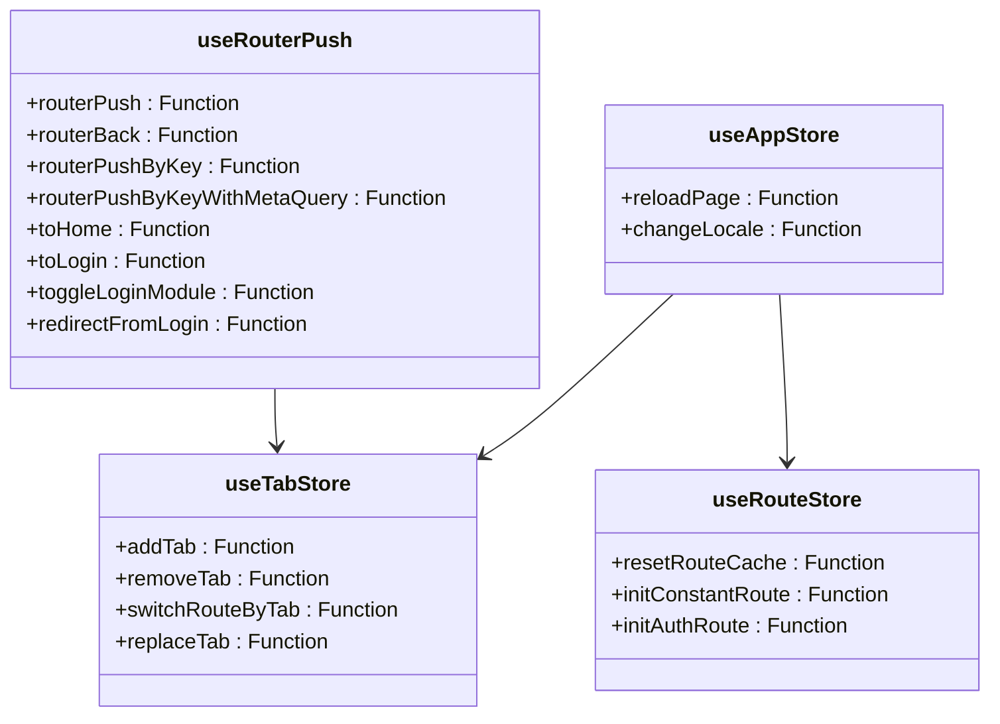

**图示来源**
- [common/router.ts](file://frontend/src/hooks/common/router.ts#L0-L114)
- [app/index.ts](file://frontend/src/store/modules/app/index.ts#L65-L80)
- [route/index.ts](file://frontend/src/store/modules/route/index.ts#L220-L235)
- [tab/index.ts](file://frontend/src/store/modules/tab/index.ts#L100-L150)

### 状态更新流程

#### 路由切换更新流程

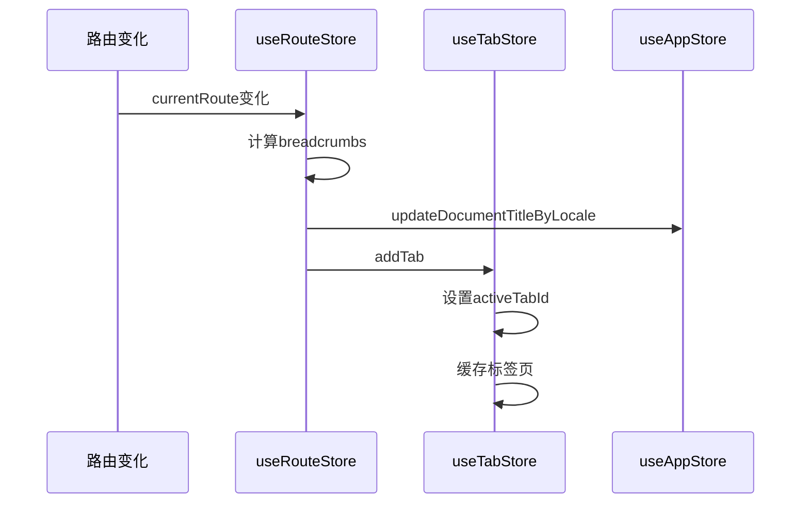

**图示来源**
- [route/index.ts](file://frontend/src/store/modules/route/index.ts#L170-L175)
- [app/index.ts](file://frontend/src/store/modules/app/index.ts#L130-L135)
- [tab/index.ts](file://frontend/src/store/modules/tab/index.ts#L100-L110)

## 解决方案与最佳实践

### 状态管理最佳实践

1. **模块化设计**：按功能域划分store模块
2. **单一状态源**：确保每个状态只在一个store中管理
3. **响应式更新**：使用Pinia的响应式机制
4. **持久化策略**：关键状态持久化存储
5. **错误处理**：完善的错误处理机制

### 常见问题解决方案

#### 状态丢失解决方案

```typescript
// 在store中实现持久化
function cacheState() {
  if (shouldPersist) {
    localStg.set('stateKey', state.value);
  }
}

// 页面卸载前保存状态
useEventListener(window, 'beforeunload', cacheState);
```

#### 响应性中断解决方案

```typescript
// 使用store的setter方法
function updateState(newValue) {
  store.$patch({ value: newValue });
}

// 正确处理异步操作
async function asyncAction() {
  try {
    const result = await apiCall();
    store.$patch({ data: result });
  } catch (error) {
    store.$patch({ error: error.message });
  }
}
```

### 调试建议

1. **使用Vue Devtools监控状态变化**
2. **设置断点调试store方法**
3. **记录状态变化日志**
4. **定期进行状态快照比对**
5. **测试持久化同步异常**

**图示来源**
- [plugins/index.ts](file://frontend/src/store/plugins/index.ts#L0-L21)
- [index.ts](file://frontend/src/store/index.ts#L0-L11)
- [devtools.ts](file://frontend/build/plugins/devtools.ts#L0-L9)