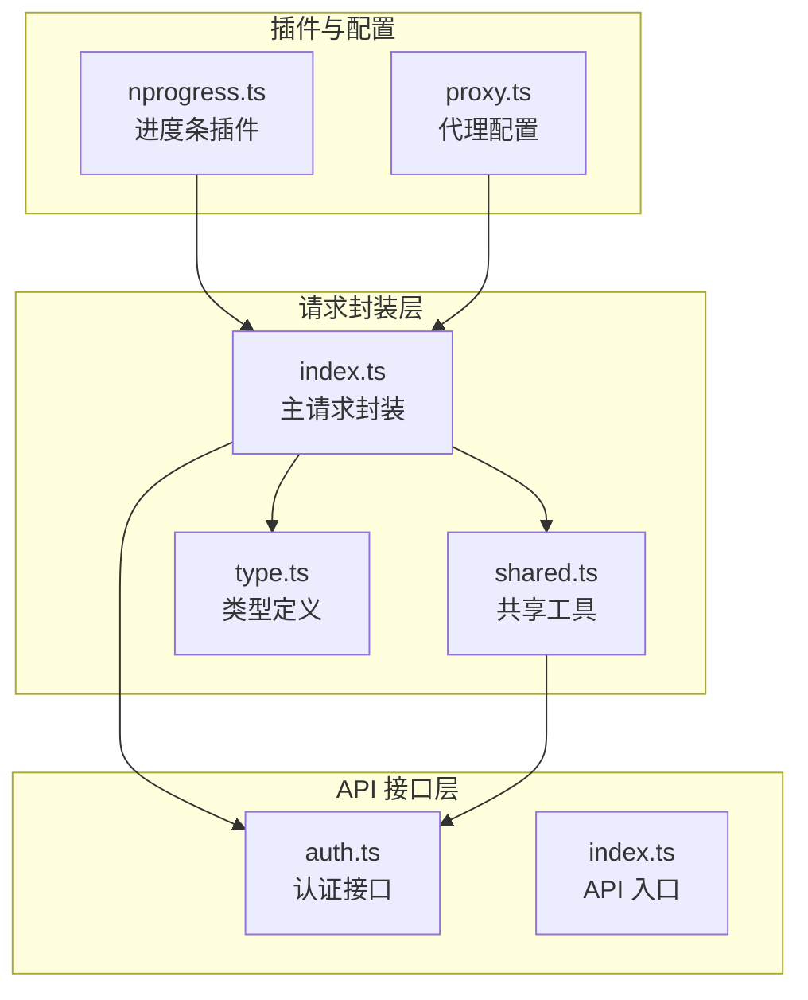
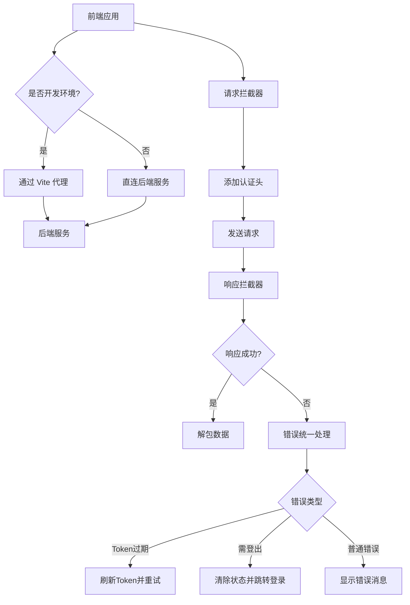
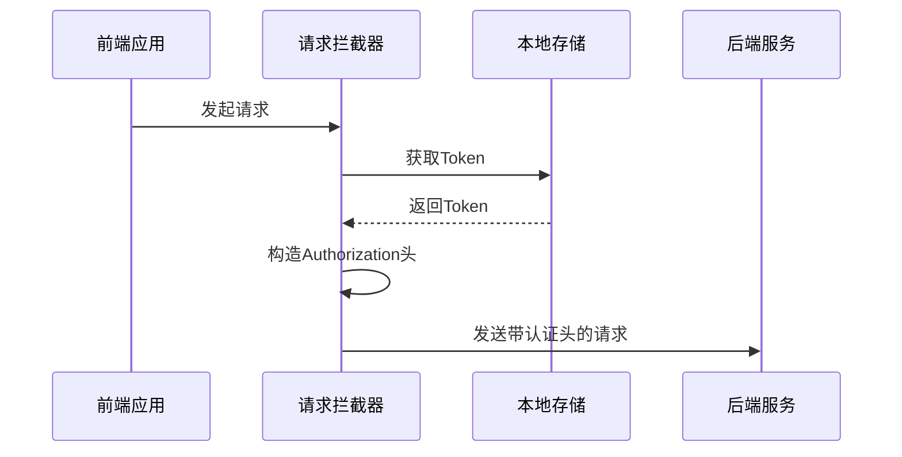
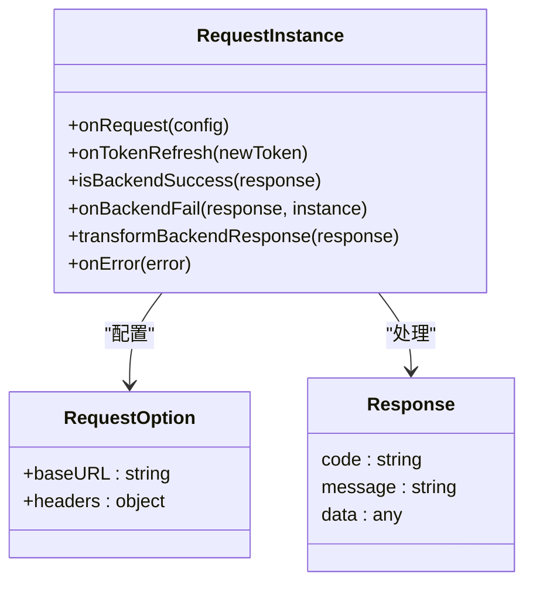
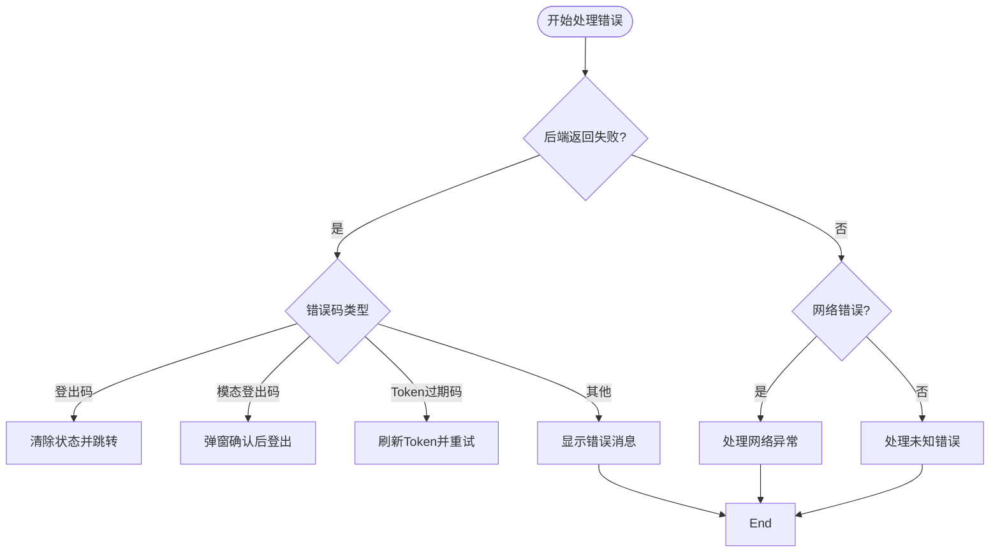
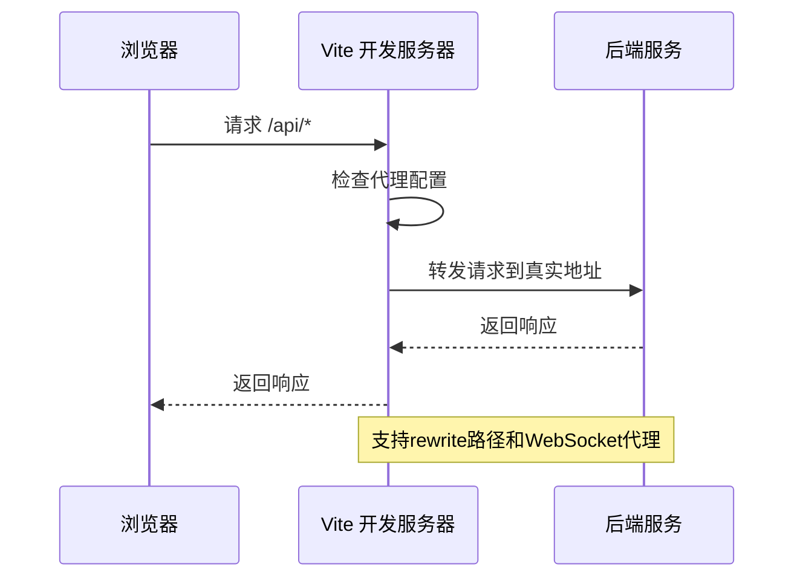
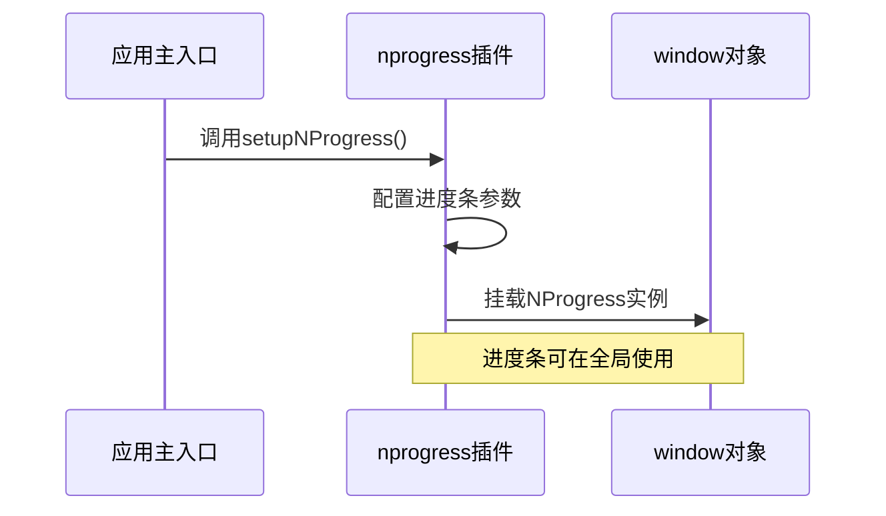
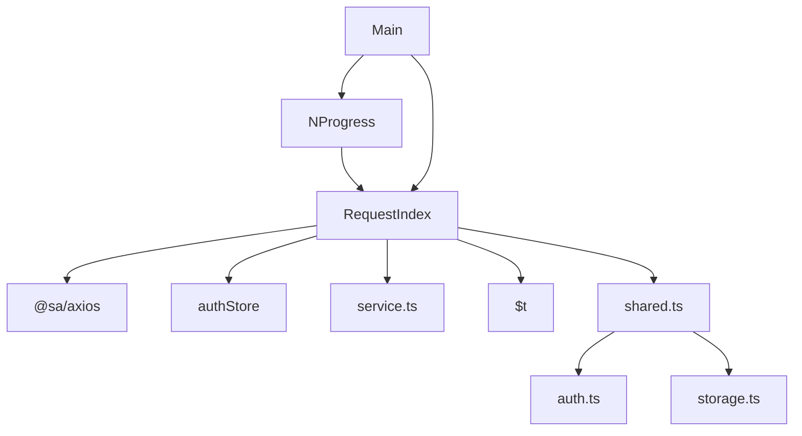

# 网络请求异常

<cite>
**本文档引用的文件**  
- [index.ts](file://frontend/src/service/request/index.ts)
- [shared.ts](file://frontend/src/service/request/shared.ts)
- [type.ts](file://frontend/src/service/request/type.ts)
- [proxy.ts](file://frontend/build/config/proxy.ts)
- [nprogress.ts](file://frontend/src/plugins/nprogress.ts)
- [main.ts](file://frontend/src/main.ts)
- [auth.ts](file://frontend/src/service/api/auth.ts)
- [service.ts](file://frontend/src/utils/service.ts)
- [vite-env.d.ts](file://frontend/src/typings/vite-env.d.ts)
</cite>

## 目录
1. [简介](#简介)
2. [项目结构](#项目结构)
3. [核心组件](#核心组件)
4. [架构概览](#架构概览)
5. [详细组件分析](#详细组件分析)
6. [依赖分析](#依赖分析)
7. [性能考量](#性能考量)
8. [故障排查指南](#故障排查指南)
9. [结论](#结论)

## 简介
本文档详细解析前端项目中基于自定义请求封装层 `frontend/src/service/request/index.ts` 的 API 调用机制。涵盖请求拦截、响应解包、错误统一处理等流程，说明如何排查跨域问题、认证 token 丢失、请求超时等常见故障，并结合代理配置指导本地开发环境联调。同时利用 nprogress 插件提供状态反馈，结合辅助函数实现请求链路追踪，提供模拟接口异常的测试方法及容错策略。

## 项目结构
项目采用模块化分层架构，前端请求相关逻辑集中于 `frontend/src/service/request/` 目录下，通过 Axios 封装实现统一的网络请求管理。核心文件包括请求主封装 `index.ts`、共享工具函数 `shared.ts` 和类型定义 `type.ts`。



**图示来源**  
- [index.ts](file://frontend/src/service/request/index.ts)
- [shared.ts](file://frontend/src/service/request/shared.ts)
- [type.ts](file://frontend/src/service/request/type.ts)
- [nprogress.ts](file://frontend/src/plugins/nprogress.ts)
- [proxy.ts](file://frontend/build/config/proxy.ts)

## 核心组件
核心请求封装基于 `@sa/axios` 提供的 `createFlatRequest` 工具函数，构建了具备拦截、重试、错误处理能力的统一请求实例。通过环境变量控制代理、成功码、登出码等关键行为，实现了灵活可配置的请求管理机制。

**组件来源**  
- [index.ts](file://frontend/src/service/request/index.ts#L1-L154)
- [shared.ts](file://frontend/src/service/request/shared.ts#L1-L64)

## 架构概览
系统采用分层架构，前端通过请求封装层与后端 API 通信，本地开发通过 Vite 代理解决跨域问题，生产环境直连后端服务。请求流程包含拦截、认证、响应处理、错误统一管理等环节。



**图示来源**  
- [index.ts](file://frontend/src/service/request/index.ts#L1-L154)
- [proxy.ts](file://frontend/build/config/proxy.ts#L1-L57)

## 详细组件分析

### 请求封装机制分析
请求封装层通过 `getFlatRequest` 函数创建具备完整生命周期钩子的请求实例，集成认证、错误处理、响应转换等功能。

#### 请求拦截与认证
在请求发送前，自动注入认证头信息，确保每次请求携带有效 Token。



**图示来源**  
- [index.ts](file://frontend/src/service/request/index.ts#L15-L25)
- [shared.ts](file://frontend/src/service/request/shared.ts#L3-L10)

#### 响应解包与成功判断
统一解包后端响应数据结构，将 `response.data.data` 作为实际业务数据返回，并通过环境变量定义的成功码判断请求是否成功。



**图示来源**  
- [index.ts](file://frontend/src/service/request/index.ts#L40-L50)
- [vite-env.d.ts](file://frontend/src/typings/vite-env.d.ts#L30-L35)

#### 错误统一处理机制
实现多层次错误处理策略，区分 Token 过期、强制登出、模态登出等不同场景，提供无感知刷新、自动登出、错误提示等用户体验优化。



**图示来源**  
- [index.ts](file://frontend/src/service/request/index.ts#L51-L153)
- [shared.ts](file://frontend/src/service/request/shared.ts#L12-L37)

### 本地开发代理配置
通过 `proxy.ts` 文件配置 Vite 代理，解决开发环境跨域问题，支持多服务代理和请求日志输出。



**图示来源**  
- [proxy.ts](file://frontend/build/config/proxy.ts#L1-L57)
- [service.ts](file://frontend/src/utils/service.ts#L1-L51)

### 请求状态反馈机制
集成 nprogress 插件，在全局提供页面加载进度反馈，提升用户体验。



**图示来源**  
- [nprogress.ts](file://frontend/src/plugins/nprogress.ts#L1-L8)
- [main.ts](file://frontend/src/main.ts#L1-L33)

## 依赖分析
请求封装层依赖多个核心模块，形成完整的请求处理链路。



**图示来源**  
- [index.ts](file://frontend/src/service/request/index.ts)
- [shared.ts](file://frontend/src/service/request/shared.ts)
- [nprogress.ts](file://frontend/src/plugins/nprogress.ts)
- [main.ts](file://frontend/src/main.ts)

## 性能考量
- **Token 刷新优化**：采用 Promise 缓存机制，避免同一时刻多个请求触发多次刷新
- **错误消息去重**：维护错误消息栈，防止相同错误重复提示
- **代理日志开关**：开发环境可配置是否输出代理日志，减少控制台噪音
- **进度条配置**：合理设置进度条动画参数，平衡用户体验与性能消耗

## 故障排查指南

### 跨域问题排查
1. 确认 `.env` 文件中 `VITE_HTTP_PROXY=Y`
2. 检查 `vite.config.ts` 是否正确引入 `createViteProxy`
3. 查看浏览器控制台是否有 CORS 错误
4. 检查代理日志输出（需 `VITE_PROXY_LOG=Y`）

### 认证 Token 丢失
1. 检查 `localStg.get('token')` 是否返回有效值
2. 确认登录接口 `/users/login` 返回的 Token 是否正确存储
3. 检查 `getAuthorization` 函数是否正确构造 `Bearer` 头
4. 查看 Token 刷新接口 `/auth/refreshToken` 是否正常工作

### 请求超时处理
1. 检查 Axios 默认超时配置
2. 确认网络连接正常
3. 查看是否触发了错误处理流程
4. 检查后端服务响应时间

### 模拟接口异常测试
可通过 `fetchCustomBackendError` 接口模拟各种错误场景：
```typescript
// 模拟Token过期
fetchCustomBackendError(import.meta.env.VITE_SERVICE_EXPIRED_TOKEN_CODES.split(',')[0], 'Token已过期');

// 模拟强制登出
fetchCustomBackendError(import.meta.env.VITE_SERVICE_LOGOUT_CODES.split(',')[0], '账户已在其他地方登录');
```

**组件来源**  
- [index.ts](file://frontend/src/service/request/index.ts#L116-L153)
- [auth.ts](file://frontend/src/service/api/auth.ts#L50-L58)
- [proxy.ts](file://frontend/build/config/proxy.ts#L10-L20)

## 结论
本项目通过精细化的请求封装设计，实现了健壮的网络请求管理机制。具备完善的错误处理、自动认证刷新、开发代理支持等功能，为前端应用提供了稳定可靠的网络通信基础。通过合理的架构分层和模块化设计，保证了代码的可维护性和扩展性，为后续功能迭代奠定了良好基础。