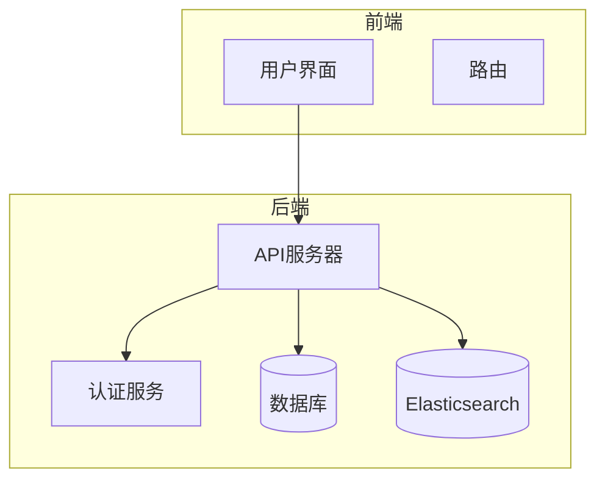
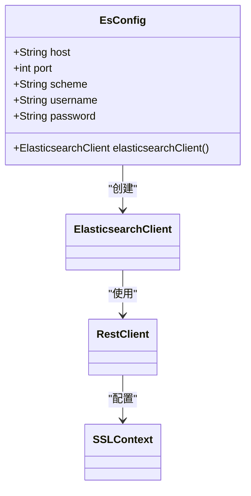
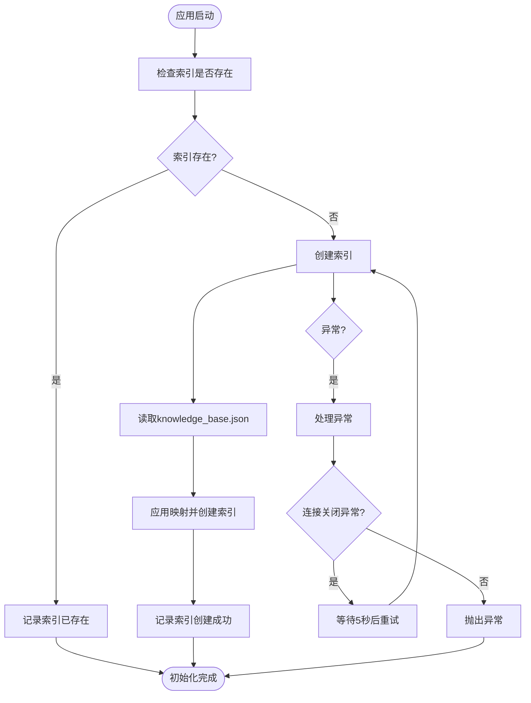
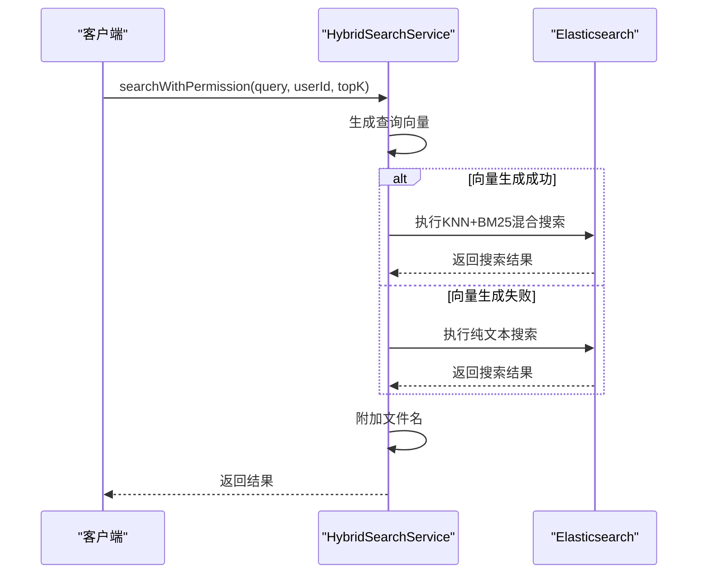
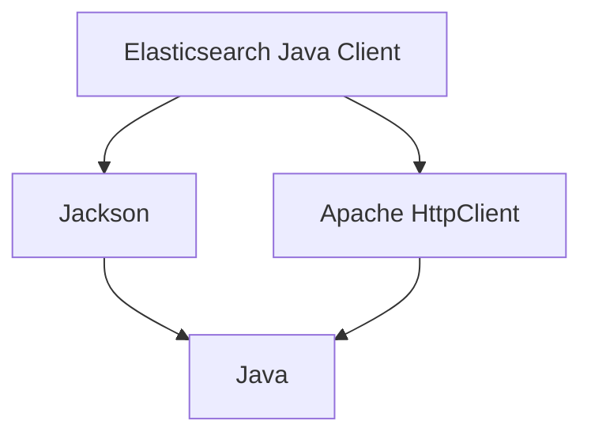

# Elasticsearch集群连接故障排除

<cite>
**本文档引用的文件**   
- [EsConfig.java](file://src/main/java/com/yizhaoqi/smartpai/config/EsConfig.java)
- [EsIndexInitializer.java](file://src/main/java/com/yizhaoqi/smartpai/config/EsIndexInitializer.java)
- [HybridSearchService.java](file://src/main/java/com/yizhaoqi/smartpai/service/HybridSearchService.java)
- [LogUtils.java](file://src/main/java/com/yizhaoqi/smartpai/utils/LogUtils.java)
- [knowledge_base.json](file://src/main/resources/es-mappings/knowledge_base.json)
- [application.yml](file://src/main/resources/application.yml)
- [application-dev.yml](file://src/main/resources/application-dev.yml)
</cite>

## 目录
1. [简介](#简介)
2. [项目结构](#项目结构)
3. [核心组件](#核心组件)
4. [架构概述](#架构概述)
5. [详细组件分析](#详细组件分析)
6. [依赖分析](#依赖分析)
7. [性能考虑](#性能考虑)
8. [故障排除指南](#故障排除指南)
9. [结论](#结论)

## 简介
本文档旨在为解决Elasticsearch集群不可达、索引初始化失败等问题提供全面的诊断和解决方案。通过分析`EsConfig`中的集群地址、端口、SSL配置，验证Elasticsearch服务的可用性及索引映射（`knowledge_base.json`）加载状态，帮助开发者快速定位并解决连接问题。同时，文档将指导如何使用`LogUtils`分析TransportClient或RestHighLevelClient连接异常的具体原因，如节点宕机、证书过期、权限不足等，并提供使用`/_cluster/health` API检查集群状态的方法。此外，还将说明在`HybridSearchService`中处理搜索降级的策略，确保系统在Elasticsearch不可用时仍能提供基本的搜索功能。

## 项目结构
本项目采用典型的Spring Boot微服务架构，前端使用Vue.js框架，后端基于Java Spring Boot构建。项目结构清晰，分为前端（frontend）、主页（homepage）和后端（src/main/java）三个主要部分。后端代码遵循MVC设计模式，包含配置（config）、控制器（controller）、实体（entity）、服务（service）、仓库（repository）等模块。Elasticsearch相关的配置和初始化逻辑位于`src/main/java/com/yizhaoqi/smartpai/config`包下，而搜索服务的实现则位于`src/main/java/com/yizhaoqi/smartpai/service`包中。索引映射文件`knowledge_base.json`存放在`src/main/resources/es-mappings`目录下，便于在应用启动时加载。



**图表来源**
- [EsConfig.java](file://src/main/java/com/yizhaoqi/smartpai/config/EsConfig.java)
- [application.yml](file://src/main/resources/application.yml)

## 核心组件
本项目的核心组件包括Elasticsearch客户端配置、索引初始化器、混合搜索服务和日志工具类。这些组件共同协作，确保Elasticsearch的稳定连接和高效搜索。

**组件来源**
- [EsConfig.java](file://src/main/java/com/yizhaoqi/smartpai/config/EsConfig.java#L1-L75)
- [EsIndexInitializer.java](file://src/main/java/com/yizhaoqi/smartpai/config/EsIndexInitializer.java#L1-L81)
- [HybridSearchService.java](file://src/main/java/com/yizhaoqi/smartpai/service/HybridSearchService.java#L1-L472)
- [LogUtils.java](file://src/main/java/com/yizhaoqi/smartpai/utils/LogUtils.java#L1-L193)

## 架构概述
系统架构采用前后端分离模式，前端通过HTTP请求与后端API交互。后端服务通过Elasticsearch客户端与Elasticsearch集群通信，实现数据的索引和搜索。在应用启动时，`EsIndexInitializer`负责检查并创建`knowledge_base`索引，确保数据存储结构的正确性。`HybridSearchService`提供混合搜索功能，结合文本匹配和向量相似度搜索，支持权限过滤。`LogUtils`则用于记录系统运行时的关键日志，便于问题诊断。


**图表来源**
- [EsConfig.java](file://src/main/java/com/yizhaoqi/smartpai/config/EsConfig.java#L1-L75)
- [HybridSearchService.java](file://src/main/java/com/yizhaoqi/smartpai/service/HybridSearchService.java#L1-L472)

## 详细组件分析

### EsConfig分析
`EsConfig`类负责配置Elasticsearch客户端，通过Spring的`@Value`注解从配置文件中读取主机、端口、协议、用户名和密码等信息。客户端使用`RestClient`作为底层HTTP客户端，并支持基本认证和SSL/TLS配置。在开发环境中，代码中配置了忽略TLS证书验证，这在生产环境中应谨慎使用。



**图表来源**
- [EsConfig.java](file://src/main/java/com/yizhaoqi/smartpai/config/EsConfig.java#L1-L75)

**组件来源**
- [EsConfig.java](file://src/main/java/com/yizhaoqi/smartpai/config/EsConfig.java#L1-L75)

### EsIndexInitializer分析
`EsIndexInitializer`类实现了`CommandLineRunner`接口，在应用启动时自动执行。它首先检查`knowledge_base`索引是否存在，如果不存在，则从`knowledge_base.json`文件中读取映射定义并创建索引。该类还实现了异常处理和重试机制，当遇到连接关闭异常时，会等待5秒后重试，提高了系统的健壮性。



**图表来源**
- [EsIndexInitializer.java](file://src/main/java/com/yizhaoqi/smartpai/config/EsIndexInitializer.java#L1-L81)

**组件来源**
- [EsIndexInitializer.java](file://src/main/java/com/yizhaoqi/smartpai/config/EsIndexInitializer.java#L1-L81)

### HybridSearchService分析
`HybridSearchService`是核心搜索服务，提供`searchWithPermission`和`search`两种搜索方法。前者支持权限过滤，确保用户只能访问其有权限的文档；后者为兼容性保留，不包含权限检查。服务采用混合搜索策略，结合KNN向量搜索和BM25文本匹配，并通过rescore机制优化结果排序。当主搜索失败时，服务会自动降级到纯文本搜索，确保搜索功能的可用性。



**图表来源**
- [HybridSearchService.java](file://src/main/java/com/yizhaoqi/smartpai/service/HybridSearchService.java#L1-L472)

**组件来源**
- [HybridSearchService.java](file://src/main/java/com/yizhaoqi/smartpai/service/HybridSearchService.java#L1-L472)

### LogUtils分析
`LogUtils`是一个静态工具类，提供统一的日志记录方法。它使用SLF4J和MDC（Mapped Diagnostic Context）来记录业务日志、性能日志、用户操作日志等。通过预定义的日志格式，可以方便地追踪用户操作、API调用和系统错误，为问题诊断提供有力支持。

**组件来源**
- [LogUtils.java](file://src/main/java/com/yizhaoqi/smartpai/utils/LogUtils.java#L1-L193)

## 依赖分析
项目通过Maven管理依赖，关键依赖包括Elasticsearch Java Client 8.10.0、Jackson用于JSON处理、Apache HttpClient用于HTTP通信等。这些依赖确保了与Elasticsearch集群的稳定通信和高效数据处理。



**图表来源**
- [pom.xml](file://pom.xml#L141-L169)

## 性能考虑
在性能方面，`HybridSearchService`采用了KNN召回和BM25重排序的策略，既保证了搜索的准确性，又兼顾了性能。通过设置`recallK`参数，可以在召回阶段扩大搜索范围，然后在重排序阶段精确筛选，避免了全量搜索的性能开销。此外，日志记录使用了异步Appender，减少了I/O操作对主线程的影响。

## 故障排除指南

### 检查Elasticsearch配置
首先，检查`application.yml`或`application-dev.yml`中的Elasticsearch配置项：
- **主机地址**：`elasticsearch.host`
- **端口号**：`elasticsearch.port`
- **协议**：`elasticsearch.scheme`（http/https）
- **用户名**：`elasticsearch.username`
- **密码**：`elasticsearch.password`

确保这些配置与Elasticsearch集群的实际设置一致。

### 验证Elasticsearch服务可用性
使用curl命令或浏览器访问Elasticsearch的健康检查API：
```bash
curl -X GET "https://localhost:9200/_cluster/health?pretty" -u elastic:zVLf2sb05Pnuk8toM+ws --insecure
```
正常响应应包含`status`字段，值为`green`或`yellow`。

### 检查索引映射加载状态
确认`src/main/resources/es-mappings/knowledge_base.json`文件存在且内容正确。该文件定义了`knowledge_base`索引的映射结构，包括`fileMd5`、`textContent`、`vector`等字段。

### 分析连接异常
查看应用日志，特别是`LogUtils`记录的错误日志。常见的异常包括：
- **节点宕机**：检查Elasticsearch集群节点状态
- **证书过期**：更新SSL证书或在开发环境中配置忽略证书验证
- **权限不足**：检查用户名和密码是否正确，用户是否有相应权限

### 处理搜索降级
当Elasticsearch不可用时，`HybridSearchService`会自动降级到纯文本搜索。可以通过日志中的`[性能]`条目监控搜索性能，并在必要时调整降级策略。

## 结论
本文档详细介绍了Elasticsearch集群连接故障的诊断和解决方案。通过检查配置、验证服务可用性、分析日志和理解降级策略，开发者可以快速定位并解决大多数连接问题。建议在生产环境中启用详细的日志记录，并定期检查Elasticsearch集群的健康状态，以确保系统的稳定运行。