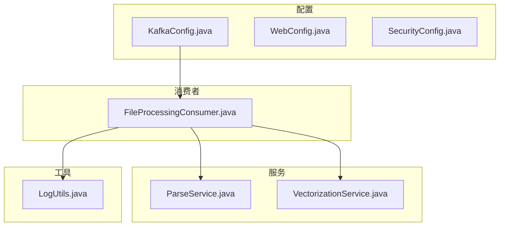
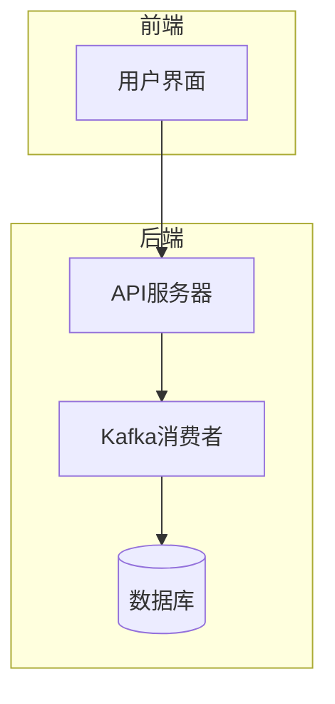
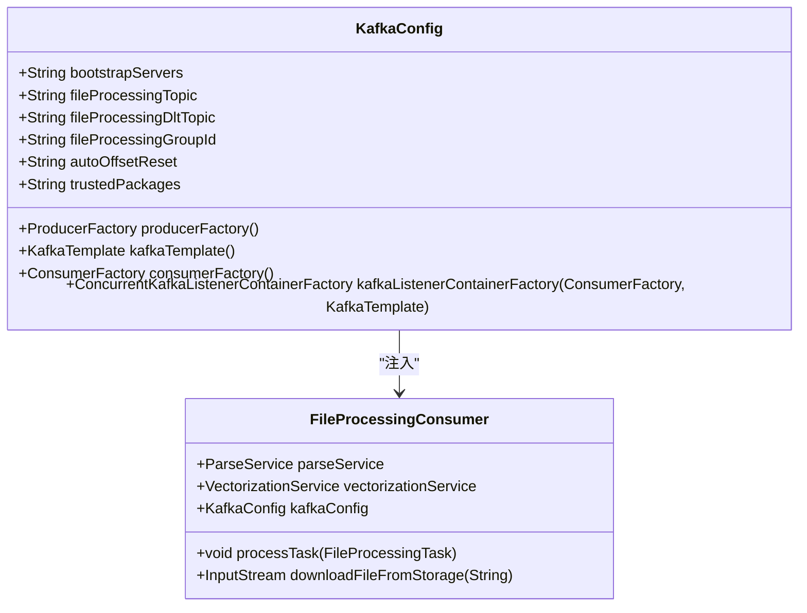
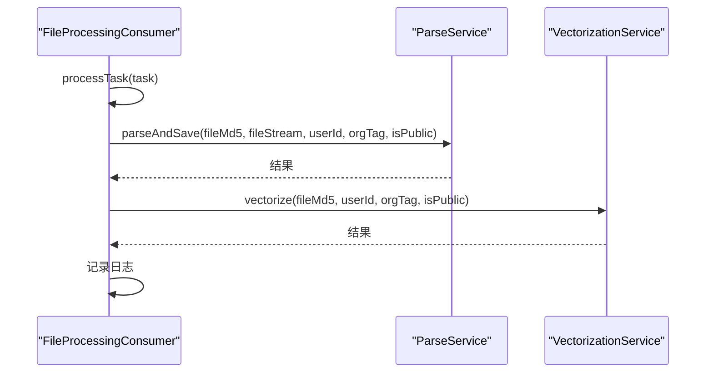
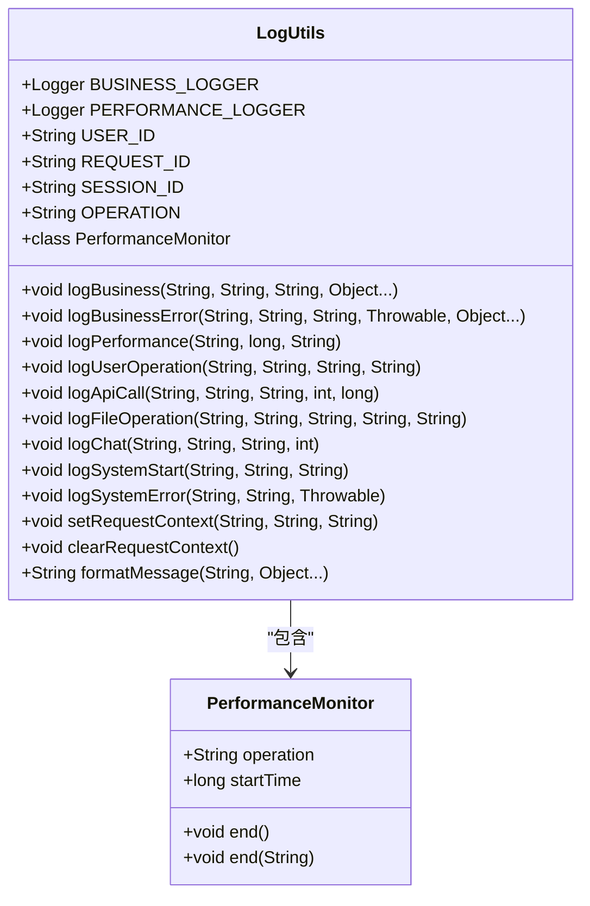
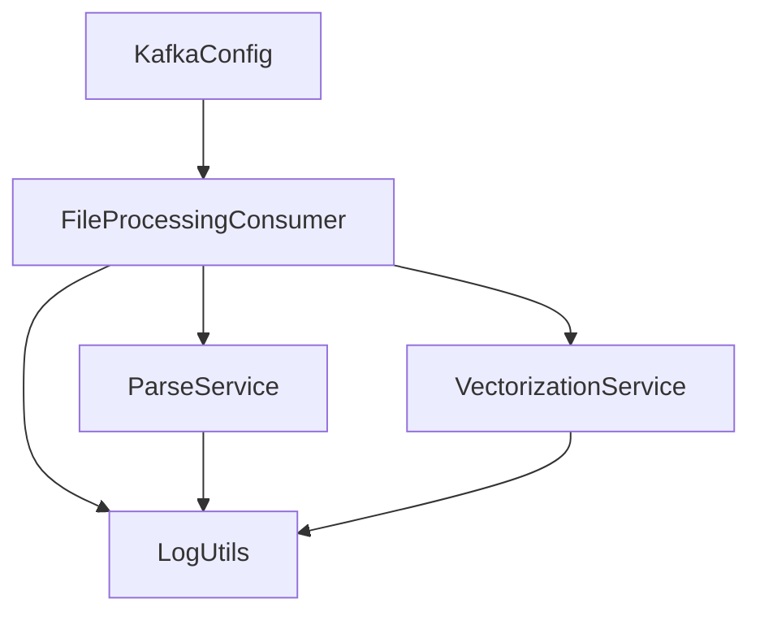

# Kafka消息队列连接与消费异常处理

<cite>
**本文档引用的文件**   
- [KafkaConfig.java](file://src/main/java/com/yizhaoqi/smartpai/config/KafkaConfig.java)
- [FileProcessingConsumer.java](file://src/main/java/com/yizhaoqi/smartpai/consumer/FileProcessingConsumer.java)
- [LogUtils.java](file://src/main/java/com/yizhaoqi/smartpai/utils/LogUtils.java)
- [application.yml](file://src/main/resources/application.yml)
- [application-dev.yml](file://src/main/resources/application-dev.yml)
- [application-docker.yml](file://src/main/resources/application-docker.yml)
</cite>

## 目录
1. [简介](#简介)
2. [项目结构](#项目结构)
3. [核心组件](#核心组件)
4. [架构概述](#架构概述)
5. [详细组件分析](#详细组件分析)
6. [依赖分析](#依赖分析)
7. [性能考虑](#性能考虑)
8. [故障排除指南](#故障排除指南)
9. [结论](#结论)

## 简介
本文档旨在为Kafka消费者组失联、消息积压、反序列化失败等问题提供全面的故障排除指南。重点分析KafkaConfig中的`bootstrap.servers`、`group.id`、`enable.auto.commit`等关键配置项的正确性，指导通过LogUtils日志追踪FileProcessingConsumer消费异常堆栈，识别网络隔离、Broker宕机、Topic不存在或序列化不匹配等问题。同时提供使用kafka-topics.sh工具检查Topic状态和消费者组偏移量的方法，并说明如何调整会话超时和心跳间隔以提升稳定性。

## 项目结构
项目采用典型的Spring Boot分层架构，主要分为前端和后端两个部分。后端代码位于`src/main/java`目录下，按照功能模块组织，包括配置、消费者、控制器、实体、异常、处理器、模型、仓库、服务、测试和工具等。关键的Kafka相关组件位于`config`和`consumer`包中。



**图示来源**
- [KafkaConfig.java](file://src/main/java/com/yizhaoqi/smartpai/config/KafkaConfig.java)
- [FileProcessingConsumer.java](file://src/main/java/com/yizhaoqi/smartpai/consumer/FileProcessingConsumer.java)

**本节来源**
- [KafkaConfig.java](file://src/main/java/com/yizhaoqi/smartpai/config/KafkaConfig.java)
- [FileProcessingConsumer.java](file://src/main/java/com/yizhaoqi/smartpai/consumer/FileProcessingConsumer.java)

## 核心组件
系统的核心组件包括Kafka配置类、文件处理消费者类和日志工具类。这些组件协同工作，确保消息的可靠消费和异常处理。

**本节来源**
- [KafkaConfig.java](file://src/main/java/com/yizhaoqi/smartpai/config/KafkaConfig.java)
- [FileProcessingConsumer.java](file://src/main/java/com/yizhaoqi/smartpai/consumer/FileProcessingConsumer.java)
- [LogUtils.java](file://src/main/java/com/yizhaoqi/smartpai/utils/LogUtils.java)

## 架构概述
系统采用Spring Kafka框架实现消息队列的集成，通过配置类定义生产者和消费者的工厂，消费者类实现具体的业务逻辑，日志工具类提供统一的日志记录接口。



**图示来源**
- [KafkaConfig.java](file://src/main/java/com/yizhaoqi/smartpai/config/KafkaConfig.java)
- [FileProcessingConsumer.java](file://src/main/java/com/yizhaoqi/smartpai/consumer/FileProcessingConsumer.java)

## 详细组件分析
### Kafka配置分析
Kafka配置类`KafkaConfig`定义了生产者和消费者的工厂，以及监听器容器工厂。关键配置项包括`bootstrap.servers`、`group.id`、`auto-offset-reset`等。



**图示来源**
- [KafkaConfig.java](file://src/main/java/com/yizhaoqi/smartpai/config/KafkaConfig.java#L1-L105)

**本节来源**
- [KafkaConfig.java](file://src/main/java/com/yizhaoqi/smartpai/config/KafkaConfig.java#L1-L105)

### 文件处理消费者分析
文件处理消费者`FileProcessingConsumer`负责从Kafka主题中消费文件处理任务，并调用解析服务和向量化服务进行处理。



**图示来源**
- [FileProcessingConsumer.java](file://src/main/java/com/yizhaoqi/smartpai/consumer/FileProcessingConsumer.java#L1-L129)

**本节来源**
- [FileProcessingConsumer.java](file://src/main/java/com/yizhaoqi/smartpai/consumer/FileProcessingConsumer.java#L1-L129)

### 日志工具分析
日志工具类`LogUtils`提供统一的日志记录方法，支持业务日志、性能日志、用户操作日志等。



**图示来源**
- [LogUtils.java](file://src/main/java/com/yizhaoqi/smartpai/utils/LogUtils.java#L1-L194)

**本节来源**
- [LogUtils.java](file://src/main/java/com/yizhaoqi/smartpai/utils/LogUtils.java#L1-L194)

## 依赖分析
系统依赖关系清晰，Kafka配置类为消费者提供必要的配置，消费者依赖解析服务和向量化服务完成业务逻辑，日志工具类被多个组件使用。



**图示来源**
- [KafkaConfig.java](file://src/main/java/com/yizhaoqi/smartpai/config/KafkaConfig.java)
- [FileProcessingConsumer.java](file://src/main/java/com/yizhaoqi/smartpai/consumer/FileProcessingConsumer.java)
- [LogUtils.java](file://src/main/java/com/yizhaoqi/smartpai/utils/LogUtils.java)

**本节来源**
- [KafkaConfig.java](file://src/main/java/com/yizhaoqi/smartpai/config/KafkaConfig.java)
- [FileProcessingConsumer.java](file://src/main/java/com/yizhaoqi/smartpai/consumer/FileProcessingConsumer.java)
- [LogUtils.java](file://src/main/java/com/yizhaoqi/smartpai/utils/LogUtils.java)

## 性能考虑
系统在性能方面做了充分考虑，包括使用缓冲流、设置合理的超时时间、使用幂等生产者等。

**本节来源**
- [FileProcessingConsumer.java](file://src/main/java/com/yizhaoqi/smartpai/consumer/FileProcessingConsumer.java)
- [KafkaConfig.java](file://src/main/java/com/yizhaoqi/smartpai/config/KafkaConfig.java)

## 故障排除指南
### Kafka配置检查
确保`application.yml`中的Kafka配置正确，特别是`bootstrap-servers`、`group-id`等关键参数。

```yaml
spring:
  kafka:
    bootstrap-servers: 127.0.0.1:9092
    consumer:
      group-id: file-processing-group
      auto-offset-reset: earliest
```

**本节来源**
- [application.yml](file://src/main/resources/application.yml#L40-L51)

### 日志追踪
通过`LogUtils`记录的异常堆栈，可以快速定位问题。例如，在`FileProcessingConsumer`中捕获到的异常会通过`log.error`记录。

```java
} catch (Exception e) {
    log.error("Error processing task: {}", task, e);
    throw new RuntimeException("Error processing task", e);
}
```

**本节来源**
- [FileProcessingConsumer.java](file://src/main/java/com/yizhaoqi/smartpai/consumer/FileProcessingConsumer.java#L64)

### Topic状态检查
使用`kafka-topics.sh`工具检查Topic状态和消费者组偏移量。

```bash
# 查看Topic列表
kafka-topics.sh --bootstrap-server 127.0.0.1:9092 --list

# 查看Topic详情
kafka-topics.sh --bootstrap-server 127.0.0.1:9092 --describe --topic file-processing-topic1

# 查看消费者组偏移量
kafka-consumer-groups.sh --bootstrap-server 127.0.0.1:9092 --describe --group file-processing-group
```

**本节来源**
- [application.yml](file://src/main/resources/application.yml#L40-L51)

### 会话超时和心跳间隔调整
虽然代码中未显式设置会话超时和心跳间隔，但可以通过`application.yml`进行配置。

```yaml
spring:
  kafka:
    consumer:
      properties:
        session.timeout.ms: 45000
        heartbeat.interval.ms: 15000
```

**本节来源**
- [application.yml](file://src/main/resources/application.yml#L40-L51)

## 结论
本文档详细分析了Kafka消息队列连接与消费异常处理的各个方面，提供了全面的故障排除指南。通过正确配置Kafka参数、合理使用日志工具、定期检查Topic状态和消费者组偏移量，可以有效提升系统的稳定性和可靠性。