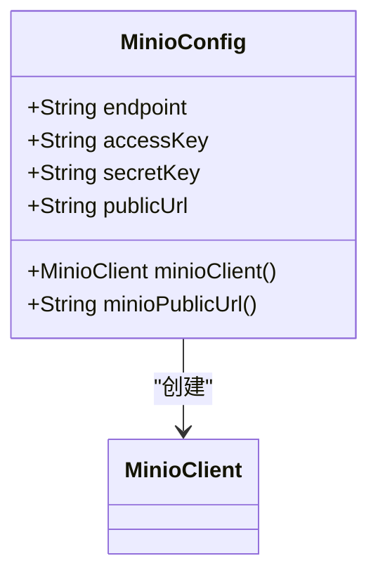
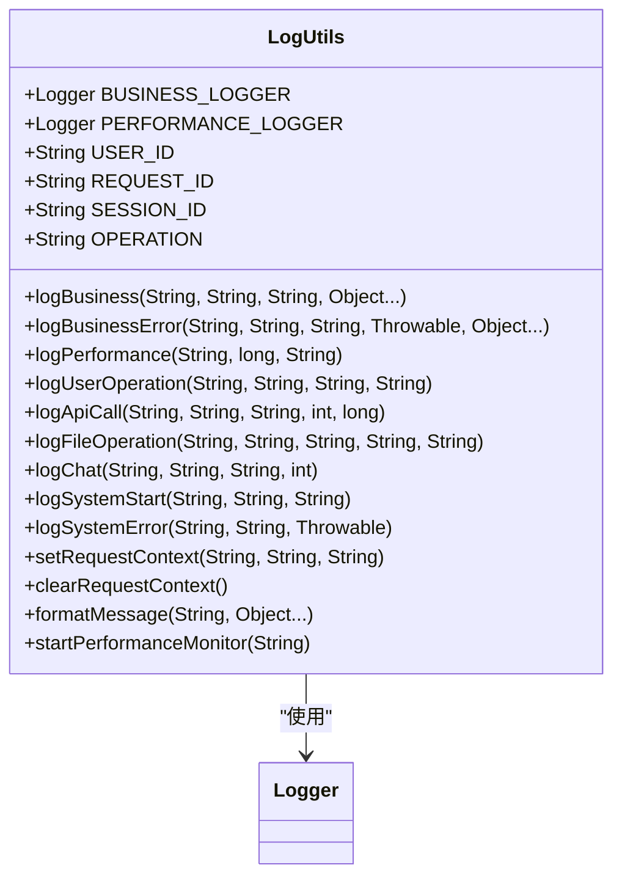
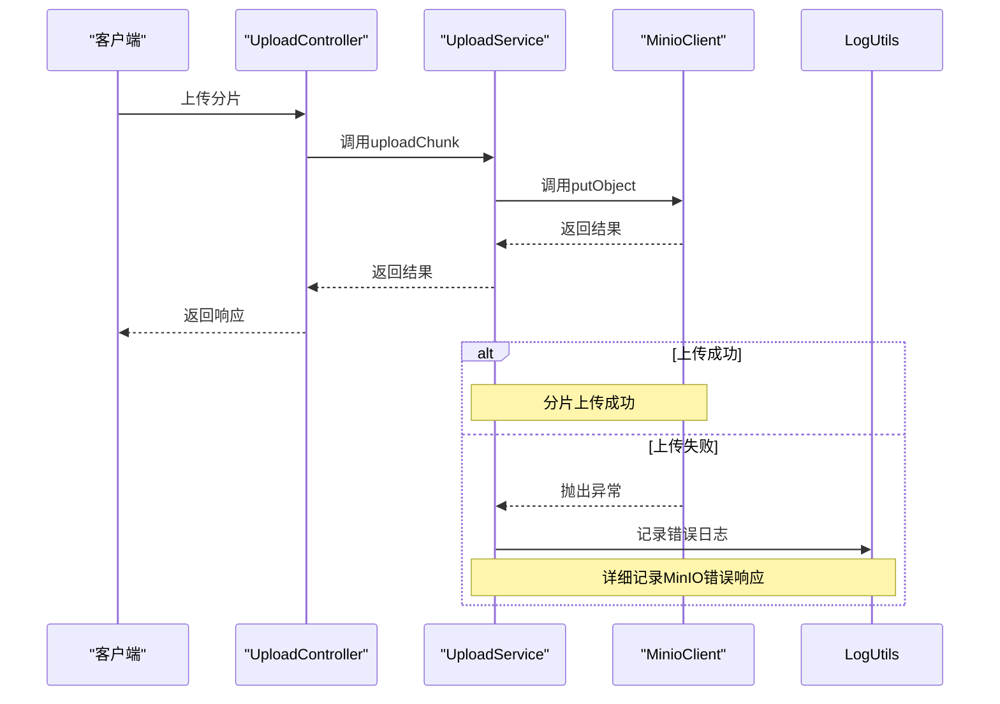

# MinIO存储服务访问异常排查

<cite>
**本文档引用的文件**   
- [MinioConfig.java](file://src/main/java/com/yizhaoqi/smartpai/config/MinioConfig.java)
- [UploadService.java](file://src/main/java/com/yizhaoqi/smartpai/service/UploadService.java)
- [LogUtils.java](file://src/main/java/com/yizhaoqi/smartpai/utils/LogUtils.java)
- [application.yml](file://src/main/resources/application.yml)
- [UploadController.java](file://src/main/java/com/yizhaoqi/smartpai/controller/UploadController.java)
- [DocumentService.java](file://src/main/java/com/yizhaoqi/smartpai/service/DocumentService.java)
- [logback-spring.xml](file://src/main/resources/logback-spring.xml)
</cite>

## 目录
1. [问题概述](#问题概述)
2. [配置项校验方法](#配置项校验方法)
3. [日志分析与异常定位](#日志分析与异常定位)
4. [MinIO客户端命令行检查](#minio客户端命令行检查)
5. [服务端防火墙配置](#服务端防火墙配置)
6. [解决方案总结](#解决方案总结)

## 问题概述

在使用MinIO作为对象存储服务时，可能会遇到存储桶访问被拒绝、文件上传中断、预签名URL失效等问题。这些问题通常由配置错误、网络问题、凭证错误或存储桶权限配置不当引起。本文档旨在提供一套完整的排查和解决方案，帮助开发者快速定位并解决这些问题。

**Section sources**
- [UploadService.java](file://src/main/java/com/yizhaoqi/smartpai/service/UploadService.java#L0-L199)
- [UploadController.java](file://src/main/java/com/yizhaoqi/smartpai/controller/UploadController.java#L52-L79)

## 配置项校验方法

### MinioConfig配置项分析

MinioConfig类负责配置MinIO客户端的连接参数，包括endpoint、accessKey、secretKey、bucketName和publicUrl。这些配置项通过Spring的@Value注解从application.yml文件中读取。



**Diagram sources**
- [MinioConfig.java](file://src/main/java/com/yizhaoqi/smartpai/config/MinioConfig.java#L0-L35)

#### endpoint校验

endpoint配置项指定了MinIO服务器的地址和端口。在application.yml文件中，该值为`http://localhost:9000`。需要确保该地址可访问，且端口9000未被防火墙阻止。

#### accessKey和secretKey校验

accessKey和secretKey用于身份验证。在application.yml文件中，这两个值均为`minioadmin`。需要确保这些凭证与MinIO服务器的配置一致。

#### bucketName校验

bucketName配置项指定了默认的存储桶名称。在application.yml文件中，该值为`uploads`。需要确保该存储桶存在，并且具有适当的读写权限。

#### publicUrl校验

publicUrl配置项指定了MinIO的公共访问地址。在application.yml文件中，该值为`http://localhost:9000`。需要确保该地址可从外部网络访问。

**Section sources**
- [MinioConfig.java](file://src/main/java/com/yizhaoqi/smartpai/config/MinioConfig.java#L0-L35)
- [application.yml](file://src/main/resources/application.yml#L58)

## 日志分析与异常定位

### LogUtils日志分析

LogUtils类提供了统一的日志记录方法，用于记录业务日志、性能日志和错误日志。通过分析日志，可以定位文件上传过程中的异常。



**Diagram sources**
- [LogUtils.java](file://src/main/java/com/yizhaoqi/smartpai/utils/LogUtils.java#L0-L43)

### UploadService异常处理

UploadService类负责处理文件上传的逻辑。在文件上传过程中，可能会抛出IOException或ErrorResponseException。通过分析日志，可以定位异常的根源。



**Diagram sources**
- [UploadService.java](file://src/main/java/com/yizhaoqi/smartpai/service/UploadService.java#L169-L188)
- [LogUtils.java](file://src/main/java/com/yizhaoqi/smartpai/utils/LogUtils.java#L41-L81)

#### IOException分析

IOException通常由网络问题或文件读写错误引起。在UploadService中，当调用minioClient.putObject时，如果网络连接中断或文件读取失败，会抛出IOException。

#### ErrorResponseException分析

ErrorResponseException通常由凭证错误或存储桶权限配置不当引起。在UploadService中，当调用minioClient.putObject时，如果accessKey或secretKey错误，或存储桶权限不足，会抛出ErrorResponseException。

**Section sources**
- [UploadService.java](file://src/main/java/com/yizhaoqi/smartpai/service/UploadService.java#L169-L188)
- [LogUtils.java](file://src/main/java/com/yizhaoqi/smartpai/utils/LogUtils.java#L41-L81)

## MinIO客户端命令行检查

### 检查存储桶状态

使用MinIO客户端命令行工具mc，可以检查存储桶的状态和策略配置。

```bash
# 列出所有存储桶
mc ls myminio/

# 检查特定存储桶的状态
mc stat myminio/uploads

# 查看存储桶的策略配置
mc policy get myminio/uploads
```

### 检查存储桶策略

确保存储桶具有适当的读写权限。可以通过以下命令设置存储桶策略：

```bash
# 设置存储桶为公开读
mc policy set download myminio/uploads

# 设置存储桶为公开读写
mc policy set public myminio/uploads
```

**Section sources**
- [UploadService.java](file://src/main/java/com/yizhaoqi/smartpai/service/UploadService.java#L579-L606)
- [DocumentService.java](file://src/main/java/com/yizhaoqi/smartpai/service/DocumentService.java#L166-L199)

## 服务端防火墙配置

### 开放相应端口

确保MinIO服务器的端口9000已开放。可以通过以下命令检查端口状态：

```bash
# 检查端口9000是否开放
sudo netstat -tuln | grep 9000

# 如果端口未开放，使用iptables开放端口
sudo iptables -A INPUT -p tcp --dport 9000 -j ACCEPT
```

### 配置防火墙规则

确保防火墙规则允许外部访问MinIO服务器。可以通过以下命令配置防火墙：

```bash
# 使用ufw开放端口
sudo ufw allow 9000

# 使用firewalld开放端口
sudo firewall-cmd --permanent --add-port=9000/tcp
sudo firewall-cmd --reload
```

**Section sources**
- [application.yml](file://src/main/resources/application.yml#L58)
- [logback-spring.xml](file://src/main/resources/logback-spring.xml#L104-L133)

## 解决方案总结

1. **配置项校验**：确保MinioConfig中的endpoint、accessKey、secretKey、bucketName和publicUrl配置正确。
2. **日志分析**：通过LogUtils分析UploadService中的异常，定位网络问题、凭证错误或存储桶权限配置不当。
3. **MinIO客户端检查**：使用mc命令行工具检查存储桶状态和策略配置，确保具有适当的读写权限。
4. **防火墙配置**：确保MinIO服务器的端口9000已开放，且防火墙规则允许外部访问。

通过以上步骤，可以有效解决MinIO存储桶访问被拒绝、文件上传中断、预签名URL失效等问题。

**Section sources**
- [MinioConfig.java](file://src/main/java/com/yizhaoqi/smartpai/config/MinioConfig.java#L0-L35)
- [UploadService.java](file://src/main/java/com/yizhaoqi/smartpai/service/UploadService.java#L169-L188)
- [LogUtils.java](file://src/main/java/com/yizhaoqi/smartpai/utils/LogUtils.java#L41-L81)
- [application.yml](file://src/main/resources/application.yml#L58)
- [logback-spring.xml](file://src/main/resources/logback-spring.xml#L104-L133)