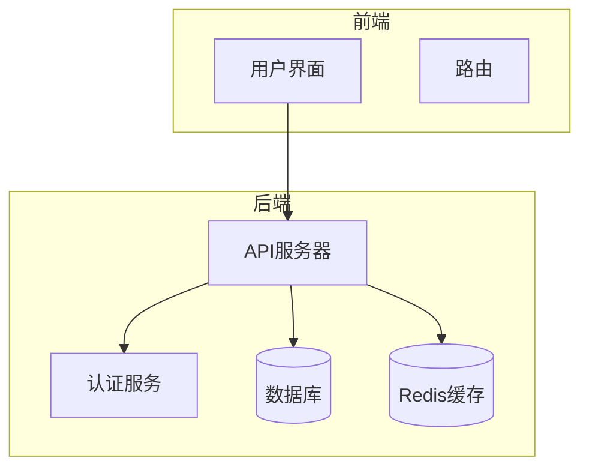
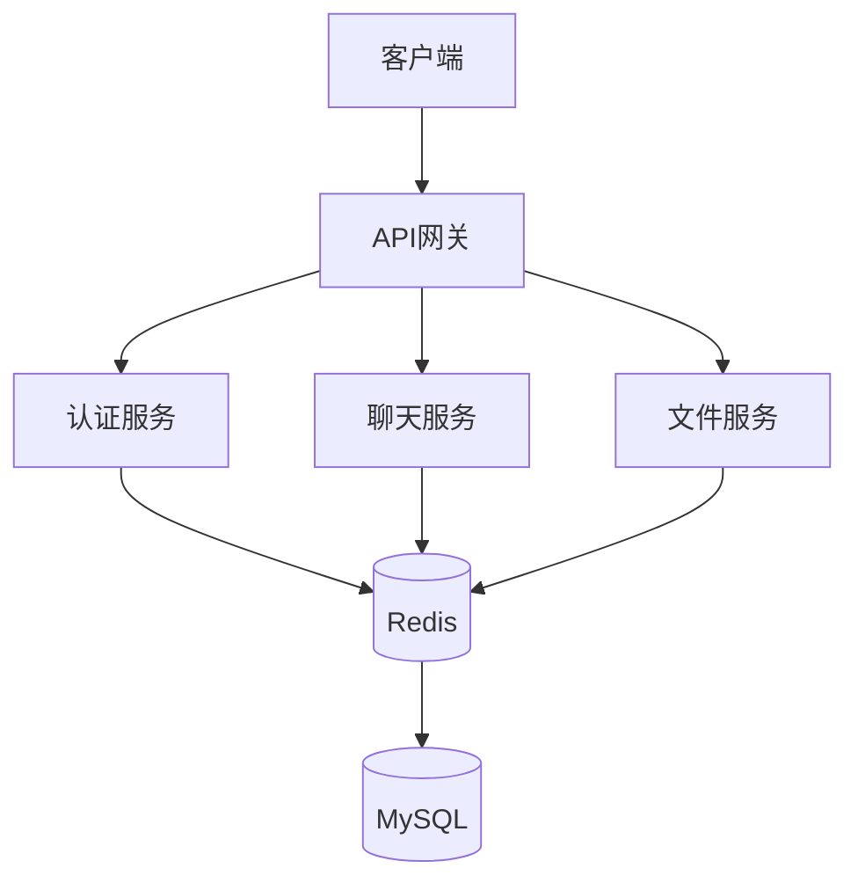
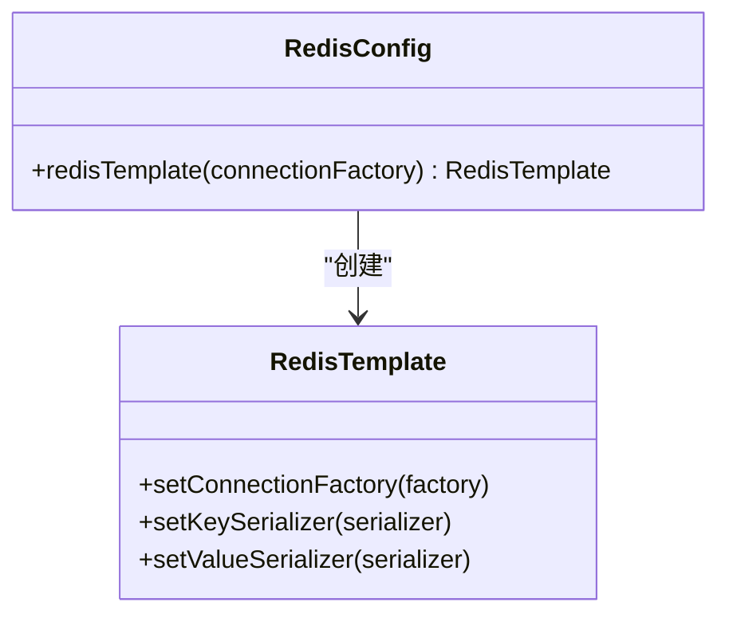
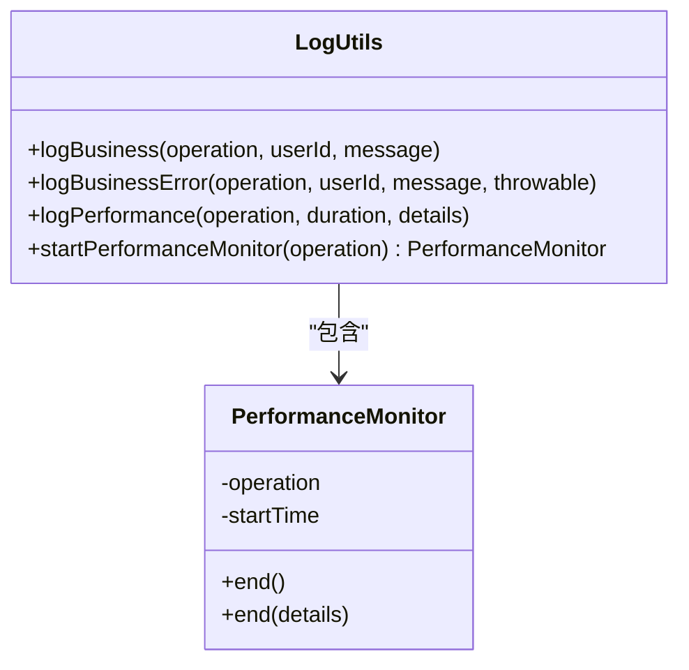
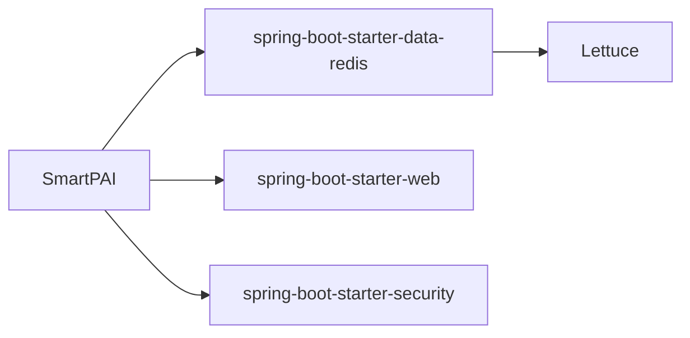

# Redis连接问题排查

<cite>
**本文档引用的文件**   
- [RedisConfig.java](file://src/main/java/com/yizhaoqi/smartpai/config/RedisConfig.java)
- [LogUtils.java](file://src/main/java/com/yizhaoqi/smartpai/utils/LogUtils.java)
- [application.yml](file://src/main/resources/application.yml)
- [application-dev.yml](file://src/main/resources/application-dev.yml)
- [application-docker.yml](file://src/main/resources/application-docker.yml)
- [pom.xml](file://pom.xml)
- [TokenCacheService.java](file://src/main/java/com/yizhaoqi/smartpai/service/TokenCacheService.java)
- [RedisRepository.java](file://src/main/java/com/yizhaoqi/smartpai/repository/RedisRepository.java)
</cite>

## 目录
1. [引言](#引言)
2. [项目结构](#项目结构)
3. [核心组件](#核心组件)
4. [架构概述](#架构概述)
5. [详细组件分析](#详细组件分析)
6. [依赖分析](#依赖分析)
7. [性能考量](#性能考量)
8. [故障排查指南](#故障排查指南)
9. [结论](#结论)

## 引言
本文档旨在为开发者提供一份关于Redis连接超时与访问异常的专项排查指南。通过分析`RedisConfig`中的连接池配置参数、检查Redis服务状态、网络连通性及认证信息，结合日志工具定位异常堆栈，并利用Spring Boot Actuator验证健康状态，帮助快速诊断和解决Redis连接问题。

## 项目结构
本项目采用典型的前后端分离架构，前端基于Vue框架构建，后端使用Spring Boot实现业务逻辑。Redis作为缓存层被广泛应用于会话管理、对话历史存储等场景。



**图示来源**
- [RedisConfig.java](file://src/main/java/com/yizhaoqi/smartpai/config/RedisConfig.java#L1-L21)
- [application.yml](file://src/main/resources/application.yml#L1-L128)

**本节来源**
- [RedisConfig.java](file://src/main/java/com/yizhaoqi/smartpai/config/RedisConfig.java#L1-L21)
- [application.yml](file://src/main/resources/application.yml#L1-L128)

## 核心组件
核心组件包括`RedisConfig`用于配置Redis连接，`LogUtils`用于记录日志和性能监控，以及多个服务类如`TokenCacheService`和`RedisRepository`直接与Redis交互。

**本节来源**
- [RedisConfig.java](file://src/main/java/com/yizhaoqi/smartpai/config/RedisConfig.java#L1-L21)
- [LogUtils.java](file://src/main/java/com/yizhaoqi/smartpai/utils/LogUtils.java#L1-L193)

## 架构概述
系统整体架构如下图所示，其中Redis作为关键的缓存组件，支撑着Token缓存、对话历史存储等功能。



**图示来源**
- [RedisConfig.java](file://src/main/java/com/yizhaoqi/smartpai/config/RedisConfig.java#L1-L21)
- [TokenCacheService.java](file://src/main/java/com/yizhaoqi/smartpai/service/TokenCacheService.java#L1-L48)

## 详细组件分析

### Redis配置分析
`RedisConfig`类负责创建`RedisTemplate`实例，该实例用于执行所有Redis操作。当前配置未显式设置连接池参数，依赖于Spring Boot默认配置。



**图示来源**
- [RedisConfig.java](file://src/main/java/com/yizhaoqi/smartpai/config/RedisConfig.java#L1-L21)

**本节来源**
- [RedisConfig.java](file://src/main/java/com/yizhaoqi/smartpai/config/RedisConfig.java#L1-L21)

### 日志工具分析
`LogUtils`提供了统一的日志记录接口，支持业务日志、性能日志、错误日志等多种类型，便于追踪Redis连接异常。



**图示来源**
- [LogUtils.java](file://src/main/java/com/yizhaoqi/smartpai/utils/LogUtils.java#L1-L193)

**本节来源**
- [LogUtils.java](file://src/main/java/com/yizhaoqi/smartpai/utils/LogUtils.java#L1-L193)

### 应用配置分析
应用配置文件中定义了Redis的基本连接信息，包括主机地址、端口和密码（仅在Docker环境中配置）。

#### 开发环境配置
```yaml
spring:
  data:
    redis:
      host: localhost
      port: 6379
```

#### Docker环境配置
```yaml
spring:
  data:
    redis:
      host: localhost
      port: 6379
      password: PaiSmart2025
```

**本节来源**
- [application-dev.yml](file://src/main/resources/application-dev.yml#L1-L105)
- [application-docker.yml](file://src/main/resources/application-docker.yml#L1-L118)

## 依赖分析
项目通过Maven管理依赖，引入了`spring-boot-starter-data-redis`以支持Redis操作，但未引入`spring-boot-starter-actuator`，因此缺少内置的健康检查端点。



**图示来源**
- [pom.xml](file://pom.xml#L1-L202)

**本节来源**
- [pom.xml](file://pom.xml#L1-L202)

## 性能考量
尽管当前配置未显式设置连接池参数，但建议根据实际负载调整以下参数：
- **最大连接数**：建议设置为50-200，具体取决于并发请求量。
- **超时时间**：建议设置为2000-5000毫秒，避免长时间阻塞。
- **连接池最小空闲连接**：建议保持5-10个空闲连接以应对突发流量。

此外，应定期监控Redis内存使用情况，防止因内存不足导致性能下降。

## 故障排查指南

### 检查Redis服务状态
确保Redis服务正在运行，并可通过`localhost:6379`访问。可以使用`redis-cli ping`命令测试连通性。

### 验证网络连通性
使用`telnet localhost 6379`或`nc -zv localhost 6379`检查网络是否通畅。

### 检查认证信息
在Docker环境下，需提供正确的密码`PaiSmart2025`进行连接。开发环境无需密码。

### 分析连接异常堆栈
通过`LogUtils`输出的日志定位连接异常，常见故障现象包括：
- **网络中断**：表现为连接超时或拒绝。
- **密码错误**：表现为认证失败。
- **连接池耗尽**：表现为获取连接超时。

示例日志：
```
[系统错误] [组件:TokenCacheService] [错误:Failed to check token validity] 
java.net.SocketTimeoutException: Read timed out
```

### 连接泄漏检测
启用`LogUtils`的性能监控功能，跟踪每个操作的耗时，识别潜在的连接泄漏。

```java
LogUtils.PerformanceMonitor monitor = LogUtils.startPerformanceMonitor("GET_CONVERSATIONS");
// 执行Redis操作
monitor.end("获取对话历史完成");
```

### 性能优化建议
1. **启用连接池**：显式配置Lettuce连接池参数。
2. **合理设置超时**：避免过长或过短的超时时间。
3. **监控连接使用情况**：定期检查连接池状态。
4. **使用异步操作**：减少阻塞时间。

## 结论
本文档详细介绍了Redis连接问题的排查方法，涵盖了配置分析、日志追踪、健康检查等多个方面。虽然当前项目未启用Spring Boot Actuator健康检查端点，但通过日志工具和手动检查仍可有效诊断问题。建议未来引入Actuator以增强系统可观测性。